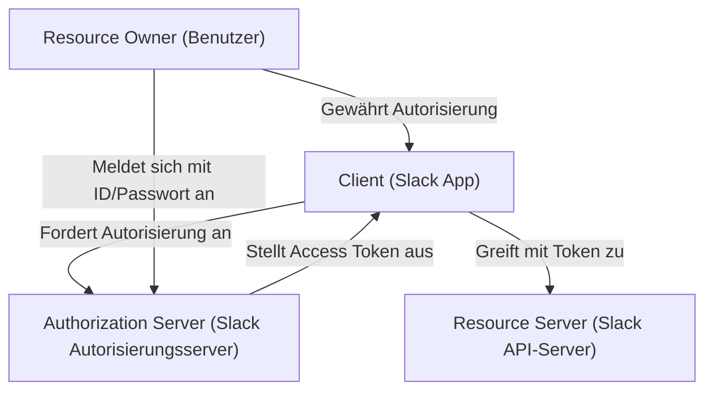
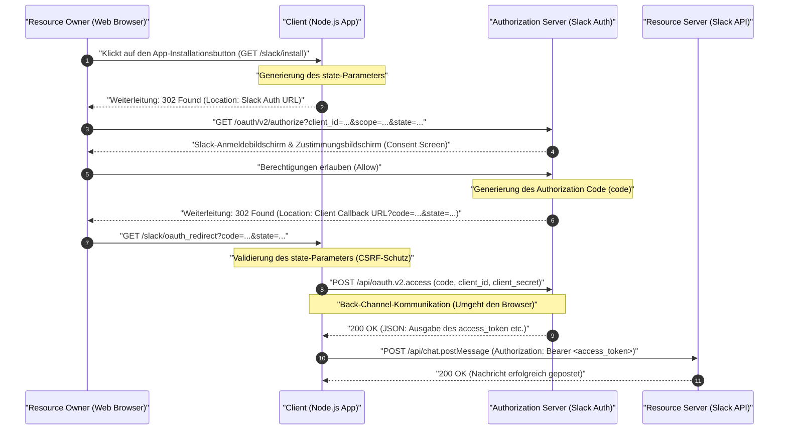
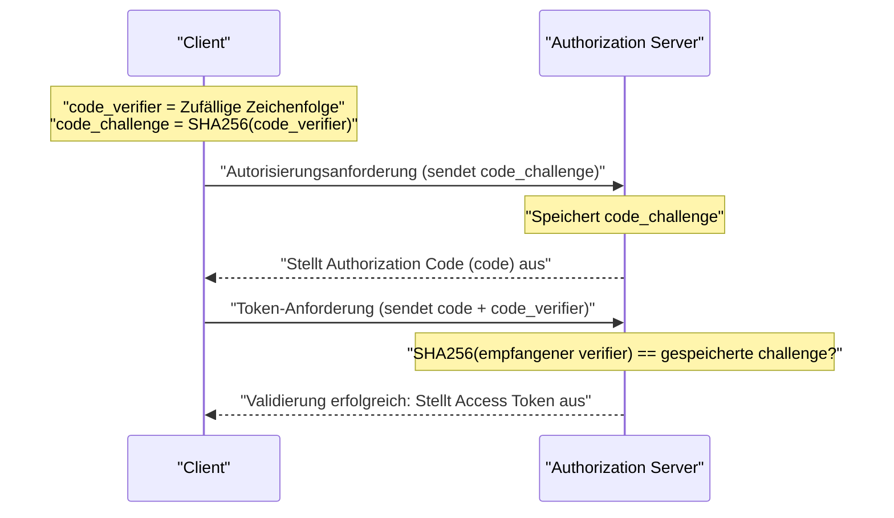

# Einführung: Warum OAuth 2.0 lernen?

In modernen Webanwendungen ist es selbstverständlich geworden, dass mehrere Dienste zusammenarbeiten. Beispiele hierfür sind "Mit Google-Konto anmelden", "Eine Benachrichtigung an Slack senden, wenn eine Trello-Aufgabe aktualisiert wird" oder "Einen Zoom-Meeting-Link automatisch in Google Kalender einfügen". Hinter all diesen Funktionen arbeitet **OAuth 2.0 (Open Authorization 2.0)**, ein Autorisierungs-Framework.

Früher wurden beim Datenaustausch zwischen verschiedenen Diensten sehr gefährliche Methoden wie "Basic Authentication" oder "Password Sharing" verwendet, bei denen Benutzer ihre ID und ihr Passwort direkt an den Zieldienst weitergaben. Bei dieser Methode hat der verknüpfte Dienst jedoch die volle Kontrolle über die Benutzerrechte, was mit fatalen Sicherheitsrisiken verbunden ist.

OAuth 2.0 wurde als Standardprotokoll (RFC 6749) entwickelt, um diese "Weitergabe von Passwörtern" zu vermeiden und Drittanbieteranwendungen "nur bestimmte Berechtigungen (Scopes)" für "eine begrenzte Zeit" zu delegieren.

In diesem Artikel werden die Mechanismen von OAuth 2.0 äußerst detailliert und praxisnah anhand der Implementierung einer Anwendung (Slack App) für **Slack (Slack API)**, dem De-facto-Standard für geschäftliche Kommunikationstools, erläutert. Es handelt sich um den ultimativen Leitfaden mit über 10.000 Zeichen, der Node.js (Express) Codebeispiele, Sequenzdiagramme zur Veranschaulichung des Protokollflusses und Einblicke in die mathematischen und kryptografischen Hintergründe wichtiger Sicherheitskonzepte wie dem `state`-Parameter und PKCE enthält.

---

# 1. Grundkonzepte von OAuth 2.0: Die vier Rollen (Roles)

Der erste Schritt zum Verständnis von OAuth 2.0 besteht darin, die beteiligten Akteure (Roles) genau zu kennen. In RFC 6749 sind die folgenden vier Rollen definiert.



1. **Resource Owner**
   - Die Entität, die berechtigt ist, Zugriff auf eine Ressource zu gewähren. Dies bezieht sich normalerweise auf den "Endbenutzer (Mensch)". In unserem Beispiel sind das "Sie selbst, der zu einem Slack-Workspace gehört und die Berechtigung hat, Nachrichten in Kanälen zu posten".
2. **Client**
   - Eine Anwendung, die versucht, mit Zustimmung des Resource Owners auf den Resource Server zuzugreifen. In unserem Beispiel ist dies "die von Ihnen entwickelte Node.js-Anwendung (Slack App)". Obwohl sie "Client" genannt wird, werden auch serverseitige Webanwendungen im Kontext von OAuth als "Clients" bezeichnet.
3. **Authorization Server**
   - Der Server, der den Resource Owner authentifiziert, die Autorisierung vom Resource Owner einholt und ein Access Token an den Client ausstellt. In unserem Beispiel ist dies die Slack-Authentifizierungsinfrastruktur, die `slack.com/oauth/v2/authorize` bereitstellt.
4. **Resource Server**
   - Der Server, der die geschützten Ressourcen hostet, Zugriffsanforderungen auf Ressourcen unter Verwendung von Access Tokens entgegennimmt und darauf antwortet. In unserem Beispiel sind dies die Endpunkte unter `slack.com/api/`, die APIs wie `chat.postMessage` bereitstellen.

Der OAuth-Flow ist kurz gesagt **"eine Abfolge von Schritten, bei der der Client mit Zustimmung des Resource Owners ein Access Token vom Authorization Server erhält und dieses verwendet, um Daten vom Resource Server abzurufen oder zu bearbeiten"**.

---

# 2. Vollständige Analyse des Authorization Code Grant

Es gibt mehrere Flows (Grant Types) in OAuth 2.0, aber in Umgebungen wie Webanwendungen, in denen ein geheimer Schlüssel (Client Secret) serverseitig sicher aufbewahrt werden kann, ist der **Authorization Code Grant** am meisten empfohlen und am weitesten verbreitet.

Das wichtigste Merkmal des Authorization Code Grants ist die klare Trennung von **Front-Channel (Kommunikation über den Browser)** und **Back-Channel (direkte Kommunikation zwischen Servern)**. Im Front-Channel wird nur ein temporärer "Authorization Code" ausgetauscht, während der endgültige Abruf des "Access Tokens" im Back-Channel erfolgt. Dadurch wird das Risiko drastisch reduziert, dass Token im Browserverlauf oder im Referrer durchsickern.

Das folgende Sequenzdiagramm zeigt den gesamten Ablauf des Authorization Code Grants in einer Slack App.



Lassen Sie uns diesen Flow Schritt für Schritt durch eine konkrete Node.js (Express) Implementierung aufschlüsseln.

---

# 3. Vorbereitung für die Implementierung: Einstellungen in der Slack Developer Console

Bevor Sie Code schreiben, müssen Sie das Slack-System darüber informieren, dass "ein neuer Client existiert".

1. Gehen Sie zu [Slack API: Applications](https://api.slack.com/apps) und klicken Sie auf "Create New App".
2. Wählen Sie "From scratch" und geben Sie den Namen der App (z.B. `My First OAuth App`) sowie den Ziel-Workspace für die Installation an.
3. Im Bildschirm "Basic Information" nach der Erstellung erhalten Sie die folgenden zwei wichtigen Anmeldeinformationen (Credentials):
   - **Client ID**: Eine ID, die Ihre App öffentlich eindeutig identifiziert. Es ist in Ordnung, diese in Browser-Anfragen (Front-Channel) einzuschließen.
   - **Client Secret**: Eine geheime Zeichenfolge, die nur Ihre App kennt. **Setzen Sie dies niemals im Browser frei und committen Sie es niemals auf GitHub oder ähnlichem.**
4. Gehen Sie zum Bildschirm "OAuth & Permissions" und registrieren Sie die Callback-URL unter "Redirect URLs". Für die lokale Entwicklung richten wir hier Folgendes ein:
   - `http://localhost:3000/slack/oauth_redirect`

Die Vorbereitungen sind nun abgeschlossen. Wir beginnen mit der Serverimplementierung.

---

# 4. Implementierungsschritt 1: `/slack/install` und der `state`-Parameter für CSRF-Schutz

Wir erstellen den ersten Endpunkt, damit Benutzer die Nutzung der App starten können (Installation im Workspace). Die größte Verantwortung hier besteht darin, den Benutzer zum Autorisierungsserver von Slack weiterzuleiten. Sicherheitstechnisch von entscheidender Bedeutung ist jedoch die **Generierung und Speicherung des `state`-Parameters**.

## Die Notwendigkeit des state-Parameters (Verhinderung von CSRF-Angriffen)

Wenn der `state`-Parameter nicht vorhanden wäre, könnte ein böswilliger Angreifer den Autorisierungsprozess mit seinem eigenen Slack-Konto starten und das Opfer dazu bringen, auf die Callback-URL zu klicken, die den abgerufenen "Authorization Code" enthält (z. B. `http://localhost:3000/slack/oauth_redirect?code=ATTACKER_CODE`). Wenn der Browser des Opfers dies ausführt, wird in der Sitzung des Opfers eine Verknüpfung mit dem Slack-Konto des Angreifers hergestellt, was zu Informationslecks oder unbeabsichtigten Aktionen (Login-CSRF) führen kann.

Um dies zu verhindern, ist `state` eine unvorhersehbare, zufällige Zeichenfolge, die verwendet wird, um zu überprüfen, ob der Browser, der die Anfrage gestartet hat, derselbe ist wie der, der den Callback empfängt.

## Entropie des state (Mathematischer Hintergrund)

Um einen sicheren `state` zu erzeugen, wird eine Zufallszahl mit ausreichender "Entropie (Informationsgehalt)" benötigt. Die Entropie $E$ hängt von der Anzahl der möglichen Zeichenfolgen $N$ ab und wird durch die folgende Formel ausgedrückt:

$$
E = \log_2(N) \quad (\text{Einheit: bits})
$$

Wenn Sie beispielsweise eine 16-Byte kryptografisch sichere Pseudozufallszahl (CSPRNG) generieren und in einen hexadezimalen String umwandeln, beträgt die Anzahl der möglichen Zustände $2^{128}$.

$$
E = \log_2(2^{128}) = 128 \text{ bits}
$$

Mit 128 Bit Entropie ist es in der modernen Informatik praktisch unmöglich (astronomische Wahrscheinlichkeit), eine Kollision durch einen Brute-Force-Angriff zu finden. Als Sicherheitsanforderung wird in der Regel ein `state` mit einer Entropie von mindestens 128 Bit empfohlen.

## Implementierung mit Node.js

```javascript
// app.js (Auszug)
const express = require('express');
const crypto = require('crypto');
const session = require('express-session');
const dotenv = require('dotenv');

dotenv.config();

const app = express();

// Konfiguration der Session-Middleware (zur Speicherung des state)
app.use(session({
  secret: process.env.SESSION_SECRET,
  resave: false,
  saveUninitialized: true,
  cookie: { secure: false } // In der Produktionsumgebung auf true setzen
}));

const SLACK_CLIENT_ID = process.env.SLACK_CLIENT_ID;
const SLACK_AUTHORIZE_URL = 'https://slack.com/oauth/v2/authorize';

app.get('/slack/install', (req, res) => {
  // Generiert eine starke 16-Byte-Zufallszahl und wandelt sie in einen Hex-String um (Entropie: 128 bits)
  const state = crypto.randomBytes(16).toString('hex');
  
  // In der Session speichern, um sie beim Callback validieren zu können
  req.session.oauth_state = state;

  // Liste der angeforderten Scopes (Berechtigungen) (kommagetrennt)
  // chat:write = Berechtigung, Nachrichten an einen Kanal zu senden
  // channels:read = Berechtigung, Informationen über öffentliche Kanäle abzurufen
  const scope = 'chat:write,channels:read';

  // URL-Parameter zur Konstruktion des Slack-Autorisierungsservers
  const params = new URLSearchParams({
    client_id: SLACK_CLIENT_ID,
    scope: scope,
    state: state,
    redirect_uri: 'http://localhost:3000/slack/oauth_redirect'
  });

  const authUrl = `${SLACK_AUTHORIZE_URL}?${params.toString()}`;
  
  // Benutzer zum Slack-Autorisierungsbildschirm weiterleiten (302 Found)
  res.redirect(authUrl);
});
```

Wenn Sie auf diesen Endpunkt zugreifen, sieht die HTTP-Antwort folgendermaßen aus:

```http
HTTP/1.1 302 Found
Location: https://slack.com/oauth/v2/authorize?client_id=123.456&scope=chat%3Awrite%2Cchannels%3Aread&state=a1b2c3d4e5f6g7h8i9j0k1l2m3n4o5p6&redirect_uri=http%3A%2F%2Flocalhost%3A3000%2Fslack%2Foauth_redirect
Set-Cookie: connect.sid=...; Path=/; HttpOnly
```

Der Browser des Benutzers wird sofort zu der angegebenen `Location` navigiert, der Slack-Bildschirm (Consent Screen) wird angezeigt, und der vertraute Bildschirm "My First OAuth App fordert Zugriff auf den Workspace an" erscheint.

---

# 5. Implementierungsschritt 2: Empfang des Callbacks und Austausch für Access Token

Wenn der Benutzer auf dem Slack-Bildschirm auf "Erlauben (Allow)" klickt, leitet der Slack-Server den Browser des Benutzers an die von Ihnen konfigurierte `redirect_uri` weiter. Dabei werden `code` (Authorization Code) und der zuvor gesendete `state` als URL-Abfrageparameter angehängt.

Im Backend führen wir die folgenden Schritte aus:
1. Überprüfen, ob der gesendete `state` exakt mit dem in der Session gespeicherten `state` übereinstimmt.
2. Wenn sie übereinstimmen, verwenden Sie den empfangenen `code`, Ihre eigene `client_id` und das geheime `client_secret`, um über den Back-Channel mit der Slack API zu kommunizieren und das Access Token anzufordern.

```javascript
const axios = require('axios');
const SLACK_CLIENT_SECRET = process.env.SLACK_CLIENT_SECRET;
const SLACK_ACCESS_TOKEN_URL = 'https://slack.com/api/oauth.v2.access';

app.get('/slack/oauth_redirect', async (req, res) => {
  const { code, state, error } = req.query;

  // Behandlung für den Fall, dass der Benutzer die Autorisierung verweigert
  if (error === 'access_denied') {
    return res.status(403).send('Zugriff verweigert.');
  }

  // 1. Validierung des state (CSRF-Schutz)
  const savedState = req.session.oauth_state;
  if (!state || state !== savedState) {
    return res.status(400).send('Invalid State Parameter (CSRF Attack Detected)');
  }

  // Löschen des verwendeten state (Schutz vor Replay-Angriffen)
  delete req.session.oauth_state;

  try {
    // 2. Austausch des Authorization Code gegen ein Access Token (Back-Channel-Kommunikation)
    const tokenResponse = await axios.post(SLACK_ACCESS_TOKEN_URL, new URLSearchParams({
      client_id: SLACK_CLIENT_ID,
      client_secret: SLACK_CLIENT_SECRET,
      code: code,
      redirect_uri: 'http://localhost:3000/slack/oauth_redirect'
    }).toString(), {
      headers: {
        'Content-Type': 'application/x-www-form-urlencoded'
      }
    });

    const data = tokenResponse.data;

    if (!data.ok) {
      console.error('Token Exchange Error:', data.error);
      return res.status(500).send(`Slack API Error: ${data.error}`);
    }

    // Erfolg! Access Token erhalten
    const accessToken = data.access_token;
    const teamName = data.team.name;
    const botUserId = data.bot_user_id;

    console.log(`Successfully installed to ${teamName}. Access Token: ${accessToken}`);

    // Normalerweise würden Sie das Token hier verschlüsseln und in einer Datenbank speichern
    // saveToDatabase(data.team.id, encrypt(accessToken));

    res.send(`Installation abgeschlossen! Workspace: ${teamName}`);

  } catch (err) {
    console.error('Network Error:', err);
    res.status(500).send('Ein Kommunikationsfehler ist aufgetreten.');
  }
});
```

Als Antwort auf diese `/api/oauth.v2.access` gibt Slack folgendes JSON zurück:

```json
{
    "ok": true,
    "app_id": "A12345678",
    "authed_user": {
        "id": "U12345678"
    },
    "scope": "chat:write,channels:read",
    "token_type": "bot",
    "access_token": "<YOUR_BOT_TOKEN_HERE>",
    "bot_user_id": "B12345678",
    "team": {
        "id": "T12345678",
        "name": "My Workspace"
    },
    "enterprise": null
}
```

Diese Zeichenfolge, die mit `xoxb-` beginnt, ist das **Bot Access Token** in Slack. Wenn die Anwendung in Zukunft eine Anfrage an die Slack API (Resource Server) sendet, wird durch Hinzufügen von `Authorization: Bearer xoxb-...` zum HTTP-Header eine Authentifizierung und der Nachweis von Berechtigungen durchgeführt.

---

# 6. Token-Scopes und das Prinzip der geringsten Rechte (Principle of Least Privilege)

Eines der wichtigsten Konzepte in OAuth 2.0 ist der "Scope" (Berechtigungsbereich). Der Scope bezieht sich auf den Bereich der Berechtigungen, die mit dem Access Token verbunden sind.

In Slack sind Berechtigungen sehr detailliert kategorisiert und werden grob in **Bot Token Scopes** und **User Token Scopes** unterteilt.
- `chat:write` (Bot): Berechtigung, Nachrichten als App (Bot) selbst im Kanal zu posten.
- `chat:write` (User): Berechtigung, Nachrichten im Namen des Benutzers zu posten, der die App installiert hat (mit dem Namen und Symbol des Benutzers).
- `channels:read`: Berechtigung, eine Liste von Kanälen abzurufen.
- `channels:history`: Berechtigung, den vergangenen Nachrichtenverlauf von Kanälen zu lesen.

Nach dem "Prinzip der geringsten Rechte" (Principle of Least Privilege), einer wichtigen Sicherheitsregel, ist es ein eiserner Grundsatz, **nur die Scopes anzufordern, die für die von der App bereitgestellten Funktionen absolut notwendig sind**. Beispielsweise sollte eine App, die "nur Benachrichtigungen sendet", nur `chat:write` anfordern und darf nicht `channels:history` (die Berechtigung, alle vergangenen Unterhaltungen zu lesen) anfordern. Dies dient dazu, den Schaden zu minimieren, falls die App jemals gehackt wird und das Token durchsickert.

---

# 7. Erweiterte Sicherheit: PKCE (Proof Key for Code Exchange)

In letzter Zeit hat sich **PKCE (Proof Key for Code Exchange, RFC 7636, ausgesprochen "Pixy")** als Standard für die weitere Stärkung der Sicherheit von OAuth 2.0 etabliert und ist weit verbreitet.

Ursprünglich wurde PKCE für "öffentliche Clients" (Public Clients) entwickelt, die das `client_secret` nicht sicher speichern können, wie native Apps (iOS/Android) oder SPAs (Single Page Applications). Heutzutage wird jedoch im Rahmen von Sicherheits-Best-Practices (OAuth 2.1 Draft) dringend empfohlen, PKCE auch bei serverseitigen "vertraulichen Clients" (Confidential Clients) einzusetzen.

## Funktionsweise und mathematischer Hintergrund von PKCE

PKCE beweist kryptografisch, dass "die Entität, die die Autorisierungsanforderung gestartet hat", und "die Entität, die den Token-Austausch anfordert", identisch sind.

1. Der Client generiert eine zufällige Zeichenfolge **`code_verifier`** (43 bis 128 Zeichen).
2. Diese wird mit **SHA-256** gehasht und BASE64URL-kodiert, was als **`code_challenge`** bezeichnet wird.

Als Formel ausgedrückt sieht das so aus:

$$
\text{code\_challenge} = \text{BASE64URL-ENCODE}( \text{SHA256}( \text{ASCII}(\text{code\_verifier}) ) )
$$

3. Wenn `/slack/install` ausgeführt wird, sendet der Client zusätzlich zu `state` die `code_challenge` und `code_challenge_method=S256` an den Autorisierungsserver (Slack). (Slack speichert dies vorübergehend).
4. Nach dem Callback, während des Token-Austauschs (`/api/oauth.v2.access`), wird der ursprüngliche **`code_verifier`** vor dem Hashing gesendet.
5. Der Autorisierungsserver (Slack) hasht den empfangenen `code_verifier` selbst mit SHA-256 und überprüft, ob er exakt mit der in Schritt 3 gespeicherten `code_challenge` übereinstimmt.



Dank dieses Mechanismus können Angreifer, selbst wenn der "Authorization Code (code)" durch eine bösartige App oder Abhören der Kommunikationswege gestohlen wird, kein Access Token erhalten, da sie den ursprünglichen `code_verifier` nicht kennen (es ist aufgrund der Natur der unidirektionalen Hashfunktion SHA-256 unmöglich, den Verifier aus der Challenge zurückzurechnen).

Derzeit unterstützen einige der neueren Flows der Slack API und andere moderne SaaS APIs (Auth0, Okta, X/Twitter API v2 usw.) PKCE, weshalb Entwickler diese Technologie aktiv nutzen sollten.

---

# 8. Sicheres Management und Betrieb von Access Tokens

Abschließend hier die Best Practices zum Speichern der abgerufenen Access Tokens.

## 1. Verschlüsselung ist für die Speicherung in der Datenbank obligatorisch
Das Access Token (`xoxb-...`) ist sozusagen der "Master-Schlüssel" zu Ihrem Slack-Workspace. Es darf nicht als Klartext in Datenbanken (MySQL, PostgreSQL, MongoDB etc.) gespeichert werden. Sollte es durch SQL-Injection oder Ähnliches zu einem Datenleck kommen, wäre dies eine Katastrophe, bei der alle Slack-Workspaces der Kunden kompromittiert würden.

Achten Sie darauf, es auf Anwendungsebene mit einer starken symmetrischen Verschlüsselung wie **AES-256-GCM** zu verschlüsseln, bevor Sie es in der DB speichern. Der Master Key für die Verschlüsselung/Entschlüsselung sollte mit einem sicheren Schlüsselverwaltungsdienst wie AWS KMS (Key Management Service) oder GCP Cloud KMS streng verwaltet werden.

## 2. Token-Rotation
Es ist riskant, langlebige Token kontinuierlich zu verwenden. In neueren OAuth-Implementierungen wird empfohlen, ein "Refresh Token" zu verwenden und alle paar Stunden ein neues Access Token auszustellen (Token Rotation). Die Slack API ermöglicht es Ihnen ebenfalls, Token Rotation durch Optionseinstellungen zu aktivieren.

---

# Zusammenfassung

In diesem Artikel haben wir den Authorization Code Grant Flow von OAuth 2.0 im Detail erläutert und dabei konkreten Node.js-Implementierungscode für eine Slack App-Integration verwendet.

1. Das Bewusstsein für die **vier Rollen (RO, Client, AS, RS)** verdeutlicht die Architektur des gesamten Systems.
2. Der **Authorization Code Grant** gewährleistet Sicherheit durch die geschickte Nutzung der Kommunikationspfade zwischen Browser und Server (Front/Back-Channel).
3. Das Verständnis der kryptografischen Mechanismen im Hintergrund, wie der CSRF-Schutz durch den **`state`-Parameter** und die Verhinderung von Authorization-Code-Intercept-Angriffen durch **PKCE**, ist der direkteste Weg zu einer sicheren Implementierung.
4. Scope-Design basierend auf dem **Prinzip der geringsten Rechte** und Verschlüsselung beim Speichern in der DB sind operativ absolut unerlässlich.

OAuth 2.0 ist sehr tiefgründig und allein die RFC-Spezifikationen sind riesig, aber durch praktisches Lernen mit Fokus auf eine echte Plattform (Slack) werden Sie in der Lage sein, dessen raffinierte Designphilosophie und robusten Sicherheitsmechanismen wirklich zu verstehen. Wir hoffen, dass Ihnen das Wissen aus diesem Artikel bei der zukünftigen Anwendungsentwicklung und API-Integration von Nutzen sein wird.
