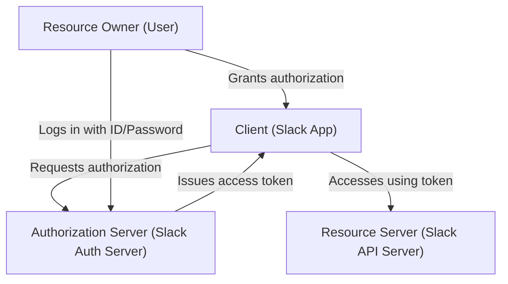
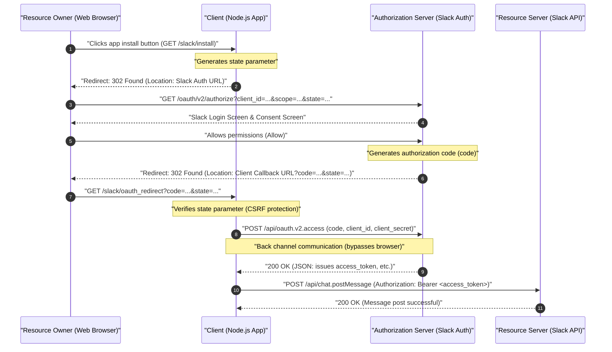
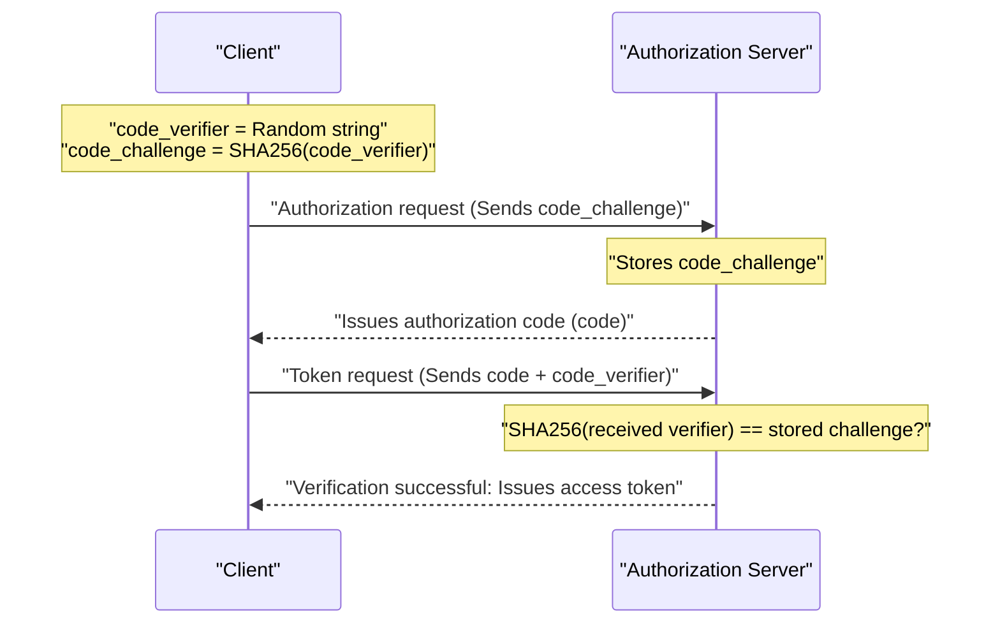

# Introduction: Why Learn OAuth 2.0?

In modern web applications, it has become commonplace for multiple services to work together. Examples include features like "Log in with Google account," "Send a Slack notification when a Trello task is updated," or "Automatically add a Zoom meeting link to Google Calendar." The authorization framework working behind the scenes for all of these is **OAuth 2.0 (Open Authorization 2.0)**.

In the past, when exchanging data between different services, highly dangerous methods such as "Basic Authentication" or "Password Sharing" were used, where the user handed their ID and password directly to the integrated service. However, this method gives the integrated service full control over the user's permissions, carrying a fatal security risk.

OAuth 2.0 was created as a standard protocol (RFC 6749) to avoid this kind of "password sharing" while delegating "only specific permissions (scopes)" for a "limited time" to third-party applications.

In this article, we will explain the mechanics of OAuth 2.0 in an extremely detailed and practical manner through the implementation of an application (Slack App) targeting **Slack (Slack API)**, which has become the de facto standard as a business communication tool. This is the definitive guide of over 10,000 characters, covering code examples using Node.js (Express), sequence diagrams illustrating the protocol flow, and even delving into the mathematical and cryptographic background of the `state` parameter and PKCE, which are crucial security concepts.

---

# 1. Basic Concepts of OAuth 2.0: The 4 Roles

The first step to understanding OAuth 2.0 is to accurately grasp the cast of characters (Roles). RFC 6749 defines the following four roles.



1. **Resource Owner**
   - The entity capable of granting access to a protected resource. This usually refers to the "end-user (human)." In our example, it is "you yourself, who belongs to a Slack workspace and has the authority to post messages in channels."
2. **Client**
   - An application making protected resource requests on behalf of the resource owner and with its authorization. In our example, it is "the Node.js application (Slack App) you are developing." Although named "Client," a web application running on the server side is also called a "Client" in the context of OAuth.
3. **Authorization Server**
   - The server issuing access tokens to the client after successfully authenticating the resource owner and obtaining authorization. In our example, it is Slack's authentication infrastructure that provides `slack.com/oauth/v2/authorize`.
4. **Resource Server**
   - The server hosting the protected resources, capable of accepting and responding to protected resource requests using access tokens. In our example, it is the `slack.com/api/` endpoints that provide APIs like `chat.postMessage`.

In a nutshell, the OAuth flow is the **"sequence of steps where the Client, with the Resource Owner's consent, receives an access token from the Authorization Server, and uses it to retrieve or manipulate data from the Resource Server."**

---

# 2. Complete Anatomy of the Authorization Code Grant

While OAuth 2.0 has several flows (grant types), the most recommended and widely used flow in environments that can securely maintain a Client Secret on the server side, such as web applications, is the **Authorization Code Grant**.

The greatest feature of the Authorization Code Grant is the clear separation between the **front channel (communication via the browser)** and the **back channel (direct communication between servers)**. By passing only a temporary "Authorization Code" through the front channel and acquiring the final "Access Token" via the back channel, it dramatically reduces the risk of the token leaking into browser history or referrers.

The following sequence diagram shows the entire process of the Authorization Code Grant in a Slack App.



Let's unravel this flow step by step through a concrete Node.js (Express) code implementation.

---

# 3. Preparation for Implementation: Settings in the Slack Developer Console

Before writing code, you need to register with the Slack system that a "new client exists."

1. Access [Slack API: Applications](https://api.slack.com/apps) and click "Create New App".
2. Select "From scratch," and specify an app name (e.g., `My First OAuth App`) and the target workspace for installation.
3. On the subsequent "Basic Information" screen, obtain the following two crucial credentials:
   - **Client ID**: An ID that publicly and uniquely identifies your app. It is fine to include this in requests going through the browser (front channel).
   - **Client Secret**: A secret string known only to your app. **Absolutely do not expose this to the browser side or commit it to GitHub, etc.**
4. Move to the "OAuth & Permissions" screen, and register your callback URL in "Redirect URLs". Assuming local development this time, configure the following:
   - `http://localhost:3000/slack/oauth_redirect`

The preparation is now complete. Let's move on to the server implementation.

---

# 4. Implementation Step 1: `/slack/install` and the CSRF Protection `state` Parameter

Create the first endpoint for the user to start using the app (install it into the workspace). While the primary responsibility here is to redirect the user to Slack's authorization server, a critically important aspect for security is the **generation and storage of the `state` parameter**.

## The Necessity of the state Parameter (Preventing CSRF Attacks)

If the `state` parameter did not exist, a malicious attacker could start the authorization process with their own Slack account and trick a victim into stepping on a callback URL containing the obtained "authorization code" (e.g., `http://localhost:3000/slack/oauth_redirect?code=ATTACKER_CODE`). If the victim's browser executes this, the attacker's Slack account will be linked to the victim's session, causing information leaks or unintended operations (Login CSRF).

To prevent this, `state` is an unpredictable random string used to verify that the browser initiating the request and the browser receiving the callback are identical.

## Entropy of state (Mathematical Background)

To generate a secure `state`, a random number with sufficient "entropy (information content)" is required. The entropy $E$ depends on the number of possible strings $N$ generated, and is expressed by the following formula.

$$
E = \log_2(N) \quad (\text{Unit: bits})
$$

For example, if you generate a 16-byte cryptographically secure pseudorandom number (CSPRNG) and convert it into a hexadecimal (Hex) string, the number of states that can be represented is $2^{128}$.

$$
E = \log_2(2^{128}) = 128 \text{ bits}
$$

With 128 bits of entropy, it is virtually impossible (an astronomical probability) to find a collision via a brute-force attack in modern computer science. Typically, a `state` with at least 128 bits of entropy is recommended as a security requirement.

## Implementation with Node.js

```javascript
// app.js (Excerpt)
const express = require('express');
const crypto = require('crypto');
const session = require('express-session');
const dotenv = require('dotenv');

dotenv.config();

const app = express();

// Session middleware configuration (to store state)
app.use(session({
  secret: process.env.SESSION_SECRET,
  resave: false,
  saveUninitialized: true,
  cookie: { secure: false } // Set to true in production environment
}));

const SLACK_CLIENT_ID = process.env.SLACK_CLIENT_ID;
const SLACK_AUTHORIZE_URL = 'https://slack.com/oauth/v2/authorize';

app.get('/slack/install', (req, res) => {
  // Generate a strong 16-byte random number and convert to hex string (Entropy: 128 bits)
  const state = crypto.randomBytes(16).toString('hex');
  
  // Store it in the session so it can be verified during the callback
  req.session.oauth_state = state;

  // List of required scopes (permissions), comma-separated
  // chat:write = Permission to send messages to a channel
  // channels:read = Permission to retrieve info of public channels
  const scope = 'chat:write,channels:read';

  // URL parameters to construct for Slack's authorization server
  const params = new URLSearchParams({
    client_id: SLACK_CLIENT_ID,
    scope: scope,
    state: state,
    redirect_uri: 'http://localhost:3000/slack/oauth_redirect'
  });

  const authUrl = `${SLACK_AUTHORIZE_URL}?${params.toString()}`;
  
  // Redirect user to Slack's authorization screen (302 Found)
  res.redirect(authUrl);
});
```

When you access this endpoint, the HTTP response will look like the following:

```http
HTTP/1.1 302 Found
Location: https://slack.com/oauth/v2/authorize?client_id=123.456&scope=chat%3Awrite%2Cchannels%3Aread&state=a1b2c3d4e5f6g7h8i9j0k1l2m3n4o5p6&redirect_uri=http%3A%2F%2Flocalhost%3A3000%2Fslack%2Foauth_redirect
Set-Cookie: connect.sid=...; Path=/; HttpOnly
```

The user's browser immediately navigates to the specified `Location`, the Slack screen (Consent Screen) is displayed, and the familiar screen saying "My First OAuth App is requesting access to your workspace" appears.

---

# 5. Implementation Step 2: Receiving the Callback and Exchanging for an Access Token

When the user clicks "Allow" on the Slack screen, Slack's server redirects the user's browser to the configured `redirect_uri`. At that time, `code` (the authorization code) and the previously sent `state` are appended as URL query parameters.

The backend performs the following processes:
1. Verify that the received `state` exactly matches the `state` stored in the session.
2. If they match, use the received `code`, your `client_id`, and the secret `client_secret` to communicate with the Slack API via the back channel and request an access token.

```javascript
const axios = require('axios');
const SLACK_CLIENT_SECRET = process.env.SLACK_CLIENT_SECRET;
const SLACK_ACCESS_TOKEN_URL = 'https://slack.com/api/oauth.v2.access';

app.get('/slack/oauth_redirect', async (req, res) => {
  const { code, state, error } = req.query;

  // Handling if the user denied the authorization
  if (error === 'access_denied') {
    return res.status(403).send('Access was denied.');
  }

  // 1. Verify state (CSRF protection)
  const savedState = req.session.oauth_state;
  if (!state || state !== savedState) {
    return res.status(400).send('Invalid State Parameter (CSRF Attack Detected)');
  }

  // Delete the used state (Prevent Replay Attacks)
  delete req.session.oauth_state;

  try {
    // 2. Exchange authorization code for an access token (Back channel communication)
    const tokenResponse = await axios.post(SLACK_ACCESS_TOKEN_URL, new URLSearchParams({
      client_id: SLACK_CLIENT_ID,
      client_secret: SLACK_CLIENT_SECRET,
      code: code,
      redirect_uri: 'http://localhost:3000/slack/oauth_redirect'
    }).toString(), {
      headers: {
        'Content-Type': 'application/x-www-form-urlencoded'
      }
    });

    const data = tokenResponse.data;

    if (!data.ok) {
      console.error('Token Exchange Error:', data.error);
      return res.status(500).send(`Slack API Error: ${data.error}`);
    }

    // Success! Access token acquired
    const accessToken = data.access_token;
    const teamName = data.team.name;
    const botUserId = data.bot_user_id;

    console.log(`Successfully installed to ${teamName}. Access Token: ${accessToken}`);

    // Normally, you would encrypt the token here and save it to the database
    // saveToDatabase(data.team.id, encrypt(accessToken));

    res.send(`Installation completed! Workspace: ${teamName}`);

  } catch (err) {
    console.error('Network Error:', err);
    res.status(500).send('A communication error occurred.');
  }
});
```

As the response to this `/api/oauth.v2.access`, Slack returns a JSON like the following.

```json
{
    "ok": true,
    "app_id": "A12345678",
    "authed_user": {
        "id": "U12345678"
    },
    "scope": "chat:write,channels:read",
    "token_type": "bot",
    "access_token": "<YOUR_BOT_TOKEN_HERE>",
    "bot_user_id": "B12345678",
    "team": {
        "id": "T12345678",
        "name": "My Workspace"
    },
    "enterprise": null
}
```

This string starting with `xoxb-` is the **Bot Access Token** in Slack. From then on, when the application sends a request to the Slack API (Resource Server), authentication and proof of authority are performed by appending `Authorization: Bearer xoxb-...` to the HTTP header.

---

# 6. Token Scopes and the Principle of Least Privilege

One of the most important concepts in OAuth 2.0 is "Scope". Scope refers to the extent of permissions bound to an access token.

In Slack, permissions are classified very granularly and are broadly divided into **Bot Token Scopes** and **User Token Scopes**.
- `chat:write` (Bot): Permission to post messages to channels as the app (bot) itself.
- `chat:write` (User): Permission to post messages on behalf of the user who installed the app (with the user's name and icon).
- `channels:read`: Permission to view the list of channels.
- `channels:history`: Permission to read the past message history of a channel.

Following the absolute rule of security, the "Principle of Least Privilege", it is a hard rule to **request only the scopes that are truly essential for the features your app provides**. For example, an app that "just sends notifications" should only request `chat:write`, and must not request `channels:history` (permission to read all past conversations). This is to minimize the damage in the unlikely event the app is hacked and the token is leaked.

---

# 7. Advanced Security: PKCE (Proof Key for Code Exchange)

Recently, as a mechanism to further strengthen the security of OAuth 2.0, **PKCE (Proof Key for Code Exchange, RFC 7636, pronounced "pixy")** has been standardized and is widely used.

Originally, PKCE was designed for "public clients" like native apps (iOS/Android) and SPAs (Single Page Applications) that cannot securely store a `client_secret`. However, currently, in security best practices (OAuth 2.1 Draft), the use of PKCE is strongly recommended even for server-side "confidential clients".

## How PKCE Works and its Mathematical Background

PKCE cryptographically proves that the "party that initiated the authorization request" and the "party making the token exchange request" are identical.

1. The client generates a random string **`code_verifier`** (43-128 characters).
2. This is hashed using **SHA-256**, and the BASE64URL encoded result is set as the **`code_challenge`**.

Expressed in a formula, it looks like this:

$$
\text{code\_challenge} = \text{BASE64URL-ENCODE}( \text{SHA256}( \text{ASCII}(\text{code\_verifier}) ) )
$$

3. During `/slack/install`, the client sends `code_challenge` and `code_challenge_method=S256` to the authorization server (Slack), in addition to `state` (Slack temporarily stores this).
4. After the callback, during the token exchange (`/api/oauth.v2.access`), the original **`code_verifier`** before hashing is sent.
5. The authorization server (Slack) hashes the received `code_verifier` itself using SHA-256, and verifies if it completely matches the `code_challenge` stored in Step 3.



Through this mechanism, even if the "authorization code (code)" is stolen by a malicious app or through eavesdropping on the communication channel, the attacker cannot obtain the access token because they do not know the original `code_verifier` (due to the nature of the irreversible hash function SHA-256, it is impossible to reverse-calculate the verifier from the challenge).

Currently, newer flows of the Slack API and other modern SaaS APIs (Auth0, Okta, X/Twitter API v2, etc.) are increasingly supporting PKCE, making it a technology that developers should actively adopt.

---

# 8. Secure Management and Operation of Access Tokens

Finally, here are best practices for storing the acquired access tokens.

## 1. Encryption is Mandatory for Database Storage
An access token (`xoxb-...`) is the very "master key" to the Slack workspace. It must not be stored in plaintext in a database (MySQL, PostgreSQL, MongoDB, etc.). In the unlikely event of a database breach via SQL injection or similar, it would result in a disaster where all customers' Slack workspaces are hijacked.

Always encrypt it at the application layer using a strong symmetric key encryption such as **AES-256-GCM** before saving it to the DB. The master key for encryption/decryption should be strictly managed using a secure key management service like AWS KMS (Key Management Service) or GCP Cloud KMS.

## 2. Token Rotation
Continuing to use a long-lived token carries risks. In modern OAuth implementations, it is recommended to adopt a mechanism to reissue a new access token every few hours using a "Refresh Token" (Token Rotation). In the Slack API as well, it is possible to enable token rotation via optional settings.

---

# Conclusion

In this article, we explained the OAuth 2.0 Authorization Code Grant flow in detail, along with concrete Node.js implementation code for Slack App integration.

1. Being aware of the **4 roles (RO, Client, AS, RS)** clarifies the architecture of the entire system.
2. The **Authorization Code Grant** guarantees safety by skillfully utilizing the communication paths (front/back channels) between the browser and the server.
3. Understanding the underlying cryptographic mechanisms, such as CSRF defense via the **`state` parameter** and prevention of authorization code intercept attacks via **PKCE**, is a shortcut to secure implementation.
4. Scope design based on the **Principle of Least Privilege** and encryption when saving to the DB are absolutely indispensable elements in operation.

OAuth 2.0 is very deep, and there are massive specifications just within the RFCs. However, by getting your hands dirty and learning while targeting an actual platform (Slack) like this, you should be able to experience its refined design philosophy and robust security mechanisms. We hope the knowledge in this article will be useful in your future application development and API integration implementations.
