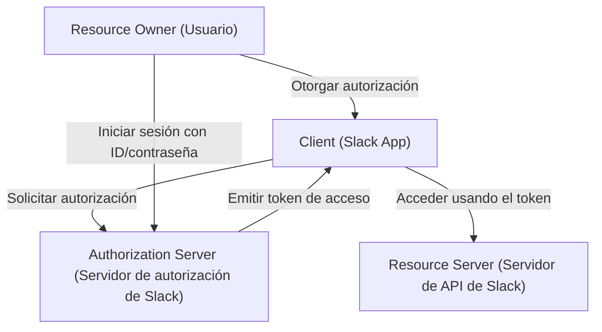
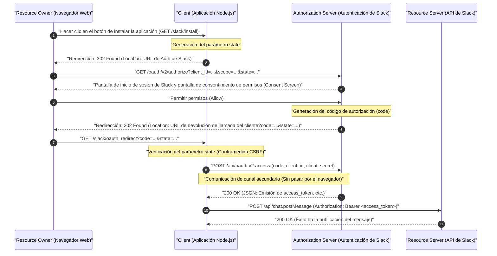
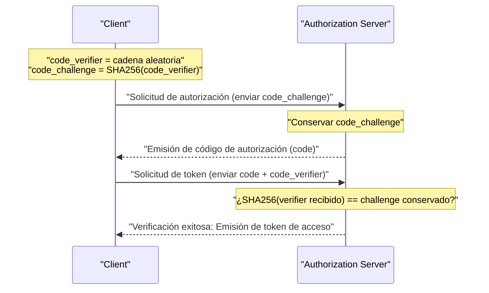

# Introducción: ¿Por qué aprender OAuth 2.0?

En las aplicaciones web modernas, es algo muy común que múltiples servicios trabajen juntos. Por ejemplo, funciones como "iniciar sesión con una cuenta de Google", "enviar una notificación a Slack cuando se actualice una tarea en Trello" o "agregar automáticamente un enlace de reunión de Zoom a Google Calendar". Detrás de todas estas funciones trabaja el marco de autorización llamado **OAuth 2.0 (Open Authorization 2.0)**.

Anteriormente, al intercambiar datos entre diferentes servicios, se utilizaban métodos muy peligrosos como la "autenticación básica" o el "uso compartido de contraseñas", donde el usuario entregaba directamente su ID y contraseña al servicio conectado. Sin embargo, con este método, el servicio conectado tomaba control de todos los permisos del usuario, lo que conllevaba un riesgo de seguridad fatal.

OAuth 2.0 nació como un protocolo estándar (RFC 6749) para evitar este "uso compartido de contraseñas" y delegar "solo permisos específicos (alcances)" a aplicaciones de terceros por "un tiempo limitado".

En este artículo, explicaremos de manera muy detallada y práctica el funcionamiento de este OAuth 2.0 mediante la implementación de una aplicación (Slack App) para **Slack (Slack API)**, que se ha convertido en un estándar de facto como herramienta de comunicación empresarial. Es una guía definitiva de más de 10.000 caracteres que incluye ejemplos de código usando Node.js (Express), diagramas de secuencia que ilustran el flujo del protocolo, e incluso profundiza en el trasfondo matemático y criptográfico del parámetro `state` y PKCE, que son conceptos importantes de seguridad.

---

# 1. Conceptos básicos de OAuth 2.0: 4 roles

El primer paso para entender OAuth 2.0 es comprender con precisión a los personajes (Roles). En RFC 6749, se definen los siguientes 4 roles.



1. **Resource Owner (Propietario del recurso)**
   - Es la entidad que tiene la autoridad para otorgar derechos de acceso a un recurso. Normalmente se refiere al "usuario final (humano)". En este ejemplo, eres "tú mismo, que perteneces a un espacio de trabajo de Slack y tienes permiso para publicar mensajes en los canales".
2. **Client (Cliente)**
   - Es la aplicación que intenta acceder al servidor de recursos obteniendo el permiso del propietario del recurso. En este ejemplo, es "la aplicación de Node.js que estás desarrollando (Slack App)". Aunque se llama "cliente", incluso las aplicaciones web que se ejecutan en el lado del servidor se llaman "clientes" en el contexto de OAuth.
3. **Authorization Server (Servidor de autorización)**
   - Es el servidor que autentica al propietario del recurso y emite tokens de acceso al cliente después de obtener la autorización del propietario del recurso. En este ejemplo, es la infraestructura de autenticación de Slack que proporciona `slack.com/oauth/v2/authorize`.
4. **Resource Server (Servidor de recursos)**
   - Es el servidor que aloja los recursos protegidos y acepta y responde a las solicitudes de acceso a recursos utilizando tokens de acceso. En este ejemplo, son los puntos finales de `slack.com/api/` que proporcionan APIs como `chat.postMessage`.

El flujo de OAuth, en pocas palabras, es **"una serie de pasos en los que el Cliente obtiene el consentimiento del Propietario del recurso, recibe un token de acceso del Servidor de autorización, y lo utiliza para obtener y manipular datos del Servidor de recursos"**.

---

# 2. Anatomía completa del flujo de concesión de código de autorización (Authorization Code Grant)

Aunque OAuth 2.0 tiene múltiples flujos (tipos de concesión), el más recomendado y utilizado en entornos donde una clave secreta (Client Secret) puede mantenerse segura en el lado del servidor, como en aplicaciones web, es la **Concesión de código de autorización (Authorization Code Grant)**.

La mayor característica de la concesión de código de autorización es que separa claramente el **canal frontal (comunicación a través del navegador)** y el **canal secundario (comunicación directa entre servidores)**. En el canal frontal solo se pasa un "código de autorización (Authorization Code)" temporal, y la adquisición del "token de acceso" final se realiza en el canal secundario, lo que reduce drásticamente el riesgo de que el token se filtre al historial del navegador o a los referenciadores.

El siguiente diagrama de secuencia muestra todo el proceso de concesión de código de autorización en una Slack App.



Analicemos este flujo paso a paso a través de la implementación de código específico en Node.js (Express).

---

# 3. Preparación de la implementación: Configuración en la Consola para Desarrolladores de Slack (Slack Developer Console)

Antes de escribir código, es necesario registrar en el sistema de Slack que "existe un nuevo cliente".

1. Accede a [Slack API: Applications](https://api.slack.com/apps) y haz clic en "Create New App".
2. Selecciona "From scratch" y especifica el nombre de la aplicación (ej. `My First OAuth App`) y el espacio de trabajo de instalación.
3. En la pantalla de "Basic Information" después de la creación, obtén las siguientes 2 credenciales importantes.
   - **Client ID**: ID que identifica de forma pública y única a tu aplicación. No hay problema si se incluye en solicitudes que pasen por el navegador (canal frontal).
   - **Client Secret**: Cadena secreta que solo tu aplicación conoce. **Nunca debes exponerla en el lado del navegador, ni hacer commit en GitHub u otros repositorios.**
4. Ve a la pantalla de "OAuth & Permissions" y registra la URL de devolución de llamada en "Redirect URLs". Esta vez asumiremos desarrollo local y configuraremos lo siguiente:
   - `http://localhost:3000/slack/oauth_redirect`

Con esto, la preparación está completa. Pasemos a la implementación del servidor.

---

# 4. Paso de implementación 1: `/slack/install` y el parámetro `state` como medida contra CSRF

Crearemos el primer punto final (endpoint) para que el usuario comience a usar la aplicación (instalarla en el espacio de trabajo). La responsabilidad principal aquí es redirigir al usuario al servidor de autorización de Slack, pero lo más importante a nivel de seguridad es la **generación y almacenamiento del parámetro `state`**.

## Necesidad del parámetro state (Prevención de ataques CSRF)

Si no existe el parámetro `state`, un atacante malintencionado puede iniciar el proceso de autorización con su propia cuenta de Slack y hacer que la víctima acceda a la URL de devolución de llamada que contiene el "código de autorización" obtenido (ej: `http://localhost:3000/slack/oauth_redirect?code=ATTACKER_CODE`). Cuando el navegador de la víctima ejecuta esto, la vinculación con la cuenta de Slack del atacante se completa en la sesión de la víctima, causando fugas de información o acciones involuntarias (Login CSRF).

Para prevenir esto, `state` es una cadena aleatoria impredecible para verificar que el navegador que inició la solicitud y el navegador que recibió la devolución de llamada son el mismo.

## Entropía de state (Trasfondo matemático)

Para generar un `state` seguro, se requiere un número aleatorio con suficiente "entropía (cantidad de información)". La entropía $E$ depende del tipo de cadena generada $N$ y se expresa mediante la siguiente fórmula.

$$
E = \log_2(N) \quad (\text{Unidad: bits})
$$

Por ejemplo, si se genera un número pseudoaleatorio criptográficamente seguro (CSPRNG) de 16 bytes y se convierte a una cadena hexadecimal (Hex), el número de estados representables es $2^{128}$.

$$
E = \log_2(2^{128}) = 128 \text{ bits}
$$

Con 128 bits de entropía, es prácticamente imposible (probabilidad astronómica) encontrar una colisión mediante ataques de fuerza bruta (brute force) en la informática moderna. Normalmente, como requisito de seguridad, se recomienda un `state` con una entropía de al menos 128 bits.

## Implementación en Node.js

```javascript
// app.js (Extracto parcial)
const express = require('express');
const crypto = require('crypto');
const session = require('express-session');
const dotenv = require('dotenv');

dotenv.config();

const app = express();

// Configuración de middleware de sesión (para guardar el state)
app.use(session({
  secret: process.env.SESSION_SECRET,
  resave: false,
  saveUninitialized: true,
  cookie: { secure: false } // Cambiar a true en entorno de producción
}));

const SLACK_CLIENT_ID = process.env.SLACK_CLIENT_ID;
const SLACK_AUTHORIZE_URL = 'https://slack.com/oauth/v2/authorize';

app.get('/slack/install', (req, res) => {
  // Generar un número aleatorio fuerte de 16 bytes y convertirlo a cadena hexadecimal (Entropía: 128 bits)
  const state = crypto.randomBytes(16).toString('hex');
  
  // Guardarlo en sesión para poder verificarlo durante la devolución de llamada
  req.session.oauth_state = state;

  // Lista de alcances (permisos) solicitados (separados por comas)
  // chat:write = Permiso para enviar mensajes a canales
  // channels:read = Permiso para obtener información de canales públicos
  const scope = 'chat:write,channels:read';

  // Construcción de parámetros de URL para el servidor de autorización de Slack
  const params = new URLSearchParams({
    client_id: SLACK_CLIENT_ID,
    scope: scope,
    state: state,
    redirect_uri: 'http://localhost:3000/slack/oauth_redirect'
  });

  const authUrl = `${SLACK_AUTHORIZE_URL}?${params.toString()}`;
  
  // Redirigir al usuario a la pantalla de autorización de Slack (302 Found)
  res.redirect(authUrl);
});
```

Cuando accedes a este punto final, la respuesta HTTP será la siguiente:

```http
HTTP/1.1 302 Found
Location: https://slack.com/oauth/v2/authorize?client_id=123.456&scope=chat%3Awrite%2Cchannels%3Aread&state=a1b2c3d4e5f6g7h8i9j0k1l2m3n4o5p6&redirect_uri=http%3A%2F%2Flocalhost%3A3000%2Fslack%2Foauth_redirect
Set-Cookie: connect.sid=...; Path=/; HttpOnly
```

El navegador del usuario transitará instantáneamente a la `Location` especificada, y se mostrará la pantalla de Slack (Pantalla de consentimiento), apareciendo la conocida pantalla "My First OAuth App solicita acceso a su espacio de trabajo".

---

# 5. Paso de implementación 2: Recepción de la devolución de llamada (callback) e intercambio de tokens de acceso

Cuando el usuario hace clic en "Permitir (Allow)" en la pantalla de Slack, el servidor de Slack redirigirá el navegador del usuario a la `redirect_uri` configurada. En este proceso, se añadirán como parámetros de consulta en la URL el `code` (código de autorización) y el `state` enviado anteriormente.

En el backend, se realiza el siguiente procesamiento:
1. Verificar que el `state` recibido y el `state` guardado en la sesión coincidan exactamente.
2. Si coinciden, utilizar el `code` recibido, tu `client_id` y la información secreta `client_secret` para comunicarse mediante el canal secundario con la API de Slack y solicitar un token de acceso.

```javascript
const axios = require('axios');
const SLACK_CLIENT_SECRET = process.env.SLACK_CLIENT_SECRET;
const SLACK_ACCESS_TOKEN_URL = 'https://slack.com/api/oauth.v2.access';

app.get('/slack/oauth_redirect', async (req, res) => {
  const { code, state, error } = req.query;

  // Manejo del caso en el que el usuario haya denegado la autorización
  if (error === 'access_denied') {
    return res.status(403).send('El acceso fue denegado.');
  }

  // 1. Verificación del state (Contramedida CSRF)
  const savedState = req.session.oauth_state;
  if (!state || state !== savedState) {
    return res.status(400).send('Invalid State Parameter (CSRF Attack Detected)');
  }

  // Eliminar el state usado (Prevención de ataques de repetición)
  delete req.session.oauth_state;

  try {
    // 2. Intercambio del código de autorización por un token de acceso (Comunicación de canal secundario)
    const tokenResponse = await axios.post(SLACK_ACCESS_TOKEN_URL, new URLSearchParams({
      client_id: SLACK_CLIENT_ID,
      client_secret: SLACK_CLIENT_SECRET,
      code: code,
      redirect_uri: 'http://localhost:3000/slack/oauth_redirect'
    }).toString(), {
      headers: {
        'Content-Type': 'application/x-www-form-urlencoded'
      }
    });

    const data = tokenResponse.data;

    if (!data.ok) {
      console.error('Token Exchange Error:', data.error);
      return res.status(500).send(`Slack API Error: ${data.error}`);
    }

    // ¡Éxito! Token de acceso obtenido
    const accessToken = data.access_token;
    const teamName = data.team.name;
    const botUserId = data.bot_user_id;

    console.log(`Successfully installed to ${teamName}. Access Token: ${accessToken}`);

    // Idealmente aquí se guardaría el token encriptado en la base de datos
    // saveToDatabase(data.team.id, encrypt(accessToken));

    res.send(`¡Instalación completada! Espacio de trabajo: ${teamName}`);

  } catch (err) {
    console.error('Network Error:', err);
    res.status(500).send('Ocurrió un error de comunicación.');
  }
});
```

Como respuesta de este `/api/oauth.v2.access`, Slack devolverá un JSON como el siguiente:

```json
{
    "ok": true,
    "app_id": "A12345678",
    "authed_user": {
        "id": "U12345678"
    },
    "scope": "chat:write,channels:read",
    "token_type": "bot",
    "access_token": "<YOUR_BOT_TOKEN_HERE>",
    "bot_user_id": "B12345678",
    "team": {
        "id": "T12345678",
        "name": "My Workspace"
    },
    "enterprise": null
}
```

Esta cadena que comienza con `xoxb-` es el **Token de acceso de Bot** en Slack. En adelante, cuando la aplicación envíe solicitudes a la API de Slack (Servidor de recursos), agregará `Authorization: Bearer xoxb-...` en el encabezado HTTP para probar la autenticación y los permisos.

---

# 6. Alcance del token y el Principio de Menor Privilegio (Principle of Least Privilege)

Uno de los conceptos más importantes en OAuth 2.0 es el "Alcance (Scope)". El alcance se refiere al rango de permisos asociados con un token de acceso.

En Slack, los permisos están clasificados muy detalladamente, y se dividen a grandes rasgos en **Bot Token Scopes** y **User Token Scopes**.
- `chat:write` (Bot): Permiso para que la aplicación (bot) misma publique mensajes en canales.
- `chat:write` (User): Permiso para publicar mensajes en nombre del usuario que instaló la aplicación (usando el nombre e ícono del usuario).
- `channels:read`: Permiso para obtener la lista de canales.
- `channels:history`: Permiso para leer el historial de mensajes pasados del canal.

Siguiendo la regla de oro de la seguridad, el "Principio de Menor Privilegio (Principle of Least Privilege)", es una regla estricta **solicitar solo los alcances que sean verdaderamente indispensables para las funciones que proporciona la aplicación**. Por ejemplo, una aplicación que "solo envía notificaciones" debería solicitar solo `chat:write`, y no debería solicitar `channels:history` (permiso para leer todas las conversaciones pasadas). Esto es para minimizar los daños en caso de que la aplicación sea hackeada y el token se filtre.

---

# 7. Seguridad más avanzada: PKCE (Proof Key for Code Exchange)

Últimamente, como mecanismo para fortalecer aún más la seguridad de OAuth 2.0, **PKCE (Proof Key for Code Exchange, RFC 7636, pronunciado "pixy")** se ha estandarizado y es ampliamente utilizado.

Originalmente, PKCE fue diseñado para "clientes públicos", como aplicaciones nativas (iOS/Android) o SPA (Single Page Application), que no pueden guardar el `client_secret` de manera segura. Sin embargo, en la actualidad, en las mejores prácticas de seguridad (Borrador de OAuth 2.1), se recomienda fuertemente el uso de PKCE incluso en "clientes confidenciales" del lado del servidor.

## Funcionamiento de PKCE y su trasfondo matemático

PKCE demuestra criptográficamente que "el que inició la solicitud de autorización" y "el que solicita el intercambio de tokens" son el mismo.

1. El cliente genera una cadena aleatoria **`code_verifier`** (entre 43 y 128 caracteres).
2. Ésta es cifrada (hash) con **SHA-256** y codificada en BASE64URL para convertirse en el **`code_challenge`**.

Expresado en forma de ecuación matemática, sería lo siguiente:

$$
\text{code\_challenge} = \text{BASE64URL-ENCODE}( \text{SHA256}( \text{ASCII}(\text{code\_verifier}) ) )
$$

3. Al ejecutar `/slack/install`, el cliente envía `code_challenge` y `code_challenge_method=S256` además del `state` al servidor de autorización (Slack) (Slack lo guarda temporalmente).
4. Después de la devolución de llamada, al realizar el intercambio de tokens (`/api/oauth.v2.access`), se envía el **`code_verifier`** original antes de aplicar el hash.
5. El servidor de autorización (Slack) aplica un hash SHA-256 al `code_verifier` recibido y verifica si coincide exactamente con el `code_challenge` que había guardado en el paso 3.



Con este mecanismo, incluso si una aplicación maliciosa o alguien interceptando el canal de comunicación roba el "código de autorización (code)", el atacante no conoce el `code_verifier` original (debido a la naturaleza unidireccional e irreversible de la función hash SHA-256, es imposible revertir el challenge para obtener el verifier), y por lo tanto, no puede obtener un token de acceso.

Actualmente, el soporte de PKCE está avanzando en algunos de los nuevos flujos de la API de Slack y otras APIs de SaaS modernas (Auth0, Okta, X/Twitter API v2, etc.), convirtiéndose en una tecnología que los desarrolladores deberían adoptar activamente.

---

# 8. Gestión y operación seguras de tokens de acceso

Por último, aquí están las mejores prácticas sobre cómo guardar los tokens de acceso obtenidos.

## 1. La encriptación es obligatoria al guardar en bases de datos
Los tokens de acceso (`xoxb-...`) son literalmente "llaves maestras" para tu espacio de trabajo de Slack. No deben ser guardados en texto plano en la base de datos (MySQL, PostgreSQL, MongoDB, etc.). En el improbable caso de que la base de datos se filtre por algo como una inyección SQL, se convertiría en un desastre masivo donde los Slacks de todos los clientes serían secuestrados.

Asegúrate siempre de encriptarlos a nivel de aplicación usando encriptación de clave simétrica fuerte como **AES-256-GCM** antes de guardarlos en la base de datos. La clave maestra para encriptación/desencriptación debe ser gestionada rigurosamente utilizando servicios seguros de gestión de claves como AWS KMS (Key Management Service) o GCP Cloud KMS.

## 2. Rotación de tokens (Token Rotation)
Continuar utilizando un token válido a largo plazo conlleva riesgos. En las últimas implementaciones de OAuth, se recomienda incorporar un mecanismo (Rotación de tokens) en el que se utiliza un "Token de actualización (Refresh Token)" para emitir nuevos tokens de acceso cada pocas horas. En la API de Slack, también es posible habilitar la rotación de tokens mediante configuración de opciones.

---

# Conclusión

En este artículo, explicamos detalladamente el flujo de concesión de código de autorización de OAuth 2.0, entrelazando códigos de implementación específicos de Node.js para la integración de la Slack App.

1. Al ser consciente de los **4 roles (RO, Client, AS, RS)**, la arquitectura de todo el sistema se vuelve clara.
2. La **Concesión de código de autorización** garantiza la seguridad utilizando hábilmente las rutas de comunicación entre el navegador y el servidor (canal frontal / canal secundario).
3. Comprender los mecanismos criptográficos subyacentes, como la defensa CSRF mediante el **parámetro `state`** y la prevención de ataques de intercepción de código de autorización mediante **PKCE**, es el atajo hacia una implementación segura.
4. El diseño de alcances basado en el **Principio de Menor Privilegio** y la encriptación al guardar en la base de datos son elementos absolutamente indispensables a nivel operativo.

OAuth 2.0 es muy profundo, e incluso hay especificaciones enormes solo en las RFC, pero al aprender de manera práctica enfocándose en una plataforma real (Slack) de esta manera, deberías poder sentir su sofisticada filosofía de diseño y mecanismos de seguridad robustos. Espero que el conocimiento de este artículo sea útil para el futuro desarrollo de aplicaciones y la implementación de integraciones de API.
