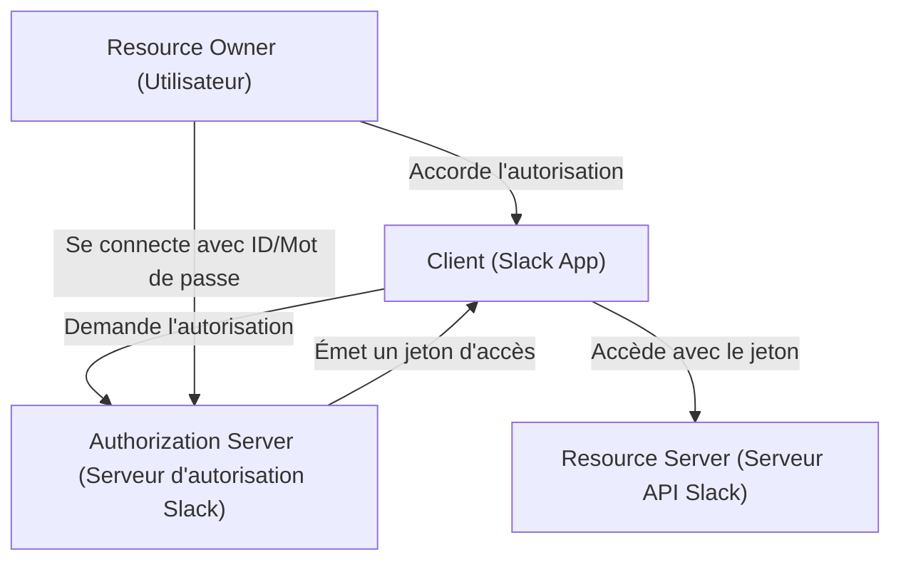
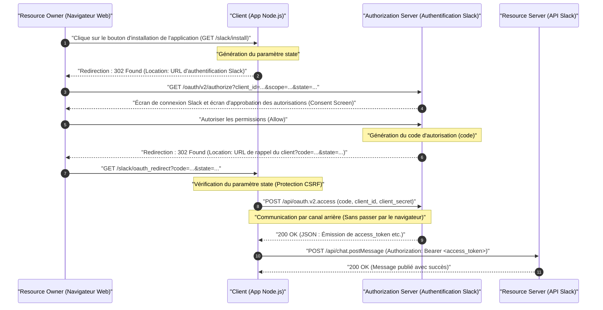
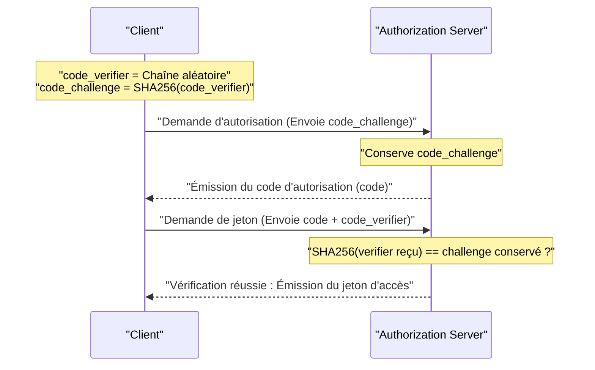

# Introduction : Pourquoi apprendre OAuth 2.0 ?

Dans les applications Web modernes, il est devenu courant que plusieurs services collaborent ensemble. Par exemple, des fonctionnalités telles que "Se connecter avec un compte Google", "Envoyer une notification à Slack lorsqu'une tâche Trello est mise à jour" ou "Ajouter automatiquement un lien de réunion Zoom à Google Agenda". Dans les coulisses de toutes ces actions se trouve le framework d'autorisation appelé **OAuth 2.0 (Open Authorization 2.0)**.

Auparavant, lors de l'échange de données entre différents services, des méthodes extrêmement dangereuses appelées "authentification de base" et "partage de mot de passe" étaient utilisées, où l'utilisateur donnait directement son identifiant et son mot de passe au service partenaire. Cependant, avec cette méthode, le service partenaire détient tous les droits de l'utilisateur, ce qui entraîne des risques de sécurité critiques.

OAuth 2.0 a été créé en tant que protocole standard (RFC 6749) pour éviter un tel "partage de mot de passe" tout en déléguant à des applications tierces "uniquement des autorisations spécifiques (portées)" pour "une durée limitée".

Dans cet article, nous expliquerons le fonctionnement d'OAuth 2.0 de manière extrêmement détaillée et pratique à travers la mise en œuvre d'une application (Slack App) pour **Slack (Slack API)**, qui est devenu la norme de facto en tant qu'outil de communication d'entreprise. Il s'agit d'un guide définitif de plus de 10 000 caractères couvrant des exemples de code utilisant Node.js (Express), des diagrammes de séquence illustrant le flux du protocole, et plongeant dans les contextes mathématiques et cryptographiques de paramètres importants pour la sécurité comme `state` et PKCE.

---

# 1. Concept de base d'OAuth 2.0 : Les 4 rôles (Roles)

La première étape pour comprendre OAuth 2.0 est d'identifier précisément les acteurs (Rôles). Le RFC 6749 définit les 4 rôles suivants.



1. **Resource Owner (Propriétaire de la ressource)**
   - Il s'agit de l'entité ayant le pouvoir d'accorder l'accès à une ressource. Il désigne généralement l'"utilisateur final (humain)". Dans notre exemple, c'est "vous-même, appartenant à un espace de travail Slack et ayant la permission de publier des messages dans des canaux".
2. **Client (Client)**
   - C'est l'application qui tente d'accéder au serveur de ressources avec l'autorisation du propriétaire de la ressource. Dans notre exemple, c'est "l'application Node.js que vous développez (Slack App)". Bien qu'il soit appelé "Client", même s'il s'agit d'une application Web s'exécutant côté serveur, il est appelé "Client" dans le contexte d'OAuth.
3. **Authorization Server (Serveur d'autorisation)**
   - C'est le serveur qui authentifie le propriétaire de la ressource, obtient son autorisation, puis émet un jeton d'accès (access token) au client. Dans notre exemple, c'est l'infrastructure d'authentification de Slack qui fournit `slack.com/oauth/v2/authorize`.
4. **Resource Server (Serveur de ressources)**
   - C'est le serveur qui héberge les ressources protégées, accepte les demandes d'accès aux ressources à l'aide de jetons d'accès et y répond. Dans notre exemple, ce sont les points de terminaison `slack.com/api/` qui fournissent des API comme `chat.postMessage`.

Le flux OAuth, en un mot, est la série d'étapes où **"le Client, avec le consentement du Propriétaire de la ressource, reçoit un jeton d'accès du Serveur d'autorisation et l'utilise pour récupérer ou manipuler des données du Serveur de ressources"**.

---

# 2. Anatomie complète de l'octroi de code d'autorisation (Authorization Code Grant)

Bien qu'il existe plusieurs flux (types d'octroi) dans OAuth 2.0, l'**octroi de code d'autorisation (Authorization Code Grant)** est le plus recommandé et le plus largement utilisé dans les environnements où un secret client (Client Secret) peut être conservé en toute sécurité côté serveur, comme les applications Web.

La plus grande caractéristique de l'octroi de code d'autorisation est qu'il sépare clairement le **canal frontal (communication via le navigateur)** du **canal arrière (communication directe entre serveurs)**. Dans le canal frontal, seul un "code d'autorisation (Authorization Code)" temporaire est transmis, et l'obtention finale du "jeton d'accès" est effectuée dans le canal arrière, ce qui réduit considérablement le risque que le jeton soit divulgué dans l'historique du navigateur ou le référent.

Le diagramme de séquence ci-dessous montre l'ensemble du processus de l'octroi de code d'autorisation dans une Slack App.



Démêlons ce flux un par un à travers l'implémentation concrète de code Node.js (Express).

---

# 3. Préparation à l'implémentation : Configuration dans la Slack Developer Console

Avant d'écrire du code, nous devons enregistrer "l'existence d'un nouveau client" dans le système de Slack.

1. Accédez à [Slack API: Applications](https://api.slack.com/apps) et cliquez sur "Create New App".
2. Sélectionnez "From scratch", spécifiez le nom de l'application (par exemple : `My First OAuth App`) et l'espace de travail d'installation.
3. Sur l'écran "Basic Information" après la création, obtenez les 2 informations d'identification importantes suivantes.
   - **Client ID** : Un ID qui identifie publiquement et de manière unique votre application. Il n'y a aucun problème à l'inclure dans les requêtes passant par le navigateur (canal frontal).
   - **Client Secret** : Une chaîne secrète que seule votre application connaît. **Ne l'exposez absolument jamais côté navigateur, et ne la validez (commit) pas sur GitHub, etc.**
4. Accédez à l'écran "OAuth & Permissions" et enregistrez l'URL de rappel (callback) dans "Redirect URLs". Cette fois, en supposant un développement local, nous configurons ce qui suit.
   - `http://localhost:3000/slack/oauth_redirect`

La préparation est maintenant terminée. Passons à l'implémentation du serveur.

---

# 4. Étape d'implémentation 1 : `/slack/install` et le paramètre `state` pour contrer le CSRF

Créons le premier point de terminaison pour que les utilisateurs commencent à utiliser l'application (l'installer dans l'espace de travail). La plus grande responsabilité ici est de rediriger l'utilisateur vers le serveur d'autorisation de Slack, mais la **génération et la sauvegarde du paramètre `state`** sont extrêmement importantes pour la sécurité.

## Nécessité du paramètre state (Prévention des attaques CSRF)

S'il n'y a pas de paramètre `state`, un attaquant malveillant peut lancer le processus d'autorisation avec son propre compte Slack et faire en sorte que la victime clique sur une URL de rappel (par exemple : `http://localhost:3000/slack/oauth_redirect?code=ATTACKER_CODE`) contenant le "code d'autorisation" obtenu. Lorsque le navigateur de la victime exécute cela, l'association avec le compte Slack de l'attaquant est complétée dans la session de la victime, ce qui entraîne des fuites d'informations ou des opérations involontaires (Login CSRF).

Pour éviter cela, `state` est une chaîne aléatoire imprévisible permettant de vérifier que le navigateur qui a initié la requête et le navigateur qui a reçu le rappel sont les mêmes.

## Entropie de state (Contexte mathématique)

Afin de générer un `state` sécurisé, un nombre aléatoire avec une "entropie (quantité d'information)" suffisante est nécessaire. L'entropie $E$ dépend du nombre de types de chaînes générées $N$, et est exprimée par la formule suivante.

$$
E = \log_2(N) \quad (\text{unité : bits})
$$

Par exemple, si nous générons un nombre pseudo-aléatoire cryptographiquement sécurisé (CSPRNG) de 16 octets et le convertissons en une chaîne hexadécimale (Hex), le nombre d'états qui peuvent être représentés est de $2^{128}$.

$$
E = \log_2(2^{128}) = 128 \text{ bits}
$$

Avec 128 bits d'entropie, il est pratiquement impossible (probabilité astronomique) de trouver une collision par attaque par force brute dans l'informatique moderne. Généralement, un `state` avec au moins 128 bits d'entropie est recommandé comme exigence de sécurité.

## Implémentation avec Node.js

```javascript
// app.js (Extrait)
const express = require('express');
const crypto = require('crypto');
const session = require('express-session');
const dotenv = require('dotenv');

dotenv.config();

const app = express();

// Configuration du middleware de session (pour sauvegarder state)
app.use(session({
  secret: process.env.SESSION_SECRET,
  resave: false,
  saveUninitialized: true,
  cookie: { secure: false } // Mettre à true en environnement de production
}));

const SLACK_CLIENT_ID = process.env.SLACK_CLIENT_ID;
const SLACK_AUTHORIZE_URL = 'https://slack.com/oauth/v2/authorize';

app.get('/slack/install', (req, res) => {
  // Génère un nombre aléatoire fort de 16 octets et le convertit en chaîne hexadécimale (Entropie : 128 bits)
  const state = crypto.randomBytes(16).toString('hex');
  
  // Sauvegarde dans la session pour pouvoir le vérifier lors du rappel
  req.session.oauth_state = state;

  // Liste des portées (permissions) demandées (séparées par des virgules)
  // chat:write = Permission d'envoyer un message dans un canal
  // channels:read = Permission de lire les informations des canaux publics
  const scope = 'chat:write,channels:read';

  // Paramètres d'URL pour construire le serveur d'autorisation de Slack
  const params = new URLSearchParams({
    client_id: SLACK_CLIENT_ID,
    scope: scope,
    state: state,
    redirect_uri: 'http://localhost:3000/slack/oauth_redirect'
  });

  const authUrl = `${SLACK_AUTHORIZE_URL}?${params.toString()}`;
  
  // Redirige l'utilisateur vers l'écran d'autorisation de Slack (302 Found)
  res.redirect(authUrl);
});
```

Lorsque vous accédez à ce point de terminaison, la réponse HTTP ressemblera à ceci.

```http
HTTP/1.1 302 Found
Location: https://slack.com/oauth/v2/authorize?client_id=123.456&scope=chat%3Awrite%2Cchannels%3Aread&state=a1b2c3d4e5f6g7h8i9j0k1l2m3n4o5p6&redirect_uri=http%3A%2F%2Flocalhost%3A3000%2Fslack%2Foauth_redirect
Set-Cookie: connect.sid=...; Path=/; HttpOnly
```

Le navigateur de l'utilisateur naviguera immédiatement vers l'emplacement `Location` spécifié, l'écran de Slack (Consent Screen) s'affichera, et l'écran familier "My First OAuth App demande l'accès à votre espace de travail" apparaîtra.

---

# 5. Étape d'implémentation 2 : Réception du rappel et échange du jeton d'accès

Lorsque l'utilisateur clique sur "Autoriser (Allow)" sur l'écran de Slack, le serveur de Slack redirige le navigateur de l'utilisateur vers la `redirect_uri` que nous avons configurée. À ce moment-là, le `code` (code d'autorisation) et le `state` que nous avons envoyés précédemment sont joints en tant que paramètres de requête de l'URL.

Le backend effectue les opérations suivantes :
1. Vérifier si le `state` envoyé correspond exactement au `state` sauvegardé dans la session.
2. Si ça correspond, utiliser le `code` reçu, son propre `client_id` et l'information secrète `client_secret` pour communiquer avec l'API Slack via le canal arrière et demander un jeton d'accès.

```javascript
const axios = require('axios');
const SLACK_CLIENT_SECRET = process.env.SLACK_CLIENT_SECRET;
const SLACK_ACCESS_TOKEN_URL = 'https://slack.com/api/oauth.v2.access';

app.get('/slack/oauth_redirect', async (req, res) => {
  const { code, state, error } = req.query;

  // Gestion du cas où l'utilisateur refuse l'autorisation
  if (error === 'access_denied') {
    return res.status(403).send('L\'accès a été refusé.');
  }

  // 1. Vérification du state (Protection CSRF)
  const savedState = req.session.oauth_state;
  if (!state || state !== savedState) {
    return res.status(400).send('Paramètre State Invalide (Attaque CSRF Détectée)');
  }

  // Supprimer le state utilisé (Prévention des attaques par rejeu)
  delete req.session.oauth_state;

  try {
    // 2. Échanger le code d'autorisation contre un jeton d'accès (Communication par canal arrière)
    const tokenResponse = await axios.post(SLACK_ACCESS_TOKEN_URL, new URLSearchParams({
      client_id: SLACK_CLIENT_ID,
      client_secret: SLACK_CLIENT_SECRET,
      code: code,
      redirect_uri: 'http://localhost:3000/slack/oauth_redirect'
    }).toString(), {
      headers: {
        'Content-Type': 'application/x-www-form-urlencoded'
      }
    });

    const data = tokenResponse.data;

    if (!data.ok) {
      console.error('Erreur d\'échange de jeton :', data.error);
      return res.status(500).send(`Erreur de l'API Slack : ${data.error}`);
    }

    // Succès ! Obtention du jeton d'accès
    const accessToken = data.access_token;
    const teamName = data.team.name;
    const botUserId = data.bot_user_id;

    console.log(`Installé avec succès sur ${teamName}. Jeton d'accès : ${accessToken}`);

    // Normalement, ici, nous le crypterions et le sauvegarderions dans la base de données
    // saveToDatabase(data.team.id, encrypt(accessToken));

    res.send(`L'installation est terminée ! Espace de travail : ${teamName}`);

  } catch (err) {
    console.error('Erreur réseau :', err);
    res.status(500).send('Une erreur de communication est survenue.');
  }
});
```

En réponse à cette requête `/api/oauth.v2.access`, Slack renverra un JSON comme celui-ci.

```json
{
    "ok": true,
    "app_id": "A12345678",
    "authed_user": {
        "id": "U12345678"
    },
    "scope": "chat:write,channels:read",
    "token_type": "bot",
    "access_token": "<YOUR_BOT_TOKEN_HERE>",
    "bot_user_id": "B12345678",
    "team": {
        "id": "T12345678",
        "name": "My Workspace"
    },
    "enterprise": null
}
```

Cette chaîne commençant par `xoxb-` est le **Bot Access Token (Jeton d'accès de Bot)** dans Slack. Désormais, lorsque l'application envoie une requête à l'API Slack (Resource Server), elle joindra `Authorization: Bearer xoxb-...` dans l'en-tête HTTP pour prouver l'authentification et l'autorisation.

---

# 6. Portées de jeton et principe du moindre privilège (Principle of Least Privilege)

L'un des concepts les plus importants d'OAuth 2.0 est la "Portée (Scope)". La portée désigne la plage d'autorisations associée à un jeton d'accès.

Dans Slack, les autorisations sont classées très finement et se divisent principalement en **Bot Token Scopes** et **User Token Scopes**.
- `chat:write` (Bot) : Permission pour l'application (le bot) de publier un message dans un canal en son propre nom.
- `chat:write` (User) : Permission de publier un message au nom de l'utilisateur qui a installé l'application (avec le nom et l'icône de l'utilisateur).
- `channels:read` : Permission d'obtenir la liste des canaux.
- `channels:history` : Permission de lire l'historique des messages passés d'un canal.

Conformément au principe fondamental de sécurité "Principe du moindre privilège (Principle of Least Privilege)", c'est une règle d'or de **ne demander que les portées (scopes) qui sont absolument indispensables pour les fonctionnalités fournies par l'application**. Par exemple, pour une application qui "ne fait qu'envoyer des notifications", il faut demander uniquement `chat:write`, et non `channels:history` (permission de lire toutes les conversations passées). Cela permet de minimiser les dégâts dans le cas improbable où l'application serait piratée et le jeton divulgué.

---

# 7. Sécurité avancée : PKCE (Proof Key for Code Exchange)

Récemment, **PKCE (Proof Key for Code Exchange, RFC 7636, prononcé "pixy")** a été standardisé et est largement utilisé comme mécanisme pour renforcer encore la sécurité d'OAuth 2.0.

À l'origine, PKCE a été conçu pour les "clients publics" qui ne peuvent pas stocker `client_secret` en toute sécurité, tels que les applications natives (iOS/Android) ou les SPA (Single Page Applications). Cependant, à l'heure actuelle, dans les meilleures pratiques de sécurité (Draft OAuth 2.1), l'utilisation de PKCE est fortement recommandée même pour les "clients confidentiels" côté serveur.

## Mécanisme de PKCE et contexte mathématique

PKCE prouve cryptographiquement que "la personne qui a initié la demande d'autorisation" et "la personne qui demande l'échange du jeton" sont identiques.

1. Le client génère une chaîne aléatoire **`code_verifier`** (de 43 à 128 caractères).
2. Il hache ceci avec **SHA-256** et l'encode en BASE64URL pour en faire le **`code_challenge`**.

Exprimé sous forme mathématique, cela donne :

$$
\text{code\_challenge} = \text{BASE64URL-ENCODE}( \text{SHA256}( \text{ASCII}(\text{code\_verifier}) ) )
$$

3. Lors de l'exécution de `/slack/install`, le client envoie `code_challenge` et `code_challenge_method=S256` en plus de `state` au serveur d'autorisation (Slack) (Slack les sauvegarde temporairement).
4. Après le rappel, lors de l'échange de jeton (`/api/oauth.v2.access`), le **`code_verifier`** original (avant hachage) est envoyé.
5. Le serveur d'autorisation (Slack) hache lui-même avec SHA-256 le `code_verifier` reçu et vérifie s'il correspond exactement au `code_challenge` sauvegardé à l'étape 3.



Grâce à ce mécanisme, même si le "code d'autorisation (code)" est volé par une application malveillante ou l'écoute d'un canal de communication, l'attaquant ne connaît pas le `code_verifier` original (en raison de la nature de la fonction de hachage unidirectionnelle SHA-256, il est impossible de déduire le verifier à partir du challenge), et il ne peut donc pas obtenir de jeton d'accès.

Actuellement, le support de PKCE progresse dans certains nouveaux flux de l'API Slack et d'autres API SaaS modernes (Auth0, Okta, X/Twitter API v2, etc.), et cest une technologie que les développeurs devraient adopter activement.

---

# 8. Gestion et exploitation sécurisées des jetons d'accès

Enfin, voici les meilleures pratiques concernant la méthode de sauvegarde des jetons d'accès obtenus.

## 1. Le cryptage est obligatoire pour la sauvegarde dans la base de données
Le jeton d'accès (`xoxb-...`) est la "clé de rechange" pour votre espace de travail Slack. Ne le stockez pas en texte clair (plain text) dans une base de données (MySQL, PostgreSQL, MongoDB, etc.). Dans le cas improbable où la base de données fuirait en raison d'une injection SQL, ce serait une catastrophe majeure où les Slack de tous les clients seraient piratés.

Assurez-vous toujours de le crypter au niveau de l'application en utilisant une cryptographie symétrique forte comme **AES-256-GCM** avant de le sauvegarder dans la base de données. La clé principale (master key) pour le cryptage/décryptage doit être strictement gérée à l'aide d'un service de gestion des clés sécurisé tel qu'AWS KMS (Key Management Service) ou GCP Cloud KMS.

## 2. Rotation des jetons (Token Rotation)
Continuer à utiliser un jeton valide à long terme comporte des risques. Les implémentations récentes d'OAuth recommandent d'incorporer un mécanisme pour réémettre de nouveaux jetons d'accès toutes les quelques heures en utilisant un "Jeton de rafraîchissement (Refresh Token)" (Token Rotation). Dans l'API Slack également, il est possible d'activer la rotation des jetons dans les paramètres d'options.

---

# Résumé

Dans cet article, nous avons expliqué en détail le flux d'octroi de code d'autorisation d'OAuth 2.0 avec des codes d'implémentation Node.js spécifiques pour l'intégration de Slack App.

1. En étant conscient des **4 rôles (RO, Client, AS, RS)**, l'architecture de l'ensemble du système devient claire.
2. L'**octroi de code d'autorisation** garantit la sécurité en utilisant habilement le chemin de communication entre le navigateur et le serveur (canal frontal/arrière).
3. Comprendre les mécanismes cryptographiques sous-jacents, tels que la protection CSRF par le **paramètre `state`** et la prévention de l'interception du code d'autorisation par **PKCE**, est un raccourci vers une implémentation sécurisée.
4. La conception des portées (scopes) basée sur le **principe du moindre privilège** et le cryptage lors de la sauvegarde dans la base de données sont des éléments absolument indispensables pour l'exploitation.

OAuth 2.0 est très profond et la RFC à elle seule a des spécifications massives, mais en apprenant de manière pratique en ciblant une plateforme réelle (Slack) de cette façon, vous devriez être en mesure de ressentir sa philosophie de conception raffinée et ses mécanismes de sécurité robustes. Nous espérons que les connaissances de cet article vous seront utiles dans le développement de vos futures applications et l'implémentation de vos intégrations d'API.
