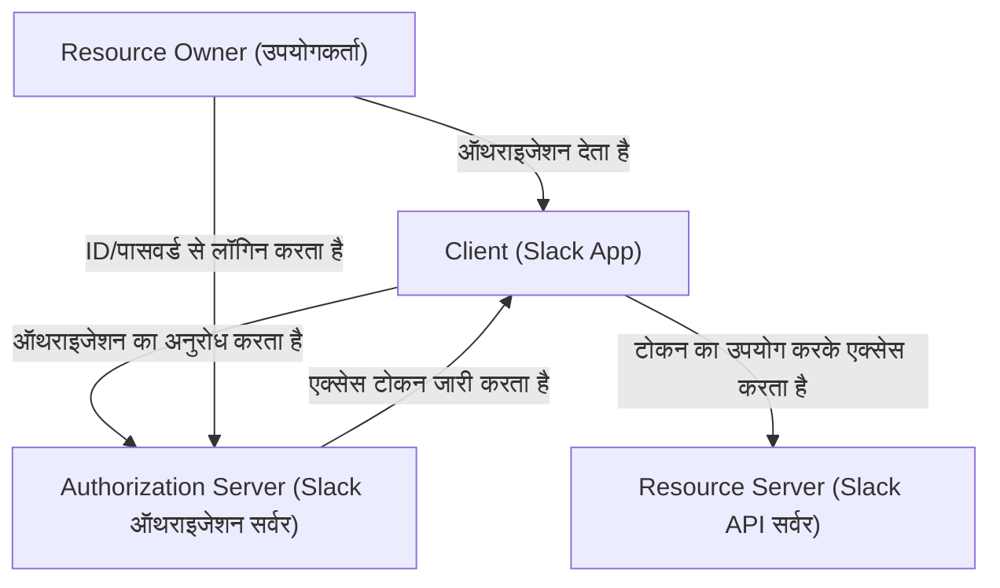
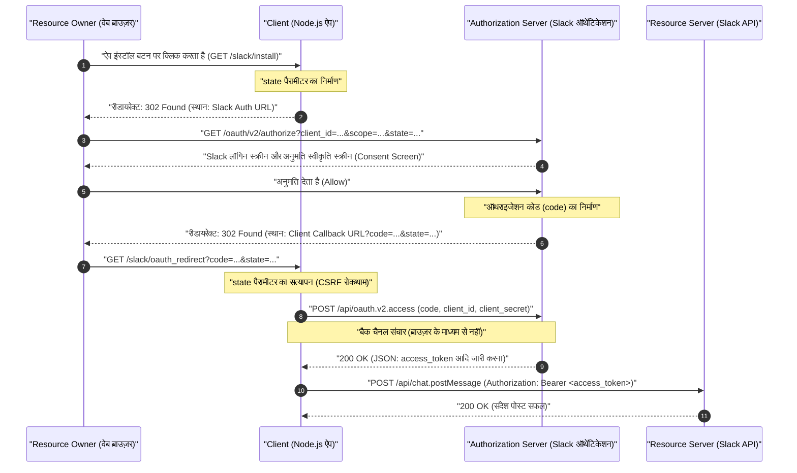
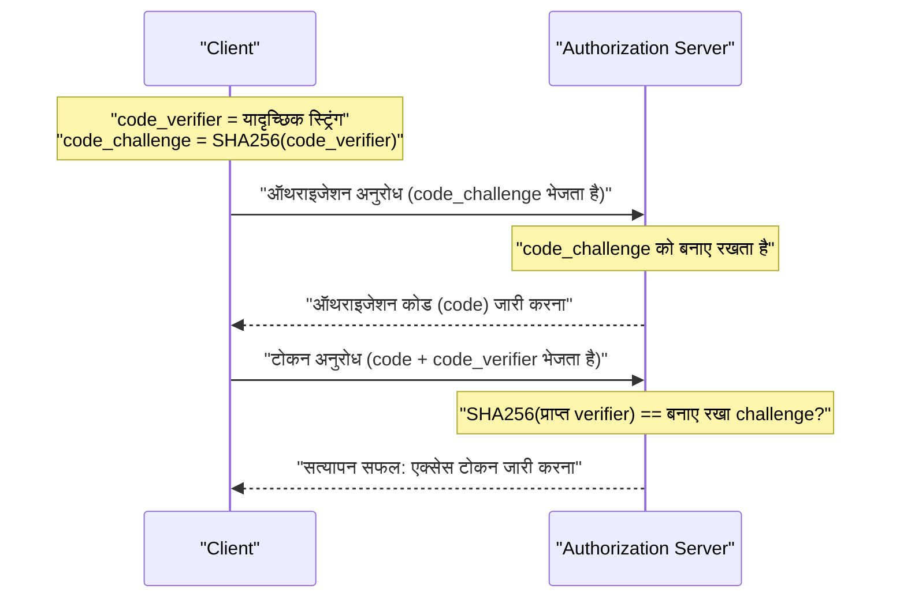

# परिचय: OAuth 2.0 क्यों सीखें?

आधुनिक वेब अनुप्रयोगों में, कई सेवाओं का एक साथ काम करना आम बात हो गई है। उदाहरण के लिए, "Google खाते से लॉग इन करना", "Trello कार्य अपडेट होने पर Slack पर अधिसूचना भेजना", या "Google कैलेंडर में ज़ूम मीटिंग लिंक स्वचालित रूप से जोड़ना" जैसी सुविधाएँ। इन सभी के पीछे **OAuth 2.0 (Open Authorization 2.0)** नामक एक ऑथराइजेशन फ्रेमवर्क काम कर रहा है।

अतीत में, जब विभिन्न सेवाओं के बीच डेटा का आदान-प्रदान किया जाता था, तो "बेसिक ऑथेंटिकेशन" या "पासवर्ड शेयरिंग" नामक बहुत ही खतरनाक तरीकों का उपयोग किया जाता था, जिसमें उपयोगकर्ता सीधे कनेक्टेड सेवा को अपना आईडी और पासवर्ड देते थे। हालांकि, इस विधि में कनेक्टेड सेवा उपयोगकर्ता के सभी अधिकारों को नियंत्रित कर लेती है, जिसमें महत्वपूर्ण सुरक्षा जोखिम शामिल होते हैं।

OAuth 2.0 को इस तरह के "पासवर्ड शेयरिंग" से बचने और एक मानक प्रोटोकॉल (RFC 6749) के रूप में बनाया गया था, जो तीसरे पक्ष के अनुप्रयोगों को "केवल विशिष्ट अनुमतियाँ (स्कोप)" और "सीमित समय के लिए" सौंपता है।

इस लेख में, हम OAuth 2.0 के काम करने के तरीके को अत्यंत विस्तृत और व्यावहारिक तरीके से समझाएंगे, एक एप्लिकेशन (Slack App) के कार्यान्वयन के माध्यम से जो **Slack (Slack API)** को लक्षित करता है, जो व्यवसाय संचार उपकरण के रूप में वास्तविक मानक बन गया है। यह 10,000 से अधिक वर्णों की एक निश्चित मार्गदर्शिका है, जिसमें Node.js (Express) का उपयोग करके कोड उदाहरण, प्रोटोकॉल प्रवाह को स्पष्ट करने वाले अनुक्रम आरेख (Sequence Diagrams), और सुरक्षा की महत्वपूर्ण अवधारणाओं जैसे `state` पैरामीटर और PKCE की गणितीय और क्रिप्टोग्राफ़िक पृष्ठभूमि शामिल है।

---

# 1. OAuth 2.0 की मूल अवधारणा: 4 भूमिकाएँ (Roles)

OAuth 2.0 को समझने के लिए पहला कदम शामिल पात्रों (Roles) को सटीक रूप से समझना है। RFC 6749 में, निम्नलिखित 4 भूमिकाएँ परिभाषित की गई हैं।



1. **Resource Owner (रिसोर्स ओनर)**
   - यह वह इकाई है जिसके पास रिसोर्स तक पहुंचने की अनुमति देने का अधिकार है। आमतौर पर यह "अंतिम उपयोगकर्ता (मानव)" को संदर्भित करता है। इस उदाहरण में, यह "आप स्वयं हैं, जो Slack वर्कस्पेस से संबंधित हैं और चैनल में संदेश पोस्ट करने का अधिकार रखते हैं।"
2. **Client (क्लाइंट)**
   - यह वह एप्लिकेशन है जो रिसोर्स ओनर की अनुमति से रिसोर्स सर्वर तक पहुंचने का प्रयास करता है। इस उदाहरण में, यह "आपके द्वारा विकसित किया जा रहा Node.js एप्लिकेशन (Slack App)" है। हालाँकि इसे "क्लाइंट" कहा जाता है, यहां तक कि सर्वर साइड पर चलने वाले वेब अनुप्रयोगों को भी OAuth के संदर्भ में "क्लाइंट" कहा जाता है।
3. **Authorization Server (ऑथराइजेशन सर्वर)**
   - यह वह सर्वर है जो रिसोर्स ओनर को प्रमाणित करता है, रिसोर्स ओनर से ऑथराइजेशन प्राप्त करता है, और क्लाइंट को एक्सेस टोकन जारी करता है। इस उदाहरण में, यह Slack का ऑथेंटिकेशन इंफ्रास्ट्रक्चर है जो `slack.com/oauth/v2/authorize` प्रदान करता है।
4. **Resource Server (रिसोर्स सर्वर)**
   - यह संरक्षित रिसोर्सेज को होस्ट करता है, और एक्सेस टोकन का उपयोग करके रिसोर्स एक्सेस अनुरोधों को स्वीकार करता है और उनका जवाब देता है। इस उदाहरण में, यह `slack.com/api/` का एंडपॉइंट है जो `chat.postMessage` जैसे API प्रदान करता है।

एक शब्द में, OAuth फ्लो **"क्लाइंट द्वारा रिसोर्स ओनर की सहमति प्राप्त करने, ऑथराइजेशन सर्वर से एक्सेस टोकन प्राप्त करने, और उसका उपयोग करके रिसोर्स सर्वर से डेटा प्राप्त करने/हेरफेर करने"** की प्रक्रिया है।

---

# 2. ऑथराइजेशन कोड ग्रांट (Authorization Code Grant) का संपूर्ण विश्लेषण

OAuth 2.0 में कई प्रवाह (ग्रांट प्रकार) मौजूद हैं, लेकिन वेब एप्लिकेशन जैसे सर्वर-साइड वातावरण में जहां सीक्रेट कुंजी (Client Secret) को सुरक्षित रूप से रखा जा सकता है, सबसे अनुशंसित और व्यापक रूप से उपयोग किया जाने वाला **ऑथराइजेशन कोड ग्रांट (Authorization Code Grant)** है।

ऑथराइजेशन कोड ग्रांट की सबसे बड़ी विशेषता यह है कि यह **फ्रंट चैनल (ब्राउज़र के माध्यम से संचार)** और **बैक चैनल (सर्वर के बीच सीधा संचार)** को स्पष्ट रूप से अलग करता है। फ्रंट चैनल में केवल एक अस्थायी "ऑथराइजेशन कोड (Authorization Code)" पास किया जाता है, और अंतिम "एक्सेस टोकन" बैक चैनल में प्राप्त किया जाता है, जिससे ब्राउज़र के इतिहास या रेफ़रर में टोकन लीक होने का जोखिम काफी कम हो जाता है।

निम्नलिखित अनुक्रम आरेख Slack App में ऑथराइजेशन कोड ग्रांट की पूरी प्रक्रिया को दर्शाता है।



आइए इस प्रवाह को एक-एक करके Node.js (Express) के विशिष्ट कोड कार्यान्वयन के माध्यम से समझें।

---

# 3. कार्यान्वयन की तैयारी: Slack Developer Console में सेटिंग्स

कोड लिखने से पहले, आपको Slack सिस्टम में "एक नया क्लाइंट मौजूद है" दर्ज करना होगा।

1. [Slack API: Applications](https://api.slack.com/apps) पर जाएं और "Create New App" पर क्लिक करें।
2. "From scratch" चुनें, और ऐप का नाम (उदाहरण: `My First OAuth App`) और इंस्टॉल करने के लिए वर्कस्पेस निर्दिष्ट करें।
3. निर्माण के बाद "Basic Information" स्क्रीन पर, निम्नलिखित दो महत्वपूर्ण क्रेडेंशियल (प्रमाणपत्र) प्राप्त करें।
   - **Client ID**: वह आईडी जो सार्वजनिक रूप से आपके ऐप की विशिष्ट पहचान करती है। ब्राउज़र (फ्रंट चैनल) के माध्यम से जाने वाले अनुरोधों में इसे शामिल करना ठीक है।
   - **Client Secret**: एक गुप्त स्ट्रिंग जो केवल आपका ऐप जानता है। **इसे कभी भी ब्राउज़र के सामने प्रकट न करें, और इसे GitHub आदि पर कमिट न करें।**
4. "OAuth & Permissions" स्क्रीन पर जाएं और "Redirect URLs" में कॉलबैक URL रजिस्टर करें। इस बार, स्थानीय विकास को ध्यान में रखते हुए, निम्नलिखित सेट करें।
   - `http://localhost:3000/slack/oauth_redirect`

तैयारी अब पूरी हो गई है। हम सर्वर के कार्यान्वयन में प्रवेश करते हैं।

---

# 4. कार्यान्वयन चरण 1: `/slack/install` और CSRF रोकथाम का `state` पैरामीटर

उपयोगकर्ताओं के लिए ऐप का उपयोग शुरू करने (वर्कस्पेस में इंस्टॉल करने) के लिए पहला एंडपॉइंट बनाएं। यहां सबसे बड़ी जिम्मेदारी उपयोगकर्ता को Slack के ऑथराइजेशन सर्वर पर रीडायरेक्ट करना है, लेकिन सुरक्षा के दृष्टिकोण से जो अत्यंत महत्वपूर्ण है वह **`state` पैरामीटर का निर्माण और भंडारण** है।

## state पैरामीटर की आवश्यकता (CSRF हमले की रोकथाम)

यदि `state` पैरामीटर मौजूद नहीं है, तो एक दुर्भावनापूर्ण हमलावर अपने Slack खाते से ऑथराइजेशन प्रक्रिया शुरू कर सकता है, और पीड़ित को प्राप्त "ऑथराइजेशन कोड" वाले कॉलबैक URL (उदाहरण: `http://localhost:3000/slack/oauth_redirect?code=ATTACKER_CODE`) पर क्लिक करने के लिए मजबूर कर सकता है। जब पीड़ित का ब्राउज़र इसे निष्पादित करता है, तो हमलावर का Slack खाता पीड़ित के सत्र से जुड़ जाता है, जिससे सूचना लीक होने या अनपेक्षित संचालन का कारण बनता है (लॉगिन CSRF)।

इसे रोकने के लिए, `state` एक अप्रत्याशित यादृच्छिक स्ट्रिंग है जिसका उपयोग यह सत्यापित करने के लिए किया जाता है कि जिस ब्राउज़र ने अनुरोध शुरू किया था वह कॉलबैक प्राप्त करने वाले ब्राउज़र के समान ही है।

## state की एन्ट्रापी (गणितीय पृष्ठभूमि)

एक सुरक्षित `state` उत्पन्न करने के लिए, हमें पर्याप्त "एन्ट्रापी (सूचना की मात्रा)" वाले यादृच्छिक संख्याओं की आवश्यकता है। एन्ट्रापी $E$ उत्पन्न होने वाले स्ट्रिंग प्रकारों $N$ पर निर्भर करती है, और इसे निम्नलिखित सूत्र द्वारा दर्शाया जाता है।

$$
E = \log_2(N) \quad (\text{इकाई: bits})
$$

उदाहरण के लिए, यदि हम 16 बाइट का क्रिप्टोग्राफ़िक रूप से सुरक्षित छद्म यादृच्छिक संख्या (CSPRNG) उत्पन्न करते हैं और इसे हेक्साडेसिमल (Hex) स्ट्रिंग में परिवर्तित करते हैं, तो प्रतिनिधित्व की जा सकने वाली स्थितियों की संख्या $2^{128}$ है।

$$
E = \log_2(2^{128}) = 128 \text{ bits}
$$

128 बिट्स की एन्ट्रापी के साथ, आधुनिक कंप्यूटर विज्ञान में ब्रूट फोर्स (पाशविक बल) हमले के माध्यम से टकराव खोजना व्यावहारिक रूप से असंभव (खगोलीय संभावना) है। आमतौर पर, सुरक्षा आवश्यकताओं के रूप में कम से कम 128 बिट्स की एन्ट्रापी वाले `state` की अनुशंसा की जाती है।

## Node.js द्वारा कार्यान्वयन

```javascript
// app.js (आंशिक अंश)
const express = require('express');
const crypto = require('crypto');
const session = require('express-session');
const dotenv = require('dotenv');

dotenv.config();

const app = express();

// सेशन मिडलवेयर सेटअप (state को सेव करने के लिए)
app.use(session({
  secret: process.env.SESSION_SECRET,
  resave: false,
  saveUninitialized: true,
  cookie: { secure: false } // प्रोडक्शन एनवायरनमेंट में इसे true करें
}));

const SLACK_CLIENT_ID = process.env.SLACK_CLIENT_ID;
const SLACK_AUTHORIZE_URL = 'https://slack.com/oauth/v2/authorize';

app.get('/slack/install', (req, res) => {
  // 16-बाइट का मजबूत यादृच्छिक संख्या उत्पन्न करें और 16-अंकीय स्ट्रिंग में बदलें (एंट्रॉपी: 128 bits)
  const state = crypto.randomBytes(16).toString('hex');
  
  // सेशन में सेव करें ताकि कॉलबैक के समय सत्यापन किया जा सके
  req.session.oauth_state = state;

  // अनुरोध किए जाने वाले स्कोप (अनुमतियों) की सूची (अल्पविराम से अलग)
  // chat:write = चैनल में संदेश भेजने की अनुमति
  // channels:read = सार्वजनिक चैनलों की जानकारी प्राप्त करने की अनुमति
  const scope = 'chat:write,channels:read';

  // Slack के ऑथराइजेशन सर्वर के लिए URL पैरामीटर का निर्माण
  const params = new URLSearchParams({
    client_id: SLACK_CLIENT_ID,
    scope: scope,
    state: state,
    redirect_uri: 'http://localhost:3000/slack/oauth_redirect'
  });

  const authUrl = `${SLACK_AUTHORIZE_URL}?${params.toString()}`;
  
  // उपयोगकर्ता को Slack की ऑथराइजेशन स्क्रीन पर रीडायरेक्ट करें (302 Found)
  res.redirect(authUrl);
});
```

जब आप इस एंडपॉइंट तक पहुँचते हैं, तो HTTP प्रतिक्रिया कुछ इस तरह दिखती है।

```http
HTTP/1.1 302 Found
Location: https://slack.com/oauth/v2/authorize?client_id=123.456&scope=chat%3Awrite%2Cchannels%3Aread&state=a1b2c3d4e5f6g7h8i9j0k1l2m3n4o5p6&redirect_uri=http%3A%2F%2Flocalhost%3A3000%2Fslack%2Foauth_redirect
Set-Cookie: connect.sid=...; Path=/; HttpOnly
```

उपयोगकर्ता का ब्राउज़र तुरंत निर्दिष्ट `Location` पर चला जाता है, और Slack की स्क्रीन (Consent Screen) प्रदर्शित होती है, और एक परिचित स्क्रीन दिखाई देती है जो कहती है "My First OAuth App कार्यक्षेत्र (Workspace) तक पहुंच मांग रहा है"।

---

# 5. कार्यान्वयन चरण 2: कॉलबैक प्राप्त करना और एक्सेस टोकन का आदान-प्रदान करना

जब उपयोगकर्ता Slack स्क्रीन पर "अनुमति दें (Allow)" पर क्लिक करता है, तो Slack सर्वर उपयोगकर्ता के ब्राउज़र को सेट किए गए `redirect_uri` पर रीडायरेक्ट करता है। उस समय, `code` (ऑथराइजेशन कोड) और पहले भेजा गया `state` URL के क्वेरी पैरामीटर के रूप में संलग्न किए जाते हैं।

बैकएंड में निम्नलिखित प्रक्रिया की जाती है।
1. जाँच करें कि भेजा गया `state` और सेशन में सेव किया गया `state` पूरी तरह से मेल खाता है या नहीं।
2. यदि वे मेल खाते हैं, तो प्राप्त `code`, अपना `client_id`, और गुप्त जानकारी `client_secret` का उपयोग करके Slack API के साथ बैक चैनल में संचार करें, और एक्सेस टोकन का अनुरोध करें।

```javascript
const axios = require('axios');
const SLACK_CLIENT_SECRET = process.env.SLACK_CLIENT_SECRET;
const SLACK_ACCESS_TOKEN_URL = 'https://slack.com/api/oauth.v2.access';

app.get('/slack/oauth_redirect', async (req, res) => {
  const { code, state, error } = req.query;

  // उपयोगकर्ता द्वारा ऑथराइजेशन अस्वीकार किए जाने की स्थिति में हैंडलिंग
  if (error === 'access_denied') {
    return res.status(403).send('एक्सेस अस्वीकार कर दिया गया है।');
  }

  // 1. state का सत्यापन (CSRF रोकथाम)
  const savedState = req.session.oauth_state;
  if (!state || state !== savedState) {
    return res.status(400).send('Invalid State Parameter (CSRF Attack Detected)');
  }

  // उपयोग किए गए state को हटा दें (रिप्ले अटैक की रोकथाम)
  delete req.session.oauth_state;

  try {
    // 2. एक्सेस टोकन के लिए ऑथराइजेशन कोड का आदान-प्रदान (बैक चैनल संचार)
    const tokenResponse = await axios.post(SLACK_ACCESS_TOKEN_URL, new URLSearchParams({
      client_id: SLACK_CLIENT_ID,
      client_secret: SLACK_CLIENT_SECRET,
      code: code,
      redirect_uri: 'http://localhost:3000/slack/oauth_redirect'
    }).toString(), {
      headers: {
        'Content-Type': 'application/x-www-form-urlencoded'
      }
    });

    const data = tokenResponse.data;

    if (!data.ok) {
      console.error('Token Exchange Error:', data.error);
      return res.status(500).send(`Slack API Error: ${data.error}`);
    }

    // सफल! एक्सेस टोकन प्राप्त किया गया
    const accessToken = data.access_token;
    const teamName = data.team.name;
    const botUserId = data.bot_user_id;

    console.log(`Successfully installed to ${teamName}. Access Token: ${accessToken}`);

    // सामान्यतः, यहां टोकन को एन्क्रिप्ट किया जाता है और डेटाबेस में सहेजा जाता है
    // saveToDatabase(data.team.id, encrypt(accessToken));

    res.send(`इंस्टॉलेशन पूरा हुआ! वर्कस्पेस: ${teamName}`);

  } catch (err) {
    console.error('Network Error:', err);
    res.status(500).send('संचार त्रुटि उत्पन्न हुई है।');
  }
});
```

इस `/api/oauth.v2.access` के प्रतिक्रिया (रिस्पॉन्स) के रूप में, Slack से निम्न प्रकार का JSON वापस किया जाता है।

```json
{
    "ok": true,
    "app_id": "A12345678",
    "authed_user": {
        "id": "U12345678"
    },
    "scope": "chat:write,channels:read",
    "token_type": "bot",
    "access_token": "<YOUR_BOT_TOKEN_HERE>",
    "bot_user_id": "B12345678",
    "team": {
        "id": "T12345678",
        "name": "My Workspace"
    },
    "enterprise": null
}
```

`xoxb-` से शुरू होने वाला यह स्ट्रिंग Slack में **Bot एक्सेस टोकन** है। इसके बाद, जब एप्लिकेशन Slack API (Resource Server) को अनुरोध भेजता है, तो प्रमाणीकरण (Authentication) और प्राधिकरण (Authorization) को HTTP हेडर में `Authorization: Bearer xoxb-...` जोड़कर साबित किया जाता है।

---

# 6. टोकन स्कोप और न्यूनतम विशेषाधिकार का सिद्धांत (Principle of Least Privilege)

OAuth 2.0 में सबसे महत्वपूर्ण अवधारणाओं में से एक "स्कोप (Scope)" है। स्कोप एक्सेस टोकन से जुड़ी अनुमतियों की सीमा को संदर्भित करता है।

Slack में अनुमतियों को बहुत ही बारीकी से वर्गीकृत किया गया है, और मोटे तौर पर दो प्रकार के होते हैं: **Bot Token Scopes** और **User Token Scopes**।
- `chat:write` (Bot): ऐप (बॉट) के रूप में स्वयं चैनल में संदेश पोस्ट करने की अनुमति।
- `chat:write` (User): ऐप को इंस्टॉल करने वाले उपयोगकर्ता की ओर से (उपयोगकर्ता के नाम और आइकन के साथ) संदेश पोस्ट करने की अनुमति।
- `channels:read`: चैनलों की सूची प्राप्त करने की अनुमति।
- `channels:history`: चैनलों के पिछले संदेश इतिहास को पढ़ने की अनुमति।

सुरक्षा के मुख्य सिद्धांत "न्यूनतम विशेषाधिकार के सिद्धांत (Principle of Least Privilege)" के अनुसार, **यह एक सख्त नियम है कि केवल उन्हीं स्कोप का अनुरोध किया जाए जो ऐप द्वारा प्रदान किए जाने वाले कार्यों के लिए वास्तव में आवश्यक हैं**। उदाहरण के लिए, "केवल सूचनाएं भेजने" वाले ऐप को केवल `chat:write` का अनुरोध करना चाहिए, और `channels:history` (सभी पिछली बातचीत को पढ़ने की अनुमति) का अनुरोध नहीं करना चाहिए। ऐसा इसलिए है ताकि अगर ऐप हैक हो जाता है और टोकन लीक हो जाता है, तो नुकसान को कम से कम किया जा सके।

---

# 7. अधिक उन्नत सुरक्षा: PKCE (Proof Key for Code Exchange)

हाल ही में, **PKCE (Proof Key for Code Exchange, RFC 7636, जिसका उच्चारण "पिक्सी" है)** को OAuth 2.0 की सुरक्षा को और बढ़ाने के लिए एक तंत्र के रूप में मानकीकृत किया गया है और इसका व्यापक रूप से उपयोग किया जा रहा है।

मूल रूप से PKCE को नेटिव ऐप्स (iOS/Android) और SPA (Single Page Application) जैसे "सार्वजनिक क्लाइंट" के लिए डिज़ाइन किया गया था, जो `client_secret` को सुरक्षित रूप से सहेज नहीं सकते हैं। हालांकि, वर्तमान सुरक्षा सर्वोत्तम प्रथाओं (OAuth 2.1 ड्राफ्ट) में, PKCE के उपयोग की सर्वर-साइड "गोपनीय क्लाइंट" के लिए भी दृढ़ता से अनुशंसा की जाती है।

## PKCE का काम करने का तरीका और गणितीय पृष्ठभूमि

PKCE क्रिप्टोग्राफ़िक रूप से यह साबित करता है कि "ऑथराइजेशन अनुरोध शुरू करने वाला व्यक्ति" और "टोकन एक्सचेंज का अनुरोध करने वाला व्यक्ति" एक ही हैं।

1. क्लाइंट एक यादृच्छिक स्ट्रिंग **`code_verifier`** (43 से 128 वर्ण) बनाता है।
2. इसे **SHA-256** का उपयोग करके हैश किया जाता है, और फिर BASE64URL में एन्कोड किया जाता है, और इसे **`code_challenge`** कहा जाता है।

इसे सूत्र में इस प्रकार दर्शाया जा सकता है।

$$
\text{code\_challenge} = \text{BASE64URL-ENCODE}( \text{SHA256}( \text{ASCII}(\text{code\_verifier}) ) )
$$

3. क्लाइंट `/slack/install` निष्पादित करते समय, `state` के अतिरिक्त `code_challenge` और `code_challenge_method=S256` को ऑथराइजेशन सर्वर (Slack) को भेजता है (Slack इसे अस्थायी रूप से सहेजता है)।
4. कॉलबैक के बाद, टोकन एक्सचेंज (`/api/oauth.v2.access`) के दौरान, मूल बिना हैश किया हुआ **`code_verifier`** भेजा जाता है।
5. ऑथराइजेशन सर्वर (Slack) प्राप्त `code_verifier` को स्वयं SHA-256 के साथ हैश करता है, और सत्यापित करता है कि क्या यह चरण 3 में सहेजे गए `code_challenge` के साथ पूरी तरह से मेल खाता है।



इस तंत्र के कारण, भले ही "ऑथराइजेशन कोड (code)" को किसी दुर्भावनापूर्ण ऐप द्वारा चुरा लिया गया हो या संचार चैनल को सुनकर प्राप्त कर लिया गया हो, हमलावर को एक्सेस टोकन नहीं मिल सकता है क्योंकि वह मूल `code_verifier` को नहीं जानता है (अपरिवर्तनीय हैश फ़ंक्शन SHA-256 की प्रकृति के कारण, challenge से verifier की गणना करना असंभव है)।

वर्तमान में, कुछ नए Slack API प्रवाह और अन्य आधुनिक SaaS API (Auth0, Okta, X/Twitter API v2 आदि) में PKCE का समर्थन बढ़ रहा है, और यह एक ऐसी तकनीक बन गई है जिसे डेवलपर्स को सक्रिय रूप से अपनाना चाहिए।

---

# 8. एक्सेस टोकन का सुरक्षित प्रबंधन और संचालन

अंत में, प्राप्त एक्सेस टोकन को सहेजने के तरीके के बारे में सर्वोत्तम प्रथाएं (best practices)।

## 1. डेटाबेस में सेव करते समय एन्क्रिप्शन अनिवार्य है
एक्सेस टोकन (`xoxb-...`) Slack वर्कस्पेस के लिए "मास्टर कुंजी" की तरह है। इसे कभी भी प्लेनटेक्स्ट (सादे पाठ) में डेटाबेस (MySQL, PostgreSQL, MongoDB आदि) में सहेजा नहीं जाना चाहिए। यदि किसी भी कारण से, जैसे SQL इंजेक्शन द्वारा, डेटाबेस लीक हो जाता है, तो यह एक बड़ी आपदा होगी जिसमें सभी ग्राहकों के Slack खातों पर नियंत्रण कर लिया जाएगा।

डेटाबेस में सेव करने से पहले एप्लिकेशन लेयर पर **AES-256-GCM** जैसे शक्तिशाली सममित-कुंजी एन्क्रिप्शन (Symmetric-key encryption) का उपयोग करके इसे एन्क्रिप्ट करना सुनिश्चित करें। एन्क्रिप्शन/डिक्रिप्शन के लिए मास्टर कुंजी को AWS KMS (Key Management Service) या GCP Cloud KMS जैसी सुरक्षित कुंजी प्रबंधन सेवाओं का उपयोग करके सख्ती से प्रबंधित किया जाना चाहिए।

## 2. टोकन रोटेशन (Token Rotation)
लंबे समय तक चलने वाले टोकन का उपयोग करना जोखिम भरा हो सकता है। नवीनतम OAuth कार्यान्वयनों में, "रिफ्रेश टोकन (Refresh Token)" का उपयोग करने और हर कुछ घंटों में एक नया एक्सेस टोकन फिर से जारी करने (टोकन रोटेशन) की अनुशंसा की जाती है। आप विकल्प सेटिंग्स में Slack API में टोकन रोटेशन को भी सक्षम कर सकते हैं।

---

# निष्कर्ष

इस लेख में, हमने Slack App एकीकरण के लिए विशिष्ट Node.js कार्यान्वयन कोड के साथ OAuth 2.0 ऑथराइजेशन कोड ग्रांट प्रवाह के बारे में विस्तार से बताया है।

1. **4 भूमिकाओं (RO, Client, AS, RS)** को ध्यान में रखते हुए, पूरे सिस्टम की वास्तुकला स्पष्ट हो जाती है।
2. **ऑथराइजेशन कोड ग्रांट** ब्राउज़र और सर्वर के बीच संचार पथ (फ्रंट/बैक चैनल) का कुशलतापूर्वक उपयोग करके सुरक्षा सुनिश्चित करता है।
3. **`state` पैरामीटर** के साथ CSRF रोकथाम और **PKCE** के साथ ऑथराइजेशन कोड इंटरसेप्ट हमलों की रोकथाम जैसे अंतर्निहित क्रिप्टोग्राफ़िक तंत्र को समझना सुरक्षित कार्यान्वयन के लिए एक शॉर्टकट है।
4. **न्यूनतम विशेषाधिकार के सिद्धांत** के आधार पर स्कोप डिज़ाइन, और डेटाबेस में सहेजते समय एन्क्रिप्शन संचालन के लिए बिल्कुल आवश्यक तत्व हैं।

OAuth 2.0 बहुत गहरा है, और केवल RFC में भारी मात्रा में विनिर्देश हैं, लेकिन वास्तविक प्लेटफॉर्म (Slack) को लक्षित करके और इसे हाथों-हाथ सीखकर, आपको इसकी परिष्कृत डिज़ाइन अवधारणाओं और मजबूत सुरक्षा तंत्र का अनुभव होना चाहिए। मुझे उम्मीद है कि इस लेख का ज्ञान भविष्य के एप्लिकेशन डेवलपमेंट और API एकीकरण के कार्यान्वयन में आपके लिए उपयोगी होगा।
