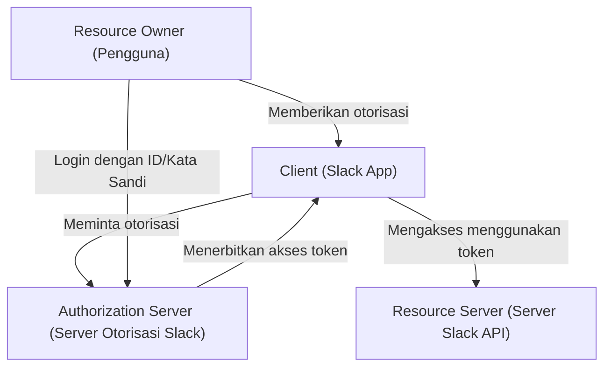
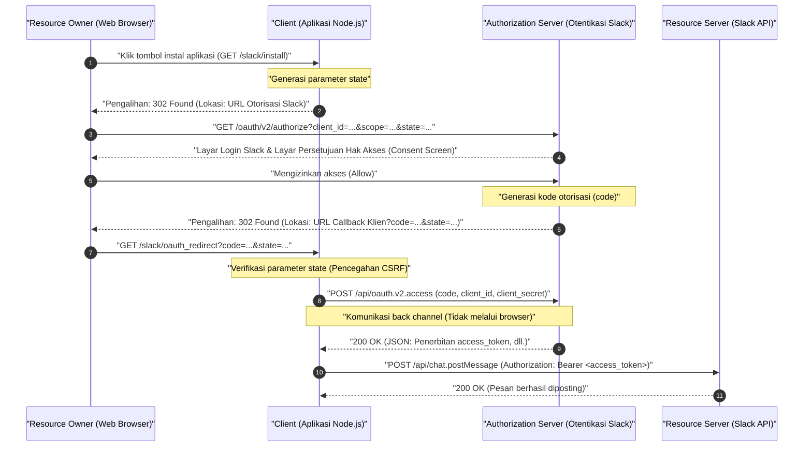
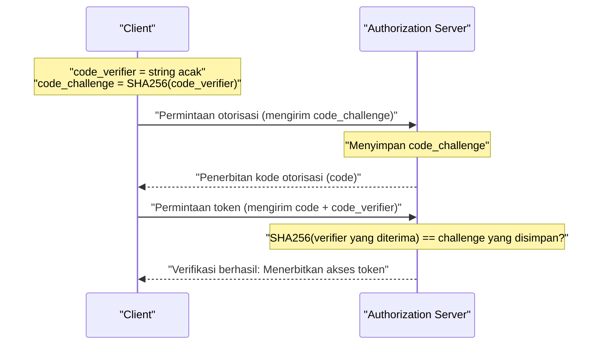

# Pendahuluan: Mengapa Belajar OAuth 2.0?

Dalam aplikasi Web modern, adalah pemandangan yang biasa melihat beberapa layanan bekerja sama. Misalnya, fitur-fitur seperti "Login dengan akun Google", "Mengirim notifikasi ke Slack ketika tugas Trello diperbarui", atau "Menambahkan tautan rapat Zoom ke Google Calendar secara otomatis". Di balik semua ini adalah framework otorisasi yang disebut **OAuth 2.0 (Open Authorization 2.0)**.

Di masa lalu, ketika bertukar data antar layanan yang berbeda, metode yang sangat berbahaya seperti "Otentikasi Dasar (Basic Authentication)" atau "Berbagi Kata Sandi (Password Sharing)", di mana pengguna memberikan ID dan kata sandi mereka secara langsung ke layanan terintegrasi, sering digunakan. Namun, metode ini memungkinkan layanan terintegrasi untuk memiliki kendali penuh atas pengguna, yang membawa risiko keamanan yang fatal.

OAuth 2.0 lahir sebagai protokol standar (RFC 6749) untuk mendelegasikan "hanya hak istimewa (cakupan/scope) tertentu" selama "waktu yang terbatas" ke aplikasi pihak ketiga sambil menghindari "berbagi kata sandi" seperti itu.

Dalam artikel ini, kita akan menjelaskan mekanisme OAuth 2.0 dengan sangat rinci dan praktis melalui implementasi aplikasi (Slack App) yang menargetkan **Slack (Slack API)**, yang telah menjadi standar de facto untuk alat komunikasi bisnis. Ini adalah panduan definitif dengan lebih dari 10.000 karakter, mencakup contoh kode menggunakan Node.js (Express), diagram urutan (sequence diagram) yang memvisualisasikan alur protokol, dan konsep keamanan penting seperti parameter `state` dan latar belakang matematis serta kriptografis dari PKCE.

---

# 1. Konsep Dasar OAuth 2.0: 4 Peran (Roles)

Langkah pertama dalam memahami OAuth 2.0 adalah memahami dengan tepat tokoh-tokoh (Roles) yang terlibat. RFC 6749 mendefinisikan 4 peran berikut:



1. **Resource Owner (Pemilik Sumber Daya)**
   - Entitas yang memiliki wewenang untuk memberikan hak akses ke sumber daya. Biasanya mengacu pada "pengguna akhir (manusia)". Dalam contoh ini, itu adalah "Anda sendiri, yang merupakan anggota ruang kerja Slack dan memiliki wewenang untuk memposting pesan ke saluran (channel)".
2. **Client (Klien)**
   - Aplikasi yang mencoba mengakses server sumber daya dengan izin dari pemilik sumber daya. Dalam contoh ini, itu adalah "Aplikasi Node.js (Slack App) yang sedang Anda kembangkan". Meskipun disebut "klien", aplikasi Web yang berjalan di sisi server juga disebut "klien" dalam konteks OAuth.
3. **Authorization Server (Server Otorisasi)**
   - Server yang mengotentikasi pemilik sumber daya, mendapatkan otorisasi dari pemilik sumber daya, dan kemudian menerbitkan akses token ke klien. Dalam contoh ini, ini adalah infrastruktur otentikasi Slack yang menyediakan `slack.com/oauth/v2/authorize`.
4. **Resource Server (Server Sumber Daya)**
   - Server yang meng-hosting sumber daya yang dilindungi, dan menerima serta merespons permintaan akses ke sumber daya menggunakan akses token. Dalam contoh ini, ini adalah titik akhir (endpoint) `slack.com/api/` yang menyediakan API seperti `chat.postMessage`.

Secara singkat, alur OAuth adalah serangkaian prosedur di mana **"Client mendapatkan persetujuan dari Resource Owner, menerima akses token dari Authorization Server, dan menggunakannya untuk mengambil/memanipulasi data dari Resource Server."**

---

# 2. Anatomi Lengkap Authorization Code Grant (Pemberian Kode Otorisasi)

Ada beberapa alur (grant types) di OAuth 2.0, tetapi yang paling direkomendasikan dan banyak digunakan di lingkungan seperti aplikasi Web di mana kunci rahasia (Client Secret) dapat disimpan dengan aman di sisi server adalah **Authorization Code Grant**.

Fitur terbesar dari Authorization Code Grant adalah pemisahan yang jelas antara **front channel (komunikasi melalui browser)** dan **back channel (komunikasi langsung antar server)**. Di saluran depan, hanya "kode otorisasi (Authorization Code)" sementara yang diteruskan, dan perolehan "akses token" akhir dilakukan di saluran belakang (back channel), secara drastis mengurangi risiko kebocoran token ke riwayat browser atau perujuk (referrer).

Diagram urutan berikut menunjukkan seluruh proses Authorization Code Grant di Slack App.



Mari kita urai alur ini satu per satu melalui implementasi kode Node.js (Express) secara spesifik.

---

# 3. Persiapan Implementasi: Pengaturan di Slack Developer Console

Sebelum menulis kode, Anda perlu mendaftarkan ke sistem Slack bahwa "ada klien baru".

1. Akses [Slack API: Applications](https://api.slack.com/apps) dan klik "Create New App".
2. Pilih "From scratch", tentukan nama aplikasi (misal: `My First OAuth App`) dan ruang kerja tempat aplikasi akan diinstal.
3. Di layar "Basic Information" setelah pembuatan, dapatkan dua kredensial penting berikut:
   - **Client ID**: ID yang secara publik dan unik mengidentifikasi aplikasi Anda. Tidak masalah untuk menyertakannya dalam permintaan yang melalui browser (saluran depan).
   - **Client Secret**: String rahasia yang hanya diketahui oleh aplikasi Anda. **Jangan pernah mengeksposnya ke sisi browser, dan jangan melakukan komit (commit) ke GitHub dll.**
4. Buka layar "OAuth & Permissions" dan daftarkan URL callback di "Redirect URLs". Mengingat ini adalah pengembangan lokal, atur hal berikut:
   - `http://localhost:3000/slack/oauth_redirect`

Sekarang persiapannya sudah selesai. Mari kita mulai mengimplementasikan server.

---

# 4. Langkah Implementasi 1: `/slack/install` dan Parameter `state` untuk Pencegahan CSRF

Kita akan membuat titik akhir pertama bagi pengguna untuk mulai menggunakan aplikasi (menginstalnya di ruang kerja mereka). Tanggung jawab terbesar di sini adalah mengarahkan pengguna ke server otorisasi Slack, tetapi yang sangat penting untuk keamanan adalah **menghasilkan dan menyimpan parameter `state`**.

## Kebutuhan parameter state (Mencegah serangan CSRF)

Jika parameter `state` tidak ada, penyerang berbahaya dapat memulai proses otorisasi dengan akun Slack mereka sendiri, dan membuat korban mengklik URL callback yang berisi "kode otorisasi" yang diperoleh (misal: `http://localhost:3000/slack/oauth_redirect?code=ATTACKER_CODE`). Ketika browser korban mengeksekusi ini, penyelarasan dengan akun Slack penyerang diselesaikan pada sesi korban, menyebabkan kebocoran informasi atau operasi yang tidak diinginkan (Login CSRF).

Untuk mencegah hal ini, `state` adalah string acak yang tidak dapat diprediksi untuk memverifikasi bahwa browser yang memulai permintaan sama dengan browser yang menerima callback.

## Entropi dari state (Latar Belakang Matematis)

Untuk menghasilkan `state` yang aman, diperlukan angka acak dengan "entropi (jumlah informasi)" yang cukup. Entropi $E$ bergantung pada jumlah kemungkinan karakter yang dihasilkan $N$, dan dinyatakan dalam rumus berikut:

$$
E = \log_2(N) \quad (\text{Satuan: bits})
$$

Misalnya, jika Anda membuat Generator Angka Acak Semu Kriptografi (CSPRNG) 16-byte dan mengubahnya menjadi string heksadesimal (Hex), jumlah keadaan (state) yang dapat direpresentasikan adalah $2^{128}$.

$$
E = \log_2(2^{128}) = 128 \text{ bits}
$$

Dengan entropi 128-bit, hampir tidak mungkin (probabilitas astronomis) untuk menemukan tabrakan (collision) dengan serangan brute force dalam ilmu komputer modern. Biasanya, `state` dengan entropi minimal 128 bit direkomendasikan sebagai persyaratan keamanan.

## Implementasi dengan Node.js

```javascript
// app.js (Kutipan)
const express = require('express');
const crypto = require('crypto');
const session = require('express-session');
const dotenv = require('dotenv');

dotenv.config();

const app = express();

// Pengaturan middleware sesi (untuk menyimpan state)
app.use(session({
  secret: process.env.SESSION_SECRET,
  resave: false,
  saveUninitialized: true,
  cookie: { secure: false } // Ubah menjadi true di lingkungan produksi
}));

const SLACK_CLIENT_ID = process.env.SLACK_CLIENT_ID;
const SLACK_AUTHORIZE_URL = 'https://slack.com/oauth/v2/authorize';

app.get('/slack/install', (req, res) => {
  // Menghasilkan angka acak 16-byte yang kuat dan mengubahnya menjadi string hex (Entropi: 128 bit)
  const state = crypto.randomBytes(16).toString('hex');
  
  // Menyimpannya di sesi sehingga dapat diverifikasi pada saat callback
  req.session.oauth_state = state;

  // Daftar cakupan (hak akses) yang diminta (dipisahkan dengan koma)
  // chat:write = Hak untuk mengirim pesan ke saluran
  // channels:read = Hak untuk mendapatkan informasi saluran publik
  const scope = 'chat:write,channels:read';

  // Parameter URL untuk membangun server otorisasi Slack
  const params = new URLSearchParams({
    client_id: SLACK_CLIENT_ID,
    scope: scope,
    state: state,
    redirect_uri: 'http://localhost:3000/slack/oauth_redirect'
  });

  const authUrl = `${SLACK_AUTHORIZE_URL}?${params.toString()}`;
  
  // Mengarahkan pengguna ke layar otorisasi Slack (302 Found)
  res.redirect(authUrl);
});
```

Saat Anda mengakses titik akhir ini, respons HTTP akan menjadi seperti berikut.

```http
HTTP/1.1 302 Found
Location: https://slack.com/oauth/v2/authorize?client_id=123.456&scope=chat%3Awrite%2Cchannels%3Aread&state=a1b2c3d4e5f6g7h8i9j0k1l2m3n4o5p6&redirect_uri=http%3A%2F%2Flocalhost%3A3000%2Fslack%2Foauth_redirect
Set-Cookie: connect.sid=...; Path=/; HttpOnly
```

Browser pengguna akan segera berpindah ke `Location` yang ditentukan, layar Slack (Consent Screen) akan ditampilkan, dan layar familiar yang mengatakan "My First OAuth App meminta akses ke ruang kerja" akan muncul.

---

# 5. Langkah Implementasi 2: Menerima Callback dan Menukar Akses Token

Saat pengguna mengklik "Izinkan (Allow)" pada layar Slack, server Slack mengarahkan browser pengguna ke `redirect_uri` yang telah dikonfigurasi sebelumnya. Pada saat itu, `code` (kode otorisasi) dan `state` yang dikirim sebelumnya dilampirkan sebagai parameter kueri URL.

Langkah-langkah berikut dilakukan di backend:
1. Memverifikasi apakah `state` yang dikirim cocok persis dengan `state` yang disimpan dalam sesi.
2. Jika cocok, gunakan `code` yang diterima bersama dengan `client_id` Anda sendiri dan `client_secret` rahasia untuk berkomunikasi dengan Slack API di saluran belakang, untuk meminta akses token.

```javascript
const axios = require('axios');
const SLACK_CLIENT_SECRET = process.env.SLACK_CLIENT_SECRET;
const SLACK_ACCESS_TOKEN_URL = 'https://slack.com/api/oauth.v2.access';

app.get('/slack/oauth_redirect', async (req, res) => {
  const { code, state, error } = req.query;

  // Penanganan saat pengguna menolak otorisasi
  if (error === 'access_denied') {
    return res.status(403).send('Akses ditolak.');
  }

  // 1. Verifikasi state (Pencegahan CSRF)
  const savedState = req.session.oauth_state;
  if (!state || state !== savedState) {
    return res.status(400).send('Parameter State Tidak Valid (Serangan CSRF Terdeteksi)');
  }

  // Hapus state yang sudah digunakan (Mencegah serangan replay)
  delete req.session.oauth_state;

  try {
    // 2. Menukar kode otorisasi menjadi akses token (Komunikasi back channel)
    const tokenResponse = await axios.post(SLACK_ACCESS_TOKEN_URL, new URLSearchParams({
      client_id: SLACK_CLIENT_ID,
      client_secret: SLACK_CLIENT_SECRET,
      code: code,
      redirect_uri: 'http://localhost:3000/slack/oauth_redirect'
    }).toString(), {
      headers: {
        'Content-Type': 'application/x-www-form-urlencoded'
      }
    });

    const data = tokenResponse.data;

    if (!data.ok) {
      console.error('Kesalahan Pertukaran Token:', data.error);
      return res.status(500).send(`Kesalahan Slack API: ${data.error}`);
    }

    // Sukses! Dapatkan Akses Token
    const accessToken = data.access_token;
    const teamName = data.team.name;
    const botUserId = data.bot_user_id;

    console.log(`Berhasil diinstal ke ${teamName}. Akses Token: ${accessToken}`);

    // Idealnya, di sini token dienkripsi dan disimpan di database
    // saveToDatabase(data.team.id, encrypt(accessToken));

    res.send(`Instalasi selesai! Ruang kerja: ${teamName}`);

  } catch (err) {
    console.error('Kesalahan Jaringan:', err);
    res.status(500).send('Terjadi kesalahan komunikasi.');
  }
});
```

Sebagai respons dari `/api/oauth.v2.access` ini, Slack akan mengembalikan JSON seperti di bawah ini.

```json
{
    "ok": true,
    "app_id": "A12345678",
    "authed_user": {
        "id": "U12345678"
    },
    "scope": "chat:write,channels:read",
    "token_type": "bot",
    "access_token": "<YOUR_BOT_TOKEN_HERE>",
    "bot_user_id": "B12345678",
    "team": {
        "id": "T12345678",
        "name": "My Workspace"
    },
    "enterprise": null
}
```

String yang diawali dengan `xoxb-` adalah **Bot Access Token** di Slack. Selanjutnya, saat aplikasi mengirimkan permintaan ke Slack API (Resource Server), otentikasi dan bukti wewenang dilakukan dengan menambahkan `Authorization: Bearer xoxb-...` ke header HTTP.

---

# 6. Cakupan Token (Token Scope) dan Prinsip Hak Istimewa Minimal (Principle of Least Privilege)

Salah satu konsep terpenting dalam OAuth 2.0 adalah "Cakupan (Scope)". Scope mengacu pada rentang wewenang yang terikat pada akses token.

Di Slack, wewenang diklasifikasikan dengan sangat detail, yang secara garis besar dibagi menjadi **Bot Token Scopes** dan **User Token Scopes**.
- `chat:write` (Bot): Izin untuk memposting pesan ke saluran atas nama aplikasi (bot) itu sendiri.
- `chat:write` (User): Izin untuk memposting pesan (dengan nama dan ikon pengguna) sebagai perwakilan pengguna yang menginstal aplikasi.
- `channels:read`: Izin untuk mendapatkan daftar saluran.
- `channels:history`: Izin untuk membaca riwayat pesan sebelumnya dari sebuah saluran.

Mengikuti "Prinsip Hak Istimewa Minimal (Principle of Least Privilege)", yang merupakan prinsip utama dalam keamanan, aturan utamanya adalah **hanya meminta cakupan (scope) yang benar-benar esensial untuk fungsionalitas yang disediakan oleh aplikasi**. Misalnya, untuk aplikasi yang "hanya mengirim notifikasi", itu hanya boleh meminta `chat:write`, dan tidak boleh meminta `channels:history` (izin untuk membaca semua percakapan sebelumnya). Ini untuk meminimalkan kerusakan yang terjadi seandainya aplikasi diretas dan tokennya bocor.

---

# 7. Keamanan Lebih Lanjut: PKCE (Proof Key for Code Exchange)

Akhir-akhir ini, sebagai mekanisme untuk lebih memperkuat keamanan OAuth 2.0, **PKCE (Proof Key for Code Exchange, RFC 7636, diucapkan "pixy")** telah distandarisasi dan digunakan secara luas.

Awalnya, PKCE dirancang untuk "klien publik" seperti aplikasi asli (iOS/Android) atau SPA (Single Page Application) yang tidak dapat menyimpan `client_secret` dengan aman. Namun saat ini, dalam praktik keamanan terbaik (Draf OAuth 2.1), penggunaan PKCE sangat direkomendasikan bahkan untuk "klien rahasia (confidential client)" di sisi server.

## Cara Kerja PKCE dan Latar Belakang Matematis

PKCE membuktikan secara kriptografis bahwa "pihak yang memulai permintaan otorisasi" dan "pihak yang meminta pertukaran token" adalah entitas yang sama.

1. Klien menghasilkan string acak **`code_verifier`** (43 hingga 128 karakter).
2. Ini di-hash menggunakan **SHA-256** dan di-encode dengan BASE64URL untuk menjadi **`code_challenge`**.

Jika dinyatakan dalam rumus, maka akan seperti berikut:

$$
\text{code\_challenge} = \text{BASE64URL-ENCODE}( \text{SHA256}( \text{ASCII}(\text{code\_verifier}) ) )
$$

3. Saat mengeksekusi `/slack/install`, klien mengirimkan `code_challenge` dan `code_challenge_method=S256` ke server otorisasi (Slack) selain parameter `state` (Slack akan menyimpannya sementara).
4. Setelah callback, saat menukar token (`/api/oauth.v2.access`), klien mengirimkan **`code_verifier`** asli sebelum hashing.
5. Server otorisasi (Slack) akan melakukan hash SHA-256 pada `code_verifier` yang diterima sendiri, dan memverifikasi apakah itu cocok persis dengan `code_challenge` yang disimpan pada langkah 3.



Dengan mekanisme ini, bahkan jika "kode otorisasi (code)" dicuri oleh aplikasi berbahaya atau penyadapan di jalur komunikasi, penyerang tidak mengetahui `code_verifier` aslinya (karena sifat fungsi hash satu arah SHA-256 yang mustahil untuk membalikkan verifier dari challenge), sehingga tidak mungkin untuk mendapatkan akses token.

Saat ini, PKCE mulai didukung dalam alur baru di Slack API dan API SaaS modern lainnya (Auth0, Okta, X/Twitter API v2, dll.), menjadikannya teknologi yang harus diadopsi secara aktif oleh para pengembang.

---

# 8. Manajemen dan Operasi Akses Token yang Aman

Terakhir, berikut adalah praktik terbaik tentang cara menyimpan akses token yang diperoleh.

## 1. Menyimpan dalam database harus dienkripsi
Akses token (`xoxb-...`) ibarat "kunci duplikat" ke ruang kerja Slack. Anda tidak boleh menyimpannya dalam teks biasa (plaintext) di database (MySQL, PostgreSQL, MongoDB, dll.). Jika database bocor karena injeksi SQL atau sejenisnya, ini akan menjadi bencana besar di mana saluran Slack semua pelanggan dibajak.

Pastikan untuk mengenkripsinya di lapisan aplikasi menggunakan kriptografi kunci simetris yang kuat seperti **AES-256-GCM** sebelum menyimpannya di DB. Kunci master (master key) untuk enkripsi/dekripsi harus dikelola secara ketat menggunakan layanan manajemen kunci yang aman seperti AWS KMS (Key Management Service) atau GCP Cloud KMS.

## 2. Rotasi Token (Token Rotation)
Terus menggunakan token yang berlaku lama membawa risiko. Pada implementasi OAuth terbaru, sangat disarankan untuk menerapkan mekanisme di mana token akses baru diterbitkan ulang setiap beberapa jam (Token Rotation) dengan menggunakan "Token Penyegaran (Refresh Token)". Di Slack API juga dimungkinkan untuk mengaktifkan rotasi token melalui pengaturan opsi.

---

# Kesimpulan

Artikel ini menjelaskan Authorization Code Grant Flow pada OAuth 2.0 secara detail dengan contoh kode implementasi Node.js spesifik untuk integrasi Slack App.

1. Dengan memahami **4 peran (RO, Client, AS, RS)**, arsitektur keseluruhan sistem menjadi lebih jelas.
2. **Authorization Code Grant** menjamin keamanan dengan memanfaatkan saluran komunikasi (front/back channel) secara cerdik antara browser dan server.
3. Memahami mekanisme kriptografis di baliknya, seperti pertahanan CSRF menggunakan parameter **`state`** dan pencegahan serangan intersep kode otorisasi menggunakan **PKCE**, adalah jalan pintas menuju implementasi yang aman.
4. Desain cakupan (scope) berdasarkan **Prinsip Hak Istimewa Minimal (Principle of Least Privilege)** dan enkripsi saat menyimpan di DB adalah elemen yang sangat penting dalam pengoperasiannya.

OAuth 2.0 sangat dalam, dengan sejumlah besar spesifikasi bahkan hanya di dalam RFC, tetapi dengan mempelajari dan mempraktikkannya langsung pada platform aktual (Slack) seperti ini, Anda pasti akan merasakan filosofi desainnya yang elegan dan mekanisme keamanannya yang kokoh. Semoga pengetahuan dalam artikel ini bermanfaat untuk pengembangan aplikasi Anda di masa depan dan implementasi integrasi API.
