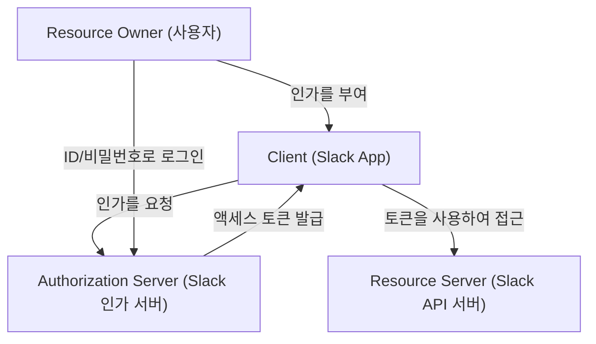
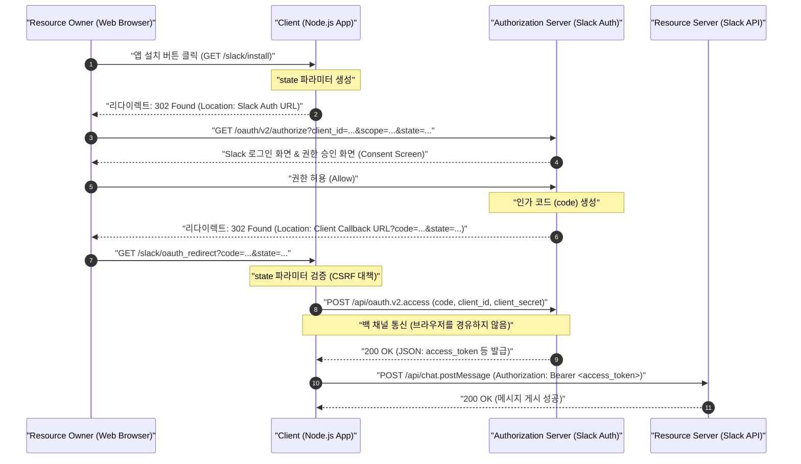
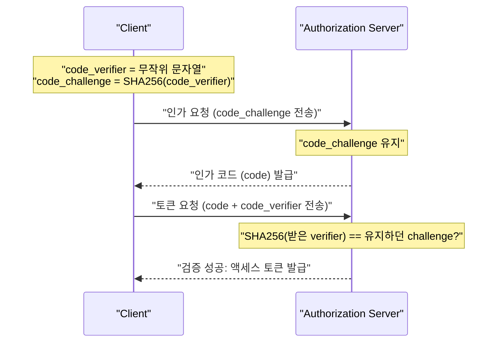

# 들어가며: 왜 OAuth 2.0을 배워야 하는가?

현대의 웹 애플리케이션에서 여러 서비스가 연동되어 동작하는 것은 더 이상 낯선 풍경이 아닙니다. 예를 들어, "Google 계정으로 로그인하기", "Trello의 작업이 업데이트되면 Slack으로 알림 보내기", "Zoom 회의 링크를 Google 캘린더에 자동 추가하기"와 같은 기능들입니다. 이 모든 것의 이면에서 활약하고 있는 것이 **OAuth 2.0 (Open Authorization 2.0)** 이라는 인가(Authorization) 프레임워크입니다.

과거에는 다른 서비스 간에 데이터를 주고받을 때, 사용자가 자신의 ID와 비밀번호를 연동 대상 서비스에 직접 전달하는 "기본 인증(Basic Authentication)"이나 "비밀번호 공유"라는 매우 위험한 방식이 사용되었습니다. 하지만 이 방법은 연동 대상 서비스가 사용자의 모든 권한을 쥐게 되어 치명적인 보안 위험을 수반합니다.

OAuth 2.0은 이러한 "비밀번호 공유"를 방지하면서, "특정 권한(스코프)만"을 "제한된 시간 동안만" 서드파티 애플리케이션에 위임하기 위한 표준 프로토콜(RFC 6749)로 탄생했습니다.

본 문서에서는 이 OAuth 2.0의 작동 원리를, 비즈니스 커뮤니케이션 툴의 사실상 표준(De facto standard)으로 자리 잡은 **Slack (Slack API)** 을 대상으로 한 애플리케이션(Slack App) 구현을 통해 매우 상세하고 실천적으로 해설합니다. Node.js (Express)를 사용한 코드 예제, 프로토콜의 흐름을 도식화한 시퀀스 다이어그램, 그리고 보안상 중요한 개념인 `state` 파라미터나 PKCE의 수학적·암호학적 배경까지 파고든, 1만 자가 넘는 결정판 해설입니다.

---

# 1. OAuth 2.0의 기본 개념: 4가지 역할(Roles)

OAuth 2.0을 이해하기 위한 첫걸음은 등장인물(Role)을 정확히 파악하는 것입니다. RFC 6749에서는 다음의 4가지 역할을 정의하고 있습니다.



1. **Resource Owner (리소스 오너)**
   - 리소스에 대한 접근 권한을 부여할 수 있는 권한을 가진 엔티티입니다. 일반적으로 "엔드 유저(사람)"를 가리킵니다. 이번 예제에서는 "Slack 워크스페이스에 소속되어 있고 채널에 메시지를 게시할 권한을 가진 여러분 자신"입니다.
2. **Client (클라이언트)**
   - 리소스 오너의 허가를 얻어 리소스 서버에 접근하려는 애플리케이션입니다. 이번 예제에서는 "여러분이 개발 중인 Node.js 애플리케이션(Slack App)"입니다. "클라이언트"라는 이름이지만, 서버 사이드에서 동작하는 웹 애플리케이션이라 하더라도 OAuth의 문맥에서는 "클라이언트"라고 불립니다.
3. **Authorization Server (인가 서버)**
   - 리소스 오너를 인증하고, 리소스 오너로부터 인가를 얻은 후 클라이언트에게 액세스 토큰을 발급하는 서버입니다. 이번 예제에서는 `slack.com/oauth/v2/authorize` 를 제공하는 Slack의 인증 기반입니다.
4. **Resource Server (리소스 서버)**
   - 보호된 리소스를 호스팅하며, 액세스 토큰을 사용한 리소스 접근 요청을 접수하고 응답하는 서버입니다. 이번 예제에서는 `chat.postMessage` 등의 API를 제공하는 `slack.com/api/` 의 엔드포인트입니다.

OAuth의 흐름이란 한마디로 **"Client가 Resource Owner의 동의를 얻어 Authorization Server로부터 액세스 토큰을 받고, 이를 사용하여 Resource Server에서 데이터를 조회·조작하는"** 일련의 절차를 의미합니다.

---

# 2. 인가 코드 그랜트 (Authorization Code Grant) 완전 해부

OAuth 2.0에는 여러 플로우(그랜트 타입)가 존재하지만, 웹 애플리케이션과 같이 서버 사이드에서 비밀키(Client Secret)를 안전하게 보관할 수 있는 환경에서 가장 권장되며 널리 쓰이는 것이 **인가 코드 그랜트(Authorization Code Grant)** 입니다.

인가 코드 그랜트의 가장 큰 특징은 **프론트 채널(브라우저를 경유하는 통신)** 과 **백 채널(서버 간 직접 통신)** 을 명확히 분리하고 있다는 점입니다. 프론트 채널에서는 일회성 "인가 코드(Authorization Code)"만을 주고받으며, 최종적인 "액세스 토큰"의 취득은 백 채널에서 수행함으로써 토큰이 브라우저의 방문 기록이나 리퍼러에 유출될 위험을 극적으로 낮춥니다.

다음 시퀀스 다이어그램은 Slack App에서 인가 코드 그랜트의 전체 과정을 보여줍니다.



이 흐름을 구체적인 Node.js (Express) 코드 구현을 통해 하나씩 분석해 보겠습니다.

---

# 3. 구현 준비: Slack Developer Console에서의 설정

코드를 작성하기 전에, Slack 시스템에 "새로운 클라이언트가 존재함"을 등록해야 합니다.

1. [Slack API: Applications](https://api.slack.com/apps) 에 접속하여 "Create New App"을 클릭합니다.
2. "From scratch"를 선택하고, 앱 이름(예: `My First OAuth App`)과 설치할 워크스페이스를 지정합니다.
3. 생성 후 나타나는 "Basic Information" 화면에서 다음의 두 가지 중요한 크리덴셜(자격 증명)을 확인합니다.
   - **Client ID**: 앱을 공개적으로 고유하게 식별하는 ID. 브라우저를 경유하는 요청(프론트 채널)에 포함되어도 문제가 없습니다.
   - **Client Secret**: 여러분의 앱만 알고 있는 비밀 문자열. **절대 브라우저 측에 노출시키거나 GitHub 등에 커밋해서는 안 됩니다.**
4. "OAuth & Permissions" 화면으로 이동하여 "Redirect URLs"에 콜백 받을 URL을 등록합니다. 이번에는 로컬 개발을 가정하여 다음을 설정합니다.
   - `http://localhost:3000/slack/oauth_redirect`

이제 준비가 완료되었습니다. 서버 구현에 들어가겠습니다.

---

# 4. 구현 단계 1: `/slack/install` 과 CSRF 대책을 위한 `state` 파라미터

사용자가 앱 이용을 시작하기(워크스페이스에 설치하기) 위한 첫 번째 엔드포인트를 생성합니다. 여기서의 가장 큰 책임은 Slack 인가 서버로 사용자를 리다이렉트시키는 것이지만, 보안상 극히 중요한 것이 **`state` 파라미터의 생성과 저장**입니다.

## state 파라미터의 필요성 (CSRF 공격 방지)

만약 `state` 파라미터가 없다면, 악의적인 공격자가 자신의 Slack 계정으로 인가 프로세스를 시작하여 얻은 "인가 코드"가 포함된 콜백 URL(예: `http://localhost:3000/slack/oauth_redirect?code=ATTACKER_CODE`)을 피해자가 클릭하게 만들 수 있습니다. 피해자의 브라우저가 이를 실행하면, 피해자의 세션 상에서 공격자의 Slack 계정 연동이 완료되어 버리며 정보 유출이나 의도치 않은 조작의 원인이 됩니다(로그인 CSRF).

이를 방지하기 위해 요청을 시작한 브라우저와 콜백을 받은 브라우저가 동일한지 검증하기 위한 추측 불가능한 무작위 문자열이 `state`입니다.

## state의 엔트로피 (수학적 배경)

안전한 `state`를 생성하기 위해서는 충분한 "엔트로피(정보량)"를 가진 난수가 필요합니다. 엔트로피 $E$는 생성되는 문자열의 종류 $N$에 의존하며, 다음 수식으로 표현됩니다.

$$
E = \log_2(N) \quad (\text{단위: bits})
$$

예를 들어 16바이트의 암호학적으로 안전한 의사 난수 생성기(CSPRNG)를 사용하여 이를 16진수(Hex) 문자열로 변환할 경우, 표현 가능한 상태의 수는 $2^{128}$이 됩니다.

$$
E = \log_2(2^{128}) = 128 \text{ bits}
$$

128비트의 엔트로피가 있다면 현대 컴퓨터 과학에서 브루트포스(무차별 대입) 공격으로 충돌을 찾는 것은 사실상 불가능(천문학적 확률)합니다. 일반적으로 보안 요구사항으로서 최소 128비트 이상의 엔트로피를 가진 `state`가 권장됩니다.

## Node.js에 의한 구현

```javascript
// app.js (일부 발췌)
const express = require('express');
const crypto = require('crypto');
const session = require('express-session');
const dotenv = require('dotenv');

dotenv.config();

const app = express();

// 세션 미들웨어 설정 (state를 저장하기 위해)
app.use(session({
  secret: process.env.SESSION_SECRET,
  resave: false,
  saveUninitialized: true,
  cookie: { secure: false } // 운영 환경에서는 true로 설정
}));

const SLACK_CLIENT_ID = process.env.SLACK_CLIENT_ID;
const SLACK_AUTHORIZE_URL = 'https://slack.com/oauth/v2/authorize';

app.get('/slack/install', (req, res) => {
  // 16바이트의 강력한 난수를 생성하고 16진수 문자열로 변환 (엔트로피: 128 bits)
  const state = crypto.randomBytes(16).toString('hex');
  
  // 콜백 시 검증할 수 있도록 세션에 저장
  req.session.oauth_state = state;

  // 요청할 스코프(권한) 목록 (쉼표 구분)
  // chat:write = 채널에 메시지를 전송할 권한
  // channels:read = 공개 채널의 정보를 가져올 권한
  const scope = 'chat:write,channels:read';

  // Slack의 인가 서버로 보낼 URL 파라미터 구성
  const params = new URLSearchParams({
    client_id: SLACK_CLIENT_ID,
    scope: scope,
    state: state,
    redirect_uri: 'http://localhost:3000/slack/oauth_redirect'
  });

  const authUrl = `${SLACK_AUTHORIZE_URL}?${params.toString()}`;
  
  // 사용자를 Slack의 인가 화면으로 리다이렉트 (302 Found)
  res.redirect(authUrl);
});
```

이 엔드포인트에 접속하면, HTTP 응답은 다음과 같이 됩니다.

```http
HTTP/1.1 302 Found
Location: https://slack.com/oauth/v2/authorize?client_id=123.456&scope=chat%3Awrite%2Cchannels%3Aread&state=a1b2c3d4e5f6g7h8i9j0k1l2m3n4o5p6&redirect_uri=http%3A%2F%2Flocalhost%3A3000%2Fslack%2Foauth_redirect
Set-Cookie: connect.sid=...; Path=/; HttpOnly
```

사용자의 브라우저는 즉시 지정된 `Location`으로 이동하여 Slack 화면(Consent Screen)이 표시되고, "My First OAuth App이 워크스페이스에 대한 접근 권한을 요청하고 있습니다"라는 익숙한 화면이 나타납니다.

---

# 5. 구현 단계 2: 콜백 접수와 액세스 토큰 교환

사용자가 Slack 화면에서 "허용(Allow)"을 클릭하면, Slack 서버는 사용자의 브라우저를 설정해둔 `redirect_uri`로 리다이렉트시킵니다. 이때 URL의 쿼리 파라미터로 `code`(인가 코드)와 앞서 보냈던 `state`가 부여됩니다.

백엔드에서는 다음의 처리를 수행합니다.
1. 전송된 `state`와 세션에 저장해둔 `state`가 완전히 일치하는지 확인한다.
2. 일치하는 경우, 받은 `code`와 자신의 `client_id`, 그리고 비밀 정보인 `client_secret`을 사용하여 Slack API와 백 채널 통신을 통해 액세스 토큰을 요청한다.

```javascript
const axios = require('axios');
const SLACK_CLIENT_SECRET = process.env.SLACK_CLIENT_SECRET;
const SLACK_ACCESS_TOKEN_URL = 'https://slack.com/api/oauth.v2.access';

app.get('/slack/oauth_redirect', async (req, res) => {
  const { code, state, error } = req.query;

  // 사용자가 인가를 거부했을 경우의 핸들링
  if (error === 'access_denied') {
    return res.status(403).send('접근이 거부되었습니다.');
  }

  // 1. state 검증 (CSRF 대책)
  const savedState = req.session.oauth_state;
  if (!state || state !== savedState) {
    return res.status(400).send('Invalid State Parameter (CSRF Attack Detected)');
  }

  // 사용된 state는 삭제한다 (리플레이 공격 방지)
  delete req.session.oauth_state;

  try {
    // 2. 인가 코드를 액세스 토큰으로 교환 (백 채널 통신)
    const tokenResponse = await axios.post(SLACK_ACCESS_TOKEN_URL, new URLSearchParams({
      client_id: SLACK_CLIENT_ID,
      client_secret: SLACK_CLIENT_SECRET,
      code: code,
      redirect_uri: 'http://localhost:3000/slack/oauth_redirect'
    }).toString(), {
      headers: {
        'Content-Type': 'application/x-www-form-urlencoded'
      }
    });

    const data = tokenResponse.data;

    if (!data.ok) {
      console.error('Token Exchange Error:', data.error);
      return res.status(500).send(`Slack API Error: ${data.error}`);
    }

    // 성공! 액세스 토큰 획득
    const accessToken = data.access_token;
    const teamName = data.team.name;
    const botUserId = data.bot_user_id;

    console.log(`Successfully installed to ${teamName}. Access Token: ${accessToken}`);

    // 원래라면 여기서 데이터베이스에 암호화하여 토큰을 저장합니다
    // saveToDatabase(data.team.id, encrypt(accessToken));

    res.send(`설치가 완료되었습니다! 워크스페이스: ${teamName}`);

  } catch (err) {
    console.error('Network Error:', err);
    res.status(500).send('통신 오류가 발생했습니다.');
  }
});
```

이 `/api/oauth.v2.access`의 응답으로 Slack으로부터 다음과 같은 JSON이 반환됩니다.

```json
{
    "ok": true,
    "app_id": "A12345678",
    "authed_user": {
        "id": "U12345678"
    },
    "scope": "chat:write,channels:read",
    "token_type": "bot",
    "access_token": "<YOUR_BOT_TOKEN_HERE>",
    "bot_user_id": "B12345678",
    "team": {
        "id": "T12345678",
        "name": "My Workspace"
    },
    "enterprise": null
}
```

이 `xoxb-`로 시작하는 문자열이 Slack에서의 **Bot 액세스 토큰**입니다. 이후 애플리케이션이 Slack API(Resource Server)로 요청을 보낼 때는 HTTP 헤더에 `Authorization: Bearer xoxb-...`와 같이 부여함으로써 인증과 권한의 증명이 이루어집니다.

---

# 6. 토큰 스코프와 최소 권한의 원칙 (Principle of Least Privilege)

OAuth 2.0에서 가장 중요한 개념 중 하나가 "스코프(Scope)"입니다. 스코프란 액세스 토큰에 연결된 권한의 범위를 의미합니다.

Slack에서는 권한이 매우 세분화되어 있으며, 크게 **Bot Token Scopes**와 **User Token Scopes**가 존재합니다.
- `chat:write` (Bot): 앱(봇) 자신으로서 채널에 메시지를 게시할 권한.
- `chat:write` (User): 앱을 설치한 사용자를 대리하여(사용자의 이름과 아이콘으로) 메시지를 게시할 권한.
- `channels:read`: 채널 목록을 가져올 권한.
- `channels:history`: 채널의 과거 메시지 내역을 읽을 권한.

보안상의 대원칙인 "최소 권한의 원칙(Principle of Least Privilege)"에 따라, **앱이 제공하는 기능에 정말 필수불가결한 스코프만을 요청하는 것**이 철칙입니다. 예를 들어 "알림만 보내는" 앱이라면 `chat:write`만을 요청해야 하며, `channels:history`(과거 대화를 모두 읽을 수 있는 권한)를 요청해서는 안 됩니다. 만에 하나 앱이 해킹되어 토큰이 유출될 경우 피해를 최소화하기 위해서입니다.

---

# 7. 보다 고도화된 보안: PKCE (Proof Key for Code Exchange)

최근 OAuth 2.0의 보안을 한층 더 강화하는 메커니즘으로 **PKCE (Proof Key for Code Exchange, RFC 7636, "픽시"라고 발음)** 가 표준화되어 널리 이용되고 있습니다.

원래 PKCE는 네이티브 앱(iOS/Android)이나 SPA(Single Page Application) 등 `client_secret`을 안전하게 보관할 수 없는 "퍼블릭 클라이언트"를 위해 설계된 것이었습니다. 그러나 현재는 보안 모범 사례(OAuth 2.1 초안)에서 서버 사이드의 "컨피덴셜 클라이언트"일지라도 PKCE의 사용이 강력히 권장되고 있습니다.

## PKCE의 원리와 수학적 배경

PKCE는 "인가 요청을 시작한 자"와 "토큰 교환 요청을 하는 자"가 동일하다는 것을 암호학적으로 증명합니다.

1. 클라이언트는 무작위 문자열 **`code_verifier`**(43~128자)를 생성합니다.
2. 이를 **SHA-256**으로 해싱하고 BASE64URL 인코딩한 것을 **`code_challenge`** 로 삼습니다.

수식으로 나타내면 다음과 같습니다.

$$
\text{code\_challenge} = \text{BASE64URL-ENCODE}( \text{SHA256}( \text{ASCII}(\text{code\_verifier}) ) )
$$

3. 클라이언트는 `/slack/install` 실행 시 `state`에 더해 `code_challenge`와 `code_challenge_method=S256`을 인가 서버(Slack)로 보냅니다 (Slack은 이를 임시 저장합니다).
4. 콜백 후 토큰 교환(`/api/oauth.v2.access`) 시 해싱하기 전의 원래 **`code_verifier`** 를 전송합니다.
5. 인가 서버(Slack)는 받은 `code_verifier`를 스스로 SHA-256 해싱하여, 3단계에서 저장해둔 `code_challenge`와 완전히 일치하는지 검증합니다.



이 메커니즘을 통해 만약 악의적인 앱이나 통신 경로 도청으로 "인가 코드(code)"를 탈취당하더라도 공격자는 원래의 `code_verifier`를 알지 못하므로(비가역적인 해시 함수 SHA-256의 성질상 challenge에서 verifier를 역산하는 것은 불가능), 액세스 토큰을 얻을 수 없습니다.

현재 Slack API의 일부 새로운 플로우나 기타 모던 SaaS API(Auth0, Okta, X/Twitter API v2 등)에서는 PKCE 지원이 진행 중이며, 개발자는 적극적으로 도입해야 할 기술이 되었습니다.

---

# 8. 액세스 토큰의 안전한 관리 및 운영

마지막으로 획득한 액세스 토큰의 보관 방법에 대한 모범 사례입니다.

## 1. 데이터베이스 저장 시 암호화 필수
액세스 토큰(`xoxb-...`)은 Slack 워크스페이스로 가는 "마스터 키" 그 자체입니다. 데이터베이스(MySQL, PostgreSQL, MongoDB 등)에 평문(플레인 텍스트)으로 저장해서는 안 됩니다. 만에 하나 SQL 인젝션 등으로 데이터베이스가 유출될 경우, 모든 고객의 Slack이 탈취되는 대참사가 발생합니다.

반드시 애플리케이션 레이어에서 **AES-256-GCM** 등의 강력한 대칭키 암호를 사용하여 암호화한 뒤 DB에 저장해야 합니다. 암호화/복호화를 위한 마스터 키는 AWS KMS(Key Management 경Service)나 GCP Cloud KMS 같은 안전한 키 관리 서비스를 이용하여 엄격하게 관리합니다.

## 2. 토큰 로테이션 (Token Rotation)
장기적으로 유효한 토큰을 계속 사용하는 것은 위험이 따릅니다. 최신 OAuth 구현에서는 "리프레시 토큰(Refresh Token)"을 이용해 몇 시간마다 새로운 액세스 토큰을 다시 발급받는 메커니즘(Token Rotation)을 도입할 것을 권장합니다. Slack API에서도 옵션 설정으로 토큰 로테이션을 활성화할 수 있습니다.

---

# 요약

본 문서에서는 OAuth 2.0의 인가 코드 그랜트 플로우에 대해 Slack App 연동의 구체적인 Node.js 구현 코드를 곁들여 상세히 해설했습니다.

1. **4가지 역할(RO, Client, AS, RS)** 을 의식함으로써 시스템 전체의 아키텍처가 명확해집니다.
2. **인가 코드 그랜트**는 브라우저와 서버 간의 통신 경로(프론트/백 채널)를 교묘하게 구분하여 사용함으로써 안전성을 보장합니다.
3. **`state` 파라미터**를 통한 CSRF 방어와 **PKCE**를 통한 인가 코드 인터셉트 공격 방지 등, 배경에 있는 암호학적 메커니즘을 이해하는 것이 안전한 구현으로 가는 지름길입니다.
4. **최소 권한의 원칙**에 입각한 스코프 설계와 DB 저장 시의 암호화는 운영상 절대 빼놓을 수 없는 요소입니다.

OAuth 2.0은 매우 심오하고 RFC 문서만 해도 방대한 사양이 존재하지만, 이처럼 실제 플랫폼(Slack)을 타겟으로 하여 직접 만들어보며 배우면 그 세련된 설계 사상과 견고한 보안 메커니즘을 실감할 수 있을 것입니다. 향후 애플리케이션 개발이나 API 연동 구현에 있어 이 문서의 지식이 도움이 되기를 바랍니다.
