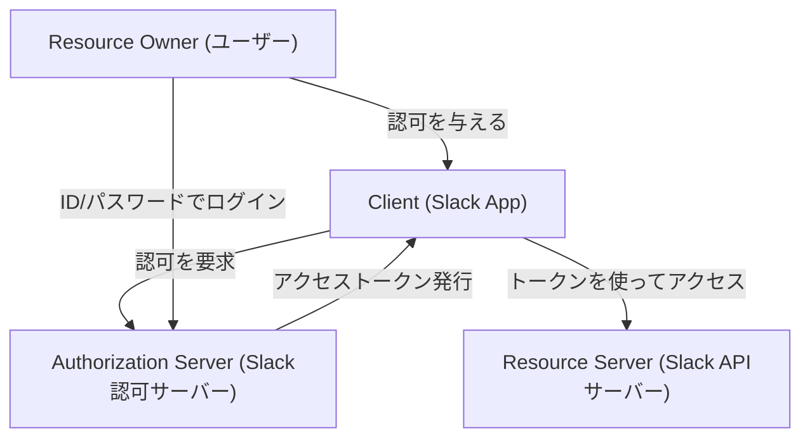
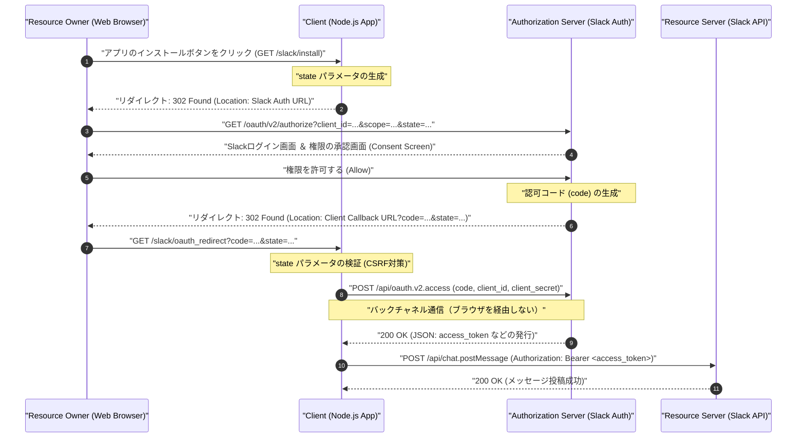
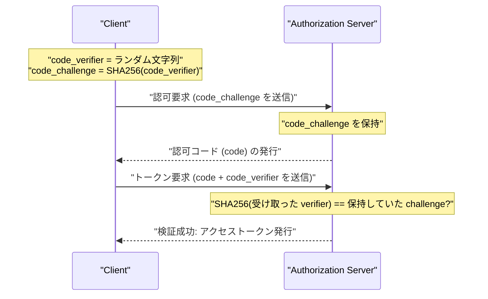

# はじめに：なぜOAuth 2.0を学ぶのか？

現代のWebアプリケーションにおいて、複数のサービスが連携して動作することはもはや当たり前の光景となりました。例えば、「Googleアカウントでログインする」「Trelloのタスクが更新されたらSlackに通知を送る」「ZoomのミーティングリンクをGoogleカレンダーに自動追加する」といった機能です。これらすべての裏側で活躍しているのが **OAuth 2.0 (Open Authorization 2.0)** という認可フレームワークです。

かつて、異なるサービス間でデータをやり取りする際には、ユーザーが自分のIDとパスワードを連携先のサービスに直接渡す「ベーシック認証」や「パスワード共有」という非常に危険な手法が用いられていました。しかし、この方法では連携先サービスがユーザーの全権限を握ることになり、セキュリティ上の致命的なリスクを伴います。

OAuth 2.0は、このような「パスワードの共有」を回避しつつ、「特定の権限（スコープ）のみ」を「限られた時間だけ」サードパーティアプリケーションに委譲するための標準プロトコル（RFC 6749）として誕生しました。

本記事では、このOAuth 2.0の仕組みを、ビジネスコミュニケーションツールとしてデファクトスタンダードとなっている **Slack (Slack API)** を対象としたアプリケーション（Slack App）の実装を通して、極めて詳細かつ実践的に解説していきます。Node.js (Express) を用いたコード例、プロトコルのフローを図解するシーケンス図、そしてセキュリティ上の重要な概念である `state` パラメータや PKCE の数学的・暗号学的背景にまで踏み込んだ、1万文字を超える決定版の解説です。

---

# 1. OAuth 2.0の基本概念：4つの役割（Roles）

OAuth 2.0を理解するための第一歩は、登場人物（Role）を正確に把握することです。RFC 6749 では、以下の4つの役割が定義されています。



1. **Resource Owner（リソースオーナー）**
   - リソースへのアクセス権を付与する権限を持つエンティティです。通常は「エンドユーザー（人間）」を指します。今回の例では、「Slackのワークスペースに所属し、チャンネルにメッセージを投稿する権限を持ったあなた自身」です。
2. **Client（クライアント）**
   - リソースオーナーの許可を得て、リソースサーバーにアクセスしようとするアプリケーションです。今回の例では、「あなたが開発しているNode.jsアプリケーション（Slack App）」です。「クライアント」という名前ですが、サーバーサイドで動くWebアプリケーションであってもOAuthの文脈では「クライアント」と呼ばれます。
3. **Authorization Server（認可サーバー）**
   - リソースオーナーを認証し、リソースオーナーから認可を得た上で、クライアントに対してアクセストークンを発行するサーバーです。今回の例では、`slack.com/oauth/v2/authorize` を提供するSlackの認証基盤です。
4. **Resource Server（リソースサーバー）**
   - 保護されたリソースをホストしており、アクセストークンを用いてリソースへのアクセス要求を受け付け、応答するサーバーです。今回の例では、`chat.postMessage` などのAPIを提供する `slack.com/api/` のエンドポイントです。

OAuthのフローとは、一言で言えば **「Clientが、Resource Ownerの同意を得て、Authorization Serverからアクセストークンを受け取り、それを使ってResource Serverからデータを取得・操作する」** 一連の手順のことです。

---

# 2. 認可コードグラント（Authorization Code Grant）の完全解剖

OAuth 2.0には複数のフロー（グラントタイプ）が存在しますが、Webアプリケーションのようなサーバーサイドで秘密鍵（Client Secret）を安全に保持できる環境において最も推奨され、最も広く使われているのが **認可コードグラント（Authorization Code Grant）** です。

認可コードグラントの最大の特徴は、**フロントチャネル（ブラウザを経由する通信）** と **バックチャネル（サーバー間の直接通信）** を明確に分離している点です。フロントチャネルでは一時的な「認可コード（Authorization Code）」のみを受け渡し、最終的な「アクセストークン」の取得はバックチャネルで行うことで、トークンがブラウザの履歴やリファラに漏洩するリスクを劇的に低減しています。

以下のシーケンス図は、Slack Appにおける認可コードグラントの全工程を示しています。



このフローを、具体的なNode.js (Express) のコード実装を通して一つずつ紐解いていきましょう。

---

# 3. 実装の準備：Slack Developer Consoleでの設定

コードを書く前に、Slackのシステムに対して「新しいクライアントが存在すること」を登録する必要があります。

1. [Slack API: Applications](https://api.slack.com/apps) にアクセスし、「Create New App」をクリックします。
2. 「From scratch」を選択し、アプリ名（例: `My First OAuth App`）とインストール先のワークスペースを指定します。
3. 作成後の画面「Basic Information」にて、以下の重要な2つのクレデンシャル（資格情報）を取得します。
   - **Client ID**: あなたのアプリを公開的に一意に識別するID。ブラウザを経由するリクエスト（フロントチャネル）に含めても問題ありません。
   - **Client Secret**: あなたのアプリだけが知っている秘密の文字列。**絶対にブラウザ側に露出させず、GitHubなどにもコミットしてはいけません。**
4. 「OAuth & Permissions」画面に移動し、「Redirect URLs」にコールバック先のURLを登録します。今回はローカル開発を想定し、以下を設定します。
   - `http://localhost:3000/slack/oauth_redirect`

これで準備は完了です。サーバーの実装に入ります。

---

# 4. 実装ステップ1：`/slack/install` と CSRF対策の `state` パラメータ

ユーザーがアプリを利用開始する（ワークスペースにインストールする）ための最初のエンドポイントを作成します。ここでの最大の責務は、Slackの認可サーバーへユーザーをリダイレクトさせることですが、セキュリティ上極めて重要なのが **`state` パラメータの生成と保存** です。

## stateパラメータの必要性 (CSRF攻撃の防止)

もし `state` パラメータが存在しない場合、悪意のある攻撃者が自身のSlackアカウントで認可プロセスを開始し、取得した「認可コード」を含むコールバックURL（例: `http://localhost:3000/slack/oauth_redirect?code=ATTACKER_CODE`）を被害者に踏ませることができます。被害者のブラウザがこれを実行すると、被害者のセッション上で攻撃者のSlackアカウントとの紐付けが完了してしまい、情報漏洩や意図しない操作の原因となります（ログインCSRF）。

これを防ぐため、リクエストを開始したブラウザと、コールバックを受け取ったブラウザが同一であることを検証するための推測不可能なランダム文字列が `state` です。

## stateのエントロピー（数学的背景）

安全な `state` を生成するためには、十分な「エントロピー（情報量）」を持つ乱数が必要です。エントロピー $E$ は、生成される文字列の種類 $N$ に依存し、以下の式で表されます。

$$
E = \log_2(N) \quad (\text{単位: bits})
$$

たとえば、16バイトの暗号論的疑似乱数（CSPRNG）を生成し、それを16進数（Hex）文字列に変換した場合、表現できる状態の数は $2^{128}$ となります。

$$
E = \log_2(2^{128}) = 128 \text{ bits}
$$

128ビットのエントロピーがあれば、現代の計算機科学においてブルートフォース（総当たり）攻撃で衝突を見つけることは事実上不可能（天文学的な確率）です。通常、セキュリティ要件として少なくとも128ビット以上のエントロピーを持つ `state` が推奨されます。

## Node.jsによる実装

```javascript
// app.js (一部抜粋)
const express = require('express');
const crypto = require('crypto');
const session = require('express-session');
const dotenv = require('dotenv');

dotenv.config();

const app = express();

// セッションのミドルウェア設定（stateを保存するため）
app.use(session({
  secret: process.env.SESSION_SECRET,
  resave: false,
  saveUninitialized: true,
  cookie: { secure: false } // 本番環境では true にする
}));

const SLACK_CLIENT_ID = process.env.SLACK_CLIENT_ID;
const SLACK_AUTHORIZE_URL = 'https://slack.com/oauth/v2/authorize';

app.get('/slack/install', (req, res) => {
  // 16バイトの強力な乱数を生成し、16進数文字列に変換 (エントロピー: 128 bits)
  const state = crypto.randomBytes(16).toString('hex');
  
  // セッションに保存してコールバック時に検証できるようにする
  req.session.oauth_state = state;

  // 要求するスコープ（権限）のリスト（カンマ区切り）
  // chat:write = チャンネルにメッセージを送信する権限
  // channels:read = パブリックチャンネルの情報を取得する権限
  const scope = 'chat:write,channels:read';

  // Slackの認可サーバー構築するURLパラメータ
  const params = new URLSearchParams({
    client_id: SLACK_CLIENT_ID,
    scope: scope,
    state: state,
    redirect_uri: 'http://localhost:3000/slack/oauth_redirect'
  });

  const authUrl = `${SLACK_AUTHORIZE_URL}?${params.toString()}`;
  
  // ユーザーをSlackの認可画面へリダイレクト（302 Found）
  res.redirect(authUrl);
});
```

このエンドポイントにアクセスすると、HTTPレスポンスは以下のようになります。

```http
HTTP/1.1 302 Found
Location: https://slack.com/oauth/v2/authorize?client_id=123.456&scope=chat%3Awrite%2Cchannels%3Aread&state=a1b2c3d4e5f6g7h8i9j0k1l2m3n4o5p6&redirect_uri=http%3A%2F%2Flocalhost%3A3000%2Fslack%2Foauth_redirect
Set-Cookie: connect.sid=...; Path=/; HttpOnly
```

ユーザーのブラウザは即座に指定された `Location` へ遷移し、Slackの画面（Consent Screen）が表示され、「My First OAuth App がワークスペースへのアクセスを求めています」というおなじみの画面が出現します。

---

# 5. 実装ステップ2：コールバックの受け取りとアクセストークンの交換

ユーザーがSlackの画面で「許可する (Allow)」をクリックすると、Slackのサーバーはユーザーのブラウザを、設定しておいた `redirect_uri` へとリダイレクトさせます。その際、URLのクエリパラメータとして `code`（認可コード）と、先ほど送った `state` が付与されます。

バックエンドでは以下の処理を行います。
1. 送られてきた `state` とセッションに保存しておいた `state` が完全一致するか確認する。
2. 一致した場合、受け取った `code` と自分の `client_id`、そして秘匿情報である `client_secret` を使って、Slack APIにバックチャネルで通信し、アクセストークンを要求する。

```javascript
const axios = require('axios');
const SLACK_CLIENT_SECRET = process.env.SLACK_CLIENT_SECRET;
const SLACK_ACCESS_TOKEN_URL = 'https://slack.com/api/oauth.v2.access';

app.get('/slack/oauth_redirect', async (req, res) => {
  const { code, state, error } = req.query;

  // ユーザーが認可を拒否した場合のハンドリング
  if (error === 'access_denied') {
    return res.status(403).send('アクセスが拒否されました。');
  }

  // 1. stateの検証（CSRF対策）
  const savedState = req.session.oauth_state;
  if (!state || state !== savedState) {
    return res.status(400).send('Invalid State Parameter (CSRF Attack Detected)');
  }

  // 使用済みのstateは削除する（リプレイ攻撃防止）
  delete req.session.oauth_state;

  try {
    // 2. 認可コードをアクセストークンに交換（バックチャネル通信）
    const tokenResponse = await axios.post(SLACK_ACCESS_TOKEN_URL, new URLSearchParams({
      client_id: SLACK_CLIENT_ID,
      client_secret: SLACK_CLIENT_SECRET,
      code: code,
      redirect_uri: 'http://localhost:3000/slack/oauth_redirect'
    }).toString(), {
      headers: {
        'Content-Type': 'application/x-www-form-urlencoded'
      }
    });

    const data = tokenResponse.data;

    if (!data.ok) {
      console.error('Token Exchange Error:', data.error);
      return res.status(500).send(`Slack API Error: ${data.error}`);
    }

    // 成功！アクセストークンを取得
    const accessToken = data.access_token;
    const teamName = data.team.name;
    const botUserId = data.bot_user_id;

    console.log(`Successfully installed to ${teamName}. Access Token: ${accessToken}`);

    // 本来であればここで、データベースに暗号化した上でトークンを保存します
    // saveToDatabase(data.team.id, encrypt(accessToken));

    res.send(`インストールが完了しました！ワークスペース: ${teamName}`);

  } catch (err) {
    console.error('Network Error:', err);
    res.status(500).send('通信エラーが発生しました。');
  }
});
```

この `/api/oauth.v2.access` のレスポンスとして、Slackからは以下のようなJSONが返却されます。

```json
{
    "ok": true,
    "app_id": "A12345678",
    "authed_user": {
        "id": "U12345678"
    },
    "scope": "chat:write,channels:read",
    "token_type": "bot",
    "access_token": "<YOUR_BOT_TOKEN_HERE>",
    "bot_user_id": "B12345678",
    "team": {
        "id": "T12345678",
        "name": "My Workspace"
    },
    "enterprise": null
}
```

この `xoxb-` から始まる文字列が、Slackにおける**Botアクセストークン**です。以降、アプリケーションがSlack API（Resource Server）にリクエストを送る際は、HTTPヘッダーに `Authorization: Bearer xoxb-...` と付与することで、認証と権限の証明が行われます。

---

# 6. トークンスコープと最小権限の原則 (Principle of Least Privilege)

OAuth 2.0において最も重要な概念の一つが「スコープ（Scope）」です。スコープとは、アクセストークンに紐付けられた権限の範囲を指します。

Slackでは権限が非常に細かく分類されており、大きく分けて **Bot Token Scopes** と **User Token Scopes** が存在します。
- `chat:write` (Bot): アプリ（ボット）自身としてチャンネルにメッセージを投稿する権限。
- `chat:write` (User): アプリをインストールしたユーザーの代理として（ユーザーの名前とアイコンで）メッセージを投稿する権限。
- `channels:read`: チャンネルのリストを取得する権限。
- `channels:history`: チャンネルの過去のメッセージ履歴を読み取る権限。

セキュリティ上の大原則である「最小権限の原則（Principle of Least Privilege）」に従い、**アプリが提供する機能にとって真に必要不可欠なスコープのみを要求すること** が鉄則です。例えば「通知を送るだけ」のアプリであれば `chat:write` のみを要求すべきであり、`channels:history`（過去の会話を全て読める権限）を要求してはいけません。万が一アプリがハッキングされトークンが漏洩した場合の被害を最小限に抑えるためです。

---

# 7. より高度なセキュリティ：PKCE (Proof Key for Code Exchange)

昨今、OAuth 2.0のセキュリティをさらに強化する仕組みとして **PKCE (Proof Key for Code Exchange, RFC 7636, "ピクシー"と発音)** が標準化され、広く利用されるようになっています。

元々PKCEは、ネイティブアプリ（iOS/Android）やSPA（Single Page Application）など、`client_secret` を安全に保存できない「パブリッククライアント」のために設計されたものでした。しかし現在では、セキュリティのベストプラクティス（OAuth 2.1ドラフト）において、サーバーサイドの「コンフィデンシャルクライアント」であってもPKCEの使用が強く推奨されています。

## PKCEの仕組みと数学的背景

PKCEは「認可リクエストを開始した者」と「トークン交換要求をしている者」が同一であることを暗号学的に証明します。

1. クライアントはランダムな文字列 **`code_verifier`**（43〜128文字）を生成します。
2. これを **SHA-256** でハッシュ化し、BASE64URLエンコードしたものを **`code_challenge`** とします。

数式で表すと以下のようになります。

$$
\text{code\_challenge} = \text{BASE64URL-ENCODE}( \text{SHA256}( \text{ASCII}(\text{code\_verifier}) ) )
$$

3. クライアントは `/slack/install` 実行時に、`state` に加えて `code_challenge` と `code_challenge_method=S256` を認可サーバー（Slack）に送信します（Slackはこれを一時保存します）。
4. コールバック後、トークン交換（`/api/oauth.v2.access`）の際に、ハッシュ化する前の元の **`code_verifier`** を送信します。
5. 認可サーバー（Slack）は受け取った `code_verifier` を自身でSHA-256ハッシュ化し、ステップ3で保存しておいた `code_challenge` と完全一致するか検証します。



この仕組みにより、仮に悪意のあるアプリや通信経路の盗聴によって「認可コード（code）」が盗まれたとしても、攻撃者は元の `code_verifier` を知らないため（不可逆なハッシュ関数SHA-256の性質上、challengeからverifierを逆算することは不可能）、アクセストークンを入手することができません。

現在、Slack APIの一部の新しいフローや、他のモダンなSaaS API（Auth0, Okta, X/Twitter API v2など）ではPKCEのサポートが進んでおり、開発者は積極的に採用すべき技術となっています。

---

# 8. アクセストークンの安全な管理と運用

最後に、取得したアクセストークンの保存方法についてのベストプラクティスです。

## 1. データベースへの保存は暗号化を必須とする
アクセストークン（`xoxb-...`）は、Slackワークスペースへの「合鍵」そのものです。データベース（MySQL, PostgreSQL, MongoDBなど）に平文（プレーンテキスト）で保存してはいけません。万が一SQLインジェクションなどでデータベースが流出した場合、全顧客のSlackが乗っ取られる大惨事となります。

必ずアプリケーションレイヤーで **AES-256-GCM** などの強力な対称鍵暗号を用いて暗号化してからDBに保存してください。暗号化/復号のためのマスターキーは、AWS KMS（Key Management Service）や GCP Cloud KMS などのセキュアな鍵管理サービスを利用して厳格に管理します。

## 2. トークンローテーション（Token Rotation）
長期有効なトークンを使い続けることはリスクを伴います。最新のOAuth実装では「リフレッシュトークン（Refresh Token）」を利用し、数時間ごとに新しいアクセストークンを発行し直す仕組み（Token Rotation）を取り入れることが推奨されます。Slack APIでもオプション設定でトークンローテーションを有効化することが可能です。

---

# まとめ

本記事では、OAuth 2.0の認可コードグラントフローについて、Slack App連携の具体的なNode.js実装コードを交えながら詳細に解説しました。

1. **4つの役割（RO, Client, AS, RS）** を意識することで、システム全体のアーキテクチャが明確になります。
2. **認可コードグラント** は、ブラウザとサーバー間の通信経路（フロント/バックチャネル）を巧みに使い分けることで安全性を担保しています。
3. **`state` パラメータ** によるCSRF防御や、**PKCE** による認可コードインターセプト攻撃の防止など、背景にある暗号学的なメカニズムを理解することがセキュアな実装への近道です。
4. **最小権限の原則** に基づくスコープ設計と、DB保存時の暗号化は運用上絶対に欠かせない要素です。

OAuth 2.0は非常に奥が深く、RFCだけでも膨大な仕様が存在しますが、このように実際のプラットフォーム（Slack）をターゲットにして手を動かしながら学ぶことで、その洗練された設計思想と堅牢なセキュリティの仕組みを実感できるはずです。今後のアプリケーション開発やAPI連携の実装において、本記事の知識が役立てば幸いです。
