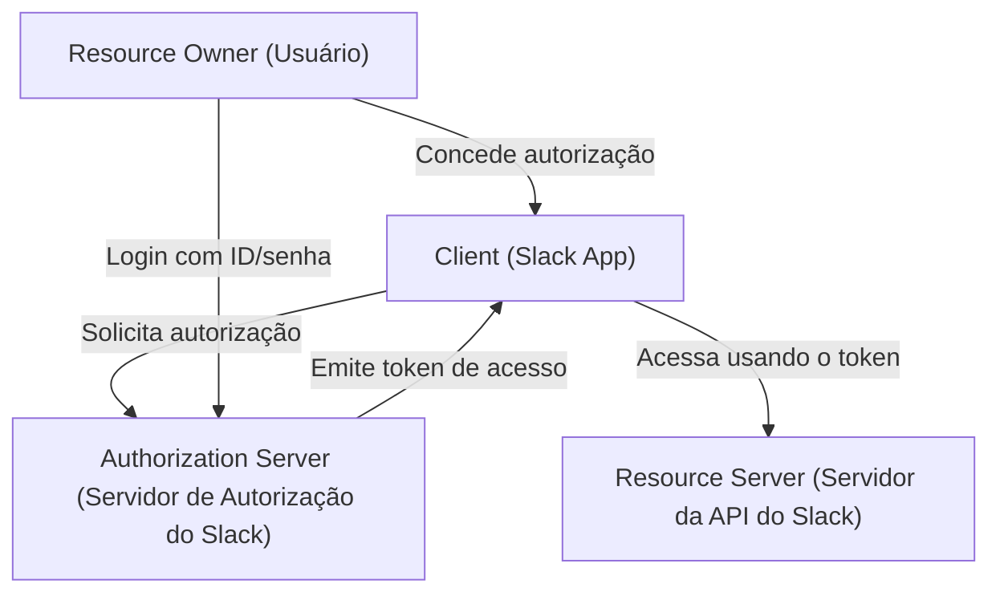
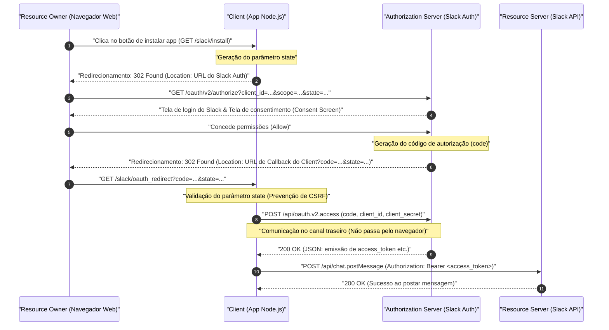
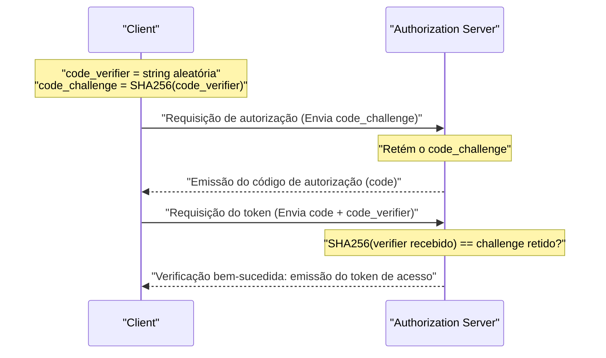

# Introdução: Por que aprender o OAuth 2.0?

Nas aplicações web modernas, tornou-se comum que vários serviços funcionem em conjunto. Por exemplo, funcionalidades como "Fazer login com a conta do Google", "Enviar uma notificação no Slack quando uma tarefa no Trello for atualizada" ou "Adicionar automaticamente um link de reunião do Zoom ao Google Calendar". Nos bastidores de tudo isso atua o framework de autorização **OAuth 2.0 (Open Authorization 2.0)**.

No passado, quando os dados eram trocados entre diferentes serviços, métodos muito perigosos como "Autenticação Básica" e "Compartilhamento de Senha" eram usados, onde os usuários passavam seu ID e senha diretamente para o serviço conectado. No entanto, com esse método, o serviço parceiro assume controle total sobre as credenciais do usuário, o que envolve riscos fatais de segurança.

O OAuth 2.0 foi criado como um protocolo padrão (RFC 6749) para delegar "apenas privilégios específicos (escopos)" por um "tempo limitado" a uma aplicação de terceiros, evitando esse "compartilhamento de senha".

Neste artigo, explicaremos o mecanismo deste OAuth 2.0 de forma extremamente detalhada e prática, através da implementação de uma aplicação (**Slack App**) para o **Slack (Slack API)**, que se tornou um padrão de facto para ferramentas de comunicação corporativa. É um guia definitivo de mais de 10.000 caracteres, cobrindo exemplos de código usando Node.js (Express), diagramas de sequência ilustrando o fluxo do protocolo e até mesmo o contexto matemático e criptográfico do parâmetro `state` e do PKCE, que são conceitos essenciais para segurança.

---

# 1. Conceitos Básicos do OAuth 2.0: Os 4 Papéis (Roles)

O primeiro passo para entender o OAuth 2.0 é identificar com precisão os personagens (Roles). A RFC 6749 define os seguintes 4 papéis:



1. **Resource Owner (Proprietário do Recurso)**
   - A entidade capaz de conceder acesso a um recurso protegido. Geralmente refere-se ao "usuário final (humano)". Neste exemplo, é "você mesmo, que pertence a um workspace do Slack e tem a permissão para postar mensagens em canais".
2. **Client (Cliente)**
   - A aplicação que solicita acesso ao servidor de recursos com a permissão do proprietário do recurso. Neste exemplo, é "a aplicação Node.js (Slack App) que você está desenvolvendo". Apesar do nome "cliente", mesmo aplicações web executadas no lado do servidor são chamadas de "clientes" no contexto do OAuth.
3. **Authorization Server (Servidor de Autorização)**
   - O servidor que autentica o proprietário do recurso, obtém sua autorização e emite tokens de acesso para o cliente. Neste exemplo, é a infraestrutura de autenticação do Slack que fornece `slack.com/oauth/v2/authorize`.
4. **Resource Server (Servidor de Recursos)**
   - O servidor que hospeda os recursos protegidos e que recebe e responde a solicitações de acesso aos recursos utilizando tokens de acesso. Neste exemplo, são os endpoints em `slack.com/api/` que fornecem APIs como `chat.postMessage`.

Em poucas palavras, o fluxo do OAuth é **"uma série de etapas onde o Client, com o consentimento do Resource Owner, recebe um token de acesso do Authorization Server e o utiliza para acessar ou manipular dados do Resource Server"**.

---

# 2. Dissecando Completamente o Fluxo de Concessão de Código de Autorização (Authorization Code Grant)

Existem vários fluxos (tipos de concessão) no OAuth 2.0, mas o mais recomendado e amplamente utilizado em ambientes onde o segredo do cliente (Client Secret) pode ser mantido seguro, como aplicações web executadas no lado do servidor, é o **Fluxo de Concessão de Código de Autorização (Authorization Code Grant)**.

A maior característica desse fluxo é a separação clara entre o **canal frontal (comunicação através do navegador)** e o **canal traseiro (comunicação direta entre servidores)**. Pelo canal frontal, apenas um "Código de Autorização (Authorization Code)" temporário é passado, enquanto a obtenção do "Token de Acesso" final é feita no canal traseiro, o que reduz drasticamente o risco de vazamento do token no histórico ou referrer do navegador.

O diagrama de sequência abaixo mostra todas as etapas da concessão de código de autorização em um Slack App.



Vamos detalhar esse fluxo passo a passo através de uma implementação concreta de código em Node.js (Express).

---

# 3. Preparação para a Implementação: Configurações no Slack Developer Console

Antes de escrever o código, precisamos registrar a existência de um "novo cliente" no sistema do Slack.

1. Acesse [Slack API: Applications](https://api.slack.com/apps) e clique em "Create New App".
2. Selecione "From scratch" e especifique o nome do aplicativo (ex: `My First OAuth App`) e o workspace onde será instalado.
3. Na tela "Basic Information" após a criação, obtenha as seguintes duas credenciais (credentials) importantes:
   - **Client ID**: O ID que identifica unicamente e de forma pública o seu aplicativo. Não há problema em incluí-lo em requisições que passam pelo navegador (canal frontal).
   - **Client Secret**: A string secreta conhecida apenas pelo seu aplicativo. **Nunca o exponha no lado do navegador, e não deve ser comitado em plataformas como o GitHub.**
4. Vá para a tela "OAuth & Permissions" e registre a URL de callback em "Redirect URLs". Assumindo o desenvolvimento local, definiremos o seguinte:
   - `http://localhost:3000/slack/oauth_redirect`

A preparação está concluída. Vamos para a implementação do servidor.

---

# 4. Etapa de Implementação 1: `/slack/install` e o parâmetro `state` para prevenção de CSRF

Criaremos o primeiro endpoint para que os usuários comecem a utilizar o aplicativo (instalar no workspace). A principal responsabilidade aqui é redirecionar o usuário para o servidor de autorização do Slack, mas em termos de segurança, a **geração e armazenamento do parâmetro `state`** é extremamente crucial.

## A Necessidade do Parâmetro state (Prevenção de Ataques CSRF)

Se o parâmetro `state` não existisse, um atacante mal-intencionado poderia iniciar o processo de autorização com sua própria conta do Slack e fazer a vítima acessar uma URL de callback contendo o "código de autorização" obtido (ex: `http://localhost:3000/slack/oauth_redirect?code=ATTACKER_CODE`). Quando o navegador da vítima o executa, a sessão da vítima é vinculada à conta do Slack do atacante, causando vazamento de informações e operações indesejadas (Login CSRF).

Para prevenir isso, utiliza-se o `state`, uma string aleatória imprevisível usada para verificar se o navegador que iniciou a requisição e o navegador que recebeu o callback são o mesmo.

## A Entropia do state (Contexto Matemático)

Para gerar um `state` seguro, precisamos de um número aleatório com "entropia" (quantidade de informação) suficiente. A entropia $E$ depende do número de possíveis strings $N$ que podem ser geradas, sendo representada pela fórmula a seguir:

$$
E = \log_2(N) \quad (\text{unidade: bits})
$$

Por exemplo, se gerarmos um número pseudo-aleatório criptograficamente seguro (CSPRNG) de 16 bytes e o convertermos para uma string hexadecimal (Hex), o número de estados possíveis será $2^{128}$.

$$
E = \log_2(2^{128}) = 128 \text{ bits}
$$

Com 128 bits de entropia, é na prática impossível (probabilidade astronômica) que um ataque de força bruta encontre uma colisão na ciência da computação moderna. Geralmente, os requisitos de segurança recomendam um `state` com pelo menos 128 bits de entropia.

## Implementação com Node.js

```javascript
// app.js (trecho extraído)
const express = require('express');
const crypto = require('crypto');
const session = require('express-session');
const dotenv = require('dotenv');

dotenv.config();

const app = express();

// Configuração do middleware de sessão (para salvar o state)
app.use(session({
  secret: process.env.SESSION_SECRET,
  resave: false,
  saveUninitialized: true,
  cookie: { secure: false } // No ambiente de produção deve ser true
}));

const SLACK_CLIENT_ID = process.env.SLACK_CLIENT_ID;
const SLACK_AUTHORIZE_URL = 'https://slack.com/oauth/v2/authorize';

app.get('/slack/install', (req, res) => {
  // Gera um número aleatório forte de 16 bytes e converte para string hexadecimal (Entropia: 128 bits)
  const state = crypto.randomBytes(16).toString('hex');
  
  // Salva na sessão para que possa ser verificado no momento do callback
  req.session.oauth_state = state;

  // Lista de escopos (permissões) solicitadas (separados por vírgula)
  // chat:write = Permissão para enviar mensagens no canal
  // channels:read = Permissão para obter informações de canais públicos
  const scope = 'chat:write,channels:read';

  // Parâmetros de URL para construir a URL do servidor de autorização do Slack
  const params = new URLSearchParams({
    client_id: SLACK_CLIENT_ID,
    scope: scope,
    state: state,
    redirect_uri: 'http://localhost:3000/slack/oauth_redirect'
  });

  const authUrl = `${SLACK_AUTHORIZE_URL}?${params.toString()}`;
  
  // Redireciona o usuário para a tela de autorização do Slack (302 Found)
  res.redirect(authUrl);
});
```

Ao acessar este endpoint, a resposta HTTP será algo como:

```http
HTTP/1.1 302 Found
Location: https://slack.com/oauth/v2/authorize?client_id=123.456&scope=chat%3Awrite%2Cchannels%3Aread&state=a1b2c3d4e5f6g7h8i9j0k1l2m3n4o5p6&redirect_uri=http%3A%2F%2Flocalhost%3A3000%2Fslack%2Foauth_redirect
Set-Cookie: connect.sid=...; Path=/; HttpOnly
```

O navegador do usuário navega instantaneamente para a `Location` especificada, onde a tela do Slack (Consent Screen) é mostrada, exibindo a familiar tela "My First OAuth App está solicitando acesso ao workspace".

---

# 5. Etapa de Implementação 2: Recebendo o Callback e Trocando o Token de Acesso

Quando o usuário clica em "Permitir (Allow)" na tela do Slack, os servidores do Slack redirecionam o navegador do usuário para o `redirect_uri` que você configurou. Nesse momento, o `code` (código de autorização) e o `state` que você enviou anteriormente serão adicionados como parâmetros de query na URL.

No backend, efetuamos o seguinte processo:
1. Verificar se o `state` recebido corresponde perfeitamente ao `state` que foi salvo na sessão.
2. Em caso positivo, enviar o `code` recebido, seu próprio `client_id` e o segredo `client_secret` ao Slack API por meio da comunicação de canal traseiro (back-channel) para solicitar um token de acesso.

```javascript
const axios = require('axios');
const SLACK_CLIENT_SECRET = process.env.SLACK_CLIENT_SECRET;
const SLACK_ACCESS_TOKEN_URL = 'https://slack.com/api/oauth.v2.access';

app.get('/slack/oauth_redirect', async (req, res) => {
  const { code, state, error } = req.query;

  // Lidar com casos onde o usuário negou a autorização
  if (error === 'access_denied') {
    return res.status(403).send('Acesso negado.');
  }

  // 1. Verificação do state (Prevenção de CSRF)
  const savedState = req.session.oauth_state;
  if (!state || state !== savedState) {
    return res.status(400).send('Parâmetro State Inválido (Ataque CSRF Detectado)');
  }

  // O state usado deve ser excluído (Para prevenir ataques de repetição)
  delete req.session.oauth_state;

  try {
    // 2. Trocar o código de autorização por um token de acesso (Comunicação de canal traseiro)
    const tokenResponse = await axios.post(SLACK_ACCESS_TOKEN_URL, new URLSearchParams({
      client_id: SLACK_CLIENT_ID,
      client_secret: SLACK_CLIENT_SECRET,
      code: code,
      redirect_uri: 'http://localhost:3000/slack/oauth_redirect'
    }).toString(), {
      headers: {
        'Content-Type': 'application/x-www-form-urlencoded'
      }
    });

    const data = tokenResponse.data;

    if (!data.ok) {
      console.error('Erro na Troca de Token:', data.error);
      return res.status(500).send(`Erro da API do Slack: ${data.error}`);
    }

    // Sucesso! Obteve o token de acesso
    const accessToken = data.access_token;
    const teamName = data.team.name;
    const botUserId = data.bot_user_id;

    console.log(`Instalado com sucesso no ${teamName}. Token de Acesso: ${accessToken}`);

    // Idealmente, é aqui que você salva o token no banco de dados após a criptografia
    // saveToDatabase(data.team.id, encrypt(accessToken));

    res.send(`A instalação está concluída! Workspace: ${teamName}`);

  } catch (err) {
    console.error('Erro de Rede:', err);
    res.status(500).send('Ocorreu um erro de comunicação.');
  }
});
```

Em resposta a esta requisição a `/api/oauth.v2.access`, o Slack retornará o seguinte JSON:

```json
{
    "ok": true,
    "app_id": "A12345678",
    "authed_user": {
        "id": "U12345678"
    },
    "scope": "chat:write,channels:read",
    "token_type": "bot",
    "access_token": "<YOUR_BOT_TOKEN_HERE>",
    "bot_user_id": "B12345678",
    "team": {
        "id": "T12345678",
        "name": "My Workspace"
    },
    "enterprise": null
}
```

Essa string que começa com `xoxb-` é o **Bot Access Token** do Slack. Daqui em diante, sempre que a aplicação enviar uma requisição à API do Slack (Resource Server), você o fará adicionando `Authorization: Bearer xoxb-...` nos cabeçalhos HTTP, o que provará a autenticação e autorização.

---

# 6. Escopo de Token e Princípio do Menor Privilégio (Principle of Least Privilege)

Um dos conceitos mais cruciais no OAuth 2.0 é o "Escopo (Scope)". Escopo refere-se ao limite de permissões associado a um token de acesso.

No Slack, as permissões são categorizadas muito finamente e são amplamente divididas em **Bot Token Scopes** e **User Token Scopes**.
- `chat:write` (Bot): Permissão para o próprio app (bot) postar mensagens no canal.
- `chat:write` (User): Permissão para postar mensagens em nome do usuário que instalou o aplicativo (usando o nome e ícone do usuário).
- `channels:read`: Permissão para obter a lista de canais.
- `channels:history`: Permissão para ler o histórico de mensagens passadas do canal.

Seguindo o princípio de segurança definitivo de "Princípio do Menor Privilégio", a regra de ouro é **solicitar apenas os escopos estritamente necessários para os recursos fornecidos pela aplicação**. Por exemplo, se for uma aplicação "que apenas envia notificações", ela deve requerer apenas `chat:write` e nunca `channels:history` (permissão para ler todo o histórico de conversas passadas). Isso é para minimizar os danos, caso a aplicação seja hackeada e ocorra o vazamento do token.

---

# 7. Segurança Mais Avançada: PKCE (Proof Key for Code Exchange)

Recentemente, o **PKCE (Proof Key for Code Exchange, RFC 7636, pronunciado como "pixy")** tem sido padronizado e é amplamente utilizado para aprimorar ainda mais a segurança do OAuth 2.0.

Originalmente, o PKCE foi criado para "clientes públicos", que não podem armazenar de forma segura o `client_secret`, como aplicativos nativos (iOS/Android) ou SPAs (Single Page Applications). No entanto, hoje, as melhores práticas de segurança (Rascunho do OAuth 2.1) recomendam fortemente o uso de PKCE, mesmo em "clientes confidenciais" do lado do servidor.

## Como o PKCE funciona e o seu Contexto Matemático

O PKCE prova criptograficamente que a "entidade que iniciou a requisição de autorização" e a "entidade que está solicitando a troca do token" são a mesma pessoa.

1. O cliente gera uma string aleatória **`code_verifier`** (de 43 a 128 caracteres).
2. O cliente converte a mesma usando **SHA-256**, e a codifica usando BASE64URL para obter o **`code_challenge`**.

Isso pode ser representado com a seguinte fórmula:

$$
\text{code\_challenge} = \text{BASE64URL-ENCODE}( \text{SHA256}( \text{ASCII}(\text{code\_verifier}) ) )
$$

3. Ao executar `/slack/install`, o cliente envia `code_challenge` e `code_challenge_method=S256` além do `state` para o servidor de autorização (Slack), e o Slack armazena esse challenge temporariamente.
4. Após o callback, durante a troca de tokens (`/api/oauth.v2.access`), o cliente envia a versão pré-hash original, o **`code_verifier`**.
5. O servidor de autorização (Slack) faz o hash SHA-256 do `code_verifier` recebido para verificar se corresponde perfeitamente ao `code_challenge` salvo no passo 3.



Por esse mecanismo, mesmo que o "código de autorização (code)" seja roubado devido a um aplicativo malicioso ou intercepção no caminho de comunicação, o atacante não pode adquirir o token de acesso porque não sabe o `code_verifier` original (devido à propriedade de via única do algoritmo de hash SHA-256, que torna impossível fazer a engenharia reversa do desafio para obter o verificador).

Atualmente, o suporte ao PKCE está avançando em fluxos mais novos na API do Slack e em outras APIs SaaS modernas (Auth0, Okta, X/Twitter API v2, etc.), tornando-se uma tecnologia que desenvolvedores devem adotar ativamente.

---

# 8. Gestão Segura e Operação de Tokens de Acesso

Finalmente, uma breve discussão sobre as melhores práticas para guardar tokens de acesso obtidos de forma segura.

## 1. O armazenamento em banco de dados deve ser criptografado
Um token de acesso (`xoxb-...`) é basicamente a "chave mestra" do workspace do Slack. Você nunca deve guardá-lo como texto simples num banco de dados (MySQL, PostgreSQL, MongoDB, etc.). Na eventualidade improvável de que o banco de dados seja exposto em um ataque de Injeção de SQL, resultaria em um desastre massivo em que o Slack de todos os clientes seria tomado.

Você sempre deve criptografá-lo primeiro na camada de aplicação usando criptografia simétrica forte como **AES-256-GCM** antes de salvar no DB. A chave mestre para criptografia/descriptografia será gerenciada de forma estrita usando serviços seguros de gerenciamento de chaves, como AWS KMS (Key Management Service) ou GCP Cloud KMS.

## 2. Rotação de Tokens (Token Rotation)
Continuar usando tokens com uma validade longa de vida carrega riscos. As implementações mais recentes do OAuth recomendam a adoção de um mecanismo (Token Rotation) para reemitir um novo token de acesso a cada poucas horas usando "Refresh Tokens". É possível ativar a rotação de tokens nas definições opcionais da API do Slack também.

---

# Conclusão

Neste artigo, explicamos detalhadamente o fluxo de Concessão de Código de Autorização do OAuth 2.0 através da implementação de códigos em Node.js para a integração do Slack App.

1. Estando ciente dos **4 Papéis (RO, Client, AS, RS)**, toda a arquitetura de sistema fica muito clara.
2. O **Fluxo de Concessão de Código de Autorização** garante segurança através do uso inteligente das vias de comunicação entre o navegador e o servidor (canal frontal / canal traseiro).
3. Entender as mecânicas criptográficas por trás de aspectos como a prevenção de CSRF providenciada pelo **parâmetro `state`** ou a prevenção do ataque de intercepção do código de autorização pelo **PKCE**, é um atalho vitalício na hora de escrever código seguro.
4. Definir escopos baseados no **Princípio do Menor Privilégio** e encriptar tokens no momento da guarda no banco de dados, são componentes indispensáveis que você deve dominar em uma operação.

OAuth 2.0 é extremamente profundo, com um volume massivo de especificações apenas dentro da RFC. Porém, ao testar, mexer no código na prática enquanto toma de alvo uma plataforma real (como o Slack), você consegue ver toda aquela ideologia refinada do design e aquele mecanismo de segurança robusto que ganha vida e entra no lugar. Espero que as informações partilhadas neste artigo sejam muito úteis no futuro em implementações de integração de API e desenvolvimento das suas aplicações.
