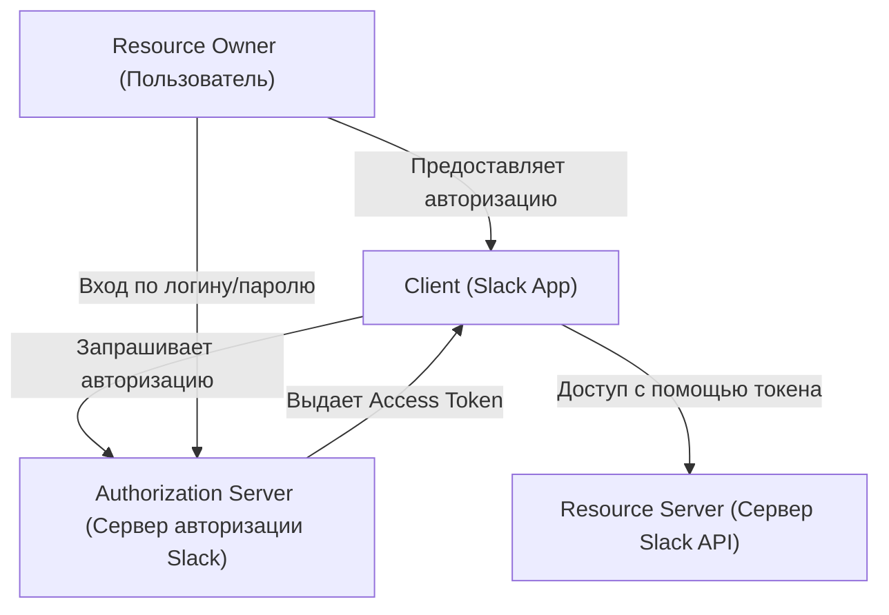
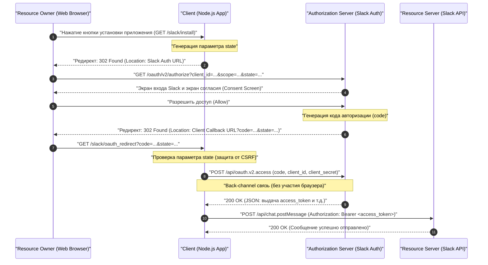
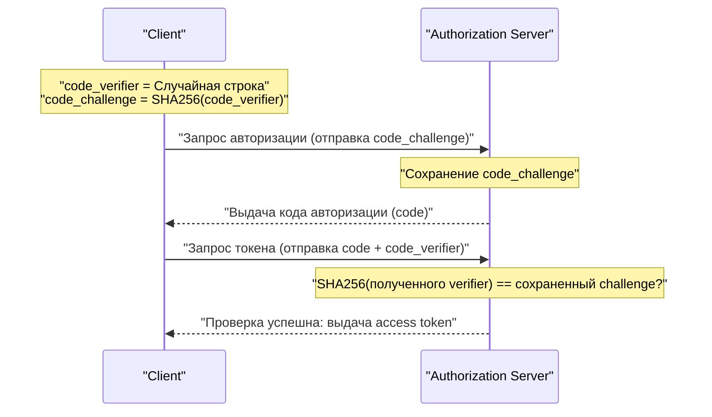

# Введение: Зачем изучать OAuth 2.0?

В современных веб-приложениях совместная работа нескольких сервисов стала уже привычным делом. Например, такие функции, как «Вход через Google», «Отправка уведомления в Slack при обновлении задачи в Trello» или «Автоматическое добавление ссылки на встречу Zoom в Google Календарь». За всем этим стоит фреймворк авторизации **OAuth 2.0 (Open Authorization 2.0)**.

В прошлом при обмене данными между различными сервисами использовались такие методы, как «Базовая аутентификация» или «Обмен паролями», когда пользователь передавал свой логин и пароль стороннему сервису напрямую, что было крайне опасно. Этот метод давал стороннему сервису полный доступ к правам пользователя, создавая фатальные риски для безопасности.

OAuth 2.0 был создан как стандартный протокол (RFC 6749) для того, чтобы избежать подобного «обмена паролями», позволяя передавать сторонним приложениям только «определенные права (области доступа / scopes)» и только на «ограниченное время».

В этой статье мы подробно и на практике разберем механизм OAuth 2.0 на примере создания приложения (Slack App) для **Slack (Slack API)**, который стал де-факто стандартом среди корпоративных мессенджеров. Это исчерпывающее руководство объемом более 10 000 символов, включающее примеры кода на Node.js (Express), диаграммы последовательностей, иллюстрирующие поток протокола, а также глубокое погружение в математические и криптографические аспекты таких важных понятий безопасности, как параметр `state` и PKCE.

---

# 1. Базовые концепции OAuth 2.0: 4 роли (Roles)

Первый шаг к пониманию OAuth 2.0 — это точное понимание его действующих лиц (Roles). Согласно RFC 6749, определены следующие 4 роли:



1. **Resource Owner (Владелец ресурса)**
   - Сущность, имеющая право предоставлять доступ к ресурсу. Обычно это «конечный пользователь (человек)». В нашем примере это «вы сами, как участник рабочего пространства Slack с правом публиковать сообщения в каналах».
2. **Client (Клиент)**
   - Приложение, которое пытается получить доступ к серверу ресурсов с разрешения владельца ресурса. В нашем примере это «приложение на Node.js, которое вы разрабатываете (Slack App)». Хотя оно и называется «клиентом», в контексте OAuth даже серверные веб-приложения называются «клиентами».
3. **Authorization Server (Сервер авторизации)**
   - Сервер, который аутентифицирует владельца ресурса, получает его согласие и выдает клиенту маркер доступа (Access Token). В нашем примере это инфраструктура аутентификации Slack, предоставляющая `slack.com/oauth/v2/authorize`.
4. **Resource Server (Сервер ресурсов)**
   - Сервер, на котором размещены защищенные ресурсы и который принимает запросы на доступ к ним с использованием токена доступа. В нашем примере это конечные точки `slack.com/api/`, предоставляющие такие API, как `chat.postMessage`.

Поток OAuth в двух словах — это **«последовательность действий, при которой Клиент получает согласие Владельца ресурса, получает маркер доступа от Сервера авторизации и с его помощью получает или изменяет данные на Сервере ресурсов»**.

---

# 2. Полный разбор Authorization Code Grant (Предоставление кода авторизации)

В OAuth 2.0 существует несколько потоков (типов предоставления / grant types), но самым рекомендуемым и широко используемым для сред, где можно безопасно хранить секретный ключ (Client Secret) — например, в серверных веб-приложениях — является **Authorization Code Grant (Предоставление кода авторизации)**.

Главной особенностью Authorization Code Grant является четкое разделение **front-channel (связь через браузер)** и **back-channel (прямая связь между серверами)**. Через front-channel передается только временный «код авторизации (Authorization Code)», а окончательное получение «маркера доступа (Access Token)» происходит через back-channel. Это значительно снижает риск утечки токена через историю браузера или HTTP-реферер.

Следующая диаграмма последовательности показывает весь процесс Authorization Code Grant для Slack App.



Давайте разберем этот поток шаг за шагом с помощью конкретной реализации на Node.js (Express).

---

# 3. Подготовка к реализации: Настройки в Slack Developer Console

Перед написанием кода необходимо зарегистрировать в системе Slack информацию о том, что «существует новый клиент».

1. Перейдите в [Slack API: Applications](https://api.slack.com/apps) и нажмите «Create New App».
2. Выберите «From scratch», укажите имя приложения (например, `My First OAuth App`) и рабочее пространство для установки.
3. На появившемся экране «Basic Information» получите следующие две важные учетные данные:
   - **Client ID**: Идентификатор, который уникально идентифицирует ваше приложение в публичном доступе. Нет проблем, если он будет включен в запросы, проходящие через браузер (front-channel).
   - **Client Secret**: Секретная строка, известная только вашему приложению. **Ни в коем случае не показывайте её на стороне браузера и не коммитьте в GitHub.**
4. Перейдите на вкладку «OAuth & Permissions» и добавьте URL обратного вызова в «Redirect URLs». Для локальной разработки укажите следующее:
   - `http://localhost:3000/slack/oauth_redirect`

На этом подготовка завершена. Переходим к реализации сервера.

---

# 4. Шаг реализации 1: `/slack/install` и параметр `state` для защиты от CSRF

Создадим первую конечную точку для того, чтобы пользователь мог начать использовать приложение (установить его в рабочее пространство). Главная задача здесь — перенаправить пользователя на сервер авторизации Slack. Однако с точки зрения безопасности критически важным является **генерация и сохранение параметра `state`**.

## Зачем нужен параметр state (Предотвращение CSRF-атак)

Если параметр `state` отсутствует, злоумышленник может начать процесс авторизации под своим аккаунтом Slack и подкинуть жертве URL обратного вызова, содержащий полученный «код авторизации» (например, `http://localhost:3000/slack/oauth_redirect?code=ATTACKER_CODE`). Если браузер жертвы выполнит этот запрос, в сессии жертвы будет привязан аккаунт Slack злоумышленника, что может привести к утечке информации или нежелательным действиям (Login CSRF).

Чтобы предотвратить это, используется `state` — непредсказуемая случайная строка, позволяющая убедиться, что браузер, инициировавший запрос, и браузер, получивший обратный вызов, — это один и тот же браузер.

## Энтропия state (Математический контекст)

Для генерации безопасного `state` необходимо случайное число с достаточной «энтропией (количеством информации)». Энтропия $E$ зависит от количества возможных вариантов строки $N$ и выражается следующей формулой:

$$
E = \log_2(N) \quad (\text{единицы измерения: биты})
$$

Например, если сгенерировать 16-байтное криптографически стойкое псевдослучайное число (CSPRNG) и преобразовать его в шестнадцатеричную (Hex) строку, количество возможных состояний будет $2^{128}$.

$$
E = \log_2(2^{128}) = 128 \text{ бит}
$$

С энтропией в 128 бит найти коллизию путем полного перебора (brute-force) в современной информатике практически невозможно (астрономически малая вероятность). Обычно в качестве требования безопасности рекомендуется использовать `state` с энтропией не менее 128 бит.

## Реализация на Node.js

```javascript
// app.js (фрагмент)
const express = require('express');
const crypto = require('crypto');
const session = require('express-session');
const dotenv = require('dotenv');

dotenv.config();

const app = express();

// Настройка промежуточного ПО для сессий (для сохранения state)
app.use(session({
  secret: process.env.SESSION_SECRET,
  resave: false,
  saveUninitialized: true,
  cookie: { secure: false } // В производственной среде установите в true
}));

const SLACK_CLIENT_ID = process.env.SLACK_CLIENT_ID;
const SLACK_AUTHORIZE_URL = 'https://slack.com/oauth/v2/authorize';

app.get('/slack/install', (req, res) => {
  // Генерация надежного 16-байтного случайного числа и преобразование в hex строку (Энтропия: 128 бит)
  const state = crypto.randomBytes(16).toString('hex');
  
  // Сохранение в сессии для проверки во время обратного вызова
  req.session.oauth_state = state;

  // Список запрашиваемых областей доступа (через запятую)
  // chat:write = право на отправку сообщений в канал
  // channels:read = право на получение информации о публичных каналах
  const scope = 'chat:write,channels:read';

  // URL-параметры для формирования запроса к серверу авторизации Slack
  const params = new URLSearchParams({
    client_id: SLACK_CLIENT_ID,
    scope: scope,
    state: state,
    redirect_uri: 'http://localhost:3000/slack/oauth_redirect'
  });

  const authUrl = `${SLACK_AUTHORIZE_URL}?${params.toString()}`;
  
  // Редирект пользователя на экран авторизации Slack (302 Found)
  res.redirect(authUrl);
});
```

При обращении к этой конечной точке HTTP-ответ будет выглядеть следующим образом:

```http
HTTP/1.1 302 Found
Location: https://slack.com/oauth/v2/authorize?client_id=123.456&scope=chat%3Awrite%2Cchannels%3Aread&state=a1b2c3d4e5f6g7h8i9j0k1l2m3n4o5p6&redirect_uri=http%3A%2F%2Flocalhost%3A3000%2Fslack%2Foauth_redirect
Set-Cookie: connect.sid=...; Path=/; HttpOnly
```

Браузер пользователя немедленно перейдет по указанному `Location`, и появится экран Slack (Consent Screen) со знакомым сообщением «My First OAuth App запрашивает доступ к вашему рабочему пространству».

---

# 5. Шаг реализации 2: Получение обратного вызова и обмен на маркер доступа

Когда пользователь нажимает «Разрешить (Allow)» на экране Slack, сервер Slack перенаправляет браузер пользователя на настроенный `redirect_uri`. При этом к URL добавляются параметры запроса `code` (код авторизации) и `state`, который мы отправили ранее.

В бэкенде выполняются следующие действия:
1. Проверка того, что полученный `state` полностью совпадает со `state`, сохраненным в сессии.
2. При совпадении использование полученного `code`, вашего `client_id` и секретной информации `client_secret` для связи с Slack API через back-channel с запросом на получение токена доступа.

```javascript
const axios = require('axios');
const SLACK_CLIENT_SECRET = process.env.SLACK_CLIENT_SECRET;
const SLACK_ACCESS_TOKEN_URL = 'https://slack.com/api/oauth.v2.access';

app.get('/slack/oauth_redirect', async (req, res) => {
  const { code, state, error } = req.query;

  // Обработка случая, если пользователь отклонил авторизацию
  if (error === 'access_denied') {
    return res.status(403).send('Доступ отклонен.');
  }

  // 1. Проверка state (защита от CSRF)
  const savedState = req.session.oauth_state;
  if (!state || state !== savedState) {
    return res.status(400).send('Invalid State Parameter (CSRF Attack Detected)');
  }

  // Удаляем использованный state (защита от атак повторного воспроизведения)
  delete req.session.oauth_state;

  try {
    // 2. Обмен кода авторизации на токен доступа (Back-channel связь)
    const tokenResponse = await axios.post(SLACK_ACCESS_TOKEN_URL, new URLSearchParams({
      client_id: SLACK_CLIENT_ID,
      client_secret: SLACK_CLIENT_SECRET,
      code: code,
      redirect_uri: 'http://localhost:3000/slack/oauth_redirect'
    }).toString(), {
      headers: {
        'Content-Type': 'application/x-www-form-urlencoded'
      }
    });

    const data = tokenResponse.data;

    if (!data.ok) {
      console.error('Token Exchange Error:', data.error);
      return res.status(500).send(`Ошибка Slack API: ${data.error}`);
    }

    // Успех! Получен токен доступа
    const accessToken = data.access_token;
    const teamName = data.team.name;
    const botUserId = data.bot_user_id;

    console.log(`Успешно установлено в ${teamName}. Access Token: ${accessToken}`);

    // В реальности здесь токен следует зашифровать и сохранить в базу данных
    // saveToDatabase(data.team.id, encrypt(accessToken));

    res.send(`Установка завершена! Рабочее пространство: ${teamName}`);

  } catch (err) {
    console.error('Network Error:', err);
    res.status(500).send('Произошла ошибка сети.');
  }
});
```

В качестве ответа на этот запрос `/api/oauth.v2.access`, Slack возвращает следующий JSON:

```json
{
    "ok": true,
    "app_id": "A12345678",
    "authed_user": {
        "id": "U12345678"
    },
    "scope": "chat:write,channels:read",
    "token_type": "bot",
    "access_token": "<YOUR_BOT_TOKEN_HERE>",
    "bot_user_id": "B12345678",
    "team": {
        "id": "T12345678",
        "name": "My Workspace"
    },
    "enterprise": null
}
```

Строка, начинающаяся с `xoxb-`, — это **Bot Access Token** в Slack. В дальнейшем, когда приложение будет отправлять запросы к Slack API (Resource Server), оно должно будет указывать `Authorization: Bearer xoxb-...` в HTTP-заголовке для аутентификации и подтверждения прав.

---

# 6. Области действия токенов (Scopes) и принцип наименьших привилегий

Одним из важнейших понятий в OAuth 2.0 является «Область действия (Scope)». Scope обозначает набор прав, привязанных к токену доступа.

В Slack права доступа классифицированы очень детально и в основном делятся на **Bot Token Scopes** и **User Token Scopes**.
- `chat:write` (Bot): Право отправлять сообщения в каналы от лица самого приложения (бота).
- `chat:write` (User): Право отправлять сообщения от имени пользователя, установившего приложение (с его именем и аватаркой).
- `channels:read`: Право на получение списка каналов.
- `channels:history`: Право на чтение истории прошлых сообщений в канале.

В соответствии с важнейшим принципом безопасности — «Принципом наименьших привилегий (Principle of Least Privilege)» — железным правилом является **запрашивать только те права, которые абсолютно необходимы для работы приложения**. Например, если приложение предназначено «только для отправки уведомлений», оно должно запрашивать только `chat:write`, и не должно запрашивать `channels:history` (право читать всю прошлую переписку). Это делается для минимизации ущерба в случае взлома приложения и утечки токена.

---

# 7. Более продвинутая безопасность: PKCE (Proof Key for Code Exchange)

В последнее время все шире используется стандарт **PKCE (Proof Key for Code Exchange, RFC 7636, произносится как "пикси")** как механизм дополнительного усиления безопасности OAuth 2.0.

Изначально PKCE был разработан для «публичных клиентов», таких как нативные приложения (iOS/Android) или SPA (Single Page Application), которые не могут безопасно хранить `client_secret`. Однако сегодня в рекомендациях по безопасности (черновик OAuth 2.1) строго рекомендуется использовать PKCE даже для серверных «конфиденциальных клиентов».

## Механизм PKCE и его математическая основа

PKCE криптографически доказывает, что «тот, кто инициировал запрос на авторизацию» и «тот, кто запрашивает обмен токена», — это одно и то же лицо.

1. Клиент генерирует случайную строку **`code_verifier`** (от 43 до 128 символов).
2. Эта строка хешируется с помощью **SHA-256** и кодируется в BASE64URL. Результат называется **`code_challenge`**.

Математически это можно выразить так:

$$
\text{code\_challenge} = \text{BASE64URL-ENCODE}( \text{SHA256}( \text{ASCII}(\text{code\_verifier}) ) )
$$

3. При выполнении `/slack/install`, клиент отправляет на сервер авторизации (Slack) `code_challenge` и `code_challenge_method=S256` вместе с параметром `state` (Slack временно сохраняет это).
4. После обратного вызова, во время обмена токена (`/api/oauth.v2.access`), клиент отправляет исходный **`code_verifier`** (до хеширования).
5. Сервер авторизации (Slack) самостоятельно хеширует полученный `code_verifier` с помощью SHA-256 и проверяет, полностью ли он совпадает с `code_challenge`, сохраненным на шаге 3.



Благодаря этому механизму, даже если «код авторизации (code)» будет украден вредоносным приложением или в результате перехвата связи, злоумышленник не сможет получить маркер доступа, поскольку он не знает исходного `code_verifier` (из-за необратимой природы хеш-функции SHA-256 невозможно получить verifier из challenge).

В настоящее время поддержка PKCE продвигается в некоторых новых потоках Slack API, а также в других современных API SaaS (Auth0, Okta, X/Twitter API v2 и т.д.), и разработчикам следует активно внедрять эту технологию.

---

# 8. Безопасное управление и использование токенов доступа

Наконец, рассмотрим лучшие практики по сохранению полученных токенов доступа.

## 1. Обязательное шифрование при сохранении в базу данных
Маркер доступа (`xoxb-...`) — это буквальный «ключ» к рабочему пространству Slack. Его нельзя хранить в базе данных (MySQL, PostgreSQL, MongoDB и т.д.) в виде открытого (plain) текста. В случае утечки базы данных, например, из-за SQL-инъекции, произойдет катастрофа: аккаунты Slack всех клиентов будут скомпрометированы.

Обязательно шифруйте токены на уровне приложения с использованием сильных алгоритмов симметричного шифрования, таких как **AES-256-GCM**, перед их сохранением в БД. Главный ключ для шифрования/дешифрования должен строго управляться с использованием безопасных сервисов управления ключами, таких как AWS KMS (Key Management Service) или GCP Cloud KMS.

## 2. Ротация токенов (Token Rotation)
Использование долгоживущих токенов связано с рисками. В современных реализациях OAuth рекомендуется внедрять механизм перевыпуска нового токена доступа каждые несколько часов (Token Rotation) с использованием «токена обновления (Refresh Token)». В Slack API также можно включить ротацию токенов в настройках.

---

# Заключение

В этой статье мы подробно разобрали поток Authorization Code Grant в OAuth 2.0 с примерами реализации на Node.js для интеграции со Slack App.

1. Понимание **4 ролей (RO, Client, AS, RS)** проясняет архитектуру всей системы.
2. **Authorization Code Grant** обеспечивает безопасность за счет грамотного использования каналов связи (front-channel / back-channel) между браузером и сервером.
3. Понимание криптографических механизмов, стоящих за защитой от CSRF с помощью параметра **`state`** и предотвращением перехвата кода авторизации с помощью **PKCE**, является кратчайшим путем к безопасной реализации.
4. Проектирование областей доступа (scopes) на основе **принципа наименьших привилегий** и шифрование при сохранении в БД — абсолютно необходимые элементы для эксплуатации.

OAuth 2.0 — очень глубокая тема, и одни только спецификации RFC имеют огромный объем. Однако, изучая его на практике на примере реальной платформы (Slack), вы сможете почувствовать его продуманную архитектуру и надежные механизмы безопасности. Надеемся, что знания, полученные из этой статьи, окажутся полезными в вашей будущей разработке приложений и интеграции API.
