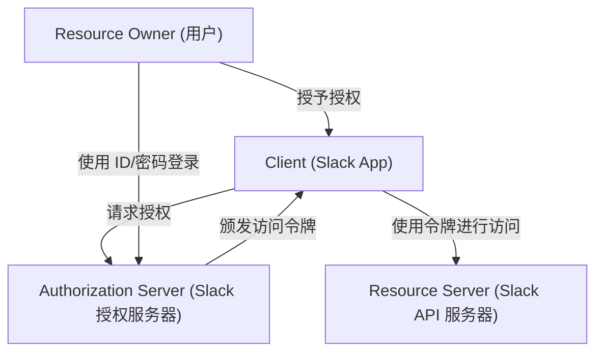
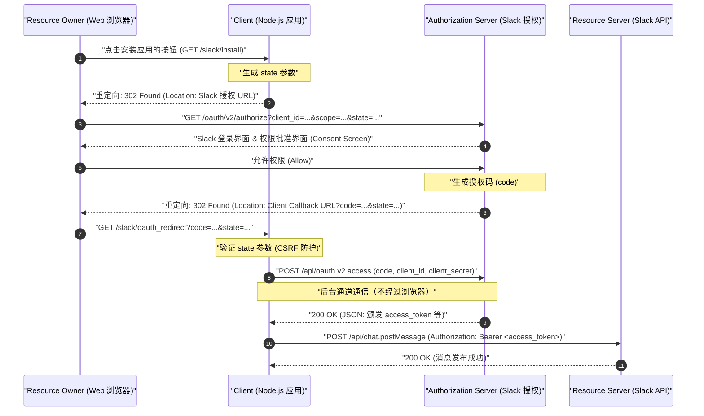
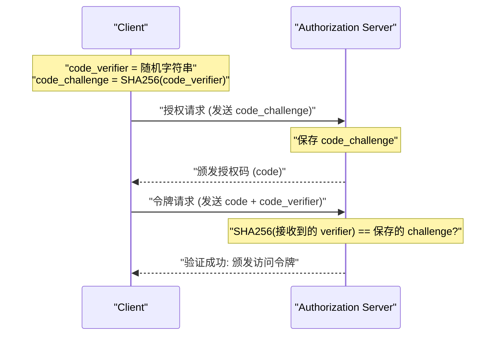

# 前言：为什么要学习 OAuth 2.0？

在现代 Web 应用程序中，多个服务协同工作已经成为司空见惯的场景。例如，“使用 Google 账号登录”、“Trello 任务更新时向 Slack 发送通知”、“将 Zoom 会议链接自动添加到 Google 日历”等功能。在所有这些功能的背后发挥作用的，就是名为 **OAuth 2.0 (Open Authorization 2.0)** 的授权框架。

过去，在不同服务之间交换数据时，曾使用过让用户将自己的 ID 和密码直接交给关联服务的“基本认证”或“密码共享”等极其危险的方法。然而，使用这种方法，关联服务将掌握用户的全部权限，伴随着致命的安全风险。

OAuth 2.0 作为一种标准协议（RFC 6749）应运而生，它旨在避免这种“密码共享”的情况，同时仅将“特定权限（作用域）”在“有限时间内”委托给第三方应用程序。

本文将以作为商业通信工具事实标准的 **Slack (Slack API)** 为对象，通过应用程序（Slack App）的实现，极其详细且富有实践性地解说 OAuth 2.0 的机制。这是一篇超过一万字的决定版解说，包含了使用 Node.js (Express) 的代码示例、图解协议流程的序列图，甚至深入探讨了安全上的重要概念 `state` 参数以及 PKCE 的数学和密码学背景。

---

# 1. OAuth 2.0 的基本概念：4 个角色（Roles）

理解 OAuth 2.0 的第一步是准确掌握其中的登场人物（Role）。在 RFC 6749 中，定义了以下 4 个角色。



1. **Resource Owner（资源所有者）**
   - 拥有赋予资源访问权限的实体。通常指“最终用户（人类）”。在本次的例子中，就是“属于 Slack 工作区，拥有在频道中发布消息权限的你本人”。
2. **Client（客户端）**
   - 在获得资源所有者的许可后，尝试访问资源服务器的应用程序。在本次的例子中，是“你正在开发的 Node.js 应用程序（Slack App）”。虽然名叫“客户端”，但在 OAuth 的语境中，即使是在服务器端运行的 Web 应用程序也被称为“客户端”。
3. **Authorization Server（授权服务器）**
   - 对资源所有者进行身份验证，在获得资源所有者的授权后，向客户端颁发访问令牌的服务器。在本次的例子中，是提供 `slack.com/oauth/v2/authorize` 的 Slack 身份验证基础设施。
4. **Resource Server（资源服务器）**
   - 托管受保护的资源，接收使用访问令牌发出的资源访问请求并予以响应的服务器。在本次的例子中，是提供 `chat.postMessage` 等 API 的 `slack.com/api/` 端点。

一言以蔽之，OAuth 的流程就是 **“Client 在获得 Resource Owner 同意后，从 Authorization Server 接收访问令牌，并使用它从 Resource Server 获取和操作数据”** 的一系列步骤。

---

# 2. 完全解剖授权码授权（Authorization Code Grant）

OAuth 2.0 存在多种流程（授权类型），但在 Web 应用程序这种可以在服务器端安全保存私钥（Client Secret）的环境中，最被推荐且使用最广泛的是 **授权码授权（Authorization Code Grant）**。

授权码授权的最大特点在于明确分离了 **前台通道（通过浏览器的通信）** 和 **后台通道（服务器之间的直接通信）**。在前台通道中，只传递临时的“授权码（Authorization Code）”，而最终获取“访问令牌”的过程在后台通道进行，从而大幅降低了令牌泄露到浏览器历史记录或 Referer 中的风险。

以下序列图展示了 Slack App 中授权码授权的全过程。



让我们通过具体的 Node.js (Express) 代码实现，来一步步解开这个流程。

---

# 3. 准备实现：Slack Developer Console 中的设置

在编写代码之前，必须向 Slack 系统注册“存在一个新的客户端”。

1. 访问 [Slack API: Applications](https://api.slack.com/apps)，点击“Create New App”。
2. 选择“From scratch”，指定应用名称（例：`My First OAuth App`）以及要安装的工作区。
3. 在创建后的“Basic Information”界面，获取以下 2 个重要的凭证（资格信息）：
   - **Client ID**: 公开、唯一标识你的应用的 ID。将其包含在经过浏览器的请求（前台通道）中也没有问题。
   - **Client Secret**: 只有你的应用知道的机密字符串。**绝对不能暴露在浏览器端，也不能提交到 GitHub 等地方。**
4. 移动到“OAuth & Permissions”界面，在“Redirect URLs”中注册回调目标的 URL。本次假设是本地开发，设置如下：
   - `http://localhost:3000/slack/oauth_redirect`

准备工作就此完成。接下来进入服务器的实现。

---

# 4. 实现步骤 1：`/slack/install` 与防御 CSRF 的 `state` 参数

创建一个初始端点，供用户开始使用应用（安装到工作区）。这里的最大责任是将用户重定向到 Slack 的授权服务器，但在安全性上极其重要的是 **生成和保存 `state` 参数**。

## state 参数的必要性 (防止 CSRF 攻击)

如果不存在 `state` 参数，恶意的攻击者可以利用自己的 Slack 账号发起授权流程，并将包含获取到的“授权码”的回调 URL（例：`http://localhost:3000/slack/oauth_redirect?code=ATTACKER_CODE`）诱导受害者点击。如果受害者的浏览器执行了该 URL，就会在受害者的会话上完成与攻击者 Slack 账号的绑定，成为信息泄露或意外操作的原因（登录 CSRF）。

为了防止这种情况，`state` 是一串不可预测的随机字符串，用于验证发起请求的浏览器与接收回调的浏览器是否是同一个。

## state 的熵（数学背景）

为了生成安全的 `state`，需要具有足够“熵（信息量）”的随机数。熵 $E$ 依赖于生成的字符串种类 $N$，由以下公式表示。

$$
E = \log_2(N) \quad (\text{单位: bits})
$$

例如，生成 16 字节的密码学安全伪随机数（CSPRNG），并将其转换为十六进制（Hex）字符串时，可表示的状态数为 $2^{128}$。

$$
E = \log_2(2^{128}) = 128 \text{ bits}
$$

拥有 128 位熵的话，在现代计算机科学中，通过暴力破解（穷举攻击）找到碰撞在事实上是不可能的（天文数字般的概率）。通常，作为安全要求，建议 `state` 至少具有 128 位以上的熵。

## Node.js 实现

```javascript
// app.js (节选)
const express = require('express');
const crypto = require('crypto');
const session = require('express-session');
const dotenv = require('dotenv');

dotenv.config();

const app = express();

// 会话中间件设置（用于保存 state）
app.use(session({
  secret: process.env.SESSION_SECRET,
  resave: false,
  saveUninitialized: true,
  cookie: { secure: false } // 在生产环境中设为 true
}));

const SLACK_CLIENT_ID = process.env.SLACK_CLIENT_ID;
const SLACK_AUTHORIZE_URL = 'https://slack.com/oauth/v2/authorize';

app.get('/slack/install', (req, res) => {
  // 生成 16 字节的强随机数，并转换为十六进制字符串 (熵: 128 bits)
  const state = crypto.randomBytes(16).toString('hex');
  
  // 保存到会话中以便在回调时进行验证
  req.session.oauth_state = state;

  // 请求的作用域（权限）列表（逗号分隔）
  // chat:write = 在频道发送消息的权限
  // channels:read = 获取公共频道信息的权限
  const scope = 'chat:write,channels:read';

  // 构建面向 Slack 授权服务器的 URL 参数
  const params = new URLSearchParams({
    client_id: SLACK_CLIENT_ID,
    scope: scope,
    state: state,
    redirect_uri: 'http://localhost:3000/slack/oauth_redirect'
  });

  const authUrl = `${SLACK_AUTHORIZE_URL}?${params.toString()}`;
  
  // 将用户重定向到 Slack 的授权界面（302 Found）
  res.redirect(authUrl);
});
```

访问该端点时，HTTP 响应将如下所示。

```http
HTTP/1.1 302 Found
Location: https://slack.com/oauth/v2/authorize?client_id=123.456&scope=chat%3Awrite%2Cchannels%3Aread&state=a1b2c3d4e5f6g7h8i9j0k1l2m3n4o5p6&redirect_uri=http%3A%2F%2Flocalhost%3A3000%2Fslack%2Foauth_redirect
Set-Cookie: connect.sid=...; Path=/; HttpOnly
```

用户的浏览器将立即跳转到指定的 `Location`，并显示 Slack 的界面（Consent Screen），出现大家熟悉的“My First OAuth App 正在请求访问您的工作区”的界面。

---

# 5. 实现步骤 2：接收回调并交换访问令牌

当用户在 Slack 的界面点击“允许 (Allow)”时，Slack 的服务器会将用户的浏览器重定向到事先设置的 `redirect_uri`。同时，作为 URL 的查询参数，会附加 `code`（授权码）和刚才发送的 `state`。

在后端执行以下处理。
1. 确认传来的 `state` 与保存在会话中的 `state` 是否完全一致。
2. 如果一致，使用接收到的 `code`、自身的 `client_id` 以及作为机密信息的 `client_secret`，在后台通道向 Slack API 发起通信，请求访问令牌。

```javascript
const axios = require('axios');
const SLACK_CLIENT_SECRET = process.env.SLACK_CLIENT_SECRET;
const SLACK_ACCESS_TOKEN_URL = 'https://slack.com/api/oauth.v2.access';

app.get('/slack/oauth_redirect', async (req, res) => {
  const { code, state, error } = req.query;

  // 处理用户拒绝授权的情况
  if (error === 'access_denied') {
    return res.status(403).send('访问被拒绝。');
  }

  // 1. 验证 state（防范 CSRF）
  const savedState = req.session.oauth_state;
  if (!state || state !== savedState) {
    return res.status(400).send('Invalid State Parameter (CSRF Attack Detected)');
  }

  // 删去使用过的 state（防止重放攻击）
  delete req.session.oauth_state;

  try {
    // 2. 将授权码交换为访问令牌（后台通道通信）
    const tokenResponse = await axios.post(SLACK_ACCESS_TOKEN_URL, new URLSearchParams({
      client_id: SLACK_CLIENT_ID,
      client_secret: SLACK_CLIENT_SECRET,
      code: code,
      redirect_uri: 'http://localhost:3000/slack/oauth_redirect'
    }).toString(), {
      headers: {
        'Content-Type': 'application/x-www-form-urlencoded'
      }
    });

    const data = tokenResponse.data;

    if (!data.ok) {
      console.error('Token Exchange Error:', data.error);
      return res.status(500).send(`Slack API Error: ${data.error}`);
    }

    // 成功！获取到访问令牌
    const accessToken = data.access_token;
    const teamName = data.team.name;
    const botUserId = data.bot_user_id;

    console.log(`Successfully installed to ${teamName}. Access Token: ${accessToken}`);

    // 在实际应用中，这里应该将令牌加密后保存到数据库
    // saveToDatabase(data.team.id, encrypt(accessToken));

    res.send(`安装完成！工作区: ${teamName}`);

  } catch (err) {
    console.error('Network Error:', err);
    res.status(500).send('发生通信错误。');
  }
});
```

作为这个 `/api/oauth.v2.access` 的响应，Slack 会返回类似下面的 JSON。

```json
{
    "ok": true,
    "app_id": "A12345678",
    "authed_user": {
        "id": "U12345678"
    },
    "scope": "chat:write,channels:read",
    "token_type": "bot",
    "access_token": "<YOUR_BOT_TOKEN_HERE>",
    "bot_user_id": "B12345678",
    "team": {
        "id": "T12345678",
        "name": "My Workspace"
    },
    "enterprise": null
}
```

这串以 `xoxb-` 开头的字符串，就是 Slack 中的 **Bot 访问令牌**。此后，应用程序向 Slack API（Resource Server）发送请求时，只需在 HTTP 头信息中加上 `Authorization: Bearer xoxb-...`，即可完成身份验证和权限证明。

---

# 6. 令牌作用域与最小权限原则 (Principle of Least Privilege)

OAuth 2.0 中最重要的概念之一是“作用域（Scope）”。作用域是指与访问令牌绑定的权限范围。

在 Slack 中，权限被划分得非常细致，主要分为 **Bot Token Scopes** 和 **User Token Scopes**。
- `chat:write` (Bot): 作为应用（Bot）自身在频道中发布消息的权限。
- `chat:write` (User): 作为安装了应用的用户的代理（使用该用户的名字和头像）发布消息的权限。
- `channels:read`: 获取频道列表的权限。
- `channels:history`: 读取频道历史消息记录的权限。

根据作为安全大原则的“最小权限原则（Principle of Least Privilege）”，**只请求对应用提供的功能而言真正不可或缺的作用域** 是一项铁律。例如，如果是一个“仅发送通知”的应用，那么只应请求 `chat:write`，绝不能请求 `channels:history`（读取所有过去对话的权限）。这是为了在万一应用被黑客攻击、令牌泄露时，能将损失控制在最小范围。

---

# 7. 更高级的安全性：PKCE (Proof Key for Code Exchange)

近年来，作为进一步强化 OAuth 2.0 安全性的机制，**PKCE (Proof Key for Code Exchange, RFC 7636，发音为 "pixy")** 已成为标准并被广泛使用。

原本 PKCE 是为原生应用（iOS/Android）或 SPA（Single Page Application）等无法安全保存 `client_secret` 的“公共客户端（Public Client）”设计的。然而现在，在安全的最佳实践（OAuth 2.1 草案）中，即使是服务器端的“机密客户端（Confidential Client）”，也强烈推荐使用 PKCE。

## PKCE 的机制与数学背景

PKCE 在密码学上证明了“发起授权请求的人”与“发起令牌交换请求的人”是同一个人。

1. 客户端生成一段随机字符串 **`code_verifier`**（43〜128 个字符）。
2. 将其通过 **SHA-256** 进行哈希处理，并进行 BASE64URL 编码，得到的结果作为 **`code_challenge`**。

用数学公式表示如下。

$$
\text{code\_challenge} = \text{BASE64URL-ENCODE}( \text{SHA256}( \text{ASCII}(\text{code\_verifier}) ) )
$$

3. 客户端在执行 `/slack/install` 时，除了 `state` 之外，还将 `code_challenge` 和 `code_challenge_method=S256` 发送给授权服务器（Slack）（Slack 会暂存这些信息）。
4. 回调后，在交换令牌（`/api/oauth.v2.access`）时，发送进行哈希处理之前的原始 **`code_verifier`**。
5. 授权服务器（Slack）自己对收到的 `code_verifier` 进行 SHA-256 哈希处理，并验证其是否与第 3 步中保存的 `code_challenge` 完全一致。



通过这一机制，即便因为恶意应用或通信路径窃听导致“授权码（code）”被盗，由于攻击者不知道原始的 `code_verifier`（受不可逆的哈希函数 SHA-256 的性质限制，不可能从 challenge 反推回 verifier），因此无法获取到访问令牌。

目前，Slack API 的一些新流程以及其他现代 SaaS API（Auth0, Okta, X/Twitter API v2 等）都在推进对 PKCE 的支持，这已经成为开发者应当积极采用的技术。

---

# 8. 访问令牌的安全管理与运维

最后是关于已获取的访问令牌保存方法的最佳实践。

## 1. 存入数据库时必须加密
访问令牌（`xoxb-...`）简直就是 Slack 工作区的“万能钥匙”。绝不能以明文（纯文本）形式将其保存在数据库（MySQL, PostgreSQL, MongoDB 等）中。万一发生 SQL 注入等导致数据库泄露的情况，将演变成所有客户的 Slack 被劫持的大惨剧。

请务必在应用层使用 **AES-256-GCM** 等强对称密钥加密算法进行加密后再存入 DB。用于加密/解密的主密钥，应使用 AWS KMS (Key Management Service) 或 GCP Cloud KMS 等安全的密钥管理服务进行严格管理。

## 2. 令牌轮换（Token Rotation）
持续使用长期有效的令牌伴随着风险。在最新的 OAuth 实现中，建议引入利用“刷新令牌（Refresh Token）”每隔数小时重新颁发新访问令牌的机制（Token Rotation）。在 Slack API 中，也可以通过可选设置启用令牌轮换。

---

# 总结

本文结合 Slack App 集成的具体 Node.js 实现代码，详细解说了 OAuth 2.0 的授权码授权流程。

1. 通过意识到 **4 个角色（RO, Client, AS, RS）**，能使整个系统的架构变得清晰。
2. **授权码授权** 通过巧妙地区分使用浏览器与服务器之间的通信路径（前台/后台通道）来确保安全性。
3. 深入了解利用 **`state` 参数** 防御 CSRF 攻击、利用 **PKCE** 防止授权码拦截攻击等背后的密码学机制，是实现安全代码的捷径。
4. 基于 **最小权限原则** 的作用域设计以及存入 DB 时的加密，是运维上绝对不可或缺的要素。

OAuth 2.0 非常深奥，单是 RFC 就有庞大的规范，但像这样以实际的平台（Slack）为目标，边动手边学习，应该就能切实感受到其洗练的设计理念与坚固的安全机制。如果在今后的应用开发和 API 集成实现中，本文的知识能派上用场，那将是我的荣幸。
