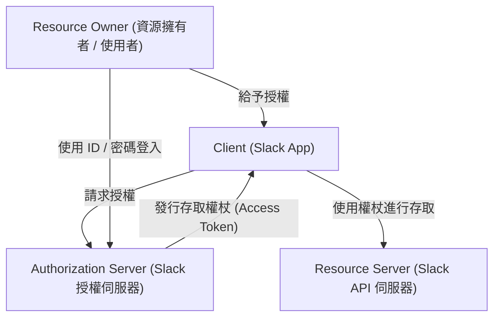
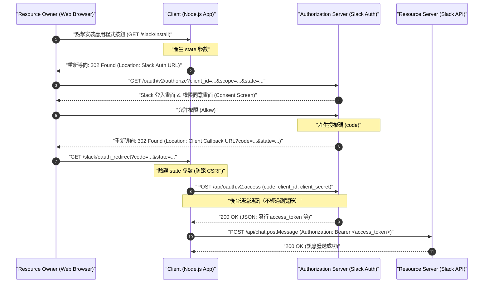
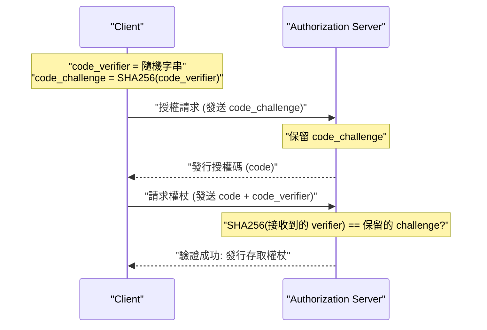

# 前言：為什麼要學習 OAuth 2.0？

在現代的 Web 應用程式中，多個服務協同運作已成為理所當然的景象。例如，「使用 Google 帳號登入」、「當 Trello 任務更新時發送通知到 Slack」、「將 Zoom 的會議連結自動加入 Google 日曆」等功能。在這些功能背後活躍的，正是稱為 **OAuth 2.0 (Open Authorization 2.0)** 的授權框架。

過去，在不同服務之間交換資料時，使用者會將自己的帳號密碼直接交給合作服務，這種稱為「基本驗證（Basic Authentication）」或「密碼共享」的手法非常危險。然而，這種方法會讓合作服務掌握使用者的所有權限，伴隨著安全性上致命的風險。

OAuth 2.0 的誕生正是為了避免這種「密碼共享」的情況，同時作為一種標準協定（RFC 6749），將「僅限特定權限（Scope）」在「有限時間內」委派給第三方應用程式。

本文將透過作為商業通訊工具事實標準的 **Slack (Slack API)** 之應用程式（Slack App）實作，極為詳細且實用地解說 OAuth 2.0 的運作機制。這是一篇超過一萬字的決定版解說，包含了使用 Node.js (Express) 的程式碼範例、圖解協定流程的循序圖，更深入探討了安全性上的重要概念——`state` 參數以及 PKCE 的數學與密碼學背景。

---

# 1. OAuth 2.0 的基本概念：4 個角色（Roles）

理解 OAuth 2.0 的第一步，是準確掌握登場人物（角色）。在 RFC 6749 中，定義了以下 4 個角色：



1. **Resource Owner（資源擁有者）**
   - 擁有賦予資源存取權限的實體。通常指的是「終端使用者（人類）」。在這次的範例中，指的是「隸屬於 Slack 工作區，並擁有在頻道中發送訊息權限的你」。
2. **Client（客戶端）**
   - 取得資源擁有者的許可後，試圖存取資源伺服器的應用程式。在這次的範例中，指的是「你正在開發的 Node.js 應用程式（Slack App）」。雖然名稱是「客戶端」，但在 OAuth 的語境中，即使是在伺服器端運行的 Web 應用程式也被稱為「客戶端」。
3. **Authorization Server（授權伺服器）**
   - 驗證資源擁有者，並在取得資源擁有者的授權後，向客戶端發行存取權杖（Access Token）的伺服器。在這次的範例中，是提供 `slack.com/oauth/v2/authorize` 的 Slack 驗證基礎設施。
4. **Resource Server（資源伺服器）**
   - 託管受保護的資源，並接受使用存取權杖對資源的存取請求並給予回應的伺服器。在這次的範例中，是提供 `chat.postMessage` 等 API 的 `slack.com/api/` 端點。

一句話來說，OAuth 的流程就是 **「Client 取得 Resource Owner 的同意後，從 Authorization Server 接收存取權杖，並使用它來從 Resource Server 取得或操作資料」** 的一連串步驟。

---

# 2. 授權碼授權流程（Authorization Code Grant）完全解剖

OAuth 2.0 存在多種流程（授權類型），但在像是 Web 應用程式這種能在伺服器端安全保存金鑰（Client Secret）的環境中，最受推薦且最被廣泛使用的就是 **授權碼授權流程（Authorization Code Grant）**。

授權碼授權流程最大的特色，在於明確分離了 **前台通道（Front-channel，透過瀏覽器的通訊）** 與 **後台通道（Back-channel，伺服器間的直接通訊）**。在前台通道中僅傳遞暫時的「授權碼（Authorization Code）」，最終的「存取權杖」則是在後台通道取得，藉此大幅降低了權杖洩漏到瀏覽器歷史紀錄或推薦連結（Referer）的風險。

以下的循序圖展示了 Slack App 在授權碼授權流程中的完整過程。



讓我們透過具體的 Node.js (Express) 程式碼實作，一步步解開這個流程。

---

# 3. 實作準備：在 Slack Developer Console 中進行設定

在撰寫程式碼之前，必須向 Slack 系統註冊「有一個新的客戶端存在」。

1. 前往 [Slack API: Applications](https://api.slack.com/apps)，點擊「Create New App」。
2. 選擇「From scratch」，指定應用程式名稱（例如：`My First OAuth App`）以及要安裝的工作區。
3. 建立後，在「Basic Information」畫面中，取得以下兩個重要的憑證（Credentials）：
   - **Client ID**: 公開且唯一識別你的應用程式的 ID。將其包含在透過瀏覽器發送的請求（前台通道）中也沒有問題。
   - **Client Secret**: 只有你的應用程式才知道的機密字串。**絕對不可以暴露在瀏覽器端，也不可以提交（Commit）到 GitHub 等地方。**
4. 移動到「OAuth & Permissions」畫面，在「Redirect URLs」中註冊回呼（Callback）網址。這次假設是本地開發，請設定如下：
   - `http://localhost:3000/slack/oauth_redirect`

到此準備工作就完成了。接下來進入伺服器的實作。

---

# 4. 實作步驟 1：`/slack/install` 與防範 CSRF 的 `state` 參數

我們將建立使用者開始使用應用程式（安裝到工作區）的第一個端點。這裡最大的職責是將使用者重新導向到 Slack 的授權伺服器，但在安全性上極為重要的是 **產生並保存 `state` 參數**。

## state 參數的必要性（防範 CSRF 攻擊）

如果不存在 `state` 參數，惡意的攻擊者可以使用自己的 Slack 帳號開始授權流程，並誘使受害者點擊包含取得的「授權碼」的回呼網址（例如：`http://localhost:3000/slack/oauth_redirect?code=ATTACKER_CODE`）。當受害者的瀏覽器執行此網址時，就會在受害者的連線階段（Session）中完成與攻擊者 Slack 帳號的綁定，導致資料外洩或非預期的操作（登入 CSRF）。

為了防範這種情況，`state` 被設計為一個無法預測的隨機字串，用來驗證「發起請求的瀏覽器」與「接收回呼的瀏覽器」是同一個。

## state 的熵（Entropy / 數學背景）

為了產生安全的 `state`，需要具有足夠「熵（資訊量）」的亂數。熵 $E$ 取決於產生的字串種類數 $N$，並以下列公式表示：

$$
E = \log_2(N) \quad (\text{單位: bits})
$$

例如，若產生 16 位元組的密碼學偽亂數（CSPRNG），並將其轉換為十六進位（Hex）字串，所能表現的狀態數量為 $2^{128}$。

$$
E = \log_2(2^{128}) = 128 \text{ bits}
$$

只要擁有 128 位元的熵，在現代的計算機科學中，要透過暴力破解（Brute-force）攻擊找到碰撞，實際上是不可能的（天文數字般的機率）。通常在安全要求上，會建議使用至少擁有 128 位元以上熵的 `state`。

## 使用 Node.js 實作

```javascript
// app.js (部分擷取)
const express = require('express');
const crypto = require('crypto');
const session = require('express-session');
const dotenv = require('dotenv');

dotenv.config();

const app = express();

// Session 中介軟體設定（為了保存 state）
app.use(session({
  secret: process.env.SESSION_SECRET,
  resave: false,
  saveUninitialized: true,
  cookie: { secure: false } // 在正式環境中應設為 true
}));

const SLACK_CLIENT_ID = process.env.SLACK_CLIENT_ID;
const SLACK_AUTHORIZE_URL = 'https://slack.com/oauth/v2/authorize';

app.get('/slack/install', (req, res) => {
  // 產生 16 位元組的強大亂數，並轉換為十六進位字串 (熵: 128 bits)
  const state = crypto.randomBytes(16).toString('hex');
  
  // 保存到 session 中，以便在回呼時進行驗證
  req.session.oauth_state = state;

  // 請求的範圍（權限）清單（以逗號分隔）
  // chat:write = 在頻道中發送訊息的權限
  // channels:read = 取得公開頻道資訊的權限
  const scope = 'chat:write,channels:read';

  // 建立 Slack 授權伺服器的 URL 參數
  const params = new URLSearchParams({
    client_id: SLACK_CLIENT_ID,
    scope: scope,
    state: state,
    redirect_uri: 'http://localhost:3000/slack/oauth_redirect'
  });

  const authUrl = `${SLACK_AUTHORIZE_URL}?${params.toString()}`;
  
  // 將使用者重新導向至 Slack 的授權畫面（302 Found）
  res.redirect(authUrl);
});
```

當存取這個端點時，HTTP 回應將會如下所示：

```http
HTTP/1.1 302 Found
Location: https://slack.com/oauth/v2/authorize?client_id=123.456&scope=chat%3Awrite%2Cchannels%3Aread&state=a1b2c3d4e5f6g7h8i9j0k1l2m3n4o5p6&redirect_uri=http%3A%2F%2Flocalhost%3A3000%2Fslack%2Foauth_redirect
Set-Cookie: connect.sid=...; Path=/; HttpOnly
```

使用者的瀏覽器會立刻跳轉至指定的 `Location`，接著顯示 Slack 的畫面（同意畫面 / Consent Screen），並出現大家熟悉的「My First OAuth App 正在請求存取您的工作區」畫面。

---

# 5. 實作步驟 2：接收回呼與交換存取權杖

當使用者在 Slack 的畫面上點擊「允許 (Allow)」後，Slack 的伺服器會將使用者的瀏覽器重新導向到之前設定好的 `redirect_uri`。此時，URL 的查詢參數（Query Parameter）中會附加上 `code`（授權碼）以及剛才送出的 `state`。

後端將進行以下處理：
1. 確認送來的 `state` 是否與保存在 session 中的 `state` 完全一致。
2. 如果一致，則使用接收到的 `code`、自己的 `client_id`，以及作為機密資訊的 `client_secret`，在後台通道與 Slack API 進行通訊，並請求存取權杖。

```javascript
const axios = require('axios');
const SLACK_CLIENT_SECRET = process.env.SLACK_CLIENT_SECRET;
const SLACK_ACCESS_TOKEN_URL = 'https://slack.com/api/oauth.v2.access';

app.get('/slack/oauth_redirect', async (req, res) => {
  const { code, state, error } = req.query;

  // 使用者拒絕授權時的處理
  if (error === 'access_denied') {
    return res.status(403).send('存取被拒絕。');
  }

  // 1. 驗證 state（防範 CSRF）
  const savedState = req.session.oauth_state;
  if (!state || state !== savedState) {
    return res.status(400).send('Invalid State Parameter (CSRF Attack Detected)');
  }

  // 刪除已使用的 state（防範重放攻擊 / Replay Attack）
  delete req.session.oauth_state;

  try {
    // 2. 將授權碼交換為存取權杖（後台通道通訊）
    const tokenResponse = await axios.post(SLACK_ACCESS_TOKEN_URL, new URLSearchParams({
      client_id: SLACK_CLIENT_ID,
      client_secret: SLACK_CLIENT_SECRET,
      code: code,
      redirect_uri: 'http://localhost:3000/slack/oauth_redirect'
    }).toString(), {
      headers: {
        'Content-Type': 'application/x-www-form-urlencoded'
      }
    });

    const data = tokenResponse.data;

    if (!data.ok) {
      console.error('Token Exchange Error:', data.error);
      return res.status(500).send(`Slack API Error: ${data.error}`);
    }

    // 成功！取得存取權杖
    const accessToken = data.access_token;
    const teamName = data.team.name;
    const botUserId = data.bot_user_id;

    console.log(`Successfully installed to ${teamName}. Access Token: ${accessToken}`);

    // 在實際應用中，會在這裡將權杖加密後存入資料庫
    // saveToDatabase(data.team.id, encrypt(accessToken));

    res.send(`安裝已完成！工作區：${teamName}`);

  } catch (err) {
    console.error('Network Error:', err);
    res.status(500).send('發生通訊錯誤。');
  }
});
```

作為這個 `/api/oauth.v2.access` 的回應，Slack 會回傳如下的 JSON 資料：

```json
{
    "ok": true,
    "app_id": "A12345678",
    "authed_user": {
        "id": "U12345678"
    },
    "scope": "chat:write,channels:read",
    "token_type": "bot",
    "access_token": "<YOUR_BOT_TOKEN_HERE>",
    "bot_user_id": "B12345678",
    "team": {
        "id": "T12345678",
        "name": "My Workspace"
    },
    "enterprise": null
}
```

這個以 `xoxb-` 開頭的字串，就是在 Slack 中的 **Bot 存取權杖**。往後，當應用程式向 Slack API（Resource Server）發送請求時，只要在 HTTP 標頭中加上 `Authorization: Bearer xoxb-...`，就能進行身分驗證與權限證明。

---

# 6. 權杖範圍與最小權限原則 (Principle of Least Privilege)

在 OAuth 2.0 中最重要的概念之一就是「範圍（Scope）」。範圍是指與存取權杖綁定的權限界限。

在 Slack 中，權限分類得非常精細，主要分為 **Bot Token Scopes** 和 **User Token Scopes**。
- `chat:write` (Bot): 作為應用程式（機器人）本身在頻道中發送訊息的權限。
- `chat:write` (User): 作為安裝應用程式的使用者代理（以使用者的名稱和頭像）發送訊息的權限。
- `channels:read`: 取得頻道清單的權限。
- `channels:history`: 讀取頻道過去訊息歷史紀錄的權限。

遵循安全性的大原則「最小權限原則（Principle of Least Privilege）」，**僅要求對應用程式提供功能而言真正不可或缺的範圍** 是不變的鐵則。例如，如果只是個「單純發送通知」的應用程式，就應該只要求 `chat:write`，而不可以要求 `channels:history`（能讀取所有過去對話的權限）。這是為了防範萬一應用程式被駭、權杖外洩時，能將損害降到最低。

---

# 7. 更進階的安全性：PKCE (Proof Key for Code Exchange)

近年來，作為進一步強化 OAuth 2.0 安全性的機制，**PKCE（Proof Key for Code Exchange，RFC 7636，發音為 "pixy"）** 已被標準化並廣泛使用。

最初，PKCE 是為了無法安全保存 `client_secret` 的「公開客戶端（Public Client）」，如原生應用程式（iOS/Android）或 SPA（Single Page Application）而設計的。然而，在目前的安全性最佳實踐（OAuth 2.1 草案）中，即使是伺服器端的「機密客戶端（Confidential Client）」，也強烈建議使用 PKCE。

## PKCE 的運作機制與數學背景

PKCE 在密碼學上證明了「發起授權請求的人」和「請求交換權杖的人」是同一個。

1. 客戶端產生一個隨機字串 **`code_verifier`**（43 到 128 個字元）。
2. 將其使用 **SHA-256** 進行雜湊處理，並進行 BASE64URL 編碼後，得到 **`code_challenge`**。

用數學公式表示如下：

$$
\text{code\_challenge} = \text{BASE64URL-ENCODE}( \text{SHA256}( \text{ASCII}(\text{code\_verifier}) ) )
$$

3. 客戶端在執行 `/slack/install` 時，除了 `state` 之外，還會將 `code_challenge` 與 `code_challenge_method=S256` 傳送給授權伺服器（Slack）（Slack 會暫存這個值）。
4. 在回呼之後的交換權杖（`/api/oauth.v2.access`）階段，發送雜湊處理前的原始 **`code_verifier`**。
5. 授權伺服器（Slack）會將接收到的 `code_verifier` 自行進行 SHA-256 雜湊處理，並驗證是否與步驟 3 中暫存的 `code_challenge` 完全一致。



透過這個機制，即使「授權碼（code）」被惡意應用程式或透過竊聽通訊路徑盜走，由於攻擊者不知道原始的 `code_verifier`（基於不可逆的雜湊函數 SHA-256 的特性，無法從 challenge 反推回 verifier），因此無法取得存取權杖。

目前，Slack API 的部分新流程，以及其他現代的 SaaS API（Auth0、Okta、X/Twitter API v2 等）都已逐漸支援 PKCE，這是開發者應積極採用的技術。

---

# 8. 存取權杖的安全管理與維運

最後，是關於如何保存取得的存取權杖的最佳實踐。

## 1. 存入資料庫時必須進行加密
存取權杖（`xoxb-...`）就等同於 Slack 工作區的「備用鑰匙」。絕對不能以明文（Plain Text）的形式保存在資料庫（MySQL、PostgreSQL、MongoDB 等）中。萬一因為 SQL 注入（SQL Injection）等攻擊導致資料庫外洩，將引發所有客戶的 Slack 帳號被盜用的慘劇。

請務必在應用程式層使用 **AES-256-GCM** 等強大的對稱金鑰加密技術進行加密後，再存入資料庫。用於加密/解密的主要金鑰（Master Key），應利用 AWS KMS（Key Management Service）或 GCP Cloud KMS 等安全的金鑰管理服務進行嚴格控管。

## 2. 權杖輪替（Token Rotation）
持續使用長期有效的權杖會伴隨風險。在最新的 OAuth 實作中，建議採用「更新權杖（Refresh Token）」，引入每隔數小時就重新發行新存取權杖的機制（Token Rotation / 權杖輪替）。在 Slack API 中，也可以透過選項設定來啟用權杖輪替功能。

---

# 總結

本文透過 Slack App 整合的具體 Node.js 實作程式碼，詳細解說了 OAuth 2.0 的授權碼授權流程。

1. 透過意識到 **4 個角色（RO, Client, AS, RS）**，可以使整體系統的架構更加明確。
2. **授權碼授權流程** 巧妙地活用了瀏覽器與伺服器之間的通訊路徑（前台 / 後台通道）來確保安全性。
3. 了解其背後的密碼學機制，如利用 **`state` 參數** 防禦 CSRF，以及利用 **PKCE** 防止授權碼攔截攻擊等，是邁向安全實作的捷徑。
4. 基於 **最小權限原則** 的範圍設計，以及在存入資料庫時進行加密，是營運上絕對不可或缺的要素。

OAuth 2.0 是一門非常深奧的學問，光是 RFC 就有龐大的規格，但像這樣以實際的平台（Slack）為目標，一邊動手實作一邊學習，應該就能體會到其精練的設計理念與堅固的安全機制。希望本文的知識能在未來的應用程式開發或 API 整合實作中對您有所幫助。
