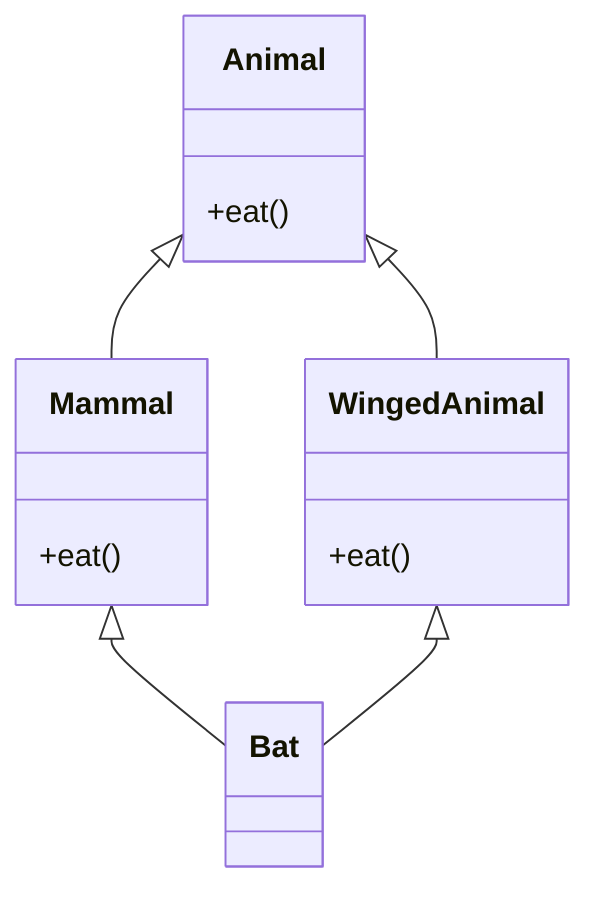
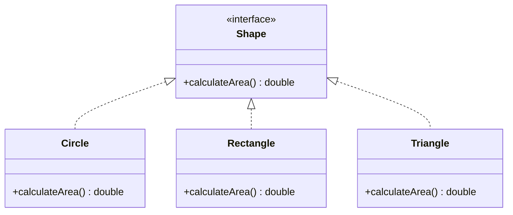
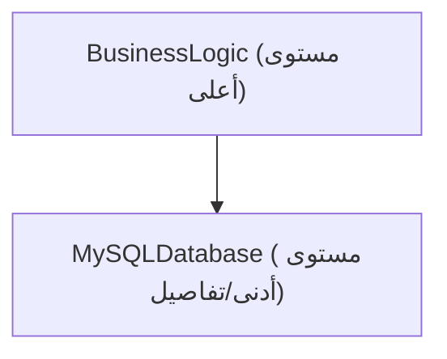
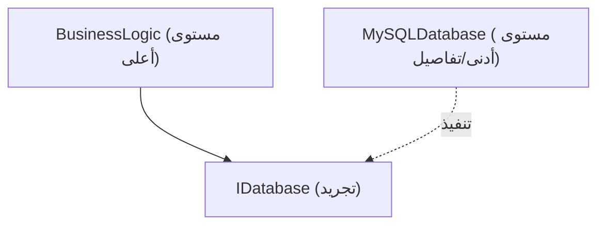

# أعماق البرمجة كائنية التوجه (OOP): التاريخ، العناصر الثلاثة الرئيسية، ومبادئ SOLID

في هندسة البرمجيات الحديثة، تعد البرمجة كائنية التوجه (Object-Oriented Programming, OOP) واحدة من أكثر النماذج انتشارًا وأهمية. من النصوص البرمجية الصغيرة إلى أنظمة المؤسسات التي تصل إلى ملايين الأسطر، تتجذر مفاهيم OOP في كل مكان.

في هذا المقال، لن نكتفي بالفهم السطحي لـ OOP، بل سنتعمق في خلفيتها التاريخية، وأساسيات أنواع البيانات الرياضية والمجردة، والعناصر الثلاثة الرئيسية (التغليف، الوراثة، وتعدد الأشكال)، بالإضافة إلى شرح شامل لمبادئ **SOLID** لبناء برمجيات قوية في الممارسة العملية، مع أمثلة برمجية محددة، والحالات الحدية (edge cases)، ومخططات Mermaid.

---

## 1. الخلفية التاريخية والفلسفة للبرمجة كائنية التوجه

لم تولد مفاهيم OOP بين عشية وضحاها. تعود أصولها إلى ستينيات القرن العشرين، وتطورت كتحول نوعي (paradigm shift) للتعامل مع تعقيد البرمجيات.

### 1.1 ولادة Simula و Smalltalk
السلف المباشر للبرمجة كائنية التوجه هو **Simula 67**، والذي تم تطويره في ستينيات القرن العشرين بواسطة Ole-Johan Dahl و Kristen Nygaard في مركز الحوسبة النرويجي. لقد أدخلا مفهومي "الكائن" و "الفئة" لنمذجة عمليات المحاكاة الفيزيائية المعقدة مثل حركة السفن.

بعد ذلك، في سبعينيات القرن العشرين، تم تطوير **Smalltalk** بواسطة آلان كاي (Alan Kay) وآخرين في مركز أبحاث زيروكس بالو ألتو (PARC). آلان كاي هو مبتكر مصطلح "كائنية التوجه"، وكانت رؤيته كالتالي:

> "I thought of objects being like biological cells and/or individual computers on a network, only able to communicate with messages." (فكرت في الكائنات على أنها مثل الخلايا البيولوجية و/أو أجهزة كمبيوتر فردية على شبكة، قادرة فقط على التواصل عبر الرسائل.)

لم تقتصر OOP في Smalltalk على دمج البيانات والطرق (methods) التي تعالجها، بل ركزت بشكل كبير على **توصيل الرسائل (message passing)**.

### 1.2 الانتشار من خلال C++ و [Java](https://kenji.blog/ar/p/programming-languages-history-paradigm-evolution/)
مع دخول ثمانينيات القرن العشرين، طور بيارن ستروستروب (Bjarne Stroustrup) لغة **C++** من خلال إضافة ميزات Simula كائنية التوجه إلى لغة C. أدى هذا إلى جعل OOP عملية في برمجة الأنظمة. علاوة على ذلك، في تسعينيات القرن العشرين، تم تطوير **Java** بواسطة جيمس غوسلينغ (James Gosling) وآخرين في Sun Microsystems، ومع شعار "اكتب مرة واحدة، شغل في أي مكان" (Write Once, Run Anywhere)، أصبحت المعيار الفعلي لـ OOP في تطوير تطبيقات المؤسسات.

### 1.3 الخلفية الشكلية والرياضية: أنواع البيانات المجردة (ADT)
في أساس OOP، يوجد مفهوم **أنواع البيانات المجردة (Abstract Data Type, ADT)** الذي اقترحته باربرا ليسكوف (Barbara Liskov) وآخرون. تحدد ADT رياضياً بنية البيانات وسلوكها (العمليات).

على سبيل المثال، عند تعريف المكدس ([Stack](https://kenji.blog/ar/p/c-language-pointers-memory-management-stack-heap/)) $ S $، فإن البديهيات التالية تنطبق رياضيًا:

$ \text{pop}(\text{push}(S, x)) = S $
$ \text{top}(\text{push}(S, x)) = x $

يمكن اعتبار فئة OOP كتجسيد لـ ADT كبنية نحوية للغة البرمجة. الكائن هو كبسولة تجمع بين مساحة الحالة $ X $ ومجموعة الدوال $ F $ التي تنقل تلك الحالة.

---

## 2. العناصر الثلاثة الرئيسية للبرمجة كائنية التوجه

تُعرف "التغليف" و "الوراثة" و "تعدد الأشكال" على نطاق واسع بأنها المفاهيم الأساسية التي تدعم OOP (غالبًا ما يُضاف إليها "التجريد" لتسمى العناصر الأربعة الرئيسية). هنا سنتعمق في جوهر كل منها والحالات الحدية في الممارسة العملية.

### 2.1 التغليف (Encapsulation) وإخفاء المعلومات

يتضمن التغليف جمع البيانات (الخصائص) والطرق (السلوكيات) التي تتعامل معها في وحدة واحدة (فئة)، ومبدأ **إخفاء المعلومات (Information Hiding)** الذي يمنع معالجة البيانات مباشرة من الخارج.

#### الأهداف والفوائد
- **الحفاظ على الثوابت (Invariant)**: يضمن أن الكائن يحافظ دائمًا على حالة صالحة.
- **تقليل الاقتران (Coupling)**: حتى إذا تغير التنفيذ الداخلي، طالما أن الواجهة الخارجية تظل كما هي، فلن تتأثر شيفرة الاستخدام.

#### أمثلة برمجية وشرح
مثال سيئ (ينكسر الثابت):

```java
public class BankAccount {
    public double balance; // يمكن الوصول إليه مباشرة من الخارج
}

// جانب الاستخدام
BankAccount account = new BankAccount();
account.balance = -1000; // الرصيد يصبح سالباً!
```

مثال جيد (الحماية من خلال التغليف):

```java
public class BankAccount {
    private double balance;

    public BankAccount(double initialBalance) {
        if (initialBalance < 0) throw new IllegalArgumentException("يجب أن يكون الرصيد الأولي 0 أو أكثر.");
        this.balance = initialBalance;
    }

    public void deposit(double amount) {
        if (amount <= 0) throw new IllegalArgumentException("يجب أن يكون مبلغ الإيداع قيمة موجبة.");
        this.balance += amount;
    }

    public void withdraw(double amount) {
        if (amount <= 0 || this.balance < amount) throw new IllegalArgumentException("سحب غير صالح.");
        this.balance -= amount;
    }

    public double getBalance() {
        return this.balance;
    }
}
```

#### الحالات الحدية: الكسر بواسطة الانعكاس (Reflection)
في لغات مثل [Java](https://kenji.blog/ar/p/programming-languages-history-paradigm-evolution/) و C#، من الممكن الوصول قسريًا إلى الحقول `private` باستخدام ميزة الانعكاس. نظرًا لأن هذا قد يؤدي إلى كسر التغليف، تتطلب الأنظمة التي تركز على الأمان إعداد مدير أمان (security manager) أو تعزيز التحكم في الوصول عبر نظام الوحدات (بدءًا من [Java](https://kenji.blog/ar/p/programming-languages-history-paradigm-evolution/) 9).

### 2.2 نور وظل الوراثة (Inheritance)

الوراثة هي آلية حيث ترث الفئة الجديدة (الفئة الابنة، الفئة المشتقة) البيانات والسلوك من فئة موجودة (الفئة الأم، الفئة الأساسية).

#### الهدف
- **إعادة استخدام الشيفرة**: يتم التخلص من التكرار من خلال جمع العمليات المشتركة في الفئة الأم.
- **التعبير عن علاقة "هو عبارة عن" (is-a)**: يمثل تصنيفات المجال مثل "الكلب هو حيوان (Dog is an Animal)".

#### الوراثة المتعددة ومشكلة الماسة (Diamond Problem)
تسمح بعض اللغات مثل C++ بـ **الوراثة المتعددة** من عدة فئات أم، ولكن يوجد هنا "مشكلة الماسة" الشهيرة.



المشكلة هي أنه عندما يستدعي Bat الطريقة `eat()`، يصبح من الغامض أي تطبيق يجب استدعاؤه، ذلك الخاص بـ Mammal أو WingedAnimal. في [Java](https://kenji.blog/ar/p/programming-languages-history-paradigm-evolution/) و C#، يتم حظر الوراثة المتعددة للفئات، ويتم تجنب هذه المشكلة عن طريق استخدام **الواجهات (Interfaces)**.

#### التكوين فوق الوراثة (Composition over Inheritance)
في OOP الحديثة، يميل المطورون إلى تجنب أشجار الوراثة العميقة. وذلك بسبب **مشكلة الفئة الأساسية الهشة (Fragile Base Class Problem)** حيث تنتشر التغييرات في الفئة الأم إلى جميع الفئات الأبناء. بدلاً من ذلك، يوصى بـ **التكوين (Composition)**، حيث يتم الاحتفاظ بكائنات أخرى كحقول وتفويض العمليات إليها.

### 2.3 تعدد الأشكال (Polymorphism)

تعدد الأشكال هو الخاصية حيث "بالنسبة لنفس الرسالة (استدعاء الطريقة)، يختلف السلوك اعتمادًا على نوع الكائن".

#### الأنواع
1. **تعدد الأشكال المخصص (Overloading)**: يتم استدعاء طرق مختلفة اعتمادًا على نوع وعدد الوسائط.
2. **تعدد الأشكال المعلمي (Generics)**: يطبق نفس الخوارزمية على أي نوع باستخدام معلمات النوع.
3. **تعدد الأشكال الفرعي (Overriding)**: يتعامل مع مثيلات الفئة الابنة كمتغيرات مرجعية للواجهة أو الفئة الأم، ويتم إرسالها ديناميكيًا في وقت التشغيل.

#### الإرسال الديناميكي (vtable)
في لغات مثل C++ و Java، يتم تحقيق تعدد الأشكال الفرعي من خلال آلية تسمى **جدول الدوال الافتراضية (vtable)**. يتم تخزين مؤشر لـ vtable في بداية منطقة الذاكرة الخاصة بالكائن، ويتم حل عنوان الدالة التي سيتم استدعاؤها في وقت التشغيل. لهذا السبب، هناك قدر ضئيل من العبء (overhead).

```java
interface Shape {
    double calculateArea();
}

class Circle implements Shape {
    private double radius;
    public Circle(double r) { this.radius = r; }
    @Override
    public double calculateArea() { return Math.PI * radius * radius; }
}

class Rectangle implements Shape {
    private double w, h;
    public Rectangle(double w, double h) { this.w = w; this.h = h; }
    @Override
    public double calculateArea() { return w * h; }
}

// استخدام تعدد الأشكال
List<Shape> shapes = Arrays.asList(new Circle(5), new Rectangle(4, 6));
for (Shape s : shapes) {
    // يتم استدعاء calculateArea() المناسب في وقت التشغيل اعتمادًا على النوع الفعلي للكائن
    System.out.println(s.calculateArea()); 
}
```

---

## 3. مبادئ SOLID: أسرار التصميم كائني التوجه

فهم العناصر الأساسية لـ OOP وحده لا يكفي لبناء برمجيات قابلة للصيانة والتوسعة. هنا تأتي أهمية مبادئ التصميم الخمسة، **مبادئ SOLID**، التي جمعها روبرت سي. مارتن (العم بوب).

### 3.1 مبدأ المسؤولية الفردية (Single Responsibility Principle: SRP)
**"يجب أن يكون للفئة سبب واحد فقط للتغيير"**

إذا كان لفئة واحدة أدوار (مسؤوليات) متعددة، فإن خطر أن يؤثر تغيير في أحد المتطلبات على ميزة أخرى غير ذات صلة يزداد.

#### الأنماط المضادة والتحسينات
على سبيل المثال، لنفترض أن فئة `Report` لديها 3 مسؤوليات: إنشاء البيانات، وتنسيقها، وحفظها في ملف.

```python
# مثال سيئ: فئة ذات 3 مسؤوليات
class Report:
    def __init__(self, data):
        self.data = data
        
    def generate_content(self):
        return f"Data: {self.data}"
        
    def format_as_pdf(self):
        # منطق معقد للتحويل إلى PDF
        pass
        
    def save_to_file(self, filename):
        with open(filename, 'w') as f:
            f.write(self.generate_content())
```

نقوم بتقسيم هذا وفقًا لـ SRP.

```python
# مثال جيد: فصل المسؤوليات
class ReportData:
    def __init__(self, data):
        self.data = data

class ReportFormatter:
    def format_to_pdf(self, report_data):
        pass
    def format_to_html(self, report_data):
        pass

class ReportRepository:
    def save(self, content, filename):
        pass
```

### 3.2 مبدأ الفتح والإغلاق (Open-Closed Principle: OCP)
**"يجب أن تكون مكونات البرنامج (الفئات، الوحدات، الدوال، إلخ) مفتوحة للتوسيع (Open) ومغلقة للتعديل (Closed)"**

إنه مبدأ ينص على أنه يجب تصميم النظام بحيث يمكن إضافة ميزات جديدة دون إعادة كتابة الشيفرة الحالية.

#### التجريد من خلال الواجهات
مثال حساب مساحة الشكل (Shape) السابق يلبي تمامًا OCP. إذا أردت إضافة شكل جديد (مثل `Triangle`)، فكل ما عليك فعله هو تنفيذ الفئة الجديدة دون تغيير واجهة `Shape` الحالية أو الشيفرة التي تتعامل معها (جزء الحلقة).



### 3.3 مبدأ استبدال ليسكوف (Liskov Substitution Principle: LSP)
**"يجب أن تكون الأنواع المشتقة قابلة للاستبدال بأنواعها الأساسية"**

هذا المبدأ، الذي اقترحته باربرا ليسكوف، ينص على أنه "يجب ألا يختل صحة البرنامج عند تمرير فئة ابنة في مكان يتوقع فيه فئة أم".

#### مثال شهير على الانتهاك: مشكلة المربع والمستطيل
رياضيًا، "المربع هو نوع من المستطيل"، ولكن هذا ليس بالضرورة صحيحًا في البرمجة.

```java
class Rectangle {
    protected int width;
    protected int height;
    
    public void setWidth(int width) { this.width = width; }
    public void setHeight(int height) { this.height = height; }
    public int getArea() { return width * height; }
}

class Square extends Rectangle {
    @Override
    public void setWidth(int width) {
        this.width = width;
        this.height = width; // للحفاظ على قيود المربع
    }
    @Override
    public void setHeight(int height) {
        this.width = height;
        this.height = height;
    }
}

// شيفرة الاختبار (جانب الاستخدام)
void testRectangleArea(Rectangle r) {
    r.setWidth(5);
    r.setHeight(4);
    // إذا كان r هو Rectangle فيجب أن يكون 20، ولكن إذا تم تمرير Square فسيصبح 16، وسيفشل التأكيد (assertion).
    assert r.getArea() == 20; 
}
```

جوهر هذه المشكلة هو أن فئة `Square` تكسر العقد المسبق (الشروط المسبقة) لفئة `Rectangle` والذي ينص على "يمكن تغيير العرض والارتفاع بشكل مستقل". من منظور التصميم بالعقود (Design by Contract)، يجب الالتزام بـ LSP بصرامة.

### 3.4 مبدأ فصل الواجهات (Interface Segregation Principle: ISP)
**"يجب عدم إجبار العملاء على الاعتماد على طرق لا يستخدمونها"**

الواجهة الضخمة والمتضخمة (Fat Interface) تجبر الفئات التي تنفذها على توفير تطبيقات لطرق غير ضرورية.

#### أمثلة الانتهاك والتحسين
```csharp
// مثال سيئ: واجهة ضخمة
public interface IMachine {
    void Print(Document d);
    void Scan(Document d);
    void Fax(Document d);
}

// الطابعة البسيطة لا يمكنها المسح الضوئي أو إرسال الفاكس، لكنها مجبرة على تنفيذ الطرق
public class SimplePrinter : IMachine {
    public void Print(Document d) { /* عملية الطباعة */ }
    public void Scan(Document d) { throw new NotImplementedException(); }
    public void Fax(Document d) { throw new NotImplementedException(); }
}
```

قم بفصل الواجهة بدقة حسب الدور.

```csharp
// مثال جيد: فصل الواجهات
public interface IPrinter {
    void Print(Document d);
}
public interface IScanner {
    void Scan(Document d);
}

public class SimplePrinter : IPrinter {
    public void Print(Document d) { /* عملية الطباعة */ }
}

public class MultiFunctionPrinter : IPrinter, IScanner {
    public void Print(Document d) { /* عملية الطباعة */ }
    public void Scan(Document d) { /* عملية المسح الضوئي */ }
}
```

### 3.5 مبدأ انعكاس التبعية (Dependency Inversion Principle: DIP)
**"يجب ألا تعتمد الوحدات ذات المستوى الأعلى على الوحدات ذات المستوى الأدنى. يجب أن يعتمد كلاهما على التجريد. كما يجب ألا يعتمد التجريد على التفاصيل، بل يجب أن تعتمد التفاصيل على التجريد"**

هذا المبدأ هو المفتاح لتقليل الاقتران بين مكونات النظام بشكل كبير.

#### التصميم التقليدي (انتهاك DIP)
الحالة التي يعتمد فيها منطق الأعمال عالي المستوى بشكل مباشر على فئة الوصول إلى البيانات ذات المستوى الأدنى.



#### التصميم بتطبيق DIP
من خلال إدراج التجريد (واجهة) بينهما، نعكس متجه علاقة التبعية.



```java
// التجريد (الواجهة)
public interface UserRepository {
    void save(User user);
}

// الوحدة ذات المستوى الأدنى (تفاصيل)
public class MySQLUserRepository implements UserRepository {
    public void save(User user) {
        // تفاصيل عملية الحفظ في MySQL
    }
}

// الوحدة ذات المستوى الأعلى
public class UserService {
    private final UserRepository repository;
    
    // حقن التبعية (DI) عبر المنشئ
    public UserService(UserRepository repository) {
        this.repository = repository;
    }
    
    public void registerUser(User user) {
        // ... منطق الأعمال ...
        repository.save(user);
    }
}
```

من خلال التصميم بهذه الطريقة، حتى عند تغيير قاعدة البيانات من MySQL إلى PostgreSQL أو إلى قاعدة بيانات في الذاكرة (In-memory DB) لأغراض الاختبار، لا توجد حاجة لتغيير شيفرة `UserService` على الإطلاق. هذا هو التفكير الأساسي لإطارات عمل **حقن التبعية (DI)** (Spring, Guice, .NET DI، إلخ).

---

## 4. الاعتبارات الرياضية والأساليب الشكلية في OOP

هنا، دعونا ندمج وجهة نظر رياضية قليلاً حول نظام الأنواع في OOP. غالبًا ما تتم نمذجة علاقات اشتقاق الأنواع (التصنيف الفرعي) باستخدام نظرية الفئات (Category Theory) أو نظرية الشبكات (Lattice Theory).

يُشار إلى أن النوع $ A $ هو نوع فرعي من النوع $ B $ بـ $ A <: B $. يشكل هذا علاقة ترتيب جزئي (انعكاسية، متعدية، غير متناظرة).

1. **الخاصية الانعكاسية (Reflexivity)**: لأي نوع $ A $، $ A <: A $
2. **الخاصية المتعدية (Transitivity)**: إذا كان $ A <: B $ و $ B <: C $، فإن $ A <: C $

في التصنيف الفرعي للدوال، هناك خاصية مهمة وهي أن نوع القيمة المرجعة **متباين (Covariant)**، وأن نوع الوسيطة **متباين عكسيًا (Contravariant)**.

في نوع الدالة $ f: P_1 \to R_1 $ و $ g: P_2 \to R_2 $، تكون شروط $ f <: g $ (يمكن استخدام الدالة $ f $ بأمان بدلاً من $ g $) كما يلي:

$ P_2 <: P_1 \quad \text{و} \quad R_1 <: R_2 $

السبب في أن الوسيطات متباينة عكسيًا (الاتجاه المعاكس) هو نتيجة تطبيق LSP (مبدأ استبدال ليسكوف) على مستوى الدالة. يجب أن تقبل طريقة الفئة الابنة شروطًا أسهل (وسيطات من أنواع أوسع) وترجع شروطًا أكثر صرامة (قيم مرجعة من أنواع أضيق) من طريقة الفئة الأم.

---

## 5. الخاتمة ومستقبل البرمجة كائنية التوجه

في هذا المقال، بدأنا بالخلفية التاريخية لـ OOP، وشرحنا بالتفصيل العناصر الأساسية مثل التغليف والوراثة وتعدد الأشكال، بالإضافة إلى مبادئ SOLID التي لا غنى عنها في تطوير تطبيقات المؤسسات.

في السنوات الأخيرة، برز نموذج البرمجة الوظيفية (FP)، وتمت إعادة النظر في فوائد عدم القابلية للتغيير (Immutability) والدوال البحتة (Pure Functions). ومع ذلك، فإن OOP و FP ليسا متناقضين. تمزج اللغات الحديثة (Scala، Kotlin، [Rust](https://kenji.blog/ar/p/programming-languages-history-paradigm-evolution/)، وكذلك الإصدارات الحديثة من C# و [Java](https://kenji.blog/ar/p/programming-languages-history-paradigm-evolution/)) بين هذين النموذجين، وأصبح التصميم الهجين حيث "تتم إدارة الحالة عن طريق التغليف في فئات OOP، وتتم خطوط أنابيب تحويل البيانات بأسلوب FP" هو السائد.

لا توجد "رصاصة فضية" في تصميم البرمجيات، ولكن الفهم العميق لـ OOP وتطبيق مبادئ SOLID سيكونان أسلحة قوية لبناء أنظمة قابلة للصيانة على المدى الطويل ومرنة للتغييرات.

---

**المراجع والكتب الموصى بها:**
1. Erich Gamma, et al. *Design Patterns: Elements of Reusable Object-Oriented Software*. Addison-Wesley.
2. Robert C. Martin. *Clean Architecture: A Craftsman's Guide to Software Structure and Design*. Prentice Hall.
3. Bertrand Meyer. *Object-Oriented Software Construction*. Prentice Hall.
4. Barbara Liskov, Jeannette Wing. *A behavioral notion of subtyping*. ACM Transactions on [Programming Language](https://kenji.blog/ar/p/programming-languages-history-paradigm-evolution/)s and Systems.
