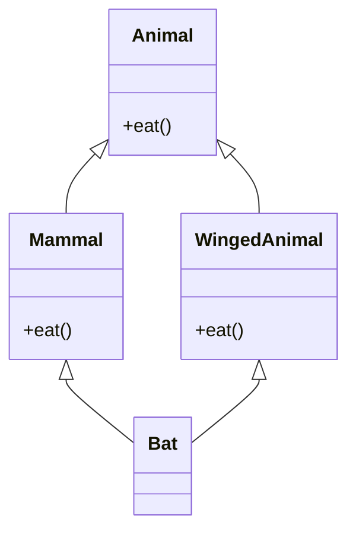
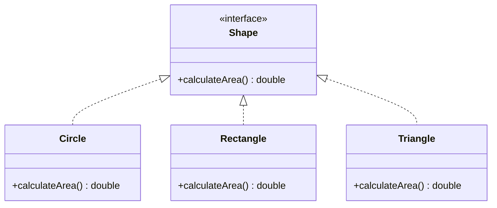
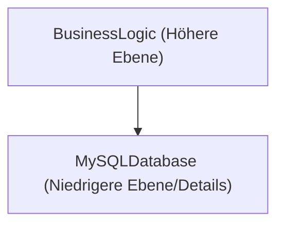
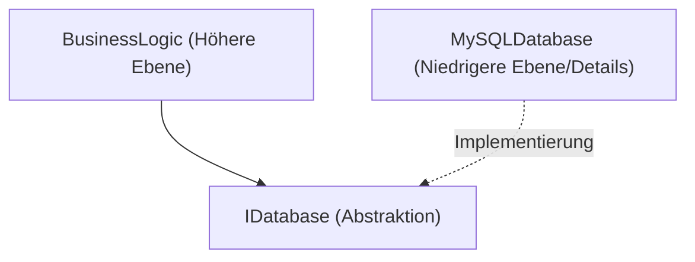

# Die Tiefen der objektorientierten Programmierung (OOP): Geschichte, die 3 Säulen und die SOLID-Prinzipien

In der modernen Softwaretechnik ist die objektorientierte Programmierung (Object-Oriented Programming, OOP) eines der am weitesten verbreiteten und wichtigsten Paradigmen. Von kleinen Skripten bis hin zu Unternehmenssystemen mit Millionen von Codezeilen sind OOP-Konzepte allgegenwärtig.

In diesem Artikel gehen wir über ein rein oberflächliches Verständnis von OOP hinaus und erläutern den historischen Hintergrund, die Grundlagen mathematischer und abstrakter Datentypen, eine vertiefte Betrachtung der 3 Säulen (Kapselung, Vererbung, Polymorphismus) sowie die **SOLID-Prinzipien** für den Aufbau robuster Software in der Praxis – alles veranschaulicht durch konkrete Codebeispiele, Edge Cases und Mermaid-Diagramme.

---

## 1. Historischer Hintergrund und Philosophie der Objektorientierung

Das Konzept der OOP entstand nicht über Nacht. Seine Ursprünge reichen bis in die 1960er Jahre zurück und es hat sich als Paradigmenwechsel zur Bewältigung der Softwarekomplexität entwickelt.

### 1.1 Die Entstehung von Simula und Smalltalk
Der direkte Vorfahr der Objektorientierung ist **Simula 67**, entwickelt in den 1960er Jahren von Ole-Johan Dahl und Kristen Nygaard am Norwegischen Rechenzentrum. Sie führten die Konzepte von "Objekten" und "Klassen" ein, um komplexe physikalische Simulationen, wie beispielsweise die Bewegung von Schiffen, zu modellieren.

Später, in den 1970er Jahren, wurde **Smalltalk** von Alan Kay und anderen am Xerox PARC (Palo Alto Research Center) entwickelt. Alan Kay ist der Schöpfer des Begriffs "objektorientiert", und seine Vision war folgende:

> "I thought of objects being like biological cells and/or individual computers on a network, only able to communicate with messages." (Ich stellte mir Objekte wie biologische Zellen und/oder einzelne Computer in einem Netzwerk vor, die nur über Nachrichten kommunizieren können.)

Die OOP in Smalltalk ging über die reine Integration von Daten und den sie manipulierenden Methoden hinaus und legte großen Wert auf **Messaging (Nachrichtenaustausch)**.

### 1.2 Die Verbreitung durch C++ und [Java](https://kenji.blog/de/p/programming-languages-history-paradigm-evolution/)
In den 1980er Jahren entwickelte Bjarne Stroustrup **C++**, welches die objektorientierten Funktionen von Simula zur Programmiersprache C hinzufügte. Dadurch wurde OOP in der Systemprogrammierung praxistauglich. In den 1990er Jahren wurde dann **Java** von James Gosling und anderen bei Sun Microsystems entwickelt. Mit dem Slogan "Write Once, Run Anywhere" wurde es zum De-facto-Standard für OOP in der Unternehmensentwicklung.

### 1.3 Formaler und mathematischer Hintergrund: Abstrakte Datentypen (ADT)
Die Grundlage von OOP bildet das Konzept des **abstrakten Datentyps (Abstract Data Type, ADT)**, das von Barbara Liskov und anderen vorgeschlagen wurde. Ein ADT definiert eine Datenstruktur und deren Verhalten (Operationen) mathematisch.

Wenn wir beispielsweise einen [Stack](https://kenji.blog/de/p/c-language-pointers-memory-management-stack-heap/) $ S $ definieren, gelten mathematisch die folgenden Axiome:

$ \text{pop}(\text{push}(S, x)) = S $
$ \text{top}(\text{push}(S, x)) = x $

Die Klasse in OOP kann als die Realisierung dieses ADT in der Syntax einer Programmiersprache verstanden werden. Ein Objekt ist eine Kapsel, die einen Zustandsraum $ X $ und eine Gruppe von Funktionen $ F $, die diesen Zustand überführen, zusammenfasst.

---

## 2. Die 3 Säulen der objektorientierten Programmierung

Als Kernkonzepte der OOP sind die drei "Kapselung", "Vererbung" und "Polymorphismus" weithin bekannt (oft als 4 Säulen bezeichnet, wenn man "Abstraktion" hinzufügt). Hier werden wir tief in die Essenz jedes einzelnen sowie in Edge Cases aus der Praxis eintauchen.

### 2.1 Kapselung (Encapsulation) und Geheimnisprinzip (Information Hiding)

Kapselung umfasst die Bündelung von Daten (Attributen) und den sie manipulierenden Methoden (Verhalten) in einer einzigen Einheit (Klasse) sowie das Prinzip des **Geheimnisprinzips (Information Hiding)**, das den direkten Zugriff auf Daten von außen verhindert.

#### Zweck und Vorteile
- **Aufrechterhaltung von Invarianten (Invariant)**: Garantiert, dass sich ein Objekt immer in einem gültigen Zustand befindet.
- **Geringere Kopplung**: Selbst wenn die interne Implementierung geändert wird, hat dies keine Auswirkungen auf den verwendenden Code, solange die externe Schnittstelle gleich bleibt.

#### Codebeispiele und Erläuterung
Schlechtes Beispiel (Invariante wird gebrochen):

```java
public class BankAccount {
    public double balance; // Von außen direkt zugänglich
}

// Aufrufer
BankAccount account = new BankAccount();
account.balance = -1000; // Der Kontostand wird negativ!
```

Gutes Beispiel (Schutz durch Kapselung):

```java
public class BankAccount {
    private double balance;

    public BankAccount(double initialBalance) {
        if (initialBalance < 0) throw new IllegalArgumentException("Der anfängliche Kontostand muss 0 oder größer sein.");
        this.balance = initialBalance;
    }

    public void deposit(double amount) {
        if (amount <= 0) throw new IllegalArgumentException("Der Einzahlungsbetrag muss ein positiver Wert sein.");
        this.balance += amount;
    }

    public void withdraw(double amount) {
        if (amount <= 0 || this.balance < amount) throw new IllegalArgumentException("Ungültige Abhebung.");
        this.balance -= amount;
    }

    public double getBalance() {
        return this.balance;
    }
}
```

#### Edge Case: Zerstörung durch Reflection
In Sprachen wie [Java](https://kenji.blog/de/p/programming-languages-history-paradigm-evolution/) oder C# ist es möglich, mithilfe von Reflection-Funktionen den Zugriff auf `private` Felder zu erzwingen. Da dies das Risiko birgt, die Kapselung zu durchbrechen, sind in sicherheitskritischen Systemen Konfigurationen des Security Managers oder strengere Zugriffskontrollen durch Modulsysteme (seit [Java](https://kenji.blog/de/p/programming-languages-history-paradigm-evolution/) 9) erforderlich.

### 2.2 Licht und Schatten der Vererbung (Inheritance)

Vererbung ist ein Mechanismus, bei dem eine neue Klasse (Unterklasse, abgeleitete Klasse) die Daten und das Verhalten einer bestehenden Klasse (Oberklasse, Basisklasse) übernimmt.

#### Zweck
- **Wiederverwendbarkeit von Code**: Durch das Zusammenfassen gemeinsamer Logik in einer Oberklasse werden Duplikate eliminiert.
- **Darstellung von "is-a"-Beziehungen**: Drückt Domänenklassifizierungen aus, wie zum Beispiel "Ein Hund ist ein Tier (Dog is an Animal)".

#### Mehrfachvererbung und das Diamond-Problem (Diamond Problem)
In einigen Sprachen wie C++ ist die **Mehrfachvererbung**, bei der von mehreren Oberklassen geerbt wird, erlaubt, was jedoch zum bekannten "Diamond-Problem" führt.



Wenn Bat die Methode `eat()` aufruft, entsteht das Problem der Mehrdeutigkeit, ob die Implementierung von Mammal oder von WingedAnimal aufgerufen werden soll. In [Java](https://kenji.blog/de/p/programming-languages-history-paradigm-evolution/) oder C# wird die Mehrfachvererbung von Klassen untersagt, und dieses Problem wird durch die Verwendung von **Interfaces** umgangen.

#### Komposition statt Vererbung (Composition over Inheritance)
In der modernen OOP werden tiefe Vererbungshierarchien eher gemieden. Dies liegt am **Problem der fragilen Basisklasse (Fragile Base Class Problem)**, bei dem Änderungen an der Oberklasse sich auf alle Unterklassen auswirken. Stattdessen wird die **Komposition** empfohlen, bei der andere Objekte als Felder gehalten und Verarbeitungen delegiert werden.

### 2.3 Polymorphismus (Polymorphism: Vielgestaltigkeit)

Polymorphismus ist die Eigenschaft, dass "auf dieselbe Nachricht (Methodenaufruf) je nach Typ des Objekts mit unterschiedlichem Verhalten reagiert wird".

#### Arten
1. **Ad-hoc-Polymorphismus (Overloading)**: Abhängig vom Typ oder der Anzahl der Argumente werden unterschiedliche Methoden aufgerufen.
2. **Parametrischer Polymorphismus (Generics)**: Unter Verwendung von Typparametern wird derselbe Algorithmus auf beliebige Typen angewendet.
3. **Subtyping-Polymorphismus (Overriding)**: Instanzen von Unterklassen werden über Referenzvariablen von Interfaces oder Oberklassen gehandhabt, und der Aufruf wird zur Laufzeit dynamisch aufgelöst (Dynamic Dispatch).

#### Dynamischer Dispatch (vtable)
In Sprachen wie C++ oder Java wird der Subtyping-Polymorphismus durch einen Mechanismus namens **virtuelle Methodentabelle (vtable)** realisiert. Am Anfang des Speicherbereichs eines Objekts ist ein Zeiger auf die vtable gespeichert, der zur Laufzeit die Adresse der aufzurufenden Funktion auflöst. Dadurch entsteht ein geringer Overhead.

```java
interface Shape {
    double calculateArea();
}

class Circle implements Shape {
    private double radius;
    public Circle(double r) { this.radius = r; }
    @Override
    public double calculateArea() { return Math.PI * radius * radius; }
}

class Rectangle implements Shape {
    private double w, h;
    public Rectangle(double w, double h) { this.w = w; this.h = h; }
    @Override
    public double calculateArea() { return w * h; }
}

// Nutzung von Polymorphismus
List<Shape> shapes = Arrays.asList(new Circle(5), new Rectangle(4, 6));
for (Shape s : shapes) {
    // Zur Laufzeit wird die entsprechende Methode calculateArea() basierend auf dem tatsächlichen Typ des Objekts aufgerufen
    System.out.println(s.calculateArea()); 
}
```

---

## 3. SOLID-Prinzipien: Die Geheimnisse des objektorientierten Designs

Ein grundlegendes Verständnis der OOP-Elemente reicht nicht aus, um hochgradig wartbare und erweiterbare Software zu erstellen. Hier kommen die fünf Entwurfsprinzipien ins Spiel, die von Robert C. Martin (Uncle Bob) zusammengefasst wurden: die **SOLID-Prinzipien**.

### 3.1 Single-Responsibility-Prinzip (Single Responsibility Principle: SRP)
**"Eine Klasse sollte nur einen einzigen Grund haben, sich zu ändern."**

Wenn eine Klasse mehrere Verantwortlichkeiten besitzt, steigt das Risiko, dass eine Anforderungsänderung Auswirkungen auf eine andere, nicht zusammenhängende Funktionalität hat.

#### Anti-Pattern und Verbesserungsmaßnahmen
Angenommen, eine Klasse `Report` hat drei Verantwortlichkeiten: Datengenerierung, Formatierungsverarbeitung und das Speichern in einer Datei.

```python
# Schlechtes Beispiel: Eine Klasse mit 3 Verantwortlichkeiten
class Report:
    def __init__(self, data):
        self.data = data
        
    def generate_content(self):
        return f"Data: {self.data}"
        
    def format_as_pdf(self):
        # Komplexe Logik für die PDF-Erstellung
        pass
        
    def save_to_file(self, filename):
        with open(filename, 'w') as f:
            f.write(self.generate_content())
```

Wir teilen dies gemäß SRP auf.

```python
# Gutes Beispiel: Trennung der Verantwortlichkeiten
class ReportData:
    def __init__(self, data):
        self.data = data

class ReportFormatter:
    def format_to_pdf(self, report_data):
        pass
    def format_to_html(self, report_data):
        pass

class ReportRepository:
    def save(self, content, filename):
        pass
```

### 3.2 Open-Closed-Prinzip (Open-Closed Principle: OCP)
**"Software-Entitäten (Klassen, Module, Funktionen usw.) sollten offen für Erweiterungen (Open), aber geschlossen für Modifikationen (Closed) sein."**

Dieses Prinzip besagt, dass neue Funktionen hinzugefügt werden können sollten, ohne den bestehenden Code umzuschreiben.

#### Abstraktion durch Interfaces
Das vorherige Beispiel der Flächenberechnung von Formen (Shape) erfüllt das OCP perfekt. Wenn wir eine neue Form (z. B. `Triangle`) hinzufügen möchten, müssen wir weder das bestehende `Shape`-Interface noch den verarbeitenden Code (die Schleife) ändern; es reicht, eine neue Klasse zu implementieren.



### 3.3 Liskovsches Substitutionsprinzip (Liskov Substitution Principle: LSP)
**"Abgeleitete Typen müssen vollständig durch ihre Basistypen ersetzbar sein."**

Dieses von Barbara Liskov aufgestellte Prinzip besagt, dass das Übergeben einer Unterklasse an Stellen, an denen eine Oberklasse erwartet wird, die Korrektheit des Programms nicht beeinträchtigen darf.

#### Bekanntes Verstoß-Beispiel: Das Quadrat-Rechteck-Problem
Mathematisch gesehen ist "ein Quadrat eine Art Rechteck", aber in der Programmierung ist das nicht zwingend der Fall.

```java
class Rectangle {
    protected int width;
    protected int height;
    
    public void setWidth(int width) { this.width = width; }
    public void setHeight(int height) { this.height = height; }
    public int getArea() { return width * height; }
}

class Square extends Rectangle {
    @Override
    public void setWidth(int width) {
        this.width = width;
        this.height = width; // Um die Einschränkungen des Quadrats beizubehalten
    }
    @Override
    public void setHeight(int height) {
        this.width = height;
        this.height = height;
    }
}

// Testcode (Aufrufer)
void testRectangleArea(Rectangle r) {
    r.setWidth(5);
    r.setHeight(4);
    // Wenn r ein Rectangle ist, sollte es 20 sein. Wird jedoch ein Square übergeben, wird es zu 16 und die Assertion schlägt fehl.
    assert r.getArea() == 20; 
}
```

Das eigentliche Problem hier ist, dass die Klasse `Square` den Vorvertrag (Vorbedingung) der Klasse `Rectangle`, dass "Breite und Höhe unabhängig voneinander geändert werden können", bricht. Aus der Perspektive von "Design by Contract" (Entwurf gemäß Vertrag) muss das LSP strikt eingehalten werden.

### 3.4 Interface-Segregation-Prinzip (Interface Segregation Principle: ISP)
**"Kein Client sollte gezwungen werden, von Methoden abhängig zu sein, die er nicht nutzt."**

Riesige, überladene Interfaces (Fat Interfaces) zwingen die Klassen, die sie implementieren, zur Implementierung von unnötigen Methoden.

#### Verstoß-Beispiel und Verbesserung
```csharp
// Schlechtes Beispiel: Fat Interface
public interface IMachine {
    void Print(Document d);
    void Scan(Document d);
    void Fax(Document d);
}

// Ein einfacher Drucker kann weder scannen noch faxen, wird aber gezwungen, die Methoden zu implementieren
public class SimplePrinter : IMachine {
    public void Print(Document d) { /* Druckverarbeitung */ }
    public void Scan(Document d) { throw new NotImplementedException(); }
    public void Fax(Document d) { throw new NotImplementedException(); }
}
```

Interfaces sollten nach ihren Verantwortlichkeiten fein granuliert aufgeteilt werden.

```csharp
// Gutes Beispiel: Trennung der Interfaces
public interface IPrinter {
    void Print(Document d);
}
public interface IScanner {
    void Scan(Document d);
}

public class SimplePrinter : IPrinter {
    public void Print(Document d) { /* Druckverarbeitung */ }
}

public class MultiFunctionPrinter : IPrinter, IScanner {
    public void Print(Document d) { /* Druckverarbeitung */ }
    public void Scan(Document d) { /* Scanverarbeitung */ }
}
```

### 3.5 Dependency-Inversion-Prinzip (Dependency Inversion Principle: DIP)
**"Module auf höherer Ebene sollten nicht von Modulen auf niedrigerer Ebene abhängen. Beide sollten von Abstraktionen abhängen. Außerdem sollten Abstraktionen nicht von Details abhängen, sondern Details sollten von Abstraktionen abhängen."**

Dieses Prinzip ist der Schlüssel, um die Kopplung zwischen den Komponenten eines Systems drastisch zu reduzieren.

#### Konventionelles Design (Verstoß gegen DIP)
Die Geschäftslogik der höheren Ebene hängt direkt von der spezifischen Datenzugriffsklasse der niedrigeren Ebene ab.



#### Design nach Anwendung von DIP
Durch das Einfügen einer Abstraktion (Interface) dazwischen wird der Vektor der Abhängigkeit umgekehrt.



```java
// Abstraktion (Interface)
public interface UserRepository {
    void save(User user);
}

// Modul auf niedrigerer Ebene (Detail)
public class MySQLUserRepository implements UserRepository {
    public void save(User user) {
        // Konkrete Verarbeitung zum Speichern in MySQL
    }
}

// Modul auf höherer Ebene
public class UserService {
    private final UserRepository repository;
    
    // Abhängigkeitsinjektion (Dependency Injection, DI) über den Konstruktor
    public UserService(UserRepository repository) {
        this.repository = repository;
    }
    
    public void registerUser(User user) {
        // ... Geschäftslogik ...
        repository.save(user);
    }
}
```

Durch ein solches Design muss der Code von `UserService` überhaupt nicht geändert werden, wenn die Datenbank von MySQL auf PostgreSQL oder eine In-Memory-Datenbank für Tests umgestellt wird. Dies ist das grundlegende Konzept hinter **DI (Dependency Injection)-Frameworks** (Spring, Guice, .NET DI usw.).

---

## 4. Mathematische Betrachtung von OOP und formale Methoden

Lassen Sie uns hier eine etwas mathematische Perspektive auf das Typsystem von OOP werfen. Ableitungsbeziehungen von Typen (Subtyping) werden oft mithilfe der Kategorientheorie oder der Verbandstheorie modelliert.

Dass ein Typ $ A $ ein Subtyp von Typ $ B $ ist, wird als $ A <: B $ notiert. Dies bildet eine Halbordnungsrelation (reflexiv, transitiv, antisymmetrisch).

1. **Reflexivität**: Für jeden Typ $ A $ gilt $ A <: A $
2. **Transitivität**: Wenn $ A <: B $ und $ B <: C $, dann gilt $ A <: C $

Beim Subtyping von Funktionen gibt es eine wichtige Eigenschaft: Der Rückgabetyp ist **kovariant (Covariant)** und der Argumenttyp ist **kontravariant (Contravariant)**.

Für Funktionstypen $ f: P_1 \to R_1 $ und $ g: P_2 \to R_2 $ lauten die Bedingungen dafür, dass $ f <: g $ (die Funktion $ f $ kann sicher anstelle von $ g $ verwendet werden), wie folgt:

$ P_2 <: P_1 \quad \text{und} \quad R_1 <: R_2 $

Der Grund dafür, dass Argumente kontravariant sind (die Richtung ist umgekehrt), ist das Ergebnis der Anwendung des LSP (Liskovsches Substitutionsprinzip) auf Funktionsebene. Die Methode der Unterklasse muss lockerere Bedingungen (Argumente eines breiteren Typs) akzeptieren und strengere Bedingungen (Rückgabewert eines engeren Typs) zurückgeben als die Methode der Oberklasse.

---

## 5. Fazit und die Zukunft der Objektorientierung

In diesem Artikel haben wir detailliert den historischen Hintergrund der OOP, die grundlegenden Elemente wie Kapselung, Vererbung und Polymorphismus sowie die SOLID-Prinzipien, die in der Unternehmensentwicklung unverzichtbar sind, erläutert.

In den letzten Jahren hat das Paradigma der funktionalen Programmierung (FP) an Bedeutung gewonnen, und die Vorteile von Unveränderlichkeit (Immutability) und reinen Funktionen (Pure Functions) werden neu bewertet. OOP und FP stehen jedoch nicht im Widerspruch zueinander. Moderne Sprachen (Scala, Kotlin, [Rust](https://kenji.blog/de/p/programming-languages-history-paradigm-evolution/), neuere Versionen von C# und [Java](https://kenji.blog/de/p/programming-languages-history-paradigm-evolution/)) vereinen beide Paradigmen, und hybride Entwürfe wie "Die Zustandsverwaltung wird durch OOP-Klassen gekapselt, und die Datentransformations-Pipeline erfolgt durch den FP-Ansatz" werden zunehmend zum Mainstream.

Es gibt keinen "Silver Bullet" (Wunderwaffe) im Software-Design, aber ein tiefes Verständnis von OOP und die Anwendung der SOLID-Prinzipien werden eine mächtige Waffe sein, um Systeme zu bauen, die langfristig wartbar und widerstandsfähig gegenüber Veränderungen sind.

---

**Literatur und Leseempfehlungen:**
1. Erich Gamma, et al. *Design Patterns: Elements of Reusable Object-Oriented Software*. Addison-Wesley.
2. Robert C. পুনরায় C. Martin. *Clean Architecture: A Craftsman's Guide to Software Structure and Design*. Prentice Hall.
3. Bertrand Meyer. *Object-Oriented Software Construction*. Prentice Hall.
4. Barbara Liskov, Jeannette Wing. *A behavioral notion of subtyping*. ACM Transactions on [Programming Language](https://kenji.blog/de/p/programming-languages-history-paradigm-evolution/)s and Systems.
