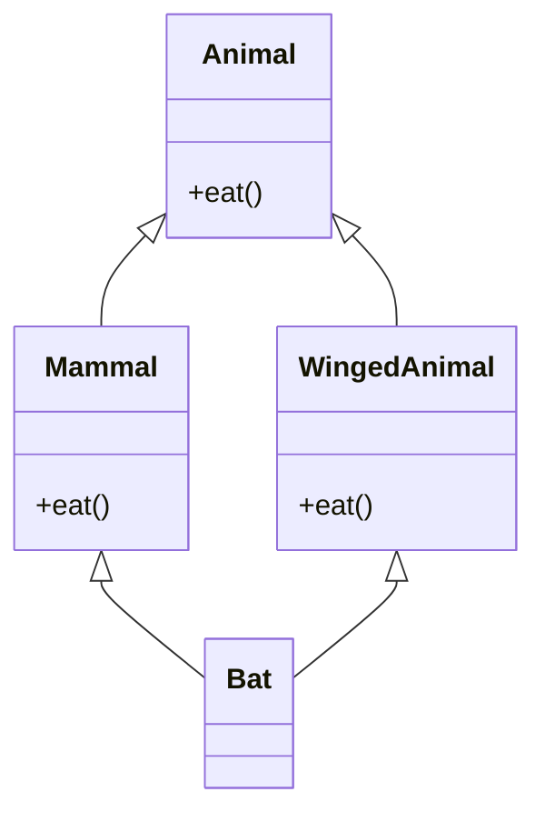
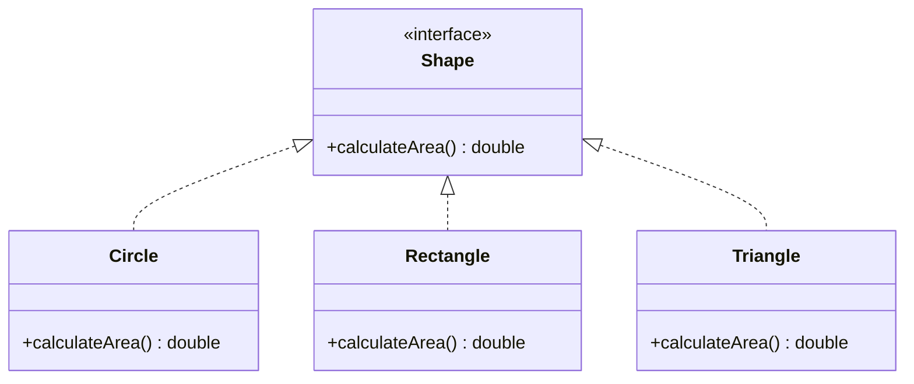
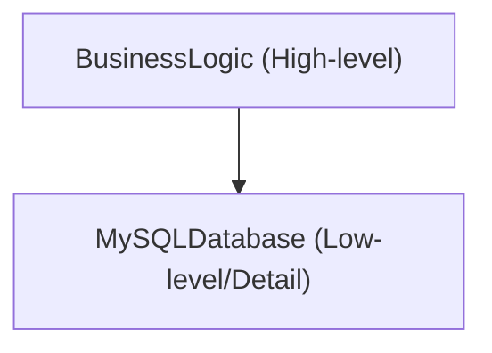
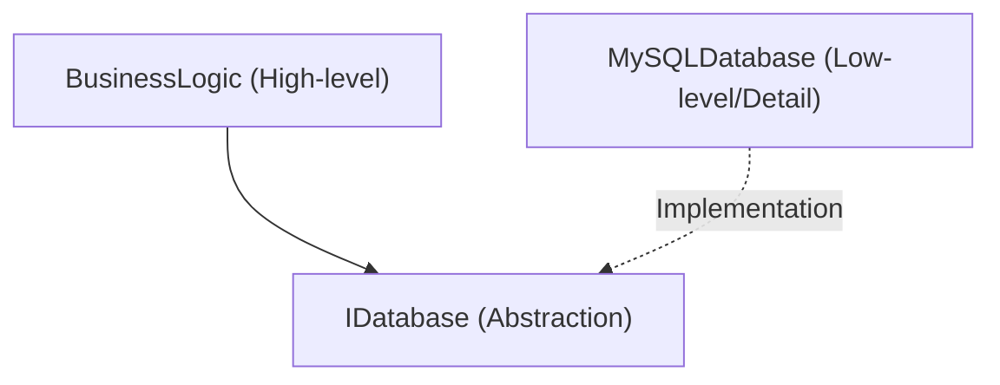

# The Abyss of Object-Oriented Programming (OOP): History, 3 Main Elements, and SOLID Principles

In modern software engineering, Object-Oriented Programming (OOP) is one of the most widespread and critical paradigms. From small scripts to enterprise systems spanning millions of lines, the concepts of OOP are deeply rooted everywhere.

In this article, we won't stop at a mere superficial understanding of OOP. We will thoroughly explain its historical background, the foundation of mathematical and abstract data types, a deep dive into the 3 main elements (encapsulation, inheritance, polymorphism), and the **SOLID principles** for building robust software in practice, interspersed with concrete code examples, edge cases, and Mermaid diagrams.

---

## 1. Historical Background and Philosophy of Object-Orientation

The concept of OOP was not born overnight. Its origins date back to the 1960s, evolving as a paradigm shift to cope with software complexity.

### 1.1 The Birth of Simula and Smalltalk
The direct ancestor of object-orientation is **Simula 67**, developed in the 1960s by Ole-Johan Dahl and Kristen Nygaard at the Norwegian Computing Center. They introduced the concepts of "objects" and "classes" to model complex physical simulations such as the movement of ships.

Later, in the 1970s, **Smalltalk** was developed by Alan Kay and others at Xerox PARC (Palo Alto Research Center). Alan Kay is the originator of the term "object-oriented," and his vision was as follows:

> "I thought of objects being like biological cells and/or individual computers on a network, only able to communicate with messages."

In Smalltalk, OOP did not merely integrate data with the methods that operate on it; it placed heavy emphasis on **messaging (message passing)**.

### 1.2 Popularization by C++ and [Java](https://kenji.blog/en/p/programming-languages-history-paradigm-evolution/)
Entering the 1980s, Bjarne Stroustrup developed **C++**, which added the object-oriented features of Simula to the C language. This made OOP practical in system programming. Furthermore, in the 1990s, **Java** was developed by James Gosling and others at Sun Microsystems. With its slogan "Write Once, Run Anywhere," it became the de facto standard for OOP in enterprise development.

### 1.3 Formal and Mathematical Background: Abstract Data Types (ADT)
At the foundation of OOP lies the concept of the **Abstract Data Type (ADT)**, advocated by Barbara Liskov and others. An ADT mathematically defines a data structure and its behavior (operations).

For example, when defining a stack $ S $, the following axioms hold mathematically:

$ \text{pop}(\text{push}(S, x)) = S $
$ \text{top}(\text{push}(S, x)) = x $

An OOP class can be seen as the embodiment of this ADT as the syntax of a programming language. An object is a single capsule that bundles a state space $ X $ and a set of functions $ F $ that transition that state.

---

## 2. The 3 Main Elements of Object-Oriented Programming

As core concepts supporting OOP, the three elements of "Encapsulation," "Inheritance," and "Polymorphism" are widely known (often called the 4 main elements by adding "Abstraction"). Here, we delve deeply into the essence of each and edge cases in practice.

### 2.1 Encapsulation and Information Hiding

Encapsulation involves bundling data (attributes) and the methods (behavior) that operate on it into a single unit (class), and it includes the principle of **Information Hiding**, which prevents direct manipulation of data from the outside.

#### Purpose and Benefits
- **Maintaining Invariants**: Guarantees that the object always maintains a valid state.
- **Reducing Coupling**: Even if the internal implementation changes, it will not affect the client code as long as the external interface remains the same.

#### Code Examples and Explanations
Bad example (invariant is broken):

```java
public class BankAccount {
    public double balance; // Directly accessible from the outside
}

// Client side
BankAccount account = new BankAccount();
account.balance = -1000; // Balance becomes negative!
```

Good example (protection by encapsulation):

```java
public class BankAccount {
    private double balance;

    public BankAccount(double initialBalance) {
        if (initialBalance < 0) throw new IllegalArgumentException("Initial balance must be 0 or more.");
        this.balance = initialBalance;
    }

    public void deposit(double amount) {
        if (amount <= 0) throw new IllegalArgumentException("Deposit amount must be positive.");
        this.balance += amount;
    }

    public void withdraw(double amount) {
        if (amount <= 0 || this.balance < amount) throw new IllegalArgumentException("Invalid withdrawal.");
        this.balance -= amount;
    }

    public double getBalance() {
        return this.balance;
    }
}
```

#### Edge Case: Destruction via Reflection
In languages like [Java](https://kenji.blog/en/p/programming-languages-history-paradigm-evolution/) and C#, it is possible to forcibly access `private` fields using the reflection feature. Since this poses a risk of breaking encapsulation, systems prioritizing security require setting up a security manager or strengthening access control via the module system ([Java](https://kenji.blog/en/p/programming-languages-history-paradigm-evolution/) 9 onwards).

### 2.2 The Light and Shadow of Inheritance

Inheritance is a mechanism where a new class (child class, derived class) takes over the data and behavior of an existing class (parent class, base class).

#### Purpose
- **Code Reuse**: Eliminates duplication by gathering common processing in a parent class.
- **Expressing "is-a" Relationships**: Expresses domain classification, such as "Dog is an Animal".

#### Multiple Inheritance and the Diamond Problem
In some languages like C++, **multiple inheritance**, inheriting from multiple parent classes, is allowed, but this has the famous "Diamond Problem".



The problem is that when Bat calls the `eat()` method, it becomes ambiguous whether the implementation from Mammal or WingedAnimal should be invoked. [Java](https://kenji.blog/en/p/programming-languages-history-paradigm-evolution/) and C# prohibit multiple inheritance of classes and avoid this problem by using **interfaces**.

#### Composition over Inheritance
In modern OOP, deep inheritance trees tend to be avoided. This is due to the **Fragile Base Class Problem**, where changes to a parent class ripple down to all child classes. Instead, **composition**, where other objects are held as fields and processing is delegated to them, is recommended.

### 2.3 Polymorphism

Polymorphism is the property where "the same message (method call) behaves differently depending on the object's type".

#### Types
1. **Ad-hoc Polymorphism (Overloading)**: Different methods are called depending on the type and number of arguments.
2. **Parametric Polymorphism (Generics)**: The same algorithm is applied to any type using type parameters.
3. **Subtyping Polymorphism (Overriding)**: Instances of a child class are handled by a reference variable of an interface or parent class, and dynamically dispatched at runtime.

#### Dynamic Dispatch (vtable)
In C++ and Java, subtyping polymorphism is implemented by a mechanism called a **virtual method table (vtable)**. A pointer to the vtable is stored at the beginning of the object's memory area, resolving the function address to be called at runtime. Thus, a slight overhead occurs.

```java
interface Shape {
    double calculateArea();
}

class Circle implements Shape {
    private double radius;
    public Circle(double r) { this.radius = r; }
    @Override
    public double calculateArea() { return Math.PI * radius * radius; }
}

class Rectangle implements Shape {
    private double w, h;
    public Rectangle(double w, double h) { this.w = w; this.h = h; }
    @Override
    public double calculateArea() { return w * h; }
}

// Utilizing polymorphism
List<Shape> shapes = Arrays.asList(new Circle(5), new Rectangle(4, 6));
for (Shape s : shapes) {
    // The appropriate calculateArea() is called depending on the actual type of the object at runtime
    System.out.println(s.calculateArea()); 
}
```

---

## 3. SOLID Principles: The Secrets of Object-Oriented Design

Simply understanding the basic elements of OOP makes it difficult to build highly maintainable and extensible software. Therefore, the 5 design principles compiled by Robert C. Martin (Uncle Bob), the **SOLID principles**, are crucial.

### 3.1 Single Responsibility Principle (SRP)
**"A class should have one, and only one, reason to change."**

If a single class has multiple roles (responsibilities), there is a high risk that changing one requirement will affect other unrelated features.

#### Anti-pattern and Improvement
For example, suppose a `Report` class has three responsibilities: data generation, formatting processing, and saving to a file.

```python
# Bad example: A class with 3 responsibilities
class Report:
    def __init__(self, data):
        self.data = data
        
    def generate_content(self):
        return f"Data: {self.data}"
        
    def format_as_pdf(self):
        # Complex logic for PDF conversion
        pass
        
    def save_to_file(self, filename):
        with open(filename, 'w') as f:
            f.write(self.generate_content())
```

We split this according to the SRP.

```python
# Good example: Separating responsibilities
class ReportData:
    def __init__(self, data):
        self.data = data

class ReportFormatter:
    def format_to_pdf(self, report_data):
        pass
    def format_to_html(self, report_data):
        pass

class ReportRepository:
    def save(self, content, filename):
        pass
```

### 3.2 Open-Closed Principle (OCP)
**"Software entities (classes, modules, functions, etc.) should be open for extension, but closed for modification."**

This principle dictates that systems should be designed so that new features can be added without rewriting existing code.

#### Abstraction by Interfaces
The previous example of calculating the area of shapes (Shape) exactly satisfies the OCP. When you want to add a new shape (for example, `Triangle`), you only need to implement a new class without changing the existing `Shape` interface or the client code handling it (the loop part) at all.



### 3.3 Liskov Substitution Principle (LSP)
**"Derived types must be completely substitutable for their base types."**

This principle, advocated by Barbara Liskov, means that "passing a child class where a parent class is expected must not break the program's correctness."

#### Famous Violation: The Square and Rectangle Problem
Mathematically, a "square is a type of rectangle", but this is not necessarily the case in programming.

```java
class Rectangle {
    protected int width;
    protected int height;
    
    public void setWidth(int width) { this.width = width; }
    public void setHeight(int height) { this.height = height; }
    public int getArea() { return width * height; }
}

class Square extends Rectangle {
    @Override
    public void setWidth(int width) {
        this.width = width;
        this.height = width; // To maintain the constraints of a square
    }
    @Override
    public void setHeight(int height) {
        this.width = height;
        this.height = height;
    }
}

// Test code (Client side)
void testRectangleArea(Rectangle r) {
    r.setWidth(5);
    r.setHeight(4);
    // If r is a Rectangle, it should be 20, but if a Square is passed, it becomes 16, and the assertion fails.
    assert r.getArea() == 20; 
}
```

The essence of this problem is that the `Square` class breaks the prior contract (precondition) of the `Rectangle` class that "width and height can be changed independently". From the perspective of Design by Contract, LSP must be strictly adhered to.

### 3.4 Interface Segregation Principle (ISP)
**"Clients should not be forced to depend upon interfaces that they do not use."**

A huge, bloated interface (Fat Interface) forces classes implementing it to implement unnecessary methods.

#### Violation and Improvement
```csharp
// Bad example: Fat interface
public interface IMachine {
    void Print(Document d);
    void Scan(Document d);
    void Fax(Document d);
}

// A simple printer is forced to implement methods even though it can neither scan nor fax
public class SimplePrinter : IMachine {
    public void Print(Document d) { /* Printing process */ }
    public void Scan(Document d) { throw new NotImplementedException(); }
    public void Fax(Document d) { throw new NotImplementedException(); }
}
```

Separate interfaces finely by role.

```csharp
// Good example: Interface segregation
public interface IPrinter {
    void Print(Document d);
}
public interface IScanner {
    void Scan(Document d);
}

public class SimplePrinter : IPrinter {
    public void Print(Document d) { /* Printing process */ }
}

public class MultiFunctionPrinter : IPrinter, IScanner {
    public void Print(Document d) { /* Printing process */ }
    public void Scan(Document d) { /* Scanning process */ }
}
```

### 3.5 Dependency Inversion Principle (DIP)
**"High-level modules should not depend on low-level modules. Both should depend on abstractions. Furthermore, abstractions should not depend on details; details should depend on abstractions."**

This principle is the key to drastically reducing coupling between components in a system.

#### Traditional Design (DIP Violation)
A state where high-level business logic directly depends on low-level concrete data access classes.



#### Design Applying DIP
By inserting an abstraction (interface) in between, the vector of dependency is inverted.



```java
// Abstraction (Interface)
public interface UserRepository {
    void save(User user);
}

// Low-level module (Detail)
public class MySQLUserRepository implements UserRepository {
    public void save(User user) {
        // Concrete process of saving to MySQL
    }
}

// High-level module
public class UserService {
    private final UserRepository repository;
    
    // Dependency Injection (DI) via Constructor Injection
    public UserService(UserRepository repository) {
        this.repository = repository;
    }
    
    public void registerUser(User user) {
        // ... Business logic ...
        repository.save(user);
    }
}
```

By designing this way, even when changing the database from MySQL to PostgreSQL or an in-memory DB for testing, the code for `UserService` does not need to be changed at all. This is the foundational concept for **DI (Dependency Injection) frameworks** (Spring, Guice, .NET DI, etc.).

---

## 4. Mathematical Considerations and Formal Methods of OOP

Here, let's incorporate a mathematical perspective on the type systems in OOP. Type derivation relationships (subtyping) are often modeled using category theory and lattice theory.

When type $ A $ is a subtype of type $ B $, it is denoted as $ A <: B $. This forms a partial order relationship (reflexive, transitive, antisymmetric).

1. **Reflexivity**: For any type $ A $, $ A <: A $
2. **Transitivity**: If $ A <: B $ and $ B <: C $, then $ A <: C $

In function subtyping, there is an important property that the return type is **Covariant**, and the argument type is **Contravariant**.

For function types $ f: P_1 \to R_1 $ and $ g: P_2 \to R_2 $, the condition for $ f <: g $ (function $ f $ can be safely used in place of $ g $) is as follows:

$ P_2 <: P_1 \quad \text{and} \quad R_1 <: R_2 $

The reason arguments are contravariant (direction is reversed) is the result of applying LSP (Liskov Substitution Principle) at the function level. A child class method must accept looser conditions (arguments of broader types) than the parent class method and return stricter conditions (return values of narrower types).

---

## 5. Conclusion and the Future of Object-Orientation

In this article, we started from the historical background of OOP, explained in detail its basic elements such as encapsulation, inheritance, and polymorphism, and the SOLID principles that are essential for enterprise development.

In recent years, the paradigm of [Functional Programming](https://kenji.blog/en/p/functional-programming-concepts-pure-functions-monads/) (FP) has gained prominence, and the benefits of Immutability and Pure Functions are being reconsidered. However, OOP and FP are not in conflict. Modern languages (Scala, Kotlin, [Rust](https://kenji.blog/en/p/programming-languages-history-paradigm-evolution/), and recent C# and [Java](https://kenji.blog/en/p/programming-languages-history-paradigm-evolution/)) fuse both paradigms, and hybrid designs like "encapsulating state management in OOP classes and executing data transformation pipelines with FP approaches" are becoming mainstream.

There is no "silver bullet" in software design, but a deep understanding of OOP and the application of SOLID principles will be powerful weapons for building systems that are maintainable over the long term and resilient to change.

---

**References and Recommended Readings:**
1. Erich Gamma, et al. *Design Patterns: Elements of Reusable Object-Oriented Software*. Addison-Wesley.
2. Robert C. Martin. *Clean Architecture: A Craftsman's Guide to Software Structure and Design*. Prentice Hall.
3. Bertrand Meyer. *Object-Oriented Software Construction*. Prentice Hall.
4. Barbara Liskov, Jeannette Wing. *A behavioral notion of subtyping*. ACM Transactions on [Programming Language](https://kenji.blog/en/p/programming-languages-history-paradigm-evolution/)s and Systems.
