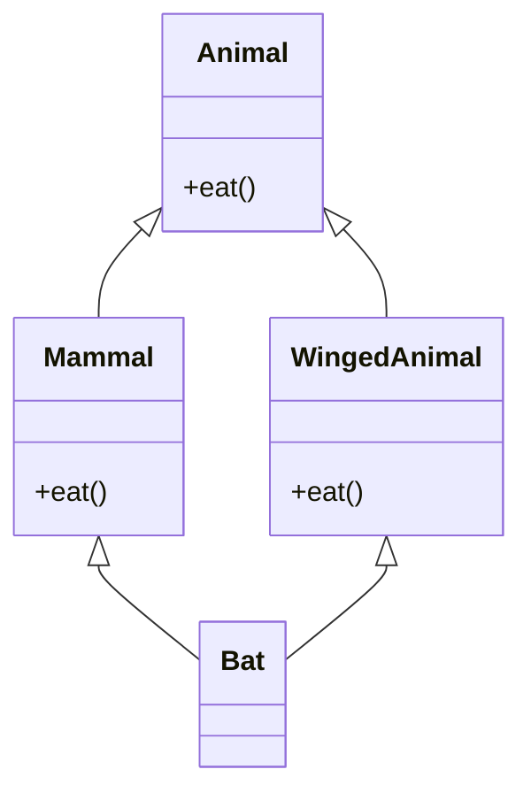
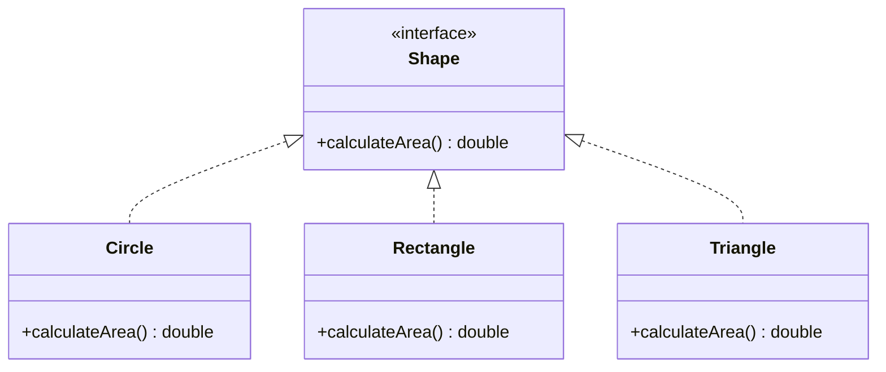
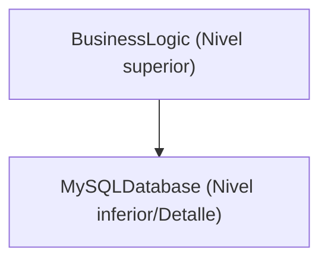
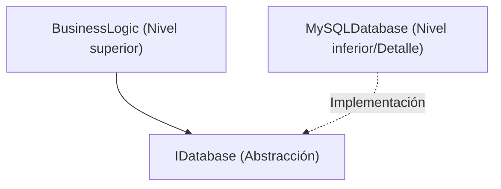

# Las profundidades de la Programación Orientada a Objetos (POO): Historia, los 3 grandes elementos y los principios SOLID

En la ingeniería de software moderna, la Programación Orientada a Objetos (Object-Oriented Programming, OOP) es uno de los paradigmas más difundidos e importantes. Desde pequeños scripts hasta sistemas empresariales de millones de líneas de código, los conceptos de POO están arraigados en todas partes.

En este artículo, no nos limitaremos a una comprensión superficial de la POO, sino que exploraremos a fondo sus antecedentes históricos, los fundamentos de los tipos de datos matemáticos y abstractos, los 3 grandes elementos (encapsulamiento, herencia, polimorfismo), y los **principios SOLID** para construir software robusto en la práctica, explicando exhaustivamente con ejemplos de código concretos, casos extremos y diagramas de Mermaid.

---

## 1. Antecedentes históricos y filosofía de la orientación a objetos

El concepto de POO no nació de la noche a la mañana. Sus orígenes se remontan a la década de 1960 y ha evolucionado como un cambio de paradigma para hacer frente a la complejidad del software.

### 1.1 El nacimiento de Simula y Smalltalk
El ancestro directo de la orientación a objetos es **Simula 67**, desarrollado en la década de 1960 por Ole-Johan Dahl y Kristen Nygaard en el Centro de Computación Noruego. Ellos introdujeron los conceptos de "objeto" y "clase" para modelar simulaciones físicas complejas, como el movimiento de los barcos.

Posteriormente, en la década de 1970, **Smalltalk** fue desarrollado por Alan Kay y otros en el Centro de Investigación de Palo Alto de Xerox (PARC). Alan Kay es el creador del término "orientado a objetos" y su visión era la siguiente:

> "I thought of objects being like biological cells and/or individual computers on a network, only able to communicate with messages." (Pensé en los objetos como células biológicas y/o computadoras individuales en una red, que solo pueden comunicarse con mensajes.)

La POO en Smalltalk no se limitaba a la integración de datos y métodos que los manipulan, sino que ponía énfasis en la **mensajería (paso de mensajes)**.

### 1.2 La popularización mediante C++ y [Java](https://kenji.blog/es/p/programming-languages-history-paradigm-evolution/)
Al entrar en la década de 1980, Bjarne Stroustrup desarrolló **C++**, que añadió capacidades orientadas a objetos de Simula al lenguaje C. Esto hizo que la POO fuera práctica en la programación de sistemas. Además, en la década de 1990, James Gosling y otros en Sun Microsystems desarrollaron **Java**, que con su eslogan "Write Once, Run Anywhere", se convirtió en el estándar de facto para la POO en el desarrollo empresarial.

### 1.3 Antecedentes formales y matemáticos: Tipos de Datos Abstractos (TDA)
En la base de la POO se encuentra el concepto de **Tipo de Dato Abstracto (Abstract Data Type, ADT)**, propuesto por Barbara Liskov y otros. El TDA define matemáticamente las estructuras de datos y su comportamiento (operaciones).

Por ejemplo, al definir una pila $ S $, se cumplen matemáticamente los siguientes axiomas:

$ \text{pop}(\text{push}(S, x)) = S $
$ \text{top}(\text{push}(S, x)) = x $

Las clases de la POO se pueden ver como la encarnación de este TDA como sintaxis de un lenguaje de programación. Un objeto es un espacio de estados $ X $ y un conjunto de funciones $ F $ que realizan la transición de ese estado, agrupados en una cápsula.

---

## 2. Los 3 grandes elementos de la Programación Orientada a Objetos

Los tres conceptos centrales que sustentan la POO son ampliamente conocidos como "encapsulamiento", "herencia" y "polimorfismo" (a menudo se añade "abstracción" para llamarlos los 4 grandes elementos). Aquí profundizaremos en la esencia de cada uno y en los casos extremos en la práctica.

### 2.1 Encapsulamiento (Encapsulation) y Ocultamiento de Información

El encapsulamiento implica agrupar datos (atributos) y los métodos que los manipulan (comportamiento) en una sola unidad (clase), y el principio de **ocultamiento de información (Information Hiding)** que evita que los datos sean manipulados directamente desde el exterior.

#### Propósito y ventajas
- **Mantenimiento de invariantes (Invariant)**: Garantiza que el objeto mantenga siempre un estado válido.
- **Reducción del acoplamiento**: Si se cambia la implementación interna, siempre que la interfaz externa siga siendo la misma, el código cliente no se verá afectado.

#### Ejemplo de código y explicación
Mal ejemplo (los invariantes se rompen):

```java
public class BankAccount {
    public double balance; // Accesible directamente desde el exterior
}

// Lado del cliente
BankAccount account = new BankAccount();
account.balance = -1000; // ¡El saldo se vuelve negativo!
```

Buen ejemplo (protección mediante encapsulamiento):

```java
public class BankAccount {
    private double balance;

    public BankAccount(double initialBalance) {
        if (initialBalance < 0) throw new IllegalArgumentException("El saldo inicial debe ser 0 o superior.");
        this.balance = initialBalance;
    }

    public void deposit(double amount) {
        if (amount <= 0) throw new IllegalArgumentException("El monto del depósito debe ser un valor positivo.");
        this.balance += amount;
    }

    public void withdraw(double amount) {
        if (amount <= 0 || this.balance < amount) throw new IllegalArgumentException("Retiro inválido.");
        this.balance -= amount;
    }

    public double getBalance() {
        return this.balance;
    }
}
```

#### Caso extremo: Destrucción por reflexión
En lenguajes como [Java](https://kenji.blog/es/p/programming-languages-history-paradigm-evolution/) y C#, mediante el uso de la función de reflexión, es posible acceder a los campos `private` a la fuerza. Dado que existe el riesgo de que esto rompa el encapsulamiento, en sistemas donde la seguridad es fundamental, es necesario configurar un administrador de seguridad o reforzar el control de acceso con un sistema de módulos ([Java](https://kenji.blog/es/p/programming-languages-history-paradigm-evolution/) 9 o posterior).

### 2.2 La luz y las sombras de la Herencia (Inheritance)

La herencia es un mecanismo mediante el cual una nueva clase (clase hija, clase derivada) hereda los datos y el comportamiento de una clase existente (clase padre, clase base).

#### Propósito
- **Reutilización de código**: Al agrupar el procesamiento común en la clase padre, se elimina la duplicación.
- **Expresión de la relación "es-un" (is-a)**: Expresa la clasificación del dominio, como "Un perro es un animal (Dog is an Animal)".

#### Herencia múltiple y el problema del diamante (Diamond Problem)
En algunos lenguajes como C++, se permite la **herencia múltiple**, que hereda de varias clases base, pero esto presenta el famoso "problema del diamante".



Cuando `Bat` llama al método `eat()`, existe la ambigüedad sobre si debe llamarse a la implementación de `Mammal` o `WingedAnimal`. [Java](https://kenji.blog/es/p/programming-languages-history-paradigm-evolution/) y C# prohíben la herencia múltiple de clases y evitan este problema utilizando **interfaces**.

#### Composición sobre Herencia (Composition over Inheritance)
En la POO moderna, se tiende a evitar árboles de herencia profundos. Esto se debe al **problema de la clase base frágil (Fragile Base Class Problem)**, donde los cambios en la clase padre se propagan a todas las clases hijas. En su lugar, se recomienda la **composición**, donde se mantienen otros objetos como campos y se les delega el procesamiento.

### 2.3 Polimorfismo (Polymorphism)

El polimorfismo es la propiedad en la que "para el mismo mensaje (llamada a método), el comportamiento difiere dependiendo del tipo de objeto".

#### Tipos
1. **Polimorfismo ad-hoc (Sobrecarga)**: Se llama a diferentes métodos según el tipo y el número de argumentos.
2. **Polimorfismo paramétrico (Genéricos)**: Utilizando parámetros de tipo, se aplica el mismo algoritmo a tipos arbitrarios.
3. **Polimorfismo de subtipos (Sobrescritura)**: Trata instancias de clases hijas utilizando variables de referencia de la interfaz o de la clase padre, y se despachan dinámicamente en tiempo de ejecución.

#### Despacho dinámico (vtable)
En C++ y Java, el polimorfismo de subtipos se implementa mediante un mecanismo llamado **tabla de funciones virtuales (vtable)**. Al principio del área de memoria del objeto se almacena un puntero a la vtable, que resuelve la dirección de la función a llamar en tiempo de ejecución. Esto introduce una ligera sobrecarga.

```java
interface Shape {
    double calculateArea();
}

class Circle implements Shape {
    private double radius;
    public Circle(double r) { this.radius = r; }
    @Override
    public double calculateArea() { return Math.PI * radius * radius; }
}

class Rectangle implements Shape {
    private double w, h;
    public Rectangle(double w, double h) { this.w = w; this.h = h; }
    @Override
    public double calculateArea() { return w * h; }
}

// Uso de polimorfismo
List<Shape> shapes = Arrays.asList(new Circle(5), new Rectangle(4, 6));
for (Shape s : shapes) {
    // Se llama al calculateArea() adecuado dependiendo del tipo real del objeto en tiempo de ejecución
    System.out.println(s.calculateArea()); 
}
```

---

## 3. Principios SOLID: Los secretos del diseño orientado a objetos

Solo comprender los elementos básicos de la POO hace que sea difícil crear software mantenible y extensible. Por lo tanto, los cinco principios de diseño recopilados por Robert C. Martin (Uncle Bob), los **principios SOLID**, son de vital importancia.

### 3.1 Principio de Responsabilidad Única (Single Responsibility Principle: SRP)
**"Una clase debe tener solo una razón para cambiar"**

Si una clase tiene múltiples roles (responsabilidades), el riesgo de que un cambio en un requisito afecte a otra característica no relacionada aumenta.

#### Antipatrón y medidas de mejora
Supongamos que la clase `Report` tiene tres responsabilidades: generación de datos, procesamiento de formato y guardado en un archivo.

```python
# Mal ejemplo: una clase con 3 responsabilidades
class Report:
    def __init__(self, data):
        self.data = data
        
    def generate_content(self):
        return f"Data: {self.data}"
        
    def format_as_pdf(self):
        # Lógica compleja de creación de PDF
        pass
        
    def save_to_file(self, filename):
        with open(filename, 'w') as f:
            f.write(self.generate_content())
```

Separaremos esto de acuerdo al SRP.

```python
# Buen ejemplo: separación de responsabilidades
class ReportData:
    def __init__(self, data):
        self.data = data

class ReportFormatter:
    def format_to_pdf(self, report_data):
        pass
    def format_to_html(self, report_data):
        pass

class ReportRepository:
    def save(self, content, filename):
        pass
```

### 3.2 Principio de Abierto/Cerrado (Open-Closed Principle: OCP)
**"Los componentes del software (clases, módulos, funciones, etc.) deben estar abiertos (Open) para su extensión y cerrados (Closed) para su modificación"**

Este es un principio que establece que el diseño debe permitir la adición de nuevas características sin reescribir el código existente.

#### Abstracción mediante interfaces
El ejemplo anterior del cálculo del área de las formas (Shape) cumple exactamente con el OCP. Si desea agregar una nueva forma (por ejemplo, `Triangle`), puede implementarla simplemente como una nueva clase sin realizar cambios en la interfaz `Shape` existente ni en el código (parte del bucle) que la procesa.



### 3.3 Principio de Sustitución de Liskov (Liskov Substitution Principle: LSP)
**"Los tipos derivados deben poder sustituir a sus tipos base"**

Este principio, propuesto por Barbara Liskov, establece que "si se pasa una clase hija a un lugar donde se espera una clase padre, la corrección del programa no debe verse comprometida".

#### Un ejemplo de violación famoso: El problema del cuadrado y el rectángulo
Matemáticamente, "un cuadrado es un tipo de rectángulo", pero en la programación, este no es siempre el caso.

```java
class Rectangle {
    protected int width;
    protected int height;
    
    public void setWidth(int width) { this.width = width; }
    public void setHeight(int height) { this.height = height; }
    public int getArea() { return width * height; }
}

class Square extends Rectangle {
    @Override
    public void setWidth(int width) {
        this.width = width;
        this.height = width; // Para mantener la restricción del cuadrado
    }
    @Override
    public void setHeight(int height) {
        this.width = height;
        this.height = height;
    }
}

// Código de prueba (lado del cliente)
void testRectangleArea(Rectangle r) {
    r.setWidth(5);
    r.setHeight(4);
    // Si r es Rectangle, debería ser 20, pero si se pasa Square, se convierte en 16 y la aserción falla.
    assert r.getArea() == 20; 
}
```

La esencia de este problema radica en que la clase `Square` rompe el contrato previo (precondición) de la clase `Rectangle` de que "el ancho y el alto se pueden cambiar de forma independiente". Desde la perspectiva del Diseño por Contrato (Design by Contract), el LSP debe cumplirse estrictamente.

### 3.4 Principio de Segregación de Interfaces (Interface Segregation Principle: ISP)
**"Los clientes no deben verse obligados a depender de métodos que no utilizan"**

Las interfaces enormes y abultadas (Fat Interface) obligan a las clases que las implementan a realizar implementaciones de métodos innecesarios.

#### Ejemplo de violación y mejora
```csharp
// Mal ejemplo: interfaz gorda (Fat Interface)
public interface IMachine {
    void Print(Document d);
    void Scan(Document d);
    void Fax(Document d);
}

// Una impresora simple se ve obligada a implementar los métodos, aunque no pueda escanear ni enviar faxes
public class SimplePrinter : IMachine {
    public void Print(Document d) { /* Procesamiento de impresión */ }
    public void Scan(Document d) { throw new NotImplementedException(); }
    public void Fax(Document d) { throw new NotImplementedException(); }
}
```

Separaremos la interfaz de manera granular según el rol.

```csharp
// Buen ejemplo: segregación de interfaces
public interface IPrinter {
    void Print(Document d);
}
public interface IScanner {
    void Scan(Document d);
}

public class SimplePrinter : IPrinter {
    public void Print(Document d) { /* Procesamiento de impresión */ }
}

public class MultiFunctionPrinter : IPrinter, IScanner {
    public void Print(Document d) { /* Procesamiento de impresión */ }
    public void Scan(Document d) { /* Procesamiento de escaneo */ }
}
```

### 3.5 Principio de Inversión de Dependencias (Dependency Inversion Principle: DIP)
**"Los módulos de nivel superior no deben depender de los módulos de nivel inferior. Ambos deben depender de abstracciones. Además, las abstracciones no deben depender de los detalles, y los detalles deben depender de las abstracciones"**

Este principio es clave para reducir drásticamente el grado de acoplamiento entre los componentes del sistema.

#### Diseño tradicional (Violación de DIP)
Una situación en la que la lógica empresarial de nivel superior depende directamente de una clase de acceso a datos específica de nivel inferior.



#### Diseño con DIP aplicado
Al interponer una abstracción (interfaz), invertimos el vector de dependencia.



```java
// Abstracción (Interfaz)
public interface UserRepository {
    void save(User user);
}

// Módulo de nivel inferior (Detalle)
public class MySQLUserRepository implements UserRepository {
    public void save(User user) {
        // Procesamiento concreto para guardar en MySQL
    }
}

// Módulo de nivel superior
public class UserService {
    private final UserRepository repository;
    
    // Inyección de dependencias mediante inyección de constructor (DI)
    public UserService(UserRepository repository) {
        this.repository = repository;
    }
    
    public void registerUser(User user) {
        // ... Lógica de negocio ...
        repository.save(user);
    }
}
```

Al diseñar de esta manera, el código de `UserService` no necesita cambiarse en absoluto cuando la base de datos se cambia de MySQL a PostgreSQL o a una base de datos en memoria para pruebas. Este es el concepto base del **framework DI (Dependency Injection)** (Spring, Guice, .NET DI, etc.).

---

## 4. Consideraciones matemáticas y métodos formales de la POO

Aquí introduciremos una perspectiva un poco más matemática sobre el sistema de tipos de la POO. Las relaciones de derivación de tipos (subtipado) a menudo se modelan utilizando la teoría de categorías o la teoría de retículos.

El hecho de que el tipo $ A $ sea un subtipo del tipo $ B $ se denota como $ A <: B $. Esto forma una relación de orden parcial (reflexiva, transitiva y antisimétrica).

1. **Propiedad reflexiva**: Para cualquier tipo $ A $, $ A <: A $
2. **Propiedad transitiva**: Si $ A <: B $ y $ B <: C $, entonces $ A <: C $

En el subtipado de funciones, existe una propiedad importante: el tipo del valor de retorno es **covariante (Covariant)** y el tipo del argumento es **contravariante (Contravariant)**.

Para los tipos de función $ f: P_1 \to R_1 $ y $ g: P_2 \to R_2 $, las condiciones para que $ f <: g $ (la función $ f $ se puede usar de forma segura en lugar de $ g $) son las siguientes:

$ P_2 <: P_1 \quad \text{y} \quad R_1 <: R_2 $

La razón por la que los argumentos son contravariantes (la dirección se invierte) es el resultado de aplicar el LSP (Principio de Sustitución de Liskov) a nivel de función. Un método de la clase hija debe aceptar condiciones más flexibles (argumentos de tipos más amplios) que los de la clase padre y debe devolver condiciones más estrictas (valores de retorno de tipos más estrictos).

---

## 5. Conclusión y el futuro de la orientación a objetos

En este artículo, hemos comenzado por los antecedentes históricos de la POO y hemos explicado detalladamente los elementos básicos como el encapsulamiento, la herencia, el polimorfismo, así como los principios SOLID esenciales en el desarrollo empresarial.

En los últimos años, el paradigma de la Programación Funcional (PF) ha ganado prominencia, y se están reconsiderando los beneficios de la inmutabilidad (Immutability) y las funciones puras (Pure Functions). Sin embargo, la POO y la PF no están en conflicto. Los lengমাদের modernos (Scala, Kotlin, [Rust](https://kenji.blog/es/p/programming-languages-history-paradigm-evolution/), y las versiones recientes de C# y [Java](https://kenji.blog/es/p/programming-languages-history-paradigm-evolution/)) combinan los paradigmas de ambos, y los diseños híbridos que "encapsulan la gestión del estado en clases de POO y realizan canalizaciones de transformación de datos con enfoques de PF" se están volviendo la norma.

No existe una "bala de plata" en el diseño de software, pero una comprensión profunda de la POO y la aplicación de los principios SOLID serán armas poderosas para construir sistemas mantenibles y resilientes a largo plazo.

---

**Referencias y libros recomendados:**
1. Erich Gamma, et al. *Design Patterns: Elements of Reusable Object-Oriented Software*. Addison-Wesley.
2. Robert C. Martin. *Clean Architecture: A Craftsman's Guide to Software Structure and Design*. Prentice Hall.
3. Bertrand Meyer. *Object-Oriented Software Construction*. Prentice Hall.
4. Barbara Liskov, Jeannette Wing. *A behavioral notion of subtyping*. ACM Transactions on [Programming Language](https://kenji.blog/es/p/programming-languages-history-paradigm-evolution/)s and Systems.
