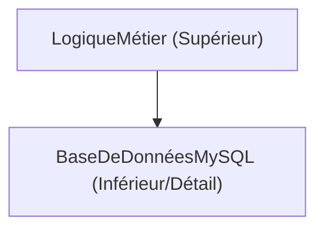
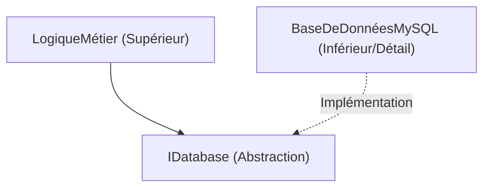

# Les profondeurs de la programmation orientée objet (POO) : Histoire, les 3 piliers et les principes SOLID

Dans le génie logiciel moderne, la programmation orientée objet (Object-Oriented Programming, POO) est l'un des paradigmes les plus répandus et les plus importants. Des petits scripts aux systèmes d'entreprise de plusieurs millions de lignes, les concepts de la POO sont omniprésents.

Cet article va au-delà d'une simple compréhension superficielle de la POO. Nous explorerons son contexte historique, les fondements mathématiques et abstraits des types de données, une analyse approfondie de ses 3 piliers (encapsulation, héritage, polymorphisme), et comment construire des logiciels robustes en pratique avec les **principes SOLID**, à l'aide d'exemples de code concrets, de cas limites et de diagrammes Mermaid.

---

## 1. Contexte historique et philosophie de l'orienté objet

Le concept de POO n'est pas apparu du jour au lendemain. Ses origines remontent aux années 1960, évoluant comme un changement de paradigme pour faire face à la complexité des logiciels.

### 1.1 La naissance de Simula et Smalltalk
L'ancêtre direct de l'orienté objet est **Simula 67**, développé dans les années 1960 par Ole-Johan Dahl et Kristen Nygaard au Centre de Calcul Norvégien. Ils ont introduit les concepts d'"objet" et de "classe" pour modéliser des simulations physiques complexes, telles que le mouvement des navires.

Par la suite, dans les années 1970, **Smalltalk** a été développé par Alan Kay et son équipe au Palo Alto Research Center (PARC) de Xerox. Alan Kay est le créateur du terme "orienté objet" et sa vision était la suivante :

> "I thought of objects being like biological cells and/or individual computers on a network, only able to communicate with messages." (Je pensais aux objets comme à des cellules biologiques et/ou des ordinateurs individuels sur un réseau, capables de communiquer uniquement par des messages.)

Dans Smalltalk, la POO ne se limitait pas à l'intégration de données et de méthodes pour les manipuler, mais mettait l'accent sur le **passage de messages (messaging)**.

### 1.2 La popularisation avec C++ et [Java](https://kenji.blog/fr/p/programming-languages-history-paradigm-evolution/)
Dans les années 1980, Bjarne Stroustrup a développé **C++**, ajoutant des fonctionnalités orientées objet de Simula au langage C. Cela a rendu la POO pratique dans la programmation système. De plus, dans les années 1990, **Java** a été développé par James Gosling et d'autres chez Sun Microsystems, et avec le slogan "Write Once, Run Anywhere", il est devenu le standard de facto pour la POO dans le développement d'entreprise.

### 1.3 Contexte formel et mathématique : Type de données abstrait (TDA)
Le fondement de la POO repose sur le concept de **Type de Données Abstrait (Abstract Data Type, TDA)**, proposé par Barbara Liskov et d'autres. Le TDA définit mathématiquement une structure de données et son comportement (opérations).

Par exemple, lors de la définition d'une pile $ S $, les axiomes mathématiques suivants s'appliquent :

$ \text{dépiler}(\text{empiler}(S, x)) = S $
$ \text{sommet}(\text{empiler}(S, x)) = x $

Une classe en POO peut être considérée comme la matérialisation de ce TDA en tant que syntaxe d'un langage de programmation. Un objet est une capsule regroupant un espace d'états $ X $ et un ensemble de fonctions $ F $ qui font transiter ces états.

---

## 2. Les 3 piliers de la programmation orientée objet

L'encapsulation, l'héritage et le polymorphisme sont largement connus comme les 3 concepts fondamentaux soutenant la POO (souvent appelés les 4 piliers si l'on ajoute l'abstraction). Nous allons ici approfondir l'essence de chacun d'eux et les cas limites dans la pratique.

### 2.1 Encapsulation (Encapsulation) et Masquage de l'information

L'encapsulation consiste à regrouper les données (attributs) et les méthodes (comportements) qui les manipulent en une seule unité (classe), et inclut le principe de **masquage de l'information (Information Hiding)**, qui empêche la manipulation directe des données de l'extérieur.

#### Objectifs et avantages
- **Maintien des invariants (Invariant)** : Garantit que l'objet conserve toujours un état valide.
- **Réduction du couplage** : Même si l'implémentation interne change, le code appelant n'est pas affecté tant que l'interface externe reste la même.

#### Exemples de code et explications
Mauvais exemple (rupture des invariants) :

```java
public class CompteBancaire {
    public double solde; // Accessible directement de l'extérieur
}

// Côté utilisation
CompteBancaire compte = new CompteBancaire();
compte.solde = -1000; // Le solde devient négatif !
```

Bon exemple (protection par encapsulation) :

```java
public class CompteBancaire {
    private double solde;

    public CompteBancaire(double soldeInitial) {
        if (soldeInitial < 0) throw new IllegalArgumentException("Le solde initial doit être supérieur ou égal à 0.");
        this.solde = soldeInitial;
    }

    public void deposer(double montant) {
        if (montant <= 0) throw new IllegalArgumentException("Le montant du dépôt doit être une valeur positive.");
        this.solde += montant;
    }

    public void retirer(double montant) {
        if (montant <= 0 || this.solde < montant) throw new IllegalArgumentException("Retrait invalide.");
        this.solde -= montant;
    }

    public double getSolde() {
        return this.solde;
    }
}
```

#### Cas limite : Destruction par réflexion
Dans des langages comme [Java](https://kenji.blog/fr/p/programming-languages-history-paradigm-evolution/) ou C#, il est possible d'accéder de force aux champs `private` en utilisant la réflexion. Étant donné que cela risque de briser l'encapsulation, dans les systèmes où la sécurité est primordiale, il est nécessaire de renforcer le contrôle d'accès avec le gestionnaire de sécurité ou le système de modules (à partir de [Java](https://kenji.blog/fr/p/programming-languages-history-paradigm-evolution/) 9).

### 2.2 Lumière et ombres de l'héritage (Inheritance)

L'héritage est un mécanisme par lequel une nouvelle classe (classe enfant, classe dérivée) hérite des données et du comportement d'une classe existante (classe parent, classe de base).

#### Objectifs
- **Réutilisation du code** : Élimine les doublons en regroupant les traitements communs dans la classe parent.
- **Expression de la relation "est-un" (is-a)** : Exprime une classification du domaine, par exemple, "Un chien est un animal (Dog is an Animal)".

#### Héritage multiple et problème du diamant (Diamond Problem)
Certains langages comme C++ autorisent l'**héritage multiple**, où l'on hérite de plusieurs classes parents, mais cela pose le célèbre "problème du diamant".

```mermaid
classDiagram
    class Animal {
        +manger()
    }
    class Mammifere {
        +manger()
    }
    class AnimalAile {
        +manger()
    }
    class ChauveSouris {
    }
    
    "Animal" <|-- "Mammifere"
    "Animal" <|-- "AnimalAile"
    "Mammifere" <|-- "ChauveSouris"
    "AnimalAile" <|-- "ChauveSouris"
```

Lorsque ChauveSouris appelle la méthode `manger()`, il devient ambigu de savoir quelle implémentation appeler entre celle de Mammifere et celle d'AnimalAile. [Java](https://kenji.blog/fr/p/programming-languages-history-paradigm-evolution/) et C# évitent ce problème en interdisant l'héritage multiple de classes et en utilisant des **interfaces**.

#### Composition plutôt qu'héritage (Composition over Inheritance)
Dans la POO moderne, les arbres d'héritage profonds ont tendance à être évités. Cela est dû au **problème de la classe de base fragile (Fragile Base Class Problem)**, où la modification d'une classe parent se répercute sur toutes les classes enfants. Au lieu de cela, la **composition**, qui consiste à conserver d'autres objets en tant que champs et à déléguer les traitements, est recommandée.

### 2.3 Polymorphisme (Polymorphism : Multiplicité des formes)

Le polymorphisme est la propriété selon laquelle "le même message (appel de méthode) se comporte différemment selon le type de l'objet".

#### Types
1. **Polymorphisme ad hoc (Surcharge / Overloading)** : Une méthode différente est appelée en fonction du type ou du nombre d'arguments.
2. **Polymorphisme paramétrique (Génériques)** : Utilisation de paramètres de type pour appliquer le même algorithme à des types arbitraires.
3. **Polymorphisme de sous-typage (Redéfinition / Overriding)** : Traitement de l'instance d'une classe enfant avec une variable de référence d'une interface ou d'une classe parent, dispatchée dynamiquement à l'exécution.

#### Dispatch dynamique (vtable)
Dans des langages comme C++ et Java, le polymorphisme de sous-typage est réalisé via un mécanisme appelé **table de fonctions virtuelles (vtable)**. Un pointeur vers la vtable est stocké au début de la zone mémoire de l'objet, ce qui résout l'adresse de la fonction à appeler à l'exécution. Cela entraîne une légère surcharge.

```java
interface Forme {
    double calculerAire();
}

class Cercle implements Forme {
    private double rayon;
    public Cercle(double r) { this.rayon = r; }
    @Override
    public double calculerAire() { return Math.PI * rayon * rayon; }
}

class Rectangle implements Forme {
    private double l, h;
    public Rectangle(double l, double h) { this.l = l; this.h = h; }
    @Override
    public double calculerAire() { return l * h; }
}

// Utilisation du polymorphisme
List<Forme> formes = Arrays.asList(new Cercle(5), new Rectangle(4, 6));
for (Forme f : formes) {
    // La méthode calculerAire() appropriée est appelée en fonction du type réel de l'objet à l'exécution
    System.out.println(f.calculerAire()); 
}
```

---

## 3. Principes SOLID : Le secret de la conception orientée objet

Comprendre simplement les éléments de base de la POO ne suffit pas pour créer des logiciels hautement maintenables et extensibles. C'est là que les cinq principes de conception, les **principes SOLID**, compilés par Robert C. Martin (Uncle Bob), deviennent importants.

### 3.1 Principe de responsabilité unique (Single Responsibility Principle : SRP)
**"Une classe ne doit avoir qu'une seule raison de changer."**

Si une classe possède plusieurs rôles (responsabilités), le risque que le changement d'une exigence affecte une autre fonctionnalité sans rapport augmente.

#### Anti-pattern et solutions
Supposons que la classe `Rapport` ait trois responsabilités : génération de données, formatage, et sauvegarde dans un fichier.

```python
# Mauvais exemple : une classe avec 3 responsabilités
class Rapport:
    def __init__(self, donnees):
        self.donnees = donnees
        
    def generer_contenu(self):
        return f"Données : {self.donnees}"
        
    def formater_en_pdf(self):
        # Logique complexe pour convertir en PDF
        pass
        
    def sauvegarder_dans_fichier(self, nom_fichier):
        with open(nom_fichier, 'w') as f:
            f.write(self.generer_contenu())
```

Divisons cela selon le SRP.

```python
# Bon exemple : séparation des responsabilités
class DonneesRapport:
    def __init__(self, donnees):
        self.donnees = donnees

class FormateurRapport:
    def formater_en_pdf(self, donnees_rapport):
        pass
    def formater_en_html(self, donnees_rapport):
        pass

class DepotRapport:
    def sauvegarder(self, contenu, nom_fichier):
        pass
```

### 3.2 Principe ouvert/fermé (Open-Closed Principle : OCP)
**"Les entités logicielles (classes, modules, fonctions, etc.) doivent être ouvertes à l'extension, mais fermées à la modification."**

C'est le principe selon lequel la conception doit permettre d'ajouter de nouvelles fonctionnalités sans réécrire le code existant.

#### Abstraction par interfaces
L'exemple de calcul de l'aire des figures (Forme) vu précédemment satisfait exactement l'OCP. Si l'on souhaite ajouter une nouvelle figure (par exemple `Triangle`), il suffit d'implémenter une nouvelle classe sans modifier du tout l'interface `Forme` existante ou le code qui la traite (la boucle).

```mermaid
classDiagram
    class Forme {
        <<interface>>
        +calculerAire() double
    }
    class Cercle {
        +calculerAire() double
    }
    class Rectangle {
        +calculerAire() double
    }
    class Triangle {
        +calculerAire() double
    }
    
    "Forme" <|.. "Cercle"
    "Forme" <|.. "Rectangle"
    "Forme" <|.. "Triangle"
```

### 3.3 Principe de substitution de Liskov (Liskov Substitution Principle : LSP)
**"Les types dérivés doivent pouvoir être substitués à leurs types de base."**

Ce principe, proposé par Barbara Liskov, stipule que "la validité du programme ne doit pas être rompue même si l'on passe une classe enfant là où une classe parent est attendue".

#### Un exemple célèbre de violation : Le problème du carré et du rectangle
Mathématiquement, "un carré est un type de rectangle", mais en programmation, ce n'est pas toujours vrai.

```java
class Rectangle {
    protected int largeur;
    protected int hauteur;
    
    public void setLargeur(int largeur) { this.largeur = largeur; }
    public void setHauteur(int hauteur) { this.hauteur = hauteur; }
    public int getAire() { return largeur * hauteur; }
}

class Carre extends Rectangle {
    @Override
    public void setLargeur(int largeur) {
        this.largeur = largeur;
        this.hauteur = largeur; // Pour maintenir la contrainte du carré
    }
    @Override
    public void setHauteur(int hauteur) {
        this.largeur = hauteur;
        this.hauteur = hauteur;
    }
}

// Code de test (côté utilisation)
void testerAireRectangle(Rectangle r) {
    r.setLargeur(5);
    r.setHauteur(4);
    // Si r est un Rectangle, l'aire devrait être 20, mais si un Carre est passé, elle devient 16, et l'assertion échoue.
    assert r.getAire() == 20; 
}
```

L'essence de ce problème est que la classe `Carre` rompt le contrat préalable (précondition) de la classe `Rectangle` selon lequel "la largeur et la hauteur peuvent être modifiées indépendamment". Du point de vue de la conception par contrat (Design by Contract), le LSP doit être strictement respecté.

### 3.4 Principe de ségrégation des interfaces (Interface Segregation Principle : ISP)
**"Les clients ne doivent pas être forcés de dépendre de méthodes qu'ils n'utilisent pas."**

Une interface énorme et gonflée (Fat Interface) force les classes qui l'implémentent à implémenter des méthodes inutiles.

#### Exemple de violation et amélioration
```csharp
// Mauvais exemple : Fat Interface
public interface IMachine {
    void Imprimer(Document d);
    void Numeriser(Document d);
    void Faxer(Document d);
}

// Une simple imprimante ne peut ni numériser ni faxer, mais on la force à implémenter les méthodes
public class ImprimanteSimple : IMachine {
    public void Imprimer(Document d) { /* Traitement d'impression */ }
    public void Numeriser(Document d) { throw new NotImplementedException(); }
    public void Faxer(Document d) { throw new NotImplementedException(); }
}
```

Séparons finement l'interface par rôle.

```csharp
// Bon exemple : Ségrégation des interfaces
public interface IImprimante {
    void Imprimer(Document d);
}
public interface INumeriseur {
    void Numeriser(Document d);
}

public class ImprimanteSimple : IImprimante {
    public void Imprimer(Document d) { /* Traitement d'impression */ }
}

public class ImprimanteMultifonction : IImprimante, INumeriseur {
    public void Imprimer(Document d) { /* Traitement d'impression */ }
    public void Numeriser(Document d) { /* Traitement de numérisation */ }
}
```

### 3.5 Principe d'inversion des dépendances (Dependency Inversion Principle : DIP)
**"Les modules de haut niveau ne doivent pas dépendre des modules de bas niveau. Les deux doivent dépendre d'abstractions. De plus, les abstractions ne doivent pas dépendre des détails, ce sont les détails qui doivent dépendre des abstractions."**

Ce principe est la clé pour réduire drastiquement le couplage entre les composants du système.

#### Conception classique (Violation du DIP)
La logique métier de haut niveau dépend directement d'une classe d'accès aux données concrète de bas niveau.



#### Conception appliquant le DIP
En intercalant une abstraction (interface), on inverse le vecteur de la relation de dépendance.



```java
// Abstraction (Interface)
public interface DepotUtilisateur {
    void sauvegarder(Utilisateur utilisateur);
}

// Module de bas niveau (Détail)
public class DepotUtilisateurMySQL implements DepotUtilisateur {
    public void sauvegarder(Utilisateur utilisateur) {
        // Traitement concret pour sauvegarder dans MySQL
    }
}

// Module de haut niveau
public class ServiceUtilisateur {
    private final DepotUtilisateur depot;
    
    // Injection de dépendance via le constructeur (DI)
    public ServiceUtilisateur(DepotUtilisateur depot) {
        this.depot = depot;
    }
    
    public void enregistrerUtilisateur(Utilisateur utilisateur) {
        // ... Logique métier ...
        depot.sauvegarder(utilisateur);
    }
}
```

Conçu ainsi, le code de `ServiceUtilisateur` n'a pas besoin d'être modifié même lorsque l'on remplace MySQL par PostgreSQL ou par une base de données en mémoire pour les tests. C'est le concept fondamental des **frameworks d'injection de dépendances (DI)** (Spring, Guice, .NET DI, etc.).

---

## 4. Considérations mathématiques et méthodes formelles de la POO

Introduisons ici une perspective un peu mathématique sur le système de types de la POO. Les relations de dérivation de type (sous-typage) sont souvent modélisées en utilisant la théorie des catégories ou la théorie des treillis.

Le fait qu'un type $ A $ soit un sous-type du type $ B $ est noté $ A <: B $. Cela forme une relation d'ordre partiel (réflexive, transitive, antisymétrique).

1. **Réflexivité** : Pour tout type $ A $, $ A <: A $
2. **Transitivité** : Si $ A <: B $ et $ B <: C $, alors $ A <: C $

Dans le sous-typage des fonctions, il existe une propriété importante selon laquelle le type de retour est **covariant (Covariant)** et le type d'argument est **contravariant (Contravariant)**.

Pour les types de fonctions $ f: P_1 \to R_1 $ et $ g: P_2 \to R_2 $, la condition pour que $ f <: g $ (la fonction $ f $ peut être utilisée en toute sécurité à la place de $ g $) est la suivante :

$ P_2 <: P_1 \quad \text{ et } \quad R_1 <: R_2 $

La raison pour laquelle les arguments sont contravariants (direction opposée) est le résultat de l'application du LSP (Principe de substitution de Liskov) au niveau des fonctions. Une méthode d'une classe enfant doit accepter des conditions plus souples (des arguments d'un type plus large) et retourner des conditions plus strictes (un retour d'un type plus restreint) par rapport à la méthode de la classe parent.

---

## 5. Résumé et avenir de l'orienté objet

Dans cet article, nous avons commencé par le contexte historique de la POO, puis nous avons expliqué en détail les éléments fondamentaux tels que l'encapsulation, l'héritage et le polymorphisme, ainsi que les principes SOLID essentiels au développement d'entreprise.

Ces dernières années, le paradigme de la programmation fonctionnelle (PF) a émergé, et les avantages de l'immuabilité (Immutability) et des fonctions pures (Pure Functions) sont reconsidérés. Cependant, la POO et la PF ne sont pas opposées. Les langages modernes (Scala, Kotlin, [Rust](https://kenji.blog/fr/p/programming-languages-history-paradigm-evolution/), et récemment C# et [Java](https://kenji.blog/fr/p/programming-languages-history-paradigm-evolution/)) fusionnent ces deux paradigmes, et une conception hybride du type "la gestion d'état est encapsulée dans des classes POO, et le pipeline de transformation de données se fait via une approche PF" devient courante.

Il n'y a pas de "balle d'argent" en conception logicielle, mais une compréhension profonde de la POO et l'application des principes SOLID constitueront des armes puissantes pour construire des systèmes résistants aux changements et maintenables à long terme.

---

**Références et lectures recommandées :**
1. Erich Gamma, et al. *Design Patterns: Elements of Reusable Object-Oriented Software*. Addison-Wesley.
2. Robert C. Martin. *Clean Architecture: A Craftsman's Guide to Software Structure and Design*. Prentice Hall.
3. Bertrand Meyer. *Object-Oriented Software Construction*. Prentice Hall.
4. Barbara Liskov, Jeannette Wing. *A behavioral notion of subtyping*. ACM Transactions on [Programming Language](https://kenji.blog/fr/p/programming-languages-history-paradigm-evolution/)s and Systems.
