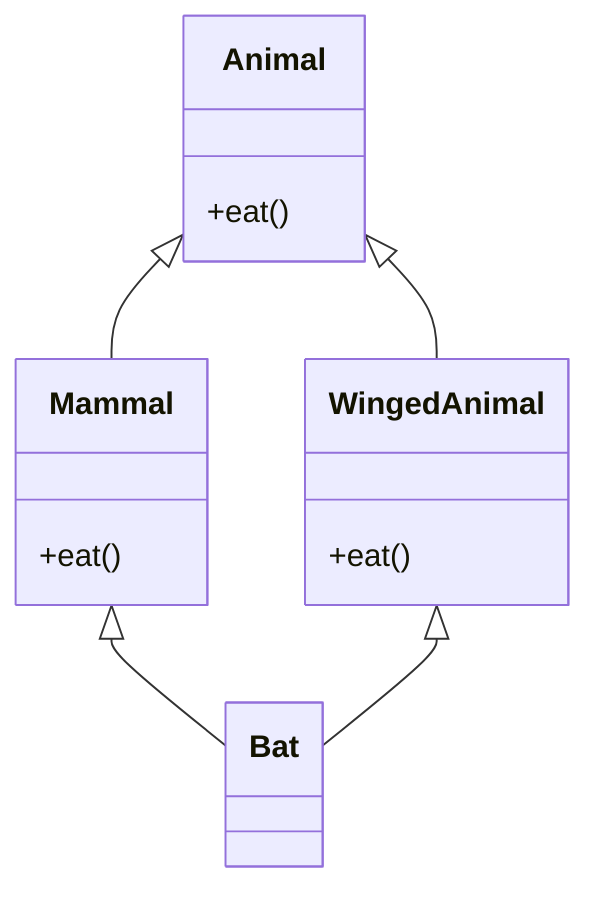
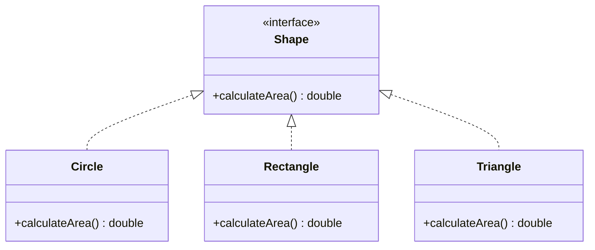
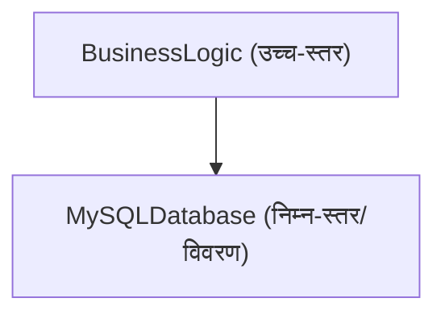
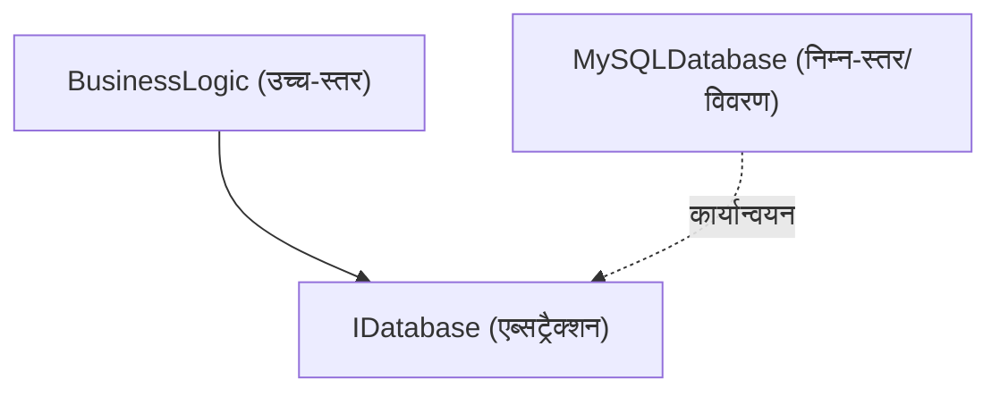

# ऑब्जेक्ट-ओरिएंटेड प्रोग्रामिंग (OOP) की गहराई: इतिहास, 3 मुख्य तत्व, और SOLID सिद्धांत

आधुनिक सॉफ्टवेयर इंजीनियरिंग में, ऑब्जेक्ट-ओरिएंटेड प्रोग्रामिंग (Object-Oriented Programming, OOP) सबसे लोकप्रिय और महत्वपूर्ण पैराडाइम में से एक है। छोटी स्क्रिप्ट से लेकर लाखों लाइनों के एंटरप्राइज़ सिस्टम तक, OOP की अवधारणा हर जगह मौजूद है।

इस लेख में, हम OOP की केवल सतही समझ से आगे बढ़कर, इसकी ऐतिहासिक पृष्ठभूमि, गणितीय और अमूर्त डेटा प्रकारों के आधार, 3 मुख्य तत्वों (एनकैप्सुलेशन, इनहेरिटेंस, और पॉलीमॉर्फिज्म) की गहराई से पड़ताल करेंगे। साथ ही, व्यावहारिक रूप से मजबूत सॉफ्टवेयर बनाने के लिए **SOLID सिद्धांतों** के बारे में, विशिष्ट कोड उदाहरणों, एज केसेस और Mermaid आरेखों के साथ विस्तार से चर्चा करेंगे।

---

## 1. ऑब्जेक्ट-ओरिएंटेड की ऐतिहासिक पृष्ठभूमि और दर्शन

OOP की अवधारणा रातों-रात नहीं बनी। इसकी उत्पत्ति 1960 के दशक में हुई और यह सॉफ्टवेयर की जटिलता से निपटने के लिए एक पैराडाइम शिफ्ट के रूप में विकसित हुई।

### 1.1 Simula और Smalltalk का जन्म
ऑब्जेक्ट-ओरिएंटेड का प्रत्यक्ष पूर्वज 1960 के दशक में नॉर्वेजियन कंप्यूटिंग सेंटर में ओले-जोहान डाहल (Ole-Johan Dahl) और क्रिस्टन न्यगार्ड (Kristen Nygaard) द्वारा विकसित **Simula 67** है। उन्होंने जहाजों की गति जैसे जटिल भौतिक सिमुलेशन को मॉडल करने के लिए "ऑब्जेक्ट" और "क्लास" की अवधारणाएँ पेश कीं।

इसके बाद, 1970 के दशक में जेरोक्स के पालो ऑल्टो रिसर्च सेंटर (PARC) में एलन के (Alan Kay) और अन्य लोगों द्वारा **Smalltalk** विकसित किया गया था। एलन के "ऑब्जेक्ट-ओरिएंटेड" शब्द के निर्माता हैं, और उनका दृष्टिकोण कुछ इस प्रकार था:

> "I thought of objects being like biological cells and/or individual computers on a network, only able to communicate with messages." (मैंने ऑब्जेक्ट्स को जैविक कोशिकाओं और/या नेटवर्क पर व्यक्तिगत कंप्यूटरों की तरह सोचा था, जो केवल संदेशों के साथ संवाद करने में सक्षम हैं।)

Smalltalk में OOP केवल डेटा और उसे संचालित करने वाले तरीकों के एकीकरण तक सीमित नहीं था, बल्कि **मैसेजिंग (संदेश पासिंग)** पर भी जोर देता था।

### 1.2 C++ और [Java](https://kenji.blog/hi/p/programming-languages-history-paradigm-evolution/) के माध्यम से लोकप्रियता
1980 के दशक में, बजरने स्ट्राउस्ट्रुप (Bjarne Stroustrup) ने **C++** विकसित किया, जिसमें C भाषा में Simula की ऑब्जेक्ट-ओरिएंटेड कार्यक्षमता जोड़ी गई थी। इससे सिस्टम प्रोग्रामिंग में OOP का व्यावहारिक उपयोग संभव हो गया। इसके अलावा, 1990 के दशक में सन माइक्रोसिस्टम्स के जेम्स गोसलिंग (James Gosling) और अन्य लोगों द्वारा **Java** विकसित किया गया, जो "Write Once, Run Anywhere" के नारे के साथ एंटरप्राइज़ विकास में OOP का वास्तविक मानक बन गया।

### 1.3 औपचारिक और गणितीय पृष्ठभूमि: एब्सट्रैक्ट डेटा टाइप (ADT)
OOP की नींव में बारबरा लिस्कोव (Barbara Liskov) और अन्य लोगों द्वारा प्रस्तावित **एब्सट्रैक्ट डेटा टाइप (Abstract Data Type, ADT)** की अवधारणा शामिल है। ADT एक डेटा संरचना और उसके व्यवहार (ऑपरेशंस) को गणितीय रूप से परिभाषित करता है।

उदाहरण के लिए, यदि हम स्टैक $ S $ को परिभाषित करते हैं, तो गणितीय रूप से निम्नलिखित स्वयंसिद्ध लागू होते हैं:

$ \text{pop}(\text{push}(S, x)) = S $
$ \text{top}(\text{push}(S, x)) = x $

OOP के क्लास को इस ADT के प्रोग्रामिंग भाषा सिंटैक्स के रूप में देखा जा सकता है। ऑब्जेक्ट वह है जो स्टेट स्पेस $ X $ और कार्यों के समूह $ F $ को, जो उस स्थिति को बदलता है, एक कैप्सूल में जोड़ता है।

---

## 2. ऑब्जेक्ट-ओरिएंटेड प्रोग्रामिंग के 3 मुख्य तत्व

OOP का समर्थन करने वाली मुख्य अवधारणाओं के रूप में, "एनकैप्सुलेशन", "इनहेरिटेंस", और "पॉलीमॉर्फिज्म" को व्यापक रूप से जाना जाता है (अक्सर "एब्सट्रैक्शन" जोड़कर इसे 4 मुख्य तत्व भी कहा जाता है)। यहाँ हम प्रत्येक के सार और अभ्यास में एज केसेस पर गहराई से चर्चा करेंगे।

### 2.1 एनकैप्सुलेशन (Encapsulation) और इन्फॉर्मेशन हाइडिंग

एनकैप्सुलेशन डेटा (विशेषताओं) और उन्हें संचालित करने वाले तरीकों (व्यवहारों) को एक इकाई (क्लास) में संयोजित करने की प्रक्रिया है, और इसमें **इन्फॉर्मेशन हाइडिंग (Information Hiding)** का सिद्धांत शामिल है जो डेटा में सीधे बाहरी हेरफेर को रोकता है।

#### उद्देश्य और लाभ
- **अपरिवर्तनीय (Invariant) का रखरखाव**: यह सुनिश्चित करता है कि ऑब्जेक्ट हमेशा एक वैध स्थिति बनाए रखे।
- **कपलिंग में कमी**: आंतरिक कार्यान्वयन को बदलने पर भी, यदि बाहरी इंटरफ़ेस समान रहता है, तो यह कॉलिंग कोड को प्रभावित नहीं करेगा।

#### कोड उदाहरण और स्पष्टीकरण
खराब उदाहरण (अपरिवर्तनीय टूट गया है):

```java
public class BankAccount {
    public double balance; // बाहर से सीधे एक्सेस किया जा सकता है
}

// उपयोग का पक्ष
BankAccount account = new BankAccount();
account.balance = -1000; // बैलेंस नेगेटिव हो गया है!
```

अच्छा उदाहरण (एनकैप्सुलेशन द्वारा सुरक्षा):

```java
public class BankAccount {
    private double balance;

    public BankAccount(double initialBalance) {
        if (initialBalance < 0) throw new IllegalArgumentException("प्रारंभिक शेष 0 या अधिक होना चाहिए।");
        this.balance = initialBalance;
    }

    public void deposit(double amount) {
        if (amount <= 0) throw new IllegalArgumentException("जमा राशि धनात्मक होनी चाहिए।");
        this.balance += amount;
    }

    public void withdraw(double amount) {
        if (amount <= 0 || this.balance < amount) throw new IllegalArgumentException("अमान्य निकासी।");
        this.balance -= amount;
    }

    public double getBalance() {
        return this.balance;
    }
}
```

#### एज केस: रिफ्लेक्शन द्वारा विनाश
[Java](https://kenji.blog/hi/p/programming-languages-history-paradigm-evolution/) और C# जैसी भाषाओं में, रिफ्लेक्शन सुविधा का उपयोग करके `private` फ़ील्ड तक ज़बरदस्ती पहुँचना संभव है। इससे एनकैप्सुलेशन के टूटने का जोखिम होता है, इसलिए सुरक्षा के प्रति संवेदनशील सिस्टम में, सुरक्षा प्रबंधक को कॉन्फ़िगर करना या मॉड्यूल सिस्टम ([Java](https://kenji.blog/hi/p/programming-languages-history-paradigm-evolution/) 9 और उसके बाद के वर्ज़न) के माध्यम से एक्सेस कंट्रोल को मज़बूत करना आवश्यक है।

### 2.2 इनहेरिटेंस (Inheritance) की रोशनी और परछाई

इनहेरिटेंस वह तंत्र है जिसके द्वारा एक नया क्लास (चाइल्ड क्लास, व्युत्पन्न क्लास) किसी मौजूदा क्लास (पैरेंट क्लास, बेस क्लास) के डेटा और व्यवहार को प्राप्त करता है।

#### उद्देश्य
- **कोड का पुन: उपयोग**: पैरेंट क्लास में सामान्य प्रोसेसिंग को ग्रुप करके डुप्लीकेशन को हटाना।
- **"is-a" संबंध की अभिव्यक्ति**: डोमेन वर्गीकरण को व्यक्त करना जैसे "कुत्ता एक जानवर है (Dog is an Animal)"।

#### मल्टीपल इनहेरिटेंस और डायमंड प्रॉब्लम (Diamond Problem)
C++ जैसी कुछ भाषाओं में, कई पैरेंट क्लासेस से इनहेरिट करने की अनुमति है, जिसे **मल्टीपल इनहेरिटेंस** कहा जाता है, लेकिन इसके साथ एक प्रसिद्ध "डायमंड प्रॉब्लम" भी है।



जब Bat `eat()` मेथड को कॉल करता है, तो यह अस्पष्ट हो जाता है कि उसे Mammal या WingedAnimal में से किसका कार्यान्वयन कॉल करना चाहिए। [Java](https://kenji.blog/hi/p/programming-languages-history-paradigm-evolution/) और C# क्लास के मल्टीपल इनहेरिटेंस पर प्रतिबंध लगाते हैं और इस समस्या से बचने के लिए **इंटरफ़ेस** का उपयोग करते हैं।

#### इनहेरिटेंस के ऊपर संरचना (Composition over Inheritance)
आधुनिक OOP में, गहरे इनहेरिटेंस ट्रीज़ से बचने की प्रवृत्ति है। ऐसा इसलिए है क्योंकि पैरेंट क्लास में कोई बदलाव सभी चाइल्ड क्लासेस को प्रभावित करता है, जिसे **नाजुक बेस क्लास प्रॉब्लम (Fragile Base Class Problem)** कहा जाता है। इसके बजाय, **कम्पोजिशन** की सिफारिश की जाती है, जहाँ अन्य ऑब्जेक्ट्स को फ़ील्ड के रूप में रखा जाता है और प्रोसेसिंग को उन्हें सौंप दिया जाता है।

### 2.3 पॉलीमॉर्फिज्म (Polymorphism: बहुरूपता)

पॉलीमॉर्फिज्म वह गुण है जिसमें "समान संदेश (मेथड कॉल) ऑब्जेक्ट के प्रकार के आधार पर अलग-अलग व्यवहार करता है।"

#### प्रकार
1. **तदर्थ बहुरूपता (ओवरलोडिंग)**: तर्कों के प्रकार और संख्या के आधार पर विभिन्न मेथड्स को कॉल किया जाता है।
2. **पैरामीट्रिक बहुरूपता (जेनेरिक्स)**: किसी भी प्रकार के लिए समान एल्गोरिथम लागू करने के लिए प्रकार मापदंडों का उपयोग करना।
3. **सबटाइपिंग बहुरूपता (ओवरराइडिंग)**: चाइल्ड क्लास के इंस्टेंस को इंटरफ़ेस या पैरेंट क्लास के संदर्भ चर के साथ संभालना, और रनटाइम पर गतिशील रूप से भेजा जाना।

#### डायनेमिक डिस्पैच (vtable)
C++ और Java में, सबटाइपिंग पॉलीमॉर्फिज्म को **वर्चुअल फ़ंक्शन टेबल (vtable)** नामक तंत्र द्वारा महसूस किया जाता है। ऑब्जेक्ट के मेमोरी क्षेत्र की शुरुआत में vtable का एक पॉइंटर संग्रहीत किया जाता है, जो कॉल किए जाने वाले फ़ंक्शन पते को रनटाइम पर हल करता है। यह एक मामूली ओवरहेड का कारण बनता है।

```java
interface Shape {
    double calculateArea();
}

class Circle implements Shape {
    private double radius;
    public Circle(double r) { this.radius = r; }
    @Override
    public double calculateArea() { return Math.PI * radius * radius; }
}

class Rectangle implements Shape {
    private double w, h;
    public Rectangle(double w, double h) { this.w = w; this.h = h; }
    @Override
    public double calculateArea() { return w * h; }
}

// पॉलीमॉर्फिज्म का उपयोग
List<Shape> shapes = Arrays.asList(new Circle(5), new Rectangle(4, 6));
for (Shape s : shapes) {
    // रनटाइम पर ऑब्जेक्ट के वास्तविक प्रकार के आधार पर उचित calculateArea() को कॉल किया जाता है
    System.out.println(s.calculateArea()); 
}
```

---

## 3. SOLID सिद्धांत: ऑब्जेक्ट-ओरिएंटेड डिज़ाइन के रहस्य

OOP के मूल तत्वों को समझने मात्र से ऐसा सॉफ़्टवेयर बनाना मुश्किल है जो रखरखाव योग्य और विस्तार योग्य हो। यहीं पर रॉबर्ट सी. मार्टिन (Uncle Bob) द्वारा संकलित 5 डिज़ाइन सिद्धांत, **SOLID सिद्धांत**, महत्वपूर्ण हो जाते हैं।

### 3.1 सिंगल रेस्पॉन्सिबिलिटी प्रिंसिपल (Single Responsibility Principle: SRP)
**"एक क्लास के बदलने का केवल एक ही कारण होना चाहिए"**

यदि किसी क्लास में एक से अधिक भूमिकाएँ (ज़िम्मेदारियाँ) हैं, तो एक आवश्यकता में बदलाव से अन्य असंबंधित कार्यों को प्रभावित करने का उच्च जोखिम होता है।

#### एंटी-पैटर्न और सुधार
मान लें कि `Report` क्लास की तीन ज़िम्मेदारियाँ हैं: डेटा जनरेट करना, फ़ॉर्मेटिंग करना और फ़ाइल में सहेजना।

```python
# बुरा उदाहरण: 3 ज़िम्मेदारियों वाला क्लास
class Report:
    def __init__(self, data):
        self.data = data
        
    def generate_content(self):
        return f"Data: {self.data}"
        
    def format_as_pdf(self):
        # PDF में बदलने का जटिल लॉजिक
        pass
        
    def save_to_file(self, filename):
        with open(filename, 'w') as f:
            f.write(self.generate_content())
```

इसे SRP के अनुसार विभाजित किया गया है।

```python
# अच्छा उदाहरण: ज़िम्मेदारियों को अलग करना
class ReportData:
    def __init__(self, data):
        self.data = data

class ReportFormatter:
    def format_to_pdf(self, report_data):
        pass
    def format_to_html(self, report_data):
        pass

class ReportRepository:
    def save(self, content, filename):
        pass
```

### 3.2 ओपन-क्लोज्ड प्रिंसिपल (Open-Closed Principle: OCP)
**"सॉफ़्टवेयर घटक (क्लासेस, मॉड्यूल, फ़ंक्शंस, आदि) विस्तार के लिए खुले (Open) और संशोधन के लिए बंद (Closed) होने चाहिए"**

यह सिद्धांत बताता है कि आपको मौजूदा कोड को फिर से लिखे बिना नई सुविधाएँ जोड़ने में सक्षम होना चाहिए।

#### इंटरफ़ेस के माध्यम से एब्सट्रैक्शन
पिछला आकार (Shape) का क्षेत्रफल गणना उदाहरण OCP को पूरी तरह से संतुष्ट करता है। यदि आप एक नया आकार (जैसे `Triangle`) जोड़ना चाहते हैं, तो आप मौजूदा `Shape` इंटरफ़ेस या इसे प्रोसेस करने वाले कोड (लूप भाग) को बदले बिना एक नया क्लास लागू कर सकते हैं।



### 3.3 लिस्कोव सब्स्टीट्यूशन प्रिंसिपल (Liskov Substitution Principle: LSP)
**"व्युत्पन्न प्रकारों को उनके बेस प्रकारों से बदला जा सकने योग्य होना चाहिए"**

बारबरा लिस्कोव द्वारा प्रस्तावित यह सिद्धांत बताता है कि "पैरेंट क्लास की अपेक्षा करने वाले स्थान पर चाइल्ड क्लास पास करने पर भी प्रोग्राम की शुद्धता टूटनी नहीं चाहिए।"

#### प्रसिद्ध उल्लंघन उदाहरण: वर्ग और आयत की समस्या
गणितीय रूप से, "वर्ग एक प्रकार का आयत है," लेकिन प्रोग्रामिंग में यह हमेशा सच नहीं होता है।

```java
class Rectangle {
    protected int width;
    protected int height;
    
    public void setWidth(int width) { this.width = width; }
    public void setHeight(int height) { this.height = height; }
    public int getArea() { return width * height; }
}

class Square extends Rectangle {
    @Override
    public void setWidth(int width) {
        this.width = width;
        this.height = width; // वर्ग की बाधा को बनाए रखने के लिए
    }
    @Override
    public void setHeight(int height) {
        this.width = height;
        this.height = height;
    }
}

// टेस्ट कोड (उपयोग का पक्ष)
void testRectangleArea(Rectangle r) {
    r.setWidth(5);
    r.setHeight(4);
    // अगर r एक Rectangle है तो यह 20 होना चाहिए, लेकिन अगर Square पास किया जाता है तो यह 16 हो जाएगा, और एज़रशन विफल हो जाएगा।
    assert r.getArea() == 20; 
}
```

इस समस्या का मूल यह है कि `Square` क्लास `Rectangle` क्लास के इस अनुबंध (पूर्व शर्त) को तोड़ता है कि "चौड़ाई और ऊंचाई को स्वतंत्र रूप से बदला जा सकता है।" डिज़ाइन बाय कॉन्ट्रैक्ट के नज़रिए से LSP का सख़्ती से पालन किया जाना चाहिए।

### 3.4 इंटरफ़ेस सेग्रीगेशन प्रिंसिपल (Interface Segregation Principle: ISP)
**"क्लाइंट्स को उन मेथड्स पर निर्भर होने के लिए मजबूर नहीं किया जाना चाहिए जिनका वे उपयोग नहीं करते हैं"**

बड़े और फूले हुए इंटरफेस (Fat Interface) उन्हें लागू करने वाले क्लासेज को अनावश्यक मेथड्स को लागू करने के लिए मजबूर करते हैं।

#### उल्लंघन का उदाहरण और सुधार
```csharp
// बुरा उदाहरण: फैट इंटरफ़ेस
public interface IMachine {
    void Print(Document d);
    void Scan(Document d);
    void Fax(Document d);
}

// एक साधारण प्रिंटर स्कैन या फ़ैक्स नहीं कर सकता, लेकिन उसे इन मेथड्स को लागू करने के लिए मजबूर किया जाता है
public class SimplePrinter : IMachine {
    public void Print(Document d) { /* प्रिंटिंग प्रोसेस */ }
    public void Scan(Document d) { throw new NotImplementedException(); }
    public void Fax(Document d) { throw new NotImplementedException(); }
}
```

इंटरफेस को भूमिकाओं के अनुसार छोटे भागों में विभाजित करें।

```csharp
// अच्छा उदाहरण: इंटरफ़ेस का पृथक्करण
public interface IPrinter {
    void Print(Document d);
}
public interface IScanner {
    void Scan(Document d);
}

public class SimplePrinter : IPrinter {
    public void Print(Document d) { /* प्रिंटिंग प्रोसेस */ }
}

public class MultiFunctionPrinter : IPrinter, IScanner {
    public void Print(Document d) { /* प्रिंटिंग प्रोसेस */ }
    public void Scan(Document d) { /* स्कैनिंग प्रोसेस */ }
}
```

### 3.5 डिपेंडेंसी इंवर्जन प्रिंसिपल (Dependency Inversion Principle: DIP)
**"उच्च-स्तरीय मॉड्यूल को निम्न-स्तरीय मॉड्यूल पर निर्भर नहीं होना चाहिए। दोनों को एब्सट्रैक्शन पर निर्भर होना चाहिए। इसके अलावा, एब्सट्रैक्शन को विवरणों पर निर्भर नहीं होना चाहिए, बल्कि विवरणों को एब्सट्रैक्शन पर निर्भर होना चाहिए।"**

यह सिद्धांत सिस्टम घटकों के बीच कपलिंग को नाटकीय रूप से कम करने की कुंजी है।

#### पारंपरिक डिज़ाइन (DIP का उल्लंघन)
एक ऐसी स्थिति जहाँ उच्च-स्तरीय बिज़नेस लॉजिक सीधे निम्न-स्तरीय डेटा एक्सेस क्लास पर निर्भर करता है।



#### DIP लागू किया गया डिज़ाइन
बीच में एक एब्सट्रैक्शन (इंटरफ़ेस) डालकर निर्भरता के वेक्टर को उलट दें।



```java
// एब्सट्रैक्शन (इंटरफ़ेस)
public interface UserRepository {
    void save(User user);
}

// निम्न-स्तरीय मॉड्यूल (विवरण)
public class MySQLUserRepository implements UserRepository {
    public void save(User user) {
        // MySQL में सहेजने की विशिष्ट प्रक्रिया
    }
}

// उच्च-स्तरीय मॉड्यूल
public class UserService {
    private final UserRepository repository;
    
    // कंस्ट्रक्टर इंजेक्शन द्वारा निर्भरता का इंजेक्शन (DI)
    public UserService(UserRepository repository) {
        this.repository = repository;
    }
    
    public void registerUser(User user) {
        // ... बिज़नेस लॉजिक ...
        repository.save(user);
    }
}
```

इस तरह से डिज़ाइन करने पर, डेटाबेस को MySQL से PostgreSQL या परीक्षण के लिए इन-मेमोरी DB में बदलते समय `UserService` के कोड को बदलने की आवश्यकता नहीं होगी। यह **DI (Dependency Injection) फ्रेमवर्क** (Spring, Guice, .NET DI, आदि) की मूल अवधारणा है।

---

## 4. OOP का गणितीय दृष्टिकोण और औपचारिक तरीके

अब, आइए OOP के प्रकार प्रणाली में कुछ गणितीय परिप्रेक्ष्य शामिल करें। प्रकारों के व्युत्पन्न संबंध (सबटाइपिंग) को अक्सर श्रेणी सिद्धांत या जालक सिद्धांत का उपयोग करके तैयार किया जाता है।

यह तथ्य कि प्रकार $ A $ प्रकार $ B $ का उपप्रकार है, उसे $ A <: B $ के रूप में दर्शाया जाता है। यह एक आंशिक क्रम संबंध (रिफ्लेक्सिव, ट्रांसिटिव, और एंटी-सिमेट्रिक) बनाता है।

1. **रिफ्लेक्सिविटी**: किसी भी प्रकार $ A $ के लिए, $ A <: A $
2. **ट्रांसिटिविटी**: यदि $ A <: B $ और $ B <: C $ है, तो $ A <: C $

कार्यों की सबटाइपिंग में, यह एक महत्वपूर्ण गुण है कि रिटर्न प्रकार **कोवैरिएंट (Covariant)** है, और तर्क प्रकार **कॉन्ट्रावैरिएंट (Contravariant)** है।

फ़ंक्शन प्रकार $ f: P_1 \to R_1 $ और $ g: P_2 \to R_2 $ में, वह शर्त जिसके तहत $ f <: g $ (फ़ंक्शन $ f $ का सुरक्षित रूप से $ g $ के स्थान पर उपयोग किया जा सकता है) इस प्रकार है:

$ P_2 <: P_1 \quad \text{और} \quad R_1 <: R_2 $

तर्क कॉन्ट्रावैरिएंट (उलट दिशा) होने का कारण फ़ंक्शन स्तर पर LSP (लिस्कोव सब्स्टीट्यूशन प्रिंसिपल) लागू करने का परिणाम है। चाइल्ड क्लास के मेथड को पैरेंट क्लास के मेथड की तुलना में ढीली शर्तों (व्यापक प्रकार के तर्कों) को स्वीकार करना चाहिए, और सख्त शर्तों (संकीर्ण प्रकार के रिटर्न मानों) को वापस करना चाहिए।

---

## 5. निष्कर्ष और ऑब्जेक्ट-ओरिएंटेड का भविष्य

इस लेख में, हमने OOP की ऐतिहासिक पृष्ठभूमि से शुरुआत की, एनकैप्सुलेशन, इनहेरिटेंस, और पॉलीमॉर्फिज्म जैसे बुनियादी तत्वों को समझा, और एंटरप्राइज़ विकास के लिए आवश्यक SOLID सिद्धांतों के बारे में विस्तार से बताया।

हाल के वर्षों में, कार्यात्मक प्रोग्रामिंग (FP) पैराडाइम का उदय हुआ है, और अपरिवर्तनीयता (Immutability) और शुद्ध कार्यों (Pure Functions) के लाभों पर फिर से विचार किया जा रहा है। हालाँकि, OOP और FP आपस में विरोधी नहीं हैं। आधुनिक भाषाएँ (Scala, Kotlin, [Rust](https://kenji.blog/hi/p/programming-languages-history-paradigm-evolution/), और हाल की C# और [Java](https://kenji.blog/hi/p/programming-languages-history-paradigm-evolution/)) दोनों प्रतिमानों को मिला रही हैं, और "स्टेट मैनेजमेंट को OOP क्लासेस में एनकैप्सुलेट किया जाता है, और डेटा ट्रांसफ़ॉर्मेशन पाइपलाइन को FP अप्रोच के साथ किया जाता है" जैसे हाइब्रिड डिज़ाइन मुख्यधारा बनते जा रहे हैं।

सॉफ़्टवेयर डिज़ाइन के लिए कोई "सिल्वर बुलेट" नहीं গঠন है, लेकिन OOP की गहरी समझ और SOLID सिद्धांतों का अनुप्रयोग उन प्रणालियों के निर्माण के लिए एक शक्तिशाली हथियार होगा जो लंबे समय तक रखरखाव योग्य हैं और परिवर्तनों के प्रति लचीले हैं।

---

**संदर्भ और अनुशंसित पुस्तकें:**
1. Erich Gamma, et al. *Design Patterns: Elements of Reusable Object-Oriented Software*. Addison-Wesley.
2. Robert C. Martin. *Clean Architecture: A Craftsman's Guide to Software Structure and Design*. Prentice Hall.
3. Bertrand Meyer. *Object-Oriented Software Construction*. Prentice Hall.
4. Barbara Liskov, Jeannette Wing. *A behavioral notion of subtyping*. ACM Transactions on [Programming Language](https://kenji.blog/hi/p/programming-languages-history-paradigm-evolution/)s and Systems.
