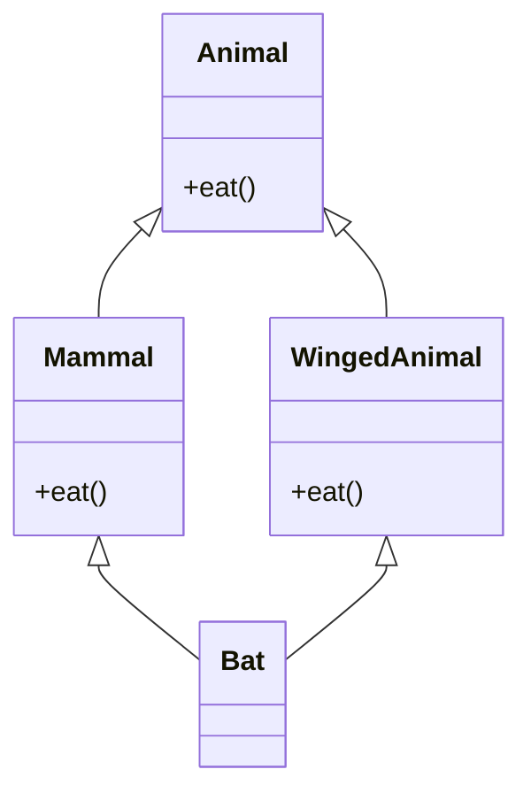
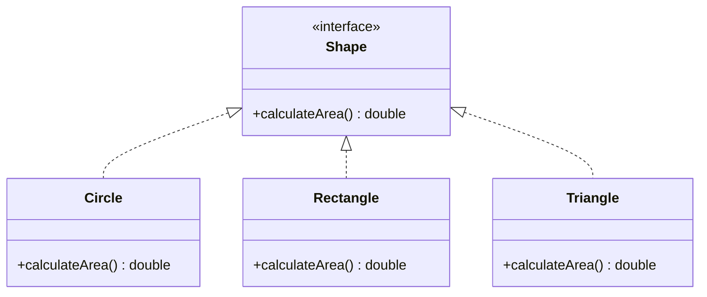
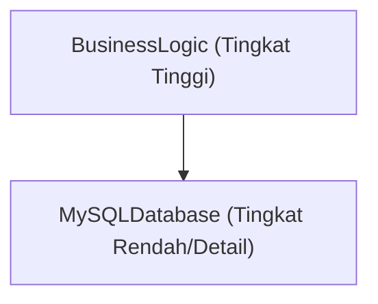
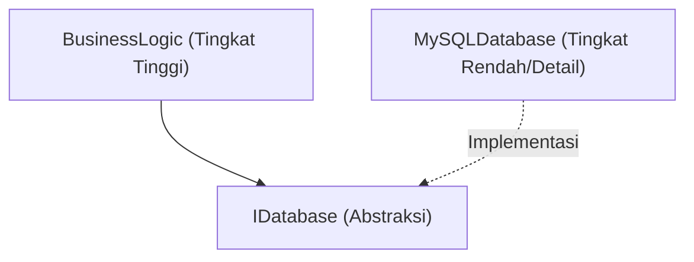

# Kedalaman Pemrograman Berorientasi Objek (OOP): Sejarah, 3 Elemen Utama, dan Prinsip SOLID

Dalam rekayasa perangkat lunak modern, Pemrograman Berorientasi Objek (Object-Oriented Programming, OOP) adalah salah satu paradigma yang paling luas digunakan dan paling penting. Dari skrip berskala kecil hingga sistem perusahaan yang mencapai jutaan baris kode, konsep OOP berakar di mana-mana.

Artikel ini tidak hanya memberikan pemahaman permukaan tentang OOP, tetapi juga membahas secara mendalam latar belakang sejarahnya, dasar-dasar tipe data matematis dan abstrak, 3 elemen utama (enkapsulasi, pewarisan, polimorfisme), serta **Prinsip SOLID** untuk membangun perangkat lunak yang tangguh dalam praktik nyata. Pembahasan ini akan dilengkapi dengan contoh kode yang spesifik, kasus tepi (edge cases), dan ilustrasi Mermaid.

---

## 1. Latar Belakang Sejarah dan Filosofi Berorientasi Objek

Konsep OOP tidak lahir dalam semalam. Asal-usulnya dapat ditelusuri kembali ke tahun 1960-an, berkembang sebagai pergeseran paradigma untuk menangani kompleksitas perangkat lunak.

### 1.1 Lahirnya Simula dan Smalltalk
Nenek moyang langsung dari pemrograman berorientasi objek adalah **Simula 67**, yang dikembangkan pada tahun 1960-an oleh Ole-Johan Dahl dan Kristen Nygaard di Pusat Komputasi Norwegia. Mereka memperkenalkan konsep "objek" dan "kelas" untuk memodelkan simulasi fisik yang kompleks, seperti pergerakan kapal.

Kemudian, pada tahun 1970-an, **Smalltalk** dikembangkan oleh Alan Kay dan rekan-rekannya di Pusat Penelitian Palo Alto (PARC) milik Xerox. Alan Kay adalah pencipta istilah "berorientasi objek", dan visinya adalah sebagai berikut:

> "I thought of objects being like biological cells and/or individual computers on a network, only able to communicate with messages." (Saya menganggap objek seperti sel biologis dan/atau komputer individu di dalam jaringan, yang hanya dapat berkomunikasi dengan pesan.)

OOP di Smalltalk tidak hanya terbatas pada integrasi data dan metode yang memanipulasinya, tetapi juga sangat menekankan pada **pengiriman pesan (message passing)**.

### 1.2 Penyebaran melalui C++ dan [Java](https://kenji.blog/id/p/programming-languages-history-paradigm-evolution/)
Memasuki tahun 1980-an, Bjarne Stroustrup mengembangkan **C++**, yang menambahkan fitur berorientasi objek dari Simula ke dalam bahasa C. Hal ini membuat OOP menjadi praktis dalam pemrograman sistem. Selanjutnya, pada tahun 1990-an, **Java** dikembangkan oleh James Gosling dan kawan-kawan dari Sun Microsystems, dan dengan slogan "Write Once, Run Anywhere", Java menjadi standar de facto untuk OOP dalam pengembangan tingkat perusahaan (enterprise).

### 1.3 Latar Belakang Formal dan Matematis: Tipe Data Abstrak (ADT)
Dasar dari OOP mencakup konsep **Tipe Data Abstrak (Abstract Data Type, ADT)** yang diajukan oleh Barbara Liskov dan rekan-rekannya. ADT mendefinisikan struktur data dan perilakunya (operasinya) secara matematis.

Misalnya, saat mendefinisikan sebuah tumpukan (stack) $ S $, secara matematis aksioma berikut berlaku:

$ \text{pop}(\text{push}(S, x)) = S $
$ \text{top}(\text{push}(S, x)) = x $

Kelas dalam OOP dapat dilihat sebagai perwujudan dari ADT ini sebagai sintaks dalam bahasa pemrograman. Objek adalah kapsul tunggal yang menggabungkan ruang keadaan (state space) $ X $ dan sekumpulan fungsi $ F $ yang mentransisikan keadaan tersebut.

---

## 2. 3 Elemen Utama Pemrograman Berorientasi Objek

Tiga konsep inti yang mendukung OOP secara luas dikenal sebagai "Enkapsulasi", "Pewarisan", dan "Polimorfisme" (sering kali disebut sebagai 4 elemen utama jika "Abstraksi" ditambahkan). Di sini kita akan mendalami esensi dari masing-masing elemen dan kasus tepi di dunia nyata.

### 2.1 Enkapsulasi (Encapsulation) dan Penyembunyian Informasi

Enkapsulasi melibatkan penggabungan data (atribut) dan metode yang memanipulasinya (perilaku) ke dalam satu kesatuan (kelas), serta prinsip **Penyembunyian Informasi (Information Hiding)** yang mencegah data dimanipulasi secara langsung dari luar.

#### Tujuan dan Keuntungan
- **Mempertahankan kondisi invarian (Invariant)**: Menjamin bahwa objek selalu berada dalam keadaan (state) yang valid.
- **Keterikatan yang rendah (Low coupling)**: Bahkan jika implementasi internal diubah, kode pengguna tidak akan terpengaruh selama antarmuka eksternalnya tetap sama.

#### Contoh Kode dan Penjelasan
Contoh buruk (kondisi invarian rusak):

```java
public class BankAccount {
    public double balance; // Dapat diakses secara langsung dari luar
}

// Sisi pengguna
BankAccount account = new BankAccount();
account.balance = -1000; // Saldo menjadi minus!
```

Contoh baik (perlindungan dengan enkapsulasi):

```java
public class BankAccount {
    private double balance;

    public BankAccount(double initialBalance) {
        if (initialBalance < 0) throw new IllegalArgumentException("Saldo awal harus 0 atau lebih.");
        this.balance = initialBalance;
    }

    public void deposit(double amount) {
        if (amount <= 0) throw new IllegalArgumentException("Jumlah setoran harus bernilai positif.");
        this.balance += amount;
    }

    public void withdraw(double amount) {
        if (amount <= 0 || this.balance < amount) throw new IllegalArgumentException("Penarikan tidak valid.");
        this.balance -= amount;
    }

    public double getBalance() {
        return this.balance;
    }
}
```

#### Kasus Tepi: Kerusakan akibat Refleksi
Dalam bahasa seperti [Java](https://kenji.blog/id/p/programming-languages-history-paradigm-evolution/) dan C#, dimungkinkan untuk secara paksa mengakses bidang `private` menggunakan fitur refleksi (reflection). Hal ini menimbulkan risiko rusaknya enkapsulasi, sehingga sistem yang mengutamakan keamanan memerlukan konfigurasi manajer keamanan (security manager) atau penguatan kontrol akses menggunakan sistem modul (sejak [Java](https://kenji.blog/id/p/programming-languages-history-paradigm-evolution/) 9).

### 2.2 Cahaya dan Bayangan dari Pewarisan (Inheritance)

Pewarisan adalah mekanisme di mana kelas baru (kelas anak, kelas turunan) mewarisi data dan perilaku dari kelas yang sudah ada (kelas induk, kelas dasar).

#### Tujuan
- **Penggunaan ulang kode**: Menghilangkan duplikasi dengan mengumpulkan logika umum di dalam kelas induk.
- **Merepresentasikan hubungan "is-a"**: Merepresentasikan klasifikasi domain seperti "Anjing adalah Hewan (Dog is an Animal)".

#### Pewarisan Ganda dan Masalah Berlian (Diamond Problem)
Beberapa bahasa seperti C++ mengizinkan **pewarisan ganda (multiple inheritance)**, di mana sebuah kelas dapat mewarisi dari lebih dari satu kelas induk, tetapi hal ini memiliki "Masalah Berlian" yang terkenal.



Masalahnya adalah ketika Bat memanggil metode `eat()`, akan menjadi ambigu implementasi mana yang harus dipanggil, Mammal atau WingedAnimal. [Java](https://kenji.blog/id/p/programming-languages-history-paradigm-evolution/) dan C# melarang pewarisan ganda untuk kelas dan menggunakan **antarmuka (interface)** untuk menghindari masalah ini.

#### Komposisi daripada Pewarisan (Composition over Inheritance)
Dalam OOP modern, hierarki pewarisan yang dalam cenderung dihindari. Alasannya adalah karena adanya **Masalah Kelas Dasar Rapuh (Fragile Base Class Problem)** di mana perubahan pada kelas induk akan berdampak pada semua kelas anak. Sebagai gantinya, **komposisi** lebih direkomendasikan, yaitu menyimpan objek lain sebagai bidang dan mendelegasikan pemrosesan kepada objek tersebut.

### 2.3 Polimorfisme (Polymorphism)

Polimorfisme adalah properti di mana "pesan yang sama (pemanggilan metode) dapat menghasilkan perilaku yang berbeda tergantung pada tipe objeknya".

#### Jenis
1. **Polimorfisme Ad-hoc (Overload)**: Metode yang berbeda akan dipanggil bergantung pada tipe dan jumlah argumen.
2. **Polimorfisme Parametrik (Generik)**: Menggunakan parameter tipe untuk menerapkan algoritma yang sama ke berbagai tipe sembarang.
3. **Polimorfisme Subtipe (Override)**: Menangani instance kelas anak menggunakan variabel referensi antarmuka atau kelas induk, yang diproses secara dinamis (dynamic dispatch) pada saat runtime.

#### Pengiriman Dinamis (Dynamic Dispatch / vtable)
Di C++ dan Java, polimorfisme subtipe diimplementasikan melalui mekanisme **tabel fungsi virtual (virtual function table / vtable)**. [Pointer](https://kenji.blog/id/p/c-language-pointers-memory-management-stack-heap/) ke vtable disimpan di awal area memori objek, dan akan menyelesaikan alamat fungsi yang akan dipanggil saat runtime. Oleh karena itu, terdapat sedikit penambahan beban (overhead).

```java
interface Shape {
    double calculateArea();
}

class Circle implements Shape {
    private double radius;
    public Circle(double r) { this.radius = r; }
    @Override
    public double calculateArea() { return Math.PI * radius * radius; }
}

class Rectangle implements Shape {
    private double w, h;
    public Rectangle(double w, double h) { this.w = w; this.h = h; }
    @Override
    public double calculateArea() { return w * h; }
}

// Menggunakan polimorfisme
List<Shape> shapes = Arrays.asList(new Circle(5), new Rectangle(4, 6));
for (Shape s : shapes) {
    // calculateArea() yang sesuai akan dipanggil saat runtime bergantung pada tipe aktual objek
    System.out.println(s.calculateArea()); 
}
```

---

## 3. Prinsip SOLID: Rahasia Desain Berorientasi Objek

Hanya dengan memahami elemen dasar OOP, sulit untuk membangun perangkat lunak yang sangat mudah dipelihara dan dapat diperluas. Oleh karena itu, lima prinsip desain yang dirangkum oleh Robert C. Martin (Uncle Bob), yaitu **Prinsip SOLID**, sangatlah penting.

### 3.1 Prinsip Tanggung Jawab Tunggal (Single Responsibility Principle: SRP)
**"Sebuah kelas hanya boleh memiliki satu alasan untuk berubah"**

Jika sebuah kelas memiliki lebih dari satu peran (tanggung jawab), risiko perubahan pada satu persyaratan yang memengaruhi fungsi lain yang tidak terkait menjadi lebih tinggi.

#### Anti-pola dan Solusi
Sebagai contoh, misalkan kelas `Report` memiliki tiga tanggung jawab: menghasilkan data, memformat pemrosesan, dan menyimpannya ke sebuah file.

```python
# Contoh buruk: Kelas yang memiliki 3 tanggung jawab
class Report:
    def __init__(self, data):
        self.data = data
        
    def generate_content(self):
        return f"Data: {self.data}"
        
    def format_as_pdf(self):
        # Logika kompleks untuk mengubah ke PDF
        pass
        
    def save_to_file(self, filename):
        with open(filename, 'w') as f:
            f.write(self.generate_content())
```

Pisahkan ini sesuai dengan SRP.

```python
# Contoh baik: Memisahkan tanggung jawab
class ReportData:
    def __init__(self, data):
        self.data = data

class ReportFormatter:
    def format_to_pdf(self, report_data):
        pass
    def format_to_html(self, report_data):
        pass

class ReportRepository:
    def save(self, content, filename):
        pass
```

### 3.2 Prinsip Terbuka-Tertutup (Open-Closed Principle: OCP)
**"Entitas perangkat lunak (kelas, modul, fungsi, dll.) harus terbuka untuk ekstensi, tetapi tertutup untuk modifikasi"**

Ini adalah prinsip bahwa kita harus mendesain sedemikian rupa sehingga kita dapat menambahkan fitur baru tanpa perlu memodifikasi kode yang sudah ada.

#### Abstraksi dengan Antarmuka (Interface)
Contoh penghitungan luas bentuk (Shape) sebelumnya dengan sempurna memenuhi OCP. Jika kita ingin menambahkan bentuk baru (misalnya `Triangle`), kita hanya perlu mengimplementasikan kelas baru tersebut tanpa memodifikasi antarmuka `Shape` yang sudah ada atau kode yang memprosesnya (bagian loop).



### 3.3 Prinsip Substitusi Liskov (Liskov Substitution Principle: LSP)
**"Tipe turunan harus dapat saling menggantikan dengan tipe dasarnya"**

Prinsip yang diajukan oleh Barbara Liskov ini menyatakan bahwa "kebenaran program tidak boleh rusak ketika sebuah kelas anak dioperasikan di tempat yang mengharapkan kelas induk".

#### Contoh Pelanggaran Terkenal: Masalah Persegi dan Persegi Panjang
Secara matematis, "Persegi adalah jenis Persegi Panjang", tetapi dalam pemrograman tidak selalu demikian.

```java
class Rectangle {
    protected int width;
    protected int height;
    
    public void setWidth(int width) { this.width = width; }
    public void setHeight(int height) { this.height = height; }
    public int getArea() { return width * height; }
}

class Square extends Rectangle {
    @Override
    public void setWidth(int width) {
        this.width = width;
        this.height = width; // Untuk mempertahankan batasan persegi
    }
    @Override
    public void setHeight(int height) {
        this.width = height;
        this.height = height;
    }
}

// Kode tes (Sisi pengguna)
void testRectangleArea(Rectangle r) {
    r.setWidth(5);
    r.setHeight(4);
    // Jika r adalah Rectangle seharusnya 20, tetapi jika Square diberikan maka menjadi 16, dan asersi gagal.
    assert r.getArea() == 20; 
}
```

Inti dari masalah ini adalah bahwa kelas `Square` melanggar kontrak awal (kondisi awal) dari kelas `Rectangle` yang berbunyi "lebar dan tinggi dapat diubah secara independen". Dari perspektif Desain Berdasarkan Kontrak (Design by Contract), LSP harus dipatuhi dengan ketat.

### 3.4 Prinsip Pemisahan Antarmuka (Interface Segregation Principle: ISP)
**"Klien tidak boleh dipaksa untuk bergantung pada metode yang tidak mereka gunakan"**

Antarmuka yang besar dan membengkak (Fat Interface) akan memaksa kelas yang mengimplementasikannya untuk mengimplementasikan metode yang tidak perlu.

#### Contoh Pelanggaran dan Perbaikan
```csharp
// Contoh buruk: Fat Interface
public interface IMachine {
    void Print(Document d);
    void Scan(Document d);
    void Fax(Document d);
}

// Printer sederhana tidak dapat memindai atau memfaks, tetapi dipaksa untuk mengimplementasikan metode
public class SimplePrinter : IMachine {
    public void Print(Document d) { /* Proses pencetakan */ }
    public void Scan(Document d) { throw new NotImplementedException(); }
    public void Fax(Document d) { throw new NotImplementedException(); }
}
```

Pisahkan antarmuka berdasarkan peran.

```csharp
// Contoh baik: Pemisahan antarmuka
public interface IPrinter {
    void Print(Document d);
}
public interface IScanner {
    void Scan(Document d);
}

public class SimplePrinter : IPrinter {
    public void Print(Document d) { /* Proses pencetakan */ }
}

public class MultiFunctionPrinter : IPrinter, IScanner {
    public void Print(Document d) { /* Proses pencetakan */ }
    public void Scan(Document d) { /* Proses pemindaian */ }
}
```

### 3.5 Prinsip Inversi Ketergantungan (Dependency Inversion Principle: DIP)
**"Modul tingkat tinggi tidak boleh bergantung pada modul tingkat rendah. Keduanya harus bergantung pada abstraksi. Selain itu, abstraksi tidak boleh bergantung pada detail, detail harus bergantung pada abstraksi"**

Prinsip ini merupakan kunci untuk menurunkan tingkat keterikatan (coupling) antar komponen dalam suatu sistem secara drastis.

#### Desain Tradisional (Pelanggaran DIP)
Logika bisnis tingkat tinggi bergantung langsung pada kelas akses data yang konkret di tingkat rendah.



#### Desain yang Menerapkan DIP
Dengan memasukkan abstraksi (antarmuka) di antaranya, kita membalikkan vektor ketergantungan.



```java
// Abstraksi (Antarmuka)
public interface UserRepository {
    void save(User user);
}

// Modul tingkat rendah (Detail)
public class MySQLUserRepository implements UserRepository {
    public void save(User user) {
        // Proses spesifik untuk menyimpan ke MySQL
    }
}

// Modul tingkat tinggi
public class UserService {
    private final UserRepository repository;
    
    // Injeksi Ketergantungan (Dependency Injection / DI) melalui injeksi konstruktor
    public UserService(UserRepository repository) {
        this.repository = repository;
    }
    
    public void registerUser(User user) {
        // ... Logika bisnis ...
        repository.save(user);
    }
}
```

Dengan mendesain seperti ini, ketika kita mengubah basis data dari MySQL menjadi PostgreSQL, atau menjadi in-memory DB untuk keperluan pengujian, kode `UserService` tidak perlu diubah sama sekali. Ini adalah pemikiran yang mendasari kerangka kerja **DI (Dependency Injection)** (seperti Spring, Guice, .NET DI, dll.).

---

## 4. Pertimbangan Matematis dan Metode Formal dalam OOP

Di sini, mari kita sertakan sedikit sudut pandang matematis tentang sistem tipe OOP. Hubungan turunan tipe (subtyping) sering dimodelkan menggunakan teori kategori atau teori kisi (lattice theory).

Kita menandakan bahwa tipe $ A $ adalah subtipe dari tipe $ B $ sebagai $ A <: B $. Ini membentuk hubungan urutan parsial (refleksif, transitif, antisimetris).

1. **Sifat Refleksif**: Untuk tipe $ A $ mana pun, $ A <: A $
2. **Sifat Transitif**: Jika $ A <: B $ dan $ B <: C $, maka $ A <: C $

Dalam subtyping fungsi, ada properti penting bahwa tipe nilai kembalian bersifat **Kovarian (Covariant)** dan tipe argumen bersifat **Kontravarian (Contravariant)**.

Dalam tipe fungsi $ f: P_1 \to R_1 $ dan $ g: P_2 \to R_2 $, kondisi agar $ f <: g $ (fungsi $ f $ dapat dengan aman digunakan menggantikan $ g $) adalah sebagai berikut:

$ P_2 <: P_1 \quad \text{dan} \quad R_1 <: R_2 $

Alasan mengapa argumen bersifat kontravarian (arahnya berlawanan) adalah hasil penerapan LSP (Prinsip Substitusi Liskov) di tingkat fungsi. Metode kelas anak harus menerima kondisi yang lebih longgar (tipe argumen yang lebih luas) dan mengembalikan kondisi yang lebih ketat (tipe nilai kembalian yang lebih sempit) daripada metode kelas induk.

---

## 5. Kesimpulan dan Masa Depan Berorientasi Objek

Artikel ini telah menjelaskan secara rinci tentang OOP mulai dari latar belakang sejarahnya, elemen dasar seperti enkapsulasi, pewarisan, dan polimorfisme, serta Prinsip SOLID yang sangat penting dalam pengembangan enterprise.

Dalam beberapa tahun terakhir, paradigma Pemrograman Fungsional ([Functional Programming](https://kenji.blog/id/p/functional-programming-concepts-pure-functions-monads/), FP) semakin populer, dan keuntungan dari Kekekalan (Immutability) serta Fungsi Murni (Pure Functions) sedang ditinjau ulang. Namun, OOP dan FP bukanlah dua hal yang saling bertentangan. Bahasa pemrograman modern (Scala, Kotlin, Rust, dan C# serta [Java](https://kenji.blog/id/p/programming-languages-history-paradigm-evolution/) saat ini) menggabungkan kedua paradigma tersebut, dan desain hibrida seperti "mengelola status (state) yang dienkapsulasi dengan kelas OOP, dan melakukan pipa konversi data menggunakan pendekatan FP" mulai menjadi arus utama.

Tidak ada "peluru perak" dalam desain perangkat lunak, tetapi pemahaman mendalam tentang OOP dan penerapan Prinsip SOLID akan menjadi senjata yang ampuh untuk membangun sistem yang dapat dipelihara dalam jangka panjang dan tahan terhadap perubahan.

---

**Referensi & Buku Rekomendasi:**
1. Erich Gamma, et al. *Design Patterns: Elements of Reusable Object-Oriented Software*. Addison-Wesley.
2. Robert C. Martin. *Clean Architecture: A Craftsman's Guide to Software Structure and Design*. Prentice Hall.
3. Bertrand Meyer. *Object-Oriented Software Construction*. Prentice Hall.
4. Barbara Liskov, Jeannette Wing. *A behavioral notion of subtyping*. ACM Transactions on [Programming Language](https://kenji.blog/id/p/programming-languages-history-paradigm-evolution/)s and Systems.
