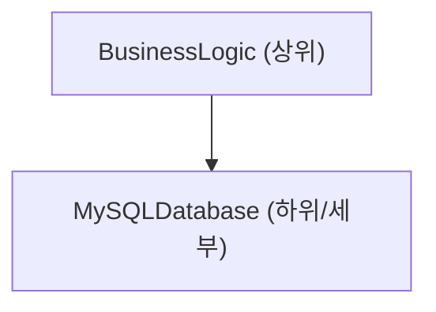
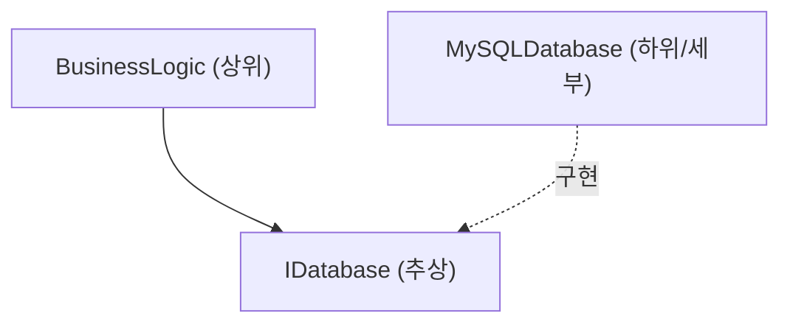

# 객체 지향 프로그래밍(OOP)의 심연: 역사, 3대 요소, 그리고 SOLID 원칙

현대 소프트웨어 공학에서 객체 지향 프로그래밍(Object-Oriented Programming, OOP)은 가장 널리 보급되고 또 가장 중요한 패러다임 중 하나입니다. 소규모 스크립트부터 수백만 줄에 달하는 엔터프라이즈 시스템에 이르기까지, OOP의 개념은 곳곳에 뿌리내리고 있습니다.

본 글에서는 OOP에 대한 단순한 표면적 이해에 머물지 않고, 그 역사적 배경, 수리적·추상적 데이터 타입의 기초, 3대 요소(캡슐화, 상속, 다형성)의 심층 탐구, 그리고 실무에서 견고한 소프트웨어를 구축하기 위한 **SOLID 원칙** 에 대해 구체적인 코드 예제와 엣지 케이스, 그리고 Mermaid 도해를 곁들여 철저하게 해설합니다.

---

## 1. 객체 지향의 역사적 배경과 철학

OOP의 개념은 하루아침에 생겨난 것이 아닙니다. 그 기원은 1960년대로 거슬러 올라가며, 소프트웨어의 복잡성에 대처하기 위한 패러다임 전환으로서 진화해 왔습니다.

### 1.1 Simula와 Smalltalk의 탄생
객체 지향의 직접적인 조상은 1960년대 노르웨이 컴퓨팅 센터의 Ole-Johan Dahl과 Kristen Nygaard가 개발한 **Simula 67** 입니다. 이들은 배의 움직임 등 복잡한 물리 시뮬레이션을 모델링하기 위해 '객체'와 '클래스'라는 개념을 도입했습니다.

이후 1970년대 제록스 팰로앨토 연구소(PARC)에서 앨런 케이(Alan Kay) 등이 **Smalltalk** 를 개발했습니다. 앨런 케이는 '객체 지향'이라는 단어의 창시자이며, 그의 비전은 다음과 같았습니다.

> "I thought of objects being like biological cells and/or individual computers on a network, only able to communicate with messages."(나는 객체를 메시지로만 통신할 수 있는 생물학적 세포나 네트워크상의 개별 컴퓨터와 같은 것이라고 생각했다.)

Smalltalk에서의 OOP는 데이터와 이를 조작하는 메서드의 통합에 그치지 않고, **메시징(메시지 패싱)** 에 중점을 두었습니다.

### 1.2 C++와 [Java](https://kenji.blog/ko/p/programming-languages-history-paradigm-evolution/)에 의한 보급
1980년대에 들어서면서 Bjarne Stroustrup이 C 언어에 Simula의 객체 지향 기능을 추가한 **C++** 를 개발했습니다. 이로 인해 시스템 프로그래밍에서 OOP가 실용화되었습니다. 나아가 1990년대에는 Sun Microsystems의 James Gosling 등이 **Java** 를 개발하여 "Write Once, Run Anywhere"라는 슬로건과 함께 엔터프라이즈 개발에서 OOP의 사실상 표준이 되었습니다.

### 1.3 형식적·수리적 배경: 추상 데이터 타입(ADT)
OOP의 기초에는 바버라 리스코프(Barbara Liskov) 등이 제창한 **추상 데이터 타입(Abstract Data Type, ADT)** 개념이 있습니다. ADT는 데이터 구조와 그 행위(조작)를 수학적으로 정의하는 것입니다.

예를 들어, 스택 $ S $ 를 정의할 경우 수학적으로 다음과 같은 공리가 성립합니다.

$ \text{pop}(\text{push}(S, x)) = S $
$ \text{top}(\text{push}(S, x)) = x $

OOP의 클래스는 이 ADT를 프로그래밍 언어의 구문으로 구현한 것으로 볼 수 있습니다. 상태 공간 $ X $ 와, 그 상태를 전이시키는 함수군 $ F $ 를 하나의 캡슐에 묶은 것이 객체입니다.

---

## 2. 객체 지향 프로그래밍의 3대 요소

OOP를 지탱하는 핵심 개념으로 '캡슐화', '상속', '다형성'의 세 가지가 널리 알려져 있습니다(종종 '추상화'를 더해 4대 요소라고도 부릅니다). 여기서는 각각의 본질과 실무에서의 엣지 케이스에 대해 깊이 파고듭니다.

### 2.1 캡슐화(Encapsulation)와 정보 은닉

캡슐화는 데이터(속성)와 이를 조작하는 메서드(행위)를 하나의 단위(클래스)로 묶는 것, 그리고 외부에서 직접 데이터를 조작할 수 없도록 하는 **정보 은닉(Information Hiding)** 의 원칙을 포함합니다.

#### 목적과 장점
- **불변 조건(Invariant)의 유지**: 객체가 항상 유효한 상태를 유지하도록 보장합니다.
- **결합도의 저하**: 내부 구현을 변경하더라도, 외부 인터페이스가 동일하다면 사용하는 측의 코드에 영향을 주지 않습니다.

#### 코드 예제와 해설
나쁜 예(불변 조건이 깨짐):

```java
public class BankAccount {
    public double balance; // 외부에서 직접 접근 가능
}

// 사용하는 측
BankAccount account = new BankAccount();
account.balance = -1000; // 잔액이 마이너스가 되어버림!
```

좋은 예(캡슐화에 의한 보호):

```java
public class BankAccount {
    private double balance;

    public BankAccount(double initialBalance) {
        if (initialBalance < 0) throw new IllegalArgumentException("초기 잔액은 0 이상이어야 합니다.");
        this.balance = initialBalance;
    }

    public void deposit(double amount) {
        if (amount <= 0) throw new IllegalArgumentException("입금액은 양수여야 합니다.");
        this.balance += amount;
    }

    public void withdraw(double amount) {
        if (amount <= 0 || this.balance < amount) throw new IllegalArgumentException("잘못된 출금입니다.");
        this.balance -= amount;
    }

    public double getBalance() {
        return this.balance;
    }
}
```

#### 엣지 케이스: 리플렉션에 의한 파괴
[Java](https://kenji.blog/ko/p/programming-languages-history-paradigm-evolution/)나 C# 같은 언어에서는 리플렉션 기능을 사용하여 강제로 `private` 필드에 접근하는 것이 가능합니다. 이로 인해 캡슐화가 깨질 위험이 있으므로 보안이 중시되는 시스템에서는 보안 관리자 설정이나 모듈 시스템([Java](https://kenji.blog/ko/p/programming-languages-history-paradigm-evolution/) 9 이후)을 통한 접근 제어 강화가 필요합니다.

### 2.2 상속(Inheritance)의 빛과 그림자

상속은 기존 클래스(부모 클래스, 기본 클래스)의 데이터와 행위를 새로운 클래스(자식 클래스, 파생 클래스)가 물려받는 메커니즘입니다.

#### 목적
- **코드의 재사용**: 공통 처리를 부모 클래스에 모음으로써 중복을 제거합니다.
- **'is-a' 관계의 표현**: '개는 동물이다(Dog is an Animal)'와 같은 도메인의 분류를 표현합니다.

#### 다중 상속과 다이아몬드 문제(Diamond Problem)
C++ 등 일부 언어에서는 여러 부모 클래스로부터 상속받는 **다중 상속** 이 허용되지만, 여기에는 유명한 '다이아몬드 문제'가 존재합니다.

```mermaid
classDiagram
    class "Animal" {
        +eat()
    }
    class "Mammal" {
        +eat()
    }
    class "WingedAnimal" {
        +eat()
    }
    class "Bat" {
    }
    
    "Animal" <|-- "Mammal"
    "Animal" <|-- "WingedAnimal"
    "Mammal" <|-- "Bat"
    "WingedAnimal" <|-- "Bat"
```

Bat가 `eat()` 메서드를 호출했을 때, Mammal과 WingedAnimal 중 어느 구현을 호출해야 할지 모호해진다는 문제입니다. [Java](https://kenji.blog/ko/p/programming-languages-history-paradigm-evolution/)나 C#에서는 클래스의 다중 상속을 금지하고 **인터페이스** 를 사용함으로써 이 문제를 회피하고 있습니다.

#### 상속보다는 위임(Composition over Inheritance)
현대의 OOP에서는 깊은 상속 트리는 기피되는 경향이 있습니다. 부모 클래스의 변경이 모든 자식 클래스에 파급되는 **깨지기 쉬운 기본 클래스 문제(Fragile Base Class Problem)** 가 있기 때문입니다. 대신 다른 객체를 필드로 유지하고 처리를 위임하는 **컴포지션** 이 권장됩니다.

### 2.3 다형성(Polymorphism)

다형성은 '동일한 메시지(메서드 호출)에 대해 객체의 타입에 따라 다르게 동작한다'는 성질입니다.

#### 종류
1. **애드혹 다형성(오버로딩)**: 인수의 타입이나 개수에 따라 다른 메서드가 호출된다.
2. **매개변수적 다형성(제네릭)**: 타입 매개변수를 사용하여 임의의 타입에 대해 동일한 알고리즘을 적용한다.
3. **서브타이핑 다형성(오버라이딩)**: 인터페이스나 부모 클래스의 참조 변수로 자식 클래스의 인스턴스를 다루며, 실행 시 동적으로 디스패치된다.

#### 동적 디스패치(vtable)
C++나 Java 등에서는 서브타이핑 다형성이 **가상 함수 테이블(vtable)** 이라는 메커니즘으로 구현되어 있습니다. 객체의 메모리 영역 맨 앞에는 vtable에 대한 포인터가 저장되어 있어, 실행 시 호출해야 할 함수 주소를 해결합니다. 이로 인해 약간의 오버헤드가 발생합니다.

```java
interface Shape {
    double calculateArea();
}

class Circle implements Shape {
    private double radius;
    public Circle(double r) { this.radius = r; }
    @Override
    public double calculateArea() { return Math.PI * radius * radius; }
}

class Rectangle implements Shape {
    private double w, h;
    public Rectangle(double w, double h) { this.w = w; this.h = h; }
    @Override
    public double calculateArea() { return w * h; }
}

// 다형성의 이용
List<Shape> shapes = Arrays.asList(new Circle(5), new Rectangle(4, 6));
for (Shape s : shapes) {
    // 실행 시 객체의 실제 타입에 따라 적절한 calculateArea() 가 호출됨
    System.out.println(s.calculateArea()); 
}
```

---

## 3. SOLID 원칙: 객체 지향 설계의 극의

OOP의 기본 요소를 이해하는 것만으로는 유지보수성이 높고 확장성 있는 소프트웨어를 만들기 어렵습니다. 그래서 로버트 C. 마틴(Uncle Bob)이 정리한 5가지 설계 원칙, **SOLID 원칙** 이 중요해집니다.

### 3.1 단일 책임 원칙(Single Responsibility Principle: SRP)
**"클래스는 변경해야 할 이유가 단 하나여야 한다"**

하나의 클래스가 여러 역할(책임)을 가지고 있으면, 특정 요구사항의 변경이 전혀 무관한 다른 기능에 영향을 미칠 위험이 커집니다.

#### 안티 패턴과 개선책
예를 들어 `Report` 클래스가 데이터 생성, 포맷 처리, 그리고 파일 저장이라는 3가지 책임을 가지고 있다고 가정해 봅시다.

```python
# 나쁜 예: 3가지 책임을 가진 클래스
class Report:
    def __init__(self, data):
        self.data = data
        
    def generate_content(self):
        return f"Data: {self.data}"
        
    def format_as_pdf(self):
        # PDF 변환의 복잡한 로직
        pass
        
    def save_to_file(self, filename):
        with open(filename, 'w') as f:
            f.write(self.generate_content())
```

이를 SRP에 따라 분할합니다.

```python
# 좋은 예: 책임 분리
class ReportData:
    def __init__(self, data):
        self.data = data

class ReportFormatter:
    def format_to_pdf(self, report_data):
        pass
    def format_to_html(self, report_data):
        pass

class ReportRepository:
    def save(self, content, filename):
        pass
```

### 3.2 개방-폐쇄 원칙(Open-Closed Principle: OCP)
**"소프트웨어의 구성 요소(클래스, 모듈, 함수 등)는 확장에 대해서는 열려(Open) 있어야 하고, 수정에 대해서는 닫혀(Closed) 있어야 한다"**

기존 코드를 수정하지 않고도 새로운 기능을 추가할 수 있도록 설계해야 한다는 원칙입니다.

#### 인터페이스를 통한 추상화
앞서 살펴본 도형(Shape)의 면적 계산 예는 바로 OCP를 만족합니다. 새로운 도형(예: `Triangle`)을 추가하고 싶을 경우, 기존의 `Shape` 인터페이스나 이를 처리하는 측의 코드(루프 부분)를 전혀 변경하지 않고 새로운 클래스를 구현하기만 하면 됩니다.

```mermaid
classDiagram
    class "Shape" {
        <<interface>>
        +calculateArea() double
    }
    class "Circle" {
        +calculateArea() double
    }
    class "Rectangle" {
        +calculateArea() double
    }
    class "Triangle" {
        +calculateArea() double
    }
    
    "Shape" <|.. "Circle"
    "Shape" <|.. "Rectangle"
    "Shape" <|.. "Triangle"
```

### 3.3 리스코프 치환 원칙(Liskov Substitution Principle: LSP)
**"파생 타입은 기본 타입으로 치환 가능해야 한다"**

바버라 리스코프가 제창한 이 원칙은 '부모 클래스를 기대하는 곳에 자식 클래스를 전달해도 프로그램의 정당성이 깨져서는 안 된다'는 것입니다.

#### 유명한 위반 예: 정사각형과 직사각형의 문제
수학적으로는 '정사각형은 직사각형의 일종'이지만 프로그래밍에서는 반드시 그렇지는 않습니다.

```java
class Rectangle {
    protected int width;
    protected int height;
    
    public void setWidth(int width) { this.width = width; }
    public void setHeight(int height) { this.height = height; }
    public int getArea() { return width * height; }
}

class Square extends Rectangle {
    @Override
    public void setWidth(int width) {
        this.width = width;
        this.height = width; // 정사각형의 제약을 유지하기 위해
    }
    @Override
    public void setHeight(int height) {
        this.width = height;
        this.height = height;
    }
}

// 테스트 코드(사용하는 측)
void testRectangleArea(Rectangle r) {
    r.setWidth(5);
    r.setHeight(4);
    // r 이 Rectangle 이라면 20 이 되어야 하지만, Square 가 전달되면 16 이 되어 어설션이 실패한다.
    assert r.getArea() == 20; 
}
```

이 문제의 본질은 `Square` 클래스가 `Rectangle` 클래스의 '너비와 높이는 독립적으로 변경할 수 있다'는 사전 계약(사전 조건)을 깨뜨렸다는 점에 있습니다. 계약에 의한 설계(Design by Contract) 관점에서 LSP는 엄격하게 지켜야 합니다.

### 3.4 인터페이스 분리 원칙(Interface Segregation Principle: ISP)
**"클라이언트에게 자신이 사용하지 않는 메서드에 대한 의존을 강요해서는 안 된다"**

거대하고 비대해진 인터페이스(Fat Interface)는 이를 구현하는 클래스에 불필요한 메서드의 구현을 강요합니다.

#### 위반 예와 개선
```csharp
// 나쁜 예: 팻 인터페이스
public interface IMachine {
    void Print(Document d);
    void Scan(Document d);
    void Fax(Document d);
}

// 단순한 프린터는 스캔도 팩스도 불가능하지만 메서드의 구현을 강요받음
public class SimplePrinter : IMachine {
    public void Print(Document d) { /* 인쇄 처리 */ }
    public void Scan(Document d) { throw new NotImplementedException(); }
    public void Fax(Document d) { throw new NotImplementedException(); }
}
```

인터페이스를 역할별로 세밀하게 분리합니다.

```csharp
// 좋은 예: 인터페이스의 분리
public interface IPrinter {
    void Print(Document d);
}
public interface IScanner {
    void Scan(Document d);
}

public class SimplePrinter : IPrinter {
    public void Print(Document d) { /* 인쇄 처리 */ }
}

public class MultiFunctionPrinter : IPrinter, IScanner {
    public void Print(Document d) { /* 인쇄 처리 */ }
    public void Scan(Document d) { /* 스캔 처리 */ }
}
```

### 3.5 의존성 역전 원칙(Dependency Inversion Principle: DIP)
**"상위 수준의 모듈은 하위 수준의 모듈에 의존해서는 안 된다. 양쪽 모두 추상화에 의존해야 한다. 또한 추상화는 세부 사항에 의존해서는 안 되며, 세부 사항은 추상화에 의존해야 한다"**

이 원칙은 시스템 컴포넌트 간의 결합도를 극적으로 낮추는 열쇠가 됩니다.

#### 기존의 설계(DIP 위반)
상위 비즈니스 로직이 하위의 구체적인 데이터 액세스 클래스에 직접 의존하고 있는 상태.



#### DIP를 적용한 설계
사이에 추상화(인터페이스)를 끼워 넣어 의존 관계의 벡터를 역전시킵니다.



```java
// 추상(인터페이스)
public interface UserRepository {
    void save(User user);
}

// 하위 모듈(세부)
public class MySQLUserRepository implements UserRepository {
    public void save(User user) {
        // MySQL에 저장하는 구체적인 처리
    }
}

// 상위 모듈
public class UserService {
    private final UserRepository repository;
    
    // 생성자 주입을 통한 의존성 주입(DI)
    public UserService(UserRepository repository) {
        this.repository = repository;
    }
    
    public void registerUser(User user) {
        // ... 비즈니스 로직 ...
        repository.save(user);
    }
}
```

이렇게 설계함으로써 데이터베이스를 MySQL에서 PostgreSQL이나 테스트용 인메모리 DB로 변경할 때도 `UserService` 의 코드는 전혀 변경할 필요가 없습니다. 이것이 **DI(Dependency Injection) 프레임워크** (Spring, Guice, .NET DI 등)의 기초가 되는 사고방식입니다.

---

## 4. OOP의 수학적 고찰과 형식 기법

여기서 OOP의 타입 시스템에 대해 약간의 수학적인 관점을 도입해 봅시다. 타입의 파생 관계(서브타이핑)는 종종 범주론이나 격자론을 사용하여 모델링됩니다.

타입 $ A $ 가 타입 $ B $ 의 서브타입인 것을 $ A <: B $ 라고 표기합니다. 이는 반순서 관계(반사적, 추이적, 반대칭적)를 형성합니다.

1. **반사율**: 임의의 타입 $ A $ 에 대해, $ A <: A $
2. **추이율**: $ A <: B $ 이고 $ B <: C $ 이면, $ A <: C $

함수의 서브타이핑에서 반환값의 타입은 **공변(Covariant)** 이며, 인수의 타입은 **반변(Contravariant)** 이라는 중요한 성질이 있습니다.

함수형 $ f: P_1 \to R_1 $ 과 $ g: P_2 \to R_2 $ 에서 $ f <: g $ (함수 $ f $ 를 $ g $ 대신 안전하게 사용할 수 있음)가 되는 조건은 다음과 같습니다.

$ P_2 <: P_1 \quad \text{그리고} \quad R_1 <: R_2 $

인수가 반변(방향이 역)이 되는 이유는 LSP(리스코프 치환 원칙)를 함수 수준에서 적용한 결과입니다. 자식 클래스의 메서드는 부모 클래스의 메서드보다 느슨한 조건(더 넓은 타입의 인수)을 받아들이고, 더 엄격한 조건(더 좁은 타입의 반환값)을 반환해야 합니다.

---

## 5. 정리 및 앞으로의 객체 지향

본 글에서는 OOP의 역사적 배경부터 시작해 캡슐화·상속·다형성 같은 기본 요소, 그리고 엔터프라이즈 개발에 불가결한 SOLID 원칙에 대해 상세히 해설했습니다.

최근에는 함수형 프로그래밍(FP)의 패러다임이 대두되면서 불변성(Immutability)이나 순수 함수(Pure Functions)의 장점이 재조명받고 있습니다. 그러나 OOP와 FP는 대립하는 것이 아닙니다. 현대 언어(Scala, Kotlin, [Rust](https://kenji.blog/ko/p/programming-languages-history-paradigm-evolution/), 최근의 C#이나 [Java](https://kenji.blog/ko/p/programming-languages-history-paradigm-evolution/))는 양쪽 패러다임을 융합시켜 '상태 관리는 OOP의 클래스로 캡슐화하고, 데이터 변환 파이프라인은 FP의 접근 방식으로 수행한다'와 같은 하이브리드 설계가 주류가 되어가고 있습니다.

소프트웨어 설계에 '은탄환'은 없지만, OOP에 대한 깊은 이해와 SOLID 원칙의 적용은 장기적으로 유지보수 가능하고 변화에 강한 시스템을 구축하기 위한 강력한 무기가 될 것입니다.

---

**참고 문헌 및 추천 도서:**
1. Erich Gamma, et al. *Design Patterns: Elements of Reusable Object-Oriented Software*. Addison-Wesley.
2. Robert C. Martin. *Clean Architecture: A Craftsman's Guide to Software Structure and Design*. Prentice Hall.
3. Bertrand Meyer. *Object-Oriented Software Construction*. Prentice Hall.
4. Barbara Liskov, Jeannette Wing. *A behavioral notion of subtyping*. ACM Transactions on [Programming Language](https://kenji.blog/ko/p/programming-languages-history-paradigm-evolution/)s and Systems.
