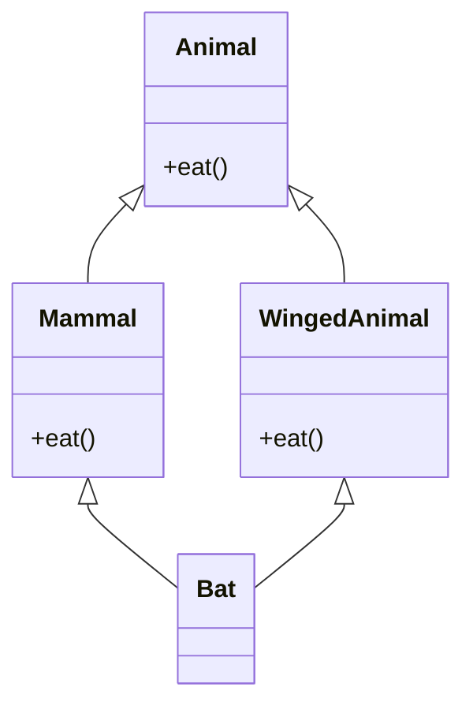
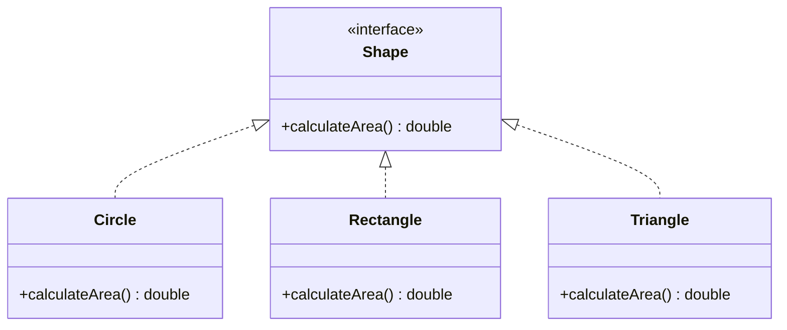
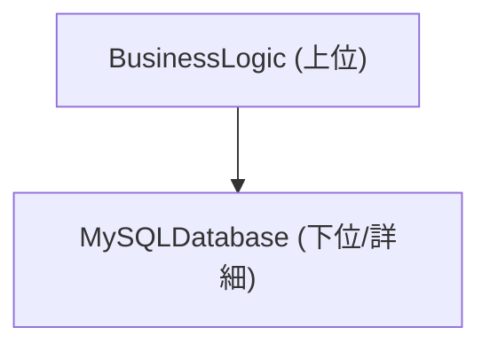
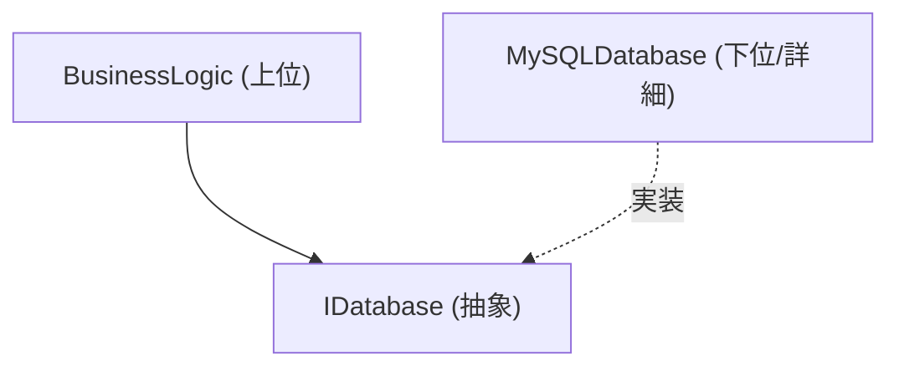

# オブジェクト指向プログラミング（OOP）の深淵：歴史、3大要素、そしてSOLID原則

現代のソフトウェア工学において、オブジェクト指向プログラミング（Object-Oriented Programming, OOP）は最も普及し、かつ最も重要なパラダイムの一つです。小規模なスクリプトから、数百万行に及ぶエンタープライズシステムに至るまで、OOPの概念は至る所に根付いています。

本記事では、OOPの単なる表面的な理解にとどまらず、その歴史的背景、数理的・抽象的データ型の基礎、3大要素（カプセル化、継承、ポリモーフィズム）の深堀り、そして実務において堅牢なソフトウェアを構築するための **SOLID原則** について、具体的なコード例やエッジケース、そしてMermaid図解を交えながら徹底的に解説します。

---

## 1. オブジェクト指向の歴史的背景と哲学

OOPの概念は一夜にして生まれたわけではありません。その起源は1960年代に遡り、ソフトウェアの複雑性に対処するためのパラダイムシフトとして進化してきました。

### 1.1 SimulaとSmalltalkの誕生
オブジェクト指向の直接の祖先は、1960年代にノルウェー計算センターのOle-Johan DahlとKristen Nygaardによって開発された **Simula 67** です。彼らは、船の動きなどの複雑な物理シミュレーションをモデル化するために、「オブジェクト」と「クラス」という概念を導入しました。

その後、1970年代にゼロックスのパロアルト研究所（PARC）でアラン・ケイ（Alan Kay）らによって **Smalltalk** が開発されました。アラン・ケイは「オブジェクト指向」という言葉の生みの親であり、彼のビジョンは次のようなものでした。

> "I thought of objects being like biological cells and/or individual computers on a network, only able to communicate with messages."（私はオブジェクトを、メッセージでのみ通信できる生物学的な細胞やネットワーク上の個々のコンピュータのようなものだと考えていた。）

SmalltalkにおけるOOPは、データとそれを操作するメソッドの統合にとどまらず、**メッセージング（メッセージパッシング）** に重きを置いていました。

### 1.2 C++と[Java](https://kenji.blog/p/programming-languages-history-paradigm-evolution/)による普及
1980年代に入ると、Bjarne Stroustrupが[C言語](https://kenji.blog/p/c-language-pointers-memory-management-stack-heap/)にSimulaのオブジェクト指向機能を追加した **C++** を開発しました。これにより、システムプログラミングにおいてOOPが実用化されました。さらに1990年代には、Sun MicrosystemsのJames Goslingらによって **Java** が開発され、「Write Once, Run Anywhere」のスローガンとともに、エンタープライズ開発におけるOOPのデファクトスタンダードとなりました。

### 1.3 形式的・数理的背景：抽象データ型（ADT）
OOPの基礎には、バーバラ・リスコフ（Barbara Liskov）らが提唱した **抽象データ型（Abstract Data Type, ADT）** の概念があります。ADTは、データ構造とその振る舞い（操作）を数学的に定義するものです。

例えば、[スタック](https://kenji.blog/p/c-language-pointers-memory-management-stack-heap/) $ S $ を定義する場合、数学的には以下のような公理が成り立ちます。

$$ \text{pop}(\text{push}(S, x)) = S $$
$$ \text{top}(\text{push}(S, x)) = x $$

OOPのクラスは、このADTをプログラム言語の構文として具現化したものと捉えることができます。状態空間 $ X $ と、その状態を遷移させる関数群 $ F $ を一つのカプセルにまとめたものがオブジェクトです。

---

## 2. オブジェクト指向プログラミングの3大要素

OOPを支える中核的な概念として、「カプセル化」「継承」「ポリモーフィズム」の3つが広く知られています（しばしば「抽象化」を加えて4大要素とも呼ばれます）。ここではそれぞれの本質と、実務でのエッジケースについて深く掘り下げます。

### 2.1 カプセル化（Encapsulation）と情報隠蔽

カプセル化は、データ（属性）とそれを操作するメソッド（振る舞い）を一つの単位（クラス）にまとめること、そして外部から直接データを操作できないようにする **情報隠蔽（Information Hiding）** の原則を含みます。

#### 目的とメリット
- **不変条件（Invariant）の維持**: オブジェクトが常に有効な状態を保つことを保証します。
- **結合度の低下**: 内部実装を変更しても、外部インターフェースが同じであれば、利用側のコードに影響を与えません。

#### コード例と解説
悪い例（不変条件が壊れる）：

```java
public class BankAccount {
    public double balance; // 外部から直接アクセス可能
}

// 利用側
BankAccount account = new BankAccount();
account.balance = -1000; // 残高がマイナスになってしまう！
```

良い例（カプセル化による保護）：

```java
public class BankAccount {
    private double balance;

    public BankAccount(double initialBalance) {
        if (initialBalance < 0) throw new IllegalArgumentException("初期残高は0以上である必要があります。");
        this.balance = initialBalance;
    }

    public void deposit(double amount) {
        if (amount <= 0) throw new IllegalArgumentException("入金額は正の値である必要があります。");
        this.balance += amount;
    }

    public void withdraw(double amount) {
        if (amount <= 0 || this.balance < amount) throw new IllegalArgumentException("不正な引き出しです。");
        this.balance -= amount;
    }

    public double getBalance() {
        return this.balance;
    }
}
```

#### エッジケース：リフレクションによる破壊
[Java](https://kenji.blog/p/programming-languages-history-paradigm-evolution/)やC#などの言語では、リフレクション機能を用いることで、強制的に `private` フィールドにアクセスすることが可能です。これによりカプセル化が破られるリスクがあるため、セキュリティが重視されるシステムではセキュリティマネージャの設定や、モジュールシステム（[Java](https://kenji.blog/p/programming-languages-history-paradigm-evolution/) 9以降）によるアクセス制御の強化が必要です。

### 2.2 継承（Inheritance）の光と影

継承は、既存のクラス（親クラス、基底クラス）のデータと振る舞いを新しいクラス（子クラス、派生クラス）が引き継ぐメカニズムです。

#### 目的
- **コードの再利用**: 共通の処理を親クラスにまとめることで、重複を排除します。
- **「is-a」関係の表現**: 「犬は動物である（Dog is an Animal）」といったドメインの分類を表現します。

#### 多重継承と菱形問題（Diamond Problem）
C++などの一部の言語では、複数の親クラスから継承する **多重継承** が許可されていますが、これには有名な「菱形問題」が存在します。



Batが `eat()` メソッドを呼び出した時、MammalとWingedAnimalのどちらの実装を呼び出すべきか曖昧になるという問題です。[Java](https://kenji.blog/p/programming-languages-history-paradigm-evolution/)やC#ではクラスの多重継承を禁止し、**インターフェース** を用いることでこの問題を回避しています。

#### 継承より委譲（Composition over Inheritance）
現代のOOPでは、深い継承ツリーは避けられる傾向にあります。親クラスの変更がすべての子クラスに波及する **壊れやすい基底クラス問題（Fragile Base Class Problem）** があるためです。代わりに、他のオブジェクトをフィールドとして保持し、処理を委譲する **コンポジション** が推奨されます。

### 2.3 ポリモーフィズム（Polymorphism：多態性）

ポリモーフィズムは、「同じメッセージ（メソッド呼び出し）に対して、オブジェクトの型によって異なる振る舞いをする」という性質です。

#### 種類
1. **アドホック多相（オーバーロード）**: 引数の型や数によって異なるメソッドが呼ばれる。
2. **パラメトリック多相（ジェネリクス）**: 型パラメータを用いて、任意の型に対して同じアルゴリズムを適用する。
3. **サブタイピング多相（オーバーライド）**: インターフェースや親クラスの参照変数で子クラスのインスタンスを扱い、実行時に動的にディスパッチされる。

#### 動的ディスパッチ（vtable）
C++やJavaなどでは、サブタイピング多相は **仮想関数テーブル（vtable）** という仕組みで実現されています。オブジェクトのメモリ領域の先頭にはvtableへの[ポインタ](https://kenji.blog/p/c-language-pointers-memory-management-stack-heap/)が格納されており、実行時に呼び出すべき関数[アドレス](https://kenji.blog/p/c-language-pointers-memory-management-stack-heap/)を解決します。このため、わずかなオーバーヘッドが生じます。

```java
interface Shape {
    double calculateArea();
}

class Circle implements Shape {
    private double radius;
    public Circle(double r) { this.radius = r; }
    @Override
    public double calculateArea() { return Math.PI * radius * radius; }
}

class Rectangle implements Shape {
    private double w, h;
    public Rectangle(double w, double h) { this.w = w; this.h = h; }
    @Override
    public double calculateArea() { return w * h; }
}

// ポリモーフィズムの利用
List<Shape> shapes = Arrays.asList(new Circle(5), new Rectangle(4, 6));
for (Shape s : shapes) {
    // 実行時にオブジェクトの実際の型に応じて適切な calculateArea() が呼ばれる
    System.out.println(s.calculateArea()); 
}
```

---

## 3. SOLID原則：オブジェクト指向設計の極意

OOPの基本要素を理解しただけでは、保守性が高く拡張性のあるソフトウェアを作ることは困難です。そこで、ロバート・C・マーティン（Uncle Bob）によってまとめられた5つの設計原則、**SOLID原則** が重要になります。

### 3.1 単一責任の原則（Single Responsibility Principle: SRP）
**「クラスは変更する理由が1つでなければならない」**

一つのクラスが複数の役割（責任）を持っていると、ある要件の変更が別の無関係な機能に影響を及ぼすリスクが高まります。

#### アンチパターンと改善策
例えば、`Report` クラスがデータの生成、フォーマット処理、そしてファイルへの保存という3つの責任を持っているとします。

```python
# 悪い例：3つの責任を持つクラス
class Report:
    def __init__(self, data):
        self.data = data
        
    def generate_content(self):
        return f"Data: {self.data}"
        
    def format_as_pdf(self):
        # PDF化の複雑なロジック
        pass
        
    def save_to_file(self, filename):
        with open(filename, 'w') as f:
            f.write(self.generate_content())
```

これをSRPに従って分割します。

```python
# 良い例：責任を分離
class ReportData:
    def __init__(self, data):
        self.data = data

class ReportFormatter:
    def format_to_pdf(self, report_data):
        pass
    def format_to_html(self, report_data):
        pass

class ReportRepository:
    def save(self, content, filename):
        pass
```

### 3.2 オープン・クロースドの原則（Open-Closed Principle: OCP）
**「ソフトウェアの構成要素（クラス、モジュール、関数など）は、拡張に対して開いて（Open）おり、修正に対して閉じて（Closed）いなければならない」**

既存のコードを書き換えることなく、新しい機能を追加できるように設計すべきだという原則です。

#### インターフェースによる抽象化
先ほどの図形（Shape）の面積計算の例は、まさにOCPを満たしています。新しい図形（例えば `Triangle`）を追加したい場合、既存の `Shape` インターフェースや、それを処理する側のコード（ループ部分）を一切変更することなく、新しいクラスを実装するだけで済みます。



### 3.3 リスコフの置換原則（Liskov Substitution Principle: LSP）
**「派生型はその基本型と置換可能でなければならない」**

バーバラ・リスコフによって提唱されたこの原則は、「親クラスを期待している箇所に子クラスを渡しても、プログラムの正当性が壊れてはならない」というものです。

#### 有名な違反例：正方形と長方形の問題
数学的には「正方形は長方形の一種」ですが、プログラミングにおいては必ずしもそうではありません。

```java
class Rectangle {
    protected int width;
    protected int height;
    
    public void setWidth(int width) { this.width = width; }
    public void setHeight(int height) { this.height = height; }
    public int getArea() { return width * height; }
}

class Square extends Rectangle {
    @Override
    public void setWidth(int width) {
        this.width = width;
        this.height = width; // 正方形の制約を維持するため
    }
    @Override
    public void setHeight(int height) {
        this.width = height;
        this.height = height;
    }
}

// テストコード（利用側）
void testRectangleArea(Rectangle r) {
    r.setWidth(5);
    r.setHeight(4);
    // r が Rectangle なら 20 になるはずだが、Square が渡されると 16 になってしまい、アサーションが失敗する。
    assert r.getArea() == 20; 
}
```

この問題の本質は、`Square` クラスが `Rectangle` クラスの「幅と高さは独立して変更できる」という事前の契約（事前条件）を破っている点にあります。契約による設計（Design by Contract）の観点から、LSPは厳格に守る必要があります。

### 3.4 インターフェース分離の原則（Interface Segregation Principle: ISP）
**「クライアントに、使用しないメソッドへの依存を強制してはならない」**

巨大で肥大化したインターフェース（Fat Interface）は、それを実装するクラスに不要なメソッドの実装を強要します。

#### 違反例と改善
```csharp
// 悪い例：ファットインターフェース
public interface IMachine {
    void Print(Document d);
    void Scan(Document d);
    void Fax(Document d);
}

// 単純なプリンターはスキャンもFAXもできないのに、メソッドの実装を強要される
public class SimplePrinter : IMachine {
    public void Print(Document d) { /* 印刷処理 */ }
    public void Scan(Document d) { throw new NotImplementedException(); }
    public void Fax(Document d) { throw new NotImplementedException(); }
}
```

インターフェースを役割ごとに細かく分離します。

```csharp
// 良い例：インターフェースの分離
public interface IPrinter {
    void Print(Document d);
}
public interface IScanner {
    void Scan(Document d);
}

public class SimplePrinter : IPrinter {
    public void Print(Document d) { /* 印刷処理 */ }
}

public class MultiFunctionPrinter : IPrinter, IScanner {
    public void Print(Document d) { /* 印刷処理 */ }
    public void Scan(Document d) { /* スキャン処理 */ }
}
```

### 3.5 依存性逆転の原則（Dependency Inversion Principle: DIP）
**「上位レベルのモジュールは下位レベルのモジュールに依存してはならない。両者は抽象に依存すべきである。また、抽象は詳細に依存してはならず、詳細は抽象に依存すべきである」**

この原則は、システムのコンポーネント間の結合度を劇的に下げるための鍵となります。

#### 従来の設計（DIP違反）
上位のビジネスロジックが、下位の具体的なデータアクセスクラスに直接依存している状態。



#### DIPを適用した設計
間に抽象（インターフェース）を挟むことで、依存関係のベクトルを逆転させます。



```java
// 抽象（インターフェース）
public interface UserRepository {
    void save(User user);
}

// 下位モジュール（詳細）
public class MySQLUserRepository implements UserRepository {
    public void save(User user) {
        // MySQLに保存する具体的な処理
    }
}

// 上位モジュール
public class UserService {
    private final UserRepository repository;
    
    // コンストラクタ・インジェクションによる依存性の注入（DI）
    public UserService(UserRepository repository) {
        this.repository = repository;
    }
    
    public void registerUser(User user) {
        // ... ビジネスロジック ...
        repository.save(user);
    }
}
```

このように設計することで、データベースをMySQLからPostgreSQLや、テスト用のインメモリDBに変更する際も、`UserService` のコードは一切変更する必要がありません。これが **DI（Dependency Injection）フレームワーク**（Spring, Guice, .NET DIなど）の基礎となる考え方です。

---

## 4. OOPの数学的考察と形式手法

ここで、OOPの型システムについて少し数学的な視点を取り入れてみましょう。型の派生関係（サブタイピング）は、しばしば圏論や束論を用いてモデル化されます。

型 $ A $ が型 $ B $ のサブタイプであることを $ A <: B $ と表記します。これは半順序関係（反射的、推移的、反対称的）を形成します。

1. **反射律**: 任意の型 $ A $ に対して、$ A <: A $
2. **推移律**: $ A <: B $ かつ $ B <: C $ ならば、$ A <: C $

関数のサブタイピングにおいて、戻り値の型は **共変（Covariant）** であり、引数の型は **反変（Contravariant）** であるという重要な性質があります。

関数型 $ f: P_1 \to R_1 $ と $ g: P_2 \to R_2 $ において、$ f <: g $ （関数 $ f $ を $ g $ の代わりに安全に使える）となる条件は以下の通りです。

$$ P_2 <: P_1 \quad \text{かつ} \quad R_1 <: R_2 $$

引数が反変（方向が逆）になる理由は、LSP（リスコフの置換原則）を関数のレベルで適用した結果です。子クラスのメソッドは、親クラスのメソッドよりも緩い条件（より広い型の引数）を受け入れ、より厳しい条件（より狭い型の戻り値）を返す必要があります。

---

## 5. まとめとこれからのオブジェクト指向

本記事では、OOPの歴史的背景から始まり、カプセル化・継承・ポリモーフィズムといった基本要素、そしてエンタープライズ開発に不可欠なSOLID原則について詳細に解説しました。

近年では、[関数型プログラミング](https://kenji.blog/p/functional-programming-concepts-pure-functions-monads/)（FP）のパラダイムが台頭し、[不変性](https://kenji.blog/p/functional-programming-concepts-pure-functions-monads/)（Immutability）や[純粋関数](https://kenji.blog/p/functional-programming-concepts-pure-functions-monads/)（Pure Functions）の利点が見直されています。しかし、OOPとFPは対立するものではありません。現代の言語（Scala, Kotlin, [Rust](https://kenji.blog/p/programming-languages-history-paradigm-evolution/), 昨今のC#や[Java](https://kenji.blog/p/programming-languages-history-paradigm-evolution/)）は両者のパラダイムを融合させ、「状態管理はOOPのクラスでカプセル化し、データ変換パイプラインはFPのアプローチで行う」といったハイブリッドな設計が主流になりつつあります。

ソフトウェア設計に「銀の弾丸」はありませんが、OOPの深い理解とSOLID原則の適用は、長期的にメンテナンス可能で変化に強いシステムを構築するための強力な武器となるでしょう。

---

**参考文献・推薦図書:**
1. Erich Gamma, et al. *Design Patterns: Elements of Reusable Object-Oriented Software*. Addison-Wesley.
2. Robert C. Martin. *Clean Architecture: A Craftsman's Guide to Software Structure and Design*. Prentice Hall.
3. Bertrand Meyer. *Object-Oriented Software Construction*. Prentice Hall.
4. Barbara Liskov, Jeannette Wing. *A behavioral notion of subtyping*. ACM Transactions on [Programming Language](https://kenji.blog/p/programming-languages-history-paradigm-evolution/)s and Systems.
