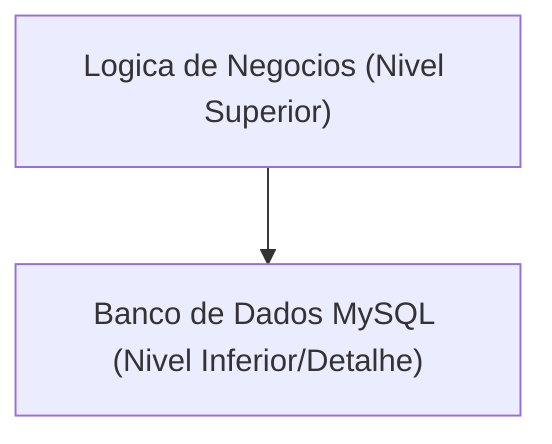
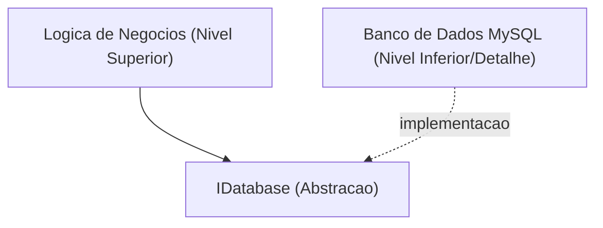

# As Profundezas da Programação Orientada a Objetos (POO): História, 3 Principais Elementos e Princípios SOLID

Na engenharia de software moderna, a programação orientada a objetos (Object-Oriented Programming, OOP ou POO) é um dos paradigmas mais difundidos e importantes. Desde pequenos scripts até sistemas corporativos de milhões de linhas, os conceitos de POO estão enraizados em todos os lugares.

Neste artigo, iremos além de uma compreensão superficial da POO. Vamos explorar profundamente seu contexto histórico, os fundamentos dos tipos de dados abstratos e matemáticos, seus 3 principais elementos (encapsulamento, herança e polimorfismo) e os **princípios SOLID** para construir software robusto na prática, ilustrando com exemplos de código concretos, casos extremos e diagramas Mermaid.

---

## 1. Contexto Histórico e Filosofia da Orientação a Objetos

O conceito de POO não surgiu da noite para o dia. Suas origens remontam à década de 1960, evoluindo como uma mudança de paradigma para lidar com a complexidade do software.

### 1.1 O Nascimento de Simula e Smalltalk
O ancestral direto da orientação a objetos é o **Simula 67**, desenvolvido na década de 1960 por Ole-Johan Dahl e Kristen Nygaard no Centro de Computação Norueguês. Eles introduziram os conceitos de "objetos" e "classes" para modelar simulações físicas complexas, como o movimento de navios.

Posteriormente, na década de 1970, o **Smalltalk** foi desenvolvido por Alan Kay e outros no Palo Alto Research Center (PARC) da Xerox. Alan Kay é o criador do termo "orientação a objetos", e sua visão era a seguinte:

> "I thought of objects being like biological cells and/or individual computers on a network, only able to communicate with messages." (Eu pensava nos objetos como células biológicas e/ou computadores individuais em uma rede, capazes de se comunicar apenas por mensagens.)

A POO em Smalltalk ia além da integração de dados e métodos para manipulá-los, colocando grande ênfase no **envio de mensagens (message passing)**.

### 1.2 A Popularização através do C++ e [Java](https://kenji.blog/pt/p/programming-languages-history-paradigm-evolution/)
Na década de 1980, Bjarne Stroustrup desenvolveu o **C++**, adicionando recursos de orientação a objetos do Simula à linguagem C. Isso tornou a POO prática na programação de sistemas. Além disso, na década de 1990, o **Java** foi desenvolvido por James Gosling e outros na Sun Microsystems, e com o slogan "Write Once, Run Anywhere", tornou-se o padrão de fato para POO no desenvolvimento corporativo.

### 1.3 Contexto Formal e Matemático: Tipos de Dados Abstratos (ADT)
Na base da POO está o conceito de **Tipos de Dados Abstratos (Abstract Data Type, ADT)**, proposto por Barbara Liskov e outros. Um ADT define matematicamente uma estrutura de dados e seu comportamento (operações).

Por exemplo, ao definir uma pilha $ S $, os seguintes axiomas matemáticos se aplicam:

$ \text{desempilhar}(\text{empilhar}(S, x)) = S $
$ \text{topo}(\text{empilhar}(S, x)) = x $

As classes em POO podem ser vistas como a materialização desse ADT como sintaxe de uma linguagem de programação. Um objeto é aquele que encapsula um espaço de estados $ X $ e um conjunto de funções $ F $ que causam transições nesse estado.

---

## 2. Os 3 Principais Elementos da Programação Orientada a Objetos

Como conceitos centrais que sustentam a POO, "encapsulamento", "herança" e "polimorfismo" são amplamente conhecidos (frequentemente chamados de os 4 grandes elementos, adicionando a "abstração"). Aqui, nos aprofundaremos na essência de cada um e em casos extremos na prática.

### 2.1 Encapsulamento (Encapsulation) e Ocultação de Informações

O encapsulamento envolve agrupar dados (atributos) e os métodos (comportamentos) que os manipulam em uma única unidade (classe), e inclui o princípio de **ocultação de informações (Information Hiding)** para evitar que os dados sejam manipulados diretamente pelo exterior.

#### Objetivos e Vantagens
- **Manutenção de Invariantes (Invariant)**: Garante que o objeto mantenha sempre um estado válido.
- **Redução do Acoplamento**: Mesmo que a implementação interna mude, contanto que a interface externa permaneça a mesma, o código cliente não será afetado.

#### Exemplo de Código e Explicação
Mau exemplo (invariante é quebrado):

```java
public class BankAccount {
    public double balance; // Acessível diretamente do exterior
}

// Lado do cliente
BankAccount account = new BankAccount();
account.balance = -1000; // O saldo se torna negativo!
```

Bom exemplo (proteção através de encapsulamento):

```java
public class BankAccount {
    private double balance;

    public BankAccount(double initialBalance) {
        if (initialBalance < 0) throw new IllegalArgumentException("O saldo inicial deve ser 0 ou mais.");
        this.balance = initialBalance;
    }

    public void deposit(double amount) {
        if (amount <= 0) throw new IllegalArgumentException("O valor do depósito deve ser positivo.");
        this.balance += amount;
    }

    public void withdraw(double amount) {
        if (amount <= 0 || this.balance < amount) throw new IllegalArgumentException("Retirada inválida.");
        this.balance -= amount;
    }

    public double getBalance() {
        return this.balance;
    }
}
```

#### Caso Extremo: Destruição através de Reflexão (Reflection)
Em linguagens como [Java](https://kenji.blog/pt/p/programming-languages-history-paradigm-evolution/) e C#, é possível acessar campos `private` à força usando recursos de reflexão. Como isso traz o risco de quebrar o encapsulamento, sistemas onde a segurança é prioridade requerem configurações do gerenciador de segurança ou controle de acesso rigoroso por meio de sistemas de módulos ([Java](https://kenji.blog/pt/p/programming-languages-history-paradigm-evolution/) 9 em diante).

### 2.2 Luzes e Sombras da Herança (Inheritance)

A herança é um mecanismo em que uma nova classe (classe filha, classe derivada) herda os dados e comportamentos de uma classe existente (classe pai, classe base).

#### Objetivos
- **Reutilização de Código**: Agrupando lógicas comuns na classe pai, eliminando duplicação.
- **Expressão de Relacionamentos "é-um" (is-a)**: Expressa classificações de domínio, como "Um cão é um animal (Dog is an Animal)".

#### Herança Múltipla e o Problema do Diamante (Diamond Problem)
Em algumas linguagens como C++, a **herança múltipla** a partir de várias classes pai é permitida, mas existe o famoso "Problema do Diamante".

```mermaid
classDiagram
    class "Animal" {
        +comer()
    }
    class "Mamifero" {
        +comer()
    }
    class "AnimalAlado" {
        +comer()
    }
    class "Morcego" {
    }
    
    "Animal" <|-- "Mamifero"
    "Animal" <|-- "AnimalAlado"
    "Mamifero" <|-- "Morcego"
    "AnimalAlado" <|-- "Morcego"
```

Quando Morcego (Bat) chama o método `comer()`, surge o problema de ambiguidade sobre se deve chamar a implementação de Mamifero (Mammal) ou AnimalAlado (WingedAnimal). Em [Java](https://kenji.blog/pt/p/programming-languages-history-paradigm-evolution/) e C#, a herança múltipla de classes é proibida, evitando este problema usando **interfaces**.

#### Composição ao Invés de Herança (Composition over Inheritance)
Na POO moderna, tende-se a evitar árvores de herança profundas. Isso ocorre devido ao **problema da classe base frágil (Fragile Base Class Problem)**, onde as mudanças na classe pai afetam todas as classes filhas. Em vez disso, recomenda-se a **composição**, que mantém outros objetos como campos e delega o processamento a eles.

### 2.3 Polimorfismo (Polymorphism: Multiplicidade de Formas)

O polimorfismo é a propriedade de "ter comportamentos diferentes dependendo do tipo do objeto em resposta à mesma mensagem (chamada de método)".

#### Tipos
1. **Polimorfismo Ad-hoc (Sobrecarga / Overloading)**: Diferentes métodos são chamados dependendo do tipo ou número de argumentos.
2. **Polimorfismo Paramétrico (Genéricos / Generics)**: Um mesmo algoritmo é aplicado a tipos arbitrários usando parâmetros de tipo.
3. **Polimorfismo de Subtipagem (Sobrescrita / Overriding)**: Trata a instância de uma classe filha através da variável de referência da interface ou classe pai, e a despacha dinamicamente em tempo de execução.

#### Despacho Dinâmico (vtable)
Em C++ e Java, o polimorfismo de subtipagem é implementado por meio de um mecanismo chamado **tabela de métodos virtuais (vtable)**. Um ponteiro para a vtable é armazenado no início do espaço de memória do objeto, que resolve o endereço da função a ser chamada em tempo de execução. Isso resulta em uma pequena sobrecarga.

```java
interface Shape {
    double calculateArea();
}

class Circle implements Shape {
    private double radius;
    public Circle(double r) { this.radius = r; }
    @Override
    public double calculateArea() { return Math.PI * radius * radius; }
}

class Rectangle implements Shape {
    private double w, h;
    public Rectangle(double w, double h) { this.w = w; this.h = h; }
    @Override
    public double calculateArea() { return w * h; }
}

// Uso do polimorfismo
List<Shape> shapes = Arrays.asList(new Circle(5), new Rectangle(4, 6));
for (Shape s : shapes) {
    // A implementação correta de calculateArea() é chamada em tempo de execução de acordo com o tipo real do objeto
    System.out.println(s.calculateArea()); 
}
```

---

## 3. Princípios SOLID: Os Segredos do Projeto Orientado a Objetos

Entender apenas os elementos básicos da POO não é suficiente para criar um software expansível e fácil de manter. Portanto, os cinco princípios de design, os **princípios SOLID**, compilados por Robert C. Martin (Uncle Bob), tornam-se vitais.

### 3.1 Princípio da Responsabilidade Única (Single Responsibility Principle: SRP)
**"Uma classe deve ter apenas um motivo para mudar"**

Se uma classe tiver múltiplas responsabilidades, existe um alto risco de que mudanças em um requisito afetem outra funcionalidade não relacionada.

#### Antipadronização e Solução
Por exemplo, suponha que a classe `Report` tenha três responsabilidades: geração de dados, processamento de formatação e salvamento em arquivo.

```python
# Mau exemplo: Uma classe com três responsabilidades
class Report:
    def __init__(self, data):
        self.data = data
        
    def generate_content(self):
        return f"Data: {self.data}"
        
    def format_as_pdf(self):
        # Lógica complexa para conversão em PDF
        pass
        
    def save_to_file(self, filename):
        with open(filename, 'w') as f:
            f.write(self.generate_content())
```

Dividimos isso de acordo com o SRP.

```python
# Bom exemplo: Separação de responsabilidades
class ReportData:
    def __init__(self, data):
        self.data = data

class ReportFormatter:
    def format_to_pdf(self, report_data):
        pass
    def format_to_html(self, report_data):
        pass

class ReportRepository:
    def save(self, content, filename):
        pass
```

### 3.2 Princípio Aberto-Fechado (Open-Closed Principle: OCP)
**"Os artefatos de software (classes, módulos, funções, etc.) devem estar abertos para extensão (Open) e fechados para modificação (Closed)"**

Esse princípio dita que você deve projetar para poder adicionar novos recursos sem modificar o código existente.

#### Abstração através de Interfaces
O exemplo de cálculo de área da forma (Shape) mencionado anteriormente ilustra perfeitamente o OCP. Para adicionar uma nova forma (por exemplo, `Triangle`), basta implementar a nova classe sem precisar alterar a interface `Shape` existente ou o código cliente (parte do loop) que a processa.

```mermaid
classDiagram
    class "Shape" {
        <<interface>>
        +calcularArea() double
    }
    class "Circle" {
        +calcularArea() double
    }
    class "Rectangle" {
        +calcularArea() double
    }
    class "Triangle" {
        +calcularArea() double
    }
    
    "Shape" <|.. "Circle"
    "Shape" <|.. "Rectangle"
    "Shape" <|.. "Triangle"
```

### 3.3 Princípio da Substituição de Liskov (Liskov Substitution Principle: LSP)
**"Os tipos derivados devem poder ser substituídos por seus tipos base"**

Este princípio, introduzido por Barbara Liskov, afirma que "passar uma classe filha onde uma classe pai é esperada não deve quebrar a corretude do programa".

#### Exemplo Famoso de Violação: O Problema do Quadrado e Retângulo
Matematicamente, "um quadrado é um tipo de retângulo", mas na programação isso nem sempre é o caso.

```java
class Rectangle {
    protected int width;
    protected int height;
    
    public void setWidth(int width) { this.width = width; }
    public void setHeight(int height) { this.height = height; }
    public int getArea() { return width * height; }
}

class Square extends Rectangle {
    @Override
    public void setWidth(int width) {
        this.width = width;
        this.height = width; // Para manter a restrição de um quadrado
    }
    @Override
    public void setHeight(int height) {
        this.width = height;
        this.height = height;
    }
}

// Código de teste (Lado do cliente)
void testRectangleArea(Rectangle r) {
    r.setWidth(5);
    r.setHeight(4);
    // Se r for um Rectangle, deveria ser 20, mas se um Square for passado, será 16 e a asserção falhará.
    assert r.getArea() == 20; 
}
```

A essência do problema aqui é que a classe `Square` quebra o contrato prévio (pré-condições) da classe `Rectangle` de que "a largura e a altura podem ser alteradas independentemente". Do ponto de vista do "Design by Contract" (Design Orientado a Contratos), o LSP deve ser rigorosamente seguido.

### 3.4 Princípio da Segregação da Interface (Interface Segregation Principle: ISP)
**"Os clientes não devem ser forçados a depender de métodos que não utilizam"**

Interfaces enormes e infladas (Fat Interface) obrigam as classes que as implementam a fornecer código para métodos que não precisam.

#### Violação e Melhoria
```csharp
// Mau exemplo: Interface obesa
public interface IMachine {
    void Print(Document d);
    void Scan(Document d);
    void Fax(Document d);
}

// Uma impressora simples é forçada a implementar métodos mesmo não podendo escanear ou enviar fax
public class SimplePrinter : IMachine {
    public void Print(Document d) { /* Processo de impressão */ }
    public void Scan(Document d) { throw new NotImplementedException(); }
    public void Fax(Document d) { throw new NotImplementedException(); }
}
```

Separe a interface de acordo com as responsabilidades.

```csharp
// Bom exemplo: Separação de interfaces
public interface IPrinter {
    void Print(Document d);
}
public interface IScanner {
    void Scan(Document d);
}

public class SimplePrinter : IPrinter {
    public void Print(Document d) { /* Processo de impressão */ }
}

public class MultiFunctionPrinter : IPrinter, IScanner {
    public void Print(Document d) { /* Processo de impressão */ }
    public void Scan(Document d) { /* Processo de escaneamento */ }
}
```

### 3.5 Princípio da Inversão de Dependência (Dependency Inversion Principle: DIP)
**"Módulos de alto nível não devem depender de módulos de baixo nível. Ambos devem depender de abstrações. Além disso, as abstrações não devem depender de detalhes, mas os detalhes devem depender de abstrações"**

Este princípio é a chave para reduzir drasticamente o acoplamento entre os componentes do sistema.

#### Design Tradicional (Violação do DIP)
Situação em que a lógica de negócios de alto nível depende diretamente da classe de acesso a dados de baixo nível.



#### Design com Aplicação do DIP
Interpondo uma abstração (interface) no meio, você inverte o vetor da relação de dependência.



```java
// Abstração (Interface)
public interface UserRepository {
    void save(User user);
}

// Módulo de baixo nível (Detalhe)
public class MySQLUserRepository implements UserRepository {
    public void save(User user) {
        // Processo específico de salvamento no MySQL
    }
}

// Módulo de alto nível
public class UserService {
    private final UserRepository repository;
    
    // Injeção de dependência via construtor (DI)
    public UserService(UserRepository repository) {
        this.repository = repository;
    }
    
    public void registerUser(User user) {
        // ... Lógica de negócios ...
        repository.save(user);
    }
}
```

Projetando dessa forma, ao mudar de MySQL para PostgreSQL ou banco em memória para testes, não há necessidade de modificar o código de `UserService`. Esta é a ideia fundamental dos **frameworks de Injeção de Dependência (DI)** (Spring, Guice, .NET DI, etc.).

---

## 4. Considerações Matemáticas e Métodos Formais na POO

Neste ponto, vamos introduzir algumas perspectivas matemáticas sobre os sistemas de tipos na POO. A relação de derivação de tipos (subtipagem) é frequentemente modelada usando teoria das categorias ou teoria dos reticulados.

A indicação de que um tipo $ A $ é um subtipo de um tipo $ B $ é escrita como $ A <: B $. Isso forma uma relação de ordem parcial (reflexiva, transitiva, antissimétrica).

1. **Reflexividade**: Para qualquer tipo $ A $, temos $ A <: A $
2. **Transitividade**: Se $ A <: B $ e $ B <: C $, então $ A <: C $

Na subtipagem de funções, existe a importante propriedade de que o tipo de retorno é **covariante (Covariant)**, e o tipo dos argumentos é **contravariante (Contravariant)**.

Para os tipos de função $ f: P_1 \to R_1 $ e $ g: P_2 \to R_2 $, as condições para $ f <: g $ (onde a função $ f $ pode ser usada de forma segura no lugar de $ g $) são as seguintes:

$ P_2 <: P_1 \quad \text{e} \quad R_1 <: R_2 $

A razão pela qual os argumentos se tornam contravariantes (a direção é revertida) é o resultado da aplicação do LSP (Princípio da Substituição de Liskov) ao nível das funções. Um método de uma classe filha deve aceitar condições mais flexíveis (um tipo de argumento mais amplo) e retornar com condições mais restritas (um tipo de retorno mais estreito) do que o método da classe pai.

---

## 5. Conclusão e o Futuro da Orientação a Objetos

Este artigo abordou detalhadamente desde o contexto histórico da POO, seus elementos básicos como encapsulamento, herança e polimorfismo, até os princípios SOLID que são indispensáveis para o desenvolvimento corporativo.

Nos últimos anos, o paradigma da Programação Funcional (FP) ganhou proeminência e os benefícios da imutabilidade e funções puras (Pure Functions) têm sido reavaliados. No entanto, a POO e a FP não são excludentes. Linguagens modernas (Scala, Kotlin, [Rust](https://kenji.blog/pt/p/programming-languages-history-paradigm-evolution/) e recentemente C# e [Java](https://kenji.blog/pt/p/programming-languages-history-paradigm-evolution/)) mesclam os paradigmas, tornando-se dominante uma abordagem híbrida onde "o gerenciamento de estado é encapsulado em classes da POO e os pipelines de transformação de dados são tratados com FP".

Não existe uma "bala de prata" no design de software, mas o entendimento profundo da POO e a aplicação rigorosa dos princípios SOLID fornecerão armas poderosas para a construção de sistemas que suportam manutenção de longo prazo e são altamente resilientes a mudanças.

---

**Referências e Leituras Recomendadas:**
1. Erich Gamma, et al. *Design Patterns: Elements of Reusable Object-Oriented Software*. Addison-Wesley.
2. Robert C. Martin. *Clean Architecture: A Craftsman's Guide to Software Structure and Design*. Prentice Hall.
3. Bertrand Meyer. *Object-Oriented Software Construction*. Prentice Hall.
4. Barbara Liskov, Jeannette Wing. *A behavioral notion of subtyping*. ACM Transactions on [Programming Language](https://kenji.blog/pt/p/programming-languages-history-paradigm-evolution/)s and Systems.
