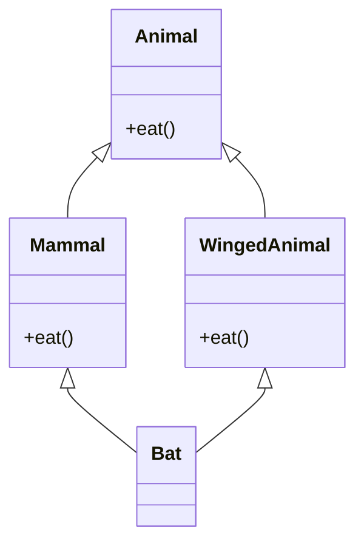
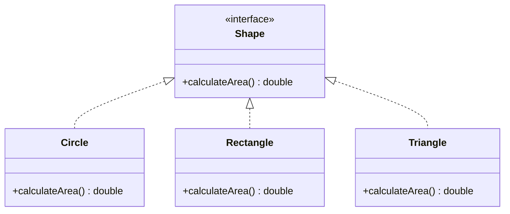
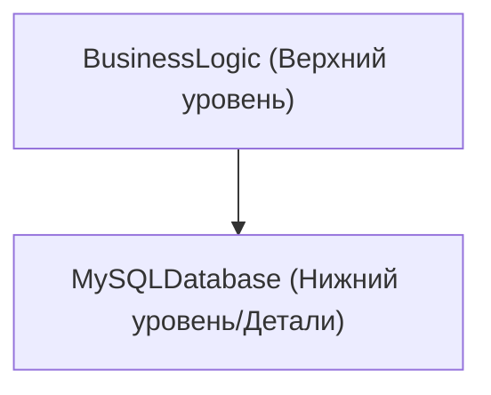
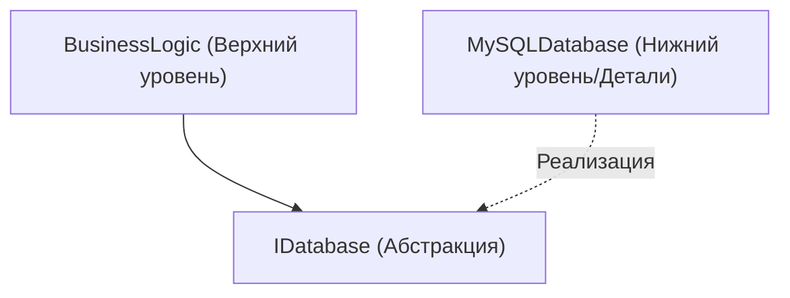

# Глубины объектно-ориентированного программирования (ООП): история, 3 основных элемента и принципы SOLID

В современной программной инженерии объектно-ориентированное программирование (Object-Oriented Programming, ООП) является одной из самых популярных и важных парадигм. От небольших скриптов до корпоративных систем, насчитывающих миллионы строк, концепции ООП укоренились повсюду.

В этой статье мы не ограничимся лишь поверхностным пониманием ООП, но и подробно разберем его исторические предпосылки, основы математических и абстрактных типов данных, глубоко погрузимся в 3 основных элемента (инкапсуляция, наследование, полиморфизм), а также в принципы **SOLID** для создания надежного программного обеспечения на практике, используя конкретные примеры кода, крайние случаи и диаграммы Mermaid.

---

## 1. Исторические предпосылки и философия объектно-ориентированного программирования

Концепция ООП не появилась в одночасье. Ее истоки восходят к 1960-м годам, и она развивалась как сдвиг парадигмы для решения проблемы сложности программного обеспечения.

### 1.1 Рождение Simula и Smalltalk
Прямым предком объектно-ориентированного подхода является **Simula 67**, разработанный Оле-Йоханом Далем (Ole-Johan Dahl) и Кристеном Нюгором (Kristen Nygaard) в Норвежском вычислительном центре в 1960-х годах. Они ввели концепции "объект" и "класс" для моделирования сложных физических симуляций, таких как движение кораблей.

Позже, в 1970-х годах, Алан Кей (Alan Kay) и другие разработали **Smalltalk** в Исследовательском центре Xerox в Пало-Альто (PARC). Алан Кей является создателем термина "объектно-ориентированный", и его видение было следующим:

> "I thought of objects being like biological cells and/or individual computers on a network, only able to communicate with messages." (Я представлял объекты как биологические клетки и/или отдельные компьютеры в сети, способные общаться только с помощью сообщений.)

ООП в Smalltalk не ограничивалось лишь интеграцией данных и методов для работы с ними, но уделяло большое внимание **передаче сообщений (message passing)**.

### 1.2 Популяризация благодаря C++ и [Java](https://kenji.blog/ru/p/programming-languages-history-paradigm-evolution/)
В 1980-х годах Бьёрн Страуструп (Bjarne Stroustrup) разработал **C++**, добавив объектно-ориентированные возможности Simula в язык C. Это сделало ООП практичным для системного программирования. Далее, в 1990-х годах Джеймс Гослинг (James Gosling) и другие сотрудники Sun Microsystems разработали **Java**, который со слоганом "Write Once, Run Anywhere" стал стандартом де-факто для ООП в корпоративной разработке.

### 1.3 Формальные и математические предпосылки: Абстрактные типы данных (ADT)
В основе ООП лежит концепция **абстрактных типов данных (Abstract Data Type, ADT)**, предложенная Барбарой Лисков (Barbara Liskov) и другими. ADT математически определяет структуру данных и ее поведение (операции).

Например, при определении стека $ S $ математически выполняются следующие аксиомы:

$ \text{извлечь}(\text{поместить}(S, x)) = S $
$ \text{вершина}(\text{поместить}(S, x)) = x $

Классы в ООП можно рассматривать как воплощение ADT в виде синтаксиса языка программирования. Объект — это капсула, объединяющая пространство состояний $ X $ и набор функций $ F $, которые обеспечивают переход этих состояний.

---

## 2. 3 основных элемента объектно-ориентированного программирования

В качестве основных концепций, поддерживающих ООП, широко известны три: "инкапсуляция", "наследование" и "полиморфизм" (часто их называют 4 основными элементами, добавляя "абстракцию"). Здесь мы глубоко рассмотрим суть каждой из них и крайние случаи в практике.

### 2.1 Инкапсуляция (Encapsulation) и сокрытие информации

Инкапсуляция включает в себя объединение данных (атрибутов) и методов (поведения), которые ими управляют, в одну единицу (класс), а также принцип **сокрытия информации (Information Hiding)**, который предотвращает прямое манипулирование данными извне.

#### Цели и преимущества
- **Поддержание инвариантов (Invariant)**: Гарантирует, что объект всегда остается в допустимом состоянии.
- **Снижение связанности**: Изменение внутренней реализации не влияет на использующий код, если внешний интерфейс остается тем же.

#### Пример кода и пояснение
Плохой пример (инвариант нарушается):

```java
public class BankAccount {
    public double balance; // Прямой доступ извне возможен
}

// Сторона использования
BankAccount account = new BankAccount();
account.balance = -1000; // Баланс становится отрицательным!
```

Хороший пример (защита с помощью инкапсуляции):

```java
public class BankAccount {
    private double balance;

    public BankAccount(double initialBalance) {
        if (initialBalance < 0) throw new IllegalArgumentException("Начальный баланс должен быть 0 или больше.");
        this.balance = initialBalance;
    }

    public void deposit(double amount) {
        if (amount <= 0) throw new IllegalArgumentException("Сумма депозита должна быть положительной.");
        this.balance += amount;
    }

    public void withdraw(double amount) {
        if (amount <= 0 || this.balance < amount) throw new IllegalArgumentException("Неверная операция снятия.");
        this.balance -= amount;
    }

    public double getBalance() {
        return this.balance;
    }
}
```

#### Крайний случай: Нарушение через рефлексию
В таких языках, как [Java](https://kenji.blog/ru/p/programming-languages-history-paradigm-evolution/) и C#, можно принудительно получить доступ к полям `private` с помощью функций рефлексии. Поскольку существует риск нарушения инкапсуляции, в системах, где важна безопасность, необходимо усилить контроль доступа через настройки менеджера безопасности или систему модулей (начиная с [Java](https://kenji.blog/ru/p/programming-languages-history-paradigm-evolution/) 9).

### 2.2 Свет и тень наследования (Inheritance)

Наследование — это механизм, с помощью которого новый класс (дочерний класс, производный класс) перенимает данные и поведение существующего класса (родительского класса, базового класса).

#### Цель
- **Повторное использование кода**: Объединение общей логики в родительском классе устраняет дублирование.
- **Выражение отношения "is-a"**: Выражает доменную классификацию, такую как "Собака является животным (Dog is an Animal)".

#### Множественное наследование и проблема ромба (Diamond Problem)
В некоторых языках, таких как C++, разрешено **множественное наследование**, при котором происходит наследование от нескольких родительских классов, но здесь существует известная "проблема ромба".



Проблема заключается в том, что когда класс Bat вызывает метод `eat()`, становится неясно, какую реализацию вызывать: из Mammal или WingedAnimal. [Java](https://kenji.blog/ru/p/programming-languages-history-paradigm-evolution/) и C# запрещают множественное наследование классов и избегают этой проблемы, используя **интерфейсы**.

#### Композиция вместо наследования (Composition over Inheritance)
В современном ООП есть тенденция избегать глубоких деревьев наследования. Это связано с **проблемой хрупкого базового класса (Fragile Base Class Problem)**, когда изменения в родительском классе влияют на все дочерние классы. Вместо этого рекомендуется **композиция**, при которой другие объекты сохраняются в качестве полей и обработка делегируется им.

### 2.3 Полиморфизм (Polymorphism: Многоморфизм)

Полиморфизм — это свойство, при котором "на одно и то же сообщение (вызов метода) разные объекты реагируют по-разному в зависимости от их типа".

#### Виды
1. **Ad-hoc полиморфизм (Перегрузка)**: Вызываются разные методы в зависимости от типа или количества аргументов.
2. **Параметрический полиморфизм (Дженерики)**: Один и тот же алгоритм применяется к любому типу с использованием параметров типа.
3. **Полиморфизм подтипов (Переопределение)**: Экземпляры дочерних классов обрабатываются через ссылочные переменные интерфейса или родительского класса, и диспетчеризация происходит динамически во время выполнения.

#### Динамическая диспетчеризация (vtable)
В C++, Java и т.д. полиморфизм подтипов реализуется с помощью механизма **таблицы виртуальных функций (vtable)**. В начале области памяти объекта сохраняется указатель на vtable, который во время выполнения определяет адрес функции для вызова. Из-за этого возникают небольшие накладные расходы.

```java
interface Shape {
    double calculateArea();
}

class Circle implements Shape {
    private double radius;
    public Circle(double r) { this.radius = r; }
    @Override
    public double calculateArea() { return Math.PI * radius * radius; }
}

class Rectangle implements Shape {
    private double w, h;
    public Rectangle(double w, double h) { this.w = w; this.h = h; }
    @Override
    public double calculateArea() { return w * h; }
}

// Использование полиморфизма
List<Shape> shapes = Arrays.asList(new Circle(5), new Rectangle(4, 6));
for (Shape s : shapes) {
    // В зависимости от фактического типа объекта во время выполнения вызывается соответствующий calculateArea()
    System.out.println(s.calculateArea()); 
}
```

---

## 3. Принципы SOLID: Секреты объектно-ориентированного проектирования

Просто понимая базовые элементы ООП, трудно создать поддерживаемое и масштабируемое программное обеспечение. Здесь вступают в силу 5 принципов проектирования, составленных Робертом Мартином (Дядя Боб), — **принципы SOLID**.

### 3.1 Принцип единственной ответственности (Single Responsibility Principle: SRP)
**"Класс должен иметь только одну причину для изменения."**

Если класс имеет несколько ролей (ответственностей), существует высокий риск того, что изменение одного требования повлияет на другие, не связанные с ним функции.

#### Антипаттерны и способы улучшения
Например, предположим, что класс `Report` имеет три ответственности: генерация данных, форматирование и сохранение в файл.

```python
# Плохой пример: класс с 3 ответственностями
class Report:
    def __init__(self, data):
        self.data = data
        
    def generate_content(self):
        return f"Data: {self.data}"
        
    def format_as_pdf(self):
        # Сложная логика для преобразования в PDF
        pass
        
    def save_to_file(self, filename):
        with open(filename, 'w') as f:
            f.write(self.generate_content())
```

Мы разделим это в соответствии с SRP.

```python
# Хороший пример: разделение ответственности
class ReportData:
    def __init__(self, data):
        self.data = data

class ReportFormatter:
    def format_to_pdf(self, report_data):
        pass
    def format_to_html(self, report_data):
        pass

class ReportRepository:
    def save(self, content, filename):
        pass
```

### 3.2 Принцип открытости/закрытости (Open-Closed Principle: OCP)
**"Программные сущности (классы, модули, функции и т.д.) должны быть открыты (Open) для расширения, но закрыты (Closed) для изменения."**

Этот принцип означает, что проектирование должно позволять добавлять новые функции без изменения существующего кода.

#### Абстракция через интерфейсы
Предыдущий пример вычисления площади фигур (Shape) точно соответствует OCP. Если мы хотим добавить новую фигуру (например, `Triangle`), мы можем просто реализовать новый класс, не меняя существующий интерфейс `Shape` или код (цикл), который его обрабатывает.



### 3.3 Принцип подстановки Барбары Лисков (Liskov Substitution Principle: LSP)
**"Производные типы должны быть взаимозаменяемы со своими базовыми типами."**

Этот принцип, предложенный Барбарой Лисков, гласит, что «даже если вы передадите дочерний класс туда, где ожидается родительский класс, правильность программы не должна быть нарушена».

#### Известный пример нарушения: Проблема квадрата и прямоугольника
Математически "квадрат — это разновидность прямоугольника", но в программировании это не всегда так.

```java
class Rectangle {
    protected int width;
    protected int height;
    
    public void setWidth(int width) { this.width = width; }
    public void setHeight(int height) { this.height = height; }
    public int getArea() { return width * height; }
}

class Square extends Rectangle {
    @Override
    public void setWidth(int width) {
        this.width = width;
        this.height = width; // Для сохранения ограничения квадрата
    }
    @Override
    public void setHeight(int height) {
        this.width = height;
        this.height = height;
    }
}

// Тестовый код (сторона использования)
void testRectangleArea(Rectangle r) {
    r.setWidth(5);
    r.setHeight(4);
    // Если r - это Rectangle, ожидается 20, но если передается Square, получается 16, и утверждение (assertion) завершается неудачей.
    assert r.getArea() == 20; 
}
```

Суть этой проблемы в том, что класс `Square` нарушает предварительный контракт (предварительное условие) класса `Rectangle` о том, что «ширина и высота могут быть изменены независимо». С точки зрения проектирования по контракту (Design by Contract) LSP должен строго соблюдаться.

### 3.4 Принцип разделения интерфейса (Interface Segregation Principle: ISP)
**"Клиенты не должны зависеть от методов, которые они не используют."**

Огромные, раздутые интерфейсы (Fat Interface) заставляют классы, которые их реализуют, реализовывать ненужные методы.

#### Пример нарушения и улучшение
```csharp
// Плохой пример: раздутый интерфейс
public interface IMachine {
    void Print(Document d);
    void Scan(Document d);
    void Fax(Document d);
}

// Простой принтер не может ни сканировать, ни отправлять факсы, но вынужден реализовывать эти методы
public class SimplePrinter : IMachine {
    public void Print(Document d) { /* Процесс печати */ }
    public void Scan(Document d) { throw new NotImplementedException(); }
    public void Fax(Document d) { throw new NotImplementedException(); }
}
```

Мы разделим интерфейсы детально по ролям.

```csharp
// Хороший пример: разделение интерфейсов
public interface IPrinter {
    void Print(Document d);
}
public interface IScanner {
    void Scan(Document d);
}

public class SimplePrinter : IPrinter {
    public void Print(Document d) { /* Процесс печати */ }
}

public class MultiFunctionPrinter : IPrinter, IScanner {
    public void Print(Document d) { /* Процесс печати */ }
    public void Scan(Document d) { /* Процесс сканирования */ }
}
```

### 3.5 Принцип инверсии зависимостей (Dependency Inversion Principle: DIP)
**"Модули верхнего уровня не должны зависеть от модулей нижнего уровня. Оба должны зависеть от абстракций. Кроме того, абстракции не должны зависеть от деталей, а детали должны зависеть от абстракций."**

Этот принцип является ключом к радикальному снижению связности между компонентами системы.

#### Традиционное проектирование (нарушение DIP)
Состояние, при котором бизнес-логика верхнего уровня напрямую зависит от конкретного класса доступа к данным нижнего уровня.



#### Проектирование с применением DIP
Вставляя абстракцию (интерфейс) между ними, мы меняем направление зависимости на противоположное.



```java
// Абстракция (Интерфейс)
public interface UserRepository {
    void save(User user);
}

// Модуль нижнего уровня (Детали)
public class MySQLUserRepository implements UserRepository {
    public void save(User user) {
        // Конкретный процесс сохранения в MySQL
    }
}

// Модуль верхнего уровня
public class UserService {
    private final UserRepository repository;
    
    // Внедрение зависимостей (DI) через конструктор
    public UserService(UserRepository repository) {
        this.repository = repository;
    }
    
    public void registerUser(User user) {
        // ... бизнес-логика ...
        repository.save(user);
    }
}
```

Проектируя таким образом, даже при замене базы данных с MySQL на PostgreSQL или in-memory базу данных для тестирования, нет необходимости вообще менять код `UserService`. Это фундаментальная идея, лежащая в основе **фреймворков DI (Внедрение зависимостей)** (Spring, Guice, .NET DI и т.д.).

---

## 4. Математический анализ ООП и формальные методы

Теперь давайте добавим немного математической перспективы в систему типов ООП. Отношения производных типов (подтипов) часто моделируются с использованием теории категорий и теории решеток.

Обозначение $ A <: B $ означает, что тип $ A $ является подтипом типа $ B $. Это формирует отношение частичного порядка (рефлексивное, транзитивное, антисимметричное).

1. **Рефлексивность**: Для любого типа $ A $, $ A <: A $
2. **Транзитивность**: Если $ A <: B $ и $ B <: C $, то $ A <: C $

В подтипизации функций есть важное свойство, заключающееся в том, что тип возвращаемого значения является **ковариантным (Covariant)**, а тип аргумента — **контравариантным (Contravariant)**.

Для функциональных типов $ f: P_1 \to R_1 $ и $ g: P_2 \to R_2 $, условием для того, чтобы $ f <: g $ (функцию $ f $ можно безопасно использовать вместо $ g $), является следующее:

$ P_2 <: P_1 \quad \text{и} \quad R_1 <: R_2 $

Причина, по которой аргументы контравариантны (направление меняется на противоположное), является результатом применения LSP (Принципа подстановки Барбары Лисков) на уровне функций. Метод дочернего класса должен принимать более мягкие условия (аргументы более широкого типа) и возвращать более строгие условия (возвращаемое значение более узкого типа), чем метод родительского класса.

---

## 5. Заключение и будущее объектно-ориентированного программирования

В этой статье мы подробно рассмотрели ООП, начиная с его исторических предпосылок, базовых элементов, таких как инкапсуляция, наследование и полиморфизм, и заканчивая принципами SOLID, которые необходимы для корпоративной разработки.

В последние годы набирает популярность парадигма функционального программирования (FP), и пересматриваются преимущества неизменяемости (Immutability) и чистых функций (Pure Functions). Однако ООП и FP не противоречат друг другу. Современные языки (Scala, Kotlin, [Rust](https://kenji.blog/ru/p/programming-languages-history-paradigm-evolution/), современные C# и [Java](https://kenji.blog/ru/p/programming-languages-history-paradigm-evolution/)) объединяют парадигмы обоих подходов, и все более популярным становится гибридный дизайн: «Управление состоянием инкапсулируется в классах ООП, а конвейеры преобразования данных выполняются с использованием подходов FP».

Хотя в проектировании программного обеспечения нет «серебряной пули», глубокое понимание ООП и применение принципов SOLID станут мощным оружием для создания надежных и устойчивых к изменениям систем в долгосрочной перспективе.

---

**Литература и рекомендуемые книги:**
1. Erich Gamma, et al. *Design Patterns: Elements of Reusable Object-Oriented Software*. Addison-Wesley.
2. Robert C. Martin. *Clean Architecture: A Craftsman's Guide to Software Structure and Design*. Prentice Hall.
3. Bertrand Meyer. *Object-Oriented Software Construction*. Prentice Hall.
4. Barbara Liskov, Jeannette Wing. *A behavioral notion of subtyping*. ACM Transactions on [Programming Language](https://kenji.blog/ru/p/programming-languages-history-paradigm-evolution/)s and Systems.
