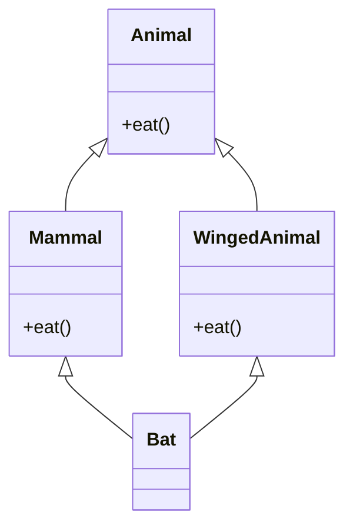
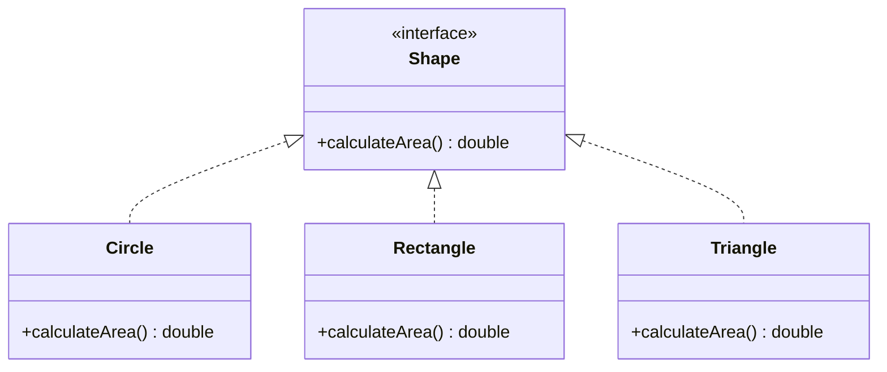
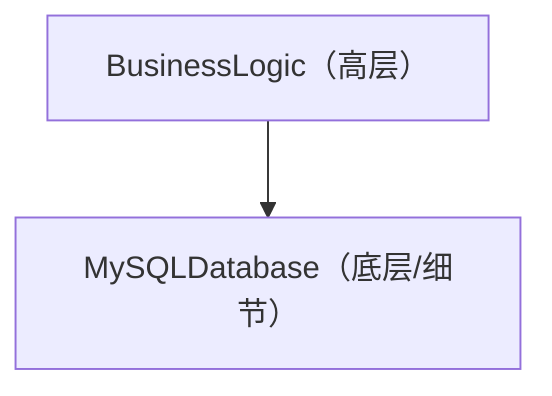
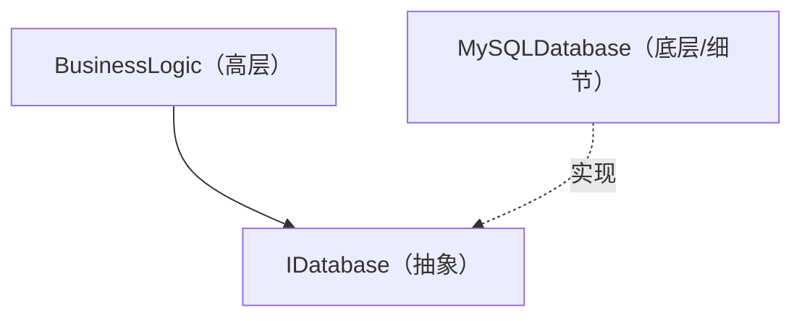

# 面向对象编程（OOP）的深渊：历史、三大要素与SOLID原则

在现代软件工程中，面向对象编程（Object-Oriented Programming, OOP）是最普及且最重要的范式之一。从小型脚本到数百万行的企业级系统，OOP的概念无处不在。

本文不仅停留在OOP的表面理解，还将从其历史背景、数学与抽象数据类型的基础、三大要素（封装、继承、多态）的深入剖析，到实务中构建健壮软件的 **SOLID原则** ，结合具体的代码示例、边界情况以及Mermaid图解，进行彻底的讲解。

---

## 1. 面向对象的历史背景与哲学

OOP的概念并非一夜之间诞生。其起源可追溯至20世纪60年代，作为应对软件复杂性的一种范式转移而不断演进。

### 1.1 Simula与Smalltalk的诞生
面向对象的直接祖先是1960年代由挪威计算中心的Ole-Johan Dahl与Kristen Nygaard开发的 **Simula 67** 。为了对船舶运动等复杂的物理模拟进行建模，他们引入了“对象”和“类”的概念。

之后，在20世纪70年代施乐帕罗奥多研究中心（PARC），由艾伦·凯（Alan Kay）等人开发了 **Smalltalk** 。艾伦·凯是“面向对象”一词的创造者，他的愿景如下：

> "I thought of objects being like biological cells and/or individual computers on a network, only able to communicate with messages."（我认为对象就像生物细胞和/或网络上的独立计算机，只能通过消息进行通信。）

Smalltalk中的OOP不仅限于数据及操作数据的方法的整合，更侧重于 **消息传递（消息通信）** 。

### 1.2 C++与[Java](https://kenji.blog/zh-cn/p/programming-languages-history-paradigm-evolution/)带来的普及
进入20世纪80年代，本贾尼·斯特劳斯特卢普（Bjarne Stroustrup）开发了在C语言中加入Simula面向对象功能的 **C++** 。这使得OOP在系统编程中得以实用化。此外，在20世纪90年代，由太阳微系统（Sun Microsystems）的詹姆斯·高斯林（James Gosling）等人开发了 **Java** ，伴随着“Write Once, Run Anywhere”的口号，它成为了企业级开发中OOP的事实标准。

### 1.3 形式与数学背景：抽象数据类型（ADT）
OOP的基础中，有芭芭拉·利斯科夫（Barbara Liskov）等人提倡的 **抽象数据类型（Abstract Data Type, ADT）** 概念。ADT是在数学上定义数据结构及其行为（操作）。

例如，在定义栈 $ S $ 时，数学上有以下公理成立：

$ \text{弹出}(\text{压入}(S, x)) = S $
$ \text{顶部}(\text{压入}(S, x)) = x $

OOP的类，可以看作是将该ADT具象化为编程语言语法的产物。将状态空间 $ X $ 及使其状态转移的函数群 $ F $ 封装在一个胶囊中，这就是对象。

---

## 2. 面向对象编程的三大要素

作为支撑OOP的核心概念，“封装”、“继承”、“多态”这三个被广泛熟知（有时加上“抽象”被称为四大要素）。在此我们将深入探讨各自的本质以及实务中的边界情况。

### 2.1 封装（Encapsulation）与信息隐藏

封装包含将数据（属性）及其操作方法（行为）整合到一个单元（类）中，以及防止外部直接操作数据的 **信息隐藏（Information Hiding）** 原则。

#### 目的与优点
- **维持不变条件（Invariant）**: 保证对象始终保持有效的状态。
- **降低耦合度**: 即使修改内部实现，只要外部接口相同，就不会影响调用方的代码。

#### 代码示例与解说
反面教材（不变条件被破坏）：

```java
public class BankAccount {
    public double balance; // 可以从外部直接访问
}

// 调用方
BankAccount account = new BankAccount();
account.balance = -1000; // 余额变成负数了！
```

正面教材（通过封装进行保护）：

```java
public class BankAccount {
    private double balance;

    public BankAccount(double initialBalance) {
        if (initialBalance < 0) throw new IllegalArgumentException("初始余额必须大于等于0。");
        this.balance = initialBalance;
    }

    public void deposit(double amount) {
        if (amount <= 0) throw new IllegalArgumentException("存款金额必须为正数。");
        this.balance += amount;
    }

    public void withdraw(double amount) {
        if (amount <= 0 || this.balance < amount) throw new IllegalArgumentException("无效的取款。");
        this.balance -= amount;
    }

    public double getBalance() {
        return this.balance;
    }
}
```

#### 边界情况：反射带来的破坏
在[Java](https://kenji.blog/zh-cn/p/programming-languages-history-paradigm-evolution/)或C#等语言中，通过使用反射功能，可以强制访问 `private` 字段。由于这存在破坏封装的风险，因此在注重安全的系统中，需要配置安全管理器，或通过模块系统（[Java](https://kenji.blog/zh-cn/p/programming-languages-history-paradigm-evolution/) 9及以上版本）强化访问控制。

### 2.2 继承（Inheritance）的光与影

继承是一种机制，新类（子类、派生类）继承现有类（父类、基类）的数据和行为。

#### 目的
- **代码重用**: 通过将共同的处理汇总到父类中，消除重复。
- **表达“is-a”关系**: 表达领域分类，例如“狗是动物（Dog is an Animal）”。

#### 多重继承与菱形问题（Diamond Problem）
在C++等部分语言中，允许从多个父类继承的 **多重继承** ，但这存在著名的“菱形问题”。



Bat在调用 `eat()` 方法时，应该调用Mammal和WingedAnimal中的哪一个实现变得模糊，这就是此问题所在。在[Java](https://kenji.blog/zh-cn/p/programming-languages-history-paradigm-evolution/)或C#中，禁止类的多重继承，并通过使用 **接口** 来避免该问题。

#### 组合优于继承（Composition over Inheritance）
在现代OOP中，倾向于避免深层的继承树。这是因为存在父类的修改会波及所有子类的 **脆弱基类问题（Fragile Base Class Problem）** 。取而代之，推荐使用将其他对象作为字段持有并委托处理的 **组合** 。

### 2.3 多态（Polymorphism：多态性）

多态具有“对于同一消息（方法调用），根据对象类型的不同表现出不同行为”的性质。

#### 种类
1. **特设多态（重载）**: 根据参数的类型和数量调用不同的方法。
2. **参数多态（泛型）**: 使用类型参数，对任意类型应用相同的算法。
3. **子类型多态（重写）**: 用接口或父类的引用变量处理子类实例，在运行时动态分发。

#### 动态分发（vtable）
在C++或Java等语言中，子类型多态是通 **虚函数表（vtable）** 的机制实现的。在对象内存区域的开头存储着指向vtable的指针，在运行时解析应该调用的函数地址。因此，会产生少许的开销。

```java
interface Shape {
    double calculateArea();
}

class Circle implements Shape {
    private double radius;
    public Circle(double r) { this.radius = r; }
    @Override
    public double calculateArea() { return Math.PI * radius * radius; }
}

class Rectangle implements Shape {
    private double w, h;
    public Rectangle(double w, double h) { this.w = w; this.h = h; }
    @Override
    public double calculateArea() { return w * h; }
}

// 使用多态
List<Shape> shapes = Arrays.asList(new Circle(5), new Rectangle(4, 6));
for (Shape s : shapes) {
    // 在运行时根据对象的实际类型调用适当的 calculateArea()
    System.out.println(s.calculateArea()); 
}
```

---

## 3. SOLID原则：面向对象设计的秘诀

仅仅理解OOP的基本要素，很难编写出高可维护性和高扩展性的软件。因此，由罗伯特·C·马丁（Uncle Bob）总结的5个设计原则，即 **SOLID原则** 变得尤为重要。

### 3.1 单一职责原则（Single Responsibility Principle: SRP）
**“一个类应该只有一个引起它变化的原因”**

如果一个类承担了多个职责（责任），那么修改某个需求就会增加影响其他无关功能的风险。

#### 反模式与改进方案
例如，假设 `Report` 类承担了生成数据、格式化处理以及保存到文件这三个职责。

```python
# 反面教材：拥有三个职责的类
class Report:
    def __init__(self, data):
        self.data = data
        
    def generate_content(self):
        return f"Data: {self.data}"
        
    def format_as_pdf(self):
        # 转换为PDF的复杂逻辑
        pass
        
    def save_to_file(self, filename):
        with open(filename, 'w') as f:
            f.write(self.generate_content())
```

遵循SRP将其拆分。

```python
# 正面教材：分离职责
class ReportData:
    def __init__(self, data):
        self.data = data

class ReportFormatter:
    def format_to_pdf(self, report_data):
        pass
    def format_to_html(self, report_data):
        pass

class ReportRepository:
    def save(self, content, filename):
        pass
```

### 3.2 开闭原则（Open-Closed Principle: OCP）
**“软件实体（类、模块、函数等）应对扩展开放（Open），对修改封闭（Closed）”**

该原则指出，应该在不修改现有代码的情况下，能够添加新功能。

#### 基于接口的抽象
前面计算图形（Shape）面积的示例，正好满足OCP。如果想添加新图形（例如 `Triangle`），完全不需要修改现有的 `Shape` 接口及其处理端的代码（循环部分），只需实现新类即可。



### 3.3 里氏替换原则（Liskov Substitution Principle: LSP）
**“派生类型必须能够替换其基类型”**

由芭芭拉·利斯科夫提倡的该原则意为：“即使将子类传递给期望父类的地方，程序的正确性也不能被破坏”。

#### 著名的违反案例：正方形与长方形的问题
数学上“正方形是长方形的一种”，但在编程中未必如此。

```java
class Rectangle {
    protected int width;
    protected int height;
    
    public void setWidth(int width) { this.width = width; }
    public void setHeight(int height) { this.height = height; }
    public int getArea() { return width * height; }
}

class Square extends Rectangle {
    @Override
    public void setWidth(int width) {
        this.width = width;
        this.height = width; // 为了维持正方形的约束
    }
    @Override
    public void setHeight(int height) {
        this.width = height;
        this.height = height;
    }
}

// 测试代码（调用方）
void testRectangleArea(Rectangle r) {
    r.setWidth(5);
    r.setHeight(4);
    // 如果 r 是 Rectangle 应该为 20，但如果传入 Square 就会变成 16，断言失败。
    assert r.getArea() == 20; 
}
```

该问题的本质在于，`Square` 类打破了 `Rectangle` 类“宽度和高度可以独立修改”的前置契约（前置条件）。从契约式设计（Design by Contract）的观点来看，必须严格遵守LSP。

### 3.4 接口隔离原则（Interface Segregation Principle: ISP）
**“不应强迫客户端依赖于它们不用的方法”**

庞大且臃肿的接口（胖接口，Fat Interface）会强迫实现它的类去实现不需要的方法。

#### 违反案例与改进
```csharp
// 反面教材：胖接口
public interface IMachine {
    void Print(Document d);
    void Scan(Document d);
    void Fax(Document d);
}

// 简单的打印机既不能扫描也不能发传真，却被强迫实现这些方法
public class SimplePrinter : IMachine {
    public void Print(Document d) { /* 打印处理 */ }
    public void Scan(Document d) { throw new NotImplementedException(); }
    public void Fax(Document d) { throw new NotImplementedException(); }
}
```

按职责将接口细化分离。

```csharp
// 正面教材：接口隔离
public interface IPrinter {
    void Print(Document d);
}
public interface IScanner {
    void Scan(Document d);
}

public class SimplePrinter : IPrinter {
    public void Print(Document d) { /* 打印处理 */ }
}

public class MultiFunctionPrinter : IPrinter, IScanner {
    public void Print(Document d) { /* 打印处理 */ }
    public void Scan(Document d) { /* 扫描处理 */ }
}
```

### 3.5 依赖反转原则（Dependency Inversion Principle: DIP）
**“高层模块不应依赖于低层模块，二者都应依赖于抽象。此外，抽象不应依赖于细节，细节应依赖于抽象”**

该原则是大幅降低系统组件间耦合度的关键。

#### 传统设计（违反DIP）
高层的业务逻辑直接依赖于底层的具体数据访问类。



#### 应用了DIP的设计
通过在中间插入抽象（接口），反转依赖关系的向量。



```java
// 抽象（接口）
public interface UserRepository {
    void save(User user);
}

// 底层模块（细节）
public class MySQLUserRepository implements UserRepository {
    public void save(User user) {
        // 保存到MySQL的具体处理
    }
}

// 高层模块
public class UserService {
    private final UserRepository repository;
    
    // 通过构造函数注入实现依赖注入（DI）
    public UserService(UserRepository repository) {
        this.repository = repository;
    }
    
    public void registerUser(User user) {
        // ... 业务逻辑 ...
        repository.save(user);
    }
}
```

通过这种设计，即使将数据库从MySQL更改为PostgreSQL，或更改为测试用的内存数据库，`UserService` 的代码也不需要进行任何修改。这就是 **DI（Dependency Injection，依赖注入）框架** （如Spring, Guice, .NET DI等）的基础思想。

---

## 4. OOP的数学考察与形式化方法

在这里，我们引入一点数学视角来考察OOP的类型系统。类型的派生关系（子类型化）通常使用范畴论或格论来建模。

类型 $ A $ 是类型 $ B $ 的子类型，记作 $ A <: B $。这形成了一个偏序关系（自反性、传递性、反对称性）。

1. **自反律**: 对于任意类型 $ A $，$ A <: A $
2. **传递律**: 如果 $ A <: B $ 且 $ B <: C $，则 $ A <: C $

在函数的子类型化中，存在一个重要性质：返回值的类型是 **协变（Covariant）** 的，而参数的类型是 **逆变（Contravariant）** 的。

在函数类型 $ f: P_1 \to R_1 $ 和 $ g: P_2 \to R_2 $ 中，满足 $ f <: g $（可以安全地用函数 $ f $ 替代 $ g $）的条件如下：

$ P_2 <: P_1 \quad \text{且} \quad R_1 <: R_2 $

参数呈现逆变（方向相反）的原因，是将LSP（里氏替换原则）应用在函数级别的结果。子类的方法必须比父类的方法接受更宽松的条件（更宽泛的参数类型），并返回更严格的条件（更狭窄的返回值类型）。

---

## 5. 总结与未来的面向对象

本文从OOP的历史背景讲起，详细解说了封装、继承、多态等基本要素，以及企业级开发不可或缺的SOLID原则。

近年来，函数式编程（FP）范式崛起，不可变性（Immutability）和纯函数（Pure Functions）的优势被重新审视。然而，OOP与FP并不是对立的。现代编程语言（Scala, Kotlin, [Rust](https://kenji.blog/zh-cn/p/programming-languages-history-paradigm-evolution/)，以及近期的C#和[Java](https://kenji.blog/zh-cn/p/programming-languages-history-paradigm-evolution/)）将两者的范式融合，逐渐形成了诸如“通过OOP的类封装状态管理，通过FP的方法处理数据转换流水线”这种混合架构的主流。

软件设计没有“银弹”，但深入理解OOP并应用SOLID原则，将成为构建可长期维护且适应变化的系统的强大武器。

---

**参考文献・推荐书籍:**
1. Erich Gamma, et al. *Design Patterns: Elements of Reusable Object-Oriented Software*. Addison-Wesley.
2. Robert C. Martin. *Clean Architecture: A Craftsman's Guide to Software Structure and Design*. Prentice Hall.
3. Bertrand Meyer. *Object-Oriented Software Construction*. Prentice Hall.
4. Barbara Liskov, Jeannette Wing. *A behavioral notion of subtyping*. ACM Transactions on [Programming Language](https://kenji.blog/zh-cn/p/programming-languages-history-paradigm-evolution/)s and Systems.
