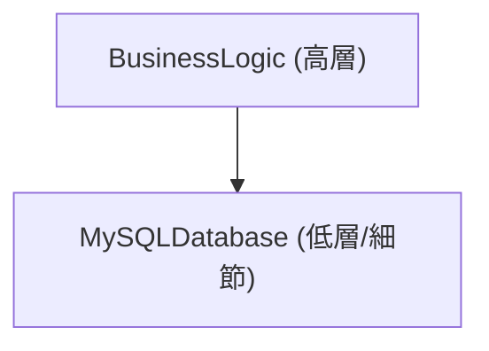
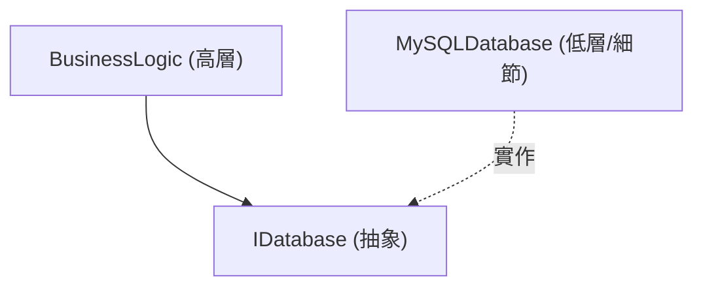

# 物件導向程式設計（OOP）的深淵：歷史、3 大要素與 SOLID 原則

在現代的軟體工程中，物件導向程式設計（Object-Oriented Programming, OOP）是最普及且最重要的典範（Paradigm）之一。從小規模的腳本到數百萬行程式碼的企業級系統，OOP 的概念無所不在。

本篇文章不僅僅停留在對 OOP 的表面理解，還會深入探討其歷史背景、數學與抽象資料型的基礎、3 大要素（封裝、繼承、多型），以及在實務中為了建構穩健軟體而必須了解的 **SOLID 原則**。我們將搭配具體的程式碼範例、邊界情況（Edge cases）以及 Mermaid 圖解來進行徹底的解說。

---

## 1. 物件導向的歷史背景與哲學

OOP 的概念並非一夕之間誕生。其起源可以追溯到 1960 年代，作為應對軟體複雜性的一種典範轉移而持續發展。

### 1.1 Simula 與 Smalltalk 的誕生
物件導向的直系祖先是 1960 年代由挪威計算中心的 Ole-Johan Dahl 與 Kristen Nygaard 所開發的 **Simula 67**。他們為了解決船隻移動等複雜的物理模擬問題，導入了「物件（Object）」與「類別（Class）」的概念。

隨後，在 1970 年代，全錄帕羅奧多研究中心（Xerox PARC）的艾倫·凱（Alan Kay）等人開發了 **Smalltalk**。艾倫·凱是「物件導向」這個詞的創造者，他的願景如下：

> "I thought of objects being like biological cells and/or individual computers on a network, only able to communicate with messages."（我認為物件就像生物學上的細胞，或是網路上的獨立電腦，只能透過訊息進行溝通。）

Smalltalk 中的 OOP 不僅僅是將資料與操作資料的方法整合在一起，它更將重心放在了 **訊息傳遞（Message passing）** 上。

### 1.2 透過 C++ 與 [Java](https://kenji.blog/zh-tw/p/programming-languages-history-paradigm-evolution/) 的普及
進入 1980 年代，Bjarne Stroustrup 開發了 **C++**，這是在 C 語言的基礎上加入了 Simula 的物件導向功能。這使得 OOP 在系統程式設計中得以實用化。接著在 1990 年代，Sun Microsystems 的 James Gosling 等人開發了 **Java**，伴隨著「Write Once, Run Anywhere」的口號，它成為了企業級開發中 OOP 的事實標準（De facto standard）。

### 1.3 形式化與數學背景：抽象資料型（ADT）
OOP 的基礎包含了由芭芭拉·利斯科夫（Barbara Liskov）等人提倡的 **抽象資料型（Abstract Data Type, ADT）** 概念。ADT 在數學上定義了資料結構及其行為（操作）。

例如，在定義堆疊 $ S $ 時，數學上會成立以下公理：

$ \text{pop}(\text{push}(S, x)) = S $
$ \text{top}(\text{push}(S, x)) = x $

可以將 OOP 的類別視為將 ADT 具體化為程式語言語法的產物。將狀態空間 $ X $ 與轉換該狀態的函式群 $ F $ 封裝在一個單位中的就是物件。

---

## 2. 物件導向程式設計的 3 大要素

作為支撐 OOP 的核心概念，「封裝」、「繼承」與「多型」這 3 個要素廣為人知（有時會加上「抽象化」被稱為 4 大要素）。在這裡，我們將深入探討各自的本質，以及在實務上的邊界情況。

### 2.1 封裝（Encapsulation）與資訊隱藏

封裝包含了將資料（屬性）與操作資料的方法（行為）整合在一個單位（類別）中，以及防止從外部直接操作資料的 **資訊隱藏（Information Hiding）** 原則。

#### 目的與好處
- **維持不變條件（Invariant）**: 保證物件始終保持在有效的狀態。
- **降低耦合度**: 即使改變了內部實作，只要外部介面保持不變，就不會影響到使用端的程式碼。

#### 程式碼範例與解說
不良範例（破壞了不變條件）：

```java
public class BankAccount {
    public double balance; // 可以從外部直接存取
}

// 使用端
BankAccount account = new BankAccount();
account.balance = -1000; // 餘額變成負數了！
```

良好範例（透過封裝進行保護）：

```java
public class BankAccount {
    private double balance;

    public BankAccount(double initialBalance) {
        if (initialBalance < 0) throw new IllegalArgumentException("初始餘額必須大於或等於 0。");
        this.balance = initialBalance;
    }

    public void deposit(double amount) {
        if (amount <= 0) throw new IllegalArgumentException("存款金額必須是正數。");
        this.balance += amount;
    }

    public void withdraw(double amount) {
        if (amount <= 0 || this.balance < amount) throw new IllegalArgumentException("無效的提款。");
        this.balance -= amount;
    }

    public double getBalance() {
        return this.balance;
    }
}
```

#### 邊界情況：反射機制造成的破壞
在 [Java](https://kenji.blog/zh-tw/p/programming-languages-history-paradigm-evolution/) 或 C# 等語言中，可以透過反射（Reflection）功能強制作業存取 `private` 欄位。這會帶來封裝被破壞的風險，因此在重視安全性的系統中，必須透過設定安全管理員（Security Manager）或是模組系統（[Java](https://kenji.blog/zh-tw/p/programming-languages-history-paradigm-evolution/) 9 以後）來強化存取控制。

### 2.2 繼承（Inheritance）的光與影

繼承是一種機制，讓新的類別（子類別、衍生類別）能夠繼承現有類別（父類別、基礎類別）的資料與行為。

#### 目的
- **程式碼重用**: 透過將共通的處理邏輯集中在父類別，以消除重複。
- **表達「is-a」關係**: 表達如「狗是一種動物（Dog is an Animal）」這類的領域分類。

#### 多重繼承與菱形問題（Diamond Problem）
在 C++ 等部分語言中，允許從多個父類別繼承的 **多重繼承**，但這存在著著名的「菱形問題」。

```mermaid
classDiagram
    class Animal {
        +eat()
    }
    class Mammal {
        +eat()
    }
    class WingedAnimal {
        +eat()
    }
    class Bat {
    }
    
    "Animal" <|-- "Mammal"
    "Animal" <|-- "WingedAnimal"
    "Mammal" <|-- "Bat"
    "WingedAnimal" <|-- "Bat"
```

當 Bat 呼叫 `eat()` 方法時，會產生應該呼叫 Mammal 還是 WingedAnimal 實作的歧義問題。[Java](https://kenji.blog/zh-tw/p/programming-languages-history-paradigm-evolution/) 和 C# 透過禁止類別的多重繼承，並使用 **介面（Interface）** 來迴避這個問題。

#### 組合優於繼承（Composition over Inheritance）
在現代的 OOP 中，有一種避免過深繼承樹的趨勢。這是因為存在著 **脆弱基礎類別問題（Fragile Base Class Problem）**，亦即父類別的變更會波及到所有的子類別。取而代之的是，建議將其他物件作為欄位保存並委派處理邏輯的 **組合（Composition）**。

### 2.3 多型（Polymorphism：多態性）

多型是指「對於相同的訊息（方法呼叫），根據物件的型別而有不同行為」的特性。

#### 種類
1. **特設多型（多載 / Overload）**: 根據參數的型別或數量呼叫不同的方法。
2. **參數多型（泛型 / Generics）**: 使用型別參數，對任意型別套用相同的演算法。
3. **子型別多型（覆寫 / Override）**: 使用介面或父類別的參考變數來處理子類別的實例，並在執行時期動態分派。

#### 動態分派（vtable）
在 C++ 或 Java 中，子型別多型是透過 **虛擬函式表（vtable）** 的機制來實現的。在物件記憶體區塊的開頭存放著指向 vtable 的指標，並在執行時期解析應該呼叫的函式位址。因此，會產生些微的效能負擔（Overhead）。

```java
interface Shape {
    double calculateArea();
}

class Circle implements Shape {
    private double radius;
    public Circle(double r) { this.radius = r; }
    @Override
    public double calculateArea() { return Math.PI * radius * radius; }
}

class Rectangle implements Shape {
    private double w, h;
    public Rectangle(double w, double h) { this.w = w; this.h = h; }
    @Override
    public double calculateArea() { return w * h; }
}

// 多型的使用
List<Shape> shapes = Arrays.asList(new Circle(5), new Rectangle(4, 6));
for (Shape s : shapes) {
    // 執行時期會根據物件的實際型別呼叫適當的 calculateArea()
    System.out.println(s.calculateArea()); 
}
```

---

## 3. SOLID 原則：物件導向設計的奧義

僅僅了解 OOP 的基本要素，是很難開發出高可維護性與可擴展性的軟體的。因此，由 Robert C. Martin（Uncle Bob）所整理出的 5 個設計原則，即 **SOLID 原則**，就顯得格外重要。

### 3.1 單一職責原則（Single Responsibility Principle: SRP）
**「一個類別應該只有一個改變的理由」**

如果一個類別擁有多個職責，那麼某個需求的變更就會增加影響到其他不相關功能的風險。

#### 反模式與改善方案
例如，假設 `Report` 類別具有產生資料、格式化處理以及儲存到檔案這 3 個職責。

```python
# 不良範例：具有 3 個職責的類別
class Report:
    def __init__(self, data):
        self.data = data
        
    def generate_content(self):
        return f"Data: {self.data}"
        
    def format_as_pdf(self):
        # PDF 化的複雜邏輯
        pass
        
    def save_to_file(self, filename):
        with open(filename, 'w') as f:
            f.write(self.generate_content())
```

我們根據 SRP 將其分割：

```python
# 良好範例：分離職責
class ReportData:
    def __init__(self, data):
        self.data = data

class ReportFormatter:
    def format_to_pdf(self, report_data):
        pass
    def format_to_html(self, report_data):
        pass

class ReportRepository:
    def save(self, content, filename):
        pass
```

### 3.2 開放封閉原則（Open-Closed Principle: OCP）
**「軟體實體（類別、模組、函式等）應該對擴展開放（Open），對修改封閉（Closed）」**

這個原則指出，我們應該設計成可以在不修改現有程式碼的情況下加入新功能。

#### 透過介面進行抽象化
前面提到的圖形（Shape）面積計算的例子，正是符合了 OCP。如果想要新增一個圖形（例如 `Triangle`），完全不需要修改現有的 `Shape` 介面或是處理它的一端程式碼（迴圈部分），只要實作一個新的類別即可。

```mermaid
classDiagram
    class Shape {
        <<interface>>
        +calculateArea() double
    }
    class Circle {
        +calculateArea() double
    }
    class Rectangle {
        +calculateArea() double
    }
    class Triangle {
        +calculateArea() double
    }
    
    "Shape" <|.. "Circle"
    "Shape" <|.. "Rectangle"
    "Shape" <|.. "Triangle"
```

### 3.3 里氏替換原則（Liskov Substitution Principle: LSP）
**「衍生型別必須能夠替換其基礎型別」**

由芭芭拉·利斯科夫提出的這個原則意味著，「如果在預期為父類別的地方傳入子類別，程式的正確性也不應該被破壞」。

#### 著名的違反範例：正方形與長方形問題
在數學上，「正方形是一種長方形」，但在程式設計中並不一定如此。

```java
class Rectangle {
    protected int width;
    protected int height;
    
    public void setWidth(int width) { this.width = width; }
    public void setHeight(int height) { this.height = height; }
    public int getArea() { return width * height; }
}

class Square extends Rectangle {
    @Override
    public void setWidth(int width) {
        this.width = width;
        this.height = width; // 為了維持正方形的約束
    }
    @Override
    public void setHeight(int height) {
        this.width = height;
        this.height = height;
    }
}

// 測試程式碼（使用端）
void testRectangleArea(Rectangle r) {
    r.setWidth(5);
    r.setHeight(4);
    // 如果 r 是 Rectangle，應該會是 20，但如果傳入的是 Square 就會變成 16，導致斷言失敗。
    assert r.getArea() == 20; 
}
```

這個問題的本質在於，`Square` 類別破壞了 `Rectangle` 類別中「寬度與高度可以獨立更改」的前置契約（事前條件）。從契約式設計（Design by Contract）的觀點來看，必須嚴格遵守 LSP。

### 3.4 介面隔離原則（Interface Segregation Principle: ISP）
**「不應該強迫客戶端依賴它們不使用的方法」**

巨大且臃腫的介面（Fat Interface）會強迫實作它的類別去實作不需要的方法。

#### 違反範例與改善
```csharp
// 不良範例：臃腫的介面
public interface IMachine {
    void Print(Document d);
    void Scan(Document d);
    void Fax(Document d);
}

// 單純的印表機既不能掃描也不能傳真，卻被強迫實作這些方法
public class SimplePrinter : IMachine {
    public void Print(Document d) { /* 列印處理 */ }
    public void Scan(Document d) { throw new NotImplementedException(); }
    public void Fax(Document d) { throw new NotImplementedException(); }
}
```

根據角色將介面細分：

```csharp
// 良好範例：介面的隔離
public interface IPrinter {
    void Print(Document d);
}
public interface IScanner {
    void Scan(Document d);
}

public class SimplePrinter : IPrinter {
    public void Print(Document d) { /* 列印處理 */ }
}

public class MultiFunctionPrinter : IPrinter, IScanner {
    public void Print(Document d) { /* 列印處理 */ }
    public void Scan(Document d) { /* 掃描處理 */ }
}
```

### 3.5 依賴反轉原則（Dependency Inversion Principle: DIP）
**「高層模組不應該依賴於低層模組。兩者都應該依賴於抽象。此外，抽象不應該依賴於細節，細節應該依賴於抽象」**

這個原則是大幅降低系統元件之間耦合度的關鍵。

#### 傳統設計（違反 DIP）
高層的業務邏輯直接依賴於低層的具體資料存取類別的狀態。



#### 套用 DIP 的設計
透過在兩者之間加入抽象（介面），來反轉依賴關係的向量。



```java
// 抽象（介面）
public interface UserRepository {
    void save(User user);
}

// 低層模組（細節）
public class MySQLUserRepository implements UserRepository {
    public void save(User user) {
        // 儲存到 MySQL 的具體處理
    }
}

// 高層模組
public class UserService {
    private final UserRepository repository;
    
    // 透過建構子注入（Constructor Injection）來進行依賴注入（DI）
    public UserService(UserRepository repository) {
        this.repository = repository;
    }
    
    public void registerUser(User user) {
        // ... 業務邏輯 ...
        repository.save(user);
    }
}
```

透過這樣的設計，即使將資料庫從 MySQL 改為 PostgreSQL，或是改成測試用的記憶體內資料庫（In-memory DB），`UserService` 的程式碼也完全不需要修改。這就是 **DI（Dependency Injection）框架**（如 Spring, Guice, .NET DI 等）的基礎概念。

---

## 4. OOP 的數學考察與形式化方法

在這裡，讓我們稍微引入一些數學視角來探討 OOP 的型別系統。型別的衍生關係（子型別）通常會使用範疇論或格論（Lattice Theory）來建模。

如果型別 $ A $ 是型別 $ B $ 的子型別，我們將其記為 $ A <: B $。這形成了一個偏序關係（具備反身性、遞移性、反對稱性）。

1. **反身律**: 對於任意型別 $ A $，$ A <: A $
2. **遞移律**: 如果 $ A <: B $ 且 $ B <: C $，則 $ A <: C $

在函式的子型別中，有一個重要的性質：傳回值的型別是 **協變（Covariant）**，而參數的型別是 **逆變（Contravariant）**。

對於函式型別 $ f: P_1 \to R_1 $ 與 $ g: P_2 \to R_2 $，要滿足 $ f <: g $（能夠安全地用函式 $ f $ 取代 $ g $）的條件如下：

$ P_2 <: P_1 \quad \text{且} \quad R_1 <: R_2 $

參數會變成逆變（方向相反）的原因，是將 LSP（里氏替換原則）套用到函式層級的結果。子類別的方法必須接受比父類別方法更寬鬆的條件（更廣的參數型別），並回傳更嚴格的條件（更窄的傳回值型別）。

---

## 5. 總結與未來的物件導向

本文從 OOP 的歷史背景開始，詳細解說了封裝、繼承、多型等基本要素，以及企業級開發中不可或缺的 SOLID 原則。

近年來，函數式程式設計（FP）的典範崛起，不可變性（Immutability）與純函式（Pure Functions）的優勢被重新審視。然而，OOP 與 FP 並非對立的關係。現代的程式語言（Scala, Kotlin, [Rust](https://kenji.blog/zh-tw/p/programming-languages-history-paradigm-evolution/)，以及近期的 C# 與 [Java](https://kenji.blog/zh-tw/p/programming-languages-history-paradigm-evolution/)）正在融合兩者的典範，「使用 OOP 的類別來封裝狀態管理，並以 FP 的方式來建立資料轉換管道」這種混合式設計正逐漸成為主流。

軟體設計中沒有「銀彈（Silver Bullet）」，但對 OOP 的深刻理解與套用 SOLID 原則，將會是建構出能夠長期維護且具備強大適應力系統的有力武器。

---

**參考文獻與推薦書籍:**
1. Erich Gamma, et al. *Design Patterns: Elements of Reusable Object-Oriented Software*. Addison-Wesley.
2. Robert C. Martin. *Clean Architecture: A Craftsman's Guide to Software Structure and Design*. Prentice Hall.
3. Bertrand Meyer. *Object-Oriented Software Construction*. Prentice Hall.
4. Barbara Liskov, Jeannette Wing. *A behavioral notion of subtyping*. ACM Transactions on [Programming Language](https://kenji.blog/zh-tw/p/programming-languages-history-paradigm-evolution/)s and Systems.
