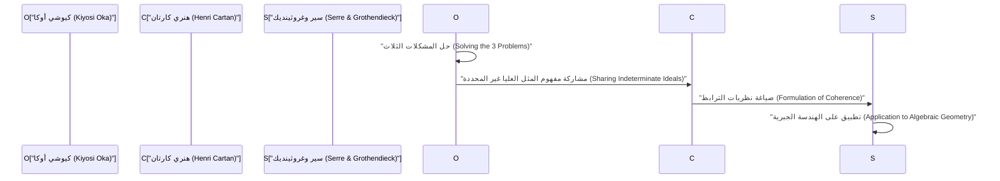
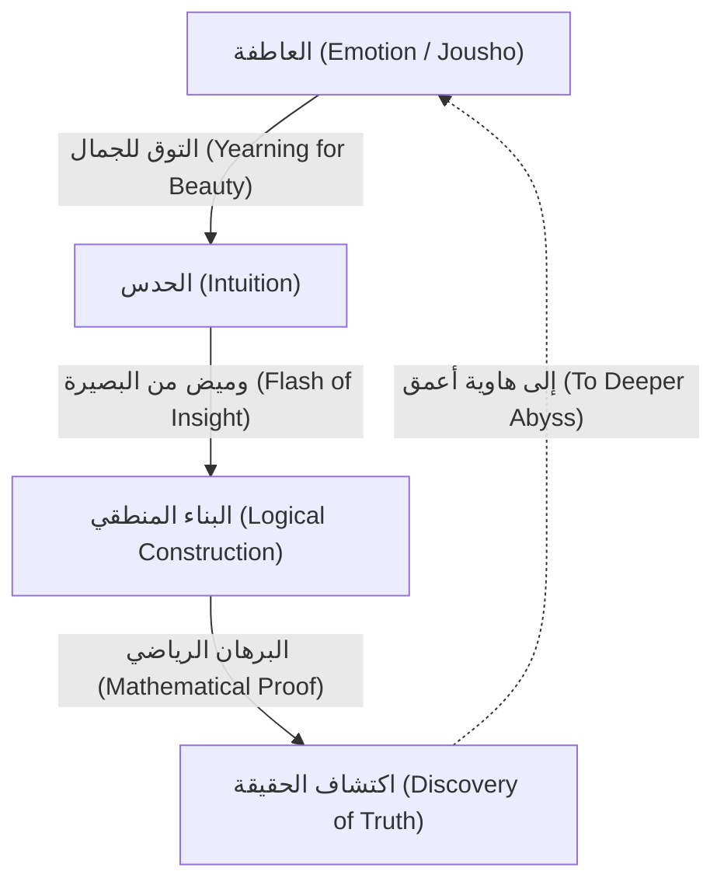

# [كيوشي أوكا](https://kenji.blog/ar/p/oka-kiyoshi/): اندماج الرياضيات والعاطفة

كان [كيوشي أوكا](https://kenji.blog/ar/p/oka-kiyoshi/) (1901-1978) عالم رياضيات يابانيًا ترك إرثًا عالميًا في مجال المتغيرات المركبة المتعددة (Several Complex Variables). تعمل المفاهيم التي تحمل اسمه، مثل "مبرهنة أوكا للترابط" (Oka's coherence theorem) و"مبدأ أوكا" (Oka's principle)، كأسس لا غنى عنها في الرياضيات الحديثة. في هذه المقالة، نفصل حياته الاستثنائية، وفلسفته الفريدة، وإنجازاته الرياضية العميقة في نظرية وظائف المتغيرات المركبة المتعددة دون إغفال أي شيء.

## 1. الحياة المبكرة والمسيرة المهنية: الطريق إلى الرياضيات

ولد [كيوشي أوكا](https://kenji.blog/ar/p/oka-kiyoshi/) في 19 أبريل 1901 في مدينة أوساكا، محافظة أوساكا، ونشأ بعد ذلك في محافظة واكاياما. إن ألفته مع الطبيعة منذ سن مبكرة ونشأته في بيئة تفيض بالعاطفة اليابانية (Jousho) أثرت بشكل كبير على فلسفته اللاحقة.

عند التحاقه بقسم الرياضيات في كلية العلوم بجامعة كيوتو الإمبراطورية، التقى أوكا بموجهين وأصدقاء ممتازين، وأصبح مفتونًا بأعماق الرياضيات. بعد تخرجه، قام بالتدريس كمحاضر في جامعة كيوتو الإمبراطورية أثناء بحثه عن موضوع بحثه الخاص. في ذلك الوقت، كان مجتمع الرياضيات الياباني في فترة انتقالية، يستوعب الرياضيات الغربية ويهدف إلى تحقيق تطوره الفريد. أوكا أيضًا سلك طريق أن يصبح عالم رياضيات مشهورًا عالميًا من خلال تحدي المشكلات الصعبة التي لم يتم حلها.

## 2. الدراسة في فرنسا والوعي بالمتغيرات المركبة المتعددة

في عام 1929، سافر [كيوشي أوكا](https://kenji.blog/ar/p/oka-kiyoshi/) إلى باريس، فرنسا، للدراسة في الخارج كباحث تابع لوزارة التعليم. حددت هذه الإقامة التي استمرت ثلاث سنوات في باريس مصيره كعالم رياضيات بشكل حاسم.

في جامعة باريس، تفاعل مع العباقرة الذين كانوا يقودون عالم الرياضيات الأوروبي في ذلك الوقت، مثل هنري كارتان وغاستون جوليا. وخاصة أثناء تردده على مختبر جوليا، واجه أوكا مجال **المتغيرات المركبة المتعددة**، والذي كان لا يزال حينها برية غير مستكشفة.

في حين تم الانتهاء من التحليل المركب لمتغير واحد بشكل جميل في القرن التاسع عشر من قبل كوشي وريمان وآخرين، كانت هناك صعوبات مختلفة تمامًا تنتظر في حالة المتغيرات المتعددة. ومن الأمثلة التمثيلية على ذلك "ظاهرة هارتوجس".

$$
\text{مبرهنة هارتوجس: في } \mathbb{C}^n \ (n \ge 2) \text{، الدالة الهولومورفية على حدود مجال معين تمتد تلقائيًا بشكل هولومورفي إلى داخل المجال.}
$$

توضح هذه المبرهنة الصلابة المذهلة التي تمتلكها الدوال الهولومورفية ذات المتغيرات المتعددة. عزز أوكا عزمه على تكريس حياته لتوضيح هذا العالم الغامض ذي المتغيرات المتعددة.

## 3. الإنجازات الرياضية: حل المشكلات الثلاث الرئيسية

أعظم إنجاز ل[كيوشي أوكا](https://kenji.blog/ar/p/oka-kiyoshi/) هو حله المستقل لـ "المشكلات الثلاث الرئيسية" في المتغيرات المركبة المتعددة. كانت هذه مشكلات هائلة لم يستطع حتى أعظم العقول في عالم الرياضيات في ذلك الوقت التطرق إليها.

### مشكلات كوزين (Cousin Problems)

تمثل مشكلات كوزين محاولة لتعميم مبرهنة ميتاغ-ليفلر ومبرهنة فايرشتراس في التحليل المركب لمتغير واحد على المتغيرات المتعددة.

*   **مشكلة كوزين الأولى (Cousin I problem):** هل يمكن بناء دالة ميرومورفية عالمية واحدة من توزيع معين للأقطاب (دوال ميرومورفية محلية)؟
*   **مشكلة كوزين الثانية (Cousin II problem):** هل يمكن بناء دالة هولومورفية عالمية واحدة من توزيع معين للأصفار؟

أثبت أوكا أنه يمكن دائمًا حل مشكلة كوزين الأولى في مجالات الهولومورفية (Domains of holomorphy). علاوة على ذلك، فيما يتعلق بمشكلة كوزين الثانية، أوضح أن الشرط الطوبولوجي (تلاشي مجموعة الكوهومولوجي) ضروري، حيث قدم مفهومًا رائدًا يُعرف باسم "مبدأ أوكا".

### مشكلة ليفي (Levi's Problem)

تطرح مشكلة ليفي السؤال التالي: "هل المجالات الزائفة التحدب (Pseudoconvex domains) هي مجالات هولومورفية؟" التحدب الزائف هو شرط هندسي محلي، بينما مجال الهولومورفية هو شرط تحليلي عالمي. التخمين بأن هذين الشرطين متكافئان ظل دون حل لسنوات عديدة.

حل أوكا هذه المشكلة تمامًا بدءًا من بحثه عام 1942 (Oka VI) وحتى بحثه عام 1953 (Oka IX). على وجه الخصوص، كانت تقنيته في "المثل العليا للمجالات غير المحددة" (Ideals of indeterminate domains)، والتي تقرب مجالًا غير معروف بمجالات معروفة، أصلية للغاية لدرجة أنها أذهلت علماء الرياضيات في ذلك الوقت.

### مبرهنة أوكا: اكتشاف الحزم المترابطة

أحد أعمق إنجازات أوكا هو إدخال مفهوم حزم المثل العليا، وإثبات أن حزمة الدوال الهولومورفية مترابطة (coherent)، وهو ما يُعرف باسم **مبرهنة أوكا للترابط**.

$$
\mathcal{O}_{\mathbb{C}^n} \text{ هي حزمة مترابطة (Coherent Sheaf).}
$$

أصبحت هذه المبرهنة أساسًا لـ "نظريات كارتان A و B" لهنري كارتان، وتم تطبيقها لاحقًا على الهندسة الجبرية بواسطة جان بيير سير وألكسندر غروثينديك. ولدت "نظرية الحزم" (Sheaf Theory)، وهي اللغة المشتركة للرياضيات الحديثة، من نضال [كيوشي أوكا](https://kenji.blog/ar/p/oka-kiyoshi/) الانفرادي.

## 4. الانحراف والحياة الانفرادية: حلقات عديدة

يُقال إن العباقرة غالبًا ما يعانون من انحرافات، ولم يكن [كيوشي أوكا](https://kenji.blog/ar/p/oka-kiyoshi/) استثناءً. كانت أفعاله مظهرًا من مظاهر موقفه في السعي النقي وراء الحقيقة.

*   **أحذية مطاطية حتى في الأيام المشمسة:** كان أوكا يمشي غالبًا مرتديًا أحذية مطاطية حتى في الأيام الصافية. يُقال إنه إما كان يبخل بالوقت لربط أربطة الحذاء أو أراد الانغماس في التفكير دون القلق بشأن خطواته.
*   **بدون ربطة عنق:** كان يكره الأشياء الضيقة، ولم يكن من غير المألوف أن يظهر في المؤتمرات الأكاديمية بدون ربطة عنق.
*   **حوار مع الطبيعة:** كان يُرى كثيرًا وهو يتحدث إلى الزهور والأشجار على جانب الطريق أثناء المشي. كان يتحدث مع "الجمال" المخبأ في الطبيعة.

خلال الحرب العالمية الثانية وبعدها، واصل أبحاثه بينما كان يعاني من الفقر المدقع. كانت هناك فترة ابتعد فيها مؤقتًا عن الرياضيات وانخرط في الزراعة في هوكايدو وواكاياما. ومع ذلك، حتى أثناء حرث التربة، كان عقله يتجول في هاوية المتغيرات المركبة المتعددة. وبدون توفر الورق الكافي لكتابة أبحاثه، أنتج روائع تاريخية متتالية.

## 5. فلسفة "جوشو" (العاطفة): جوهر الخلق الرياضي

ما لا غنى عنه عند التحدث عن [كيوشي أوكا](https://kenji.blog/ar/p/oka-kiyoshi/) هو فلسفته الفريدة لـ "جوشو" (العاطفة). في كتابه *عشرة خطابات في ليالي الربيع*، يؤكد: "مركز الرياضيات هو العاطفة".

وفقًا لأوكا، لا تولد الرياضيات الجديدة أبدًا من المنطق وحده. المنطق ليس سوى إطار يتم بناؤه بعد ذلك؛ يكمن مصدره في "التوق إلى الأشياء الجميلة" و"القلب الذي يشعر بالانسجام مع الطبيعة".

لقد أحب بعمق هايكو ماتسو باشو وفلسفة الزن لدى دوغين، مبشرًا بأن "القلب غير الأناني" المتجذر في الثقافة اليابانية ضروري للإبداع الحقيقي. بغض النظر عن مدى تقدم أجهزة الكمبيوتر والذكاء الاصطناعي، كان يعتقد أن هذا الوميض من البصيرة المصحوب بـ "العاطفة" هو امتياز للبشرية وأسمى نشاط عقلي.

## 6. ملحق: مسار أبحاث [كيوشي أوكا](https://kenji.blog/ar/p/oka-kiyoshi/) الرئيسية (Oka I - Oka IX)

عند مناقشة إنجازات [كيوشي أوكا](https://kenji.blog/ar/p/oka-kiyoshi/)، لا يمكن للمرء تجنب الأبحاث التسعة المنشورة بين عامي 1936 و1953، والمعروفة باسم "Oka I" حتى "Oka IX".

1.  **Oka I (1936):** بحث في المجالات المحدبة بعقلانية. هنا تم تعميق مفهوم التحدب في المتغيرات المتعددة لأول مرة.
2.  **Oka II (1937):** حل مشكلة كوزين الأولى في مجالات الهولومورفية.
3.  **Oka III (1939):** نهج رائد لحل مشكلة كوزين الثانية.
4.  **Oka IV (1941):** بحث يقترب من العلاقة بين المجالات الزائفة التحدب ومجالات الهولومورفية.
5.  **Oka V (1942):** تعميم مبرهنة كارتان.
6.  **Oka VI (1942):** حل مشكلة ليفي التي توضح أن المجال الزائف التحدب هو مجال هولومورفي (في حالة متغيرين).
7.  **Oka VII (1950):** مبدأ الاستمرار التحليلي الصاعد في المجالات الزائفة التحدب.
8.  **Oka VIII (1951):** النظرية الأساسية للمثل العليا غير المحددة. يُرى هنا فجر الحزم المترابطة.
9.  **Oka IX (1953):** الحل الكامل لمشكلة ليفي في المجالات الداخلية غير المتفرعة بدون نقاط تفرع.

## 7. التأثير على الأجيال القادمة والإرث

في عام 1960، حصل [كيوشي أوكا](https://kenji.blog/ar/p/oka-kiyoshi/) على وسام الثقافة الياباني تقديراً لإنجازاته التي لا مثيل لها. في وقت لاحق، واصل التدريس في جامعة نارا للمرأة ومؤسسات أخرى، مما أدى إلى رعاية العديد من الخلفاء. في سنواته الأخيرة، ركز أيضًا على الكتابة وإلقاء المحاضرات حول تعليم الرياضيات والثقافة اليابانية، مما أثر بعمق على العديد من القراء العاديين.

حتى وفاته في عام 1978 عن عمر يناهز 76 عامًا، كان يسأل باستمرار: "ما هي الحقيقة؟". نظرية المتغيرات المركبة المتعددة التي كان رائدًا فيها تُطبق الآن على نطاق واسع في الهندسة التفاضلية، والهندسة الجبرية، والفيزياء النظرية. حياة [كيوشي أوكا](https://kenji.blog/ar/p/oka-kiyoshi/) ليست مجرد قصة نجاح عالم رياضيات. إنه سجل لروح بشرية تحاول الوصول إلى الحقيقة المطلقة من خلال الاستماع بعناية إلى صوتها الداخلي في عزلة. الكلمة الرئيسية "العاطفة" التي تركها وراءه تسألنا بهدوء: "ما هو الثراء الحقيقي؟" في مجتمع حديث حيث يميل إلى إعطاء الأولوية للكفاءة والمنطق. زهرة كرز واحدة وحيدة تتفتح في عالم الرياضيات الواسع — كان ذلك الشخص المسمى [كيوشي أوكا](https://kenji.blog/ar/p/oka-kiyoshi/).

## 8. شرح مفصل: ما هو المثل الأعلى غير المحدد؟

دعونا نشرح بمزيد من التفصيل عن "المثل العليا للمجالات غير المحددة"، والتي تعتبر من أعظم اكتشافات أوكا.

في المتغيرات المركبة المتعددة، عند بناء دالة بشكل عام، فإن المفتاح هو كيفية تجميع البيانات المحلية معًا. في حالة المتغير الواحد، نظرًا لأن بنية التفردات بسيطة نسبيًا، فمن السهل تمديد الدالة باستخدام الاستمرار التحليلي. ومع ذلك، في حالة المتغيرات المتعددة، كما يظهر في ظاهرة هارتوجس، لا يتم عزل التفردات ولكنها تشكل أسطحًا زائدة معقدة.

للتغلب على هذه الصعوبة، ابتكر أوكا فكرة مبتكرة للغاية: فبدلاً من تحديد مجال والنظر في الدالة، التقط سلوك الدالة مع تغيير المجال نفسه. هذا هو جوهر "المثل الأعلى غير المحدد".

على وجه التحديد، ضع في اعتبارك الحلقة $\mathcal{O}_p$ التي شكلتها جراثيم الدوال الهولومورفية (germs of holomorphic functions) المحددة في جوار نقطة معينة $p$، وتعامل مع المثل العليا داخلها. قام أوكا ببناء حزمة من المثل العليا (sheaf of ideals) محددة عبر المجال بأكمله وأظهر أنها تتولد محليًا بشكل محدود. هذا هو النموذج الأولي للمفهوم الذي صاغه كارتان وسير لاحقًا كـ "حزمة مترابطة" (coherent sheaf).

هذا النهج قلب الفطرة السليمة للعالم الرياضي في ذلك الوقت من أساسها. من خلال تحويل مشكلة تحليلية تعتمد على شكل المجال إلى مشكلة في البنية الجبرية (المثل العليا) للدوال، فتح الطريق لتطبيق الأساليب القوية للطوبولوجيا والهندسة الجبرية.

## 9. كلمات [كيوشي أوكا](https://kenji.blog/ar/p/oka-kiyoshi/): مجموعة من الاقتباسات

طوال حياته، ترك [كيوشي أوكا](https://kenji.blog/ar/p/oka-kiyoshi/) العديد من الكلمات المليئة بالآثار العميقة. هنا، نقدم بعض الاقتباسات الشهيرة التي تعبر بشكل مناسب عن فلسفته.

*   **"هدف الرياضيات هو السعي وراء الحقيقة. والحقيقة جميلة."**
    (اقتباس يؤكد على أن الحقيقة الرياضية والجمال لا ينفصلان.)
*   **"الحساب ليس رياضيات. هذا شيء يمكن للآلة أن تفعله. الرياضيات هي اكتشاف الانسجام غير المرئي من خلال الحدس."**
    (اقتباس يبشر بأهمية الحدس، ويسبق الاستنتاج المنطقي.)
*   **"مثل البنفسج المتفتح في حقل ربيعي، قلب يبحث ببساطة عن الحقيقة ببراءة. هذه هي القوة الدافعة للإبداع."**
    (اقتباس يعبر عن الروح الشرقية لإنكار الذات، والتخلي عن الأنا والتوحد مع الشيء.)

كما يمكن رؤيته من هذه الكلمات، بالنسبة ل[كيوشي أوكا](https://kenji.blog/ar/p/oka-kiyoshi/)، لم تكن الرياضيات مجرد فرع أكاديمي ولكن يمكن القول إنها "تاو (طريق)" لتوجيه الروح البشرية إلى عوالم أعلى.

## 10. الخلاصة والآفاق

الإرث الذي تركه لنا [كيوشي أوكا](https://kenji.blog/ar/p/oka-kiyoshi/) ليس مجرد نظريات رياضية. أظهر لنا أعلى حالة يمكن للفكر البشري الوصول إليها من خلال أسلوب حياته.

أصبحت الرياضيات الحديثة مقسمة بشكل متزايد ومتخصصة للغاية. علاوة على ذلك، مع التطور السريع للذكاء الاصطناعي (AI)، يقترب عصر سيتم فيه إثبات النظريات الرياضية تلقائيًا بواسطة الآلات. ومع ذلك، بغض النظر عن مدى تقدم التكنولوجيا، طالما لم نفقد "العاطفة" التي تحدث عنها أوكا - الفضول تجاه العوالم غير المعروفة، والتأثر بالأشياء الجميلة، والقلب الذي ينكر الذات الذي يسعى وراء الحقيقة - ستستمر الرياضيات في كونها المسعى الفكري الأكثر روعة وقيمة للبشرية.

من المؤكد أن روح [كيوشي أوكا](https://kenji.blog/ar/p/oka-kiyoshi/) ستستمر في العيش بهدوء ولكن بقوة داخل كل واحد منا يعيش في العصر القادم.

## مواد إضافية: فلسفة أوكا وتداعياتها على العصر الحديث

مفهوم "العاطفة" الذي سعى إليه [كيوشي أوكا](https://kenji.blog/ar/p/oka-kiyoshi/) لم يتلاشَ حتى يومنا هذا؛ بل في المجتمع الحديث تظهر قيمته الحقيقية. في حين يتم السعي وراء الثروة المادية والعقلانية المنطقية إلى أقصى حد، فإن الثراء الروحي للناس والانسجام مع الطبيعة يضيعان. في مثل هذا المجتمع الحديث، تعد فلسفته بمثابة علامة إرشادية.

إن حقيقة أن الشخص الذي وقف في قمة الرياضيات - الانضباط الأكثر صرامة ومنطقية - عاد في النهاية إلى عناصر تبدو غير منطقية وبشرية مثل "العاطفة" و"إنكار الذات" تحتوي على حقيقة عميقة، وإن كانت متناقضة للغاية. إنها تشير إلى أن الإبداع البشري ليس أبدًا امتدادًا للحساب الميكانيكي أو مجرد معالجة المعلومات، ولكنه يولد من أنشطة حياتية أكثر جوهرية ورنين مع الطبيعة. ستستمر رياضيات وفلسفة أوكا في إلقاء الضوء علينا إلى الأبد.

علاوة على ذلك، وبالنظر إلى حياته، يندهش المرء من روحه المرنة، التي لم تستسلم أبدًا في السعي وراء الحقيقة حتى في المواقف الصعبة مثل الفقر المدقع وعدم فهم المحيطين به. أثناء انخراطه في الزراعة لكسب خبزه اليومي، كان يتصارع باستمرار مع المشكلات الصعبة للمتغيرات المركبة المتعددة في ذهنه. كان هذا التركيز العقلي في مثل هذه الظروف القاسية هو القوة الدافعة لتوليد المفهوم الرائد لـ "المثل العليا غير المحددة" والذي قلب الفطرة السليمة الرياضية في ذلك الوقت.

يمكننا أن نتعلم الكثير ليس فقط من الإنجازات الرياضية التي تركها أوكا وراءه ولكن أيضًا من أسلوب حياته نفسه. ما هو الإبداع الحقيقي، وماذا يعني أن تعيش بثراء كإنسان؟ يمكن القول إن حياة [كيوشي أوكا](https://kenji.blog/ar/p/oka-kiyoshi/) تقدم إجابة قوية لهذه الأسئلة الأساسية. الخطوات التي تركها وراءه تستمر في إلهام ليس فقط مجتمع الرياضيات الياباني ولكن الناس في جميع أنحاء العالم.
