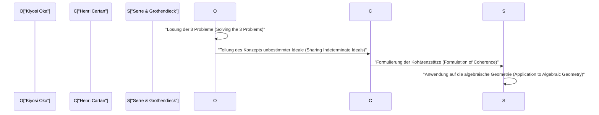
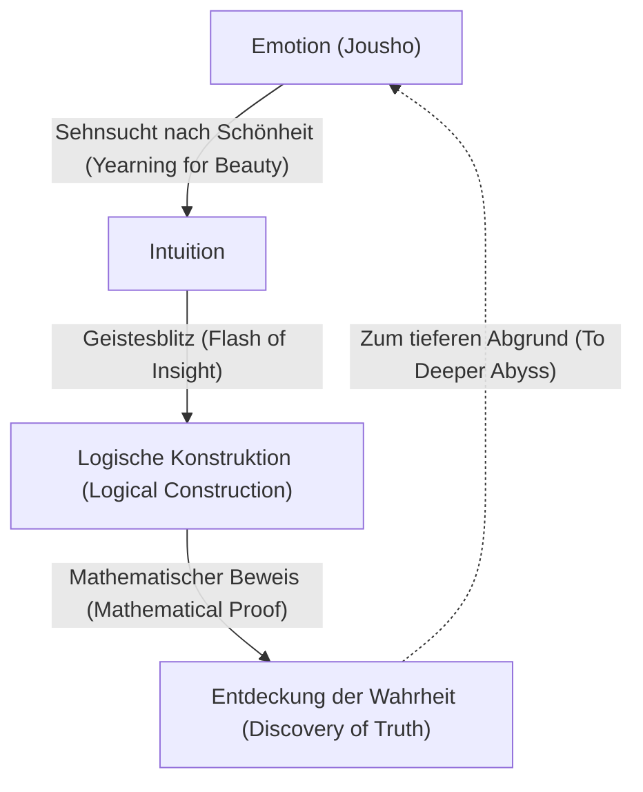

# [Kiyosi Oka](https://kenji.blog/de/p/oka-kiyoshi/): Die Fusion von Mathematik und Emotion

[Kiyosi Oka](https://kenji.blog/de/p/oka-kiyoshi/) (1901–1978) war ein japanischer Mathematiker, der ein Erbe von Weltrang auf dem Gebiet der Funktionentheorie mehrerer komplexer Veränderlicher (Several Complex Variables) hinterließ. Konzepte, die seinen Namen tragen, wie "Okas Kohärenzsatz" (Oka's coherence theorem) und das "Oka-Prinzip" (Oka's principle), dienen als unverzichtbare Grundlagen in der modernen Mathematik. In diesem Artikel detaillieren wir sein außergewöhnliches Leben, seine einzigartige Philosophie und seine tiefgreifenden mathematischen Errungenschaften, ohne etwas auszulassen.

## 1. Frühes Leben und Karriere: Der Weg zur Mathematik

[Kiyosi Oka](https://kenji.blog/de/p/oka-kiyoshi/) wurde am 19. April 1901 in der Stadt Osaka, Präfektur Osaka, geboren und wuchs anschließend in der Präfektur Wakayama auf. Seine Vertrautheit mit der Natur von klein auf und seine Erziehung in einer Umgebung, die überfloss von japanischer Emotion (Jousho), beeinflussten seine spätere Philosophie stark.

Als er in die Fakultät für Mathematik an der Kaiserlichen Universität Kyoto eintrat, traf Oka auf exzellente Mentoren und Freunde und wurde von den Tiefen der Mathematik in den Bann gezogen. Nach seinem Abschluss unterrichtete er als Dozent an der Kaiserlichen Universität Kyoto, während er nach seinem eigenen Forschungsthema suchte. Zu dieser Zeit befand sich die japanische mathematische Gemeinschaft in einer Übergangsphase, in der sie westliche Mathematik absorbierte und darauf abzielte, ihre eigene einzigartige Entwicklung zu erreichen. Auch Oka begab sich auf den Weg, ein weltbekannter Mathematiker zu werden, indem er ungelöste, schwierige Probleme in Angriff nahm.

## 2. Studium in Frankreich und das Erwachen zu mehreren komplexen Veränderlichen

1929 reiste [Kiyosi Oka](https://kenji.blog/de/p/oka-kiyoshi/) nach Paris, Frankreich, um als Überseeforscher für das Bildungsministerium zu studieren. Dieser dreijährige Aufenthalt in Paris bestimmte sein Schicksal als Mathematiker entscheidend.

An der Universität von Paris interagierte er mit Genies, die damals die europäische mathematische Welt anführten, wie Henri Cartan und Gaston Julia. Besonders während seiner häufigen Besuche in Julias Labor stieß Oka auf das Gebiet der **Funktionentheorie mehrerer komplexer Veränderlicher**, das damals noch eine unerforschte Wildnis war.

Während die komplexe Analysis einer Veränderlichen im 19. Jahrhundert von [Cauchy](https://kenji.blog/de/p/cauchy/), [Riemann](https://kenji.blog/de/p/riemann/) und anderen wunderschön vollendet worden war, warteten im Fall von mehreren Veränderlichen völlig andere Schwierigkeiten. Ein repräsentatives Beispiel ist das "Hartogs'sche Phänomen".

$$
\text{Hartogs'scher Satz: In } \mathbb{C}^n \ (n \ge 2) \text{ wird eine Funktion, die auf dem Rand eines bestimmten Gebiets holomorph ist, automatisch holomorph in das Innere des Gebiets fortgesetzt.}
$$

Dieser Satz demonstriert die erstaunliche Starrheit, die holomorphe Funktionen mehrerer Veränderlicher besitzen. Oka festigte seinen Entschluss, sein Leben der Aufklärung dieser mysteriösen Welt der mehreren Veränderlichen zu widmen.

## 3. Mathematische Errungenschaften: Die Lösung der drei großen Probleme

[Kiyosi Oka](https://kenji.blog/de/p/oka-kiyoshi/)s größte Errungenschaft ist es, die "Drei großen Probleme" der Funktionentheorie mehrerer komplexer Veränderlicher unabhängig voneinander gelöst zu haben. Dies waren gewaltige Probleme, die selbst die größten Köpfe der mathematischen Welt jener Zeit nicht lösen konnten.

### Cousin-Probleme (Cousin Problems)

Die Cousin-Probleme stellen den Versuch dar, den Satz von Mittag-Leffler und den Weierstraßschen Produktsatz in der komplexen Analysis einer Veränderlichen auf mehrere Veränderliche zu verallgemeinern.

*   **Erstes Cousin-Problem (Cousin I problem):** Kann aus einer gegebenen Verteilung von Polen (lokalen meromorphen Funktionen) eine einzige globale meromorphe Funktion konstruiert werden?
*   **Zweites Cousin-Problem (Cousin II problem):** Kann aus einer gegebenen Verteilung von Nullstellen eine einzige globale holomorphe Funktion konstruiert werden?

Oka bewies, dass das erste Cousin-Problem in Holomorphiegebieten (Domains of holomorphy) immer gelöst werden kann. Bezüglich des zweiten Cousin-Problems stellte er klar, dass eine topologische Bedingung (das Verschwinden einer Kohomologiegruppe) notwendig ist, und führte ein bahnbrechendes Konzept ein, das als "Oka-Prinzip" bekannt ist.

### Levi-Problem (Levi's Problem)

Das Levi-Problem fragt: "Sind pseudokonvexe Gebiete (Pseudoconvex domains) Holomorphiegebiete?" Pseudokonvexität ist eine lokale, geometrische Bedingung, während ein Holomorphiegebiet eine globale, analytische Bedingung ist. Die Vermutung, dass diese beiden äquivalent sind, blieb viele Jahre ungelöst.

Oka löste dieses Problem vollständig von seiner Arbeit von 1942 (Oka VI) bis zu seiner Arbeit von 1953 (Oka IX). Insbesondere seine Technik der "Ideale unbestimmter Gebiete" (Ideals of indeterminate domains), die ein unbekanntes Gebiet durch bekannte Gebiete approximiert, war so zutiefst originell, dass sie die Mathematiker der Zeit in Erstaunen versetzte.

### Okas Satz: Entdeckung kohärenter Garben

Eine von Okas tiefgreifendsten Errungenschaften ist die Einführung des Konzepts der Idealgarben, womit er bewies, dass die Garbe der holomorphen Funktionen kohärent (coherent) ist, was als **Okas Kohärenzsatz** bekannt ist.

$$
\mathcal{O}_{\mathbb{C}^n} \text{ ist eine kohärente Garbe (Coherent Sheaf).}
$$

Dieser Satz wurde zur Grundlage für Henri Cartans "Theoreme A und B" und wurde später von Jean-Pierre Serre und [Alexander Grothendieck](https://kenji.blog/de/p/grothendieck/) auf die algebraische Geometrie angewendet. Die "Garbentheorie" (Sheaf Theory), die gemeinsame Sprache der modernen Mathematik, entstand aus [Kiyosi Oka](https://kenji.blog/de/p/oka-kiyoshi/)s einsamem Kampf.

## 4. Exzentrizität und ein einsames Leben: Zahlreiche Episoden

Man sagt, dass Genies oft Exzentrizitäten aufweisen, und [Kiyosi Oka](https://kenji.blog/de/p/oka-kiyoshi/) bildete da keine Ausnahme. Seine Handlungen waren Ausdruck seiner Einstellung, rein die Wahrheit zu suchen.

*   **Gummistiefel auch an sonnigen Tagen:** Oka ging oft in Gummistiefeln spazieren, selbst an klaren Tagen. Es heißt, er scheute entweder die Zeit, Schnürsenkel zu binden, oder er wollte sich in Gedanken vertiefen, ohne sich um seinen Tritt sorgen zu müssen.
*   **Keine Krawatte:** Da er enge Dinge hasste, war es nicht ungewöhnlich, dass er ohne Krawatte auf akademischen Konferenzen erschien.
*   **Dialog mit der Natur:** Er wurde oft dabei gesehen, wie er beim Gehen mit Blumen und Bäumen am Straßenrand sprach. Er unterhielt sich mit der "Schönheit", die in der Natur verborgen ist.

Während und nach dem Zweiten Weltkrieg setzte er seine Forschung fort, während er mit extremer Armut kämpfte. Es gab eine Zeit, in der er sich vorübergehend von der Mathematik zurückzog und sich in Hokkaido und Wakayama in der Landwirtschaft engagierte. Doch selbst während er den Boden pflügte, wanderte sein Geist durch den Abgrund der mehreren komplexen Veränderlichen. Ohne überhaupt ausreichend Papier zu haben, um seine Papiere darauf zu schreiben, produzierte er nacheinander historische Meisterwerke.

## 5. Die Philosophie des "Jousho" (Emotion): Das Wesen der mathematischen Kreation

Unverzichtbar, wenn man über [Kiyosi Oka](https://kenji.blog/de/p/oka-kiyoshi/) spricht, ist seine einzigartige Philosophie des "Jousho" (Emotion). In seinem Buch *Zehn Diskurse an Frühlingsabenden* behauptet er: "Das Zentrum der Mathematik ist Emotion."

Laut Oka wird neue Mathematik niemals allein aus Logik geboren. Logik ist lediglich ein Gerüst, das im Nachhinein konstruiert wird; ihre Quelle liegt in einer "Sehnsucht nach schönen Dingen" und einem "Herzen, das Harmonie mit der Natur fühlt".

Er liebte das Haiku von Matsuo Basho und die Zen-Philosophie von Dogen zutiefst und predigte, dass ein "selbstloses Herz", das in der japanischen Kultur verwurzelt ist, für wahre Kreativität unerlässlich ist. Egal wie fortschrittlich Computer und KI werden, er glaubte, dass dieser Geistesblitz, begleitet von "Emotion", ein Privileg der Menschheit und die erhabenste geistige Aktivität ist.

## 6. Anhang: Der Werdegang von [Kiyosi Oka](https://kenji.blog/de/p/oka-kiyoshi/)s wichtigsten Veröffentlichungen (Oka I - Oka IX)

Wenn man über [Kiyosi Oka](https://kenji.blog/de/p/oka-kiyoshi/)s Errungenschaften diskutiert, kann man die neun Arbeiten nicht vermeiden, die zwischen 1936 und 1953 veröffentlicht wurden und als "Oka I" bis "Oka IX" bekannt sind.

1.  **Oka I (1936):** Forschung über rational konvexe Gebiete. Hier wurde das Konzept der Konvexität in mehreren Variablen zum ersten Mal vertieft.
2.  **Oka II (1937):** Lösung des ersten Cousin-Problems in Holomorphiegebieten.
3.  **Oka III (1939):** Ein bahnbrechender Ansatz zur Lösung des zweiten Cousin-Problems.
4.  **Oka IV (1941):** Forschung, die sich der Beziehung zwischen pseudokonvexen Gebieten und Holomorphiegebieten nähert.
5.  **Oka V (1942):** Verallgemeinerung des Satzes von Cartan.
6.  **Oka VI (1942):** Lösung des Levi-Problems, die zeigt, dass ein pseudokonvexes Gebiet ein Holomorphiegebiet ist (im Fall von zwei Variablen).
7.  **Oka VII (1950):** Das Prinzip der analytischen Fortsetzung nach oben in pseudokonvexen Gebieten.
8.  **Oka VIII (1951):** Grundlagentheorie der unbestimmten Ideale. Das Morgenrot der kohärenten Garben ist hier zu sehen.
9.  **Oka IX (1953):** Vollständige Lösung des Levi-Problems in unverzweigten inneren Gebieten ohne Verzweigungspunkte.

## 7. Auswirkungen auf zukünftige Generationen und Erbe

Im Jahr 1960 wurde [Kiyosi Oka](https://kenji.blog/de/p/oka-kiyoshi/) für seine beispiellosen Leistungen mit dem japanischen Kulturorden ausgezeichnet. Anschließend unterrichtete er weiterhin an der Frauenuniversität Nara und anderen Institutionen und förderte viele Nachfolger. In seinen späteren Jahren konzentrierte er sich auch auf das Schreiben und Halten von Vorträgen über Mathematikunterricht und japanische Kultur und berührte damit viele allgemeine Leser zutiefst.

Bis zu seinem Tod im Jahr 1978 im Alter von 76 Jahren fragte er sich ständig: "Was ist Wahrheit?". Die Theorie der mehreren komplexen Veränderlichen, die er pionierhaft entwickelt hat, wird heute weithin in der Differentialgeometrie, der algebraischen Geometrie und der theoretischen Physik angewendet. [Kiyosi Oka](https://kenji.blog/de/p/oka-kiyoshi/)s Leben ist nicht nur die Erfolgsgeschichte eines Mathematikers. Es ist die Aufzeichnung einer menschlichen Seele, die versucht, die absolute Wahrheit zu erreichen, indem sie in der Einsamkeit sorgfältig auf ihre innere Stimme hört. Das von ihm hinterlassene Schlüsselwort "Emotion" fragt uns in einer modernen Gesellschaft, in der Effizienz und Logik tendenziell priorisiert werden, leise: "Was ist wahrer Reichtum?". Eine einzelne, einsame Kirschblüte, die in der riesigen Welt der Mathematik blüht – das war die Person namens [Kiyosi Oka](https://kenji.blog/de/p/oka-kiyoshi/).

## 8. Detaillierte Erklärung: Was ist ein unbestimmtes Ideal?

Lassen Sie uns etwas detaillierter über "Ideale unbestimmter Gebiete" erklären, die als eine der größten Entdeckungen Okas gelten.

Bei mehreren komplexen Variablen liegt der Schlüssel bei der globalen Konstruktion einer Funktion darin, wie man lokale Daten zusammenfügt. Im Fall einer einzigen Variablen ist es, da die Struktur der Singularitäten relativ einfach ist, leicht, die Funktion mittels analytischer Fortsetzung zu erweitern. Im Fall mehrerer Variablen jedoch, wie man beim Hartogs'schen Phänomen sieht, sind Singularitäten nicht isoliert, sondern bilden komplexe Hyperflächen.

Um diese Schwierigkeit zu überwinden, erdachte Oka eine äußerst innovative Idee: Anstatt ein Gebiet zu fixieren und die Funktion zu betrachten, erfasste er das Verhalten der Funktion, während er das Gebiet selbst variierte. Dies ist der Kern des "unbestimmten Ideals".

Konkret betrachte man den Ring $\mathcal{O}_p$, der von den Keimen holomorpher Funktionen (germs of holomorphic functions) gebildet wird, die in der Umgebung eines bestimmten Punktes $p$ definiert sind, und behandle Ideale darin. Oka konstruierte eine Garbe von Idealen (sheaf of ideals), die über das gesamte Gebiet definiert war, und zeigte, dass sie lokal endlich erzeugt ist. Dies ist der Prototyp des Konzepts, das später von Cartan und Serre als "kohärente Garbe" (coherent sheaf) formalisiert wurde.

Dieser Ansatz kippte den gesunden Menschenverstand der mathematischen Welt der damaligen Zeit grundlegend um. Indem er ein analytisches Problem, das von der Form eines Gebiets abhängt, in ein Problem der algebraischen Struktur (Ideale) von Funktionen transformierte, öffnete er den Weg zur Anwendung der mächtigen Methoden der Topologie und der algebraischen Geometrie.

## 9. Worte von [Kiyosi Oka](https://kenji.blog/de/p/oka-kiyoshi/): Eine Sammlung von Zitaten

Im Laufe seines Lebens hinterließ [Kiyosi Oka](https://kenji.blog/de/p/oka-kiyoshi/) viele Worte voller tiefgründiger Implikationen. Hier stellen wir einige berühmte Zitate vor, die seine Philosophie treffend ausdrücken.

*   **"Das Ziel der Mathematik ist das Streben nach Wahrheit. Und die Wahrheit ist schön."**
    (Ein Zitat, das betont, dass mathematische Wahrheit und Schönheit untrennbar miteinander verbunden sind.)
*   **"Rechnen ist nicht Mathematik. Das ist etwas, was eine Maschine tun kann. Mathematik ist die Entdeckung ungesehener Harmonie durch Intuition."**
    (Ein Zitat, das die Wichtigkeit der Intuition predigt, die der logischen Ableitung vorausgeht.)
*   **"Wie ein Veilchen, das in einem Frühlingsfeld blüht, ein Herz, das einfach unschuldig nach der Wahrheit sucht. Das ist die treibende Kraft der Schöpfung."**
    (Ein Zitat, das den fernöstlichen Geist der Selbstlosigkeit ausdrückt, der das Ego ablegt und sich mit dem Objekt vereint.)

Wie aus diesen Worten ersichtlich ist, war Mathematik für [Kiyosi Oka](https://kenji.blog/de/p/oka-kiyoshi/) nicht nur ein Zweig der Akademiker, sondern konnte als ein "Tao (Weg)" bezeichnet werden, um den menschlichen Geist in höhere Sphären zu führen.

## 10. Fazit und Ausblick

Das Erbe, das uns [Kiyosi Oka](https://kenji.blog/de/p/oka-kiyoshi/) hinterlassen hat, besteht nicht nur aus mathematischen Theoremen. Er hat uns durch seine Art zu leben den höchsten [Zustand](https://kenji.blog/de/p/state-management-history-redux-context-recoil-zustand/) gezeigt, den der menschliche Intellekt erreichen kann.

Die moderne Mathematik wird zunehmend unterteilt und hochspezialisiert. Darüber hinaus kommt mit der rasanten Entwicklung der Künstlichen Intelligenz (KI) eine Ära, in der selbst der Beweis mathematischer Theoreme automatisch von Maschinen durchgeführt wird. Egal wie sehr die Technologie fortschreitet, solange die "Emotion", von der Oka sprach – Neugier gegenüber unbekannten Welten, Bewegtsein von schönen Dingen und ein selbstloses Herz, das die Wahrheit sucht – nicht verloren geht, wird die Mathematik weiterhin das faszinierendste und wertvollste intellektuelle Unterfangen für die Menschheit sein.

[Kiyosi Oka](https://kenji.blog/de/p/oka-kiyoshi/)s Geist wird in der kommenden Ära sicherlich leise, aber kraftvoll in jedem von uns weiterleben.

## Zusätzliches Material: Okas Philosophie und Implikationen für die Moderne

Das Konzept der "Emotion", das [Kiyosi Oka](https://kenji.blog/de/p/oka-kiyoshi/) verfolgte, ist auch heute nicht verblasst; vielmehr zeigt sich in der modernen Gesellschaft sein wahrer Wert. Während materieller Reichtum und logische Rationalität bis ans Limit getrieben werden, gehen der spirituelle Reichtum der Menschen und die Harmonie mit der Natur verloren. In einer solchen modernen Gesellschaft dient seine Philosophie als Wegweiser.

Die Tatsache, dass eine Person, die auf dem Gipfel der Mathematik stand – der strengsten und logischsten Disziplin – letztendlich zu scheinbar unlogischen und menschlichen Elementen wie "Emotion" und "Selbstlosigkeit" zurückkehrte, enthält eine tiefe Wahrheit, wenngleich eine sehr paradoxe. Es deutet darauf hin, dass menschliche Kreativität niemals eine Verlängerung mechanischer Berechnungen oder bloßer Informationsverarbeitung ist, sondern aus grundlegenderen Lebensaktivitäten und Resonanz mit der Natur geboren wird. Okas Mathematik und Philosophie werden uns weiterhin für alle Ewigkeit erleuchten.

Wenn man auf sein Leben zurückblickt, staunt man außerdem über seinen widerstandsfähigen Geist, der die Suche nach der Wahrheit selbst in schwierigen Situationen wie extremer Armut und dem Unverständnis der Menschen um ihn herum nie aufgab. Während er sich in der Landwirtschaft betätigte, um sein tägliches Brot zu verdienen, rang er in seinem Geist ununterbrochen mit schwierigen Problemen von mehreren komplexen Veränderlichen. Es war diese mentale Konzentration unter solch extremen Bedingungen, die zur treibenden Kraft wurde, um das bahnbrechende Konzept der "unbestimmten Ideale" zu generieren, das den mathematischen gesunden Menschenverstand der Zeit auf den Kopf stellte.

Wir können viel nicht nur von den mathematischen Errungenschaften lernen, die Oka hinterlassen hat, sondern auch von seiner Art zu leben selbst. Was ist wahre Kreativität, und was bedeutet es, als Mensch reich zu leben? Man kann sagen, dass [Kiyosi Oka](https://kenji.blog/de/p/oka-kiyoshi/)s Leben eine kraftvolle Antwort auf diese fundamentalen Fragen liefert. Die Fußstapfen, die er hinterlassen hat, inspirieren weiterhin nicht nur die japanische mathematische Gemeinschaft, sondern Menschen auf der ganzen Welt.
