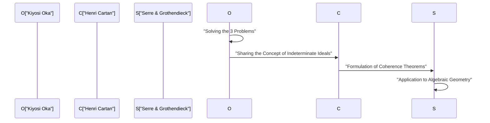
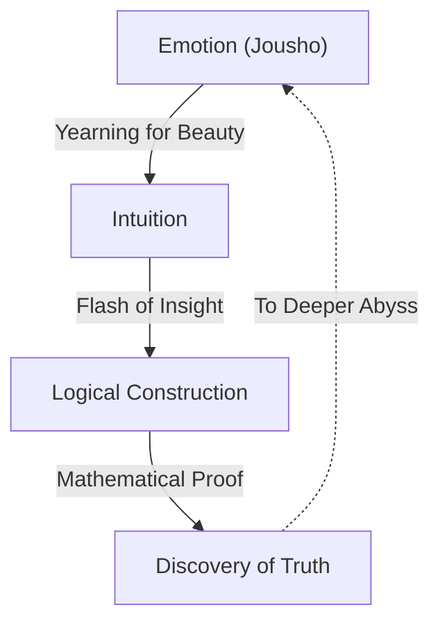

# Kiyosi Oka: The Fusion of Mathematics and Emotion

Kiyosi Oka (1901–1978) was a Japanese mathematician who left a world-class legacy in the field of several complex variables. Concepts bearing his name, such as "Oka's coherence theorem" and "Oka's principle," serve as indispensable foundations in modern mathematics. In this article, we detail his extraordinary life, his unique philosophy, and his profound mathematical achievements in the theory of functions of several complex variables without omitting anything.

## 1. Early Life and Career: The Path to Mathematics

Kiyosi Oka was born on April 19, 1901, in Osaka City, Osaka Prefecture, and was subsequently raised in Wakayama Prefecture. His familiarity with nature from a young age and his upbringing in an environment overflowing with Japanese emotion (Jousho) greatly influenced his later philosophy.

Entering the Department of Mathematics at the Faculty of Science, Kyoto Imperial University, Oka met excellent mentors and friends, becoming captivated by the depths of mathematics. After graduating, he taught as a lecturer at Kyoto Imperial University while searching for his own research theme. At that time, the Japanese mathematical community was in a transitional period, absorbing Western mathematics and aiming to achieve its own unique development. Oka, too, embarked on the path to becoming a world-renowned mathematician by challenging unsolved difficult problems.

## 2. Studying in France and Awakening to Several Complex Variables

In 1929, Kiyosi Oka traveled to Paris, France, to study abroad as an overseas researcher for the Ministry of Education. This three-year stay in Paris decisively determined his destiny as a mathematician.

At the University of Paris, he interacted with geniuses leading the European mathematical world at the time, such as Henri Cartan and Gaston Julia. Particularly while frequenting Julia's laboratory, Oka encountered the field of **several complex variables**, which was then still an unexplored wilderness.

While one-variable complex analysis had been beautifully completed in the 19th century by Cauchy, Riemann, and others, entirely different difficulties awaited in the case of several variables. A representative example is "Hartogs' phenomenon."

$$
\text{Hartogs' Theorem: In } \mathbb{C}^n \ (n \ge 2) \text{, a function that is holomorphic on the boundary of a certain domain is automatically extended holomorphically to the interior of the domain.}
$$

This theorem demonstrates the astonishing rigidity possessed by holomorphic functions of several variables. Oka solidified his resolve to dedicate his life to elucidating this mysterious world of several variables.

## 3. Mathematical Achievements: Solving the Three Major Problems

Kiyosi Oka's greatest achievement is having independently solved the "Three Major Problems" in several complex variables. These were formidable problems that even the greatest minds of the mathematical world at the time could not touch.

### Cousin Problems

Cousin problems represent an attempt to generalize the Mittag-Leffler theorem and the Weierstrass theorem in one-variable complex analysis to several variables.

*   **Cousin I problem:** Can a single global meromorphic function be constructed from a given distribution of poles (local meromorphic functions)?
*   **Cousin II problem:** Can a single global holomorphic function be constructed from a given distribution of zeros?

Oka proved that the Cousin I problem can always be solved in domains of holomorphy. Furthermore, regarding the Cousin II problem, he clarified that a topological condition (the vanishing of a cohomology group) is necessary, introducing a groundbreaking concept known as "Oka's principle."

### Levi's Problem

Levi's problem asks, "Are pseudoconvex domains domains of holomorphy?" Pseudoconvexity is a local, geometric condition, whereas a domain of holomorphy is a global, analytic condition. The conjecture that these two are equivalent remained unsolved for many years.

Oka completely solved this problem from his 1942 paper (Oka VI) through his 1953 paper (Oka IX). In particular, his technique of "ideals of indeterminate domains," which approximates an unknown domain with known domains, was so profoundly original that it astonished mathematicians of the time.

### Oka's Theorem: Discovery of Coherent Sheaves

One of Oka's most profound achievements is the introduction of the concept of ideal sheaves, proving that the sheaf of holomorphic functions is coherent, known as **Oka's coherence theorem**.

$$
\mathcal{O}_{\mathbb{C}^n} \text{ is a coherent sheaf.}
$$

This theorem became the foundation for Henri Cartan's "Cartan's Theorems A and B," and was further applied to algebraic geometry by Jean-Pierre Serre and Alexander Grothendieck. "Sheaf theory," the common language of modern mathematics, was born from Kiyosi Oka's solitary struggle.

## 4. Eccentricity and a Solitary Life: Numerous Episodes

It is said that geniuses often have eccentricities, and Kiyosi Oka was no exception. His actions were a manifestation of his attitude to purely pursue truth.

*   **Rubber boots even on sunny days:** Oka often walked wearing rubber boots even on clear days. It is said he either grudged the time to tie shoelaces or wanted to indulge in thought without worrying about his footing.
*   **No tie:** Hating tight things, it was not uncommon for him to appear at academic conferences without a tie.
*   **Dialogue with nature:** He was frequently seen talking to roadside flowers and trees as he walked. He was conversing with the "beauty" hidden in nature.

During and after World War II, he continued his research while battling extreme poverty. There was a time when he temporarily stepped away from mathematics and engaged in farming in Hokkaido and Wakayama. Yet, even while tilling the soil, his mind was wandering through the abyss of several complex variables. Without even adequate paper to write his papers on, he consecutively produced historical masterpieces.

## 5. The Philosophy of "Jousho" (Emotion): The Essence of Mathematical Creation

Indispensable when talking about Kiyosi Oka is his unique philosophy of "Jousho" (Emotion). In his book *Ten Discourses on Spring Evenings*, he asserts, "The center of mathematics is emotion."

According to Oka, new mathematics is never born from logic alone. Logic is merely a framework constructed afterward; its source lies in a "yearning for beautiful things" and a "heart that feels harmony with nature."

He deeply loved the haiku of Matsuo Basho and the Zen philosophy of Dogen, preaching that a "selfless heart" rooted in Japanese culture is essential for true creativity. No matter how advanced computers and AI become, he believed that this flash of insight accompanied by "emotion" is a privilege of humanity and the most sublime mental activity.

## 6. Appendix: The Trajectory of Kiyosi Oka's Major Papers (Oka I - Oka IX)

When discussing Kiyosi Oka's achievements, one cannot avoid the nine papers published between 1936 and 1953, known as "Oka I" through "Oka IX."

1.  **Oka I (1936):** Research on rationally convex domains. Here, the concept of convexity in several variables was deepened for the first time.
2.  **Oka II (1937):** Solution of the first Cousin problem in domains of holomorphy.
3.  **Oka III (1939):** A groundbreaking approach toward solving the second Cousin problem.
4.  **Oka IV (1941):** Research approaching the relationship between pseudoconvex domains and domains of holomorphy.
5.  **Oka V (1942):** Generalization of Cartan's theorem.
6.  **Oka VI (1942):** Solution of Levi's problem showing that a pseudoconvex domain is a domain of holomorphy (in the case of two variables).
7.  **Oka VII (1950):** The principle of upward continuation in pseudoconvex domains.
8.  **Oka VIII (1951):** Basic theory of indeterminate ideals. The dawn of coherent sheaves is seen here.
9.  **Oka IX (1953):** Complete solution of Levi's problem in unramified inner domains without branch points.

## 7. Impact on Future Generations and Legacy

In 1960, Kiyosi Oka was awarded the Japanese Order of Culture for his unparalleled achievements. Subsequently, he continued to teach at Nara Women's University and other institutions, fostering many successors. In his later years, he also focused on writing and lecturing about mathematics education and Japanese culture, deeply moving many general readers.

Until he passed away in 1978 at the age of 76, he continually asked, "What is truth?" The theory of several complex variables that he pioneered is now widely applied to differential geometry, algebraic geometry, and theoretical physics. Kiyosi Oka's life is not merely a success story of a mathematician. It is a record of a human soul trying to reach absolute truth by listening carefully to its inner voice in solitude. The keyword "emotion" he left behind quietly asks us, "What is true richness?" in a modern society where efficiency and logic tend to be prioritized. A single, solitary cherry blossom blooming in the vast world of mathematics—that was the person named Kiyosi Oka.

## 8. Detailed Explanation: What is an Indeterminate Ideal?

Let us explain a bit more in detail about "ideals of indeterminate domains," considered one of Oka's greatest discoveries.

In several complex variables, when constructing a function globally, the key is how to piece together local data. In the case of one variable, since the structure of singularities is relatively simple, it is easy to extend the function using analytic continuation. However, in the case of several variables, as seen in Hartogs' phenomenon, singularities are not isolated but form complex hypersurfaces.

To overcome this difficulty, Oka conceived an extremely innovative idea: rather than fixing a domain and considering the function, he captured the behavior of the function while varying the domain itself. This is the core of the "indeterminate ideal."

Specifically, consider the ring $\mathcal{O}_p$ formed by the germs of holomorphic functions defined in the neighborhood of a certain point $p$, and deal with ideals within it. Oka constructed a sheaf of ideals defined over the entire domain and showed that it is locally finitely generated. This is the prototype of the concept later formalized by Cartan and Serre as a "coherent sheaf."

This approach fundamentally overturned the common sense of the mathematical world at the time. By transforming an analytic problem dependent on the shape of a domain into a problem of the algebraic structure (ideals) of functions, he opened the path to applying the powerful methods of topology and algebraic geometry.

## 9. Words of Kiyosi Oka: A Collection of Quotes

Throughout his life, Kiyosi Oka left many words full of profound implications. Here, we introduce some famous quotes that aptly express his philosophy.

*   **"The goal of mathematics is the pursuit of truth. And truth is beautiful."**
    (A quote emphasizing that mathematical truth and beauty are inseparable.)
*   **"Calculating is not mathematics. That is something a machine can do. Mathematics is discovering unseen harmony through intuition."**
    (A quote preaching the importance of intuition, preceding logical deduction.)
*   **"Like a violet blooming in a spring field, a heart that simply seeks truth innocently. That is the driving force of creation."**
    (A quote expressing the Oriental spirit of selflessness, discarding the ego and unifying with the object.)

As can be seen from these words, for Kiyosi Oka, mathematics was not merely a branch of academics but could be said to be a "Tao (Path)" for guiding the human spirit to higher realms.

## 10. Conclusion and Prospects

The legacy Kiyosi Oka left us is not just mathematical theorems. He showed us the highest state that human intellect can reach through his way of life.

Modern mathematics is becoming increasingly subdivided and highly specialized. Furthermore, with the rapid development of artificial intelligence (AI), an era is arriving where even the proof of mathematical theorems will be automatically performed by machines. However, no matter how much technology advances, as long as the "emotion" that Oka spoke of—curiosity toward unknown worlds, being moved by beautiful things, and a selfless heart pursuing truth—is not lost, mathematics will continue to be the most fascinating and valuable intellectual endeavor for humanity.

Kiyosi Oka's spirit will surely continue to live quietly yet powerfully within each of us living in the coming era.

## Additional Material: Oka's Philosophy and Implications for the Modern Era

The concept of "emotion" pursued by Kiyosi Oka has not faded even today; rather, it is in modern society that its true value is demonstrated. While material wealth and logical rationality are pursued to the limit, the spiritual richness of people and harmony with nature are being lost. In such a modern era, his philosophy serves as a guidepost.

The fact that a person who stood at the summit of mathematics—the most rigorous and logical discipline—ultimately returned to seemingly illogical and human elements like "emotion" and "selflessness" contains a deep truth, albeit very paradoxical. It suggests that human creativity is never an extension of mechanical calculation or mere information processing, but is born from more fundamental life activities and resonance with nature. Oka's mathematics and philosophy will continue to illuminate us for all eternity.

Furthermore, looking back on his life, one is amazed by his resilient spirit, never giving up on the pursuit of truth even in difficult situations like extreme poverty and the incomprehension of those around him. While engaging in agriculture to earn his daily bread, he was constantly wrestling with difficult problems of several complex variables in his mind. It was this mental concentration in such extreme conditions that became the driving force to generate the groundbreaking concept of "indeterminate ideals" that overturned the mathematical common sense of the time.

We can learn a lot not only from the mathematical achievements Oka left behind but also from his way of life itself. What is true creativity, and what does it mean to live richly as a human being? It can be said that Kiyosi Oka's life provides a powerful answer to these fundamental questions. The footsteps he left continue to inspire not only the Japanese mathematical community but people all over the world.
