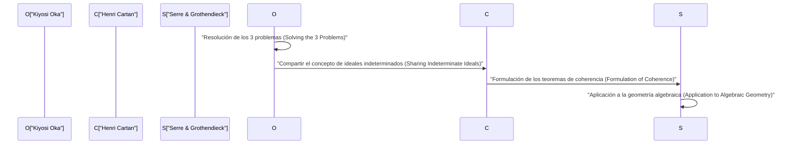
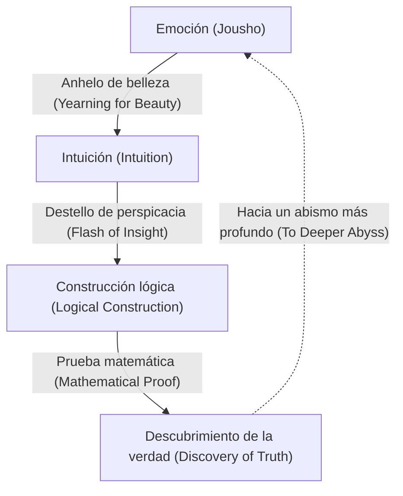

# [Kiyosi Oka](https://kenji.blog/es/p/oka-kiyoshi/): La fusión de las matemáticas y la emoción

[Kiyosi Oka](https://kenji.blog/es/p/oka-kiyoshi/) (1901–1978) fue un matemático japonés que dejó un legado de clase mundial en el campo de varias variables complejas (Several Complex Variables). Los conceptos que llevan su nombre, como el "teorema de coherencia de Oka" (Oka's coherence theorem) y el "principio de Oka" (Oka's principle), sirven como fundamentos indispensables en las matemáticas modernas. En este artículo, detallamos su extraordinaria vida, su filosofía única y sus profundos logros matemáticos en la teoría de funciones de varias variables complejas sin omitir nada.

## 1. Primeros años y carrera: El camino hacia las matemáticas

[Kiyosi Oka](https://kenji.blog/es/p/oka-kiyoshi/) nació el 19 de abril de 1901 en la ciudad de Osaka, prefectura de Osaka, y posteriormente se crió en la prefectura de Wakayama. Su familiaridad con la naturaleza desde una edad temprana y su crianza en un entorno rebosante de emoción japonesa (Jousho) influyeron en gran medida en su filosofía posterior.

Al ingresar al Departamento de Matemáticas de la Facultad de Ciencias de la Universidad Imperial de Kioto, Oka conoció a excelentes mentores y amigos, quedando cautivado por las profundidades de las matemáticas. Después de graduarse, enseñó como profesor en la Universidad Imperial de Kioto mientras buscaba su propio tema de investigación. En ese momento, la comunidad matemática japonesa se encontraba en un período de transición, absorbiendo las matemáticas occidentales y aspirando a lograr su propio desarrollo único. Oka también se embarcó en el camino para convertirse en un matemático de renombre mundial desafiando problemas difíciles no resueltos.

## 2. Estudiar en Francia y el despertar a varias variables complejas

En 1929, [Kiyosi Oka](https://kenji.blog/es/p/oka-kiyoshi/) viajó a París, Francia, para estudiar en el extranjero como investigador para el Ministerio de Educación. Esta estancia de tres años en París determinó decisivamente su destino como matemático.

En la Universidad de París, interactuó con genios que lideraban el mundo matemático europeo en ese momento, como Henri Cartan y Gaston Julia. Particularmente mientras frecuentaba el laboratorio de Julia, Oka encontró el campo de **varias variables complejas**, que entonces todavía era un desierto inexplorado.

Si bien el análisis complejo de una variable había sido bellamente completado en el siglo XIX por [Cauchy](https://kenji.blog/es/p/cauchy/), [Riemann](https://kenji.blog/es/p/riemann/) y otros, dificultades completamente diferentes esperaban en el caso de varias variables. Un ejemplo representativo es el "fenómeno de Hartogs".

$$
\text{Teorema de Hartogs: En } \mathbb{C}^n \ (n \ge 2) \text{, una función que es holomorfa en la frontera de un cierto dominio se extiende automáticamente holomórficamente al interior del dominio.}
$$

Este teorema demuestra la asombrosa rigidez que poseen las funciones holomorfas de varias variables. Oka consolidó su resolución de dedicar su vida a dilucidar este misterioso mundo de varias variables.

## 3. Logros matemáticos: Resolviendo los tres grandes problemas

El mayor logro de [Kiyosi Oka](https://kenji.blog/es/p/oka-kiyoshi/) es haber resuelto independientemente los "Tres Grandes Problemas" en varias variables complejas. Estos eran problemas formidables que ni siquiera las mentes más brillantes del mundo matemático en ese momento podían tocar.

### Problemas de Cousin (Cousin Problems)

Los problemas de Cousin representan un intento de generalizar el teorema de Mittag-Leffler y el teorema de Weierstrass en el análisis complejo de una variable a varias variables.

*   **Primer problema de Cousin (Cousin I problem):** ¿Se puede construir una sola función meromorfa global a partir de una distribución dada de polos (funciones meromorfas locales)?
*   **Segundo problema de Cousin (Cousin II problem):** ¿Se puede construir una sola función holomorfa global a partir de una distribución dada de ceros?

Oka demostró que el primer problema de Cousin siempre se puede resolver en dominios de holomorfía (Domains of holomorphy). Además, con respecto al segundo problema de Cousin, aclaró que es necesaria una condición topológica (la anulación de un grupo de cohomología), introduciendo un concepto revolucionario conocido como el "principio de Oka".

### Problema de Levi (Levi's Problem)

El problema de Levi pregunta: "¿Son los dominios pseudoconvexos (Pseudoconvex domains) dominios de holomorfía?" La pseudoconvexidad es una condición local y geométrica, mientras que un dominio de holomorfía es una condición global y analítica. La conjetura de que estas dos son equivalentes permaneció sin resolver durante muchos años.

Oka resolvió completamente este problema desde su artículo de 1942 (Oka VI) hasta su artículo de 1953 (Oka IX). En particular, su técnica de "ideales de dominios indeterminados" (Ideals of indeterminate domains), que aproxima un dominio desconocido con dominios conocidos, fue tan profundamente original que asombró a los matemáticos de la época.

### Teorema de Oka: Descubrimiento de haces coherentes

Uno de los logros más profundos de Oka es la introducción del concepto de haces de ideales, demostrando que el haz de funciones holomorfas es coherente (coherent), conocido como el **teorema de coherencia de Oka**.

$$
\mathcal{O}_{\mathbb{C}^n} \text{ es un haz coherente (Coherent Sheaf).}
$$

Este teorema se convirtió en la base de los "Teoremas A y B de Cartan" de Henri Cartan, y posteriormente fue aplicado a la geometría algebraica por Jean-Pierre Serre y [Alexander Grothendieck](https://kenji.blog/es/p/grothendieck/). La "teoría de haces" (Sheaf Theory), el lenguaje común de las matemáticas modernas, nació de la lucha solitaria de [Kiyosi Oka](https://kenji.blog/es/p/oka-kiyoshi/).

## 4. Excentricidad y una vida solitaria: Numerosos episodios

Se dice que los genios a menudo tienen excentricidades, y [Kiyosi Oka](https://kenji.blog/es/p/oka-kiyoshi/) no fue la excepción. Sus acciones fueron una manifestación de su actitud para perseguir puramente la verdad.

*   **Botas de goma incluso en días soleados:** Oka a menudo caminaba con botas de goma incluso en días despejados. Se dice que le molestaba perder el tiempo atándose los cordones o que quería sumergirse en sus pensamientos sin preocuparse por sus pasos.
*   **Sin corbata:** Odiando las cosas apretadas, no era raro que apareciera en conferencias académicas sin corbata.
*   **Diálogo con la naturaleza:** Con frecuencia se le veía hablando con las flores y los árboles de la calle mientras caminaba. Estaba conversando con la "belleza" oculta en la naturaleza.

Durante y después de la Segunda Guerra Mundial, continuó su investigación mientras luchaba contra la pobreza extrema. Hubo un tiempo en que se alejó temporalmente de las matemáticas y se dedicó a la agricultura en Hokkaido y Wakayama. Sin embargo, incluso mientras labraba la tierra, su mente deambulaba por el abismo de varias variables complejas. Sin tener siquiera suficiente papel para escribir sus artículos, produjo consecutivamente obras maestras históricas.

## 5. La filosofía de "Jousho" (Emoción): La esencia de la creación matemática

Indispensable al hablar de [Kiyosi Oka](https://kenji.blog/es/p/oka-kiyoshi/) es su filosofía única de "Jousho" (Emoción). En su libro *Diez discursos en las noches de primavera*, afirma: "El centro de las matemáticas es la emoción".

Según Oka, las nuevas matemáticas nunca nacen solo de la lógica. La lógica es simplemente un marco construido posteriormente; su fuente reside en un "anhelo de cosas hermosas" y un "corazón que siente armonía con la naturaleza".

Amaba profundamente el haiku de Matsuo Basho y la filosofía zen de Dogen, predicando que un "corazón desinteresado" arraigado en la cultura japonesa es esencial para la verdadera creatividad. No importa cuán avanzados lleguen a ser los ordenadores y la IA, creía que este destello de perspicacia acompañado de "emoción" es un privilegio de la humanidad y la actividad mental más sublime.

## 6. Apéndice: La trayectoria de los artículos principales de [Kiyosi Oka](https://kenji.blog/es/p/oka-kiyoshi/) (Oka I - Oka IX)

Al discutir los logros de [Kiyosi Oka](https://kenji.blog/es/p/oka-kiyoshi/), no se pueden evitar los nueve artículos publicados entre 1936 y 1953, conocidos como "Oka I" a "Oka IX".

1.  **Oka I (1936):** Investigación sobre dominios racionalmente convexos. Aquí se profundizó por primera vez el concepto de convexidad en varias variables.
2.  **Oka II (1937):** Resolución del primer problema de Cousin en dominios de holomorfía.
3.  **Oka III (1939):** Un enfoque revolucionario para resolver el segundo problema de Cousin.
4.  **Oka IV (1941):** Investigación que aborda la relación entre dominios pseudoconvexos y dominios de holomorfía.
5.  **Oka V (1942):** Generalización del teorema de Cartan.
6.  **Oka VI (1942):** Resolución del problema de Levi demostrando que un dominio pseudoconvexo es un dominio de holomorfía (en el caso de dos variables).
7.  **Oka VII (1950):** El principio de continuación hacia arriba en dominios pseudoconvexes.
8.  **Oka VIII (1951):** Teoría básica de los ideales indeterminados. Aquí se ve el amanecer de los haces coherentes.
9.  **Oka IX (1953):** Resolución completa del problema de Levi en dominios internos no ramificados sin puntos de ramificación.

## 7. Impacto en las generaciones futuras y legado

En 1960, [Kiyosi Oka](https://kenji.blog/es/p/oka-kiyoshi/) fue galardonado con la Orden de la Cultura de Japón por sus logros sin precedentes. Posteriormente, continuó enseñando en la Universidad de Mujeres de Nara y otras instituciones, fomentando a muchos sucesores. En sus últimos años, también se centró en escribir y dar conferencias sobre la educación matemática y la cultura japonesa, conmoviendo profundamente a muchos lectores generales.

Hasta que falleció en 1978 a la edad de 76 años, preguntaba continuamente: "¿Qué es la verdad?". La teoría de varias variables complejas en la que fue pionero se aplica hoy en día ampliamente a la geometría diferencial, la geometría algebraica y la física teórica. La vida de [Kiyosi Oka](https://kenji.blog/es/p/oka-kiyoshi/) no es simplemente la historia de éxito de un matemático. Es el registro de un alma humana que intenta alcanzar la verdad absoluta escuchando atentamente su voz interior en soledad. La palabra clave "emoción" que dejó atrás nos pregunta en silencio: "¿Qué es la verdadera riqueza?" en una sociedad moderna donde la eficiencia y la lógica tienden a priorizarse. Un solo cerezo solitario floreciendo en el vasto mundo de las matemáticas, esa fue la persona llamada [Kiyosi Oka](https://kenji.blog/es/p/oka-kiyoshi/).

## 8. Explicación detallada: ¿Qué es un ideal indeterminado?

Expliquemos un poco más en detalle sobre los "ideales de dominios indeterminados", considerados uno de los mayores descubrimientos de Oka.

En varias variables complejas, al construir una función globalmente, la clave es cómo unir datos locales. En el caso de una variable, dado que la estructura de las singularidades es relativamente simple, es fácil extender la función usando continuación analítica. Sin embargo, en el caso de varias variables, como se ve en el fenómeno de Hartogs, las singularidades no están aisladas, sino que forman hipersuperficies complejas.

Para superar esta dificultad, Oka concibió una idea extremadamente innovadora: en lugar de fijar un dominio y considerar la función, capturó el comportamiento de la función mientras variaba el dominio en sí. Este es el núcleo del "ideal indeterminado".

Específicamente, considere el anillo $\mathcal{O}_p$ formado por los gérmenes de funciones holomorfas (germs of holomorphic functions) definidos en la vecindad de un cierto punto $p$, y trate los ideales dentro de él. Oka construyó un haz de ideales (sheaf of ideals) definido sobre todo el dominio y demostró que es localmente finamente generado. Este es el prototipo del concepto luego formalizado por Cartan y Serre como un "haz coherente" (coherent sheaf).

Este enfoque anuló fundamentalmente el sentido común del mundo matemático de la época. Al transformar un problema analítico dependiente de la forma de un dominio en un problema de la estructura algebraica (ideales) de las funciones, abrió el camino para aplicar los poderosos métodos de la topología y la geometría algebraica.

## 9. Palabras de [Kiyosi Oka](https://kenji.blog/es/p/oka-kiyoshi/): Una colección de citas

A lo largo de su vida, [Kiyosi Oka](https://kenji.blog/es/p/oka-kiyoshi/) dejó muchas palabras llenas de profundas implicaciones. Aquí, presentamos algunas citas famosas que expresan acertadamente su filosofía.

*   **"El objetivo de las matemáticas es la búsqueda de la verdad. Y la verdad es hermosa".**
    (Una cita que enfatiza que la verdad matemática y la belleza son inseparables).
*   **"Calcular no es matemáticas. Eso es algo que puede hacer una máquina. Las matemáticas consisten en descubrir una armonía invisible a través de la intuición".**
    (Una cita que predica la importancia de la intuición, que precede a la deducción lógica).
*   **"Como una violeta que florece en un campo primaveral, un corazón que simplemente busca la verdad con inocencia. Esa es la fuerza motriz de la creación".**
    (Una cita que expresa el espíritu oriental de altruismo, descartando el ego y unificándose con el objeto).

Como se puede ver a partir de estas palabras, para [Kiyosi Oka](https://kenji.blog/es/p/oka-kiyoshi/), las matemáticas no eran simplemente una rama académica, sino que podrían considerarse un "Tao (Camino)" para guiar el espíritu humano a reinos superiores.

## 10. Conclusión y perspectivas

El legado que nos dejó [Kiyosi Oka](https://kenji.blog/es/p/oka-kiyoshi/) no son solo teoremas matemáticos. Nos mostró el estado más alto que el intelecto humano puede alcanzar a través de su forma de vida.

Las matemáticas modernas se están volviendo cada vez más subdivididas y altamente especializadas. Además, con el rápido desarrollo de la inteligencia artificial (IA), se avecina una era en la que incluso la demostración de teoremas matemáticos se realizará automáticamente mediante máquinas. Sin embargo, no importa cuánto avance la tecnología, siempre y cuando la "emoción" de la que habló Oka (curiosidad hacia mundos desconocidos, conmoverse por cosas hermosas y un corazón desinteresado persiguiendo la verdad) no se pierda, las matemáticas seguirán siendo el esfuerzo intelectual más fascinante y valioso para la humanidad.

El espíritu de [Kiyosi Oka](https://kenji.blog/es/p/oka-kiyoshi/) seguramente continuará viviendo en silencio, pero poderosamente dentro de cada uno de nosotros que vivimos en la era venidera.

## Material adicional: La filosofía de Oka y sus implicaciones para la era moderna

El concepto de "emoción" perseguido por [Kiyosi Oka](https://kenji.blog/es/p/oka-kiyoshi/) no se ha desvanecido ni siquiera hoy; más bien, es en la sociedad moderna donde se demuestra su verdadero valor. Mientras la riqueza material y la racionalidad lógica se persiguen hasta el límite, la riqueza espiritual de las personas y la armonía con la naturaleza se están perdiendo. En tal sociedad moderna, su filosofía sirve como un faro.

El hecho de que una persona que se encontraba en la cima de las matemáticas (la disciplina más rigurosa y lógica) regresara en última instancia a elementos aparentemente ilógicos y humanos como la "emoción" y el "altruismo" contiene una profunda verdad, aunque muy paradójica. Sugiere que la creatividad humana nunca es una extensión del cálculo mecánico o el mero procesamiento de información, sino que nace de actividades vitales más fundamentales y la resonancia con la naturaleza. Las matemáticas y la filosofía de Oka seguirán iluminándonos por toda la eternidad.

Además, recordando su vida, uno se sorprende por su espíritu resistente, que nunca se dio por vencido en la búsqueda de la verdad ni siquiera en situaciones difíciles como la pobreza extrema y la incomprensión de quienes lo rodeaban. Mientras se dedicaba a la agricultura para ganarse el pan de cada día, luchaba constantemente en su mente con problemas difíciles de varias variables complejas. Fue esta concentración mental en condiciones tan extremas lo que se convirtió en la fuerza motriz para generar el innovador concepto de "ideales indeterminados" que derribó el sentido común matemático de la época.

Podemos aprender mucho no solo de los logros matemáticos que Oka dejó atrás, sino también de su forma de vida en sí. ¿Qué es la verdadera creatividad y qué significa vivir ricamente como ser humano? Se puede decir que la vida de [Kiyosi Oka](https://kenji.blog/es/p/oka-kiyoshi/) proporciona una respuesta poderosa a estas preguntas fundamentales. Las huellas que dejó siguen inspirando no solo a la comunidad matemática japonesa, sino a personas de todo el mundo.
