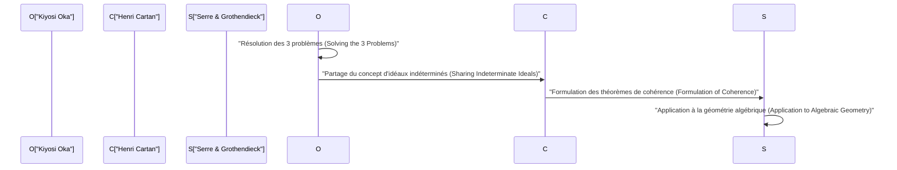
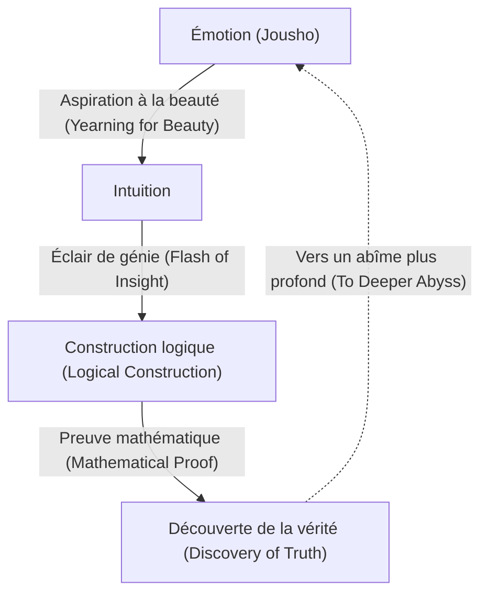

# [Kiyosi Oka](https://kenji.blog/fr/p/oka-kiyoshi/) : La fusion des mathématiques et de l'émotion

[Kiyosi Oka](https://kenji.blog/fr/p/oka-kiyoshi/) (1901–1978) fut un mathématicien japonais qui laissa un héritage de classe mondiale dans le domaine de l'analyse à plusieurs variables complexes. Les concepts qui portent son nom, tels que le « théorème de cohérence d'Oka » (Oka's coherence theorem) et le « principe d'Oka » (Oka's principle), servent de fondations indispensables aux mathématiques modernes. Dans cet article, nous détaillons sa vie extraordinaire, sa philosophie unique et ses accomplissements mathématiques profonds dans la théorie des fonctions de plusieurs variables complexes, sans rien omettre.

## 1. Jeunesse et début de carrière : La voie des mathématiques

[Kiyosi Oka](https://kenji.blog/fr/p/oka-kiyoshi/) est né le 19 avril 1901 dans la ville d'Osaka, préfecture d'Osaka, puis a grandi dans la préfecture de Wakayama. Sa familiarité avec la nature dès son plus jeune âge et son éducation dans un environnement débordant d'émotion japonaise (Jousho) ont grandement influencé sa philosophie ultérieure.

Entrant au département de mathématiques de la faculté des sciences de l'Université impériale de Kyoto, Oka rencontra d'excellents mentors et amis, devenant captivé par les profondeurs des mathématiques. Après avoir obtenu son diplôme, il enseigna en tant que conférencier à l'Université impériale de Kyoto tout en cherchant son propre thème de recherche. À cette époque, la communauté mathématique japonaise était dans une période de transition, absorbant les mathématiques occidentales et visant à réaliser son propre développement. Oka, lui aussi, s'engagea sur la voie pour devenir un mathématicien de renommée mondiale en s'attaquant à des problèmes difficiles et non résolus.

## 2. Études en France et éveil aux plusieurs variables complexes

En 1929, [Kiyosi Oka](https://kenji.blog/fr/p/oka-kiyoshi/) se rendit à Paris, en France, pour étudier en tant que chercheur à l'étranger pour le ministère de l'Éducation. Ce séjour de trois ans à Paris détermina de manière décisive son destin de mathématicien.

À l'Université de Paris, il interagissait avec des génies dirigeant le monde mathématique européen de l'époque, tels que Henri Cartan et Gaston Julia. En fréquentant particulièrement le laboratoire de Julia, Oka a découvert le domaine de **l'analyse à plusieurs variables complexes** (Several Complex Variables), qui était alors encore un désert inexploré.

Alors que l'analyse complexe à une variable avait été magnifiquement achevée au 19ème siècle par [Cauchy](https://kenji.blog/fr/p/cauchy/), [Riemann](https://kenji.blog/fr/p/riemann/) et d'autres, des difficultés entièrement différentes attendaient dans le cas de plusieurs variables. Un exemple représentatif est le « phénomène de Hartogs ».

$$
\text{Théorème de Hartogs : Dans } \mathbb{C}^n \ (n \ge 2) \text{, une fonction qui est holomorphe sur la frontière d'un certain domaine est automatiquement prolongée holomorphiquement à l'intérieur du domaine.}
$$

Ce théorème démontre la rigidité étonnante que possèdent les fonctions holomorphes de plusieurs variables. Oka consolida sa résolution de consacrer sa vie à élucider ce monde mystérieux de plusieurs variables.

## 3. Accomplissements mathématiques : Résolution des trois grands problèmes

Le plus grand accomplissement de [Kiyosi Oka](https://kenji.blog/fr/p/oka-kiyoshi/) est d'avoir résolu indépendamment les « trois grands problèmes » de l'analyse à plusieurs variables complexes. Il s'agissait de problèmes redoutables que même les plus grands esprits du monde mathématique de l'époque ne pouvaient toucher.

### Problèmes de Cousin (Cousin Problems)

Les problèmes de Cousin représentent une tentative de généraliser le théorème de Mittag-Leffler et le théorème de Weierstrass de l'analyse complexe à une variable à plusieurs variables.

*   **Premier problème de Cousin (Cousin I problem) :** Peut-on construire une seule fonction méromorphe globale à partir d'une distribution donnée de pôles (fonctions méromorphes locales) ?
*   **Deuxième problème de Cousin (Cousin II problem) :** Peut-on construire une seule fonction holomorphe globale à partir d'une distribution donnée de zéros ?

Oka a prouvé que le premier problème de Cousin peut toujours être résolu dans des domaines d'holomorphie (Domains of holomorphy). De plus, concernant le deuxième problème de Cousin, il a clarifié qu'une condition topologique (l'annulation d'un groupe de cohomologie) est nécessaire, introduisant un concept révolutionnaire connu sous le nom de « principe d'Oka ».

### Problème de Levi (Levi's Problem)

Le problème de Levi demande : « Les domaines pseudoconvexes (Pseudoconvex domains) sont-ils des domaines d'holomorphie ? ». La pseudoconvexité est une condition locale et géométrique, tandis qu'un domaine d'holomorphie est une condition globale et analytique. La conjecture selon laquelle ces deux conditions sont équivalentes est restée non résolue pendant de nombreuses années.

Oka a complètement résolu ce problème de son article de 1942 (Oka VI) à son article de 1953 (Oka IX). En particulier, sa technique d'« idéaux de domaines indéterminés » (Ideals of indeterminate domains), qui approxime un domaine inconnu par des domaines connus, était si profondément originale qu'elle a étonné les mathématiciens de l'époque.

### Théorème d'Oka : Découverte des faisceaux cohérents

L'une des réalisations les plus profondes d'Oka est l'introduction du concept de faisceaux d'idéaux, prouvant que le faisceau des fonctions holomorphes est cohérent (coherent), connu sous le nom de **théorème de cohérence d'Oka**.

$$
\mathcal{O}_{\mathbb{C}^n} \text{ est un faisceau cohérent (Coherent Sheaf).}
$$

Ce théorème est devenu la base des « théorèmes A et B de Cartan » de Henri Cartan, et a été appliqué par la suite à la géométrie algébrique par Jean-Pierre Serre et [Alexander Grothendieck](https://kenji.blog/fr/p/grothendieck/). La « théorie des faisceaux » (Sheaf Theory), langage commun des mathématiques modernes, est née de la lutte solitaire de [Kiyosi Oka](https://kenji.blog/fr/p/oka-kiyoshi/).

## 4. Excentricité et vie solitaire : De nombreux épisodes

On dit que les génies ont souvent des excentricités, et [Kiyosi Oka](https://kenji.blog/fr/p/oka-kiyoshi/) ne faisait pas exception. Ses actions étaient une manifestation de son attitude à poursuivre purement la vérité.

*   **Bottes en caoutchouc même les jours ensoleillés :** Oka marchait souvent en portant des bottes en caoutchouc, même par temps clair. On dit qu'il hésitait à prendre le temps de nouer ses lacets ou qu'il voulait se livrer à la pensée sans se soucier de ses pas.
*   **Pas de cravate :** Détestant les choses serrées, il n'était pas rare qu'il se présente aux conférences universitaires sans cravate.
*   **Dialogue avec la nature :** On le voyait fréquemment parler aux fleurs et aux arbres le long des routes alors qu'il marchait. Il conversait avec la « beauté » cachée dans la nature.

Pendant et après la Seconde Guerre mondiale, il continua ses recherches tout en luttant contre une pauvreté extrême. Il fut un temps où il s'éloigna temporairement des mathématiques et s'engagea dans l'agriculture à Hokkaido et Wakayama. Pourtant, même en labourant le sol, son esprit errait dans les abîmes de l'analyse à plusieurs variables complexes. Sans même assez de papier pour écrire ses articles, il a produit consécutivement des chefs-d'œuvre historiques.

## 5. La philosophie du « Jousho » (Émotion) : L'essence de la création mathématique

Indispensable lorsqu'on parle de [Kiyosi Oka](https://kenji.blog/fr/p/oka-kiyoshi/) est sa philosophie unique du « Jousho » (Émotion). Dans son livre *Dix discours sur les soirées de printemps*, il affirme : « Le centre des mathématiques est l'émotion. »

Selon Oka, de nouvelles mathématiques ne naissent jamais de la logique seule. La logique n'est qu'un cadre construit après coup ; sa source réside dans une « aspiration aux belles choses » et un « cœur qui ressent l'harmonie avec la nature ».

Il aimait profondément le haïku de Matsuo Basho et la philosophie zen de Dogen, prêchant qu'un « cœur altruiste » enraciné dans la culture japonaise est essentiel à la véritable créativité. Peu importe le développement des ordinateurs et de l'IA, il croyait que cet éclair de génie accompagné d'« émotion » est un privilège de l'humanité et l'activité mentale la plus sublime.

## 6. Annexe : La trajectoire des articles majeurs de [Kiyosi Oka](https://kenji.blog/fr/p/oka-kiyoshi/) (Oka I - Oka IX)

En discutant des réalisations de [Kiyosi Oka](https://kenji.blog/fr/p/oka-kiyoshi/), on ne peut éviter les neuf articles publiés entre 1936 et 1953, connus sous le nom de « Oka I » à « Oka IX ».

1.  **Oka I (1936) :** Recherche sur les domaines rationnellement convexes. Ici, le concept de convexité dans plusieurs variables a été approfondi pour la première fois.
2.  **Oka II (1937) :** Résolution du premier problème de Cousin dans les domaines d'holomorphie.
3.  **Oka III (1939) :** Une approche révolutionnaire pour résoudre le deuxième problème de Cousin.
4.  **Oka IV (1941) :** Recherche abordant la relation entre les domaines pseudoconvexes et les domaines d'holomorphie.
5.  **Oka V (1942) :** Généralisation du théorème de Cartan.
6.  **Oka VI (1942) :** Résolution du problème de Levi montrant qu'un domaine pseudoconvexe est un domaine d'holomorphie (dans le cas de deux variables).
7.  **Oka VII (1950) :** Le principe du prolongement analytique vers le haut dans les domaines pseudoconvexes.
8.  **Oka VIII (1951) :** Théorie de base des idéaux indéterminés. L'aube des faisceaux cohérents est visible ici.
9.  **Oka IX (1953) :** Résolution complète du problème de Levi dans les domaines intérieurs non ramifiés sans points de ramification.

## 7. Impact sur les générations futures et héritage

En 1960, [Kiyosi Oka](https://kenji.blog/fr/p/oka-kiyoshi/) a reçu l'Ordre de la Culture japonais pour ses réalisations sans précédent. Par la suite, il a continué à enseigner à l'Université pour femmes de Nara et dans d'autres institutions, favorisant de nombreux successeurs. Dans ses dernières années, il s'est également concentré sur l'écriture et les conférences sur l'enseignement des mathématiques et la culture japonaise, touchant profondément de nombreux lecteurs du grand public.

Jusqu'à son décès en 1978 à l'âge de 76 ans, il s'est continuellement demandé : « Qu'est-ce que la vérité ? ». La théorie de l'analyse à plusieurs variables complexes qu'il a pionnière est maintenant largement appliquée à la géométrie différentielle, à la géométrie algébrique et à la physique théorique. La vie de [Kiyosi Oka](https://kenji.blog/fr/p/oka-kiyoshi/) n'est pas seulement l'histoire du succès d'un mathématicien. C'est l'enregistrement d'une âme humaine essayant d'atteindre la vérité absolue en écoutant attentivement sa voix intérieure dans la solitude. Le mot-clé « émotion » qu'il a laissé derrière lui nous demande calmement : « Qu'est-ce que la véritable richesse ? » dans une société moderne où l'efficacité et la logique ont tendance à être prioritaires. Une seule fleur de cerisier solitaire s'épanouissant dans le vaste monde des mathématiques — telle était la personne nommée [Kiyosi Oka](https://kenji.blog/fr/p/oka-kiyoshi/).

## 8. Explication détaillée : Qu'est-ce qu'un idéal indéterminé ?

Expliquons un peu plus en détail les « idéaux de domaines indéterminés », considérés comme l'une des plus grandes découvertes d'Oka.

Dans les variables complexes multiples, lors de la construction globale d'une fonction, la clé est de savoir comment assembler des données locales. Dans le cas d'une seule variable, la structure des singularités étant relativement simple, il est facile de prolonger la fonction par prolongement analytique. Cependant, dans le cas de plusieurs variables, comme on le voit dans le phénomène de Hartogs, les singularités ne sont pas isolées mais forment des hypersurfaces complexes.

Pour surmonter cette difficulté, Oka a conçu une idée extrêmement novatrice : plutôt que de fixer un domaine et de considérer la fonction, il a capturé le comportement de la fonction tout en faisant varier le domaine lui-même. C'est le cœur de l'« idéal indéterminé ».

Concrètement, considérons l'anneau $\mathcal{O}_p$ formé par les germes de fonctions holomorphes définis dans le voisinage d'un certain point $p$, et traitons les idéaux à l'intérieur de celui-ci. Oka a construit un faisceau d'idéaux défini sur tout le domaine et a montré qu'il est localement de type fini. C'est le prototype du concept formalisé plus tard par Cartan et Serre comme un « faisceau cohérent ».

Cette approche a fondamentalement bouleversé le bon sens du monde mathématique de l'époque. En transformant un problème analytique dépendant de la forme d'un domaine en un problème de structure algébrique (idéaux) des fonctions, il a ouvert la voie à l'application des méthodes puissantes de la topologie et de la géométrie algébrique.

## 9. Paroles de [Kiyosi Oka](https://kenji.blog/fr/p/oka-kiyoshi/) : Un recueil de citations

Tout au long de sa vie, [Kiyosi Oka](https://kenji.blog/fr/p/oka-kiyoshi/) a laissé de nombreux mots pleins de profondes implications. Ici, nous introduisons quelques citations célèbres qui expriment bien sa philosophie.

*   **« Le but des mathématiques est la poursuite de la vérité. Et la vérité est belle. »**
    (Une citation soulignant que la vérité mathématique et la beauté sont inséparables.)
*   **« Calculer n'est pas faire des mathématiques. C'est quelque chose qu'une machine peut faire. Les mathématiques consistent à découvrir une harmonie invisible par l'intuition. »**
    (Une citation prêchant l'importance de l'intuition, précédant la déduction logique.)
*   **« Comme une violette qui fleurit dans un champ printanier, un cœur qui cherche simplement innocemment la vérité. C'est la force motrice de la création. »**
    (Une citation exprimant l'esprit oriental d'altruisme, écartant l'ego et s'unissant à l'objet.)

Comme on peut le voir d'après ces mots, pour [Kiyosi Oka](https://kenji.blog/fr/p/oka-kiyoshi/), les mathématiques n'étaient pas simplement une branche universitaire, mais pouvaient être considérées comme un « Tao (Voie) » pour guider l'esprit humain vers des royaumes supérieurs.

## 10. Conclusion et perspectives

L'héritage que [Kiyosi Oka](https://kenji.blog/fr/p/oka-kiyoshi/) nous a laissé n'est pas seulement constitué de théorèmes mathématiques. Il nous a montré le plus haut état que l'intellect humain puisse atteindre à travers sa façon de vivre.

Les mathématiques modernes deviennent de plus en plus subdivisées et hautement spécialisées. De plus, avec le développement rapide de l'intelligence artificielle (IA), une ère arrive où même la preuve des théorèmes mathématiques sera effectuée automatiquement par des machines. Cependant, peu importe les avancées technologiques, tant que l'« émotion » dont parlait Oka — la curiosité envers des mondes inconnus, le fait d'être ému par de belles choses et un cœur altruiste poursuivant la vérité — n'est pas perdue, les mathématiques continueront d'être l'effort intellectuel le plus fascinant et le plus précieux pour l'humanité.

L'esprit de [Kiyosi Oka](https://kenji.blog/fr/p/oka-kiyoshi/) continuera sûrement de vivre discrètement mais puissamment en chacun de nous à l'ère à venir.

## Matériel supplémentaire : La philosophie d'Oka et ses implications pour l'ère moderne

Le concept d'« émotion » poursuivi par [Kiyosi Oka](https://kenji.blog/fr/p/oka-kiyoshi/) ne s'est pas estompé même aujourd'hui ; c'est plutôt dans la société moderne que sa vraie valeur est démontrée. Alors que la richesse matérielle et la rationalité logique sont poursuivies jusqu'à la limite, la richesse spirituelle des gens et l'harmonie avec la nature se perdent. Dans une telle société moderne, sa philosophie sert de point de repère.

Le fait qu'une personne qui se tenait au sommet des mathématiques — la discipline la plus rigoureuse et logique — soit finalement revenue à des éléments apparemment illogiques et humains comme l'« émotion » et l'« altruisme » contient une profonde vérité, bien que très paradoxale. Cela suggère que la créativité humaine n'est jamais une extension du calcul mécanique ou du simple traitement de l'information, mais naît d'activités vitales plus fondamentales et de la résonance avec la nature. Les mathématiques et la philosophie d'Oka continueront de nous éclairer pour l'éternité.

De plus, en regardant en arrière sur sa vie, on est émerveillé par son esprit résilient, n'abandonnant jamais la poursuite de la vérité même dans des situations difficiles comme une pauvreté extrême et l'incompréhension de son entourage. Tout en s'engageant dans l'agriculture pour gagner son pain quotidien, il luttait constamment avec des problèmes difficiles de plusieurs variables complexes dans son esprit. C'est cette concentration mentale dans des conditions si extrêmes qui est devenue la force motrice pour générer le concept révolutionnaire d'« idéaux indéterminés » qui a renversé le bon sens mathématique de l'époque.

Nous pouvons apprendre beaucoup non seulement des accomplissements mathématiques qu'Oka a laissés derrière lui, mais aussi de sa façon de vivre elle-même. Qu'est-ce que la véritable créativité, et que signifie vivre richement en tant qu'être humain ? On peut dire que la vie de [Kiyosi Oka](https://kenji.blog/fr/p/oka-kiyoshi/) apporte une réponse puissante à ces questions fondamentales. Les traces qu'il a laissées continuent d'inspirer non seulement la communauté mathématique japonaise mais les gens du monde entier.
