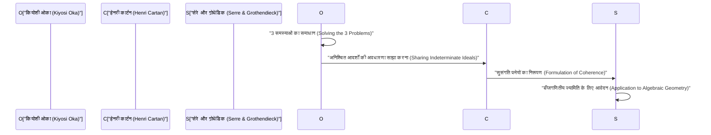
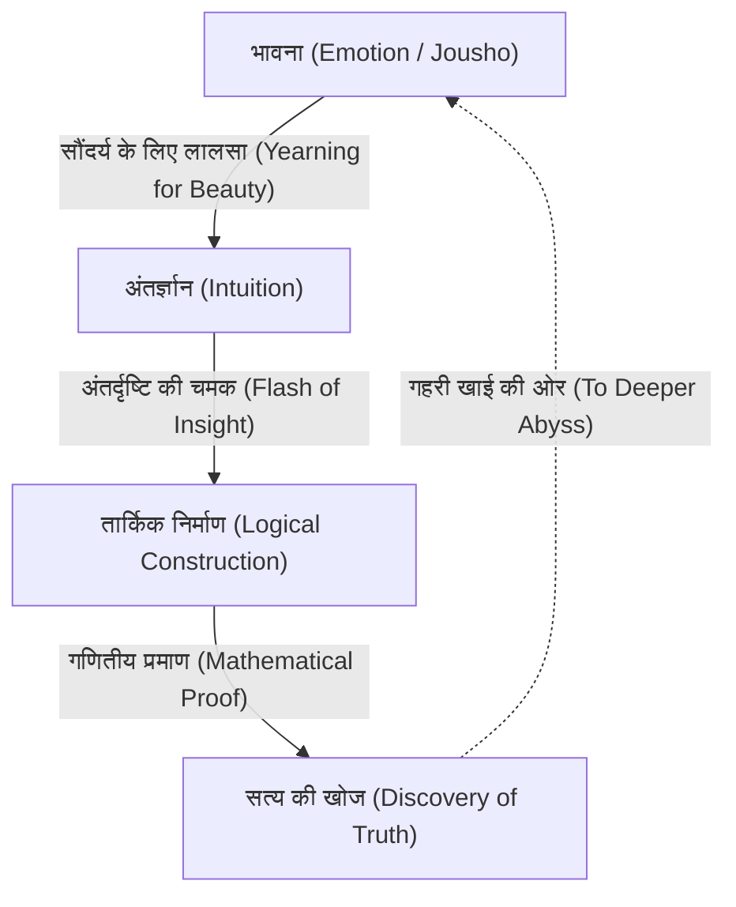

# [कियोशी ओका](https://kenji.blog/hi/p/oka-kiyoshi/): गणित और भावनाओं का संगम

[कियोशी ओका](https://kenji.blog/hi/p/oka-kiyoshi/) (1901–1978) एक जापानी गणितज्ञ थे जिन्होंने कई जटिल चरों (Several Complex Variables) के क्षेत्र में विश्व स्तरीय विरासत छोड़ी। "ओका की सुसंगति प्रमेय" (Oka's coherence theorem) और "ओका का सिद्धांत" (Oka's principle) जैसी अवधारणाएं, जो उनके नाम पर हैं, आधुनिक गणित में अपरिहार्य आधार के रूप में कार्य करती हैं। इस लेख में, हम उनके असाधारण जीवन, उनके अनूठे दर्शन और कई जटिल चरों के फलनों के सिद्धांत में उनकी गहरी गणितीय उपलब्धियों का बिना कुछ छोड़े विस्तार से वर्णन करते हैं।

## 1. प्रारंभिक जीवन और करियर: गणित का मार्ग

[कियोशी ओका](https://kenji.blog/hi/p/oka-kiyoshi/) का जन्म 19 अप्रैल, 1901 को ओसाका प्रान्त के ओसाका शहर में हुआ था, और बाद में उनका पालन-पोषण वाकायामा प्रान्त में हुआ। कम उम्र से ही प्रकृति के साथ उनकी घनिष्ठता और जापानी भावनाओं (Jousho) से ओत-प्रोत माहौल में उनकी परवरिश ने बाद में उनके दर्शन को बहुत प्रभावित किया।

क्योतो इंपीरियल यूनिवर्सिटी के विज्ञान संकाय में गणित विभाग में प्रवेश करने पर, ओका उत्कृष्ट गुरुओं और दोस्तों से मिले, और गणित की गहराइयों से मोहित हो गए। स्नातक होने के बाद, उन्होंने अपने स्वयं के शोध विषय की खोज करते हुए क्योतो इंपीरियल यूनिवर्सिटी में एक व्याख्याता के रूप में पढ़ाया। उस समय, जापानी गणितीय समुदाय एक संक्रमणकालीन दौर में था, पश्चिमी गणित को आत्मसात कर रहा था और अपने स्वयं के अनूठे विकास को प्राप्त करने का लक्ष्य रख रहा था। ओका ने भी अनसुलझी कठिन समस्याओं को चुनौती देकर एक विश्व प्रसिद्ध गणितज्ञ बनने के मार्ग पर कदम रखा।

## 2. फ्रांस में अध्ययन और कई जटिल चरों के प्रति जागरण

1929 में, [कियोशी ओका](https://kenji.blog/hi/p/oka-kiyoshi/) शिक्षा मंत्रालय के विदेशी शोधकर्ता के रूप में विदेश में अध्ययन करने के लिए पेरिस, फ्रांस गए। पेरिस में उनके इस तीन साल के प्रवास ने एक गणितज्ञ के रूप में उनकी नियति को निर्णायक रूप से तय कर दिया।

पेरिस विश्वविद्यालय में, उन्होंने हेनरी कार्टन और गैस्टन जूलिया जैसे उस समय यूरोपीय गणितीय दुनिया का नेतृत्व करने वाले जीनियस लोगों के साथ बातचीत की। विशेष रूप से जूलिया की प्रयोगशाला में अक्सर जाने के दौरान, ओका का सामना **कई जटिल चरों** के क्षेत्र से हुआ, जो उस समय अभी भी एक अज्ञात जंगल था।

जबकि एक-चर जटिल विश्लेषण 19 वीं शताब्दी में कॉची, रीमैन और अन्य लोगों द्वारा खूबसूरती से पूरा कर लिया गया था, कई चरों के मामले में पूरी तरह से अलग कठिनाइयाँ प्रतीक्षारत थीं। एक प्रतिनिधि उदाहरण "हार्टोग्स की घटना" है।

$$
\text{हार्टोग्स का प्रमेय: } \mathbb{C}^n \ (n \ge 2) \text{ में, एक फलन जो एक निश्चित डोमेन की सीमा पर होलोमोर्फिक है, स्वचालित रूप से डोमेन के आंतरिक भाग में होलोमोर्फिक रूप से विस्तारित हो जाता है।}
$$

यह प्रमेय उस आश्चर्यजनक कठोरता को प्रदर्शित करता है जो कई चरों के होलोमोर्फिक फलन में होती है। ओका ने कई चरों के इस रहस्यमय दुनिया को स्पष्ट करने के लिए अपना जीवन समर्पित करने के अपने संकल्प को मजबूत किया।

## 3. गणितीय उपलब्धियां: तीन प्रमुख समस्याओं का समाधान

[कियोशी ओका](https://kenji.blog/hi/p/oka-kiyoshi/) की सबसे बड़ी उपलब्धि कई जटिल चरों में "तीन प्रमुख समस्याओं" को स्वतंत्र रूप से हल करना है। ये ऐसी विकट समस्याएं थीं जिन्हें उस समय गणितीय दुनिया के सबसे महान दिमाग भी नहीं छू सकते थे।

### कज़िन की समस्याएं (Cousin Problems)

कज़िन की समस्याएं एक-चर जटिल विश्लेषण में मिटाग-लेफ्लर के प्रमेय और वीयरस्ट्रास के प्रमेय को कई चरों में सामान्यीकृत करने का एक प्रयास हैं।

*   **कज़िन की पहली समस्या (Cousin I problem):** क्या ध्रुवों के दिए गए वितरण (स्थानीय मेरोमोर्फिक फलन) से एकल वैश्विक मेरोमोर्फिक फलन का निर्माण किया जा सकता है?
*   **कज़िन की दूसरी समस्या (Cousin II problem):** क्या शून्यों के दिए गए वितरण से एकल वैश्विक होलोमोर्फिक फलन का निर्माण किया जा सकता है?

ओका ने साबित किया कि कज़िन की पहली समस्या को होलोमोर्फी के डोमेन (Domains of holomorphy) में हमेशा हल किया जा सकता है। इसके अलावा, कज़िन की दूसरी समस्या के संबंध में, उन्होंने स्पष्ट किया कि एक टोपोलॉजिकल स्थिति (कोहोमोलोजी समूह का लुप्त होना) आवश्यक है, जिससे "ओका का सिद्धांत" के रूप में जाना जाने वाला एक अभूतपूर्व अवधारणा पेश की गई।

### लेवी की समस्या (Levi's Problem)

लेवी की समस्या पूछती है, "क्या स्यूडोकोन्वेक्स डोमेन (Pseudoconvex domains) होलोमोर्फी के डोमेन हैं?" स्यूडोकोन्वेक्सिटी एक स्थानीय, ज्यामितीय स्थिति है, जबकि होलोमोर्फी का डोमेन एक वैश्विक, विश्लेषणात्मक स्थिति है। यह अनुमान कि ये दोनों समतुल्य हैं, कई वर्षों तक अनसुलझा रहा।

ओका ने अपने 1942 के पेपर (Oka VI) से लेकर अपने 1953 के पेपर (Oka IX) तक इस समस्या को पूरी तरह से हल कर दिया। विशेष रूप से, "अनिश्चित डोमेन के आदर्श" (Ideals of indeterminate domains) की उनकी तकनीक, जो ज्ञात डोमेन के साथ एक अज्ञात डोमेन का अनुमान लगाती है, इतनी गहराई से मौलिक थी कि इसने उस समय के गणितज्ञों को चकित कर दिया।

### ओका का प्रमेय: सुसंगत शीव्स की खोज

ओका की सबसे गहरी उपलब्धियों में से एक आदर्श शीव्स (ideal sheaves) की अवधारणा की शुरूआत है, यह साबित करते हुए कि होलोमोर्फिक फलन की शीव सुसंगत (coherent) है, जिसे **ओका का सुसंगति प्रमेय** के रूप में जाना जाता है।

$$
\mathcal{O}_{\mathbb{C}^n} \text{ एक सुसंगत शीव (Coherent Sheaf) है।}
$$

यह प्रमेय हेनरी कार्टन के "कार्टन के प्रमेय ए और बी" की नींव बन गया, और इसे बाद में ज्यां-पियरे सेरे और [अलेक्जेंडर ग्रोथेंडिक](https://kenji.blog/hi/p/grothendieck/) द्वारा बीजगणितीय ज्यामिति में लागू किया गया। "शीव थ्योरी" (Sheaf Theory), आधुनिक गणित की आम भाषा, [कियोशी ओका](https://kenji.blog/hi/p/oka-kiyoshi/) के अकेले संघर्ष से पैदा हुई थी।

## 4. सनकीपन और एकांत जीवन: कई किस्से

कहा जाता है कि जीनियस में अक्सर सनक होती है, और [कियोशी ओका](https://kenji.blog/hi/p/oka-kiyoshi/) इसका अपवाद नहीं थे। उनके कार्य विशुद्ध रूप से सत्य का पीछा करने के उनके दृष्टिकोण की अभिव्यक्ति थे।

*   **धूप वाले दिनों में भी रबर के जूते:** ओका अक्सर साफ दिनों में भी रबर के जूते पहनकर चलते थे। कहा जाता है कि वे या तो जूते के फीते बांधने के लिए समय बर्बाद करना नहीं चाहते थे या वे अपने कदमों की चिंता किए बिना विचारों में खो जाना चाहते थे।
*   **बिना टाई के:** तंग चीजों से नफरत करने वाले, उनके लिए बिना टाई के अकादमिक सम्मेलनों में दिखाई देना कोई असामान्य बात नहीं थी।
*   **प्रकृति के साथ संवाद:** अक्सर उन्हें चलते समय सड़क किनारे लगे फूलों और पेड़ों से बातें करते देखा जाता था। वे प्रकृति में छिपी "सुंदरता" से बातचीत कर रहे थे।

द्वितीय विश्व युद्ध के दौरान और बाद में, उन्होंने अत्यधिक गरीबी से जूझते हुए अपना शोध जारी रखा। एक समय था जब वे अस्थायी रूप से गणित से दूर हो गए और होक्काइडो और वाकायामा में खेती में लग गए। फिर भी, मिट्टी जोतते समय भी, उनका दिमाग कई जटिल चरों की खाई में भटकता रहता था। अपने पेपर लिखने के लिए पर्याप्त कागज़ न होने पर भी, उन्होंने लगातार ऐतिहासिक उत्कृष्ट कृतियों का निर्माण किया।

## 5. "जौशो" (भावना) का दर्शन: गणितीय सृजन का सार

[कियोशी ओका](https://kenji.blog/hi/p/oka-kiyoshi/) के बारे में बात करते समय उनका "जौशो" (भावना) का अनूठा दर्शन अपरिहार्य है। अपनी पुस्तक *वसंत की शामों पर दस प्रवचन* (Ten Discourses on Spring Evenings) में, वे जोर देकर कहते हैं, "गणित का केंद्र भावना है।"

ओका के अनुसार, नया गणित कभी भी केवल तर्क से पैदा नहीं होता है। तर्क केवल बाद में निर्मित एक ढांचा है; इसका स्रोत "सुंदर चीजों के लिए लालसा" और "प्रकृति के साथ सामंजस्य महसूस करने वाले हृदय" में निहित है।

उन्हें मात्सुओ बाशो के हाइकू और डोगेन के ज़ेन दर्शन से गहरा लगाव था, उनका उपदेश था कि सच्ची रचनात्मकता के लिए जापानी संस्कृति में निहित "निस्वार्थ हृदय" आवश्यक है। कोई फर्क नहीं पड़ता कि कंप्यूटर और एआई कितने उन्नत हो जाते हैं, उनका मानना ​​था कि "भावना" के साथ अंतर्दृष्टि की यह चमक मानवता का विशेषाधिकार और सबसे उदात्त मानसिक गतिविधि है।

## 6. परिशिष्ट: [कियोशी ओका](https://kenji.blog/hi/p/oka-kiyoshi/) के प्रमुख पत्रों की प्रक्षेपवक्र (Oka I - Oka IX)

[कियोशी ओका](https://kenji.blog/hi/p/oka-kiyoshi/) की उपलब्धियों पर चर्चा करते समय, कोई भी 1936 और 1953 के बीच प्रकाशित नौ पत्रों से नहीं बच सकता है, जिन्हें "Oka I" से "Oka IX" के रूप में जाना जाता है।

1.  **Oka I (1936):** तर्कसंगत रूप से उत्तल डोमेन पर शोध। यहां, कई चरों में उत्तलता की अवधारणा को पहली बार गहरा किया गया था।
2.  **Oka II (1937):** होलोमोर्फी के डोमेन में कज़िन की पहली समस्या का समाधान।
3.  **Oka III (1939):** कज़िन की दूसरी समस्या को हल करने की दिशा में एक अभूतपूर्व दृष्टिकोण।
4.  **Oka IV (1941):** स्यूडोकोन्वेक्स डोमेन और होलोमोर्फी के डोमेन के बीच संबंधों के करीब पहुंचने वाला शोध।
5.  **Oka V (1942):** कार्टन के प्रमेय का सामान्यीकरण।
6.  **Oka VI (1942):** लेवी की समस्या का समाधान यह दर्शाता है कि स्यूडोकोन्वेक्स डोमेन होलोमोर्फी का डोमेन है (दो चरों के मामले में)।
7.  **Oka VII (1950):** स्यूडोकोन्वेक्स डोमेन में ऊपर की ओर विश्लेषणात्मक निरंतरता का सिद्धांत।
8.  **Oka VIII (1951):** अनिश्चित आदर्शों का मूल सिद्धांत। सुसंगत शीव्स की शुरुआत यहां देखी गई है।
9.  **Oka IX (1953):** बिना शाखा बिंदुओं वाले शाखाविहीन आंतरिक डोमेन में लेवी की समस्या का पूर्ण समाधान।

## 7. आने वाली पीढ़ियों पर प्रभाव और विरासत

1960 में, [कियोशी ओका](https://kenji.blog/hi/p/oka-kiyoshi/) को उनकी अद्वितीय उपलब्धियों के लिए जापान के ऑर्डर ऑफ कल्चर से सम्मानित किया गया। इसके बाद, उन्होंने नारा विमेंस यूनिवर्सिटी और अन्य संस्थानों में पढ़ाना जारी रखा, कई उत्तराधिकारियों को बढ़ावा दिया। अपने बाद के वर्षों में, उन्होंने गणित शिक्षा और जापानी संस्कृति पर लेखन और व्याख्यान देने पर भी ध्यान केंद्रित किया, जिससे कई सामान्य पाठक गहराई से प्रभावित हुए।

1978 में 76 वर्ष की आयु में निधन होने तक, उन्होंने लगातार पूछा, "सत्य क्या है?"। कई जटिल चरों का सिद्धांत जिसे उन्होंने आगे बढ़ाया, अब विभेदक ज्यामिति, बीजगणितीय ज्यामिति और सैद्धांतिक भौतिकी में व्यापक रूप से लागू किया जाता है। [कियोशी ओका](https://kenji.blog/hi/p/oka-kiyoshi/) का जीवन केवल एक गणितज्ञ की सफलता की कहानी नहीं है। यह एक मानव आत्मा का रिकॉर्ड है जो एकांत में अपनी आंतरिक आवाज को ध्यान से सुनकर पूर्ण सत्य तक पहुंचने की कोशिश कर रही है। उनके द्वारा पीछे छोड़ा गया "भावना" शब्द चुपचाप हमसे पूछता है, "सच्ची समृद्धि क्या है?" एक आधुनिक समाज में जहां दक्षता और तर्क को प्राथमिकता दी जाती है। गणित की विशाल दुनिया में खिलता हुआ एक अकेला चेरी ब्लॉसम - वह [कियोशी ओका](https://kenji.blog/hi/p/oka-kiyoshi/) नाम का व्यक्ति था।

## 8. विस्तृत व्याख्या: एक अनिश्चित आदर्श क्या है?

आइए "अनिश्चित डोमेन के आदर्शों" के बारे में कुछ और विस्तार से बताएं, जिसे ओका की सबसे बड़ी खोजों में से एक माना जाता है।

कई जटिल चरों में, किसी फलन का विश्व स्तर पर निर्माण करते समय, कुंजी यह है कि स्थानीय डेटा को एक साथ कैसे जोड़ा जाए। एक चर के मामले में, चूंकि विलक्षणताओं (singularities) की संरचना अपेक्षाकृत सरल है, इसलिए विश्लेषणात्मक निरंतरता का उपयोग करके फलन का विस्तार करना आसान है। हालांकि, कई चरों के मामले में, जैसा कि हार्टोग्स की घटना में देखा गया है, विलक्षणताएं अलग-थलग नहीं हैं बल्कि जटिल हाइपरसर्फ्स (hypersurfaces) बनाती हैं।

इस कठिनाई को दूर करने के लिए, ओका ने एक अत्यंत नवीन विचार की कल्पना की: एक डोमेन को ठीक करने और फलन पर विचार करने के बजाय, उन्होंने डोमेन को स्वयं बदलते हुए फलन के व्यवहार को कैप्चर किया। यह "अनिश्चित आदर्श" का मूल है।

विशेष रूप से, एक निश्चित बिंदु $p$ के पड़ोस में परिभाषित होलोमोर्फिक फलनों के रोगाणुओं (germs of holomorphic functions) द्वारा निर्मित रिंग $\mathcal{O}_p$ पर विचार करें, और इसके भीतर आदर्शों से निपटें। ओका ने संपूर्ण डोमेन पर परिभाषित आदर्शों की एक शीव (sheaf of ideals) का निर्माण किया और दिखाया कि यह स्थानीय रूप से सूक्ष्म रूप से उत्पन्न होती है। यह उस अवधारणा का प्रोटोटाइप है जिसे बाद में कार्टन और सेरे द्वारा "सुसंगत शीव" (coherent sheaf) के रूप में औपचारिक रूप दिया गया।

इस दृष्टिकोण ने मौलिक रूप से उस समय की गणितीय दुनिया के सामान्य ज्ञान को उलट दिया। एक डोमेन के आकार पर निर्भर विश्लेषणात्मक समस्या को फलनों की बीजगणितीय संरचना (आदर्शों) की समस्या में बदलकर, उन्होंने टोपोलॉजी और बीजगणितीय ज्यामिति के शक्तिशाली तरीकों को लागू करने का मार्ग खोल दिया।

## 9. [कियोशी ओका](https://kenji.blog/hi/p/oka-kiyoshi/) के शब्द: उद्धरणों का संग्रह

अपने पूरे जीवन में, [कियोशी ओका](https://kenji.blog/hi/p/oka-kiyoshi/) ने गहरे निहितार्थों से भरे कई शब्द छोड़े। यहां, हम कुछ प्रसिद्ध उद्धरण पेश करते हैं जो उनके दर्शन को उपयुक्त रूप से व्यक्त करते हैं।

*   **"गणित का लक्ष्य सत्य की खोज है। और सत्य सुंदर है।"**
    (गणितीय सत्य और सुंदरता अविभाज्य हैं, इस बात पर जोर देने वाला एक उद्धरण।)
*   **"गणना करना गणित नहीं है। वह एक मशीन कर सकती है। गणित अंतर्ज्ञान के माध्यम से अनदेखी सामंजस्य की खोज कर रहा है।"**
    (तार्किक कटौती से पहले अंतर्ज्ञान के महत्व का उपदेश देने वाला एक उद्धरण।)
*   **"बसंत के खेत में खिलने वाले बैंगनी फूल की तरह, एक दिल जो बस मासूमियत से सच्चाई की तलाश करता है। यही सृजन की प्रेरक शक्ति है।"**
    (अहंकार को त्यागने और वस्तु के साथ एकजुट होने, निस्वार्थता की प्राच्य भावना को व्यक्त करने वाला एक उद्धरण।)

जैसा कि इन शब्दों से देखा जा सकता है, [कियोशी ओका](https://kenji.blog/hi/p/oka-kiyoshi/) के लिए, गणित केवल एक अकादमिक शाखा नहीं थी, बल्कि मानव आत्मा को उच्च लोकों में मार्गदर्शन करने के लिए एक "ताओ (मार्ग)" कहा जा सकता है।

## 10. निष्कर्ष और संभावनाएं

[कियोशी ओका](https://kenji.blog/hi/p/oka-kiyoshi/) ने हमें जो विरासत छोड़ी है वह केवल गणितीय प्रमेय नहीं है। उन्होंने हमें दिखाया कि मानव बुद्धि उनके जीने के तरीके के माध्यम से उच्चतम अवस्था तक पहुंच सकती है।

आधुनिक गणित तेजी से उपविभाजित और अत्यधिक विशिष्ट होता जा रहा है। इसके अलावा, कृत्रिम बुद्धिमत्ता (एआई) के तेजी से विकास के साथ, एक ऐसा युग आ रहा है जहां गणितीय प्रमेयों का प्रमाण भी स्वचालित रूप से मशीनों द्वारा किया जाएगा। हालांकि, प्रौद्योगिकी कितनी भी आगे क्यों न बढ़ जाए, जब तक ओका ने जिस "भावना" की बात की थी - अज्ञात दुनिया के प्रति जिज्ञासा, सुंदर चीजों से प्रभावित होना और सत्य की खोज करने वाला एक निस्वार्थ हृदय - खो नहीं जाता, गणित मानवता के लिए सबसे आकर्षक और मूल्यवान बौद्धिक प्रयास बना रहेगा।

[कियोशी ओका](https://kenji.blog/hi/p/oka-kiyoshi/) की भावना निश्चित रूप से आने वाले युग में रहने वाले हममें से प्रत्येक के भीतर चुपचाप लेकिन शक्तिशाली रूप से जीवित रहेगी।

## अतिरिक्त सामग्री: ओका का दर्शन और आधुनिक युग के लिए निहितार्थ

[कियोशी ओका](https://kenji.blog/hi/p/oka-kiyoshi/) द्वारा अपनाई गई "भावना" की अवधारणा आज भी फीकी नहीं पड़ी है; बल्कि, आधुनिक समाज में ही इसका वास्तविक मूल्य प्रदर्शित होता है। जबकि भौतिक संपदा और तार्किक तर्कसंगतता का सीमा तक पीछा किया जाता है, लोगों की आध्यात्मिक समृद्धि और प्रकृति के साथ सद्भाव खो रहा है। ऐसे आधुनिक समाज में, उनका दर्शन एक मार्गदर्शक के रूप में कार्य करता है।

तथ्य यह है कि जो व्यक्ति गणित - सबसे कठोर और तार्किक अनुशासन - के शिखर पर खड़ा था, अंततः "भावना" और "निस्वार्थता" जैसे प्रतीत होने वाले अतार्किक और मानवीय तत्वों पर लौट आया, इसमें एक गहरा सत्य निहित है, हालांकि यह बहुत विरोधाभासी है। यह सुझाव देता है कि मानवीय रचनात्मकता कभी भी यांत्रिक गणना या केवल सूचना प्रसंस्करण का विस्तार नहीं है, बल्कि यह प्रकृति के साथ अधिक मौलिक जीवन गतिविधियों और अनुनाद से पैदा होती है। ओका का गणित और दर्शन हमें अनंत काल तक रोशन करता रहेगा।

इसके अलावा, उनके जीवन को पीछे मुड़कर देखते हुए, कोई भी उनकी लचीली भावना पर चकित रह जाता है, जिन्होंने अत्यधिक गरीबी और अपने आस-पास के लोगों की समझ की कमी जैसी कठिन परिस्थितियों में भी सत्य की खोज कभी नहीं छोड़ी। अपनी दैनिक रोटी कमाने के लिए कृषि में संलग्न रहते हुए, वे लगातार अपने दिमाग में कई जटिल चरों की कठिन समस्याओं से जूझ रहे थे। ऐसी चरम स्थितियों में यही मानसिक एकाग्रता थी जो "अनिश्चित आदर्शों" की अभूतपूर्व अवधारणा उत्पन्न करने की प्रेरक शक्ति बन गई जिसने उस समय के गणितीय सामान्य ज्ञान को उलट दिया।

हम न केवल ओका द्वारा छोड़ी गई गणितीय उपलब्धियों से, बल्कि उनके जीने के तरीके से भी बहुत कुछ सीख सकते हैं। सच्ची रचनात्मकता क्या है, और एक इंसान के रूप में समृद्ध रूप से जीने का क्या अर्थ है? यह कहा जा सकता है कि [कियोशी ओका](https://kenji.blog/hi/p/oka-kiyoshi/) का जीवन इन मूलभूत प्रश्नों का एक शक्तिशाली उत्तर प्रदान करता है। उनके द्वारा छोड़े गए पदचिह्न न केवल जापानी गणितीय समुदाय बल्कि दुनिया भर के लोगों को प्रेरित करते रहते हैं।
