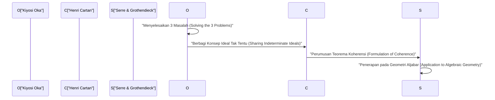
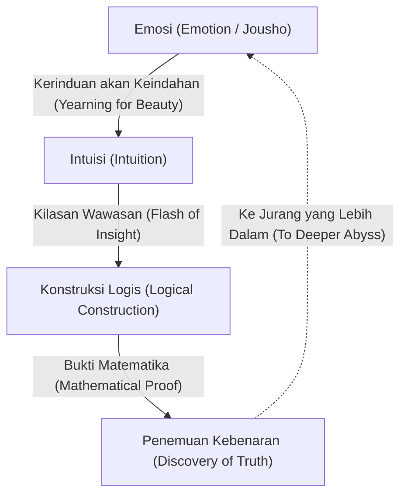

# [Kiyosi Oka](https://kenji.blog/id/p/oka-kiyoshi/): Perpaduan Matematika dan Emosi

[Kiyosi Oka](https://kenji.blog/id/p/oka-kiyoshi/) (1901–1978) adalah seorang matematikawan Jepang yang meninggalkan warisan kelas dunia di bidang beberapa variabel kompleks (Several Complex Variables). Konsep-konsep yang menggunakan namanya, seperti "teorema koherensi Oka" (Oka's coherence theorem) dan "prinsip Oka" (Oka's principle), berfungsi sebagai fondasi yang sangat diperlukan dalam matematika modern. Dalam artikel ini, kami merinci kehidupannya yang luar biasa, filosofi uniknya, dan pencapaian matematikanya yang mendalam dalam teori fungsi beberapa variabel kompleks tanpa menghilangkan apa pun.

## 1. Kehidupan Awal dan Karier: Jalan Menuju Matematika

[Kiyosi Oka](https://kenji.blog/id/p/oka-kiyoshi/) lahir pada 19 April 1901, di Kota Osaka, Prefektur Osaka, dan kemudian dibesarkan di Prefektur Wakayama. Keakrabannya dengan alam sejak usia dini dan pengasuhannya dalam lingkungan yang meluap dengan emosi Jepang (Jousho) sangat memengaruhi filosofinya di kemudian hari.

Memasuki Departemen Matematika di Fakultas Sains, Universitas Imperial Kyoto, Oka bertemu dengan para mentor dan teman yang sangat baik, menjadi terpikat oleh kedalaman matematika. Setelah lulus, ia mengajar sebagai dosen di Universitas Imperial Kyoto sambil mencari tema penelitiannya sendiri. Pada saat itu, komunitas matematika Jepang berada dalam masa transisi, menyerap matematika Barat dan bertujuan untuk mencapai perkembangan uniknya sendiri. Oka juga memulai jalan untuk menjadi matematikawan terkenal di dunia dengan menantang masalah-masalah sulit yang belum terpecahkan.

## 2. Belajar di Prancis dan Kebangkitan pada Beberapa Variabel Kompleks

Pada tahun 1929, [Kiyosi Oka](https://kenji.blog/id/p/oka-kiyoshi/) melakukan perjalanan ke Paris, Prancis, untuk belajar di luar negeri sebagai peneliti luar negeri untuk Kementerian Pendidikan. Masa tinggal tiga tahun di Paris ini secara menentukan nasibnya sebagai seorang matematikawan.

Di Universitas Paris, ia berinteraksi dengan para jenius yang memimpin dunia matematika Eropa pada saat itu, seperti Henri Cartan dan Gaston Julia. Terutama saat sering mengunjungi laboratorium Julia, Oka menemukan bidang **beberapa variabel kompleks**, yang saat itu masih berupa hutan belantara yang belum dijelajahi.

Sementara analisis kompleks satu variabel telah diselesaikan dengan indah pada abad ke-19 oleh Cauchy, Riemann, dan lainnya, kesulitan yang sama sekali berbeda menanti dalam kasus beberapa variabel. Contoh yang representatif adalah "fenomena Hartogs".

$$
\text{Teorema Hartogs: Dalam } \mathbb{C}^n \ (n \ge 2) \text{, sebuah fungsi yang holomorfik pada batas domain tertentu secara otomatis diperluas secara holomorfik ke bagian dalam domain.}
$$

Teorema ini menunjukkan kekakuan menakjubkan yang dimiliki oleh fungsi-fungsi holomorfik dari beberapa variabel. Oka memantapkan tekadnya untuk mendedikasikan hidupnya guna menjelaskan dunia misterius dari beberapa variabel ini.

## 3. Pencapaian Matematika: Memecahkan Tiga Masalah Utama

Pencapaian terbesar [Kiyosi Oka](https://kenji.blog/id/p/oka-kiyoshi/) adalah telah memecahkan secara mandiri "Tiga Masalah Utama" dalam beberapa variabel kompleks. Ini adalah masalah-masalah berat yang bahkan tidak dapat disentuh oleh pikiran-pikiran terhebat di dunia matematika pada saat itu.

### Masalah Cousin (Cousin Problems)

Masalah Cousin mewakili upaya untuk menggeneralisasi teorema Mittag-Leffler dan teorema Weierstrass dalam analisis kompleks satu variabel ke beberapa variabel.

*   **Masalah Cousin Pertama (Cousin I problem):** Dapatkah satu fungsi meromorfik global dibangun dari distribusi kutub tertentu (fungsi meromorfik lokal)?
*   **Masalah Cousin Kedua (Cousin II problem):** Dapatkah satu fungsi holomorfik global dibangun dari distribusi nol tertentu?

Oka membuktikan bahwa masalah Cousin pertama selalu dapat dipecahkan dalam domain holomorfi (Domains of holomorphy). Lebih lanjut, mengenai masalah Cousin kedua, ia mengklarifikasi bahwa kondisi topologis (hilangnya grup kohomologi) diperlukan, memperkenalkan konsep inovatif yang dikenal sebagai "prinsip Oka".

### Masalah Levi (Levi's Problem)

Masalah Levi bertanya, "Apakah domain pseudokonveks (Pseudoconvex domains) adalah domain holomorfi?" Pseudokonveksitas adalah kondisi geometris lokal, sedangkan domain holomorfi adalah kondisi analitik global. Dugaan bahwa kedua hal ini setara tetap tidak terpecahkan selama bertahun-tahun.

Oka memecahkan masalah ini sepenuhnya dari makalahnya tahun 1942 (Oka VI) hingga makalahnya tahun 1953 (Oka IX). Secara khusus, tekniknya tentang "ideal dari domain tak tentu" (Ideals of indeterminate domains), yang mendekati domain tak dikenal dengan domain yang dikenal, sangat orisinal sehingga membuat takjub para matematikawan pada masa itu.

### Teorema Oka: Penemuan Berkas Koheren

Salah satu pencapaian terdalam Oka adalah pengenalan konsep berkas ideal, yang membuktikan bahwa berkas fungsi-fungsi holomorfik adalah koheren (coherent), yang dikenal sebagai **teorema koherensi Oka**.

$$
\mathcal{O}_{\mathbb{C}^n} \text{ adalah berkas koheren (Coherent Sheaf).}
$$

Teorema ini menjadi landasan bagi "Teorema A dan B Cartan" karya Henri Cartan, dan selanjutnya diterapkan pada geometri aljabar oleh Jean-Pierre Serre dan [Alexander Grothendieck](https://kenji.blog/id/p/grothendieck/). "Teori berkas" (Sheaf Theory), bahasa umum matematika modern, lahir dari perjuangan soliter [Kiyosi Oka](https://kenji.blog/id/p/oka-kiyoshi/).

## 4. Keeksentrikan dan Kehidupan yang Menyendiri: Banyak Episode

Dikatakan bahwa para jenius sering kali memiliki keeksentrikan, dan [Kiyosi Oka](https://kenji.blog/id/p/oka-kiyoshi/) tidak terkecuali. Tindakannya merupakan manifestasi dari sikapnya untuk murni mengejar kebenaran.

*   **Sepatu bot karet bahkan di hari yang cerah:** Oka sering berjalan memakai sepatu bot karet bahkan di hari yang cerah. Dikatakan bahwa ia enggan meluangkan waktu untuk mengikat tali sepatu atau ia ingin tenggelam dalam pikiran tanpa mengkhawatirkan langkahnya.
*   **Tanpa dasi:** Karena benci pakaian ketat, bukan hal yang aneh baginya untuk tampil di konferensi akademik tanpa dasi.
*   **Dialog dengan alam:** Ia sering terlihat berbicara dengan bunga dan pohon di pinggir jalan saat ia berjalan. Ia sedang bercakap-cakap dengan "keindahan" yang tersembunyi di alam.

Selama dan setelah Perang Dunia II, ia melanjutkan penelitiannya sambil berjuang melawan kemiskinan ekstrem. Ada suatu masa ketika ia untuk sementara waktu menjauh dari matematika dan bertani di Hokkaido dan Wakayama. Namun, bahkan saat menggarap tanah, pikirannya mengembara melintasi jurang beberapa variabel kompleks. Tanpa kertas yang memadai untuk menulis makalahnya, ia secara berturut-turut menghasilkan mahakarya bersejarah.

## 5. Filosofi "Jousho" (Emosi): Esensi Penciptaan Matematika

Hal yang sangat penting saat berbicara tentang [Kiyosi Oka](https://kenji.blog/id/p/oka-kiyoshi/) adalah filosofi uniknya tentang "Jousho" (Emosi). Dalam bukunya *Sepuluh Wacana di Malam Musim Semi*, ia menegaskan, "Pusat matematika adalah emosi."

Menurut Oka, matematika baru tidak pernah lahir dari logika saja. Logika hanyalah kerangka kerja yang dibangun setelahnya; sumbernya terletak pada "kerinduan akan hal-hal yang indah" dan "hati yang merasakan harmoni dengan alam."

Ia sangat mencintai haiku karya Matsuo Basho dan filosofi Zen karya Dogen, yang mengajarkan bahwa "hati yang tidak mementingkan diri sendiri" yang berakar pada budaya Jepang sangat penting bagi kreativitas sejati. Tidak peduli seberapa maju komputer dan AI, ia percaya bahwa kilasan wawasan yang disertai dengan "emosi" ini adalah hak istimewa umat manusia dan aktivitas mental yang paling luhur.

## 6. Lampiran: Lintasan Makalah Utama [Kiyosi Oka](https://kenji.blog/id/p/oka-kiyoshi/) (Oka I - Oka IX)

Saat membahas pencapaian [Kiyosi Oka](https://kenji.blog/id/p/oka-kiyoshi/), seseorang tidak dapat menghindari sembilan makalah yang diterbitkan antara tahun 1936 dan 1953, yang dikenal sebagai "Oka I" hingga "Oka IX".

1.  **Oka I (1936):** Penelitian tentang domain cembung rasional. Di sini, konsep kecembungan dalam beberapa variabel diperdalam untuk pertama kalinya.
2.  **Oka II (1937):** Penyelesaian masalah Cousin pertama dalam domain holomorfi.
3.  **Oka III (1939):** Pendekatan inovatif untuk menyelesaikan masalah Cousin kedua.
4.  **Oka IV (1941):** Penelitian yang mendekati hubungan antara domain pseudokonveks dan domain holomorfi.
5.  **Oka V (1942):** Generalisasi teorema Cartan.
6.  **Oka VI (1942):** Penyelesaian masalah Levi yang menunjukkan bahwa domain pseudokonveks adalah domain holomorfi (dalam kasus dua variabel).
7.  **Oka VII (1950):** Prinsip kelanjutan ke atas dalam domain pseudokonveks.
8.  **Oka VIII (1951):** Teori dasar ideal tak tentu. Awal mula berkas koheren terlihat di sini.
9.  **Oka IX (1953):** Penyelesaian lengkap masalah Levi dalam domain dalam yang tidak bercabang tanpa titik cabang.

## 7. Dampak pada Generasi Mendatang dan Warisan

Pada tahun 1960, [Kiyosi Oka](https://kenji.blog/id/p/oka-kiyoshi/) dianugerahi Order of Culture Jepang atas pencapaiannya yang tak tertandingi. Selanjutnya, ia terus mengajar di Universitas Wanita Nara dan institusi lain, membina banyak penerus. Di tahun-tahun terakhirnya, ia juga fokus menulis dan memberi kuliah tentang pendidikan matematika dan budaya Jepang, yang sangat menyentuh banyak pembaca umum.

Hingga ia meninggal pada tahun 1978 di usia 76 tahun, ia terus-menerus bertanya, "Apakah kebenaran itu?". Teori beberapa variabel kompleks yang ia rintis sekarang secara luas diterapkan pada geometri diferensial, geometri aljabar, dan fisika teoretis. Kehidupan [Kiyosi Oka](https://kenji.blog/id/p/oka-kiyoshi/) bukan sekadar kisah sukses seorang matematikawan. Ini adalah catatan jiwa manusia yang mencoba mencapai kebenaran mutlak dengan mendengarkan dengan saksama suara hatinya dalam kesendirian. Kata kunci "emosi" yang ditinggalkannya diam-diam bertanya kepada kita, "Apa itu kekayaan sejati?" dalam masyarakat modern di mana efisiensi dan logika cenderung diprioritaskan. Sekuntum bunga sakura tunggal yang mekar di dunia matematika yang luas—itulah sosok yang bernama [Kiyosi Oka](https://kenji.blog/id/p/oka-kiyoshi/).

## 8. Penjelasan Mendetail: Apa itu Ideal Tak Tentu?

Mari kita jelaskan sedikit lebih detail tentang "ideal dari domain tak tentu", yang dianggap sebagai salah satu penemuan terbesar Oka.

Dalam beberapa variabel kompleks, saat membangun suatu fungsi secara global, kuncinya adalah bagaimana menyatukan data lokal. Dalam kasus satu variabel, karena struktur singularitas relatif sederhana, mudah untuk memperluas fungsi menggunakan kelanjutan analitik. Namun, dalam kasus beberapa variabel, seperti yang terlihat pada fenomena Hartogs, singularitas tidak terisolasi melainkan membentuk hiperpermukaan yang kompleks.

Untuk mengatasi kesulitan ini, Oka menyusun ide yang sangat inovatif: alih-alih menetapkan sebuah domain dan mempertimbangkan fungsinya, ia menangkap perilaku fungsi sambil memvariasikan domainnya sendiri. Inilah inti dari "ideal tak tentu".

Secara spesifik, pertimbangkan cincin $\mathcal{O}_p$ yang dibentuk oleh kuman fungsi-fungsi holomorfik (germs of holomorphic functions) yang didefinisikan di lingkungan titik tertentu $p$, dan tangani ideal di dalamnya. Oka membangun sebuah berkas ideal (sheaf of ideals) yang didefinisikan di seluruh domain dan menunjukkan bahwa ia dibangkitkan secara terhingga secara lokal. Ini adalah prototipe dari konsep yang kemudian dirumuskan oleh Cartan dan Serre sebagai "berkas koheren" (coherent sheaf).

Pendekatan ini secara mendasar membalikkan akal sehat dunia matematika pada masa itu. Dengan mengubah masalah analitik yang bergantung pada bentuk domain menjadi masalah struktur aljabar (ideal) fungsi, ia membuka jalan untuk menerapkan metode topologi dan geometri aljabar yang kuat.

## 9. Kata-kata [Kiyosi Oka](https://kenji.blog/id/p/oka-kiyoshi/): Kumpulan Kutipan

Sepanjang hidupnya, [Kiyosi Oka](https://kenji.blog/id/p/oka-kiyoshi/) meninggalkan banyak kata yang penuh dengan implikasi mendalam. Di sini, kami memperkenalkan beberapa kutipan terkenal yang secara tepat mengekspresikan filosofinya.

*   **"Tujuan matematika adalah pencarian kebenaran. Dan kebenaran itu indah."**
    (Kutipan yang menekankan bahwa kebenaran matematika dan keindahan tidak dapat dipisahkan.)
*   **"Menghitung bukanlah matematika. Itu adalah sesuatu yang bisa dilakukan oleh mesin. Matematika adalah menemukan harmoni yang tak terlihat melalui intuisi."**
    (Kutipan yang mengajarkan pentingnya intuisi, mendahului deduksi logis.)
*   **"Seperti bunga violet yang mekar di ladang musim semi, hati yang dengan polos hanya mencari kebenaran. Itulah kekuatan pendorong penciptaan."**
    (Kutipan yang mengekspresikan semangat Oriental tentang ketidakegoisan, membuang ego dan menyatu dengan objek.)

Seperti yang dapat dilihat dari kata-kata ini, bagi [Kiyosi Oka](https://kenji.blog/id/p/oka-kiyoshi/), matematika bukan sekadar cabang akademis tetapi dapat dikatakan sebagai "Tao (Jalan)" untuk membimbing jiwa manusia ke alam yang lebih tinggi.

## 10. Kesimpulan dan Prospek

Warisan yang ditinggalkan [Kiyosi Oka](https://kenji.blog/id/p/oka-kiyoshi/) kepada kita bukan hanya teorema matematika. Ia menunjukkan kepada kita keadaan tertinggi yang dapat dicapai oleh intelek manusia melalui jalan hidupnya.

Matematika modern menjadi semakin terbagi-bagi dan sangat terspesialisasi. Selanjutnya, dengan pesatnya perkembangan kecerdasan buatan (AI), era di mana bahkan pembuktian teorema matematika akan dilakukan secara otomatis oleh mesin sedang tiba. Namun, tidak peduli seberapa maju teknologi, selama "emosi" yang dibicarakan Oka—rasa ingin tahu terhadap dunia tak dikenal, tergerak oleh hal-hal indah, dan hati tak egois yang mengejar kebenaran—tidak hilang, matematika akan terus menjadi upaya intelektual yang paling menarik dan berharga bagi umat manusia.

Semangat [Kiyosi Oka](https://kenji.blog/id/p/oka-kiyoshi/) pasti akan terus hidup dengan tenang namun kuat di dalam diri kita masing-masing yang hidup di era mendatang.

## Materi Tambahan: Filosofi Oka dan Implikasinya bagi Era Modern

Konsep "emosi" yang dikejar oleh [Kiyosi Oka](https://kenji.blog/id/p/oka-kiyoshi/) tidak memudar bahkan hingga hari ini; sebaliknya, di masyarakat modernlah nilai sejatinya ditunjukkan. Sementara kekayaan material dan rasionalitas logis dikejar hingga batas maksimal, kekayaan spiritual manusia dan harmoni dengan alam sedang hilang. Dalam masyarakat modern seperti itu, filosofinya berfungsi sebagai penunjuk jalan.

Fakta bahwa seseorang yang berdiri di puncak matematika—disiplin ilmu yang paling ketat dan logis—pada akhirnya kembali ke elemen yang tampaknya tidak logis dan manusiawi seperti "emosi" dan "ketidakegoisan" mengandung kebenaran yang mendalam, meskipun sangat paradoks. Ini menunjukkan bahwa kreativitas manusia tidak pernah merupakan perpanjangan dari perhitungan mekanis atau pemrosesan informasi semata, melainkan lahir dari aktivitas kehidupan yang lebih mendasar dan resonansi dengan alam. Matematika dan filosofi Oka akan terus menerangi kita selamanya.

Lebih jauh, melihat kembali hidupnya, orang takjub dengan jiwanya yang tangguh, tidak pernah menyerah dalam mengejar kebenaran bahkan dalam situasi sulit seperti kemiskinan ekstrem dan ketidakpahaman orang-orang di sekitarnya. Sambil bertani untuk mencari nafkah, pikirannya terus-menerus bergulat dengan masalah-masalah sulit dari beberapa variabel kompleks. Konsentrasi mental dalam kondisi ekstrem inilah yang menjadi kekuatan pendorong untuk menghasilkan konsep inovatif "ideal tak tentu" yang menjungkirbalikkan akal sehat matematika masa itu.

Kita bisa belajar banyak tidak hanya dari pencapaian matematika yang ditinggalkan Oka, tetapi juga dari cara hidupnya sendiri. Apa itu kreativitas sejati, dan apa artinya hidup kaya sebagai manusia? Dapat dikatakan bahwa kehidupan [Kiyosi Oka](https://kenji.blog/id/p/oka-kiyoshi/) memberikan jawaban yang kuat atas pertanyaan-pertanyaan mendasar ini. Jejak yang ditinggalkannya terus menginspirasi tidak hanya komunitas matematika Jepang tetapi orang-orang di seluruh dunia.
