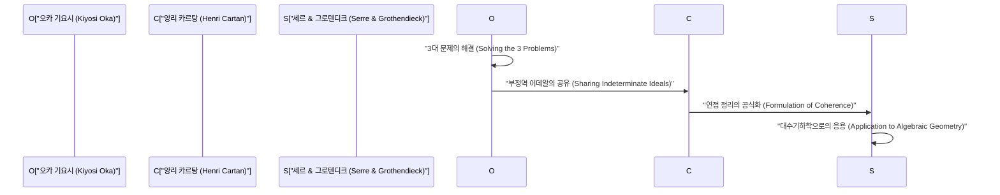
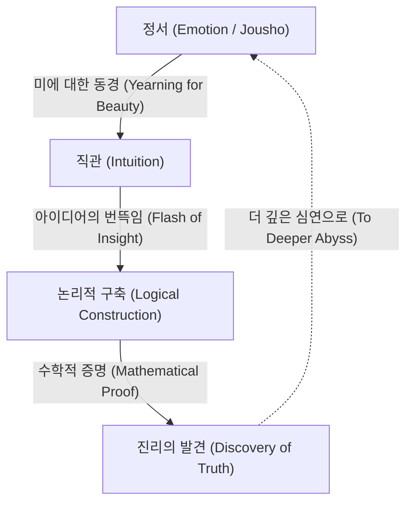

# [오카 기요시](https://kenji.blog/ko/p/oka-kiyoshi/): 수학과 정서의 융합

[오카 기요시](https://kenji.blog/ko/p/oka-kiyoshi/)(1901–1978)는 다변수 복소해석학 분야에서 세계적인 업적을 남긴 일본의 수학자입니다. 그의 이름을 딴 '오카의 정리(Oka's coherence theorem)'나 '오카의 원리(Oka's principle)' 등은 현대 수학에서 빼놓을 수 없는 기반이 되었습니다. 본 기사에서는 그의 기구한 생애, 독자적인 철학, 그리고 다변수 해석함수론에 있어서의 심오한 수학적 업적에 대해 남김없이 상세히 서술합니다.

## 1. 성장 과정과 초기 경력: 수학으로의 길

[오카 기요시](https://kenji.blog/ko/p/oka-kiyoshi/)는 1901년 4월 19일, 오사카부 오사카시에서 태어나 이후 와카야마현에서 자랐습니다. 어린 시절부터 자연을 가까이하고, 일본의 정서가 넘치는 환경에서 자란 것은 훗날 그의 철학에 큰 영향을 미쳤습니다.

교토제국대학 이학부 수학과에 진학한 오카는 그곳에서 훌륭한 스승과 학우들을 만나 수학의 깊이에 매료됩니다. 대학 졸업 후, 그는 교토제국대학의 강사로 교편을 잡으면서 자신의 연구 주제를 모색하고 있었습니다. 당시 일본의 수학계는 서양의 수학을 흡수하여 독자적인 발전을 이루려는 과도기에 있었습니다. 오카 역시 미해결 난제에 도전함으로써 세계적인 수학자로의 길을 걷기 시작합니다.

## 2. 프랑스 유학과 다변수 복소해석학에의 눈뜸

1929년, [오카 기요시](https://kenji.blog/ko/p/oka-kiyoshi/)는 문부성 재외 연구원으로서 프랑스 파리로 유학을 떠납니다. 이 3년간의 파리 체류가 그의 수학자로서의 운명을 결정지었습니다.

파리 대학교에서 그는 앙리 카르탕(Henri Cartan)이나 가스통 줄리아(Gaston Julia) 등 당시 유럽 수학계를 이끌던 천재들과 교류합니다. 특히 줄리아의 연구실을 드나들며, 오카는 당시 아직 황무지였던 **다변수 복소해석학** (Several Complex Variables)이라는 분야를 접하게 되었습니다.

일변수 복소해석학이 19세기에 코시나 리만 등에 의해 아름답게 완성되었던 반면, 다변수의 경우에는 전혀 다른 어려움이 기다리고 있었습니다. 그 대표적인 예가 '하르톡스 현상(Hartogs' phenomenon)'입니다.

$$
\text{하르톡스의 정리: } \mathbb{C}^n \ (n \ge 2) \text{ 에서, 어떤 영역의 경계에서 정칙인 함수는 자동으로 영역 내부로 정칙적으로 확장된다.}
$$

이 정리는 다변수 정칙 함수가 가지는 놀라운 강성(Rigidity)을 보여줍니다. 오카는 이 불가사의한 다변수의 세계를 해명하는 데 평생을 바치기로 결심하게 됩니다.

## 3. 수학적 업적: 3대 문제의 해결

[오카 기요시](https://kenji.blog/ko/p/oka-kiyoshi/)의 최대 업적은 다변수 복소해석학에서의 '3대 문제'를 홀로 해결한 것입니다. 이 문제들은 당시 수학계의 최고 두뇌들조차 손댈 수 없었던 난제였습니다.

### 쿠쟁 문제(Cousin Problems)

쿠쟁 문제는 일변수 복소해석학에서의 미타그-레플러의 정리와 바이어슈트라스의 정리를 다변수로 일반화하려는 시도입니다.

*   **제1 쿠쟁 문제(Cousin I problem):** 주어진 극의 분포(국소적인 유리형 함수)로부터 전체적으로 하나의 대역적인 유리형 함수를 구성할 수 있는가?
*   **제2 쿠쟁 문제(Cousin II problem):** 주어진 영점의 분포로부터 전체적으로 하나의 대역적인 정칙 함수를 구성할 수 있는가?

오카는 정칙 영역(Domains of holomorphy)에서는 제1 쿠쟁 문제가 항상 풀림을 증명했습니다. 나아가 제2 쿠쟁 문제에 대해서는 위상적인 조건(코호몰로지 군의 소멸)이 필요함을 밝혀내고, '오카의 원리'라고 불리는 획기적인 개념을 도입했습니다.

### 레비의 문제(Levi's Problem)

레비의 문제는 '의볼록 영역(Pseudoconvex domains)은 정칙 영역인가?'라는 문제입니다. 의볼록성은 국소적·기하학적인 조건이며, 정칙 영역은 대역적·해석적인 조건입니다. 이 두 가지가 동치라는 추측은 오랫동안 미해결 상태였습니다.

오카는 1942년의 논문(Oka VI)부터 1953년의 논문(Oka IX)에 걸쳐 이 문제를 완전히 해결했습니다. 특히 미지의 영역을 기지의 영역으로 근사하는 '부정역 이데알(Ideals of indeterminate domains)'의 기법은 너무나도 독창적이어서 당시 수학자들을 경탄하게 만들었습니다.

### 오카의 정리: 연접층의 발견

오카의 가장 심오한 업적 중 하나는 이데알 층의 개념을 도입하고, '정칙 함수의 층이 연접이다(coherent)'라는 것을 증명한 **오카의 연접 정리** 입니다.

$$
\mathcal{O}_{\mathbb{C}^n} \text{ 은 연접층(Coherent Sheaf)이다.}
$$

이 정리는 앙리 카르탕의 '카르탕의 정리 A·B'의 기초가 되었고, 나아가 세르나 그로텐디크에 의해 대수기하학으로 응용되었습니다. 현대 수학의 공통 언어인 '층의 이론(Sheaf Theory)'은 [오카 기요시](https://kenji.blog/ko/p/oka-kiyoshi/)의 고독한 투쟁 속에서 탄생한 것입니다.

## 4. 기행과 고고한 인생: 에피소드들

천재에게는 기행이 따른다고 하지만, [오카 기요시](https://kenji.blog/ko/p/oka-kiyoshi/)도 예외는 아니었습니다. 그의 행동은 순수하게 진리를 추구하는 자세의 발로였습니다.

*   **맑은 날에도 장화:** 오카는 맑은 날에도 고무장화를 신고 걷는 일이 잦았습니다. 신발 끈을 묶는 시간이 아까웠다고도 하고, 발밑을 신경 쓰지 않고 사색에 잠기고 싶었기 때문이라고도 합니다.
*   **넥타이를 매지 않음:** 갑갑한 것을 싫어하여, 노타이로 학회에 나타나는 일도 드물지 않았습니다.
*   **자연과의 대화:** 길가의 풀꽃이나 나무들에게 말을 걸며 걷는 모습이 자주 목격되었습니다. 그는 자연 속에 숨겨진 '미'와 대화하고 있었던 것입니다.

제2차 세계 대전 중부터 전후에 걸친 시기, 그는 극도의 빈곤과 싸우며 연구를 계속했습니다. 한때는 수학에서 떠나 홋카이도나 와카야마에서 농경에 종사하던 시기도 있었습니다. 그러나 흙을 일구면서도 그의 두뇌는 다변수 복소해석학의 심연을 헤매고 있었습니다. 논문을 쓸 종이조차 부족한 가운데, 그는 역사적인 걸작들을 차례로 써 내려갔습니다.

## 5. '정서'의 철학: 수학 창조의 본질

[오카 기요시](https://kenji.blog/ko/p/oka-kiyoshi/)를 이야기할 때 빼놓을 수 없는 것이 그만의 독자적인 '정서(Jousho)'라는 철학입니다. 그는 저서 『춘소십화(春宵十話)』에서 "수학의 중심은 정서이다"라고 단언하고 있습니다.

오카에 따르면, 논리만으로는 새로운 수학이 태어날 수 없습니다. 논리는 어디까지나 나중에 구축되는 뼈대에 불과하며, 그 원천에 있는 것은 '아름다운 것에 대한 동경'이나 '자연과의 조화를 느끼는 마음'이라는 것입니다.

그는 마쓰오 바쇼의 하이쿠나 도겐의 선사상을 깊이 사랑했으며, 일본 문화에 뿌리를 둔 '무아의 마음'이 진정한 창조성에 필수적이라고 설파했습니다. 컴퓨터나 AI가 아무리 발달하더라도, 이 '정서'를 수반하는 번뜩임이야말로 인간의 특권이며, 가장 숭고한 정신 활동이라고 그는 믿었습니다.

## 6. 부록: [오카 기요시](https://kenji.blog/ko/p/oka-kiyoshi/)의 주요 논문(Oka I - Oka IX)의 궤적

[오카 기요시](https://kenji.blog/ko/p/oka-kiyoshi/)의 업적을 말할 때, 1936년부터 1953년에 걸쳐 발표된 9편의 논문, 이른바 'Oka I'부터 'Oka IX'는 피해 갈 수 없습니다.

1.  **Oka I (1936):** 유리볼록 영역에 관한 연구. 여기서 처음으로 다변수에서의 볼록성 개념이 심화되었습니다.
2.  **Oka II (1937):** 정칙 영역에서의 쿠쟁 제1 문제의 해결.
3.  **Oka III (1939):** 쿠쟁 제2 문제 해결을 향한 획기적인 접근.
4.  **Oka IV (1941):** 의볼록 영역과 정칙 영역의 관계에 다가선 연구.
5.  **Oka V (1942):** 카르탕 정리의 일반화.
6.  **Oka VI (1942):** 의볼록 영역이 정칙 영역임을 증명하는 레비의 문제 해결(2변수의 경우).
7.  **Oka VII (1950):** 의볼록 영역에서의 상공 이행의 원리.
8.  **Oka VIII (1951):** 부정역 이데알의 기초 이론. 여기서 연접층의 싹을 볼 수 있습니다.
9.  **Oka IX (1953):** 분기점을 갖지 않는 내분기 영역에서의 레비의 문제 완전 해결.

## 7. 후세에의 영향과 유산

1960년, [오카 기요시](https://kenji.blog/ko/p/oka-kiyoshi/)는 그 유례없는 공적으로 일본 문화훈장을 수여받았습니다. 그 후로도 나라 여자대학 등에서 교편을 잡으며 많은 후학을 양성했습니다. 만년에는 수학 교육이나 일본 문화에 관한 집필·강연 활동에도 힘을 쏟아 많은 일반 독자들에게 감명을 주었습니다.

1978년 76세의 나이로 세상을 떠날 때까지, 그는 항상 '진리란 무엇인가'를 계속해서 물었습니다. 그가 개척한 다변수 복소해석학의 이론은 이제 미분기하학, 대수기하학, 이론물리학에까지 널리 응용되고 있습니다. [오카 기요시](https://kenji.blog/ko/p/oka-kiyoshi/)의 생애는 단순한 수학자의 성공담이 아닙니다. 그것은 고독 속에서 자신의 내면의 소리에 귀 기울이며, 절대적인 진리에 도달하려는 인간 영혼의 기록입니다. 그가 남긴 '정서'라는 키워드는 효율이나 논리만이 우선시되기 쉬운 현대 사회에서, 우리에게 '진정한 풍요로움이란 무엇인가'를 조용히 묻고 있습니다. 광활한 수학의 세계에 핀 한 송이 고고한 벚꽃, 그것이 바로 [오카 기요시](https://kenji.blog/ko/p/oka-kiyoshi/)라는 인물이었던 것입니다.

## 8. 상세한 해설: 부정역 이데알이란 무엇인가

[오카 기요시](https://kenji.blog/ko/p/oka-kiyoshi/)의 최대 발견 중 하나로 꼽히는 '부정역 이데알(Ideals of indeterminate domains)'에 대해 조금 자세히 해설해 보겠습니다.

다변수 복소해석학에서 함수를 대역적으로 구성할 때에는 국소적인 데이터를 어떻게 연결할지가 관건이 됩니다. 일변수의 경우에는 특이점의 구조가 비교적 단순하기 때문에, 해석적 연속을 이용하여 함수를 확장해 나가는 것이 용이합니다. 하지만 다변수의 경우에는 하르톡스 현상에서 볼 수 있듯이 특이점이 고립되지 않고 복잡한 초곡면을 형성합니다.

오카는 이 어려움을 극복하기 위해, 영역을 고정하고 함수를 생각하는 것이 아니라, 영역 자체를 변동시키면서 함수의 움직임을 파악한다는 지극히 참신한 아이디어를 떠올렸습니다. 이것이 '부정역 이데알'의 핵심입니다.

구체적으로는 어떤 점 $p$ 의 근방에서 정의된 정칙 함수의 싹(germs of holomorphic functions)들이 이루는 환 $\mathcal{O}_p$ 를 생각하고, 그 안의 이데알(ideal)을 다룹니다. 오카는 영역 전체에서 정의된 이데알 층(sheaf of ideals)을 구성하고, 그것이 국소적으로 유한 생성됨을 보였습니다. 이것이 훗날 카르탕이나 세르에 의해 '연접층(coherent sheaf)'으로 공식화되는 개념의 원형입니다.

이러한 접근법은 당시 수학계의 상식을 뿌리째 뒤엎는 것이었습니다. 영역의 형태에 의존하는 해석적인 문제를 함수의 대수적인 구조(이데알) 문제로 변환함으로써, 위상수학이나 대수기하학의 강력한 기법을 적용할 수 있는 길을 연 것입니다.

## 9. [오카 기요시](https://kenji.blog/ko/p/oka-kiyoshi/)의 말: 명언집

[오카 기요시](https://kenji.blog/ko/p/oka-kiyoshi/)는 그의 생애에 걸쳐 함축적인 말을 많이 남겼습니다. 여기서는 그의 철학을 단적으로 나타내는 몇 가지 명언을 소개합니다.

*   **"수학의 목표는 진리의 탐구이다. 그리고 진리는 아름답다."**
    (수학적 진리와 미가 불가분의 관계임을 강조한 말.)
*   **"계산을 하는 것은 수학이 아니다. 그것은 기계도 할 수 있는 일이다. 수학이란 아직 보지 못한 조화를 직관을 통해 찾아내는 것이다."**
    (논리적 추론 이전의 직관의 중요성을 설파한 말.)
*   **"봄 들판에 핀 제비꽃처럼, 그저 무심하게 진리를 구하는 마음. 그것이야말로 창조의 원동력이다."**
    (자아를 버리고 대상과 하나가 되는 동양적인 무아의 정신을 표현한 말.)

이러한 말들에서도 알 수 있듯이, [오카 기요시](https://kenji.blog/ko/p/oka-kiyoshi/)에게 수학이란 단순한 학문의 한 분야가 아니라 인간의 정신을 더 높은 곳으로 이끌기 위한 '도(Tao)'였다고 할 수 있을 것입니다.

## 10. 요약 및 전망

[오카 기요시](https://kenji.blog/ko/p/oka-kiyoshi/)가 우리에게 남긴 유산은 수학의 정리뿐만이 아닙니다. 그는 인간의 지성이 도달할 수 있는 최고의 경지를 그의 삶의 방식을 통해 보여주었습니다.

현대의 수학은 점점 더 세분화되고 고도로 전문화되고 있습니다. 또한 인공지능(AI)의 급속한 발전으로 수학 정리의 증명조차도 기계가 자동으로 수행하는 시대가 도래하고 있습니다. 하지만 아무리 기술이 진보하더라도, [오카 기요시](https://kenji.blog/ko/p/oka-kiyoshi/)가 말한 '정서'――미지의 세계에 대한 호기심, 아름다운 것에 대한 감동, 그리고 진리를 탐구하는 무아의 마음――가 사라지지 않는 한, 수학은 인간에게 가장 매력적이고 가치 있는 지적 영위로 계속 남을 것입니다.

[오카 기요시](https://kenji.blog/ko/p/oka-kiyoshi/)의 정신은 앞으로의 시대를 살아가는 우리 각자의 마음속에, 조용하지만 강력하게 계속 살아 숨 쉴 것임에 틀림없습니다.

## 추가 자료: [오카 기요시](https://kenji.blog/ko/p/oka-kiyoshi/)의 사상과 현대에 주는 시사점

[오카 기요시](https://kenji.blog/ko/p/oka-kiyoshi/)가 추구했던 '정서'라는 개념은 오늘날에도 퇴색하지 않고, 오히려 현대 사회에서 그 진가를 발휘하는 것입니다. 물질적인 풍요나 논리적인 합리성이 극한까지 추구되는 한편, 사람들의 정신적인 풍요로움이나 자연과의 조화가 상실되어 가는 현대에 그의 사상은 하나의 이정표가 됩니다.

수학이라는 가장 엄밀하고 논리적인 학문의 정점에 선 인물이, 궁극적으로는 '정서'나 '무아'와 같은 얼핏 비논리적이고 인간적인 요소로 회귀했다는 사실은, 매우 역설적이면서도 깊은 진리를 포함하고 있습니다. 그것은 인간의 창조성이라는 것이 결코 기계적인 계산이나 단순한 정보 처리의 연장선상에 있는 것이 아니라, 보다 근원적인 생명 활동, 자연과의 공명 속에서 태어나는 것임을 시사하고 있습니다. [오카 기요시](https://kenji.blog/ko/p/oka-kiyoshi/)의 수학과 철학은 영원토록 우리를 비출 것입니다.

더 나아가 그의 생애를 되돌아보면, 극도의 빈곤이나 주위의 몰이해와 같은 어려운 상황 속에서도 결코 진리에의 탐구를 포기하지 않았던 그 강인한 정신력에 놀라게 됩니다. 그는 생계를 위해 농업에 종사하면서도 머릿속에서는 항상 다변수 복소해석학의 난제와 씨름하고 있었습니다. 이러한 극한 상황에서의 정신 집중이야말로 '부정역 이데알'이라는, 당시 수학의 상식을 뒤엎는 획기적인 개념을 낳는 원동력이 되었던 것입니다.

우리는 [오카 기요시](https://kenji.blog/ko/p/oka-kiyoshi/)가 남긴 수학적 업적에서 배울 뿐만 아니라, 그의 삶의 방식 그 자체에서도 많은 것을 배울 수 있습니다. 진정한 창조성이란 무엇인가, 그리고 인간으로서 풍요롭게 산다는 것은 어떤 것인가. [오카 기요시](https://kenji.blog/ko/p/oka-kiyoshi/)의 인생은 이러한 근원적인 질문에 대한 하나의 강력한 대답을 보여주고 있다고 할 수 있을 것입니다. 그가 남긴 발자취는 일본의 수학계뿐만 아니라 전 세계 사람들에게 영감을 계속해서 주고 있습니다.
