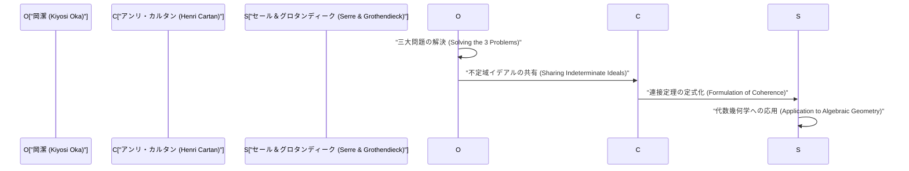
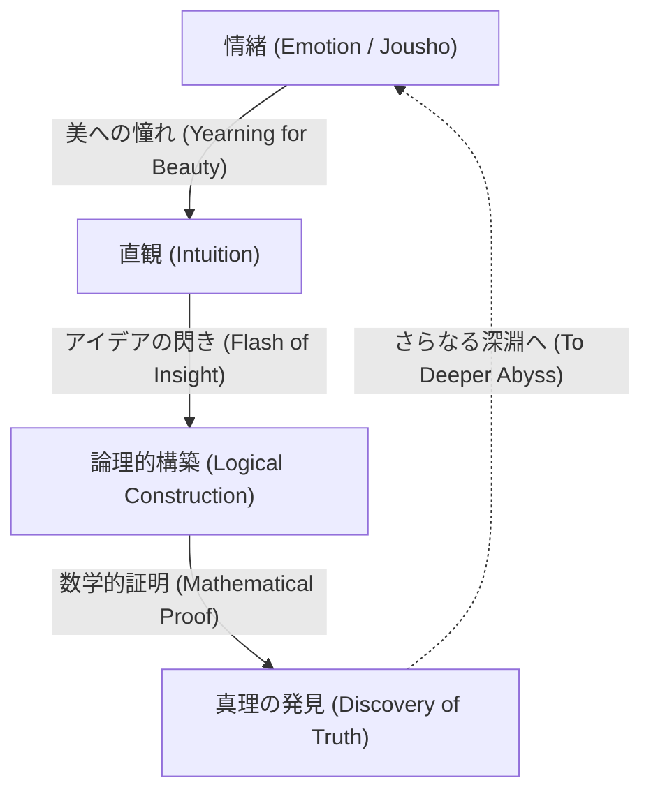

# 岡潔：数学と情緒の融合

岡潔（1901–1978）は、多変数複素解析において世界的な業績を残した日本の数学者です。彼の名を冠した「岡の定理（Oka's coherence theorem）」や「岡の原理（Oka's principle）」などは、現代数学において欠かせない基盤となっています。本記事では、彼の数奇な生涯、独自の哲学、そして多変数解析函数論における深遠な数学的業績について、余すところなく詳述します。

## 1. 生い立ちと初期の経歴：数学への道

岡潔は1901年4月19日、大阪府大阪市に生まれ、その後和歌山県で育ちました。幼少期から自然に親しみ、日本情緒あふれる環境で育ったことが、後の彼の哲学に大きな影響を与えました。

京都帝国大学理学部数学科に進学した岡は、そこで優れた師や学友と出会い、数学の奥深さに魅了されます。大学卒業後、彼は京都帝国大学の講師として教鞭をとりながら、自らの研究テーマを模索していました。当時の日本の数学界は、西洋の数学を吸収し、独自の発展を遂げようとする過渡期にありました。岡もまた、未解決の難問に挑むことで、世界的な数学者への道を歩み始めます。

## 2. フランス留学と多変数複素解析への目覚め

1929年、岡潔は文部省の在外研究員としてフランスのパリに留学します。この3年間のパリ滞在が、彼の数学者としての運命を決定づけました。

パリ大学で彼は、アンリ・カルタン（Henri Cartan）やガストン・ジュリア（Gaston Julia）といった、当時のヨーロッパ数学界を牽引する天才たちと交流します。特にジュリアの研究室に出入りする中で、岡は当時まだ荒野であった **多変数複素解析** （Several Complex Variables）という分野に出会いました。

一変数複素解析が19世紀にコーシーやリーマンらによって美しく完成されていたのに対し、多変数の場合は全く異なる困難が待ち受けていました。その代表的なものが「ハルトークスの現象」です。

$$
\text{ハルトークスの定理: } \mathbb{C}^n \ (n \ge 2) \text{ において、ある領域の境界で正則な関数は、自動的に領域内部へ正則に拡張される。}
$$

この定理は、多変数の正則関数が持つ驚くべき剛性（Rigidity）を示しています。岡は、この不可思議な多変数の世界を解明することに生涯を捧げる決意を固めたのです。

## 3. 数学的業績：三大問題の解決

岡潔の最大の業績は、多変数複素解析における「三大問題」を独力で解決したことです。これらの問題は、当時の数学界の最高峰の頭脳たちでさえ手を出せない難問でした。

### クザン問題（Cousin Problems）

クザン問題とは、一変数複素解析におけるミッタク＝レフラーの定理とワイエルシュトラスの定理を多変数に一般化する試みです。

*   **第1クザン問題（Cousin I problem）:** 与えられた極の分布（局所的な有理型関数）から、全体として一つの大域的な有理型関数を構成できるか？
*   **第2クザン問題（Cousin II problem）:** 与えられた零点の分布から、全体として一つの大域的な正則関数を構成できるか？

岡は、正則領域（Domains of holomorphy）においては第1クザン問題が常に解けることを証明しました。さらに、第2クザン問題については、位相的な条件（コホモロジー群の消滅）が必要であることを明らかにし、「岡の原理」と呼ばれる画期的な概念を導入しました。

### レヴィの問題（Levi's Problem）

レヴィの問題は、「擬凸領域（Pseudoconvex domains）は正則領域であるか？」という問題です。擬凸性は局所的・幾何学的な条件であり、正則領域は大域的・解析的な条件です。この二つが同値であるという予想は、長年にわたり未解決でした。

岡は1942年の論文（Oka VI）から1953年の論文（Oka IX）にかけて、この問題を完全に解決しました。特に、未知の領域を既知の領域で近似するという「不定域イデアル（Ideals of indeterminate domains）」の手法は、あまりにも独創的であり、当時の数学者たちを驚嘆させました。

### 岡の定理：連接層の発見

岡の最も深遠な業績の一つは、イデアル層の概念を導入し、「正則関数の層が連接である（coherent）」ことを示した **岡の連接定理** です。

$$
\mathcal{O}_{\mathbb{C}^n} \text{ は連接層（Coherent Sheaf）である。}
$$

この定理は、アンリ・カルタンの「カルタンの定理A・B」の基礎となり、さらにセールやグロタンディークによって代数幾何学へと応用されました。現代数学の共通言語である「層の理論（Sheaf Theory）」は、岡潔の孤独な闘いの中から生まれたのです。

## 4. 奇行と孤高の人生：エピソードの数々

天才には奇行がつきものと言われますが、岡潔も例外ではありませんでした。彼の行動は、純粋に真理を追究する姿勢の表れでした。

*   **晴れの日も長靴:** 岡は晴れの日でもゴム長靴を履いて歩くことがよくありました。靴紐を結ぶ時間が惜しかったとも、足元を気にせず思索に耽りたかったとも言われています。
*   **ネクタイを締めない:** 窮屈なものを嫌い、ノーネクタイで学会に現れることも珍しくありませんでした。
*   **自然との対話:** 道端の草花や木々に話しかけながら歩く姿が頻繁に目撃されています。彼は自然の中に潜む「美」と対話していたのです。

第二次世界大戦中から戦後にかけての時期、彼は極度の貧困と闘いながら研究を続けました。一時は数学から離れ、北海道や和歌山で農耕に従事していた時期もあります。しかし、土を耕しながらも彼の頭脳は多変数複素解析の深淵を彷徨っていました。論文を書く紙すら満足にない中、彼は歴史的な傑作を次々と書き上げたのです。

## 5. 「情緒」の哲学：数学の創造の本質

岡潔を語る上で欠かせないのが、彼独自の「情緒」という哲学です。彼は著書『春宵十話』の中で、「数学の中心は情緒である」と断言しています。

岡によれば、論理だけで新しい数学が生まれることは決してありません。論理はあくまで後から構築される骨組みに過ぎず、その源泉にあるのは「美しいものに対する憧れ」や「自然との調和を感じる心」なのです。

彼は松尾芭蕉の俳句や道元の禅思想を深く愛し、日本文化に根差した「無私の心」が真の創造性に不可欠であると説きました。計算機やAIがどれほど発達しようとも、この「情緒」を伴う閃きこそが人間の特権であり、最も崇高な精神活動であると彼は信じていました。

## 6. 付録：岡潔の主要論文（Oka I - Oka IX）の軌跡

岡潔の業績を語る上で、1936年から1953年にかけて発表された9編の論文、いわゆる「Oka I」から「Oka IX」は避けて通れません。

1.  **Oka I (1936):** 有理凸領域に関する研究。ここで初めて多変数における凸性の概念が深められました。
2.  **Oka II (1937):** 正則領域におけるクザンの第1問題の解決。
3.  **Oka III (1939):** クザンの第2問題の解決に向けた画期的なアプローチ。
4.  **Oka IV (1941):** 擬凸領域と正則領域の関係に迫る研究。
5.  **Oka V (1942):** コルテの定理の一般化。
6.  **Oka VI (1942):** 擬凸領域が正則領域であることを示すレヴィの問題の解決（2変数の場合）。
7.  **Oka VII (1950):** 擬凸領域における上空移行の原理。
8.  **Oka VIII (1951):** 不定域イデアルの基礎理論。ここで連接層の萌芽が見られます。
9.  **Oka IX (1953):** 分岐点を持たない内分岐領域におけるレヴィの問題の完全解決。

## 7. 後世への影響と遺産

1960年、岡潔はその類稀なる功績により、日本の文化勲章を受章しました。その後も奈良女子大学などで教鞭をとり、多くの後進を育成しました。晩年は数学教育や日本文化に関する執筆・講演活動にも力を入れ、多くの一般読者に感銘を与えました。

1978年に76歳でこの世を去るまで、彼は常に「真理とは何か」を問い続けました。彼が切り拓いた多変数複素解析の理論は、今や微分幾何学、代数幾何学、理論物理学にまで広く応用されています。岡潔の生涯は、単なる数学者の成功譚ではありません。それは、孤独の中で自らの内なる声に耳を澄ませ、絶対的な真理へと到達しようとする人間の魂の記録です。彼が遺した「情緒」というキーワードは、効率や論理ばかりが優先されがちな現代社会において、私たちに「真の豊かさとは何か」を静かに問いかけています。広大な数学の世界に咲いた一輪の孤高の桜、それが岡潔という人物だったのです。

## 8. 詳細な解説：不定域イデアルとは何か

岡潔の最大の発見の一つとされる「不定域イデアル（Ideals of indeterminate domains）」について、少し詳しく解説しましょう。

多変数複素解析において、関数を大域的に構成する際には、局所的なデータをいかにしてつなぎ合わせるかが鍵となります。一変数の場合は、特異点の構造が比較的単純であるため、解析接続を用いて関数を拡張していくことが容易です。しかし、多変数の場合はハルトークスの現象に見られるように、特異点が孤立せず、複雑な超曲面を形成します。

岡はこの困難を克服するために、領域を固定して関数を考えるのではなく、領域そのものを変動させながら関数の振る舞いを捉えるという、極めて斬新なアイデアを思いつきました。これが「不定域イデアル」の核心です。

具体的には、ある点 $p$ の近傍で定義された正則関数の芽（germs of holomorphic functions）のなす環 $\mathcal{O}_p$ を考え、その中のイデアル（ideal）を扱います。岡は、領域全体で定義されたイデアル層（sheaf of ideals）を構成し、それが局所的に有限生成であることを示しました。これが後にカルタンやセールによって「連接層（coherent sheaf）」として定式化される概念の原型です。

このアプローチは、当時の数学界の常識を根底から覆すものでした。領域の形状に依存する解析的な問題を、関数の代数的な構造（イデアル）の問題へと変換することで、トポロジー（位相幾何学）や代数幾何学の強力な手法を適用できる道を開いたのです。

## 9. 岡潔の言葉：名言集

岡潔はその生涯において、数多くの含蓄のある言葉を残しています。ここでは、彼の哲学を端的に表すいくつかの名言を紹介します。

*   **「数学の目標は真理の探究である。そして真理は美しい。」**
    （数学的真理と美が不可分であることを強調した言葉。）
*   **「計算をすることは数学ではない。それは機械にもできることだ。数学とは、まだ見ぬ調和を直観によって見出すことである。」**
    （論理的推論以前の、直観の重要性を説いた言葉。）
*   **「春の野に咲くスミレのように、ただ無心に真理を求める心。それこそが創造の原動力である。」**
    （自我を捨て、対象と一体化する東洋的な無私の精神を表した言葉。）

これらの言葉からもわかるように、岡潔にとって数学とは、単なる学問の一分野ではなく、人間の精神をより高みへと導くための「道（タオ）」であったと言えるでしょう。

## 10. まとめと展望

岡潔が私たちに残した遺産は、数学の定理だけではありません。彼は、人間の知性が到達し得る最高の境地を、その生き様を通して示してくれました。

現代の数学はますます細分化され、高度に専門化しています。また、人工知能（AI）の急速な発展により、数学の定理の証明さえも機械が自動で行う時代が到来しつつあります。しかし、どれほど技術が進歩しようとも、岡潔が語った「情緒」――未知の世界に対する好奇心、美しいものへの感動、そして真理を探究する無私の心――が失われない限り、数学は人間にとって最も魅力的で価値のある知的営みであり続けるでしょう。

岡潔の精神は、これからの時代を生きる私たち一人一人の中に、静かに、しかし力強く生き続けていくに違いありません。

## 追加資料：岡潔の思想と現代への示唆

岡潔が追求した「情緒」という概念は、今日においても色褪せることなく、むしろ現代社会においてこそ、その真価を発揮するものです。物質的な豊かさや論理的な合理性が極限まで追求される一方で、人々の精神的な豊かさや自然との調和が失われつつある現代において、彼の思想は一つの道標となります。

数学という最も厳密で論理的な学問の頂点に立った人物が、最終的に「情緒」や「無私」といった、一見すると非論理的で人間的な要素に回帰したという事実は、非常に逆説的でありながらも深い真理を含んでいます。それは、人間の創造性というものが、決して機械的な計算や単なる情報処理の延長線上にあるのではなく、より根源的な生命の営み、自然との共鳴の中から生まれるものであることを示唆しています。岡潔の数学と哲学は、未来永劫、私たちを照らし続けるでしょう。

さらに、彼の生涯を振り返ると、極度の貧困や周囲の無理解といった困難な状況にあっても、決して真理への探求を諦めなかったその強靭な精神力に驚かされます。彼は、生活の糧を得るために農業に従事しながらも、頭の中では常に多変数複素解析の難問と格闘していました。このような極限状態における精神の集中こそが、「不定域イデアル」という、当時の数学の常識を覆す画期的な概念を生み出す原動力となったのです。

私たちは、岡潔の遺した数学的業績から学ぶだけでなく、その生き方そのものからも、多くのことを学ぶことができます。真の創造性とは何か、そして人間として豊かに生きるとはどういうことか。岡潔の人生は、これらの根源的な問いに対する、一つの力強い答えを示していると言えるでしょう。彼の残した足跡は、日本の数学界のみならず、世界中の人々にインスピレーションを与え続けています。
