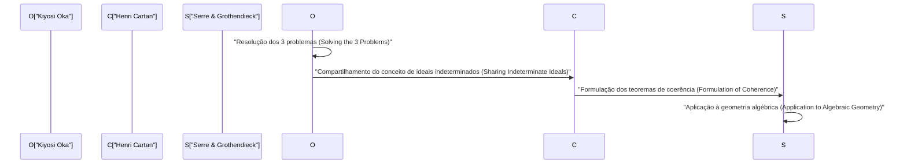
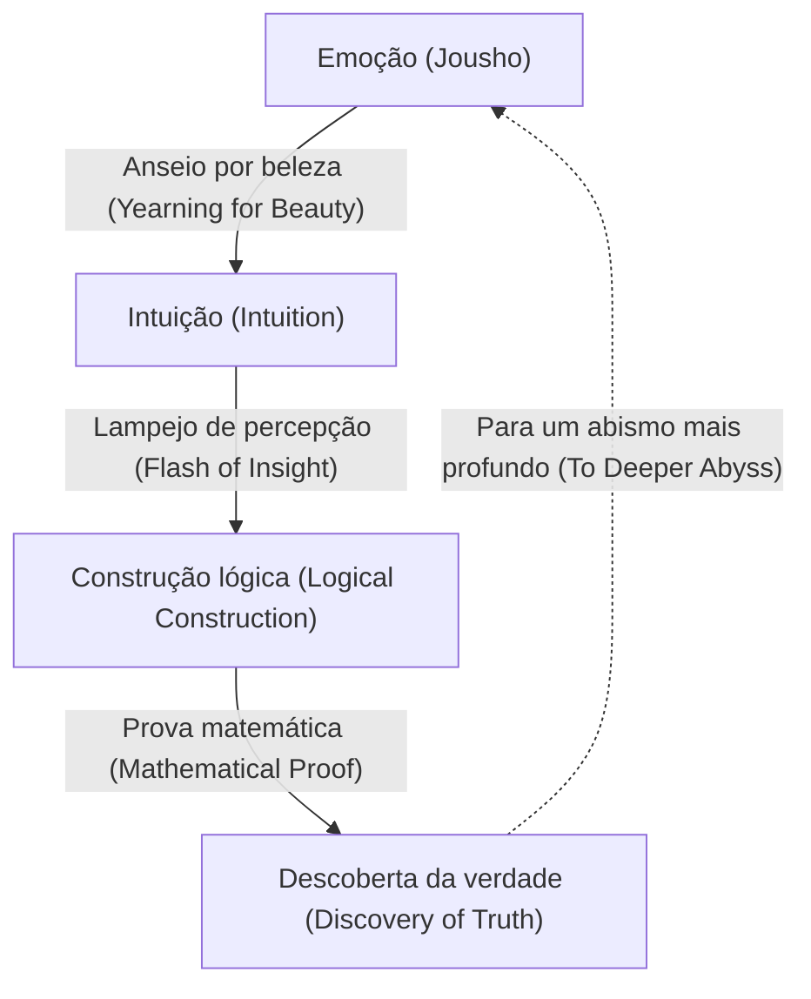

# [Kiyosi Oka](https://kenji.blog/pt/p/oka-kiyoshi/): A fusão da matemática e da emoção

[Kiyosi Oka](https://kenji.blog/pt/p/oka-kiyoshi/) (1901–1978) foi um matemático japonês que deixou um legado de classe mundial no campo de várias variáveis complexas (Several Complex Variables). Conceitos que levam seu nome, como o "teorema da coerência de Oka" (Oka's coherence theorem) e o "princípio de Oka" (Oka's principle), servem como fundamentos indispensáveis na matemática moderna. Neste artigo, detalhamos sua vida extraordinária, sua filosofia única e suas profundas conquistas matemáticas na teoria de funções de várias variáveis complexas sem omitir nada.

## 1. Início de vida e carreira: O caminho para a matemática

[Kiyosi Oka](https://kenji.blog/pt/p/oka-kiyoshi/) nasceu em 19 de abril de 1901, na cidade de Osaka, província de Osaka, e posteriormente foi criado na província de Wakayama. Sua familiaridade com a natureza desde tenra idade e sua criação em um ambiente transbordante de emoção japonesa (Jousho) influenciaram fortemente sua filosofia posterior.

Ao ingressar no Departamento de Matemática da Faculdade de Ciências da Universidade Imperial de Kyoto, Oka conheceu excelentes mentores e amigos, tornando-se cativado pelas profundezas da matemática. Após se formar, ele ensinou como palestrante na Universidade Imperial de Kyoto enquanto buscava seu próprio tema de pesquisa. Naquela época, a comunidade matemática japonesa estava em um período de transição, absorvendo a matemática ocidental e visando alcançar seu próprio desenvolvimento único. Oka, também, embarcou no caminho para se tornar um matemático de renome mundial desafiando problemas difíceis não resolvidos.

## 2. Estudando na França e o despertar para várias variáveis complexas

Em 1929, [Kiyosi Oka](https://kenji.blog/pt/p/oka-kiyoshi/) viajou para Paris, França, para estudar no exterior como pesquisador para o Ministério da Educação. Esta estadia de três anos em Paris determinou decisivamente seu destino como matemático.

Na Universidade de Paris, ele interagiu com gênios que lideravam o mundo matemático europeu na época, como Henri Cartan e Gaston Julia. Particularmente enquanto frequentava o laboratório de Julia, Oka encontrou o campo de **várias variáveis complexas**, que então ainda era uma selva inexplorada.

Embora a análise complexa de uma variável tivesse sido belamente completada no século XIX por [Cauchy](https://kenji.blog/pt/p/cauchy/), [Riemann](https://kenji.blog/pt/p/riemann/) e outros, dificuldades inteiramente diferentes aguardavam no caso de várias variáveis. Um exemplo representativo é o "fenômeno de Hartogs".

$$
\text{Teorema de Hartogs: Em } \mathbb{C}^n \ (n \ge 2) \text{, uma função que é holomorfa na fronteira de um certo domínio é automaticamente estendida holomorficamente para o interior do domínio.}
$$

Este teorema demonstra a impressionante rigidez que as funções holomorfas de várias variáveis possuem. Oka consolidou sua determinação de dedicar sua vida a elucidar esse mundo misterioso de várias variáveis.

## 3. Conquistas matemáticas: Resolvendo os três grandes problemas

A maior conquista de [Kiyosi Oka](https://kenji.blog/pt/p/oka-kiyoshi/) é ter resolvido independentemente os "Três Grandes Problemas" em várias variáveis complexas. Esses eram problemas formidáveis que mesmo as maiores mentes do mundo matemático da época não conseguiam tocar.

### Problemas de Cousin (Cousin Problems)

Os problemas de Cousin representam uma tentativa de generalizar o teorema de Mittag-Leffler e o teorema de Weierstrass na análise complexa de uma variável para várias variáveis.

*   **Primeiro problema de Cousin (Cousin I problem):** Pode-se construir uma única função meromorfa global a partir de uma distribuição dada de polos (funções meromorfas locais)?
*   **Segundo problema de Cousin (Cousin II problem):** Pode-se construir uma única função holomorfa global a partir de uma distribuição dada de zeros?

Oka provou que o primeiro problema de Cousin sempre pode ser resolvido em domínios de holomorfia (Domains of holomorphy). Além disso, em relação ao segundo problema de Cousin, ele esclareceu que uma condição topológica (o anulamento de um grupo de cohomologia) é necessária, introduzindo um conceito revolucionário conhecido como o "princípio de Oka".

### Problema de Levi (Levi's Problem)

O problema de Levi pergunta: "Os domínios pseudoconvexos (Pseudoconvex domains) são domínios de holomorfia?" A pseudoconvexidade é uma condição local e geométrica, enquanto um domínio de holomorfia é uma condição global e analítica. A conjectura de que essas duas são equivalentes permaneceu sem solução por muitos anos.

Oka resolveu completamente este problema desde seu artigo de 1942 (Oka VI) até seu artigo de 1953 (Oka IX). Em particular, sua técnica de "ideais de domínios indeterminados" (Ideals of indeterminate domains), que aproxima um domínio desconhecido com domínios conhecidos, foi tão profundamente original que surpreendeu os matemáticos da época.

### Teorema de Oka: Descoberta de feixes coerentes

Uma das conquistas mais profundas de Oka é a introdução do conceito de feixes de ideais, provando que o feixe de funções holomorfas é coerente (coherent), conhecido como o **teorema da coerência de Oka**.

$$
\mathcal{O}_{\mathbb{C}^n} \text{ é um feixe coerente (Coherent Sheaf).}
$$

Este teorema tornou-se a base dos "Teoremas A e B de Cartan" de Henri Cartan, e foi posteriormente aplicado à geometria algébrica por Jean-Pierre Serre e [Alexander Grothendieck](https://kenji.blog/pt/p/grothendieck/). A "teoria de feixes" (Sheaf Theory), a linguagem comum da matemática moderna, nasceu da luta solitária de [Kiyosi Oka](https://kenji.blog/pt/p/oka-kiyoshi/).

## 4. Excentricidade e uma vida solitária: Numerosos episódios

Diz-se que os gênios frequentemente têm excentricidades, e [Kiyosi Oka](https://kenji.blog/pt/p/oka-kiyoshi/) não foi exceção. Suas ações foram uma manifestação de sua atitude de perseguir puramente a verdade.

*   **Botas de borracha mesmo em dias ensolarados:** Oka costumava caminhar usando botas de borracha mesmo em dias claros. Diz-se que ele se ressentia do tempo para amarrar os cadarços ou queria mergulhar em pensamentos sem se preocupar com seus passos.
*   **Sem gravata:** Odiando coisas apertadas, não era incomum que ele aparecesse em conferências acadêmicas sem gravata.
*   **Diálogo com a natureza:** Ele era frequentemente visto falando com flores e árvores na beira da estrada enquanto caminhava. Ele estava conversando com a "beleza" escondida na natureza.

Durante e após a Segunda Guerra Mundial, ele continuou sua pesquisa enquanto lutava contra a extrema pobreza. Houve um tempo em que ele se afastou temporariamente da matemática e se envolveu com a agricultura em Hokkaido e Wakayama. No entanto, mesmo arando o solo, sua mente vagava pelo abismo de várias variáveis complexas. Sem nem mesmo papel adequado para escrever seus artigos, ele produziu consecutivamente obras-primas históricas.

## 5. A filosofia de "Jousho" (Emoção): A essência da criação matemática

Indispensável ao falar sobre [Kiyosi Oka](https://kenji.blog/pt/p/oka-kiyoshi/) é sua filosofia única de "Jousho" (Emoção). Em seu livro *Dez discursos nas noites de primavera*, ele afirma: "O centro da matemática é a emoção".

De acordo com Oka, a nova matemática nunca nasce apenas da lógica. A lógica é apenas uma estrutura construída posteriormente; sua fonte reside em um "anseio por coisas belas" e um "coração que sente harmonia com a natureza".

Ele amava profundamente o haicai de Matsuo Basho e a filosofia zen de Dogen, pregando que um "coração altruísta" enraizado na cultura japonesa é essencial para a verdadeira criatividade. Por mais que os computadores e a IA avancem, ele acreditava que esse lampejo de percepção acompanhado por "emoção" é um privilégio da humanidade e a atividade mental mais sublime.

## 6. Apêndice: A trajetória dos principais artigos de [Kiyosi Oka](https://kenji.blog/pt/p/oka-kiyoshi/) (Oka I - Oka IX)

Ao discutir as conquistas de [Kiyosi Oka](https://kenji.blog/pt/p/oka-kiyoshi/), não se pode evitar os nove artigos publicados entre 1936 e 1953, conhecidos como "Oka I" a "Oka IX".

1.  **Oka I (1936):** Pesquisa sobre domínios racionalmente convexos. Aqui, o conceito de convexidade em várias variáveis foi aprofundado pela primeira vez.
2.  **Oka II (1937):** Solução do primeiro problema de Cousin em domínios de holomorfia.
3.  **Oka III (1939):** Uma abordagem revolucionária para resolver o segundo problema de Cousin.
4.  **Oka IV (1941):** Pesquisa abordando a relação entre domínios pseudoconvexos e domínios de holomorfia.
5.  **Oka V (1942):** Generalização do teorema de Cartan.
6.  **Oka VI (1942):** Solução do problema de Levi mostrando que um domínio pseudoconvexo é um domínio de holomorfia (no caso de duas variáveis).
7.  **Oka VII (1950):** O princípio da continuação para cima em domínios pseudoconvexos.
8.  **Oka VIII (1951):** Teoria básica de ideais indeterminados. A aurora dos feixes coerentes é vista aqui.
9.  **Oka IX (1953):** Solução completa do problema de Levi em domínios internos não ramificados sem pontos de ramificação.

## 7. Impacto nas gerações futuras e legado

Em 1960, [Kiyosi Oka](https://kenji.blog/pt/p/oka-kiyoshi/) foi premiado com a Ordem da Cultura do Japão por suas conquistas inigualáveis. Posteriormente, ele continuou a ensinar na Universidade de Mulheres de Nara e em outras instituições, fomentando muitos sucessores. Em seus últimos anos, ele também se concentrou em escrever e dar palestras sobre educação matemática e cultura japonesa, comovendo profundamente muitos leitores gerais.

Até falecer em 1978, aos 76 anos, ele continuamente perguntava: "O que é a verdade?". A teoria de várias variáveis complexas da qual ele foi pioneiro é agora amplamente aplicada à geometria diferencial, geometria algébrica e física teórica. A vida de [Kiyosi Oka](https://kenji.blog/pt/p/oka-kiyoshi/) não é meramente a história de sucesso de um matemático. É o registro de uma alma humana tentando alcançar a verdade absoluta ouvindo atentamente sua voz interior na solidão. A palavra-chave "emoção" que ele deixou para trás nos pergunta silenciosamente: "O que é a verdadeira riqueza?" em uma sociedade moderna onde a eficiência e a lógica tendem a ser priorizadas. Uma única e solitária flor de cerejeira desabrochando no vasto mundo da matemática – essa foi a pessoa chamada [Kiyosi Oka](https://kenji.blog/pt/p/oka-kiyoshi/).

## 8. Explicação detalhada: O que é um ideal indeterminado?

Vamos explicar um pouco mais em detalhes sobre "ideais de domínios indeterminados", considerados uma das maiores descobertas de Oka.

Em várias variáveis complexas, ao construir uma função globalmente, o ponto-chave é como juntar dados locais. No caso de uma variável, como a estrutura das singularidades é relativamente simples, é fácil estender a função usando a continuação analítica. No entanto, no caso de várias variáveis, como visto no fenômeno de Hartogs, as singularidades não são isoladas, mas formam hipersuperfícies complexas.

Para superar essa dificuldade, Oka concebeu uma ideia extremamente inovadora: em vez de fixar um domínio e considerar a função, ele capturou o comportamento da função enquanto variava o próprio domínio. Este é o cerne do "ideal indeterminado".

Especificamente, considere o anel $\mathcal{O}_p$ formado pelos germes de funções holomorfas (germs of holomorphic functions) definidos na vizinhança de um certo ponto $p$, e lide com os ideais dentro dele. Oka construiu um feixe de ideais (sheaf of ideals) definido sobre todo o domínio e mostrou que é localmente finitamente gerado. Este é o protótipo do conceito mais tarde formalizado por Cartan e Serre como um "feixe coerente" (coherent sheaf).

Essa abordagem derrubou fundamentalmente o senso comum do mundo matemático da época. Ao transformar um problema analítico dependente da forma de um domínio em um problema de estrutura algébrica (ideais) de funções, ele abriu o caminho para aplicar os métodos poderosos da topologia e da geometria algébrica.

## 9. Palavras de [Kiyosi Oka](https://kenji.blog/pt/p/oka-kiyoshi/): Uma coleção de citações

Ao longo de sua vida, [Kiyosi Oka](https://kenji.blog/pt/p/oka-kiyoshi/) deixou muitas palavras cheias de profundas implicações. Aqui, apresentamos algumas citações famosas que expressam adequadamente sua filosofia.

*   **"O objetivo da matemática é a busca da verdade. E a verdade é bela."**
    (Uma citação enfatizando que a verdade matemática e a beleza são inseparáveis.)
*   **"Calcular não é matemática. Isso é algo que uma máquina pode fazer. A matemática é descobrir a harmonia invisível por meio da intuição."**
    (Uma citação pregando a importância da intuição, precedendo a dedução lógica.)
*   **"Como uma violeta desabrochando em um campo de primavera, um coração que simplesmente busca a verdade inocentemente. Essa é a força motriz da criação."**
    (Uma citação expressando o espírito oriental de altruísmo, descartando o ego e se unificando com o objeto.)

Como se pode ver por essas palavras, para [Kiyosi Oka](https://kenji.blog/pt/p/oka-kiyoshi/), a matemática não era meramente um ramo acadêmico, mas poderia ser dita ser um "Tao (Caminho)" para guiar o espírito humano para reinos superiores.

## 10. Conclusão e perspectivas

O legado que [Kiyosi Oka](https://kenji.blog/pt/p/oka-kiyoshi/) nos deixou não é apenas teoremas matemáticos. Ele nos mostrou o estado mais elevado que o intelecto humano pode alcançar por meio de seu modo de vida.

A matemática moderna está se tornando cada vez mais subdividida e altamente especializada. Além disso, com o rápido desenvolvimento da inteligência artificial (IA), está chegando uma era em que até mesmo a prova de teoremas matemáticos será realizada automaticamente por máquinas. No entanto, não importa o quanto a tecnologia avance, desde que a "emoção" de que Oka falou – curiosidade por mundos desconhecidos, se comover com coisas belas e um coração altruísta perseguindo a verdade – não se perca, a matemática continuará a ser o empreendimento intelectual mais fascinante e valioso para a humanidade.

O espírito de [Kiyosi Oka](https://kenji.blog/pt/p/oka-kiyoshi/) certamente continuará a viver quieta, mas poderosamente, dentro de cada um de nós vivendo na era que se aproxima.

## Material Adicional: A filosofia de Oka e as implicações para a era moderna

O conceito de "emoção" perseguido por [Kiyosi Oka](https://kenji.blog/pt/p/oka-kiyoshi/) não desapareceu mesmo hoje; em vez disso, é na sociedade moderna que seu verdadeiro valor é demonstrado. Enquanto a riqueza material e a racionalidade lógica são perseguidas até o limite, a riqueza espiritual das pessoas e a harmonia com a natureza estão sendo perdidas. Em tal sociedade moderna, sua filosofia serve como um guia.

O fato de uma pessoa que estava no auge da matemática – a disciplina mais rigorosa e lógica – ter retornado a elementos aparentemente ilógicos e humanos como "emoção" e "altruísmo" contém uma verdade profunda, embora muito paradoxal. Sugere que a criatividade humana nunca é uma extensão do cálculo mecânico ou do mero processamento de informações, mas nasce de atividades vitais mais fundamentais e da ressonância com a natureza. A matemática e a filosofia de Oka continuarão a nos iluminar por toda a eternidade.

Além disso, olhando para trás em sua vida, nos surpreendemos com seu espírito resiliente, que nunca desistiu da busca pela verdade mesmo em situações difíceis como a pobreza extrema e a incompreensão daqueles ao seu redor. Enquanto se envolvia na agricultura para ganhar o pão de cada dia, ele estava constantemente lutando com problemas difíceis de várias variáveis complexas em sua mente. Foi essa concentração mental em condições tão extremas que se tornou a força motriz para gerar o conceito inovador de "ideais indeterminados" que derrubou o senso comum matemático da época.

Podemos aprender muito não apenas com as conquistas matemáticas que Oka deixou para trás, mas também com o seu modo de vida em si. O que é a verdadeira criatividade e o que significa viver ricamente como ser humano? Pode-se dizer que a vida de [Kiyosi Oka](https://kenji.blog/pt/p/oka-kiyoshi/) fornece uma resposta poderosa a essas questões fundamentais. Os passos que ele deixou continuam a inspirar não apenas a comunidade matemática japonesa, mas pessoas de todo o mundo.
