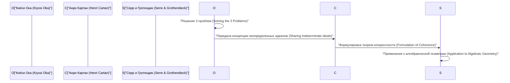
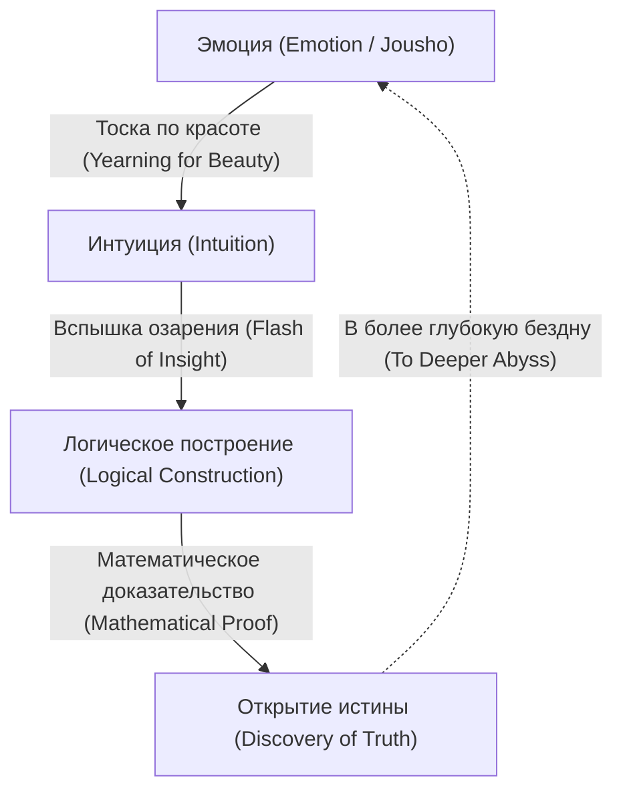

# [Киёси Ока](https://kenji.blog/ru/p/oka-kiyoshi/): Слияние математики и эмоций

[Киёси Ока](https://kenji.blog/ru/p/oka-kiyoshi/) (1901–1978) был японским математиком, оставившим наследие мирового уровня в области теории функций многих комплексных переменных (Several Complex Variables). Понятия, носящие его имя, такие как «теорема когерентности Оки» (Oka's coherence theorem) и «принцип Оки» (Oka's principle), служат незаменимой основой современной математики. В этой статье мы подробно описываем его необычную жизнь, его уникальную философию и его глубокие математические достижения в теории функций многих комплексных переменных, ничего не упуская.

## 1. Ранние годы и карьера: Путь в математику

[Киёси Ока](https://kenji.blog/ru/p/oka-kiyoshi/) родился 19 апреля 1901 года в городе Осака, префектура Осака, и впоследствии вырос в префектуре Вакаяма. Его знакомство с природой с ранних лет и воспитание в среде, переполненной японскими эмоциями (дзёсё), сильно повлияли на его дальнейшую философию.

Поступив на математический факультет естественнонаучного колледжа Киотского императорского университета, Ока встретил выдающихся наставников и друзей, увлекшись глубинами математики. После окончания учебы он преподавал в качестве лектора в Киотском императорском университете, одновременно ища собственную тему для исследований. В то время японское математическое сообщество находилось в переходном периоде, впитывая западную математику и стремясь к собственному уникальному развитию. Ока также встал на путь всемирно известного математика, бросив вызов нерешенным сложным проблемам.

## 2. Учеба во Франции и пробуждение к многим комплексным переменным

В 1929 году [Киёси Ока](https://kenji.blog/ru/p/oka-kiyoshi/) отправился в Париж, Франция, на стажировку в качестве иностранного исследователя от Министерства образования. Это трехлетнее пребывание в Париже решительно определило его судьбу как математика.

В Парижском университете он общался с гениями, возглавлявшими тогда европейский математический мир, такими как Анри Картан и Гастон Жюлиа. Особенно часто посещая лабораторию Жюлиа, Ока столкнулся с областью **многих комплексных переменных**, которая тогда была еще неисследованной пустыней.

В то время как комплексный анализ одной переменной был прекрасно завершен в 19 веке Коши, Риманом и другими, в случае многих переменных ожидали совершенно другие трудности. Характерным примером является «феномен Гартогса».

$$
\text{Теорема Гартогса: В } \mathbb{C}^n \ (n \ge 2) \text{ функция, голоморфная на границе некоторой области, автоматически голоморфно продолжается внутрь этой области.}
$$

Эта теорема демонстрирует поразительную жесткость, которой обладают голоморфные функции многих переменных. Ока укрепился в своем решении посвятить жизнь прояснению этого таинственного мира многих переменных.

## 3. Математические достижения: Решение трех главных проблем

Величайшим достижением Киёси Оки является то, что он самостоятельно решил «Три главные проблемы» в теории функций многих комплексных переменных. Это были невероятно сложные проблемы, к которым не могли подступиться даже величайшие умы математического мира того времени.

### Проблемы Кузена (Cousin Problems)

Проблемы Кузена представляют собой попытку обобщить теорему Миттаг-Леффлера и теорему Вейерштрасса из комплексного анализа одной переменной на случай многих переменных.

*   **Первая проблема Кузена (Cousin I problem):** Можно ли построить единую глобальную мероморфную функцию по заданному распределению полюсов (локальных мероморфных функций)?
*   **Вторая проблема Кузена (Cousin II problem):** Можно ли построить единую глобальную голоморфную функцию по заданному распределению нулей?

Ока доказал, что первая проблема Кузена всегда разрешима в областях голоморфности (Domains of holomorphy). Кроме того, что касается второй проблемы Кузена, он прояснил, что необходимо топологическое условие (исчезновение группы когомологий), введя революционную концепцию, известную как «принцип Оки».

### Проблема Леви (Levi's Problem)

Проблема Леви спрашивает: «Являются ли псевдовыпуклые области (Pseudoconvex domains) областями голоморфности?» Псевдовыпуклость — это локальное геометрическое условие, тогда как область голоморфности — это глобальное аналитическое условие. Гипотеза о том, что эти два условия эквивалентны, оставалась нерешенной на протяжении многих лет.

Ока полностью решил эту проблему, начиная со своей статьи 1942 года (Oka VI) и заканчивая статьей 1953 года (Oka IX). В частности, его метод «идеалов неопределенных областей» (Ideals of indeterminate domains), который аппроксимирует неизвестную область известными областями, был настолько глубоко оригинальным, что поразил математиков того времени.

### Теорема Оки: Открытие когерентных пучков

Одним из самых глубоких достижений Оки является введение понятия пучков идеалов, доказавшее, что пучок голоморфных функций является когерентным (coherent), что известно как **теорема когерентности Оки**.

$$
\mathcal{O}_{\mathbb{C}^n} \text{ является когерентным пучком (Coherent Sheaf).}
$$

Эта теорема стала основой «Теорем A и B Картана» Анри Картана, а впоследствии была применена в алгебраической геометрии Жан-Пьером Серром и Александром Гротендиком. «Теория пучков» (Sheaf Theory), общий язык современной математики, родилась из одинокой борьбы Киёси Оки.

## 4. Эксцентричность и одинокая жизнь: Многочисленные эпизоды

Говорят, что гениям часто свойственны странности, и [Киёси Ока](https://kenji.blog/ru/p/oka-kiyoshi/) не был исключением. Его поступки были проявлением его стремления к чистому познанию истины.

*   **Резиновые сапоги даже в солнечные дни:** Ока часто гулял в резиновых сапогах даже в ясные дни. Говорят, ему либо было жаль тратить время на завязывание шнурков, либо он хотел предаваться размышлениям, не заботясь о том, куда наступает.
*   **Без галстука:** Ненавидя тесные вещи, он нередко появлялся на научных конференциях без галстука.
*   **Диалог с природой:** Его часто видели разговаривающим с придорожными цветами и деревьями во время прогулок. Он беседовал с «красотой», скрытой в природе.

Во время и после Второй мировой войны он продолжал свои исследования, борясь с крайней нищетой. Был период, когда он временно отошел от математики и занялся сельским хозяйством на Хоккайдо и в Вакаяме. Однако даже возделывая землю, его разум блуждал в бездне многих комплексных переменных. Не имея даже достаточного количества бумаги для написания своих статей, он одну за другой выдавал исторические шедевры.

## 5. Философия «Дзёсё» (Эмоции): Суть математического творчества

Незаменимой при разговоре о Киёси Оке является его уникальная философия «Дзёсё» (Эмоция). В своей книге «Десять бесед весенними вечерами» он утверждает: «В центре математики лежит эмоция».

Согласно Оке, новая математика никогда не рождается только из логики. Логика — это лишь каркас, создаваемый постфактум; ее источник кроется в «тоске по прекрасному» и «сердце, чувствующем гармонию с природой».

Он глубоко любил хайку Мацуо Басё и дзен-философию Догэна, проповедуя, что «бескорыстное сердце», укорененное в японской культуре, необходимо для истинного творчества. Независимо от того, насколько продвинутыми станут компьютеры и ИИ, он верил, что эта вспышка озарения, сопровождаемая «эмоцией», является привилегией человечества и самой возвышенной умственной деятельностью.

## 6. Приложение: Траектория главных статей Киёси Оки (Oka I - Oka IX)

Обсуждая достижения Киёси Оки, невозможно обойти стороной девять статей, опубликованных в период с 1936 по 1953 год, известных как «Oka I» — «Oka IX».

1.  **Oka I (1936):** Исследование рационально выпуклых областей. Здесь впервые была углублена концепция выпуклости для многих переменных.
2.  **Oka II (1937):** Решение первой проблемы Кузена в областях голоморфности.
3.  **Oka III (1939):** Революционный подход к решению второй проблемы Кузена.
4.  **Oka IV (1941):** Исследование, приближающееся к связи между псевдовыпуклыми областями и областями голоморфности.
5.  **Oka V (1942):** Обобщение теоремы Картана.
6.  **Oka VI (1942):** Решение проблемы Леви, показывающее, что псевдовыпуклая область является областью голоморфности (в случае двух переменных).
7.  **Oka VII (1950):** Принцип аналитического продолжения вверх в псевдовыпуклых областях.
8.  **Oka VIII (1951):** Базовая теория неопределенных идеалов. Здесь виден рассвет когерентных пучков.
9.  **Oka IX (1953):** Полное решение проблемы Леви в неразветвленных внутренних областях без точек ветвления.

## 7. Влияние на будущие поколения и наследие

В 1960 году [Киёси Ока](https://kenji.blog/ru/p/oka-kiyoshi/) был награжден японским Орденом Культуры за свои беспрецедентные достижения. Впоследствии он продолжал преподавать в Женском университете Нары и других учреждениях, воспитывая многих преемников. В свои поздние годы он также сосредоточился на написании книг и чтении лекций о математическом образовании и японской культуре, глубоко тронув многих обычных читателей.

Вплоть до своей смерти в 1978 году в возрасте 76 лет он постоянно задавался вопросом: «Что есть истина?». Теория функций многих комплексных переменных, пионером которой он был, сейчас широко применяется в дифференциальной геометрии, алгебраической геометрии и теоретической физике. Жизнь Киёси Оки — это не просто история успеха математика. Это запись человеческой души, пытающейся постичь абсолютную истину, внимательно прислушиваясь к своему внутреннему голосу в одиночестве. Оставленное им ключевое слово «эмоция» тихо спрашивает нас: «В чем истинное богатство?» в современном обществе, где приоритет часто отдается эффективности и логике. Одинокий цветок сакуры, цветущий в бескрайнем мире математики — таким был человек по имени [Киёси Ока](https://kenji.blog/ru/p/oka-kiyoshi/).

## 8. Подробное объяснение: Что такое неопределенный идеал?

Давайте немного подробнее объясним «идеалы неопределенных областей», считающиеся одним из величайших открытий Оки.

В теории функций многих комплексных переменных при глобальном построении функции ключом является то, как соединить локальные данные. В случае одной переменной, поскольку структура особенностей относительно проста, функцию легко расширить с помощью аналитического продолжения. Однако в случае многих переменных, как видно на примере феномена Гартогса, особенности не изолированы, а образуют сложные гиперповерхности.

Чтобы преодолеть эту трудность, Ока придумал чрезвычайно новаторскую идею: вместо того чтобы фиксировать область и рассматривать функцию, он фиксировал поведение функции, изменяя саму область. В этом суть «неопределенного идеала».

В частности, рассмотрим кольцо $\mathcal{O}_p$, образованное ростками голоморфных функций (germs of holomorphic functions), определенными в окрестности некоторой точки $p$, и рассмотрим идеалы внутри него. Ока построил пучок идеалов (sheaf of ideals), определенный над всей областью, и показал, что он локально конечно порожден. Это прототип концепции, позже формализованной Картаном и Серром как «когерентный пучок» (coherent sheaf).

Этот подход фундаментально перевернул здравый смысл математического мира того времени. Превратив аналитическую проблему, зависящую от формы области, в проблему алгебраической структуры (идеалов) функций, он открыл путь к применению мощных методов топологии и алгебраической геометрии.

## 9. Слова Киёси Оки: Сборник цитат

На протяжении всей своей жизни [Киёси Ока](https://kenji.blog/ru/p/oka-kiyoshi/) оставил много слов, полных глубокого смысла. Здесь мы приводим несколько известных цитат, метко выражающих его философию.

*   **«Цель математики — поиск истины. А истина прекрасна».**
    (Цитата, подчеркивающая неразделимость математической истины и красоты.)
*   **«Вычисления — это не математика. Это то, что может делать машина. Математика — это открытие невидимой гармонии посредством интуиции».**
    (Цитата, проповедующая важность интуиции, предшествующей логическому выводу.)
*   **«Подобно фиалке, цветущей на весеннем поле, сердце, просто и невинно ищущее истину. Это и есть движущая сила созидания».**
    (Цитата, выражающая восточный дух бескорыстия, отказа от эго и слияния с объектом.)

Как видно из этих слов, для Киёси Оки математика была не просто академической дисциплиной, но, можно сказать, «Дао (Путем)», ведущим человеческий дух в высшие сферы.

## 10. Заключение и перспективы

Наследие, которое оставил нам [Киёси Ока](https://kenji.blog/ru/p/oka-kiyoshi/), — это не только математические теоремы. Своим образом жизни он показал нам высшее состояние, которого может достичь человеческий интеллект.

Современная математика становится все более подразделенной и узкоспециализированной. Более того, с быстрым развитием искусственного интеллекта (ИИ) наступает эра, когда даже доказательство математических теорем будет автоматически выполняться машинами. Однако, как бы ни развивались технологии, до тех пор, пока не будет утрачена «эмоция», о которой говорил Ока, — любопытство к неизведанным мирам, способность восхищаться прекрасным и бескорыстное сердце, ищущее истину, — математика будет оставаться самым увлекательным и ценным интеллектуальным занятием для человечества.

Дух Киёси Оки, несомненно, продолжит тихо, но мощно жить в каждом из нас, живущих в грядущую эпоху.

## Дополнительный материал: Философия Оки и ее значение для современной эпохи

Концепция «эмоции», к которой стремился [Киёси Ока](https://kenji.blog/ru/p/oka-kiyoshi/), не померкла и сегодня; напротив, именно в современном обществе проявляется ее истинная ценность. В то время как материальное богатство и логическая рациональность преследуются до предела, духовное богатство людей и гармония с природой утрачиваются. В таком современном обществе его философия служит путеводным знаком.

Тот факт, что человек, стоявший на вершине математики — самой строгой и логичной дисциплины — в конечном итоге вернулся к, казалось бы, нелогичным и человеческим элементам, таким как «эмоция» и «бескорыстие», содержит в себе глубокую истину, хотя и весьма парадоксальную. Это говорит о том, что человеческое творчество никогда не является продолжением механических вычислений или простой обработки информации, а рождается из более фундаментальных жизненных процессов и резонанса с природой. Математика и философия Оки будут продолжать просвещать нас вечно.

Более того, оглядываясь на его жизнь, поражаешься его стойкому духу, который никогда не сдавался в поиске истины даже в трудных ситуациях, таких как крайняя бедность и непонимание со стороны окружающих. Занимаясь сельским хозяйством, чтобы заработать на хлеб насущный, он постоянно мысленно боролся со сложными проблемами функций многих комплексных переменных. Именно эта умственная концентрация в таких экстремальных условиях стала движущей силой для создания новаторской концепции «неопределенных идеалов», перевернувшей математический здравый смысл того времени.

Мы можем многому научиться не только из математических достижений, оставленных Окой, но и из самого его образа жизни. Что такое истинное творчество и что значит жить богатой жизнью как человек? Можно сказать, что жизнь Киёси Оки дает мощный ответ на эти фундаментальные вопросы. Оставленные им следы продолжают вдохновлять не только японское математическое сообщество, но и людей во всем мире.
