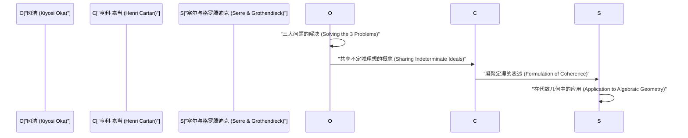
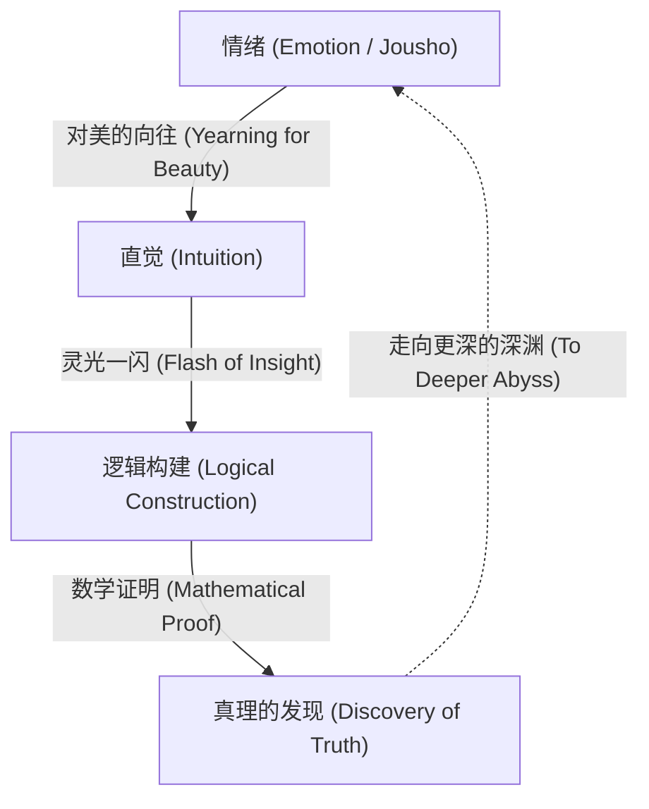

# 冈洁：数学与情绪的融合

冈洁（1901–1978）是一位在多变量复分析领域留下世界级成就的日本数学家。以他名字命名的“冈定理（Oka's coherence theorem）”和“冈原理（Oka's principle）”等，已成为现代数学中不可或缺的基础。在本文中，我们将毫无保留地详细讲述他传奇的一生、独特的哲学，以及在多变量解析函数论中深远的数学成就。

## 1. 成长经历与早期生涯：走向数学之路

冈洁于1901年4月19日出生于大阪府大阪市，随后在和歌山县长大。从小亲近自然，在充满日本情绪的环境中长大的经历，对他后来的哲学产生了深远的影响。

进入京都帝国大学理学部数学科后，冈洁在那里遇到了优秀的导师和同学，被数学的奥秘所深深吸引。大学毕业后，他在京都帝国大学担任讲师，同时探索着自己的研究主题。当时的日本数学界正处于吸收西方数学、努力实现自主发展的过渡期。冈洁也通过挑战未解的难题，踏上了成为世界级数学家的道路。

## 2. 留学法国与对多变量复分析的觉醒

1929年，冈洁作为文部省的海外研究员前往法国巴黎留学。这三年的巴黎生活，决定了他作为数学家的命运。

在巴黎大学，他与亨利·嘉当（Henri Cartan）、加斯东·朱利亚（Gaston Julia）等引领当时欧洲数学界的众多天才进行了交流。特别是在出入朱利亚研究室的过程中，冈洁接触到了当时仍是一片荒芜的 **多变量复分析** （Several Complex Variables）领域。

虽然单变量复分析在19世纪已经由柯西、黎曼等人优美地完成，但多变量的情况却面临着截然不同的困难。其代表性的例子就是“哈托格斯现象（Hartogs' phenomenon）”。

$$
\text{哈托格斯定理: 在 } \mathbb{C}^n \ (n \ge 2) \text{ 中，在某个区域边界上全纯的函数，会自动全纯地延拓到区域内部。}
$$

这个定理展示了多变量全纯函数所具有的令人惊叹的刚性（Rigidity）。冈洁下定决心，将毕生致力于解开这个不可思议的多变量世界之谜。

## 3. 数学成就：三大问题的解决

冈洁最大的成就在于他独自解决了多变量复分析中的“三大问题”。这些问题是当时连数学界最顶尖的头脑都无法触及的难题。

### 库赞问题（Cousin Problems）

库赞问题是试图将单变量复分析中的米塔格-莱夫勒定理和魏尔斯特拉斯定理推广到多变量的情况。

*   **第一库赞问题（Cousin I problem）:** 能否从给定的极点分布（局部的亚纯函数）中，整体构造出一个全局的亚纯函数？
*   **第二库赞问题（Cousin II problem）:** 能否从给定的零点分布中，整体构造出一个全局的全纯函数？

冈洁证明了在全纯区域（Domains of holomorphy）中，第一库赞问题总是可解的。此外，关于第二库赞问题，他阐明了需要拓扑条件（上同调群的消失），并引入了被称为“冈原理”的突破性概念。

### 莱维问题（Levi's Problem）

莱维问题是询问“拟凸区域（Pseudoconvex domains）是否就是全纯区域？”的问题。拟凸性是局部的、几何的条件，而全纯区域是全局的、解析的条件。这两个条件等价的猜想多年来一直悬而未决。

冈洁从1942年的论文（Oka VI）到1953年的论文（Oka IX），彻底解决了这个问题。特别是他使用已知区域来逼近未知区域的“不定域理想（Ideals of indeterminate domains）”方法，极具独创性，令当时的数学家们惊叹不已。

### 冈定理：凝聚层的发现

冈洁最深远的成就之一，是引入了理想层的概念，并证明了“全纯函数层是凝聚的（coherent）”，即著名的 **冈凝聚定理** 。

$$
\mathcal{O}_{\mathbb{C}^n} \text{ 是凝聚层（Coherent Sheaf）。}
$$

这一定理成为了亨利·嘉当“嘉当定理A、B”的基础，随后更被让-皮埃尔·塞尔和亚历山大·格罗滕迪克应用于代数几何学。现代数学的通用语言“层论（Sheaf Theory）”，正是在冈洁孤独的奋斗中诞生的。

## 4. 怪异的举止与孤高的生活：轶事种种

人们常说天才总是伴随着怪异的行为，冈洁也不例外。他的行为是他纯粹追求真理态度的体现。

*   **晴天也穿雨靴:** 冈洁常常在晴天也穿着橡胶雨靴走路。据说这是因为他吝惜系鞋带的时间，或是想不用顾忌脚下而专心思考。
*   **不打领带:** 他讨厌束缚，不打领带出现在学术会议上也是司空见惯的事。
*   **与自然对话:** 人们经常目击他一边走路一边和路边的花草树木说话。他是在与潜藏在自然中的“美”进行对话。

在第二次世界大战期间及其后的战后时期，他在极度贫困中坚持研究。他甚至有一段时间暂时离开数学，在北海道和和歌山从事农业。然而，即使在耕种土地时，他的大脑仍在多变量复分析的深渊中徘徊。在连写论文的纸张都不充足的情况下，他接连写出了历史性的杰作。

## 5. “情绪”的哲学：数学创造的本质

谈论冈洁，绝对不能不提他独特的“情绪（Jousho）”哲学。在他的著作《春宵十话》中，他断言：“数学的中心是情绪。”

在冈洁看来，仅凭逻辑是绝对无法产生新数学的。逻辑只不过是事后构建的骨架，其源泉在于对“美的向往”和“感受自然和谐的心”。

他深爱松尾芭蕉的俳句和道元的禅宗思想，并教导说，根植于日本文化的“无私之心”对于真正的创造力是必不可少的。他相信，无论计算机和人工智能多么发达，这种伴随着“情绪”的灵感才是人类的特权，也是最高尚的精神活动。

## 6. 附录：冈洁主要论文（Oka I - Oka IX）的轨迹

在讨论冈洁的成就时，1936年至1953年间发表的9篇论文，即所谓的“Oka I”到“Oka IX”，是绕不开的。

1.  **Oka I (1936):** 关于有理凸区域的研究。这里首次深化了多变量中凸性的概念。
2.  **Oka II (1937):** 在全纯区域中解决第一库赞问题。
3.  **Oka III (1939):** 解决第二库赞问题的突破性方法。
4.  **Oka IV (1941):** 逼近拟凸区域与全纯区域关系的研究。
5.  **Oka V (1942):** 嘉当定理的推广。
6.  **Oka VI (1942):** 证明拟凸区域是全纯区域，解决莱维问题（在双变量情况下）。
7.  **Oka VII (1950):** 拟凸区域中的向上解析延拓原理。
8.  **Oka VIII (1951):** 不定域理想的基础理论。在这里可以看到凝聚层的萌芽。
9.  **Oka IX (1953):** 彻底解决无分支内区域的莱维问题。

## 7. 对后世的影响与遗产

1960年，冈洁因其无与伦比的功绩被授予日本文化勋章。此后，他继续在奈良女子大学等机构任教，培养了许多后学。晚年，他还致力于关于数学教育和日本文化的写作与演讲活动，深深打动了许多普通读者。

直到1978年以76岁高龄辞世，他始终在不断追问“什么是真理”。他开辟的多变量复分析理论，如今已广泛应用于微分几何、代数几何甚至理论物理学等领域。冈洁的一生，不仅仅是一个数学家成功的故事。它是一个人类灵魂的记录，在孤独中倾听内心的声音，试图触及绝对的真理。他留下的“情绪”这个关键词，在往往优先考虑效率和逻辑的现代社会中，正静静地向我们发问：“什么是真正的丰盈？”在广袤的数学世界中绽放的一株孤高之樱——这就是名叫冈洁的人。

## 8. 详细解说：什么是不定域理想

让我们稍微详细地解说一下被认为是冈洁最大发现之一的“不定域理想（Ideals of indeterminate domains）”。

在多变量复分析中，整体构造函数时的关键在于如何将局部数据拼接起来。在单变量的情况下，由于奇异点的结构相对简单，利用解析延拓来扩展函数是容易的。然而，在多变量的情况下，正如哈托格斯现象所见，奇异点不是孤立的，而是形成复杂的超曲面。

为了克服这个困难，冈洁想出了一个极其新颖的想法：与其固定一个区域来考虑函数，不如在变动区域本身的同时捕捉函数的行为。这就是“不定域理想”的核心。

具体来说，考虑在某点 $p$ 的邻域内定义的全纯函数芽（germs of holomorphic functions）所构成的环 $\mathcal{O}_p$ ，并处理其中的理想（ideal）。冈洁构造了定义在整个区域上的理想层（sheaf of ideals），并证明了它是局部有限生成的。这就是后来被嘉当和塞尔公式化为“凝聚层（coherent sheaf）”这一概念的原型。

这种方法从根本上颠覆了当时数学界的常识。通过将依赖于区域形状的解析问题转化为函数代数结构（理想）的问题，他开辟了应用拓扑学和代数几何强大方法的道路。

## 9. 冈洁的话语：名言集

冈洁在其一生中留下了许多意味深长的话语。在这里，我们介绍几句能恰当表达他哲学的名言。

*   **“数学的目标是探求真理。而真理是美的。”**
    （强调数学真理与美不可分割的名言。）
*   **“计算并不是数学。那是机器也能做的事。数学是通过直觉发现未知的和谐。”**
    （教导在逻辑推导之前，直觉的重要性的名言。）
*   **“就像开在春野里的紫罗兰一样，只是无心寻求真理的心。那才是创造的源动力。”**
    （表达了舍弃自我、与对象融为一体的东方无私精神的名言。）

从这些话语中也可以看出，对于冈洁来说，数学不仅仅是一门学问的分支，更可以说是一条引导人类精神走向更高境界的“道（Tao）”。

## 10. 总结与展望

冈洁留给我们的遗产不仅仅是数学定理。他通过自己的人生轨迹，向我们展示了人类智慧所能达到的最高境界。

现代数学变得越来越细分和高度专业化。此外，随着人工智能（AI）的飞速发展，甚至数学定理的证明也将由机器自动完成的时代正在到来。然而，无论技术进步到何种程度，只要冈洁所说的“情绪”——对未知世界的好奇心、被美丽事物感动的内心、以及探求真理的无私之心——没有丧失，数学就将继续成为人类最迷人且最有价值的智力活动。

冈洁的精神，必将在这即将到来的时代里，在我们每个人的心中静静地、却又强有力地继续存在下去。

## 附加资料：冈洁的思想对现代的启示

冈洁所追求的“情绪”概念，即使在今天也没有褪色；相反，正是在现代社会中，它的真正价值才得以展现。在物质财富和逻辑理性被追求到极限的同时，人们的精神富足和与自然的和谐正在丧失。在这样的现代社会中，他的思想成了一座指路明灯。

一位站在最严密、最讲逻辑的学问顶端的人物，最终却回归到“情绪”和“无私”这些看似不合逻辑的人类元素，这一事实虽然非常矛盾，却蕴含着深刻的真理。这表明，人类的创造力绝不是机械计算或单纯信息处理的延伸，而是源于更根本的生命活动和与自然的共鸣。冈洁的数学与哲学，将永远照亮我们的前路。

此外，回顾他的一生，人们会惊讶于他坚韧的精神——即使在极度贫困和周围人的不解等困难处境中，也从未放弃对真理的追求。在为了谋生而从事农业的同时，他的脑海中始终在与多变量复分析的难题搏斗。正是这种在极端环境下的精神集中，成为了催生“不定域理想”这一颠覆当时数学常识的突破性概念的原动力。

我们不仅可以从冈洁留下的数学成就中学习，更可以从他的生活方式本身学到很多。什么是真正的创造力？作为一个人丰富地生活意味着什么？可以说，冈洁的一生对这些根本问题给出了一个强有力的回答。他留下的足迹，不仅继续激励着日本数学界，也激励着全世界的人们。
