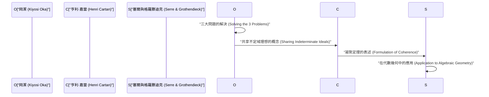
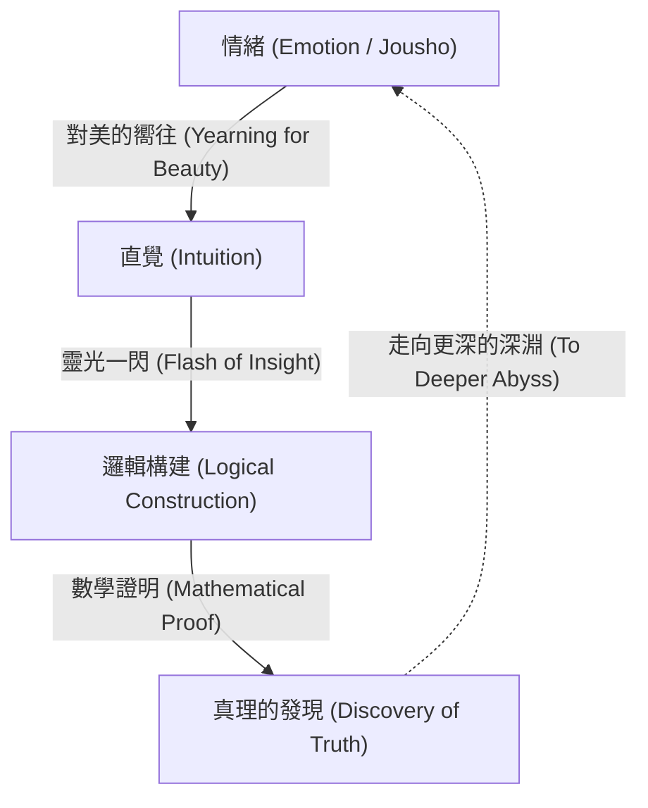

# [岡潔](https://kenji.blog/zh-tw/p/oka-kiyoshi/)：數學與情緒的融合

[岡潔](https://kenji.blog/zh-tw/p/oka-kiyoshi/)（1901–1978）是一位在多變數複分析領域留下世界級成就的日本數學家。以他名字命名的「岡定理（Oka's coherence theorem）」和「岡原理（Oka's principle）」等，已成為現代數學中不可或缺的基礎。在本文中，我們將毫無保留地詳細講述他傳奇的一生、獨特的哲學，以及在多變數解析函數論中深遠的數學成就。

## 1. 成長經歷與早期生涯：走向數學之路

[岡潔](https://kenji.blog/zh-tw/p/oka-kiyoshi/)於1901年4月19日出生於大阪府大阪市，隨後在和歌山縣長大。從小親近自然，在充滿日本情緒的環境中長大的經歷，對他後來的哲學產生了深遠的影響。

進入京都帝國大學理學部數學科後，[岡潔](https://kenji.blog/zh-tw/p/oka-kiyoshi/)在那裡遇到了優秀的導師和同學，被數學的奧秘所深深吸引。大學畢業後，他在京都帝國大學擔任講師，同時探索著自己的研究主題。當時的日本數學界正處於吸收西方數學、努力實現自主發展的過渡期。[岡潔](https://kenji.blog/zh-tw/p/oka-kiyoshi/)也透過挑戰未解的難題，踏上了成為世界級數學家的道路。

## 2. 留學法國與對多變數複分析的覺醒

1929年，[岡潔](https://kenji.blog/zh-tw/p/oka-kiyoshi/)作為文部省的海外研究員前往法國巴黎留學。這三年的巴黎生活，決定了他作為數學家的命運。

在巴黎大學，他與亨利·嘉當（Henri Cartan）、加斯東·朱利亞（Gaston Julia）等引領當時歐洲數學界的眾多天才進行了交流。特別是在出入朱利亞研究室的過程中，[岡潔](https://kenji.blog/zh-tw/p/oka-kiyoshi/)接觸到了當時仍是一片荒蕪的 **多變數複分析** （Several Complex Variables）領域。

雖然單變數複分析在19世紀已經由柯西、黎曼等人優美地完成，但多變數的情況卻面臨著截然不同的困難。其代表性的例子就是「哈托格斯現象（Hartogs' phenomenon）」。

$$
\text{哈托格斯定理: 在 } \mathbb{C}^n \ (n \ge 2) \text{ 中，在某個區域邊界上全純的函數，會自動全純地延拓到區域內部。}
$$

這個定理展示了多變數全純函數所具有的令人驚嘆的剛性（Rigidity）。[岡潔](https://kenji.blog/zh-tw/p/oka-kiyoshi/)下定決心，將畢生致力於解開這個不可思議的多變數世界之謎。

## 3. 數學成就：三大問題的解決

[岡潔](https://kenji.blog/zh-tw/p/oka-kiyoshi/)最大的成就在於他獨自解決了多變數複分析中的「三大問題」。這些問題是當時連數學界最頂尖的頭腦都無法觸及的難題。

### 庫贊問題（Cousin Problems）

庫贊問題是試圖將單變數複分析中的米塔格-萊夫勒定理和魏爾斯特拉斯定理推廣到多變數的情況。

*   **第一庫贊問題（Cousin I problem）:** 能否從給定的極點分佈（局部的亞純函數）中，整體構造出一個全局的亞純函數？
*   **第二庫贊問題（Cousin II problem）:** 能否從給定的零點分佈中，整體構造出一個全局的全純函數？

[岡潔](https://kenji.blog/zh-tw/p/oka-kiyoshi/)證明了在全純區域（Domains of holomorphy）中，第一庫贊問題總是可解的。此外，關於第二庫贊問題，他闡明了需要拓撲條件（上同調群的消失），並引入了被稱為「岡原理」的突破性概念。

### 萊維問題（Levi's Problem）

萊維問題是詢問「擬凸區域（Pseudoconvex domains）是否就是全純區域？」的問題。擬凸性是局部的、幾何的條件，而全純區域是全局的、解析的條件。這兩個條件等價的猜想多年來一直懸而未決。

[岡潔](https://kenji.blog/zh-tw/p/oka-kiyoshi/)從1942年的論文（Oka VI）到1953年的論文（Oka IX），徹底解決了這個問題。特別是他使用已知區域來逼近未知區域的「不定域理想（Ideals of indeterminate domains）」方法，極具獨創性，令當時的數學家們驚嘆不已。

### 岡定理：凝聚層的發現

[岡潔](https://kenji.blog/zh-tw/p/oka-kiyoshi/)最深遠的成就之一，是引入了理想層的概念，並證明了「全純函數層是凝聚的（coherent）」，即著名的 **岡凝聚定理** 。

$$
\mathcal{O}_{\mathbb{C}^n} \text{ 是凝聚層（Coherent Sheaf）。}
$$

這一定理成為了亨利·嘉當「嘉當定理A、B」的基礎，隨後更被讓-皮埃爾·塞爾和[亞歷山大·格羅滕迪克](https://kenji.blog/zh-tw/p/grothendieck/)應用於代數幾何學。現代數學的通用語言「層論（Sheaf Theory）」，正是在[岡潔](https://kenji.blog/zh-tw/p/oka-kiyoshi/)孤獨的奮鬥中誕生的。

## 4. 怪異的舉止與孤高的生活：軼事種種

人們常說天才總是伴隨著怪異的行為，[岡潔](https://kenji.blog/zh-tw/p/oka-kiyoshi/)也不例外。他的行為是他純粹追求真理態度的體現。

*   **晴天也穿雨靴:** [岡潔](https://kenji.blog/zh-tw/p/oka-kiyoshi/)常常在晴天也穿著橡膠雨靴走路。據說這是因為他吝惜繫鞋帶的時間，或是想不用顧忌腳下而專心思考。
*   **不打領帶:** 他討厭束縛，不打領帶出現在學術會議上也是司空見慣的事。
*   **與自然對話:** 人們經常目擊他一邊走路一邊和路邊的花草樹木說話。他是在與潛藏在自然中的「美」進行對話。

在第二次世界大戰期間及其後的戰後時期，他在極度貧困中堅持研究。他甚至有一段時間暫時離開數學，在北海道和和歌山從事農業。然而，即使在耕種土地時，他的大腦仍在多變數複分析的深淵中徘徊。在連寫論文的紙張都不充足的情況下，他接連寫出了歷史性的傑作。

## 5. 「情緒」的哲學：數學創造的本質

談論[岡潔](https://kenji.blog/zh-tw/p/oka-kiyoshi/)，絕對不能不提他獨特的「情緒（Jousho）」哲學。在他的著作《春宵十話》中，他斷言：「數學的中心是情緒。」

在[岡潔](https://kenji.blog/zh-tw/p/oka-kiyoshi/)看來，僅憑邏輯是絕對無法產生新數學的。邏輯只不過是事後構建的骨架，其源泉在於對「美的嚮往」和「感受自然和諧的心」。

他深愛松尾芭蕉的俳句和道元的禪宗思想，並教導說，根植於日本文化的「無私之心」對於真正的創造力是必不可少的。他相信，無論電腦和人工智慧多麼發達，這種伴隨著「情緒」的靈感才是人類的特權，也是最高尚的精神活動。

## 6. 附錄：[岡潔](https://kenji.blog/zh-tw/p/oka-kiyoshi/)主要論文（Oka I - Oka IX）的軌跡

在討論[岡潔](https://kenji.blog/zh-tw/p/oka-kiyoshi/)的成就時，1936年至1953年間發表的9篇論文，即所謂的「Oka I」到「Oka IX」，是繞不開的。

1.  **Oka I (1936):** 關於有理凸區域的研究。這裡首次深化了多變數中凸性的概念。
2.  **Oka II (1937):** 在全純區域中解決第一庫贊問題。
3.  **Oka III (1939):** 解決第二庫贊問題的突破性方法。
4.  **Oka IV (1941):** 逼近擬凸區域與全純區域關係的研究。
5.  **Oka V (1942):** 嘉當定理的推廣。
6.  **Oka VI (1942):** 證明擬凸區域是全純區域，解決萊維問題（在雙變數情況下）。
7.  **Oka VII (1950):** 擬凸區域中的向上解析延拓原理。
8.  **Oka VIII (1951):** 不定域理想的基礎理論。在這裡可以看到凝聚層的萌芽。
9.  **Oka IX (1953):** 徹底解決無分支內區域的萊維問題。

## 7. 對後世的影響與遺產

1960年，[岡潔](https://kenji.blog/zh-tw/p/oka-kiyoshi/)因其無與倫比的功績被授予日本文化勳章。此後，他繼續在奈良女子大學等機構任教，培養了許多後學。晚年，他還致力於關於數學教育和日本文化的寫作與演講活動，深深打動了許多普通讀者。

直到1978年以76歲高齡辭世，他始終在不斷追問「什麼是真理」。他開闢的多變數複分析理論，如今已廣泛應用於微分幾何、代數幾何甚至理論物理學等領域。[岡潔](https://kenji.blog/zh-tw/p/oka-kiyoshi/)的一生，不僅僅是一個數學家成功的故事。它是一個人類靈魂的記錄，在孤獨中傾聽內心的聲音，試圖觸及絕對的真理。他留下的「情緒」這個關鍵詞，在往往優先考慮效率和邏輯的現代社會中，正靜靜地向我們發問：「什麼是真正的豐盈？」在廣袤的數學世界中綻放的一株孤高之櫻——這就是名叫[岡潔](https://kenji.blog/zh-tw/p/oka-kiyoshi/)的人。

## 8. 詳細解說：什麼是不定域理想

讓我們稍微詳細地解說一下被認為是[岡潔](https://kenji.blog/zh-tw/p/oka-kiyoshi/)最大發現之一的「不定域理想（Ideals of indeterminate domains）」。

在多變數複分析中，整體構造函數時的關鍵在於如何將局部資料拼接起來。在單變數的情況下，由於奇異點的結構相對簡單，利用解析延拓來擴展函數是容易的。然而，在多變數的情況下，正如哈托格斯現象所見，奇異點不是孤立的，而是形成複雜的超曲面。

為了克服這個困難，[岡潔](https://kenji.blog/zh-tw/p/oka-kiyoshi/)想出了一個極其新穎的想法：與其固定一個區域來考慮函數，不如在變動區域本身的同時捕捉函數的行為。這就是「不定域理想」的核心。

具體來說，考慮在某點 $p$ 的鄰域內定義的全純函數芽（germs of holomorphic functions）所構成的環 $\mathcal{O}_p$ ，並處理其中的理想（ideal）。[岡潔](https://kenji.blog/zh-tw/p/oka-kiyoshi/)構造了定義在整個區域上的理想層（sheaf of ideals），並證明了它是局部有限生成的。這就是後來被嘉當和塞爾公式化為「凝聚層（coherent sheaf）」這一概念的原型。

這種方法從根本上顛覆了當時數學界的常識。透過將依賴於區域形狀的解析問題轉化為函數代數結構（理想）的問題，他開闢了應用拓撲學和代數幾何強大方法的道路。

## 9. [岡潔](https://kenji.blog/zh-tw/p/oka-kiyoshi/)的話語：名言集

[岡潔](https://kenji.blog/zh-tw/p/oka-kiyoshi/)在其一生中留下了許多意味深長的話語。在這裡，我們介紹幾句能恰當表達他哲學的名言。

*   **「數學的目標是探求真理。而真理是美的。」**
    （強調數學真理與美不可分割的名言。）
*   **「計算並不是數學。那是機器也能做的事。數學是透過直覺發現未知的和諧。」**
    （教導在邏輯推導之前，直覺的重要性的名言。）
*   **「就像開在春野裡的紫羅蘭一樣，只是無心尋求真理的心。那才是創造的源動力。」**
    （表達了捨棄自我、與對象融為一體的東方無私精神的名言。）

從這些話語中也可以看出，對於[岡潔](https://kenji.blog/zh-tw/p/oka-kiyoshi/)來說，數學不僅僅是一門學問的分支，更可以說是一條引導人類精神走向更高境界的「道（Tao）」。

## 10. 總結與展望

[岡潔](https://kenji.blog/zh-tw/p/oka-kiyoshi/)留給我們的遺產不僅僅是數學定理。他透過自己的人生軌跡，向我們展示了人類智慧所能達到的最高境界。

現代數學變得越來越細分和高度專業化。此外，隨著人工智慧（AI）的飛速發展，甚至數學定理的證明也將由機器自動完成的時代正在到來。然而，無論技術進步到何種程度，只要[岡潔](https://kenji.blog/zh-tw/p/oka-kiyoshi/)所說的「情緒」——對未知世界的好奇心、被美麗事物感動的內心、以及探求真理的無私之心——沒有喪失，數學就將繼續成為人類最迷人且最有價值的智力活動。

[岡潔](https://kenji.blog/zh-tw/p/oka-kiyoshi/)的精神，必將在這即將到來的時代裡，在我們每個人的心中靜靜地、卻又強而有力地繼續存在下去。

## 附加資料：[岡潔](https://kenji.blog/zh-tw/p/oka-kiyoshi/)的思想對現代的啟示

[岡潔](https://kenji.blog/zh-tw/p/oka-kiyoshi/)所追求的「情緒」概念，即使在今天也沒有褪色；相反，正是在現代社會中，它的真正價值才得以展現。在物質財富和邏輯理性被追求到極限的同時，人們的精神富足和與自然的和諧正在喪失。在這樣的現代社會中，他的思想成了一座指路明燈。

一位站在最嚴密、最講邏輯的學問頂端的人物，最終卻回歸到「情緒」和「無私」這些看似不合邏輯的人類元素，這一事實雖然非常矛盾，卻蘊含著深刻的真理。這表明，人類的創造力絕不是機械計算或單純資訊處理的延伸，而是源於更根本的生命活動和與自然的共鳴。[岡潔](https://kenji.blog/zh-tw/p/oka-kiyoshi/)的數學與哲學，將永遠照亮我們的前路。

此外，回顧他的一生，人們會驚訝於他堅韌的精神——即使在極度貧困和周圍人的不解等困難處境中，也從未放棄對真理的追求。在為了謀生而從事農業的同時，他的腦海中始終在與多變數複分析的難題搏鬥。正是這種在極端環境下的精神集中，成為了催生「不定域理想」這一顛覆當時數學常識的突破性概念的原動力。

我們不僅可以從[岡潔](https://kenji.blog/zh-tw/p/oka-kiyoshi/)留下的數學成就中學習，更可以從他的生活方式本身學到很多。什麼是真正的創造力？作為一個人豐富地生活意味著什麼？可以說，[岡潔](https://kenji.blog/zh-tw/p/oka-kiyoshi/)的一生對這些根本問題給出了一個強而有力的回答。他留下的足跡，不僅繼續激勵著日本數學界，也激勵著全世界的人們。
