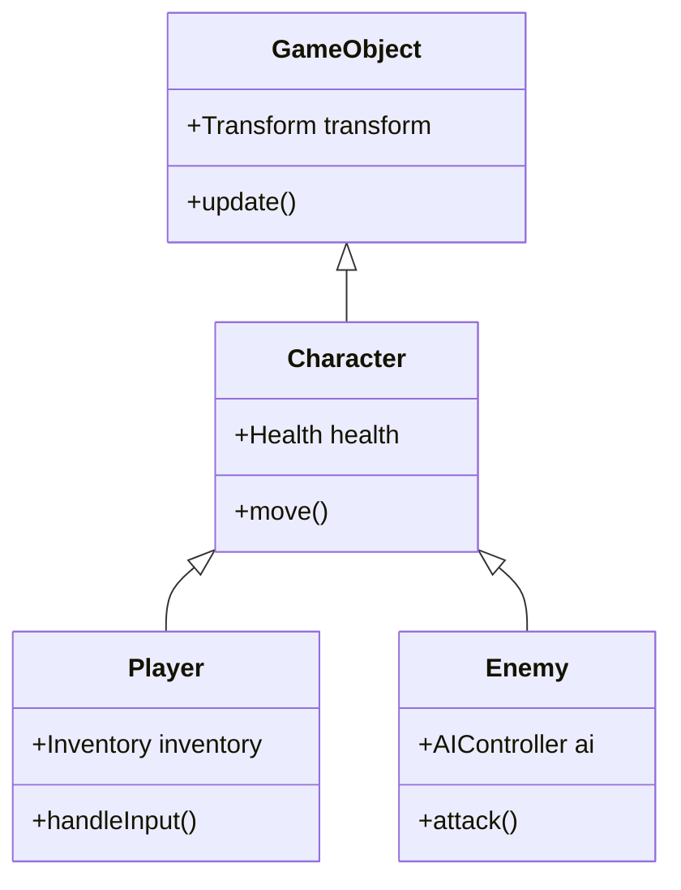
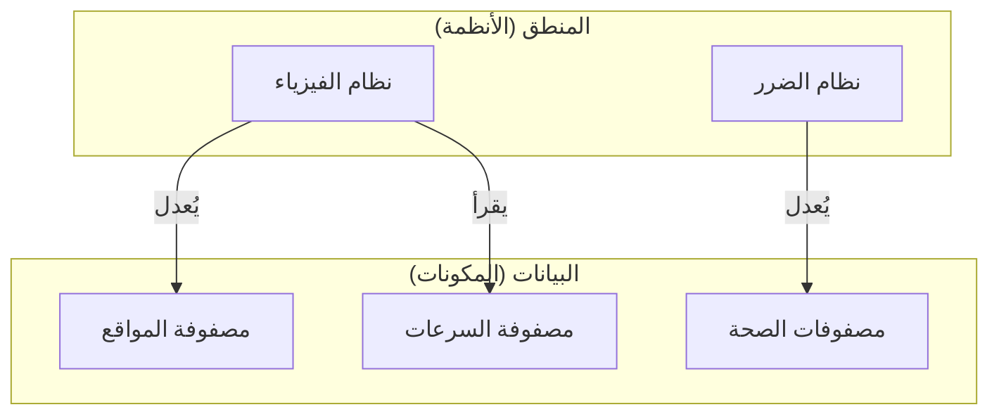

تاريخ تطور لغات البرمجة هو أيضًا تاريخ الصراع ضد التعقيد. مع ازدياد حجم البرامج، واجه المطورون عقبات في إدارة الحالة، والأداء، وقابلية الصيانة، وللتغلب على هذه العقبات تم اقتراح **نماذج برمجة** (Programming Paradigms) مختلفة.

في هذا المقال، سنتعمق في الأفكار، ونقاط القوة، و **القيود** لكل من **البرمجة كائنية التوجه** ([OOP](https://kenji.blog/ar/p/object-oriented-programming-oop-solid-principles/)) التي تهيمن على تطوير البرمجيات الحديثة، و **البرمجة الوظيفية** (FP) التي تتميز بالمتانة الرياضية، و **البرمجة الموجهة للبيانات** (DOP / DOD) التي تركز على الأداء وفصل البيانات. علاوة على ذلك، سنشرح كيف تقوم اللغات الحديثة القوية (مثل [Rust](https://kenji.blog/ar/p/webassembly-wasm-current-future/) و TypeScript) بـ **دمج** هذه النماذج.

---

## 1. صعود وسقوط البرمجة كائنية التوجه ([OOP](https://kenji.blog/ar/p/object-oriented-programming-oop-solid-principles/))

تربعت **البرمجة كائنية التوجه** ([Object-Oriented](https://kenji.blog/ar/p/object-oriented-programming-oop-solid-principles/) Programming) كملك مطلق على عرش تطوير البرمجيات من التسعينيات حتى عقد 2010. قادت لغات مثل [Java](https://kenji.blog/ar/p/programming-languages-history-paradigm-evolution/) و C++ و C# هذا النموذج، وتم قبول نهجها البديهي في نمذجة العالم الحقيقي.

### 1.1 المفاهيم الأساسية لـ OOP

الهدف من OOP هو تغليف "البيانات" و"السلوكيات" التي تعالج تلك البيانات داخل **كائن** (Object) واحد.

- **التغليف (Encapsulation)** : إخفاء الحالة الداخلية، والسماح بالتعامل معها من الخارج فقط من خلال الطرق (methods) المكشوفة.
- **الوراثة (Inheritance)** : توسيع الفئات (classes) الموجودة لزيادة قابلية إعادة استخدام الكود.
- **تعددية الأشكال (Polymorphism)** : تبديل التطبيقات المختلفة باستخدام واجهة موحدة.

```typescript
// مثال نموذجي لـ OOP باستخدام TypeScript
abstract class Animal {
    protected name: string;
    
    constructor(name: string) {
        this.name = name;
    }
    
    abstract speak(): void;
}

class Dog extends Animal {
    speak(): void {
        console.log(`${this.name} says Woof!`);
    }
}

class Cat extends Animal {
    speak(): void {
        console.log(`${this.name} says Meow!`);
    }
}

const animals: Animal[] = [new Dog("Buddy"), new Cat("Kitty")];
animals.forEach(a => a.speak());
```

### 1.2 قيود [OOP](https://kenji.blog/ar/p/object-oriented-programming-oop-solid-principles/) و "مشكلة الغوريلا والموزة"

قد تبدو OOP للوهلة الأولى كمنهجية نمذجة مثالية، ولكن مع ازدياد حجم النظام، تسببت في مشاكل قاتلة تتمثل في **الإفراط في استخدام الوراثة** و **إدارة الحالة الضمنية**.

من الأقوال الشهيرة في هذا الصدد تصريح Joe Armstrong (مبتكر لغة Erlang):

> "المشكلة في اللغات كائنية التوجه هي أنها تحمل معها كل البيئة الضمنية. أردت موزة، لكنك حصلت على غوريلا تحمل الموزة والغابة بأكملها معها."



شجرة الوراثة العميقة تجعل تبعيات الكود معقدة، وتجعل من الصعب جدًا عزل ميزات معينة لإعادة استخدامها. بالإضافة إلى ذلك، عندما تشير الكائنات المتعددة لبعضها البعض وتغير حالة بعضها البعض، تنخفض قابلية التنبؤ بالنظام بأكمله بشكل كبير.

---

## 2. النهج الرياضي للبرمجة الوظيفية (FP)

ظهرت **البرمجة الوظيفية** ([Functional Programming](https://kenji.blog/ar/p/functional-programming-concepts-pure-functions-monads/)) كرد فعل ضد التعقيد الناتج عن "تغير الحالة" في [OOP](https://kenji.blog/ar/p/object-oriented-programming-oop-solid-principles/). لم يقتصر تأثيرها على لغات مثل Haskell و Scala و Clojure، بل أثرت بشكل عميق على لغات حديثة مثل JavaScript و TypeScript.

### 2.1 المفاهيم الأساسية لـ FP

تبني FP البرامج كمجموعة من **الدوال النقية** (Pure Functions).

- **الدوال النقية (Pure Functions)** : تُرجع دائمًا نفس المخرجات لنفس المدخلات، ولا تغير الحالة الخارجية (ليس لها آثار جانبية).
- **الثبات (Immutability)** : بمجرد إنشاء البيانات، لا يمكن تغييرها. إذا لزم التغيير، يتم إنشاء بنية بيانات جديدة.
- **الدوال ذات الترتيب الأعلى وتركيب الدوال** : التعامل مع الدوال كبيانات، ودمجها لبناء عمليات معقدة.

```typescript
// نهج FP باستخدام TypeScript (الثبات والدوال ذات الترتيب الأعلى)
type User = { readonly id: number; readonly name: string; readonly isActive: boolean };

const users: readonly User[] = [
    { id: 1, name: "Alice", isActive: true },
    { id: 2, name: "Bob", isActive: false },
    { id: 3, name: "Charlie", isActive: true }
];

// دالة نقية بدون آثار جانبية
const getActiveUserNames = (users: readonly User[]): string[] => 
    users
        .filter(u => u.isActive)
        .map(u => u.name);

console.log(getActiveUserNames(users)); // ["Alice", "Charlie"]
```

يتم التعبير عن انتقال الحالة في FP بنفس الطريقة التي تُعبر بها الدوال الرياضية $f(x) = y$. عندما تكون لدينا حالة النظام $S$ وإجراء $A$، يمكن التعبير عن الحالة الجديدة $S'$ على النحو التالي:

$ S' = f(S, A) $

تتيح هذه الطريقة في الكتابة اختبار الكود بسهولة بالغة، وتقضي تمامًا على ظروف السباق (Data Races) في المعالجة المتزامنة (تعدد المسارات).

### 2.2 قيود FP: الخلاف مع "العالم الحقيقي"

النموذج الوظيفي له حدوده أيضًا. بطبيعتها، الحواسيب هي آلات تحتفظ بالحالة (بنية فون نيومان)، و FP النقية تبتعد عن مبادئ عمل وحدة المعالجة المركزية.

إن تخصيص الذاكرة للحفاظ على الثبات (والذي يمثل عبئًا على جامع القمامة)، والحاجة للتعامل مع "الآثار الجانبية التي لا مفر منها" مثل الإدخال والإخراج (الطباعة على الشاشة، الكتابة في قاعدة البيانات) باستخدام الموناد (Monads)، يؤدي إلى تكلفة تعلم عالية للمفاهيم، وأحيانًا يصبح عنق زجاجة في الأداء.

---

## 3. العودة إلى البرمجة الموجهة للبيانات (DOP/DOD)

**التصميم الموجه للبيانات** (Data-Oriented Design) أو **البرمجة الموجهة للبيانات**، هو نموذج نشأ في مجال تطوير الألعاب (خاصة C++ و [Rust](https://kenji.blog/ar/p/webassembly-wasm-current-future/))، وامتد لاحقًا إلى تطبيقات المؤسسات (مثل فلسفة لغة Clojure).

### 3.1 المفاهيم الأساسية لـ DOP

يضع DOP "فصل البيانات عن المنطق" كهدف أسمى. بينما تقوم [OOP](https://kenji.blog/ar/p/object-oriented-programming-oop-solid-principles/) بجمع البيانات والمنطق في فئات، يقوم DOP بفصلهما عن بعض.

- **فصل البيانات** : يتم تعريف البيانات ببساطة كبنية بيانات (سجلات، هياكل) ولا تمتلك أي سلوك.
- **نظام مكونات الكيان (ECS)** : بدلاً من الوراثة، يتم تقسيم البيانات إلى مكونات، وتقوم الأنظمة (الدوال) بمعالجتها دفعة واحدة.
- **كفاءة التخزين المؤقت (تخطيط الذاكرة)** : ترتيب البيانات في ذاكرة متتالية (SoA: Structure of Arrays) بحيث تتناسب مع خطوط التخزين المؤقت لوحدة المعالجة المركزية.

```rust
// نهج موجه للبيانات (يشبه ECS) باستخدام Rust
// بيانات نقية بدون سلوكيات (مكونات)
struct Position { x: f32, y: f32 }
struct Velocity { dx: f32, dy: f32 }

// الأنظمة (المنطق) تعالج مجموعات البيانات بشكل متتابع
fn update_positions(positions: &mut [Position], velocities: &[Velocity], dt: f32) {
    // الوصول المستمر في الذاكرة يحقق معدل إصابة تخزين مؤقت مرتفع جدًا لوحدة المعالجة المركزية
    for (pos, vel) in positions.iter_mut().zip(velocities.iter()) {
        pos.x += vel.dx * dt;
        pos.y += vel.dy * dt;
    }
}
```



### 3.2 قيود DOP: صعوبة التطبيق على منطق الأعمال

يعتبر DOP (وخصوصًا ECS) لا يُقهر في المجالات التي يكون فيها الأداء أمرًا حتميًا مثل محركات الألعاب. لكن عند بناء تطبيقات الويب العامة أو منطق الأعمال، يصبح الكود إجرائيًا بشكل مفرط، وتتشتت العلاقات بين البيانات (مما يقلل من التماسك).

---

## 4. مقارنة النماذج والمفاضلات

لكل نموذج مجالات يتفوق فيها ومجالات يضعف فيها بوضوح.

| النموذج | نقاط القوة | نقاط الضعف | أفضل حالات الاستخدام |
| :--- | :--- | :--- | :--- |
| **[OOP](https://kenji.blog/ar/p/object-oriented-programming-oop-solid-principles/)** | نمذجة بديهية، إخفاء البيانات عن طريق التغليف | تعقيد الوراثة، أخطاء بسبب التغيرات الضمنية للحالة | أطر عمل واجهة المستخدم (GUI)، نمذجة مجالات الأعمال |
| **FP** | مقاومة المعالجة المتزامنة، سهولة الاختبار، قابلية التنبؤ | منحنى تعلم حاد، الأداء (عبء GC) | خطوط تحويل البيانات، أنظمة المعالجة المتزامنة |
| **DOP** | أداء استثنائي، شفافية الحالة | انخفاض تماسك البيانات، الميل للنهج الإجرائي | تطوير الألعاب، المعالجة الحسابية العالية، الأنظمة المدمجة |

---

## 5. الحل الأمثل في العصر الحديث: "اندماج" النماذج

اليوم، يُعتبر اختيار "إجابة واحدة صحيحة" من بين هذه النماذج أمرًا غير منطقي. تقوم لغات البرمجة الحديثة (مثل [Rust](https://kenji.blog/ar/p/webassembly-wasm-current-future/)، TypeScript، Scala، [Go](https://kenji.blog/ar/p/programming-languages-history-paradigm-evolution/)، إلخ) بـ **أخذ أفضل ما في** هذه النماذج.

### 5.1 الاندماج المطلق كما توضحه [Rust](https://kenji.blog/ar/p/programming-languages-history-paradigm-evolution/)

تقوم لغة Rust بدمج هذه النماذج الثلاثة بمستوى مذهل.

1. **موجهة للبيانات** : تمثيل فعال للذاكرة للبيانات باستخدام `struct` و `enum`.
2. **وظيفية** : واجهة برمجة تطبيقات (API) غنية للمكررات (Iterators)، مطابقة الأنماط (Pattern Matching)، وثبات البيانات بشكل افتراضي.
3. **كائنية التوجه** : تعددية الأشكال من خلال `trait` وتغليف البيانات.

```rust
// فصل الحالة (البيانات) والسلوك، بالإضافة إلى مطابقة الأنماط
enum Event {
    Click(i32, i32),
    KeyPress(char),
}

struct AppState {
    click_count: u32,
    last_key: Option<char>,
}

// منطق تحديث الحالة مقتبس من النهج الوظيفي
fn process_event(state: &mut AppState, event: Event) {
    match event {
        Event::Click(_x, _y) => {
            state.click_count += 1;
        },
        Event::KeyPress(c) => {
            state.last_key = Some(c);
        }
    }
}
```

في هذا الكود، يتم إدارة الحالة بشكل مركزي على طريقة التوجيه للبيانات، بينما نستخدم أنواع البيانات المجمعة (سمة من سمات البرمجة الوظيفية) من خلال `enum`.

### 5.2 البنية العملية في TypeScript

حتى في تطوير الواجهات الأمامية باستخدام TypeScript (مثل React)، أصبح اندماج النماذج هو المعيار.

- تصيير واجهة المستخدم (UI Rendering) للمكونات يتم بشكل **وظيفي** (إرجاع واجهة المستخدم كدوال نقية).
- جلب البيانات وإدارة التخزين المؤقت يتم بطريقة **موجهة للبيانات** (شجرة حالة مسطحة باستخدام [Redux](https://kenji.blog/ar/p/state-management-history-future/) أو [Zustand](https://kenji.blog/ar/p/state-management-history-redux-context-recoil-zustand/)).
- يتم تطبيق **البرمجة كائنية التوجه** في بعض الأجزاء المعقدة من منطق النطاق (طبقة خدمات تعتمد على الفئات).

---

## 6. الخلاصة

**البرمجة كائنية التوجه**، و **البرمجة الوظيفية**، و **البرمجة الموجهة للبيانات**؛ هذه ليست أديانًا حصرية لبعضها البعض.

الشيء المهم هو تقييم طبيعة المجال الذي نحاول حله. إذا كان الأداء هو الأولوية القصوى، فإننا نعزز عناصر **DOP**. وإذا كان التركيز على المعالجة المتزامنة وتدفقات تحويل البيانات، فإننا نتبنى النهج **الوظيفي**. وبالنسبة لمجالات معينة تتطلب قواعد أعمال معقدة وتغليفًا، نستخدم تقنيات **[OOP](https://kenji.blog/ar/p/object-oriented-programming-oop-solid-principles/)**.

> "نماذج البرمجة لا تخبرنا بما يجب أن نفعله، بل هي قيود تخبرنا بـ **ما يجب ألا نفعله**." — Robert C. Martin

إن تجاوز حواجز النماذج واستخدام أسلحة متعددة بمرونة بناءً على السياق قد يكون هو المهارة الأهم والأكثر طلبًا من مهندسي البرمجيات في الجيل القادم.
