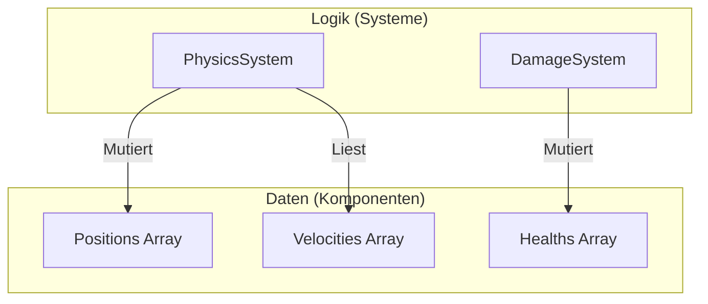

Die Geschichte der Entwicklung von Programmiersprachen ist auch eine Geschichte des Kampfes gegen die Komplexität. Mit dem zunehmenden Maßstab von Software stieß man auf Barrieren bei der Zustandsverwaltung, Leistung und Wartbarkeit, und um diese zu überwinden, wurden verschiedene **Programmierparadigmen** vorgeschlagen.

In diesem Artikel werden wir die in der modernen Softwareentwicklung vorherrschende **objektorientierte Programmierung** (OOP), die **funktionale Programmierung** (FP) mit ihrer mathematischen Robustheit und die **datenorientierte Programmierung** (DOP / DOD), die sich auf Leistung und die Trennung von Daten konzentriert, hinsichtlich ihrer jeweiligen Philosophien, Stärken und **Grenzen** genauer untersuchen. Darüber hinaus werden wir erklären, wie moderne leistungsstarke Sprachen (wie [Rust](https://kenji.blog/de/p/webassembly-wasm-current-future/) und TypeScript) diese **verschmelzen**.

---

## 1. Aufstieg und Fall der objektorientierten Programmierung (OOP)

Die **Objektorientierung** (Object-Oriented Programming) herrschte von den 1990er bis zu den 2010er Jahren als absoluter König der Softwareentwicklung. Sprachen wie Java, C++ und C# trieben dieses Paradigma voran, und der intuitive Ansatz, die reale Welt zu modellieren, fand große Akzeptanz.

### 1.1 Kernkonzepte der OOP

Das Ziel der OOP ist es, "Daten" und das "Verhalten", das diese Daten manipuliert, in einem einzigen **Objekt** zu kapseln.

- **Kapselung**: Verbirgt den internen Zustand und erlaubt die Manipulation von außen nur über veröffentlichte Methoden.
- **Vererbung**: Erweitert bestehende Klassen und erhöht die Wiederverwendbarkeit von Code.
- **Polymorphismus**: Ermöglicht das Umschalten zwischen verschiedenen Implementierungen über dieselbe Schnittstelle.

```typescript
// Ein typisches OOP-Beispiel mit TypeScript
abstract class Animal {
    protected name: string;
    
    constructor(name: string) {
        this.name = name;
    }
    
    abstract speak(): void;
}

class Dog extends Animal {
    speak(): void {
        console.log(`${this.name} says Woof!`);
    }
}

class Cat extends Animal {
    speak(): void {
        console.log(`${this.name} says Meow!`);
    }
}

const animals: Animal[] = [new Dog("Buddy"), new Cat("Kitty")];
animals.forEach(a => a.speak());
```

### 1.2 Die Grenzen der OOP und das "Gorilla und Banane-Problem"

Auf den ersten Blick scheint OOP eine perfekte Modellierungsmethode zu sein, aber mit zunehmender Systemgröße verursachte sie fatale Probleme durch **übermäßigen Gebrauch von Vererbung** und **implizite Zustandsverwaltung**.

Ein berühmtes Zitat von Joe Armstrong (dem Erfinder von Erlang) lautet:

> "Das Problem mit objektorientierten Sprachen ist, dass sie all diese implizite Umgebung mit sich herumtragen. Du wolltest eine Banane, aber was du bekommst, ist ein Gorilla, der die Banane hält, und der gesamte Dschungel."

```mermaid
classDiagram
    class "Spielobjekt" {
        +Transformation transformation
        +aktualisieren()
    }
    class "Charakter" {
        +Gesundheit gesundheit
        +bewegen()
    }
    class "Spieler" {
        +Inventar inventar
        +eingabeVerarbeiten()
    }
    class "Feind" {
        +KIController ki
        +angreifen()
    }
    "Spielobjekt" <|-- "Charakter"
    "Charakter" <|-- "Spieler"
    "Charakter" <|-- "Feind"
```

Ein tiefer Vererbungsbaum verkompliziert die Code-Abhängigkeiten und macht es extrem schwierig, nur bestimmte Funktionen zu isolieren und wiederzuverwenden. Da zudem mehrere Objekte gegenseitig aufeinander verweisen und gegenseitig Zustände ändern, nimmt die Vorhersagbarkeit des gesamten Systems drastisch ab.

---

## 2. Der mathematische Ansatz der funktionalen Programmierung (FP)

Als Antithese zu der durch die "Zustandsmutation" der OOP verursachten Komplexität rückte die **funktionale Programmierung** (Functional Programming) ins Rampenlicht. Sie hat nicht nur Sprachen wie Haskell, Scala und Clojure tiefgreifend beeinflusst, sondern heutzutage auch JavaScript und TypeScript stark geprägt.

### 2.1 Kernkonzepte der FP

FP konstruiert Programme als eine Kombination von **reinen Funktionen**.

- **Reine Funktionen**: Liefern für dieselbe Eingabe immer dieselbe Ausgabe und ändern keinen externen Zustand (keine Nebeneffekte).
- **Unveränderlichkeit (Immutability)**: Daten werden nach ihrer Erstellung nicht mehr geändert. Wenn Änderungen erforderlich sind, wird eine neue Datenstruktur generiert.
- **Funktionen höherer Ordnung und Funktionskomposition**: Behandeln Funktionen als Daten und kombinieren sie, um komplexe Verarbeitungen zu konstruieren.

```typescript
// Ein FP-Ansatz (Unveränderlichkeit und Funktionen höherer Ordnung) in TypeScript
type User = { readonly id: number; readonly name: string; readonly isActive: boolean };

const users: readonly User[] = [
    { id: 1, name: "Alice", isActive: true },
    { id: 2, name: "Bob", isActive: false },
    { id: 3, name: "Charlie", isActive: true }
];

// Eine reine Funktion ohne Nebeneffekte
const getActiveUserNames = (users: readonly User[]): string[] => 
    users
        .filter(u => u.isActive)
        .map(u => u.name);

console.log(getActiveUserNames(users)); // ["Alice", "Charlie"]
```

In der FP werden Zustandsübergänge ähnlich wie bei der mathematischen Funktion $f(x) = y$ dargestellt. Wenn es einen Systemzustand $S$ und eine Aktion $A$ gibt, kann der neue Zustand $S'$ wie folgt ausgedrückt werden:

$ S' = f(S, A) $

Durch diese Art der Beschreibung wird das Testen von Code extrem einfach, und Race Conditions (Datenrennen) bei der Nebenläufigkeit (Multithreading) können von Grund auf eliminiert werden.

### 2.2 Grenzen der FP: Disharmonie mit der "realen Welt"

Auch das funktionale Paradigma hat seine Grenzen. Ein Computer ist im Grunde eine Maschine mit Zustand (Von-Neumann-Architektur), und reine FP weicht vom Funktionsprinzip der CPU ab.

Die Speicherzuweisung (Belastung der [Garbage Collection](https://kenji.blog/de/p/memory-management-garbage-collection/)) zur Aufrechterhaltung der Unveränderlichkeit und Monaden zur Behandlung "unvermeidbarer Nebeneffekte" wie I/O (Bildschirmausgabe, Datenbankschreiben) sind mit hohen konzeptionellen Lernkosten verbunden und stellen manchmal einen Leistungsengpass dar.

---

## 3. Rückkehr zur datenorientierten Programmierung (DOP/DOD)

**Datenorientiertes Design** (Data-Oriented Design) oder **datenorientierte Programmierung** ist ein Paradigma, das aus der Spieleentwicklung (insbesondere C++ und [Rust](https://kenji.blog/de/p/webassembly-wasm-current-future/)) stammt und sich später auch auf Unternehmensbereiche (z. B. Clojures Philosophie) ausgebreitet hat.

### 3.1 Kernkonzepte der DOP

Die oberste Prämisse der DOP ist es, "Daten und Logik zu trennen". Während OOP Daten und Logik in Klassen zusammenfasst, trennt DOP sie.

- **Trennung von Daten**: Daten werden lediglich als Datenstrukturen (Records, Structs) definiert und besitzen kein Verhalten.
- **ECS (Entity Component System)**: Anstelle von Vererbung werden Daten in Komponenten unterteilt, und Systeme (Funktionen) verarbeiten sie in großen Mengen.
- **Cache-Effizienz (Speicherlayout)**: Daten werden in zusammenhängendem Speicher (SoA: Structure of Arrays) platziert, damit sie in die Cache-Lines der CPU passen.

```rust
// Datenorientierter (ECS-ähnlicher) Ansatz mit Rust
// Reine Daten (Komponenten) ohne Verhalten
struct Position { x: f32, y: f32 }
struct Velocity { dx: f32, dy: f32 }

// Das System (die Logik) verarbeitet Gruppen von Daten kontinuierlich
fn update_positions(positions: &mut [Position], velocities: &[Velocity], dt: f32) {
    // Da auf den Speicher fortlaufend zugegriffen wird, ist die CPU-Cache-Trefferquote extrem hoch
    for (pos, vel) in positions.iter_mut().zip(velocities.iter()) {
        pos.x += vel.dx * dt;
        pos.y += vel.dy * dt;
    }
}
```



### 3.2 Grenzen der DOP: Schwierigkeiten bei der Anwendung auf Geschäftslogik

In Bereichen wie Game-Engines, wo Leistung absolut entscheidend ist, ist DOP (ECS) unschlagbar, aber beim Aufbau allgemeiner Webanwendungen und Geschäftslogik hat es den Nachteil, dass der Code zu prozedural wird und die Beziehungen zwischen den Daten verstreut werden (die Kohäsion nimmt ab).

---

## 4. Vergleichende Überprüfung der Paradigmen und Kompromisse

Jedes Paradigma hat seine klaren Stärken und Schwächen.

| Paradigma | Vorteile | Nachteile | Optimale Anwendungsfälle |
| :--- | :--- | :--- | :--- |
| **OOP** | Intuitive Modellierung, Verbergen durch Kapselung | Verkomplizierung der Vererbung, Fehler durch implizite Zustandsmutation | GUI-Frameworks, Modellierung von Geschäftsdomänen |
| **FP** | Toleranz gegenüber Nebenläufigkeit, einfache Testbarkeit, Vorhersagbarkeit | Steile Lernkurve, Leistung (GC-Overhead) | Datenkonvertierungspipelines, nebenläufige Systeme |
| **DOP** | Überwältigende Leistung, Transparenz des Zustands | Geringere Datenkohäsion, tendiert dazu prozedural zu sein | Spieleentwicklung, rechenintensive Verarbeitung, eingebettete Systeme |

---

## 5. Die optimale Lösung in der heutigen Zeit: "Verschmelzung" der Paradigmen

Heute gilt es als Unsinn, die "einzige richtige Antwort" unter diesen zu wählen. Moderne Programmiersprachen ([Rust](https://kenji.blog/de/p/webassembly-wasm-current-future/), TypeScript, Scala, Go usw.) nehmen sich das **Beste** aus diesen Paradigmen.

### 5.1 Die ultimative Verschmelzung, die Rust zeigt

Rust verschmilzt diese drei Paradigmen auf einem erstaunlichen Niveau.

1. **Datenorientiert**: Speichereffiziente Datendarstellung mittels `struct` und `enum`.
2. **Funktional**: Reichhaltige Iterator-API, Pattern Matching, standardmäßige Unveränderlichkeit.
3. **Objektorientiert**: Polymorphismus durch `trait` und Datenkapselung.

```rust
// Trennung von Zustand (Daten) und Verhalten, und Pattern Matching
enum Event {
    Click(i32, i32),
    KeyPress(char),
}

struct AppState {
    click_count: u32,
    last_key: Option<char>,
}

// Logik zur Zustandsaktualisierung, die einen funktionalen Ansatz beinhaltet
fn process_event(state: &mut AppState, event: Event) {
    match event {
        Event::Click(_x, _y) => {
            state.click_count += 1;
        },
        Event::KeyPress(c) => {
            state.last_key = Some(c);
        }
    }
}
```

In diesem Code wird der Zustand datenorientiert zentral verwaltet, während gleichzeitig Summentypen (ein Merkmal der funktionalen Programmierung) mittels `enum` verwendet werden.

### 5.2 Praktische Architektur in TypeScript

Auch in der Frontend-Entwicklung (wie React) mit TypeScript ist die Verschmelzung der Paradigmen zum Standard geworden.

- Das UI-Rendering von Komponenten ist **funktional** (gibt die UI als reine Funktion zurück).
- Datenabruf und Cache-Verwaltung sind **datenorientiert** (normalisierter Zustandsbaum mit [Redux](https://kenji.blog/de/p/state-management-history-future/) oder Zustand).
- Ein Teil der komplexen Domänenlogik ist **objektorientiert** (klassenbasierte [Service](https://kenji.blog/de/p/kubernetes-k8s-architecture-pod-service-ingress/)schicht).

---

## 6. Fazit

**Objektorientierung**, **funktional** und **datenorientiert**. Dies sind keine sich gegenseitig ausschließenden Religionen.

Das Wichtigste ist, die Natur der Domäne, die wir lösen wollen, genau zu beurteilen. Wenn Leistung höchste Priorität hat, stärken Sie die **datenorientierten** Elemente; wenn Nebenläufigkeit und Datenkonvertierungsflüsse im Mittelpunkt stehen, übernehmen Sie den **funktionalen** Ansatz; und für lokale Domänen, die komplexe Geschäftsregeln oder Kapselung erfordern, verwenden Sie **objektorientierte** Techniken.

> "Programmierparadigmen sagen uns nicht, was wir tun sollen, sondern sind Einschränkungen, die uns sagen, **was wir nicht tun sollten**." — Robert C. Martin

Die Überwindung der Grenzen von Paradigmen und die kontextabhängige Nutzung mehrerer Werkzeuge kann als die wichtigste Fähigkeit bezeichnet werden, die von Software-Ingenieuren der nächsten Generation gefordert wird.
