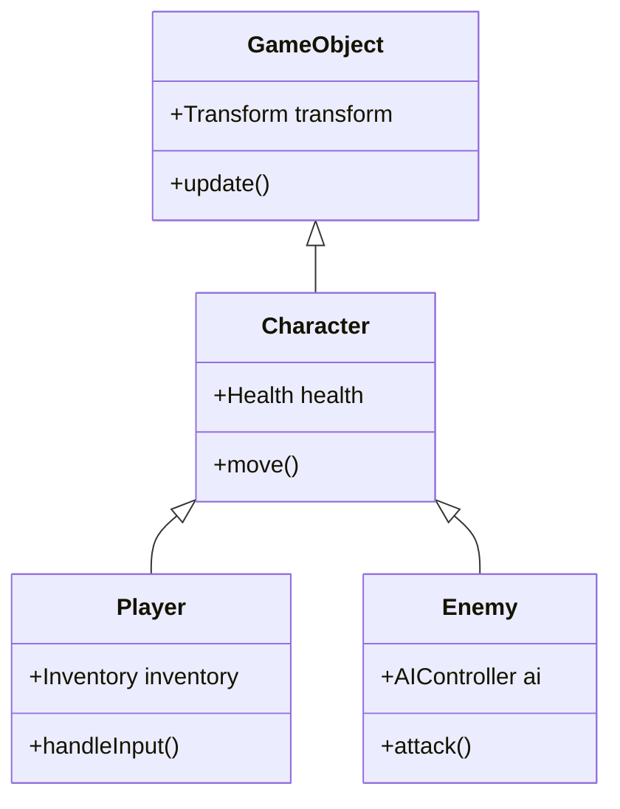
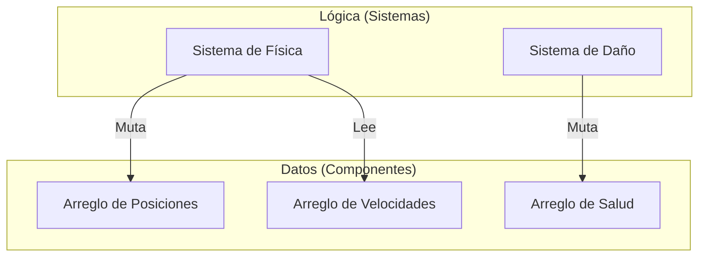

La historia de la evolución de los lenguajes de programación es también la historia de la batalla contra la complejidad. A medida que el software crece a gran escala, los desarrolladores se enfrentan a muros en la gestión del estado, el rendimiento y la mantenibilidad, y se han propuesto varios **paradigmas de programación** para superarlos.

En este artículo, profundizaremos en la filosofía, fortalezas y **límites** de la **Programación Orientada a Objetos** (OOP, por sus siglas en inglés), predominante en el desarrollo de software moderno, la **Programación Funcional** (FP), con su robustez matemática, y la **Programación Orientada a Datos** (DOP / DOD), centrada en el rendimiento y la separación de datos. Además, explicaremos cómo lenguajes modernos y potentes (como [Rust](https://kenji.blog/es/p/webassembly-wasm-current-future/) y TypeScript) logran la **fusión** de estos paradigmas.

---

## 1. El auge y la caída de la Programación Orientada a Objetos (OOP)

La **Orientación a Objetos** (Object-Oriented Programming) reinó como el paradigma absoluto en el desarrollo de software desde la década de 1990 hasta la de 2010. Lenguajes como Java, C++ y C# lideraron este paradigma, y el enfoque intuitivo de modelar el mundo real fue ampliamente aceptado.

### 1.1 Conceptos principales de OOP

El objetivo de OOP es encapsular los "datos" y el "comportamiento" que manipula esos datos en un solo **objeto**.

- **Encapsulamiento**: Oculta el estado interno y solo permite operaciones desde el exterior a través de métodos públicos.
- **Herencia**: Extiende clases existentes para mejorar la reutilización de código.
- **Polimorfismo**: Intercambia diferentes implementaciones bajo una misma interfaz.

```typescript
// Ejemplo típico de OOP en TypeScript
abstract class Animal {
    protected name: string;
    
    constructor(name: string) {
        this.name = name;
    }
    
    abstract speak(): void;
}

class Dog extends Animal {
    speak(): void {
        console.log(`${this.name} says Woof!`);
    }
}

class Cat extends Animal {
    speak(): void {
        console.log(`${this.name} says Meow!`);
    }
}

const animals: Animal[] = [new Dog("Buddy"), new Cat("Kitty")];
animals.forEach(a => a.speak());
```

### 1.2 Límites de OOP y el "Problema del gorila y la banana"

OOP parece a primera vista una técnica de modelado perfecta, pero a medida que los sistemas se escalan, provoca problemas fatales: el **abuso de la herencia** y la **gestión de estados implícitos**.

Una cita famosa de Joe Armstrong (creador de Erlang) dice:

> "El problema con los lenguajes orientados a objetos es que traen consigo todo su entorno implícito. Solo querías una banana, pero terminas obteniendo un gorila sosteniendo la banana y toda la jungla."



Los árboles de herencia profundos complican las dependencias del código, haciendo que sea extremadamente difícil aislar y reutilizar funcionalidades específicas. Además, cuando múltiples objetos se referencian y modifican estados entre sí, la previsibilidad de todo el sistema disminuye drásticamente.

---

## 2. El enfoque matemático de la Programación Funcional (FP)

Como antítesis a la complejidad causada por la "mutación del estado" en OOP, surgió la **Programación Funcional** (Functional Programming). Ha influenciado fuertemente no solo a lenguajes como Haskell, Scala y Clojure, sino también a JavaScript y TypeScript en la actualidad.

### 2.1 Conceptos principales de FP

FP construye programas como combinaciones de **funciones puras**.

- **Función pura**: Siempre devuelve el mismo resultado para la misma entrada y no modifica el estado externo (no tiene efectos secundarios).
- **Inmutabilidad**: Los datos, una vez creados, no cambian. Si se requiere un cambio, se genera una nueva estructura de datos.
- **Funciones de orden superior y composición de funciones**: Trata a las funciones como datos y las combina para construir procesos complejos.

```typescript
// Enfoque tipo FP en TypeScript (Inmutabilidad y funciones de orden superior)
type User = { readonly id: number; readonly name: string; readonly isActive: boolean };

const users: readonly User[] = [
    { id: 1, name: "Alice", isActive: true },
    { id: 2, name: "Bob", isActive: false },
    { id: 3, name: "Charlie", isActive: true }
];

// Función pura sin efectos secundarios
const getActiveUserNames = (users: readonly User[]): string[] => 
    users
        .filter(u => u.isActive)
        .map(u => u.name);

console.log(getActiveUserNames(users)); // ["Alice", "Charlie"]
```

La transición de estado en FP se expresa de la misma manera que una función matemática $f(x) = y$. Dado un estado del sistema $S$ y una acción $A$, el nuevo estado $S'$ se puede expresar de la siguiente manera:

$ S' = f(S, A) $

Escribir el código de esta forma facilita enormemente las pruebas (testing) y elimina de raíz las condiciones de carrera (data races) en el procesamiento concurrente (multi-hilo).

### 2.2 Límites de FP: Desacuerdo con el "mundo real"

El paradigma funcional también tiene sus límites. Las computadoras son máquinas que inherentemente mantienen un estado (arquitectura de von Neumann), y la FP pura difiere de los principios de funcionamiento de una CPU.

Las asignaciones de memoria para mantener la inmutabilidad (carga para el recolector de basura) o el uso de mónadas para manejar "efectos secundarios inevitables" como el I/O (salida en pantalla, escritura en base de datos) conllevan una alta curva de aprendizaje conceptual y, a veces, se convierten en cuellos de botella para el rendimiento.

---

## 3. Retorno a la Programación Orientada a Datos (DOP/DOD)

El **Diseño Orientado a Datos** (Data-Oriented Design) o **Programación Orientada a Datos** es un paradigma que nació en el desarrollo de videojuegos (especialmente en C++ y [Rust](https://kenji.blog/es/p/webassembly-wasm-current-future/)) y que posteriormente se extendió al ámbito empresarial (como en la filosofía de Clojure).

### 3.1 Conceptos principales de DOP

El objetivo supremo de DOP es "separar los datos de la lógica". Mientras que OOP agrupa los datos y la lógica en clases, DOP los separa.

- **Separación de datos**: Los datos se definen simplemente como estructuras de datos (registros, structs) y no tienen comportamiento.
- **ECS (Sistema de Entidades y Componentes)**: En lugar de usar la herencia, los datos se dividen en componentes y los sistemas (funciones) los procesan en lotes.
- **Eficiencia de caché (Diseño de memoria)**: Los datos se colocan en memoria contigua (SoA: Estructura de Arreglos) para aprovechar las líneas de caché de la CPU.

```rust
// Enfoque orientado a datos (estilo ECS) usando Rust
// Datos puros sin comportamiento (Componentes)
struct Position { x: f32, y: f32 }
struct Velocity { dx: f32, dy: f32 }

// El sistema (lógica) procesa grupos de datos de forma continua
fn update_positions(positions: &mut [Position], velocities: &[Velocity], dt: f32) {
    // Al acceder a la memoria de forma continua, la tasa de aciertos de caché de la CPU es extremadamente alta
    for (pos, vel) in positions.iter_mut().zip(velocities.iter()) {
        pos.x += vel.dx * dt;
        pos.y += vel.dy * dt;
    }
}
```



### 3.2 Límites de DOP: Dificultad para aplicarlo a la lógica de negocio

DOP (como ECS) es imbatible en áreas donde el rendimiento es absoluto, como en los motores de juegos, pero en la construcción de aplicaciones web generales y la lógica de negocio, tiene la desventaja de que el código puede volverse demasiado procedimental y las relaciones entre los datos pueden dispersarse (disminuyendo la cohesión).

---

## 4. Comparación de paradigmas y sus compromisos

Cada paradigma tiene áreas en las que sobresale y áreas donde flaquea.

| Paradigma | Ventajas | Desventajas | Casos de uso óptimos |
| :--- | :--- | :--- | :--- |
| **OOP** | Modelado intuitivo, ocultación a través del encapsulamiento | Complejidad por la herencia, errores por mutación implícita de estados | Frameworks de GUI, modelado del dominio de negocio |
| **FP** | Resistencia al procesamiento concurrente, facilidad de pruebas, previsibilidad | Curva de aprendizaje pronunciada, rendimiento (carga de GC) | [Pipeline](https://kenji.blog/es/p/cicd-pipeline-github-actions-best-practices/)s de transformación de datos, sistemas concurrentes |
| **DOP** | Rendimiento abrumador, transparencia del estado | Menor cohesión de datos, tendencia a ser procedimental | Desarrollo de juegos, procesamiento de cálculos de alta carga, sistemas embebidos |

---

## 5. La solución óptima actual: "Fusión" de paradigmas

Hoy en día, se considera un absurdo intentar elegir "la única respuesta correcta" entre estos paradigmas. Los lenguajes de programación modernos (como [Rust](https://kenji.blog/es/p/webassembly-wasm-current-future/), TypeScript, Scala y Go) adoptan **lo mejor de cada mundo**.

### 5.1 La fusión definitiva demostrada por Rust

Rust combina estos tres paradigmas a un nivel sorprendente.

1. **Orientado a datos**: Representación de datos eficiente en memoria mediante `struct` y `enum`.
2. **Funcional**: API rica en iteradores, coincidencia de patrones (pattern matching) e inmutabilidad por defecto.
3. **Orientado a objetos**: Polimorfismo y encapsulamiento de datos mediante `trait`.

```rust
// Separación del estado (datos) y el comportamiento, y coincidencia de patrones
enum Event {
    Click(i32, i32),
    KeyPress(char),
}

struct AppState {
    click_count: u32,
    last_key: Option<char>,
}

// Lógica de actualización de estado adoptando un enfoque funcional
fn process_event(state: &mut AppState, event: Event) {
    match event {
        Event::Click(_x, _y) => {
            state.click_count += 1;
        },
        Event::KeyPress(c) => {
            state.last_key = Some(c);
        }
    }
}
```

En este código, se emplean tipos de suma (`enum`) característicos de la programación funcional, mientras que el estado se gestiona de manera centralizada bajo un enfoque orientado a datos.

### 5.2 Arquitectura práctica en TypeScript

Incluso en el desarrollo frontend con TypeScript (como en React), la fusión de paradigmas se ha convertido en el estándar.

- El renderizado de la UI en los componentes es **funcional** (se devuelve la UI como una función pura).
- La gestión del caché y la obtención de datos son **orientadas a datos** (árboles de estado normalizados con [Redux](https://kenji.blog/es/p/state-management-history-future/) o [Zustand](https://kenji.blog/es/p/state-management-history-redux-context-recoil-zustand/)).
- Algunas lógicas de dominio complejas son **orientadas a objetos** (capas de servicio basadas en clases).

---

## 6. Conclusión

**Orientación a Objetos**, **Funcional** y **Orientado a Datos**. Estos no son religiones mutuamente excluyentes.

Lo importante es identificar la naturaleza del dominio que estamos tratando de resolver. Si el rendimiento es la máxima prioridad, se deben fortalecer los elementos **orientados a datos**; si el procesamiento concurrente o el flujo de transformación de datos es fundamental, se adopta un enfoque **funcional**; y para dominios locales que requieren reglas comerciales complejas o encapsulamiento, se utilizan técnicas de **orientación a objetos**.

> "Los paradigmas de programación no nos dicen qué hacer, sino que son restricciones que nos dicen **qué no hacer**." — Robert C. Martin

Cruzar las barreras de los paradigmas y usar múltiples herramientas según el contexto es, sin duda, la habilidad más importante que se espera de los ingenieros de software de la próxima generación.
