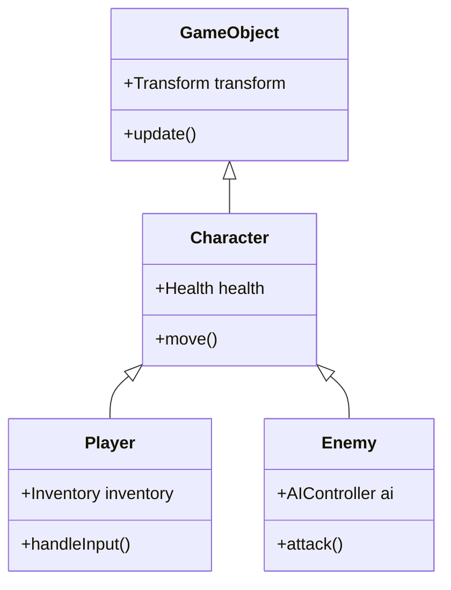
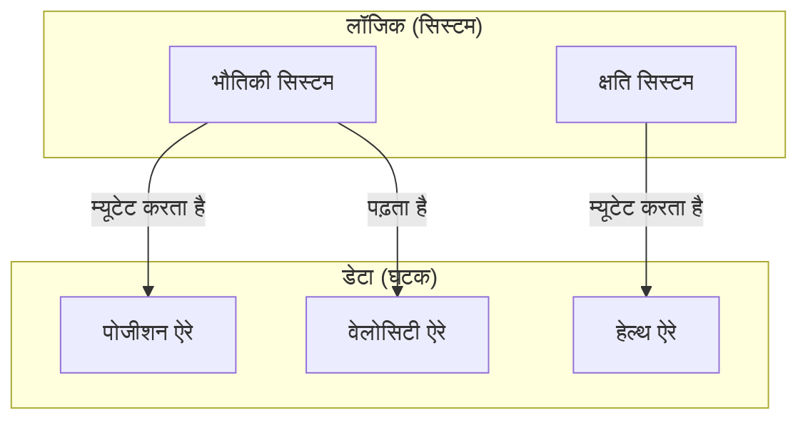

प्रोग्रामिंग भाषाओं के विकास का इतिहास भी जटिलता के साथ संघर्ष का इतिहास है। जैसे-जैसे सॉफ्टवेयर बड़े होते गए, उन्हें स्थिति प्रबंधन (state management), प्रदर्शन (performance), और रखरखाव की दीवारों का सामना करना पड़ा, और इन्हें दूर करने के लिए विभिन्न **प्रोग्रामिंग प्रतिमान** (programming paradigms) प्रस्तावित किए गए।

इस लेख में, हम आधुनिक सॉफ्टवेयर विकास में मुख्यधारा बन चुके **ऑब्जेक्ट-ओरिएंटेड प्रोग्रामिंग** (OOP), गणितीय मजबूती वाली **फंक्शनल प्रोग्रामिंग** (FP), और प्रदर्शन और डेटा के अलगाव पर केंद्रित **डेटा-ओरिएंटेड प्रोग्रामिंग** (DOP / DOD) के पीछे के दर्शन, उनकी शक्तियों और **सीमाओं** की गहराई से जांच करेंगे। इसके अलावा, हम यह भी स्पष्ट करेंगे कि कैसे आधुनिक शक्तिशाली भाषाएं (जैसे [Rust](https://kenji.blog/hi/p/webassembly-wasm-current-future/) और TypeScript) इन्हें **एकीकृत** कर रही हैं।

---

## 1. ऑब्जेक्ट-ओरिएंटेड प्रोग्रामिंग (OOP) का उत्थान और पतन

**ऑब्जेक्ट-ओरिएंटेड** (Object-Oriented Programming) ने 1990 से 2010 के दशक तक सॉफ्टवेयर विकास के निर्विवाद राजा के रूप में शासन किया। Java, C++, C# जैसी भाषाओं ने इस प्रतिमान का नेतृत्व किया, और वास्तविक दुनिया को मॉडल करने के इसके सहज दृष्टिकोण को व्यापक रूप से स्वीकार किया गया।

### 1.1 OOP के मुख्य सिद्धांत

OOP का उद्देश्य 'डेटा' और उस डेटा को संचालित करने वाले 'व्यवहार' को एक ही **ऑब्जेक्ट** में इनकैप्सुलेट (encapsulate) करना है।

- **इनकैप्सुलेशन (Encapsulation)** : आंतरिक स्थिति को छुपाना और केवल सार्वजनिक विधियों (methods) के माध्यम से संचालन की अनुमति देना।
- **इनहेरिटेंस (Inheritance)** : मौजूदा क्लास का विस्तार करना और कोड की पुन: प्रयोज्यता (reusability) को बढ़ाना।
- **पॉलीमॉर्फिज्म (Polymorphism)** : एक ही इंटरफ़ेस के साथ विभिन्न कार्यान्वयन (implementations) को स्विच करना।

```typescript
// TypeScript के साथ एक विशिष्ट OOP का उदाहरण
abstract class Animal {
    protected name: string;
    
    constructor(name: string) {
        this.name = name;
    }
    
    abstract speak(): void;
}

class Dog extends Animal {
    speak(): void {
        console.log(`${this.name} कहता है Woof!`);
    }
}

class Cat extends Animal {
    speak(): void {
        console.log(`${this.name} कहती है Meow!`);
    }
}

const animals: Animal[] = [new Dog("Buddy"), new Cat("Kitty")];
animals.forEach(a => a.speak());
```

### 1.2 OOP की सीमाएं और "केले और गोरिल्ला की समस्या"

OOP पहली नज़र में एक आदर्श मॉडलिंग तकनीक लग सकती है, लेकिन जैसे-जैसे सिस्टम बड़े होते जाते हैं, यह **इनहेरिटेंस के दुरुपयोग** और **निहित स्थिति प्रबंधन** (implicit state management) जैसी घातक समस्याओं को जन्म देता है।

एक प्रसिद्ध उद्धरण में, Joe Armstrong (Erlang के निर्माता) ने निम्नलिखित कहा है:

> "ऑब्जेक्ट-ओरिएंटेड भाषाओं की समस्या यह है कि वे अपने साथ सभी निहित वातावरण लाती हैं। आपको बस एक केला चाहिए था, लेकिन आपको एक गोरिल्ला केले पकड़े हुए और पूरा जंगल मिल जाता है।"



गहरे इनहेरिटेंस ट्रीज़ कोड की निर्भरता को जटिल बनाते हैं और किसी विशिष्ट कार्यक्षमता को निकालकर पुन: उपयोग करना बेहद मुश्किल बना देते हैं। साथ ही, जब कई ऑब्जेक्ट्स एक-दूसरे को संदर्भित करते हैं और एक-दूसरे की स्थिति को बदलते हैं, तो पूरे सिस्टम की पूर्वानुमान क्षमता (predictability) काफी कम हो जाती है।

---

## 2. फंक्शनल प्रोग्रामिंग (FP) का गणितीय दृष्टिकोण

OOP की "स्थिति के म्यूटेशन" के कारण होने वाली जटिलता के विपरीत **फंक्शनल प्रोग्रामिंग** (Functional Programming) ने सुर्खियां बटोरीं। Haskell, Scala, Clojure जैसी भाषाओं के साथ-साथ, इसने आधुनिक JavaScript और TypeScript को भी गहराई से प्रभावित किया है।

### 2.1 FP के मुख्य सिद्धांत

FP प्रोग्राम को **शुद्ध कार्यों** (pure functions) के संयोजन के रूप में बनाता है।

- **शुद्ध कार्य (Pure Functions)** : समान इनपुट के लिए हमेशा समान आउटपुट देते हैं और बाहरी स्थिति को नहीं बदलते हैं (कोई साइड इफेक्ट नहीं)।
- **अपरिवर्तनीयता (Immutability)** : डेटा एक बार बनने के बाद बदला नहीं जाता है। यदि बदलाव की आवश्यकता है, तो एक नई डेटा संरचना बनाई जाती है।
- **उच्च-क्रम के कार्य (Higher-Order Functions) और फ़ंक्शन कंपोज़िशन** : कार्यों को डेटा के रूप में मानना और जटिल प्रक्रियाओं को बनाने के लिए उन्हें संयोजित करना।

```typescript
// TypeScript के साथ FP दृष्टिकोण (अपरिवर्तनीयता और उच्च-क्रम के कार्य)
type User = { readonly id: number; readonly name: string; readonly isActive: boolean };

const users: readonly User[] = [
    { id: 1, name: "Alice", isActive: true },
    { id: 2, name: "Bob", isActive: false },
    { id: 3, name: "Charlie", isActive: true }
];

// बिना साइड इफेक्ट वाले शुद्ध कार्य
const getActiveUserNames = (users: readonly User[]): string[] => 
    users
        .filter(u => u.isActive)
        .map(u => u.name);

console.log(getActiveUserNames(users)); // ["Alice", "Charlie"]
```

FP में स्थिति के संक्रमण को गणितीय फ़ंक्शन $f(x) = y$ की तरह ही दर्शाया जाता है। जब सिस्टम की स्थिति $S$ और क्रिया $A$ होती है, तो नई स्थिति $S'$ को इस प्रकार दर्शाया जा सकता है:

$ S' = f(S, A) $

इस तरह से लिखने से कोड का परीक्षण करना बेहद आसान हो जाता है, और समवर्ती प्रसंस्करण (concurrent processing / multi-threading) में रेस कंडीशन्स (data races) को जड़ से खत्म किया जा सकता है।

### 2.2 FP की सीमाएं: "वास्तविक दुनिया" के साथ असंगति

फंक्शनल प्रतिमान की भी सीमाएं हैं। कंप्यूटर मूल रूप से स्थिति-आधारित मशीनें (वॉन न्यूमैन आर्किटेक्चर) हैं, और शुद्ध FP CPU के कार्य सिद्धांत से विचलित होता है।

अपरिवर्तनीयता को बनाए रखने के लिए मेमोरी आवंटन (गार्बेज कलेक्शन पर भार) और I/O (स्क्रीन आउटपुट, डेटाबेस राइट) जैसे "अपरिहार्य साइड इफेक्ट्स" को संभालने के लिए मोनैड्स (monads) जैसे वैचारिक सीखने की उच्च लागत होती है, और कभी-कभी यह प्रदर्शन की बाधा बन जाता है।

---

## 3. डेटा-ओरिएंटेड प्रोग्रामिंग (DOP/DOD) की ओर वापसी

**डेटा-ओरिएंटेड डिज़ाइन** (Data-Oriented Design) या **डेटा-ओरिएंटेड प्रोग्रामिंग** गेम विकास (विशेषकर C++ और [Rust](https://kenji.blog/hi/p/webassembly-wasm-current-future/)) के क्षेत्र से उभरा है, और बाद में एंटरप्राइज़ क्षेत्र (जैसे Clojure के दर्शन) में भी फैल गया है।

### 3.1 DOP के मुख्य सिद्धांत

DOP का सर्वोच्च लक्ष्य "डेटा और लॉजिक को अलग करना" है। जहां OOP ने डेटा और लॉजिक को क्लास में मिला दिया, वहीं DOP उन्हें अलग कर देता है।

- **डेटा का अलगाव** : डेटा को केवल एक डेटा संरचना (रिकॉर्ड, स्ट्रक्चर) के रूप में परिभाषित किया जाता है और इसमें कोई व्यवहार नहीं होता है।
- **ECS (Entity Component System)** : इनहेरिटेंस के बजाय, डेटा को घटकों (components) के रूप में विभाजित किया जाता है, और सिस्टम (कार्य) उन्हें एक साथ प्रोसेस करते हैं।
- **कैश दक्षता (मेमोरी लेआउट)** : CPU कैश लाइनों में फिट होने के लिए डेटा को सन्निहित मेमोरी (SoA: Structure of Arrays) में व्यवस्थित किया जाता है।

```rust
// Rust का उपयोग करके डेटा-ओरिएंटेड (ECS जैसा) दृष्टिकोण
// शुद्ध डेटा जिसमें कोई व्यवहार नहीं है (घटक)
struct Position { x: f32, y: f32 }
struct Velocity { dx: f32, dy: f32 }

// सिस्टम (लॉजिक) लगातार डेटा समूहों को संसाधित करता है
fn update_positions(positions: &mut [Position], velocities: &[Velocity], dt: f32) {
    // मेमोरी में लगातार एक्सेस करने के कारण, CPU कैश हिट दर बहुत अधिक होती है
    for (pos, vel) in positions.iter_mut().zip(velocities.iter()) {
        pos.x += vel.dx * dt;
        pos.y += vel.dy * dt;
    }
}
```



### 3.2 DOP की सीमाएं: व्यावसायिक लॉजिक में लागू करने की कठिनाई

गेम इंजन जैसे प्रदर्शन-गहन क्षेत्रों में DOP (ECS) अपराजेय है, लेकिन सामान्य वेब अनुप्रयोगों और व्यावसायिक लॉजिक के निर्माण में, कोड बहुत अधिक प्रक्रियात्मक (procedural) हो सकता है, और डेटा संबंध बिखर सकते हैं (सामंजस्य या cohesion कम हो जाता है), जो एक नुकसान है।

---

## 4. प्रतिमानों की तुलना और ट्रेड-ऑफ़

प्रत्येक प्रतिमान के स्पष्ट रूप से मजबूत और कमजोर क्षेत्र हैं।

| प्रतिमान | लाभ | हानियाँ | इष्टतम उपयोग के मामले |
| :--- | :--- | :--- | :--- |
| **OOP** | सहज मॉडलिंग, इनकैप्सुलेशन द्वारा छिपाना | इनहेरिटेंस की जटिलता, निहित स्थिति परिवर्तन से बग | GUI फ्रेमवर्क, व्यावसायिक डोमेन मॉडलिंग |
| **FP** | समवर्ती प्रसंस्करण के प्रति लचीलापन, परीक्षण में आसानी, पूर्वानुमान क्षमता | कठिन सीखने की अवस्था, प्रदर्शन (GC भार) | डेटा रूपांतरण पाइपलाइन, समवर्ती प्रसंस्करण सिस्टम |
| **DOP** | बेहतरीन प्रदर्शन, स्थिति की पारदर्शिता | डेटा के सामंजस्य (cohesion) में कमी, प्रक्रियात्मक हो जाने की प्रवृत्ति | गेम विकास, उच्च-भार संगणना, एम्बेडेड सिस्टम |

---

## 5. आधुनिक युग में इष्टतम समाधान: प्रतिमानों का "एकीकरण"

आज, इनमें से किसी एक को "एकमात्र सही उत्तर" के रूप में चुनना निरर्थक माना जाता है। आधुनिक प्रोग्रामिंग भाषाएं ([Rust](https://kenji.blog/hi/p/webassembly-wasm-current-future/), TypeScript, Scala, Go आदि) इन प्रतिमानों के **सर्वोत्तम पहलुओं** को अपना रही हैं।

### 5.1 Rust द्वारा प्रस्तुत अंतिम एकीकरण

Rust इन तीन प्रतिमानों को एक अद्भुत स्तर पर एकीकृत करता है।

1. **डेटा-ओरिएंटेड** : `struct` और `enum` का उपयोग करके मेमोरी-कुशल डेटा प्रतिनिधित्व।
2. **फंक्शनल** : समृद्ध इटरेटर API, पैटर्न मैचिंग, और डिफ़ॉल्ट रूप से अपरिवर्तनीयता (immutability)।
3. **ऑब्जेक्ट-ओरिएंटेड** : `trait` के माध्यम से पॉलीमॉर्फिज्म और डेटा इनकैप्सुलेशन।

```rust
// स्थिति (डेटा) और व्यवहार का अलगाव, और पैटर्न मैचिंग
enum Event {
    Click(i32, i32),
    KeyPress(char),
}

struct AppState {
    click_count: u32,
    last_key: Option<char>,
}

// फ़ंक्शनल दृष्टिकोण को शामिल करते हुए स्थिति अद्यतन लॉजिक
fn process_event(state: &mut AppState, event: Event) {
    match event {
        Event::Click(_x, _y) => {
            state.click_count += 1;
        },
        Event::KeyPress(c) => {
            state.last_key = Some(c);
        }
    }
}
```

इस कोड में, `enum` (फंक्शनल की विशेषता) का उपयोग करते हुए डेटा-ओरिएंटेड तरीके से स्थिति को केंद्रीय रूप से प्रबंधित किया गया है।

### 5.2 TypeScript में व्यावहारिक वास्तुकला

TypeScript का उपयोग करके फ्रंट-एंड विकास (जैसे React) में भी, प्रतिमानों का एकीकरण मानक बन गया है।

- घटकों (components) का UI प्रतिपादन **फंक्शनल** है (शुद्ध कार्य के रूप में UI लौटाता है)।
- डेटा फ़ेचिंग और कैश प्रबंधन **डेटा-ओरिएंटेड** है ([Redux](https://kenji.blog/hi/p/state-management-history-future/) या Zustand के माध्यम से सामान्यीकृत स्थिति ट्री)।
- जटिल डोमेन लॉजिक के कुछ हिस्सों में **ऑब्जेक्ट-ओरिएंटेड** दृष्टिकोण (क्लास-आधारित सर्विस लेयर) है।

---

## 6. निष्कर्ष

**ऑब्जेक्ट-ओरिएंटेड** , **फंक्शनल** , और **डेटा-ओरिएंटेड** । ये परस्पर अनन्य धर्म नहीं हैं।

महत्वपूर्ण बात उस डोमेन की प्रकृति को पहचानना है जिसे हम हल करने का प्रयास कर रहे हैं। यदि प्रदर्शन सर्वोच्च प्राथमिकता है तो **डेटा-ओरिएंटेड** तत्वों को मजबूत करें, यदि समवर्ती प्रसंस्करण और डेटा रूपांतरण प्रवाह केंद्रीय है तो **फंक्शनल** दृष्टिकोण अपनाएं, और जटिल व्यावसायिक नियमों या इनकैप्सुलेशन की आवश्यकता वाले स्थानीय डोमेन के लिए **ऑब्जेक्ट-ओरिएंटेड** तकनीकों का उपयोग करें।

> "प्रोग्रामिंग प्रतिमान हमें यह नहीं बताते कि हमें क्या करना चाहिए, बल्कि यह **क्या नहीं करना चाहिए** की बाधाएं हैं।" — Robert C. Martin

प्रतिमानों की दीवारों को पार करना और संदर्भ के अनुसार कई हथियारों का उपयोग करना अगली पीढ़ी के सॉफ्टवेयर इंजीनियरों के लिए आवश्यक सबसे महत्वपूर्ण कौशल कहा जा सकता है।
