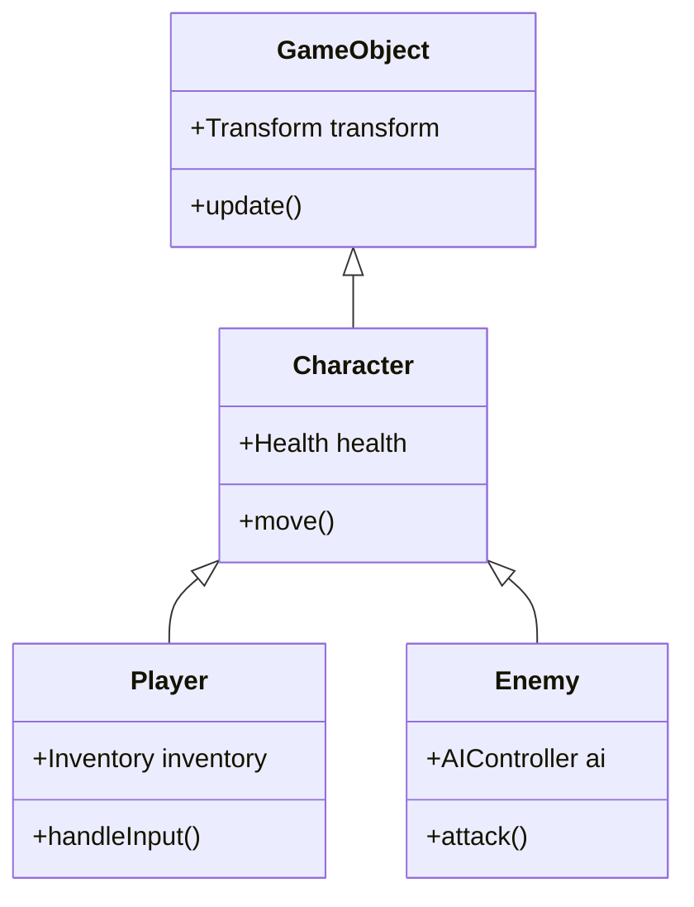
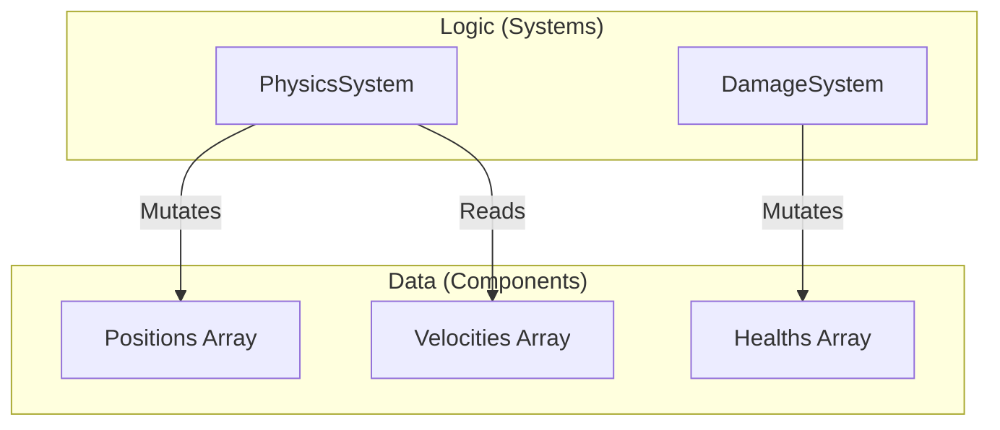

Sejarah evolusi bahasa pemrograman juga merupakan sejarah pertempuran melawan kompleksitas. Seiring dengan membesarnya skala perangkat lunak, kita menghadapi hambatan pada manajemen status, performa, dan pemeliharaan, sehingga berbagai **paradigma pemrograman** telah diusulkan untuk mengatasinya.

Pada artikel ini, kita akan membahas secara mendalam filosofi, keunggulan, dan **batasan** dari **Pemrograman Berorientasi Objek** (OOP) yang menjadi arus utama dalam pengembangan perangkat lunak modern, **Pemrograman Fungsional** (FP) yang memiliki ketangguhan matematis, dan **Pemrograman Berorientasi Data** (DOP / DOD) yang berfokus pada performa dan pemisahan data. Lebih lanjut, kita akan menjelaskan bagaimana bahasa modern yang kuat (seperti [Rust](https://kenji.blog/id/p/webassembly-wasm-current-future/) dan TypeScript) melakukan **fusi** dari ketiganya.

---

## 1. Pasang Surut Pemrograman Berorientasi Objek (OOP)

**Berorientasi Objek** (Object-Oriented Programming) berkuasa sebagai raja mutlak dalam pengembangan perangkat lunak dari tahun 1990-an hingga 2010-an. Bahasa seperti Java, C++, dan C# memimpin paradigma ini, dan pendekatan intuitifnya dalam memodelkan dunia nyata dapat diterima dengan baik.

### 1.1 Konsep Inti OOP

Tujuan dari OOP adalah mengenkapsulasi "data" dan "perilaku" yang memanipulasi data tersebut ke dalam satu **objek**.

- **Enkapsulasi** : Menyembunyikan status internal dan hanya mengizinkan manipulasi dari luar melalui metode yang dipublikasikan.
- **Pewarisan (Inheritance)** : Memperluas kelas yang ada untuk meningkatkan penggunaan ulang (reusability) kode.
- **Polimorfisme** : Mengalihkan berbagai implementasi yang berbeda melalui antarmuka (interface) yang sama.

```typescript
// Contoh tipikal OOP menggunakan TypeScript
abstract class Animal {
    protected name: string;
    
    constructor(name: string) {
        this.name = name;
    }
    
    abstract speak(): void;
}

class Dog extends Animal {
    speak(): void {
        console.log(`${this.name} says Woof!`);
    }
}

class Cat extends Animal {
    speak(): void {
        console.log(`${this.name} says Meow!`);
    }
}

const animals: Animal[] = [new Dog("Buddy"), new Cat("Kitty")];
animals.forEach(a => a.speak());
```

### 1.2 Batasan OOP dan "Masalah Pisang dan Gorila"

Sekilas OOP tampak seperti metode pemodelan yang sempurna, tetapi seiring dengan membesarnya skala sistem, ia memicu masalah fatal yaitu **penyalahgunaan pewarisan** dan **manajemen status implisit**.

Sebuah kutipan terkenal dari Joe Armstrong (Pencipta Erlang) berbunyi:

> "Masalah dengan bahasa berorientasi objek adalah bahwa mereka membawa seluruh lingkungan implisit mereka. Anda hanya menginginkan sebuah pisang, tetapi Anda mendapatkan seekor gorila yang memegang pisang tersebut, beserta seluruh hutannya."



Pohon pewarisan yang dalam memperumit dependensi kode dan membuatnya sangat sulit untuk mengekstrak dan menggunakan kembali fitur-fitur tertentu. Selain itu, dengan banyak objek yang saling merujuk dan mengubah status satu sama lain, prediktabilitas keseluruhan sistem menurun drastis.

---

## 2. Pendekatan Matematis dari Pemrograman Fungsional (FP)

**Pemrograman Fungsional** (Functional Programming) menjadi sorotan sebagai antitesis terhadap kompleksitas yang ditimbulkan oleh "mutasi status" dari OOP. Ini tidak hanya pada bahasa seperti Haskell, Scala, dan Clojure, tetapi di era modern juga memberikan pengaruh kuat pada JavaScript dan TypeScript.

### 2.1 Konsep Inti FP

FP membangun program sebagai kombinasi dari **fungsi murni**.

- **Fungsi Murni (Pure Function)** : Selalu mengembalikan output yang sama untuk input yang sama, dan tidak mengubah status eksternal (tidak memiliki efek samping).
- **Ketidakubahab (Immutability)** : Data tidak diubah setelah dibuat. Jika diperlukan perubahan, struktur data baru akan dihasilkan.
- **Fungsi Tingkat Tinggi (Higher-Order Functions) dan Komposisi Fungsi** : Memperlakukan fungsi sebagai data, dan menggabungkannya untuk membangun pemrosesan yang kompleks.

```typescript
// Pendekatan bergaya FP menggunakan TypeScript (Immutability dan fungsi tingkat tinggi)
type User = { readonly id: number; readonly name: string; readonly isActive: boolean };

const users: readonly User[] = [
    { id: 1, name: "Alice", isActive: true },
    { id: 2, name: "Bob", isActive: false },
    { id: 3, name: "Charlie", isActive: true }
];

// Fungsi murni tanpa efek samping
const getActiveUserNames = (users: readonly User[]): string[] => 
    users
        .filter(u => u.isActive)
        .map(u => u.name);

console.log(getActiveUserNames(users)); // ["Alice", "Charlie"]
```

Transisi status dalam FP direpresentasikan seperti fungsi matematika $f(x) = y$. Jika ada status sistem $S$ dan aksi $A$, maka status baru $S'$ dapat diekspresikan sebagai berikut:

$ S' = f(S, A) $

Dengan menulis seperti ini, pengujian kode menjadi sangat mudah, dan kondisi balapan (data race) pada pemrosesan konkuren (multi-threading) dapat dihilangkan dari akarnya.

### 2.2 Batasan FP: Ketidakcocokan dengan "Dunia Nyata"

Paradigma fungsional juga memiliki batasan. Komputer pada dasarnya adalah mesin yang memiliki status (arsitektur Von Neumann), dan FP murni menyimpang dari prinsip kerja CPU.

Alokasi memori untuk menjaga immutability (beban pada [Garbage Collection](https://kenji.blog/id/p/memory-management-garbage-collection/)) dan penggunaan monad untuk menangani "efek samping yang tidak dapat dihindari" seperti I/O (output layar, penulisan basis data), memiliki biaya pembelajaran konseptual yang tinggi dan terkadang menjadi bottleneck pada performa.

---

## 3. Kembali ke Pemrograman Berorientasi Data (DOP/DOD)

**Desain Berorientasi Data** (Data-Oriented Design) atau **Pemrograman Berorientasi Data** adalah paradigma yang lahir di lapangan pengembangan game (terutama C++ dan [Rust](https://kenji.blog/id/p/webassembly-wasm-current-future/)) dan kemudian menyebar ke ranah perusahaan (seperti filosofi Clojure).

### 3.1 Konsep Inti DOP

DOP menjadikan "pemisahan data dan logika" sebagai tujuan utamanya. Berbeda dengan OOP yang menggabungkan data dan logika ke dalam kelas, DOP memisahkannya.

- **Pemisahan Data** : Data didefinisikan murni sebagai struktur data (record, struct) dan tidak memiliki perilaku.
- **ECS (Entity Component System)** : Alih-alih pewarisan, data dibagi menjadi komponen-komponen, dan sistem (fungsi) memprosesnya secara massal.
- **Efisiensi Cache (Tata Letak Memori)** : Menempatkan data dalam memori yang berdekatan (SoA: Structure of Arrays) agar sesuai dengan baris cache CPU.

```rust
// Pendekatan berorientasi data (bergaya ECS) menggunakan Rust
// Data murni (komponen) tanpa perilaku
struct Position { x: f32, y: f32 }
struct Velocity { dx: f32, dy: f32 }

// Sistem (logika) memproses kumpulan data secara kontinu
fn update_positions(positions: &mut [Position], velocities: &[Velocity], dt: f32) {
    // Mengakses memori secara berurutan, sehingga tingkat cache hit CPU sangat tinggi
    for (pos, vel) in positions.iter_mut().zip(velocities.iter()) {
        pos.x += vel.dx * dt;
        pos.y += vel.dy * dt;
    }
}
```



### 3.2 Batasan DOP: Kesulitan Penerapan pada Logika Bisnis

Meskipun DOP (ECS) tak tertandingi di area yang performanya sangat krusial seperti mesin game (game engines), pada pengembangan aplikasi web umum atau konstruksi logika bisnis, kode dapat menjadi terlalu prosedural, dan terdapat kerugian di mana relasi data tersebar (kohesi menurun).

---

## 4. Perbandingan Verifikasi dan Trade-off Paradigma

Masing-masing paradigma memiliki area keunggulan dan kelemahan yang jelas.

| Paradigma | Kelebihan | Kekurangan | Kasus Penggunaan Optimal |
| :--- | :--- | :--- | :--- |
| **OOP** | Pemodelan intuitif, penyembunyian melalui enkapsulasi | Kompleksitas pewarisan, bug akibat mutasi status implisit | Framework GUI, pemodelan domain bisnis |
| **FP** | Ketahanan terhadap pemrosesan konkuren, kemudahan pengujian, prediktabilitas | Kurva pembelajaran yang curam, performa (beban GC) | Pipa transformasi data (data pipeline), sistem konkuren |
| **DOP** | Performa yang luar biasa, transparansi status | Penurunan kohesi data, cenderung prosedural | Pengembangan game, pemrosesan komputasi beban tinggi, sistem tertanam (embedded) |

---

## 5. Solusi Optimal Masa Kini: "Fusi" Paradigma

Saat ini, memilih satu "jawaban yang paling benar" di antara ini dianggap masuk akal. Bahasa pemrograman modern ([Rust](https://kenji.blog/id/p/webassembly-wasm-current-future/), TypeScript, Scala, Go, dll.) telah mengambil **bagian terbaik** dari paradigma-paradigma ini.

### 5.1 Fusi Utama yang Ditunjukkan oleh Rust

Rust menggabungkan ketiga paradigma ini pada tingkat yang menakjubkan.

1. **Berorientasi Data** : Representasi data yang efisien di memori menggunakan `struct` dan `enum`.
2. **Fungsional** : API iterator yang kaya, pencocokan pola (pattern matching), dan immutability secara default.
3. **Berorientasi Objek** : Polimorfisme menggunakan `trait` dan enkapsulasi data.

```rust
// Pemisahan status (data) dan perilaku, serta pencocokan pola
enum Event {
    Click(i32, i32),
    KeyPress(char),
}

struct AppState {
    click_count: u32,
    last_key: Option<char>,
}

// Logika pembaruan status yang mengadopsi pendekatan fungsional
fn process_event(state: &mut AppState, event: Event) {
    match event {
        Event::Click(_x, _y) => {
            state.click_count += 1;
        },
        Event::KeyPress(c) => {
            state.last_key = Some(c);
        }
    }
}
```

Dalam kode ini, meskipun menggunakan tipe varian (sum types) melalui `enum` (fitur fungsional), status dikelola secara terpusat dengan pendekatan berorientasi data.

### 5.2 Arsitektur Praktis dalam TypeScript

Dalam pengembangan front-end (seperti React) menggunakan TypeScript, fusi paradigma juga menjadi standar.

- Rendering UI dari komponen bersifat **Fungsional** (mengembalikan UI sebagai fungsi murni).
- Pengambilan data dan manajemen cache bersifat **Berorientasi Data** (pohon status yang dinormalisasi dengan [Redux](https://kenji.blog/id/p/state-management-history-future/) atau Zustand).
- Bagian dari logika domain yang kompleks menggunakan **Berorientasi Objek** (lapisan layanan (service layer) berbasis kelas).

---

## 6. Kesimpulan

**Berorientasi Objek**, **Fungsional**, **Berorientasi Data**. Ketiganya bukanlah sekte agama yang saling eksklusif.

Yang penting adalah mengenali sifat dari domain yang sedang kita coba selesaikan. Jika performa adalah prioritas utama, maka perkuat elemen **Berorientasi Data**; jika pemrosesan konkuren atau alur transformasi data menjadi fokus, terapkan pendekatan **Fungsional**; dan gunakan teknik **Berorientasi Objek** pada domain lokal yang memerlukan aturan bisnis yang kompleks atau enkapsulasi.

> "Paradigma pemrograman tidak memberi tahu kita apa yang harus dilakukan, melainkan memberikan batasan tentang **apa yang tidak boleh dilakukan**." — Robert C. Martin

Melampaui dinding paradigma dan menggunakan berbagai senjata sesuai dengan konteks mungkin merupakan keterampilan paling penting yang dituntut dari seorang insinyur perangkat lunak generasi berikutnya.
