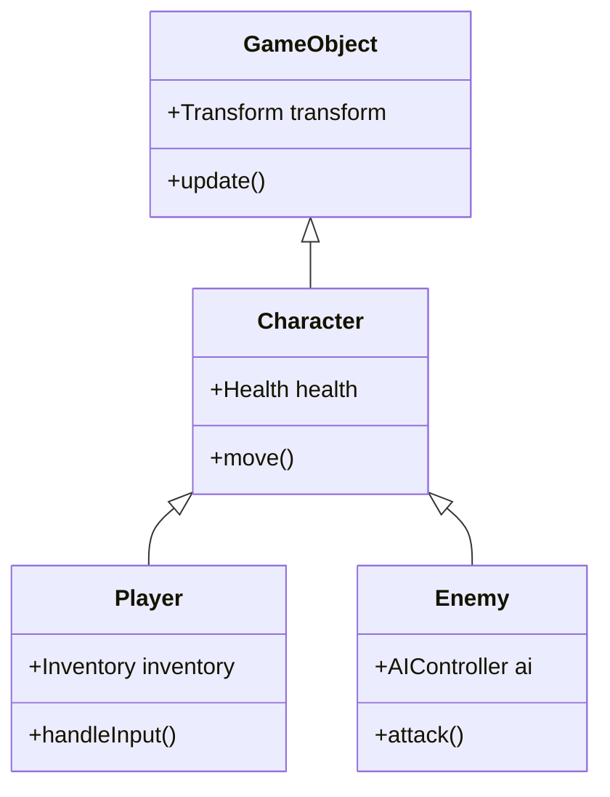
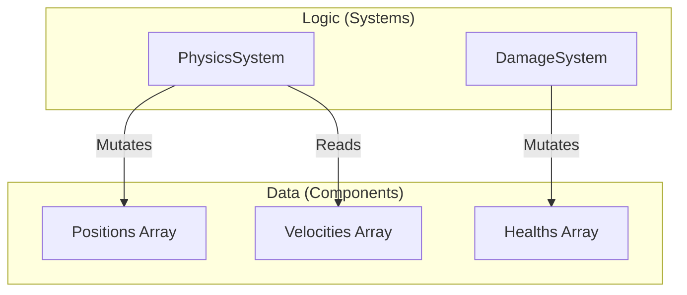

프로그래밍 언어의 진화 역사는 복잡성과의 싸움의 역사이기도 합니다. 소프트웨어가 대규모화됨에 따라 상태 관리나 성능, 유지 보수성의 장벽에 직면하게 되고, 이를 극복하기 위한 다양한 **프로그래밍 패러다임** 이 제창되어 왔습니다.

본 기사에서는 현대 소프트웨어 개발에서 주류가 되고 있는 **객체 지향 프로그래밍** (OOP), 수학적인 견고함을 가지는 **함수형 프로그래밍** (FP), 그리고 성능과 데이터 분리에 초점을 맞춘 **데이터 지향 프로그래밍** (DOP / DOD)에 대해 각각의 사상, 강점, 그리고 **한계** 를 깊이 파고듭니다. 나아가 현대의 강력한 언어([Rust](https://kenji.blog/ko/p/webassembly-wasm-current-future/)나 TypeScript 등)가 이것들을 어떻게 **융합** 시키고 있는지 해설합니다.

---

## 1. 객체 지향 프로그래밍 (OOP)의 영고성쇠

**객체 지향** (Object-Oriented Programming)은 1990년대부터 2010년대에 걸쳐 소프트웨어 개발의 절대적인 제왕으로 군림했습니다. Java나 C++, C# 등의 언어가 이 패러다임을 견인했고, 현실 세계를 모델링한다는 직관적인 접근 방식이 수용되었습니다.

### 1.1 OOP의 핵심 개념

OOP의 목적은 '데이터'와 그 데이터를 조작하는 '행위'를 하나의 **객체** 로 캡슐화하는 것입니다.

- **캡슐화** : 내부 상태를 은닉하고, 외부에서는 공개된 메서드를 통해서만 조작을 허용한다.
- **상속** : 기존 클래스를 확장하여 코드의 재사용성을 높인다.
- **다형성** : 동일한 인터페이스로 다른 구현을 전환한다.

```typescript
// TypeScript에 의한 전형적인 OOP의 예
abstract class Animal {
    protected name: string;
    
    constructor(name: string) {
        this.name = name;
    }
    
    abstract speak(): void;
}

class Dog extends Animal {
    speak(): void {
        console.log(`${this.name} says Woof!`);
    }
}

class Cat extends Animal {
    speak(): void {
        console.log(`${this.name} says Meow!`);
    }
}

const animals: Animal[] = [new Dog("Buddy"), new Cat("Kitty")];
animals.forEach(a => a.speak());
```

### 1.2 OOP의 한계와 '바나나와 고릴라 문제'

OOP는 얼핏 보면 완벽한 모델링 기법처럼 보이지만, 시스템이 대규모화됨에 따라 **상속의 남용** 과 **암묵적인 상태 관리** 라는 치명적인 문제를 일으켰습니다.

유명한 말로, Joe Armstrong(Erlang의 창시자)의 다음 발언이 있습니다.

> "객체 지향 언어의 문제점은 모든 암묵적인 환경이 함께 따라온다는 것이다. 바나나를 원했을 뿐인데, 바나나를 든 고릴라와 정글 전체가 딸려오고 만다."



깊은 상속 트리는 코드의 의존 관계를 복잡하게 하고, 특정 기능만을 잘라내어 재사용하는 것을 극히 어렵게 만듭니다. 또한 여러 객체가 서로를 참조하고 상태를 서로 변경함으로써 시스템 전체의 예측 가능성이 현저히 떨어집니다.

---

## 2. 함수형 프로그래밍 (FP)의 수학적 접근

OOP의 '상태 변이'가 초래하는 복잡성에 대한 안티테제로서 각광받은 것이 **함수형 프로그래밍** (Functional Programming)입니다. Haskell, Scala, Clojure와 같은 언어뿐만 아니라, 현대에는 JavaScript나 TypeScript에도 짙은 영향을 미치고 있습니다.

### 2.1 FP의 핵심 개념

FP는 프로그램을 **순수 함수** 의 조합으로 구축합니다.

- **순수 함수** : 동일한 입력에 대해 항상 동일한 출력을 반환하며, 외부 상태를 변경하지 않는다(부작용을 가지지 않는다).
- **불변성 (Immutability)** : 데이터는 한 번 생성되면 변경되지 않는다. 변경이 필요한 경우에는 새로운 데이터 구조를 생성한다.
- **고차 함수와 함수 합성** : 함수를 데이터로서 취급하고, 조합하여 복잡한 처리를 구축한다.

```typescript
// TypeScript에 의한 FP적인 접근 (불변성과 고차 함수)
type User = { readonly id: number; readonly name: string; readonly isActive: boolean };

const users: readonly User[] = [
    { id: 1, name: "Alice", isActive: true },
    { id: 2, name: "Bob", isActive: false },
    { id: 3, name: "Charlie", isActive: true }
];

// 부작용이 없는 순수 함수
const getActiveUserNames = (users: readonly User[]): string[] => 
    users
        .filter(u => u.isActive)
        .map(u => u.name);

console.log(getActiveUserNames(users)); // ["Alice", "Charlie"]
```

FP에서의 상태 변화는 수학의 함수 $f(x) = y$ 와 동일하게 표현됩니다. 시스템의 상태 $S$ 와 액션 $A$ 가 있을 때, 새로운 상태 $S'$ 는 다음과 같이 나타낼 수 있습니다.

$ S' = f(S, A) $

이와 같이 기술함으로써 코드의 테스트가 극히 용이해지고, 병행 처리(멀티 스레드)에서의 경합 상태(데이터 레이스)를 근본적으로 배제할 수 있습니다.

### 2.2 FP의 한계: '현실 세계'와의 불화

함수형 패러다임에도 한계는 있습니다. 컴퓨터는 본질적으로 상태를 가지는 기계(폰 노이만형 아키텍처)이며, 순수한 FP는 CPU의 동작 원리와 괴리가 있습니다.

불변성을 유지하기 위한 메모리 할당(가비지 컬렉션에 대한 부하)이나, I/O(화면 출력, 데이터베이스 쓰기)와 같은 '도저히 피할 수 없는 부작용'을 다루기 위한 모나드 등 개념적인 학습 비용이 높고, 때로는 성능의 병목 현상이 되기도 합니다.

---

## 3. 데이터 지향 프로그래밍 (DOP/DOD)으로의 회귀

**데이터 지향 설계** (Data-Oriented Design) 또는 **데이터 지향 프로그래밍** 은 게임 개발(특히 C++이나 [Rust](https://kenji.blog/ko/p/webassembly-wasm-current-future/)) 현장에서 태어나, 그 후 엔터프라이즈 영역(Clojure의 사상 등)에도 파급된 패러다임입니다.

### 3.1 DOP의 핵심 개념

DOP는 '데이터와 로직을 분리한다'는 것을 지상 과제로 삼습니다. OOP가 데이터와 로직을 클래스로 묶은 반면, DOP는 그것들을 떼어놓습니다.

- **데이터의 분리** : 데이터는 단순한 데이터 구조(레코드, 구조체)로서 정의하고, 행위를 갖지 않게 한다.
- **ECS (Entity Component System)** : 상속 대신, 데이터를 컴포넌트로 분할하고 시스템(함수)이 그것을 일괄 처리한다.
- **캐시 효율 (메모리 레이아웃)** : CPU의 캐시 라인에 올라가도록 데이터를 연속된 메모리(SoA: Structure of Arrays)에 배치한다.

```rust
// Rust를 사용한 데이터 지향(ECS적)인 접근
// 행위를 갖지 않는 순수한 데이터 (컴포넌트)
struct Position { x: f32, y: f32 }
struct Velocity { dx: f32, dy: f32 }

// 시스템(로직)은 데이터 군을 연속적으로 처리한다
fn update_positions(positions: &mut [Position], velocities: &[Velocity], dt: f32) {
    // 메모리 상을 연속해서 접근하기 때문에, CPU 캐시 히트율이 극히 높다
    for (pos, vel) in positions.iter_mut().zip(velocities.iter()) {
        pos.x += vel.dx * dt;
        pos.y += vel.dy * dt;
    }
}
```



### 3.2 DOP의 한계: 비즈니스 로직에의 적용의 어려움

게임 엔진과 같은 성능이 절대적인 영역에서는 DOP(ECS)가 무적이지만, 일반적인 Web 애플리케이션이나 비즈니스 로직의 구축에 있어서는 코드가 너무 절차적이게 되고, 데이터의 관계성이 분산되어 버리는(응집도가 떨어지는) 단점이 있습니다.

---

## 4. 패러다임의 비교 검증과 트레이드오프

각각의 패러다임에는 명확하게 잘하는 영역과 못하는 영역이 존재합니다.

| 패러다임 | 장점 | 단점 | 최적의 유스케이스 |
| :--- | :--- | :--- | :--- |
| **OOP** | 직관적인 모델링, 캡슐화에 의한 은닉 | 상속의 복잡화, 암묵적인 상태 변이에 의한 버그 | GUI 프레임워크, 비즈니스 도메인의 모델링 |
| **FP** | 병행 처리에 대한 내성, 테스트의 용이성, 예측 가능성 | 학습 곡선이 가파름, 성능(GC 부하) | 데이터 변환 파이프라인, 병행 처리 시스템 |
| **DOP** | 압도적인 성능, 상태의 투명성 | 데이터의 응집도 저하, 절차적이 되기 쉬움 | 게임 개발, 고부하 연산 처리, 임베디드 |

---

## 5. 현대에서의 최적의 해답: 패러다임의 '융합'

오늘날, 이들 중 '유일한 정답'을 선택하는 것은 난센스로 여겨집니다. 모던 프로그래밍 언어([Rust](https://kenji.blog/ko/p/webassembly-wasm-current-future/), TypeScript, Scala, Go 등)는 이들 패러다임의 **장점만을 취합** 하고 있습니다.

### 5.1 Rust가 보여주는 궁극의 융합

Rust는 이 3가지 패러다임을 놀라운 수준으로 융합시키고 있습니다.

1. **데이터 지향** : `struct` 와 `enum` 을 사용한 메모리 효율이 좋은 데이터 표현.
2. **함수형** : 풍부한 이터레이터 API, 패턴 매칭, 불변성의 기본화.
3. **객체 지향** : `trait` 에 의한 다형성과 데이터의 캡슐화.

```rust
// 상태(데이터)와 행위의 분리, 그리고 패턴 매칭
enum Event {
    Click(i32, i32),
    KeyPress(char),
}

struct AppState {
    click_count: u32,
    last_key: Option<char>,
}

// 함수형 접근을 도입한 상태 업데이트 로직
fn process_event(state: &mut AppState, event: Event) {
    match event {
        Event::Click(_x, _y) => {
            state.click_count += 1;
        },
        Event::KeyPress(c) => {
            state.last_key = Some(c);
        }
    }
}
```

이 코드에서는 `enum` 에 의한 직합 타입(함수형의 특징)을 사용하면서, 데이터 지향적으로 상태를 집중 관리하고 있습니다.

### 5.2 TypeScript에서의 실천적 아키텍처

TypeScript를 사용한 프런트엔드 개발(React 등)에서도 패러다임의 융합이 표준이 되었습니다.

- 컴포넌트의 UI 렌더링은 **함수형** (순수 함수로서 UI를 반환한다).
- 데이터의 페치나 캐시 관리는 **데이터 지향** ([Redux](https://kenji.blog/ko/p/state-management-history-future/)나 Zustand에 의한 정규화된 상태 트리).
- 복잡한 도메인 로직의 일부에는 **객체 지향** (클래스 기반의 서비스 계층).

---

## 6. 결론

**객체 지향** , **함수형** , **데이터 지향** . 이것들은 서로 배타적인 종교가 아닙니다.

중요한 것은 우리가 해결하려고 하는 도메인의 성질을 판별하는 것입니다. 성능이 최우선이라면 **데이터 지향** 의 요소를 강화하고, 병행 처리나 데이터의 변환 흐름이 중심이라면 **함수형** 접근을 채택하며, 복잡한 업무 규칙이나 캡슐화가 필요한 국소적인 도메인에는 **객체 지향** 의 기법을 사용합니다.

> "프로그래밍 패러다임은 우리가 무엇을 해야 할지를 가르쳐 주는 것이 아니라, **무엇을 하지 말아야 할지** 를 가르쳐 주는 제약이다." — Robert C. Martin

패러다임의 벽을 넘어, 문맥에 맞게 여러 무기를 나누어 사용하는 것이야말로 차세대 소프트웨어 엔지니어에게 요구되는 가장 중요한 스킬이라고 할 수 있을 것입니다.
