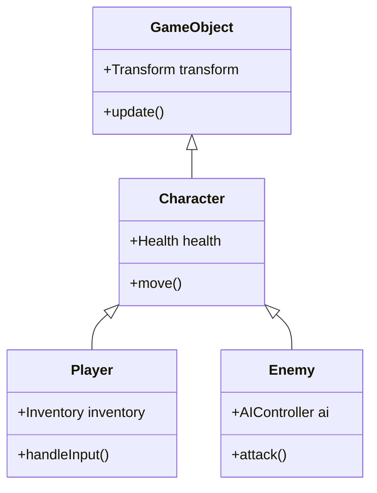

プログラミング言語の進化の歴史は、複雑性との戦いの歴史でもあります。ソフトウェアが大規模化するにつれて、[状態管理](https://kenji.blog/p/state-management-history-future/)やパフォーマンス、保守性の壁に直面し、それらを乗り越えるための様々な **プログラミングパラダイム** が提唱されてきました。

本記事では、現代のソフトウェア開発において主流となっている **オブジェクト指向プログラミング** （OOP）、数学的な堅牢性を持つ **関数型プログラミング** （FP）、そしてパフォーマンスとデータの分離に焦点を当てた **データ指向プログラミング** （DOP / DOD）について、それぞれの思想、強み、そして **限界** を深掘りします。さらに、現代の強力な言語（[Rust](https://kenji.blog/p/webassembly-wasm-current-future/)やTypeScriptなど）がこれらをどう **融合** させているのかを解説します。

---

## 1. オブジェクト指向プログラミング (OOP) の栄枯盛衰

**オブジェクト指向** （Object-Oriented Programming）は、1990年代から2010年代にかけて、ソフトウェア開発の絶対的な王者として君臨しました。JavaやC++、C#などの言語がこのパラダイムを牽引し、現実世界をモデリングするという直感的なアプローチが受け入れられました。

### 1.1 OOPのコアコンセプト

OOPの目的は、「データ」とそのデータを操作する「振る舞い」を一つの **オブジェクト** にカプセル化することです。

- **カプセル化** : 内部の状態を隠蔽し、外部からは公開されたメソッドを通してのみ操作を許可する。
- **継承** : 既存のクラスを拡張し、コードの再利用性を高める。
- **ポリモーフィズム** : 同一のインターフェースで異なる実装を切り替える。

```typescript
// TypeScriptによる典型的なOOPの例
abstract class Animal {
    protected name: string;
    
    constructor(name: string) {
        this.name = name;
    }
    
    abstract speak(): void;
}

class Dog extends Animal {
    speak(): void {
        console.log(`${this.name} says Woof!`);
    }
}

class Cat extends Animal {
    speak(): void {
        console.log(`${this.name} says Meow!`);
    }
}

const animals: Animal[] = [new Dog("Buddy"), new Cat("Kitty")];
animals.forEach(a => a.speak());
```

### 1.2 OOPの限界と「バナナとゴリラ問題」

OOPは一見すると完璧なモデリング手法に思えますが、システムが大規模化するにつれて **継承の乱用** と **暗黙の[状態管理](https://kenji.blog/p/state-management-history-future/)** という致命的な問題を引き起こしました。

有名な言葉に、Joe Armstrong（Erlangの生みの親）の以下の発言があります。

> "オブジェクト指向言語の問題点は、すべての暗黙の環境が一緒に付いてくることだ。バナナが欲しかったのに、バナナを持ったゴリラとジャングル全体が付いてきてしまう。"



深い継承ツリーは、コードの依存関係を複雑にし、特定の機能だけを切り出して再利用することを極めて困難にします。また、複数のオブジェクトが相互に参照し合い、状態を変更し合うことで、システム全体の予測可能性が著しく低下します。

---

## 2. 関数型プログラミング (FP) の数学的アプローチ

OOPの「状態の変異」がもたらす複雑性に対するアンチテーゼとして脚光を浴びたのが **関数型プログラミング** （Functional Programming）です。Haskell、Scala、Clojureといった言語だけでなく、現代ではJavaScriptやTypeScriptにも色濃く影響を与えています。

### 2.1 FPのコアコンセプト

FPは、プログラムを **純粋関数** の組み合わせとして構築します。

- **純粋関数** : 同じ入力に対して常に同じ出力を返し、外部の状態を変更しない（副作用を持たない）。
- **不変性 (Immutability)** : データは一度作成されたら変更されない。変更が必要な場合は、新しいデータ構造を生成する。
- **高階関数と関数合成** : 関数をデータとして扱い、組み合わせて複雑な処理を構築する。

```typescript
// TypeScriptによるFP的なアプローチ（不変性と高階関数）
type User = { readonly id: number; readonly name: string; readonly isActive: boolean };

const users: readonly User[] = [
    { id: 1, name: "Alice", isActive: true },
    { id: 2, name: "Bob", isActive: false },
    { id: 3, name: "Charlie", isActive: true }
];

// 副作用のない純粋関数
const getActiveUserNames = (users: readonly User[]): string[] => 
    users
        .filter(u => u.isActive)
        .map(u => u.name);

console.log(getActiveUserNames(users)); // ["Alice", "Charlie"]
```

FPにおける状態の変遷は、数学の関数 $f(x) = y$ と同じように表現されます。システムの状態 $S$ とアクション $A$ があるとき、新しい状態 $S'$ は次のように表せます。

$$ S' = f(S, A) $$

このように記述することで、コードのテストが極めて容易になり、並行処理（マルチスレッド）における競合状態（データレース）を根本から排除できます。

### 2.2 FPの限界：「現実世界」との不和

関数型パラダイムにも限界はあります。コンピュータは本質的に状態を持つ機械（フォン・ノイマン型アーキテクチャ）であり、純粋なFPはCPUの動作原理から乖離しています。

不変性を保つためのメモリ割り当て（[ガベージコレクション](https://kenji.blog/p/memory-management-garbage-collection/)への負荷）や、I/O（画面出力、データベース書き込み）のような「どうしても避けられない副作用」を扱うためのモナドなど、概念的な学習コストが高く、時にパフォーマンスのボトルネックとなります。

---

## 3. データ指向プログラミング (DOP/DOD) への回帰

**データ指向設計** （Data-Oriented Design）または **データ指向プログラミング** は、ゲーム開発（特にC++や[Rust](https://kenji.blog/p/webassembly-wasm-current-future/)）の現場から生まれ、その後エンタープライズ領域（Clojureの思想など）にも波及したパラダイムです。

### 3.1 DOPのコアコンセプト

DOPは、「データとロジックを分離する」ことを至上命題とします。OOPがデータとロジックをクラスにまとめたのに対し、DOPはそれらを引き剥がします。

- **データの分離** : データは単なるデータ構造（レコード、構造体）として定義し、振る舞いを持たせない。
- **ECS (Entity Component System)** : 継承の代わりに、データをコンポーネントとして分割し、システム（関数）がそれを一括処理する。
- **キャッシュ効率 (メモリレイアウト)** : CPUのキャッシュラインに乗るようにデータを連続したメモリ（SoA: Structure of Arrays）に配置する。

```rust
// Rustを用いたデータ指向（ECS的）なアプローチ
// 振る舞いを持たない純粋なデータ（コンポーネント）
struct Position { x: f32, y: f32 }
struct Velocity { dx: f32, dy: f32 }

// システム（ロジック）はデータ群を連続的に処理する
fn update_positions(positions: &mut [Position], velocities: &[Velocity], dt: f32) {
    // メモリ上を連続してアクセスするため、CPUキャッシュヒット率が極めて高い
    for (pos, vel) in positions.iter_mut().zip(velocities.iter()) {
        pos.x += vel.dx * dt;
        pos.y += vel.dy * dt;
    }
}
```

```mermaid
graph TD
    subgraph Data (Components)
        P[Positions Array]
        V[Velocities Array]
        H[Healths Array]
    end

    subgraph Logic (Systems)
        PhysicsSystem
        DamageSystem
    end

    PhysicsSystem -->|Reads| V
    PhysicsSystem -->|Mutates| P
    DamageSystem -->|Mutates| H
```

### 3.2 DOPの限界：ビジネスロジックへの適用の難しさ

ゲームエンジンのようなパフォーマンスが絶対的な領域ではDOP（ECS）は無敵ですが、一般的なWebアプリケーションやビジネスロジックの構築においては、コードが手続き的になりすぎ、データの関係性が分散してしまう（凝集度が下がる）というデメリットがあります。

---

## 4. パラダイムの比較検証とトレードオフ

それぞれのパラダイムには、明確な得意領域と不得意領域が存在します。

| パラダイム | 長所 | 短所 | 最適なユースケース |
| :--- | :--- | :--- | :--- |
| **OOP** | 直感的なモデリング、カプセル化による隠蔽 | 継承の複雑化、暗黙の状態変異によるバグ | GUIフレームワーク、ビジネスドメインのモデリング |
| **FP** | 並行処理への耐性、テストの容易性、予測可能性 | 学習曲線が急、パフォーマンス（GC負荷） | データ変換パイプライン、並行処理システム |
| **DOP** | 圧倒的なパフォーマンス、状態の透過性 | データの凝集度の低下、手続き的になりがち | ゲーム開発、高負荷な演算処理、組み込み |

---

## 5. 現代における最適解：パラダイムの「融合」

今日、これらの中の「唯一の正解」を選ぶことはナンセンスとされています。モダンなプログラミング言語（[Rust](https://kenji.blog/p/webassembly-wasm-current-future/)、TypeScript、Scala、Goなど）は、これらのパラダイムの **良いとこ取り** を行っています。

### 5.1 Rustが示す究極の融合

Rustは、この3つのパラダイムを驚くべきレベルで融合させています。

1. **データ指向** : `struct` と `enum` を用いたメモリ効率の良いデータ表現。
2. **関数型** : 豊富なイテレータAPI、パターンマッチング、不変性のデフォルト化。
3. **オブジェクト指向** : `trait` によるポリモーフィズムと、データのカプセル化。

```rust
// 状態（データ）と振る舞いの分離、そしてパターンマッチング
enum Event {
    Click(i32, i32),
    KeyPress(char),
}

struct AppState {
    click_count: u32,
    last_key: Option<char>,
}

// 関数型のアプローチを取り入れた状態更新ロジック
fn process_event(state: &mut AppState, event: Event) {
    match event {
        Event::Click(_x, _y) => {
            state.click_count += 1;
        },
        Event::KeyPress(c) => {
            state.last_key = Some(c);
        }
    }
}
```

このコードでは、`enum` による直和型（関数型の特徴）を用いつつ、データ指向的に状態を集中管理しています。

### 5.2 TypeScriptにおける実践的アーキテクチャ

TypeScriptを用いたフロントエンド開発（Reactなど）においても、パラダイムの融合が標準となっています。

- コンポーネントのUIレンダリングは **関数型** （純粋関数としてUIを返す）。
- データのフェッチやキャッシュ管理は **データ指向** （[Redux](https://kenji.blog/p/state-management-history-future/)やZustandによる正規化された状態ツリー）。
- 複雑なドメインロジックの一部には **オブジェクト指向** （クラスベースのサービス層）。

---

## 6. 結論

**オブジェクト指向** 、**関数型** 、**データ指向** 。これらは互いに排他的な宗教ではありません。

重要なのは、私たちが解決しようとしているドメインの性質を見極めることです。パフォーマンスが最優先なら **データ指向** の要素を強め、並行処理やデータの変換フローが中心なら **関数型** のアプローチを採用し、複雑な業務ルールやカプセル化が必要な局所的なドメインには **オブジェクト指向** のテクニックを用いる。

> "プログラミングパラダイムは、私たちが何をするべきかを教えてくれるものではなく、**何をすべきでないか** を教えてくれる制約である。" — Robert C. Martin

パラダイムの壁を越え、複数の武器を文脈に合わせて使い分けることこそが、次世代のソフトウェアエンジニアに求められる最も重要なスキルと言えるでしょう。
