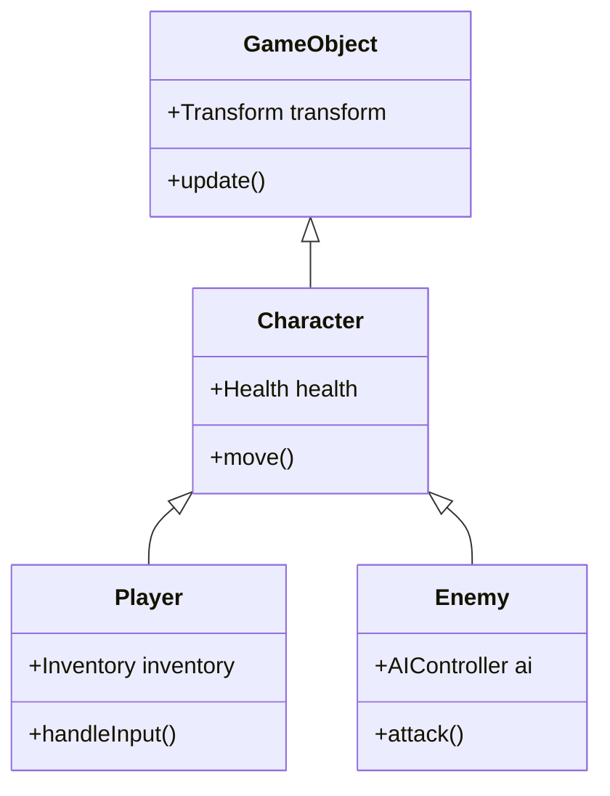
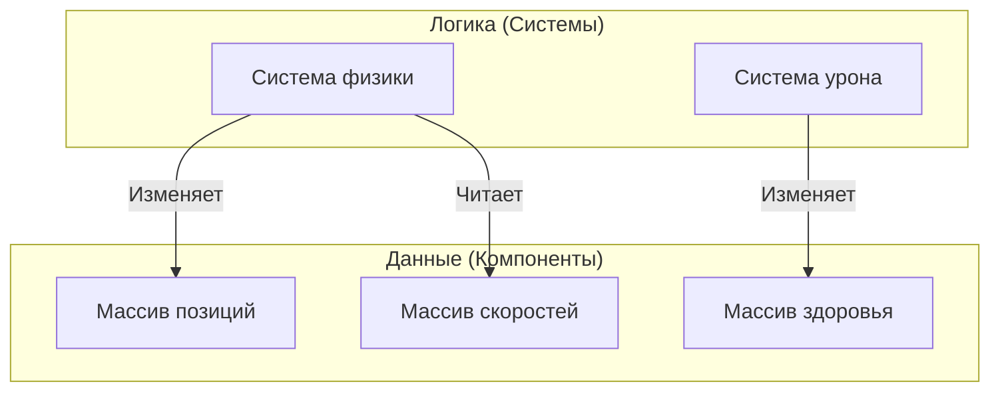

История эволюции языков программирования — это также история борьбы со сложностью. По мере того как программное обеспечение становилось все более масштабным, разработчики сталкивались со стенами в управлении состоянием, производительностью и сопровождаемостью, и для их преодоления были предложены различные **парадигмы программирования**.

В этой статье мы углубимся в философию, сильные стороны и **ограничения** доминирующего в современной разработке ПО **объектно-ориентированного программирования** (ООП), математически надежного **функционального программирования** (ФП), а также **дата-ориентированного программирования** (ДОП / DOD), ориентированного на производительность и разделение данных. Кроме того, мы объясним, как современные мощные языки (такие как [Rust](https://kenji.blog/ru/p/webassembly-wasm-current-future/) и TypeScript) **объединяют** их.

---

## 1. Взлет и падение объектно-ориентированного программирования (ООП)

**Объектно-ориентированное** (Object-Oriented Programming) программирование господствовало как абсолютный король разработки ПО с 1990-х по 2010-е годы. Такие языки, как Java, C++ и C#, двигали эту парадигму, и интуитивно понятный подход моделирования реального мира получил широкое признание.

### 1.1 Ключевые концепции ООП

Цель ООП — инкапсулировать "данные" и "поведение", управляющее этими данными, в один **объект**.

- **Инкапсуляция**: Скрытие внутреннего состояния и разрешение операций только через публичные методы.
- **Наследование**: Расширение существующих классов для повышения возможности повторного использования кода.
- **Полиморфизм**: Переключение между различными реализациями с использованием одного и того же интерфейса.

```typescript
// Типичный пример ООП на TypeScript
abstract class Animal {
    protected name: string;
    
    constructor(name: string) {
        this.name = name;
    }
    
    abstract speak(): void;
}

class Dog extends Animal {
    speak(): void {
        console.log(`${this.name} says Woof!`);
    }
}

class Cat extends Animal {
    speak(): void {
        console.log(`${this.name} says Meow!`);
    }
}

const animals: Animal[] = [new Dog("Buddy"), new Cat("Kitty")];
animals.forEach(a => a.speak());
```

### 1.2 Ограничения ООП и проблема «банана и гориллы»

На первый взгляд ООП кажется идеальным методом моделирования, но по мере роста систем оно привело к фатальным проблемам: **злоупотреблению наследованием** и **неявному управлению состоянием**.

Известна цитата Джо Армстронга (создателя Erlang):

> "Проблема объектно-ориентированных языков в том, что они тащат за собой всю неявную среду. Вы хотели банан, а получили гориллу, держащую банан, и все джунгли в придачу."



Глубокие деревья наследования усложняют зависимости кода и делают крайне трудным извлечение и повторное использование только определенных функций. Кроме того, когда множество объектов ссылаются друг на друга и изменяют состояния друг друга, предсказуемость всей системы значительно снижается.

---

## 2. Математический подход функционального программирования (ФП)

**Функциональное программирование** (Functional Programming) оказалось в центре внимания как антитеза сложности, вызванной "мутацией состояния" в ООП. Оно не только повлияло на такие языки, как Haskell, Scala и Clojure, но и оказало сильное влияние на современные JavaScript и TypeScript.

### 2.1 Ключевые концепции ФП

ФП строит программы как комбинацию **чистых функций**.

- **Чистые функции**: Всегда возвращают один и тот же результат для одних и тех же входных данных и не изменяют внешнее состояние (не имеют побочных эффектов).
- **Неизменяемость (Immutability)**: Данные не изменяются после создания. Если требуются изменения, генерируется новая структура данных.
- **Функции высшего порядка и композиция функций**: Отношение к функциям как к данным и их комбинирование для построения сложной логики.

```typescript
// Подход ФП на TypeScript (неизменяемость и функции высшего порядка)
type User = { readonly id: number; readonly name: string; readonly isActive: boolean };

const users: readonly User[] = [
    { id: 1, name: "Alice", isActive: true },
    { id: 2, name: "Bob", isActive: false },
    { id: 3, name: "Charlie", isActive: true }
];

// Чистая функция без побочных эффектов
const getActiveUserNames = (users: readonly User[]): string[] => 
    users
        .filter(u => u.isActive)
        .map(u => u.name);

console.log(getActiveUserNames(users)); // ["Alice", "Charlie"]
```

Переход состояний в ФП выражается так же, как математическая функция $f(x) = y$. Если есть состояние системы $S$ и действие $A$, новое состояние $S'$ можно выразить следующим образом:

$ S' = f(S, A) $

Записывая таким образом, код становится чрезвычайно легко тестировать, а состояние гонки (data race) при параллельной обработке (многопоточности) полностью устраняется на фундаментальном уровне.

### 2.2 Ограничения ФП: конфликт с «реальным миром»

Функциональная парадигма тоже имеет свои ограничения. Компьютеры по своей сути являются машинами, имеющими состояние (архитектура фон Неймана), а чистое ФП отклоняется от принципов работы процессора.

Распределение памяти для поддержания неизменяемости (нагрузка на сборщик мусора) и монады, необходимые для обработки "неизбежных побочных эффектов", таких как ввод/вывод (вывод на экран, запись в базу данных), имеют высокую концептуальную стоимость обучения и иногда становятся узким местом производительности.

---

## 3. Возврат к дата-ориентированному программированию (ДОП / DOD)

**Дата-ориентированное проектирование** (Data-Oriented Design) или **дата-ориентированное программирование** — это парадигма, родившаяся в разработке игр (особенно C++ и [Rust](https://kenji.blog/ru/p/webassembly-wasm-current-future/)) и впоследствии распространившаяся на корпоративную сферу (например, философия Clojure).

### 3.1 Ключевые концепции ДОП

Основная задача ДОП — «отделить данные от логики». В то время как ООП объединяло данные и логику в классы, ДОП их разделяет.

- **Разделение данных**: Данные определяются просто как структуры данных (записи, структуры) и не имеют поведения.
- **ECS (Entity Component System)**: Вместо наследования данные разделяются на компоненты, а системы (функции) обрабатывают их пакетно.
- **Эффективность кэша (структура памяти)**: Данные размещаются в непрерывной памяти (SoA: Structure of Arrays) так, чтобы они помещались в строку кэша процессора.

```rust
// Дата-ориентированный (ECS) подход на Rust
// Чистые данные без поведения (Компоненты)
struct Position { x: f32, y: f32 }
struct Velocity { dx: f32, dy: f32 }

// Системы (логика) последовательно обрабатывают группы данных
fn update_positions(positions: &mut [Position], velocities: &[Velocity], dt: f32) {
    // Поскольку доступ к памяти осуществляется последовательно, коэффициент попадания в кэш ЦП чрезвычайно высок
    for (pos, vel) in positions.iter_mut().zip(velocities.iter()) {
        pos.x += vel.dx * dt;
        pos.y += vel.dy * dt;
    }
}
```



### 3.2 Ограничения ДОП: сложность применения к бизнес-логике

ДОП (ECS) непобедимо в областях, где производительность имеет абсолютный приоритет, таких как игровые движки. Однако при создании типичных веб-приложений и бизнес-логики его недостатком является то, что код может стать слишком процедурным, а отношения данных — фрагментированными (снижение сплоченности).

---

## 4. Сравнительный анализ парадигм и компромиссы

У каждой парадигмы есть свои четкие сильные и слабые стороны.

| Парадигма | Преимущества | Недостатки | Оптимальные варианты использования |
| :--- | :--- | :--- | :--- |
| **ООП** | Интуитивное моделирование, скрытие за счет инкапсуляции | Сложность наследования, ошибки из-за неявных мутаций состояния | GUI-фреймворки, моделирование бизнес-домена |
| **ФП** | Устойчивость к параллелизму, легкость тестирования, предсказуемость | Крутая кривая обучения, производительность (нагрузка на GC) | Конвейеры преобразования данных, системы параллельной обработки |
| **ДОП** | Потрясающая производительность, прозрачность состояния | Снижение сплоченности данных, тенденция к процедурности | Разработка игр, вычисления с высокой нагрузкой, встраиваемые системы |

---

## 5. Оптимальное решение современности: "Слияние" парадигм

Сегодня бессмысленно выбирать "единственно правильный ответ" из этих вариантов. Современные языки программирования ([Rust](https://kenji.blog/ru/p/webassembly-wasm-current-future/), TypeScript, Scala, Go и др.) берут **лучшее из всех парадигм**.

### 5.1 Rust демонстрирует окончательное слияние

Rust объединяет эти три парадигмы на поразительном уровне.

1. **Дата-ориентированность**: Эффективное с точки зрения памяти представление данных с помощью `struct` и `enum`.
2. **Функциональность**: Богатый API итераторов, сопоставление с образцом, неизменяемость по умолчанию.
3. **Объектно-ориентированность**: Полиморфизм и инкапсуляция данных с помощью `trait`.

```rust
// Разделение состояния (данных) и поведения, а также сопоставление с образцом
enum Event {
    Click(i32, i32),
    KeyPress(char),
}

struct AppState {
    click_count: u32,
    last_key: Option<char>,
}

// Логика обновления состояния с использованием функционального подхода
fn process_event(state: &mut AppState, event: Event) {
    match event {
        Event::Click(_x, _y) => {
            state.click_count += 1;
        },
        Event::KeyPress(c) => {
            state.last_key = Some(c);
        }
    }
}
```

В этом коде состояние управляется централизованно в дата-ориентированном стиле с использованием типов-сумм с помощью `enum` (характеристика функционального стиля).

### 5.2 Практическая архитектура в TypeScript

Даже во фронтенд-разработке с использованием TypeScript (например, React) слияние парадигм стало стандартом.

- Рендеринг пользовательского интерфейса компонентов является **функциональным** (возвращает UI как чистую функцию).
- Получение данных и управление кэшем — **дата-ориентированными** (нормализованное дерево состояний с помощью [Redux](https://kenji.blog/ru/p/state-management-history-future/) или [Zustand](https://kenji.blog/ru/p/state-management-history-redux-context-recoil-zustand/)).
- Часть сложной доменной логики является **объектно-ориентированной** (сервисный слой на основе классов).

---

## 6. Заключение

**Объектно-ориентированное**, **функциональное**, **дата-ориентированное**. Это не взаимоисключающие религии.

Важно определить природу домена, который мы пытаемся решить. Если производительность является главным приоритетом, усильте **дата-ориентированные** элементы. Если в центре внимания находится параллельная обработка или потоки преобразования данных, примите **функциональный** подход. А для локальных доменов, требующих сложных бизнес-правил и инкапсуляции, используйте методы **объектно-ориентированного** программирования.

> "Парадигмы программирования не говорят нам, что делать, они говорят нам, **чего не следует делать**." — Роберт С. Мартин

Преодоление барьеров парадигм и умение использовать несколько инструментов в зависимости от контекста, пожалуй, самый важный навык, который требуется от инженеров программного обеспечения следующего поколения.
