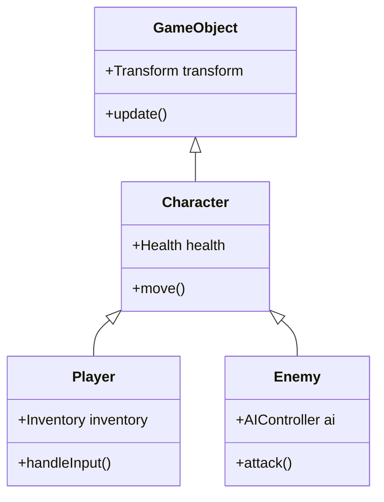
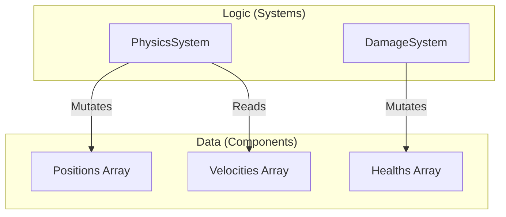

编程语言的进化历史，同时也是与复杂性作斗争的历史。随着软件规模的不断扩大，我们面临着状态管理、性能和可维护性等壁垒，为了克服这些问题，各种 **编程范式** 被相继提出。

在本文中，我们将深入探讨现代软件开发中占据主流的 **面向对象编程** （OOP）、具有数学般严谨性的 **函数式编程** （FP）、以及侧重于性能和数据分离的 **数据导向编程** （DOP / DOD），分析它们各自的思想、优势以及 **局限性** 。此外，我们还将解析现代强大的语言（如 [Rust](https://kenji.blog/zh-cn/p/webassembly-wasm-current-future/) 和 TypeScript 等）是如何将它们进行 **融合** 的。

---

## 1. 面向对象编程 (OOP) 的兴衰

**面向对象** （Object-Oriented Programming）在 1990 年代至 2010 年代期间，作为软件开发的绝对王者君临天下。Java、C++、C# 等语言引领了这一范式，其对现实世界进行建模的直观方法受到了广泛认可。

### 1.1 OOP 的核心概念

OOP 的目标是将“数据”以及操作该数据的“行为”封装在一个 **对象** 中。

- **封装** ：隐藏内部状态，仅允许通过公开的方法进行操作。
- **继承** ：扩展现有类，提高代码的可重用性。
- **多态** ：通过相同的接口切换不同的实现。

```typescript
// 使用 TypeScript 编写的典型 OOP 示例
abstract class Animal {
    protected name: string;
    
    constructor(name: string) {
        this.name = name;
    }
    
    abstract speak(): void;
}

class Dog extends Animal {
    speak(): void {
        console.log(`${this.name} 汪汪叫！`);
    }
}

class Cat extends Animal {
    speak(): void {
        console.log(`${this.name} 喵喵叫！`);
    }
}

const animals: Animal[] = [new Dog("Buddy"), new Cat("Kitty")];
animals.forEach(a => a.speak());
```

### 1.2 OOP 的局限性与“香蕉与大猩猩问题”

乍看之下，OOP 似乎是一种完美的建模方法，但随着系统规模的扩大，它引发了 **继承的滥用** 和 **隐式状态管理** 等致命问题。

Erlang 之父 Joe Armstrong 曾有一句名言：

> "面向对象语言的问题在于，它们总是带着所有隐式的环境一起出现。你本来只想要一根香蕉，但你得到的却是一只拿着香蕉的大猩猩，以及整个丛林。"



深层的继承树会使代码的依赖关系变得复杂，导致极难单独提取并重用特定功能。此外，多个对象相互引用、相互改变状态，会显著降低整个系统的可预测性。

---

## 2. 函数式编程 (FP) 的数学方法

针对 OOP 中“状态变更”带来的复杂性，作为其对立面而备受瞩目的是 **函数式编程** （Functional Programming）。它不仅影响了 Haskell、Scala、Clojure 等语言，在现代对 JavaScript 和 TypeScript 也产生了深远的影响。

### 2.1 FP 的核心概念

FP 将程序构建为 **纯函数** 的组合。

- **纯函数** ：对相同的输入总是返回相同的输出，且不改变外部状态（无副作用）。
- **不可变性 (Immutability)** ：数据一旦创建便不可更改。如果需要更改，则生成新的数据结构。
- **高阶函数与函数组合** ：将函数视为数据，通过组合它们来构建复杂的处理流程。

```typescript
// 使用 TypeScript 编写的 FP 方法（不可变性与高阶函数）
type User = { readonly id: number; readonly name: string; readonly isActive: boolean };

const users: readonly User[] = [
    { id: 1, name: "Alice", isActive: true },
    { id: 2, name: "Bob", isActive: false },
    { id: 3, name: "Charlie", isActive: true }
];

// 无副作用的纯函数
const getActiveUserNames = (users: readonly User[]): string[] => 
    users
        .filter(u => u.isActive)
        .map(u => u.name);

console.log(getActiveUserNames(users)); // ["Alice", "Charlie"]
```

FP 中的状态变更，就像数学中的函数 $f(x) = y$ 一样被表达。当存在系统状态 $S$ 和动作 $A$ 时，新状态 $S'$ 可以表示如下：

$ S' = f(S, A) $

通过这种方式进行描述，使得代码测试变得极其容易，并且能从根本上消除并发处理（多线程）中的竞态条件（数据竞争）。

### 2.2 FP 的局限性：与“现实世界”的不和

函数式范式也有其局限性。计算机本质上是带有状态的机器（冯·诺伊曼架构），纯粹的 FP 与 CPU 的工作原理存在偏差。

为了保持不可变性而进行的内存分配（对垃圾回收造成的负担），以及处理像 I/O（屏幕输出、数据库写入）这种“不可避免的副作用”时使用的单子（Monad）等，概念学习成本较高，有时也会成为性能瓶颈。

---

## 3. 回归数据导向编程 (DOP/DOD)

**数据导向设计** （Data-Oriented Design）或 **数据导向编程** 是一种源自游戏开发领域（尤其是 C++ 和 [Rust](https://kenji.blog/zh-cn/p/webassembly-wasm-current-future/)）的范式，随后也波及到了企业级领域（如 Clojure 的思想）。

### 3.1 DOP 的核心概念

DOP 的最高法则是“将数据与逻辑分离”。相较于 OOP 将数据与逻辑封装在类中，DOP 则将它们剥离开来。

- **数据分离** ：数据仅被定义为纯粹的数据结构（记录、结构体），不附带任何行为。
- **ECS (实体组件系统)** ：替代继承机制，将数据分割为组件，并由系统（函数）对它们进行批量处理。
- **缓存效率 (内存布局)** ：为了能放入 CPU 的缓存行，将数据放置在连续的内存中（SoA: Structure of Arrays）。

```rust
// 使用 Rust 编写的数据导向（类似 ECS）的方法
// 不附带行为的纯粹数据（组件）
struct Position { x: f32, y: f32 }
struct Velocity { dx: f32, dy: f32 }

// 系统（逻辑）对数据群进行连续处理
fn update_positions(positions: &mut [Position], velocities: &[Velocity], dt: f32) {
    // 由于在内存中进行连续访问，CPU 缓存命中率极高
    for (pos, vel) in positions.iter_mut().zip(velocities.iter()) {
        pos.x += vel.dx * dt;
        pos.y += vel.dy * dt;
    }
}
```



### 3.2 DOP 的局限性：应用于业务逻辑的困难

在游戏引擎等性能至上的领域，DOP（ECS）是无敌的，但在构建一般的 Web 应用程序或业务逻辑时，其缺点是代码会变得过于面向过程，并且数据之间的关系会被分散（内聚度降低）。

---

## 4. 范式的比较验证与权衡

每种范式都有其明确的擅长和不擅长的领域。

| 范式 | 优点 | 缺点 | 最佳用例 |
| :--- | :--- | :--- | :--- |
| **OOP** | 直观的建模，通过封装进行隐藏 | 继承复杂化，隐式状态变更导致的 Bug | GUI 框架，业务领域的建模 |
| **FP** | 对并发处理的容忍度，测试的容易性，可预测性 | 学习曲线陡峭，性能（GC 负担） | 数据转换流水线，并发处理系统 |
| **DOP** | 压倒性的性能，状态的透明性 | 数据内聚度降低，容易变得面向过程 | 游戏开发，高负载运算处理，嵌入式 |

---

## 5. 现代的最佳方案：范式的“融合”

如今，从中选择“唯一正确答案”被认为是荒谬的。现代编程语言（如 [Rust](https://kenji.blog/zh-cn/p/webassembly-wasm-current-future/)、TypeScript、Scala、Go 等）都在吸取这些范式的 **长处** 。

### 5.1 Rust 所展示的终极融合

Rust 在惊人的层面上融合了这三种范式。

1. **数据导向** ：使用 `struct` 和 `enum` 来实现内存高效的数据表示。
2. **函数式** ：丰富的迭代器 API、模式匹配，以及默认不可变性。
3. **面向对象** ：基于 `trait` 的多态，以及数据的封装。

```rust
// 状态（数据）与行为的分离，以及模式匹配
enum Event {
    Click(i32, i32),
    KeyPress(char),
}

struct AppState {
    click_count: u32,
    last_key: Option<char>,
}

// 引入了函数式方法的状态更新逻辑
fn process_event(state: &mut AppState, event: Event) {
    match event {
        Event::Click(_x, _y) => {
            state.click_count += 1;
        },
        Event::KeyPress(c) => {
            state.last_key = Some(c);
        }
    }
}
```

在这段代码中，既使用了基于 `enum` 的和类型（函数式的特征），又以数据导向的方式对状态进行了集中管理。

### 5.2 TypeScript 中的实践架构

在使用 TypeScript 进行前端开发（如 React 等）时，范式的融合也已成为标准。

- 组件的 UI 渲染是 **函数式** 的（作为纯函数返回 UI）。
- 数据的获取和缓存管理是 **数据导向** 的（通过 [Redux](https://kenji.blog/zh-cn/p/state-management-history-future/) 或 Zustand 规范化的状态树）。
- 复杂领域逻辑的一部分是 **面向对象** 的（基于类的服务层）。

---

## 6. 结论

**面向对象** 、 **函数式** 、 **数据导向** 。它们并不是互斥的宗教信仰。

重要的是看清我们要解决的领域的性质。如果性能是首要任务，就强化 **数据导向** 的元素；如果并发处理或数据转换流是核心，则采用 **函数式** 的方法；对于复杂的业务规则或需要封装的局部领域，则使用 **面向对象** 的技术。

> "编程范式并不会告诉我们应该做什么，而是告诉我们 **不应该做什么** 的约束。" — Robert C. Martin

跨越范式的壁垒，根据上下文灵活运用多种武器，这可以说是对下一代软件工程师提出的最重要技能。
