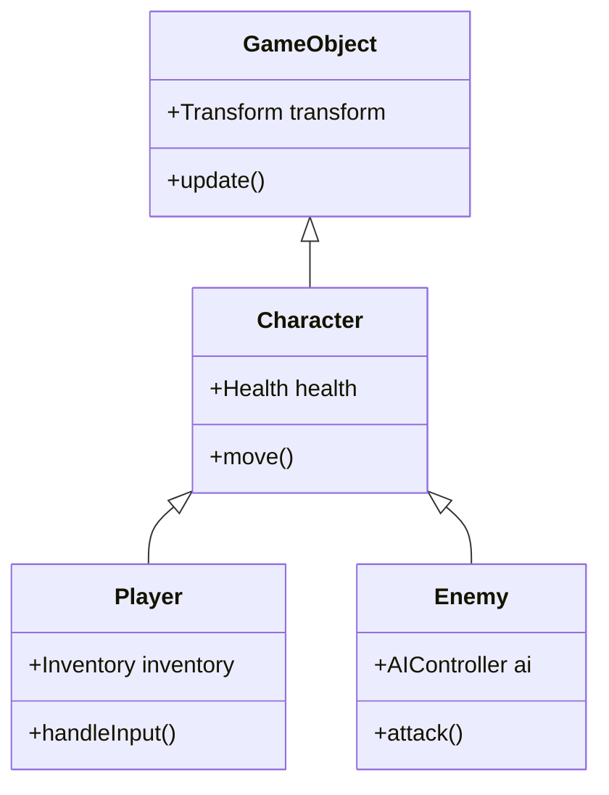
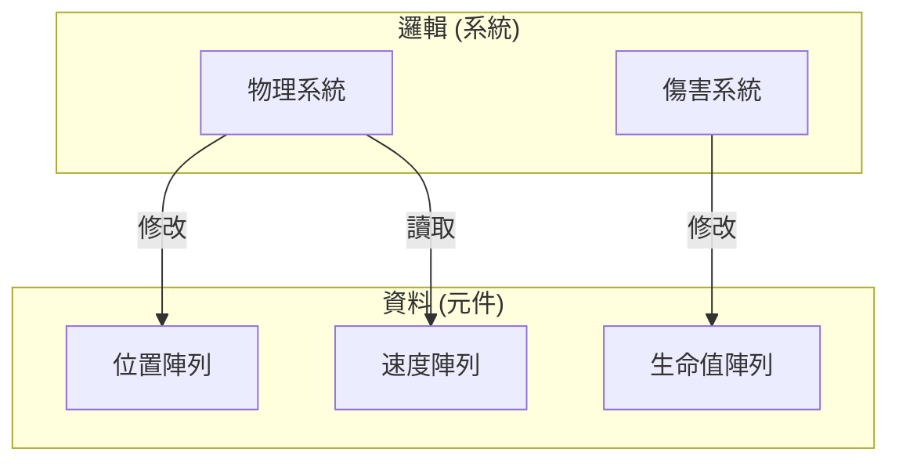

程式語言的演進歷史，同時也是與複雜性抗爭的歷史。隨著軟體規模的擴大，開發者面臨了狀態管理、效能及維護性的障礙，為了解決這些問題，提出了各種 **程式設計典範** 。

本文將針對現代軟體開發中成為主流的 **物件導向程式設計** （[OOP](https://kenji.blog/zh-tw/p/object-oriented-programming-oop-solid-principles/)）、具備數學強健性的 **函數式程式設計** （FP），以及專注於效能與資料分離的 **資料導向程式設計** （DOP / DOD），深入探討各自的思想、優勢與 **極限** 。此外，還將解說現代強大的語言（如 [Rust](https://kenji.blog/zh-tw/p/webassembly-wasm-current-future/) 與 TypeScript 等）如何將這些典範進行 **融合** 。

---

## 1. 物件導向程式設計 ([OOP](https://kenji.blog/zh-tw/p/object-oriented-programming-oop-solid-principles/)) 的興衰

**物件導向** （[Object-Oriented](https://kenji.blog/zh-tw/p/object-oriented-programming-oop-solid-principles/) Programming）在 1990 年代至 2010 年代期間，作為軟體開發的絕對王者君臨天下。[Java](https://kenji.blog/zh-tw/p/programming-languages-history-paradigm-evolution/)、C++、C# 等語言引領了這個典範，將現實世界進行建模的直觀方法廣受接受。

### 1.1 OOP 的核心概念

OOP 的目的，是將「資料」與操作該資料的「行為」封裝到單一的 **物件** 中。

- **封裝** : 隱藏內部狀態，僅允許透過對外公開的方法進行操作。
- **繼承** : 擴充現有的類別，提高程式碼的重用性。
- **多型** : 以相同的介面切換不同的實作。

```typescript
// TypeScript 中的典型 OOP 範例
abstract class Animal {
    protected name: string;
    
    constructor(name: string) {
        this.name = name;
    }
    
    abstract speak(): void;
}

class Dog extends Animal {
    speak(): void {
        console.log(`${this.name} 說 汪！`);
    }
}

class Cat extends Animal {
    speak(): void {
        console.log(`${this.name} 說 喵！`);
    }
}

const animals: Animal[] = [new Dog("Buddy"), new Cat("Kitty")];
animals.forEach(a => a.speak());
```

### 1.2 [OOP](https://kenji.blog/zh-tw/p/object-oriented-programming-oop-solid-principles/) 的極限與「香蕉與大猩猩問題」

OOP 乍看之下是完美的建模手法，但隨著系統規模擴大，卻引發了 **濫用繼承** 與 **隱含的狀態管理** 等致命問題。

Erlang 的創造者 Joe Armstrong 有一句名言：

> "物件導向語言的問題在於，所有隱含的環境都會一起被帶過來。你只想要一根香蕉，卻得到了一隻拿著香蕉的大猩猩，以及整片叢林。"



深層的繼承樹會使程式碼的依賴關係變得複雜，使得僅萃取特定功能並進行重用變得極度困難。此外，多個物件相互參照並互相改變狀態，會大幅降低整個系統的可預測性。

---

## 2. 函數式程式設計 (FP) 的數學方法

為了對抗 [OOP](https://kenji.blog/zh-tw/p/object-oriented-programming-oop-solid-principles/) 的「狀態變異」所帶來的複雜性， **函數式程式設計** （[Functional Programming](https://kenji.blog/zh-tw/p/functional-programming-concepts-pure-functions-monads/)）作為一種反命題而備受矚目。它不僅影響了 Haskell、Scala、Clojure 等語言，在現代也對 JavaScript 與 TypeScript 產生了深遠的影響。

### 2.1 FP 的核心概念

FP 將程式建構為 **純函數** 的組合。

- **純函數** : 對於相同的輸入總是回傳相同的輸出，且不會改變外部狀態（不具副作用）。
- **不變性 (Immutability)** : 資料一旦建立便不再改變。若需變更，則產生新的資料結構。
- **高階函數與函數合成** : 將函數視為資料處理，並透過組合來建構複雜的處理邏輯。

```typescript
// TypeScript 中的 FP 方法（不變性與高階函數）
type User = { readonly id: number; readonly name: string; readonly isActive: boolean };

const users: readonly User[] = [
    { id: 1, name: "Alice", isActive: true },
    { id: 2, name: "Bob", isActive: false },
    { id: 3, name: "Charlie", isActive: true }
];

// 沒有副作用的純函數
const getActiveUserNames = (users: readonly User[]): string[] => 
    users
        .filter(u => u.isActive)
        .map(u => u.name);

console.log(getActiveUserNames(users)); // ["Alice", "Charlie"]
```

FP 中的狀態變遷，能如同數學函數 $f(x) = y$ 一般來表現。當存在系統狀態 $S$ 與動作 $A$ 時，新狀態 $S'$ 可以表示如下：

$ S' = f(S, A) $

透過這樣的撰寫方式，程式碼的測試會變得極為容易，也能從根本上排除並行處理（多執行緒）中的競爭危害（資料競爭）。

### 2.2 FP 的極限：與「現實世界」的不和諧

函數式典範也有其極限。電腦本質上是具有狀態的機器（馮·紐曼架構），而純粹的 FP 偏離了 CPU 的運作原理。

為了保持不變性而進行的記憶體配置（對垃圾回收器的負擔），以及為了處理如 I/O（螢幕輸出、資料庫寫入）這類「絕對無法避免的副作用」所使用的單子（[Monad](https://kenji.blog/zh-tw/p/functional-programming-concepts-pure-functions-monads/)）等，都具有較高的概念學習成本，有時甚至會成為效能瓶頸。

---

## 3. 回歸資料導向程式設計 (DOP/DOD)

**資料導向設計** （Data-Oriented Design）或 **資料導向程式設計** ，是誕生於遊戲開發（特別是 C++ 與 [Rust](https://kenji.blog/zh-tw/p/webassembly-wasm-current-future/)）現場，隨後波及企業領域（如 Clojure 的思想）的一種典範。

### 3.1 DOP 的核心概念

DOP 將「分離資料與邏輯」視為最高使命。相較於 [OOP](https://kenji.blog/zh-tw/p/object-oriented-programming-oop-solid-principles/) 將資料與邏輯整合在類別中，DOP 則是將兩者剝離。

- **資料的分離** : 將資料定義為純粹的資料結構（記錄、結構體），不賦予任何行為。
- **ECS (實體元件系統)** : 以將資料分割為元件的方式取代繼承，並由系統（函數）進行批次處理。
- **快取效率 (記憶體佈局)** : 為了能進入 CPU 的快取線，將資料配置於連續的記憶體中（SoA: 結構體陣列）。

```rust
// 使用 Rust 的資料導向（ECS 式）方法
// 不具行為的純資料（元件）
struct Position { x: f32, y: f32 }
struct Velocity { dx: f32, dy: f32 }

// 系統（邏輯）連續處理資料群
fn update_positions(positions: &mut [Position], velocities: &[Velocity], dt: f32) {
    // 因為連續存取記憶體，CPU 快取命中率極高
    for (pos, vel) in positions.iter_mut().zip(velocities.iter()) {
        pos.x += vel.dx * dt;
        pos.y += vel.dy * dt;
    }
}
```



### 3.2 DOP 的極限：應用於業務邏輯的困難

在如遊戲引擎這類效能至上的領域中，DOP（ECS）是無敵的，但在建構一般的 Web 應用程式或業務邏輯時，會面臨程式碼過度程序化，導致資料的關聯性分散（內聚力降低）的缺點。

---

## 4. 典範的比較驗證與權衡

每個典範都有其明確的擅長與不擅長領域。

| 典範 | 優點 | 缺點 | 最佳使用案例 |
| :--- | :--- | :--- | :--- |
| **[OOP](https://kenji.blog/zh-tw/p/object-oriented-programming-oop-solid-principles/)** | 直觀的建模，透過封裝進行隱藏 | 繼承的複雜化，隱含狀態變異導致的 Bug | GUI 框架，業務領域的建模 |
| **FP** | 具備並行處理耐性，易於測試，可預測性 | 學習曲線陡峭，效能（GC 負擔） | 資料轉換管線，並行處理系統 |
| **DOP** | 壓倒性的效能，狀態的透明度 | 資料內聚力降低，容易變得程序化 | 遊戲開發，高負載運算處理，嵌入式系統 |

---

## 5. 現代的最佳解答：典範的「融合」

在今日，從中選擇「唯一正解」被認為是毫無意義的。現代的程式語言（如 [Rust](https://kenji.blog/zh-tw/p/webassembly-wasm-current-future/)、TypeScript、Scala、[Go](https://kenji.blog/zh-tw/p/programming-languages-history-paradigm-evolution/) 等）都在吸取這些典範的 **優點** 。

### 5.1 [Rust](https://kenji.blog/zh-tw/p/programming-languages-history-paradigm-evolution/) 所展現的終極融合

Rust 以令人驚嘆的程度，將這三個典範融合在一起。

1. **資料導向** : 使用 `struct` 與 `enum` 實現具備高記憶體效率的資料表示。
2. **函數式** : 豐富的迭代器 API、模式匹配，以及預設的不變性。
3. **物件導向** : 透過 `trait` 實現多型與資料的封裝。

```rust
// 狀態（資料）與行為的分離，以及模式匹配
enum Event {
    Click(i32, i32),
    KeyPress(char),
}

struct AppState {
    click_count: u32,
    last_key: Option<char>,
}

// 融入函數式方法的狀態更新邏輯
fn process_event(state: &mut AppState, event: Event) {
    match event {
        Event::Click(_x, _y) => {
            state.click_count += 1;
        },
        Event::KeyPress(c) => {
            state.last_key = Some(c);
        }
    }
}
```

在這段程式碼中，不僅使用了基於 `enum` 的和型別（函數式的特徵），同時也以資料導向的方式集中管理狀態。

### 5.2 TypeScript 中的實用架構

在使用 TypeScript 進行前端開發（如 React 等）時，典範的融合也已成為標準。

- 元件的 UI 渲染是 **函數式** 的（作為純函數回傳 UI）。
- 資料的獲取與快取管理是 **資料導向** 的（透過 [Redux](https://kenji.blog/zh-tw/p/state-management-history-future/) 或 [Zustand](https://kenji.blog/zh-tw/p/state-management-history-redux-context-recoil-zustand/) 進行正規化的狀態樹）。
- 複雜的領域邏輯的一部分則是 **物件導向** 的（基於類別的服務層）。

---

## 6. 結論

**物件導向** 、 **函數式** 、 **資料導向** 。這些彼此並非互斥的宗教。

重要的是，看清我們試圖解決的領域的性質。若效能是首要考量，就增強 **資料導向** 的元素；若以並行處理或資料轉換流程為中心，則採用 **函數式** 的方法；對於需要複雜業務規則或封裝的局部領域，則使用 **物件導向** 的技巧。

> "程式設計典範不是告訴我們應該做什麼，而是告訴我們 **不應該做什麼** 的限制。" — Robert C. Martin

跨越典範的隔閡，根據上下文靈活運用多種武器，這可以說是對次世代軟體工程師而言最重要的一項技能。
