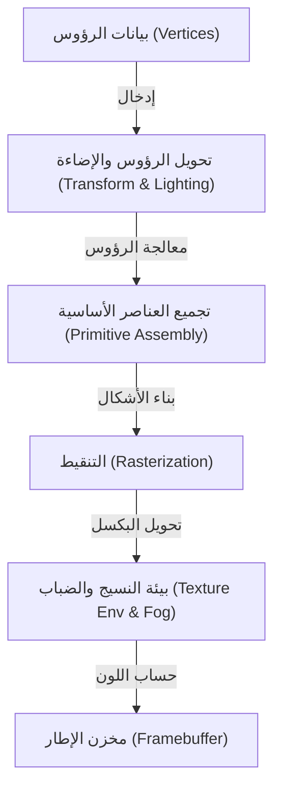
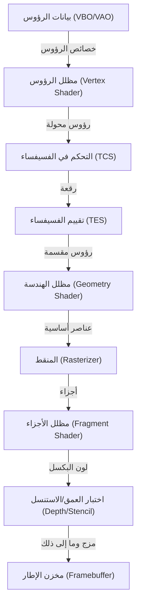
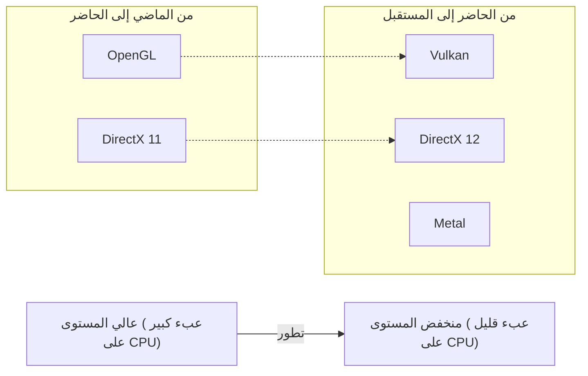

# 1. مقدمة

الرسومات ثلاثية الأبعاد في الحواسيب الحديثة لم تعد حكرًا على بعض المتخصصين. تقنيات الرسومات ثلاثية الأبعاد تُستخدم في كل مكان: من الألعاب على الهواتف الذكية، إلى تصوير البيانات في متصفحات الويب، والمؤثرات البصرية في الأفلام، وبرامج التصميم بمساعدة الحاسوب (CAD)، والواقع الافتراضي/المعزز (VR/AR). ومع ذلك، قبل أن تنتشر هذه التقنيات على نطاق واسع كما هي اليوم، كانت هناك معركة طويلة لتوحيد البرمجيات (API) بالتوازي مع تطور الأجهزة.

تركز هذه المقالة على "OpenGL (Open Graphics Library)"، التي تربعت على عرش المعيار الفعلي لواجهات برمجة تطبيقات الرسومات ثلاثية الأبعاد (3D Graphics API) لسنوات عديدة. سنغوص بعمق لنشرح الخلفية التاريخية لكيفية ولادة وتطور OpenGL، وآليات عمل خط أنابيب الرسومات القابل للبرمجة الحديث، والخلفية الرياضية باستخدام عمليات المصفوفات، بالإضافة إلى أمثلة تطبيقية ملموسة باستخدام C/C++ و GLSL.

---

# 2. تاريخ OpenGL: من SGI و IRIS GL إلى معيار قياسي

## 2.1 ولادة Silicon Graphics, Inc. (SGI) و IRIS GL

خلال الثمانينيات والتسعينيات، كانت الشركة المهيمنة تمامًا في مجال الرسومات الحاسوبية ثلاثية الأبعاد (CG) هي Silicon Graphics, Inc. (SGI)، التي أسسها جيم كلارك. كانت محطات عمل SGI مزودة بأجهزة رسومات مخصصة وكانت تتمتع بأداء غير مسبوق في الرسم ثلاثي الأبعاد في ذلك الوقت. من المعروف أن أجهزة كمبيوتر SGI استُخدمت في إنتاج المؤثرات البصرية لأفلام مثل "الحديقة الجوراسية" و"المبيد 2".

لاستخلاص أقصى أداء من أجهزة SGI، تم تطوير واجهة برمجة تطبيقات رسومات خاصة تسمى "IRIS GL (Integrated Raster Imaging System Graphics Library)". صُممت IRIS GL للسماح للمبرمجين بالتعامل بسهولة مع رسم المضلعات والإضاءة وإزالة الأسطح المخفية باستخدام Z-buffer دون الحاجة للقلق بشأن التفاصيل المعقدة للأجهزة.

ومع ذلك، واجهت IRIS GL مشكلة كبيرة: "كانت تعتمد بشكل كبير على أجهزة SGI". نمت IRIS GL لتصبح واجهة برمجة تطبيقات ضخمة تتضمن حتى التحكم في نظام النوافذ وأجهزة الإدخال، مما جعل نقلها إلى منصات أخرى (مثل محطات عمل Sun Microsystems أو HP، أو أجهزة الكمبيوتر الشخصية الناشئة) أمرًا بالغ الصعوبة.

## 2.2 الانتقال إلى معيار مفتوح وولادة OpenGL

في أوائل التسعينيات، ومع اشتداد المنافسة في سوق الرسومات ثلاثية الأبعاد، اتخذت SGI قرارًا بتبسيط وتجريد IRIS GL لتعميم تقنيتها وإنشاء واجهة برمجة تطبيقات قياسية في الصناعة يمكن أن تعمل على أجهزة الشركات الأخرى.

تم فصل الاعتماد على نظام النوافذ والميزات الخاصة بـ SGI من IRIS GL، وتمت إعادة تصميمها كواجهة برمجة تطبيقات مفتوحة مخصصة لرسم الرسومات ثلاثية الأبعاد البحتة، وهكذا وُلدت "OpenGL". في عام 1992، تم الإعلان رسميًا عن OpenGL 1.0.

تم تأسيس "OpenGL Architecture Review Board (ARB)" لإدارة وصياغة مواصفات OpenGL، بمشاركة شركات كبرى مثل SGI، DEC، IBM، Intel، و Microsoft. بفضل هذا، ارتقت OpenGL من تقنية مملوكة لشركة واحدة إلى معيار قياسي للصناعة بأكملها.

## 2.3 من خط الأنابيب ذو الوظائف الثابتة إلى خط الأنابيب القابل للبرمجة

استخدمت الإصدارات الأولى من OpenGL (من 1.x إلى أوائل 2.x) بنية تُعرف باسم "خط الأنابيب ذو الوظائف الثابتة (Fixed-Function Pipeline)". وهذا يعني أن العمليات مثل الإضاءة والتحويل وتعيين النسيج (texture mapping) كانت ثابتة داخل الأجهزة، وكان المبرمجون يقومون بالرسم فقط عن طريق تعيين المعلمات (مثل موضع ولون الضوء، وخصائص المواد، إلخ).



كان خط الأنابيب ذو الوظائف الثابتة سهل الاستخدام للغاية ومثاليًا للمبتدئين لتعلم الرسومات ثلاثية الأبعاد. (قد يتذكر الكثيرون دوال مثل `glBegin()`, `glEnd()`, و `glVertex3f()`).

ولكن في الألفينيات، مع التطور السريع لوحدات معالجة الرسومات (GPU)، بدأ المطورون في المطالبة بـ "إجراء تظليل مخصص (shading)" و"معالجة سريعة عبر الأجهزة للرسومات غير الواقعية مثل toon rendering (NPR)".

تلبيةً لذلك، تم تقديم "GLSL (OpenGL Shading Language)" في OpenGL 2.0 (عام 2004)، مما سمح باستبدال أجزاء من معالجة وحدة معالجة الرسومات ببرامج (shaders) يكتبها المبرمجون. ثم مع OpenGL 3.1 (عام 2009) والملف الأساسي (Core Profile) لـ OpenGL 3.2، أصبح خط الأنابيب ذو الوظائف الثابتة مهجورًا (وأُزيل لاحقًا)، مما يمثل انتقالًا كاملًا إلى "خط الأنابيب القابل للبرمجة".

---

# 3. OpenGL الحديث وتفاصيل خط أنابيب الرسومات

في OpenGL الحديث (الإصدار 3.3 Core Profile وما بعده)، يجب على المبرمجين التحكم في كل مرحلة من مراحل خط أنابيب الرسومات بأنفسهم. يوضح الشكل التالي تدفق خط الأنابيب.



## 3.1 دور كل مرحلة

1. **مظلل الرؤوس (Vertex Shader)**: إلزامي. يُنفذ لكل رأس مُدخل. دوره الرئيسي هو تحويل الإحداثيات المحلية للرأس إلى إحداثيات على الشاشة (مساحة القص - Clip Space).
2. **مظلل الفسيفساء (Tessellation Shaders)**: اختياري. يقسم المضلعات إلى مضلعات أصغر، مما يؤدي إلى إنشاء أشكال أكثر تفصيلاً.
3. **مظلل الهندسة (Geometry Shader)**: اختياري. يستقبل مجموعة من الرؤوس (نقطة، خط، مثلث) ويمكنه إنشاء أشكال جديدة أو تجاهلها.
4. **المنقط (Rasterizer)**: وظيفة ثابتة. يحول الأشكال الرياضية (المضلعات) إلى "أجزاء (fragments)" تتوافق مع وحدات البكسل على الشاشة. هنا يتم استيفاء (Interpolation) الخصائص بين الرؤوس.
5. **مظلل الأجزاء (Fragment Shader)**: إلزامي. يُنفذ لكل جزء (fragment)، ويحسب لون البكسل النهائي (RGBA) وقيمة العمق. تتم هنا عمليات أخذ عينات النسيج (texture sampling) وحسابات الإضاءة.
6. **الاختبارات المختلفة والمزج**: يتم إجراء اختبار العمق (إعطاء الأولوية لرسم الأشياء الأقرب)، واختبار الاستنسل، ومزج ألفا (alpha blending)، وتُكتب أخيرًا في مخزن الإطار (framebuffer).

---

# 4. رياضيات المصفوفات وتحويل الإحداثيات

لرسم كائنات من الفضاء ثلاثي الأبعاد على شاشة ثنائية الأبعاد، يجب تحويل العديد من أنظمة الإحداثيات (المساحات) بالتسلسل. يتم تحقيق ذلك من خلال الجبر الخطي باستخدام "المصفوفات (Matrix)".

## 4.1 التحويل من المساحة المحلية إلى مساحة الشاشة

بشكل عام، يتم إجراء التحويل بضرب المصفوفات الثلاثة التالية. يُسمى هذا **مصفوفة MVP (Model-View-Projection Matrix)**.

$$
V_{clip} = M_{projection} \cdot M_{view} \cdot M_{model} \cdot V_{local}
$$

1. **مصفوفة النموذج ($M_{model}$)**:
   تضع نظام الإحداثيات المحلي (Local Space) للكائن نفسه في نظام الإحداثيات العالمي (World Space). تقوم بالترجمة (Translation)، الدوران (Rotation)، والقياس (Scaling).
2. **مصفوفة العرض ($M_{view}$)**:
   تحول إحداثيات مساحة العالم إلى المساحة المنظور إليها من الكاميرا (View Space / Camera Space). تحريك الكاميرا للخلف يعادل تحريك العالم كله للأمام.
3. **مصفوفة الإسقاط ($M_{projection}$)**:
   التحويل من مساحة العرض إلى مساحة القص (Clip Space). هناك إسقاط منظوري (Perspective Projection) وإسقاط متعامد (Orthographic Projection). في حالة الإسقاط المنظوري، يُنتج تأثير جعل الأشياء البعيدة تبدو أصغر (المنظور).

## 4.2 هيكل مصفوفة الإسقاط المنظوري

مصفوفة الإسقاط المنظوري مهمة جدًا. باستخدام مجال الرؤية (FOV)، نسبة العرض إلى الارتفاع (Aspect)، المستوى القريب (Near)، والمستوى البعيد (Far)، يتم بناء مصفوفة 4x4 التالية.

$$
\begin{bmatrix}
\frac{1}{\text{aspect} \cdot \tan(\text{fov}/2)} & 0 & 0 & 0 \\
0 & \frac{1}{\tan(\text{fov}/2)} & 0 & 0 \\
0 & 0 & -\frac{\text{far} + \text{near}}{\text{far} - \text{near}} & -\frac{2 \cdot \text{far} \cdot \text{near}}{\text{far} - \text{near}} \\
0 & 0 & -1 & 0
\end{bmatrix}
$$

تُغيّر هذه المصفوفة عنصر W (نظام الإحداثيات المتجانسة) لإحداثيات الرؤوس، ومن خلال "القسمة المنظورية (Perspective Divide)" اللاحقة، يتم تعيين إحداثيات x، y، z إلى نظام إحداثيات الجهاز الموحدة (NDC: Normalized Device Coordinates) الذي يمتد من -1.0 إلى 1.0.

---

# 5. أساسيات GLSL (OpenGL Shading Language)

باستخدام GLSL، التي تتمتع بقواعد لغوية مشابهة للغة C، نكتب البرامج التي تعمل على وحدة معالجة الرسومات.

## 5.1 مظلل الرؤوس (Vertex Shader)

```glsl
#version 330 core
layout (location = 0) in vec3 aPos;     // موقع الرأس
layout (location = 1) in vec2 aTexCoord; // إحداثيات النسيج

out vec2 TexCoord; // المتغير المُرسل إلى مظلل الأجزاء

uniform mat4 model;
uniform mat4 view;
uniform mat4 projection;

void main()
{
    // ضرب مصفوفة MVP للتحويل إلى مساحة القص
    gl_Position = projection * view * model * vec4(aPos, 1.0);
    TexCoord = aTexCoord;
}
```

## 5.2 مظلل الأجزاء (Fragment Shader)

```glsl
#version 330 core
out vec4 FragColor;

in vec2 TexCoord; // مستوفاة ومُرسلة من مظلل الرؤوس

uniform sampler2D texture1; // وحدة النسيج

void main()
{
    // أخذ عينة اللون من النسيج
    FragColor = texture(texture1, TexCoord);
}
```

---

# 6. إعداد وتنفيذ OpenGL الحديث باستخدام C/C++

من هنا، سنوضح الشفرة الأساسية لإنشاء نافذة ورسم مثلث باستخدام C++ فعليًا. سنستخدم **GLFW** لإدارة النوافذ، و **GLAD** (أو GLEW) لتحميل مؤشرات دوال OpenGL.

## 6.1 التهيئة وإنشاء النافذة

```cpp
#include <glad/glad.h>
#include <GLFW/glfw3.h>
#include <iostream>

// دالة رد الاتصال عند تغيير حجم النافذة
void framebuffer_size_callback(GLFWwindow* window, int width, int height) {
    glViewport(0, 0, width, height);
}

int main() {
    // 1. تهيئة GLFW
    glfwInit();
    // تحديد OpenGL 3.3 Core Profile
    glfwWindowHint(GLFW_CONTEXT_VERSION_MAJOR, 3);
    glfwWindowHint(GLFW_CONTEXT_VERSION_MINOR, 3);
    glfwWindowHint(GLFW_OPENGL_PROFILE, GLFW_OPENGL_CORE_PROFILE);

#ifdef __APPLE__
    glfwWindowHint(GLFW_OPENGL_FORWARD_COMPAT, GL_TRUE); // لأنظمة macOS
#endif

    // 2. إنشاء النافذة
    GLFWwindow* window = glfwCreateWindow(800, 600, "LearnOpenGL", NULL, NULL);
    if (window == NULL) {
        std::cout << "Failed to create GLFW window" << std::endl;
        glfwTerminate();
        return -1;
    }
    glfwMakeContextCurrent(window);
    glfwSetFramebufferSizeCallback(window, framebuffer_size_callback);

    // 3. تهيئة GLAD (لتحميل مؤشرات دوال OpenGL الخاصة بنظام التشغيل)
    if (!gladLoadGLLoader((GLADloadproc)glfwGetProcAddress)) {
        std::cout << "Failed to initialize GLAD" << std::endl;
        return -1;
    }

    // يتبع...
```

## 6.2 بناء بيانات الرؤوس والمخازن المؤقتة (VAO, VBO)

في OpenGL الحديث، يجب نقل بيانات الرؤوس إلى ذاكرة وحدة معالجة الرسومات (VRAM) وتحديد تخطيط تلك البيانات.

```cpp
    // بيانات الرؤوس (X, Y, Z)
    float vertices[] = {
        -0.5f, -0.5f, 0.0f, // أسفل اليسار
         0.5f, -0.5f, 0.0f, // أسفل اليمين
         0.0f,  0.5f, 0.0f  // الأعلى
    };

    unsigned int VBO, VAO;
    // إنشاء وربط VAO (Vertex Array Object)
    glGenVertexArrays(1, &VAO);
    glBindVertexArray(VAO);

    // إنشاء وربط VBO (Vertex Buffer Object)
    glGenBuffers(1, &VBO);
    glBindBuffer(GL_ARRAY_BUFFER, VBO);
    
    // نقل البيانات إلى وحدة معالجة الرسومات
    glBufferData(GL_ARRAY_BUFFER, sizeof(vertices), vertices, GL_STATIC_DRAW);

    // إعداد مؤشر خصائص الرؤوس (location = 0)
    glVertexAttribPointer(0, 3, GL_FLOAT, GL_FALSE, 3 * sizeof(float), (void*)0);
    glEnableVertexAttribArray(0);

    // فك الربط (للأمان)
    glBindBuffer(GL_ARRAY_BUFFER, 0); 
    glBindVertexArray(0);
```

## 6.3 الحلقة الرئيسية (التصيير - Rendering)

بعد تصريف البرامج المظللة وربطها (نفرض أنها وُضعت في دالة هنا)، ندخل حلقة التصيير الرئيسية.

```cpp
    // تحميل وتصريف برنامج التظليل (تم حذف التنفيذ)
    // unsigned int shaderProgram = LoadShaders("vertex.glsl", "fragment.glsl");

    // الحلقة الرئيسية
    while (!glfwWindowShouldClose(window)) {
        // معالجة الإدخال (الخروج بمفتاح Escape وما إلى ذلك)
        if (glfwGetKey(window, GLFW_KEY_ESCAPE) == GLFW_PRESS)
            glfwSetWindowShouldClose(window, true);

        // 1. مسح الشاشة
        glClearColor(0.2f, 0.3f, 0.3f, 1.0f);
        glClear(GL_COLOR_BUFFER_BIT | GL_DEPTH_BUFFER_BIT);

        // 2. تفعيل المظلل
        // glUseProgram(shaderProgram);

        // 3. ربط VAO والرسم
        glBindVertexArray(VAO);
        glDrawArrays(GL_TRIANGLES, 0, 3);

        // 4. تبديل المخازن المؤقتة واستطلاع الأحداث
        glfwSwapBuffers(window);
        glfwPollEvents();
    }

    // تحرير الموارد
    glDeleteVertexArrays(1, &VAO);
    glDeleteBuffers(1, &VBO);
    // glDeleteProgram(shaderProgram);

    glfwTerminate();
    return 0;
}
```

---

# 7. الوضع الحالي ومستقبل OpenGL (Vulkan, Metal, DirectX 12)

بدءًا من تقنية SGI الحصرية IRIS GL، وولادتها في عام 1992، دعمت OpenGL الصناعة لأكثر من ربع قرن كواجهة برمجة تطبيقات قياسية عبر المنصات. ومع ذلك، بالنسبة لمعمارية الأجهزة الحديثة (وحدات المعالجة المركزية متعددة النواة ووحدات معالجة الرسومات الضخمة المتخصصة في المعالجة المتوازية)، فإن فلسفة تصميم OpenGL كـ "آلة حالة (State Machine) عالمية ضخمة" تقترب من حدودها.

بما أن OpenGL تمتلك الكثير من الحالة العالمية (Global State)، فمن الصعب إنشاء أوامر رسم في خيوط متعددة (multi-threading)، ولديها مشكلة أساسية تتمثل في زيادة العبء على وحدة المعالجة المركزية (CPU overhead).

لحل هذه المشكلة، ظهر جيل جديد من واجهات برمجة التطبيقات التي توفر طبقة تجريد أرق وذات مستوى أدنى، مما يتيح للمطورين التحكم الدقيق في ذاكرة وحدة معالجة الرسومات وعمليات المزامنة.
* **Vulkan**: واجهة برمجة تطبيقات عبر المنصات صاغتها Khronos Group، والتي تدير OpenGL، ويمكن اعتبارها خليفة OpenGL.
* **DirectX 12**: واجهة برمجة تطبيقات منخفضة المستوى تقدمها Microsoft لأنظمة Windows و Xbox.
* **Metal**: واجهة برمجة تطبيقات خاصة تقدمها Apple لأنظمة macOS و iOS (جعلت Apple تقنية OpenGL مهجورة).



## 7.1 لماذا لا يزال تعلم OpenGL مهمًا

حتى مع شيوع واجهات برمجة التطبيقات الجديدة منخفضة المستوى، فإن أهمية تعلم OpenGL لم تُفقد أبدًا. الأسباب هي كما يلي:

1. **تكلفة تعلم منخفضة**: تتطلب Vulkan و DirectX 12 مئات إلى آلاف الأسطر من التعليمات البرمجية وإعدادًا معقدًا فقط لرسم أول مثلث على الشاشة. في المقابل، تظل OpenGL نقطة دخول ممتازة لتعلم "جوهر الرسومات ثلاثية الأبعاد" مثل أساسيات خط أنابيب الرسومات، وعمليات المصفوفات، وبرمجة التظليل (shaders).
2. **الكم الهائل من الأصول الموجودة والمجتمع**: هناك عدد لا يحصى من البرامج والمحركات والدروس المكتوبة بـ OpenGL حول العالم.
3. **WebGL**: المعيار القياسي لتصيير الرسومات ثلاثية الأبعاد في المتصفحات، WebGL، يعتمد على OpenGL ES. في عالم الويب، لا تزال المعرفة بـ OpenGL مفيدة بشكل مباشر.

# 8. خاتمة

بدأت OpenGL كتقنية حصرية لمحطات عمل SGI، ونمت لتصبح معيارًا صناعيًا، ودعمت كل المجالات من الألعاب إلى الحوسبة العلمية. إن مراجعة تاريخها وفهم آلياتها الأساسية سيكون بمثابة أساس قوي لتعلم تقنيات الجيل القادم مثل Vulkan و WebGPU.

عالم برمجة الرسومات عميق، واللحظة التي تتحول فيها المعادلات والشفرات إلى صور بصرية جميلة على الشاشة تقدم إثارة لا يمكن تجربتها في مجالات البرمجة الأخرى. نأمل أن تكون هذه المقالة دافعًا لك لكتابة كود OpenGL فعليًا وبناء عالمك ثلاثي الأبعاد الخاص.
