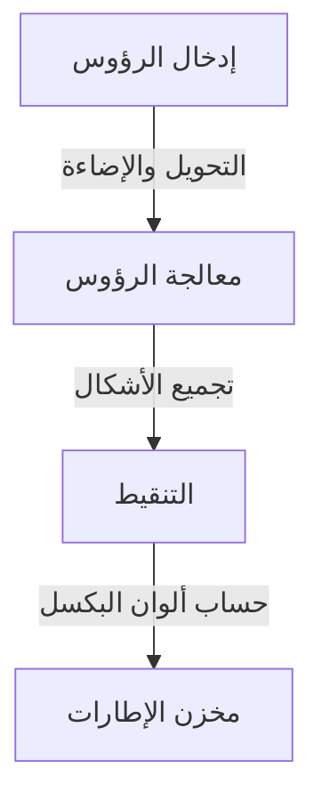
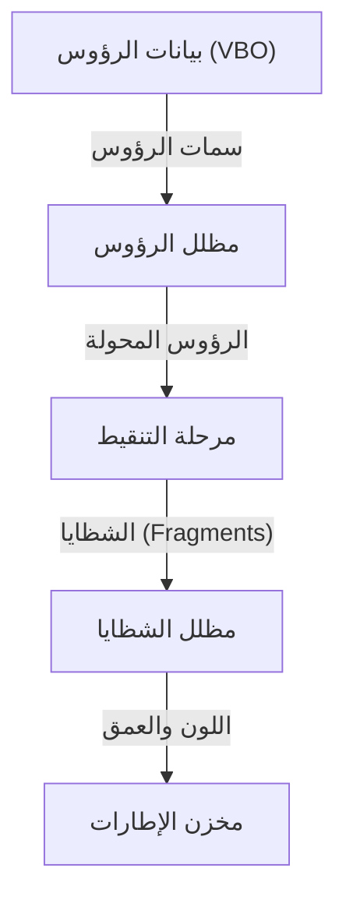

# 1. المقدمة

في بيئة الحوسبة الحديثة، أصبحت الرسوميات ثلاثية الأبعاد عنصرًا لا غنى عنه. بدءًا من ألعاب الفيديو والمؤثرات البصرية (VFX) في السينما وأنظمة CAD، وصولًا إلى تطبيقات الهواتف الذكية وتصوير البيانات عبر المتصفحات، نستفيد يوميًا من التقنيات ثلاثية الأبعاد. ومع ذلك، فإن الطريق نحو "التوحيد القياسي" لتشغيل برامج موحدة عبر منصات مختلفة مع استغلال قدرات العتاد بأقصى حد ممكن لم يكن طريقًا ممهدًا على الإطلاق.

في هذا المقال، سنتناول بالتفصيل مكتبة "OpenGL (Open Graphics Library)" التي تربعت لسنوات طويلة كمعيار فعلي (de facto standard) لواجهات برمجة تطبيقات الرسوميات ثلاثية الأبعاد. سنبدأ بالخلفية التاريخية لتطورها من معيار خاص بشركة واحدة إلى معيار قياسي مفتوح، مرورًا بآلية عمل خط أنابيب الرسوميات القابل للبرمجة (Programmable Graphics Pipeline) في العصر الحديث، والأسس الرياضية لحسابات المصفوفات المستخدمة لإسقاط الفضاء ثلاثي الأبعاد على شاشة ثنائية الأبعاد، وصولًا إلى أمثلة تطبيقية ملموسة باستخدام C/C++ ولغة التظليل GLSL.

# 2. تاريخ OpenGL: الخروج من عباءة المعايير الخاصة

## 2.1 صعود SGI وIRIS GL

بين ثمانينيات وتسعينيات القرن الماضي، كانت شركة Silicon Graphics, Inc. (SGI) تتمتع بهيمنة مطلقة في مجال رسوميات الحاسوب ثلاثية الأبعاد. وتميزت محطات العمل من SGI باحتوائها على عتاد رسومي مخصص، وكان يتم تبنيها على نطاق واسع في صناعة السينما ومؤسسات الأبحاث.

وكانت واجهة برمجة تطبيقات الرسوميات "IRIS GL" قد طُوّرت خصيصًا لعتاد SGI هذا. ورغم أن IRIS GL كانت قوية للغاية وسهلة الاستخدام، إلا أنها كانت تعتمد اعتمادًا وثيقًا على عتاد ونظام النوافذ الخاص بـ SGI، مما فرض عليها عيبًا جوهريًا تمثل في صعوبة نقلها الشديدة إلى أنظمة أخرى.

## 2.2 ولادة المعيار المفتوح

مع بداية التسعينيات، تحسن أداء الحواسيب الشخصية ومحطات العمل المنافسة، واشتدت حدة المنافسة في سوق الرسوميات، مما دفع SGI إلى اتخاذ خطوة استراتيجية لنشر تقنيتها على نطاق أوسع. تمثلت هذه الخطوة في إطلاق "OpenGL" عام 1992، بعد فصل الأجزاء المعتمدة على العتاد من IRIS GL وإعادة تصميمها كواجهة برمجة تطبيقات مفتوحة مخصصة للرسم ثلاثي الأبعاد النقي.

أصبحت مواصفات OpenGL تُدار من قبل "مجلس مراجعة بنية OpenGL (OpenGL Architecture Review Board - ARB)"، الذي ضم شركات رائدة مثل SGI وIBM وDEC وMicrosoft وIntel، مما رسّخ مكانتها كمعيار قياسي للصناعة بأكملها غير مقيد بمنصة معينة.

## 2.3 التحول النموذجي نحو خط الأنابيب القابل للبرمجة

اعتمدت الإصدارات الأولى من OpenGL على بنية تُعرف باسم "خط الأنابيب ثابت الوظائف" (Fixed-Function Pipeline). في هذا النمط، كانت عمليات مثل الإضاءة وتحويل الإحداثيات محددة مسبقًا على مستوى العتاد (أو التعريف البرمجي)، وكان المبرمج يكتفي بضبط المعاملات لتنفيذ عمليات الرسم.



وعلى الرغم من أن هذا النهج كان سهل الاستخدام [للمبتدئين](/ar/p/%D9%85%D9%86%D8%AA%D8%AC%D8%A7%D8%AA-%D8%AC%D9%84%D8%AF%D9%8A%D8%A9%E3%81%AE%E3%83%A1%E3%83%B3%E3%83%86%E3%83%8A%E3%83%B3%E3%82%B9/)، إلا أنه كان يجعل من الصعب تطبيق أساليب تظليل مخصصة (مثل التظليل الكرتوني Toon Shading) أو مؤثرات بصرية متقدمة. واستجابةً لذلك، تم تقديم لغة التظليل "GLSL (OpenGL Shading Language)" في إصدار OpenGL 2.0 (عام 2004)، لتتطور المكتبة إلى "خط الأنابيب القابل للبرمجة" (Programmable Pipeline) الذي يمكّن المطورين من برمجة سلوك وحدة معالجة الرسوميات (GPU) مباشرةً. أما اليوم، فقد تم إيقاف الميزات الثابتة أو إزالتها تمامًا، وأصبح الرسم المرن القائم على برامج التظليل (Shaders) هو الأساس.

# 3. خط أنابيب OpenGL الحديث

في الإصدارات الحديثة من OpenGL (الملف التعريفي الأساسي - Core Profile)، يتعين على المطور التحكم بدقة في كل مرحلة من مراحل خط أنابيب الرسوميات.



1. **مظلل الرؤوس (Vertex Shader)**:
   يتم تنفيذه على كل رأس (Vertex) مُدخل. ويتمثل دوره الرئيسي في تحويل الإحداثيات المحلية للنموذج إلى نظام إحداثيات القص (Clip Coordinates) من منظور الكاميرا.
2. **مرحلة التنقيط (Rasterizer)**:
   تقوم بتفكيك وتوليد الاستيفاء الداخلي للمضلعات المكونة من الرؤوس (مثل المثلثات) إلى "شظايا" (Fragments) تعادل البكسلات المقابلة على الشاشة.
3. **مظلل الشظايا (Fragment Shader)**:
   يقوم بحساب اللون النهائي (RGB) لكل شظية. وتتم هنا بشكل أساسي عمليات تطبيق الإكساءات (Textures) وحسابات الإضاءة.

# 4. أساسيات حسابات المصفوفات وتحويل الإحداثيات

لرسم مجسم موجود في فضاء ثلاثي الأبعاد بشكل صحيح على شاشة ثنائية الأبعاد، لا بد من إجراء تحويلات إحداثية باستخدام المصفوفات (Matrices). وبشكل عام، يتم التحويل عن طريق ضرب ثلاث مصفوفات معًا، وهو ما يُعرف بمصفوفة MVP (Model-View-Projection):

- **مصفوفة النموذج (Model Matrix)**:
  تقوم بنقل الكائن من فضائه المحلي الخاص إلى نظام الإحداثيات المطلق للعالم بأكمله (فضاء العالم). وتشمل هذه العمليات: الإزاحة، والتدوير، وتغيير الحجم.
- **مصفوفة الرؤية (View Matrix)**:
  تقوم بتحويل إحداثيات فضاء العالم إلى الفضاء المنظور من زاوية الكاميرا (فضاء الرؤية / View Space).
- **مصفوفة الإسقاط (Projection Matrix)**:
  تقوم بتحويل إحداثيات فضاء الرؤية إلى فضاء القص (Clip Space). وهنا يتم تطبيق الإسقاط المنظوري (Perspective Projection) الذي يُظهر الأجسام البعيدة أصغر حجمًا، وغيره من أساليب الإسقاط.

# 5. مثال تطبيقي باستخدام GLSL وC/C++

فيما يلي مثال على الشيفرة البرمجية الأساسية لمظللات GLSL المستخدمة لرسم مثلث عبر OpenGL الحديث:

## 5.1 مثال على مظلل الرؤوس (Vertex Shader)

```glsl
#version 330 core
layout (location = 0) in vec3 aPos;

uniform mat4 model;
uniform mat4 view;
uniform mat4 projection;

void main()
{
    gl_Position = projection * view * model * vec4(aPos, 1.0);
}
```

## 5.2 مثال على مظلل الشظايا (Fragment Shader)

```glsl
#version 330 core
out vec4 FragColor;

void main()
{
    FragColor = vec4(1.0, 0.5, 0.2, 1.0); // إخراج اللون البرتقالي
}
```

على جانب C/C++، يتم إنشاء نافذة باستخدام مكتبات مثل GLFW، ثم نقل بيانات الرؤوس (VBO: Vertex Buffer Object) وتخطيط سمات الرؤوس (VAO: Vertex Array Object) إلى معالج الرسوميات (GPU). بعد ذلك، وخلال حلقة التكرار الرئيسية (Main Loop)، يتم مسح الشاشة وإصدار أوامر الرسم عبر دوال مثل `glDrawArrays` باستخدام برنامج التظليل الذي تم إعداده مسبقًا.

# 6. مستقبل واجهات برمجة تطبيقات الرسوميات

رغم أن OpenGL قد ساندت الصناعة لعقود طويلة، إلا أن فلسفتها التصميمية القديمة (القائمة على آلة حالة ضخمة - Monolithic State Machine) باتت تشكل عنق زجاجة يحول دون الاستفادة الكاملة من قوة المعالجات الحديثة متعددة الأنوية ووحدات معالجة الرسوميات فائقة التوازي.

ولهذا السبب، نشهد اليوم انتقالًا متزايدًا نحو واجهات برمجة تطبيقات الجيل القادم (مثل Vulkan وDirectX 12 وMetal) التي توفر تحكمًا منخفض المستوى وأكثر قربًا من العتاد، فضلًا عن كونها محسنة للرسم متعدد المسارات (Multi-threading). ومع ذلك، ونظرًا لأن هذه الواجهات الحديثة تتطلب إجراءات تهيئة معقدة للغاية، تظل OpenGL تحتفظ بقيمة بالغة الأهمية كواجهة تعليمية ومدخل مثالي لفهم المفاهيم الجوهرية للرسوميات ثلاثية الأبعاد (مثل خط الأنابيب، وتحويل المصفوفات، والمظللات).

لذا، فإن البدء بتعلم أساسيات البرمجة ثلاثية الأبعاد باستخدام OpenGL، ثم الانتقال لاحقًا إلى تقنيات مثل Vulkan وفقًا لمتطلبات المشاريع، لا يزال أحد أكثر المسارات التعليمية الموصى بها حتى اليوم.
